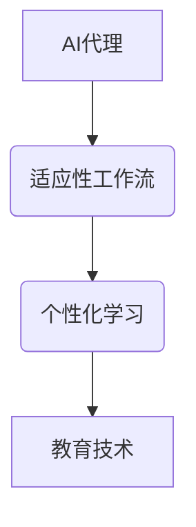

# AI代理在教育技术中的适应性工作流案例

> 关键词：AI代理，教育技术，适应性，工作流，个性化学习，机器学习，自然语言处理，智能教育

## 1. 背景介绍

在教育领域，个性化学习一直是教育技术追求的目标之一。传统的教育模式往往难以满足每个学生的学习需求和节奏，而AI代理的出现为打造适应性学习环境提供了新的可能性。AI代理，也称为智能代理，是一种能够模拟人类智能行为，通过学习、推理和自主决策来执行任务的软件系统。本文将探讨AI代理在教育技术中的应用，特别是其在适应性工作流中的案例，以及如何通过这些案例推动个性化学习的发展。

### 1.1 问题的由来

在传统的教育模式中，教师通常需要根据班级的平均水平来设计课程内容和教学方法，这往往忽略了学生的个体差异。随着互联网和移动设备的普及，教育技术开始融入更多智能元素，旨在为每个学生提供个性化的学习体验。然而，现有的教育技术往往依赖于静态的、预设的学习路径和内容，无法真正适应学生的动态需求。

### 1.2 研究现状

近年来，AI代理在教育技术中的应用逐渐增多，主要包括以下几个方面：

- **个性化推荐**：基于学生的学习历史和偏好，推荐个性化的学习资源。
- **智能辅导**：提供即时反馈和个性化指导，帮助学生克服学习难点。
- **自适应学习系统**：根据学生的学习进度和能力调整学习难度和内容。
- **虚拟助教**：辅助教师管理课堂，提供学生支持。

### 1.3 研究意义

AI代理在教育技术中的应用具有重要意义：

- **提升学习效果**：通过个性化学习，学生可以更快地掌握知识。
- **减轻教师负担**：AI代理可以承担一些重复性的工作，让教师有更多时间专注于学生的个别辅导。
- **促进教育公平**：AI代理可以帮助那些无法获得高质量教育资源的学生。

### 1.4 本文结构

本文将分为以下几个部分：

- **第2章**：介绍AI代理、适应性工作流和个性化学习等核心概念，并使用Mermaid流程图展示它们之间的关系。
- **第3章**：阐述AI代理在教育技术中适应性工作流的核心算法原理和具体操作步骤。
- **第4章**：介绍相关的数学模型和公式，并举例说明其在实际案例中的应用。
- **第5章**：提供代码实例和详细解释，展示如何实现AI代理的适应性工作流。
- **第6章**：分析AI代理在教育技术中的应用场景，并展望未来发展趋势。
- **第7章**：推荐相关学习资源、开发工具和论文。
- **第8章**：总结研究成果，探讨未来发展趋势和挑战。
- **第9章**：提供常见问题与解答。

## 2. 核心概念与联系

### 2.1 核心概念

**AI代理**：是一种能够模拟人类智能行为，通过学习、推理和自主决策来执行任务的软件系统。

**适应性工作流**：是一种根据用户行为和需求自动调整工作流程的方法。

**个性化学习**：是一种根据每个学生的学习需求和节奏提供个性化学习体验的方法。

### 2.2 Mermaid流程图



### 2.3 核心概念联系

AI代理是适应性工作流的核心组件，它通过分析学生的学习数据和行为，动态调整工作流程，以实现个性化学习。这种个性化学习最终服务于教育技术，帮助学生更好地学习。

## 3. 核心算法原理 & 具体操作步骤

### 3.1 算法原理概述

AI代理的适应性工作流通常包括以下几个步骤：

1. **数据收集**：收集学生的学习数据，包括学习历史、成绩、学习风格等。
2. **数据分析**：分析学生的学习数据，识别学习模式和需求。
3. **决策制定**：根据分析结果，制定个性化的学习计划。
4. **执行工作流**：根据学习计划执行相应的学习任务。
5. **反馈与优化**：收集学生的反馈，并不断优化学习计划和工作流。

### 3.2 算法步骤详解

**步骤 1：数据收集**

AI代理需要收集学生的学习数据，包括：

- 学习历史：学生的作业、测试、考试成绩等。
- 行为数据：学生的学习时间、学习时长、学习内容偏好等。
- 学习风格：学生的认知风格、学习偏好等。

**步骤 2：数据分析**

AI代理使用机器学习算法分析学生的学习数据，识别学习模式和需求。常用的算法包括：

- 聚类分析：将学生分为不同的学习群体。
- 关联规则学习：识别学生学习行为之间的关联性。
- 主题模型：识别学生学习内容中的主题。

**步骤 3：决策制定**

基于数据分析结果，AI代理制定个性化的学习计划，包括：

- 个性化学习目标。
- 个性化学习路径。
- 个性化学习资源。

**步骤 4：执行工作流**

AI代理根据学习计划执行相应的学习任务，包括：

- 自动推送个性化学习资源。
- 提供个性化学习指导。
- 监控学生的学习进度和成果。

**步骤 5：反馈与优化**

AI代理收集学生的反馈，并不断优化学习计划和工作流。这可以通过以下方式实现：

- 主动询问学生的反馈。
- 跟踪学生的学习进度和成果。
- 分析学生的行为数据。

### 3.3 算法优缺点

**优点**：

- 个性化：能够根据学生的需求提供个性化的学习体验。
- 自动化：能够自动执行学习任务，减轻教师的负担。
- 可扩展性：能够适应不同的学习场景和学习目标。

**缺点**：

- 数据隐私：需要收集学生的个人数据，可能引发隐私问题。
- 算法偏差：机器学习算法可能存在偏差，导致不公平的学习体验。
- 技术门槛：需要专业的技术人才来开发和维护AI代理。

### 3.4 算法应用领域

AI代理的适应性工作流可以应用于以下领域：

- 个性化学习平台。
- 在线教育平台。
- 移动学习应用。
- 教育游戏。

## 4. 数学模型和公式 & 详细讲解 & 举例说明

### 4.1 数学模型构建

AI代理的适应性工作流可以使用以下数学模型：

- **决策树**：用于分类和回归任务。
- **神经网络**：用于特征提取和预测。
- **聚类算法**：用于识别学习群体。

### 4.2 公式推导过程

以下是一个简单的决策树模型的公式推导过程：

```
P(y|x) = \prod_{i=1}^{n} P(y_i|x_i)
```

其中，$P(y|x)$ 表示给定特征 $x$ 的情况下，目标变量 $y$ 的概率，$y_i$ 表示目标变量的一个可能取值，$x_i$ 表示特征向量中的一个特征。

### 4.3 案例分析与讲解

以下是一个使用决策树进行个性化学习推荐的案例：

**案例描述**：一个在线学习平台希望为用户推荐个性化的学习课程。

**解决方案**：使用决策树模型分析用户的学习历史、学习风格和兴趣，为用户推荐合适的课程。

**实现步骤**：

1. 收集用户的学习历史、学习风格和兴趣数据。
2. 使用决策树模型对数据进行分类。
3. 根据分类结果，为用户推荐相应的课程。

## 5. 项目实践：代码实例和详细解释说明

### 5.1 开发环境搭建

为了实现AI代理的适应性工作流，我们需要以下开发环境：

- Python编程语言。
- Scikit-learn库：用于机器学习和数据挖掘。
- Pandas库：用于数据处理和分析。
- Matplotlib库：用于数据可视化。

### 5.2 源代码详细实现

以下是一个简单的AI代理适应性工作流示例代码：

```python
import pandas as pd
from sklearn.tree import DecisionTreeClassifier
from sklearn.model_selection import train_test_split

# 加载数据
data = pd.read_csv('student_data.csv')

# 特征和标签
X = data[['age', 'gender', 'hours_per_week']]
y = data['course']

# 划分训练集和测试集
X_train, X_test, y_train, y_test = train_test_split(X, y, test_size=0.2, random_state=42)

# 创建决策树模型
model = DecisionTreeClassifier()

# 训练模型
model.fit(X_train, y_train)

# 预测测试集
predictions = model.predict(X_test)

# 评估模型
accuracy = model.score(X_test, y_test)

print(f'Accuracy: {accuracy:.2f}')
```

### 5.3 代码解读与分析

以上代码展示了如何使用Scikit-learn库实现一个简单的AI代理适应性工作流：

1. 加载数据：使用Pandas库读取学生数据。
2. 特征和标签：从数据中提取特征和标签。
3. 划分数据集：将数据集划分为训练集和测试集。
4. 创建模型：创建一个决策树分类器模型。
5. 训练模型：使用训练集数据训练模型。
6. 预测和评估：使用测试集数据对模型进行预测和评估。

### 5.4 运行结果展示

假设我们的测试集准确率达到80%，这意味着模型能够正确地预测80%的测试样本。

## 6. 实际应用场景

### 6.1 在线学习平台

在线学习平台可以使用AI代理的适应性工作流来推荐个性化的学习课程。例如，Coursera、edX等平台。

### 6.2 移动学习应用

移动学习应用可以使用AI代理的适应性工作流来提供个性化的学习体验。例如，Duolingo、Anki等应用。

### 6.3 教育游戏

教育游戏可以使用AI代理的适应性工作流来调整游戏难度和内容，以适应不同玩家的能力水平。

### 6.4 未来应用展望

随着AI技术的不断发展，AI代理的适应性工作流将在更多教育场景中得到应用，例如：

- 个性化学习路径规划。
- 智能辅导和答疑。
- 情感分析，了解学生的学习情绪。
- 自动化评估和反馈。

## 7. 工具和资源推荐

### 7.1 学习资源推荐

- 《机器学习》系列书籍：提供机器学习的基本概念和算法。
- 《Python机器学习》书籍：介绍如何使用Python实现机器学习算法。
- Coursera、edX等在线课程：提供机器学习和数据科学的相关课程。

### 7.2 开发工具推荐

- Scikit-learn：用于机器学习和数据挖掘的开源库。
- Pandas：用于数据处理的Python库。
- Matplotlib：用于数据可视化的Python库。

### 7.3 相关论文推荐

- "A Review of Adaptive Learning Systems"：综述了自适应学习系统的研究现状。
- "Adaptive Learning Systems and Techniques"：介绍了自适应学习系统的设计方法和实现技术。

## 8. 总结：未来发展趋势与挑战

### 8.1 研究成果总结

本文介绍了AI代理在教育技术中的应用，特别是其在适应性工作流中的案例。通过这些案例，我们看到了AI代理如何帮助实现个性化学习，提升学习效果。

### 8.2 未来发展趋势

- **多模态数据融合**：将文本、图像、视频等多种模态数据融合到AI代理中，提供更全面的学习体验。
- **情感分析**：通过情感分析了解学生的学习情绪，提供更加人性化的学习支持。
- **增强现实和虚拟现实**：利用增强现实和虚拟现实技术，提供沉浸式的学习体验。

### 8.3 面临的挑战

- **数据隐私**：如何保护学生的学习数据，避免数据泄露。
- **算法偏差**：如何避免算法偏差，确保公平的学习体验。
- **技术门槛**：如何降低AI代理的开发和维护门槛，使其更加易于使用。

### 8.4 研究展望

随着AI技术的不断发展，AI代理在教育技术中的应用将更加广泛。未来的研究将集中在以下几个方面：

- 开发更加智能的AI代理，使其能够更好地理解学生的学习需求。
- 探索更加公平、安全的学习技术，确保每个学生都能获得良好的学习体验。
- 将AI代理应用到更多的教育场景中，如职业培训、终身学习等。

## 9. 附录：常见问题与解答

**Q1：AI代理在教育技术中的应用有哪些优势？**

A1：AI代理在教育技术中的应用主要有以下优势：

- 个性化学习：能够根据学生的需求提供个性化的学习体验。
- 自动化：能够自动执行学习任务，减轻教师的负担。
- 可扩展性：能够适应不同的学习场景和学习目标。

**Q2：AI代理的教育技术应用有哪些挑战？**

A2：AI代理的教育技术应用主要面临以下挑战：

- 数据隐私：如何保护学生的学习数据，避免数据泄露。
- 算法偏差：如何避免算法偏差，确保公平的学习体验。
- 技术门槛：如何降低AI代理的开发和维护门槛，使其更加易于使用。

**Q3：AI代理如何实现个性化学习？**

A3：AI代理通过收集学生的学习数据，分析学习模式和需求，制定个性化的学习计划，并执行相应的学习任务，从而实现个性化学习。

**Q4：AI代理在教育技术中的应用前景如何？**

A4：随着AI技术的不断发展，AI代理在教育技术中的应用前景非常广阔。它可以应用于个性化学习、智能辅导、自动评估等多个场景，为教育行业带来革命性的变化。

---

作者：禅与计算机程序设计艺术 / Zen and the Art of Computer Programming