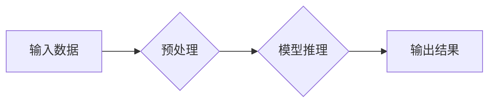

> 关键词：AI芯片，硬件加速，深度学习，神经网络，FPGA，ASIC，CUDA，TensorRT，PyTorch，TensorFlow

# AI芯片与硬件加速原理与代码实战案例讲解

AI技术的快速发展推动了人工智能在各行各业的应用，而深度学习作为AI的核心技术，其计算密集的特性对硬件提出了更高的要求。AI芯片与硬件加速技术的发展，为深度学习提供了强大的算力支持，极大地推动了AI应用的落地。本文将深入浅出地讲解AI芯片与硬件加速原理，并通过实战案例展示如何利用这些技术提升深度学习模型的性能。

## 1. 背景介绍

### 1.1 问题的由来

随着深度学习模型在图像识别、语音识别、自然语言处理等领域的广泛应用，对计算资源的需求急剧增加。传统的CPU和GPU在处理大规模深度学习模型时，往往表现出明显的性能瓶颈。为了满足深度学习的计算需求，AI芯片和硬件加速技术应运而生。

### 1.2 研究现状

目前，AI芯片和硬件加速技术主要分为以下几种：

- **FPGA**：现场可编程门阵列，具有高灵活性，可以根据不同的应用场景进行定制。
- **ASIC**：专用集成电路，针对特定算法或应用进行优化，具有高性能和低功耗的特点。
- **CPU**：中央处理器，虽然性能不如GPU和ASIC，但具有较低的功耗和成本。
- **GPU**：图形处理器，具有强大的并行计算能力，适合大规模并行计算任务。
- **ASIC/GPU加速卡**：将ASIC或GPU集成到PCIe卡中，方便用户使用。

### 1.3 研究意义

AI芯片和硬件加速技术的发展，对深度学习应用具有以下意义：

- **提高计算效率**：提供更高的计算速度，缩短训练和推理时间。
- **降低功耗**：降低计算过程中的能耗，满足移动设备和物联网设备的功耗需求。
- **提高性能**：针对特定算法进行优化，提升模型的性能。
- **降低成本**：通过硬件加速，降低计算成本，使得深度学习应用更加普及。

### 1.4 本文结构

本文将分为以下章节：

- **第2章**：核心概念与联系，介绍AI芯片和硬件加速的核心概念及其相互关系。
- **第3章**：核心算法原理与具体操作步骤，讲解深度学习算法在硬件上的实现原理和操作步骤。
- **第4章**：数学模型和公式，介绍深度学习算法的数学模型和公式，并进行详细讲解和举例说明。
- **第5章**：项目实践，通过代码实例展示如何利用AI芯片和硬件加速技术提升深度学习模型性能。
- **第6章**：实际应用场景，介绍AI芯片和硬件加速技术在各个领域的应用案例。
- **第7章**：工具和资源推荐，推荐学习资源、开发工具和参考文献。
- **第8章**：总结，展望AI芯片和硬件加速技术的未来发展趋势与挑战。
- **第9章**：附录，常见问题与解答。

## 2. 核心概念与联系

### 2.1 AI芯片

AI芯片是专门为深度学习算法设计的硬件加速器，具有以下特点：

- **并行计算**：通过并行处理加速深度学习模型的计算。
- **低功耗**：在保证计算速度的同时，降低能耗。
- **定制化**：针对特定算法或应用进行优化。

### 2.2 硬件加速

硬件加速是利用专门的硬件设备加速深度学习模型的计算，主要方式包括：

- **FPGA**：通过编程实现深度学习算法，具有高度的灵活性。
- **ASIC**：针对特定算法或应用进行定制，具有高性能和低功耗的特点。
- **CPU**：利用CPU的多核特性进行并行计算。
- **GPU**：利用GPU的并行计算能力加速深度学习模型。

### 2.3 Mermaid 流程图

以下是一个简单的Mermaid流程图，展示AI芯片和硬件加速的基本流程：



其中，A表示输入数据，B表示预处理（如数据加载、批处理、数据规范化等），C表示模型推理（如前向传播、反向传播等），D表示输出结果。

## 3. 核心算法原理 & 具体操作步骤

### 3.1 算法原理概述

深度学习算法主要包括以下几种：

- **卷积神经网络（CNN）**：用于图像识别、图像分割等任务。
- **循环神经网络（RNN）**：用于序列处理、自然语言处理等任务。
- **Transformer**：用于自然语言处理、机器翻译等任务。

这些算法在硬件上的实现原理主要包括：

- **并行计算**：利用多核处理器或GPU进行并行计算，加速模型推理。
- **矩阵运算优化**：对矩阵运算进行优化，提高计算效率。
- **内存管理**：优化内存访问，减少内存带宽占用。

### 3.2 算法步骤详解

以下以CNN为例，介绍其在硬件上的实现步骤：

1. **数据预处理**：将输入数据加载到内存中，并进行批处理、数据规范化等操作。
2. **前向传播**：根据模型结构和参数，对输入数据进行卷积、池化等操作，得到中间结果。
3. **激活函数**：对中间结果应用激活函数，如ReLU、Sigmoid等。
4. **反向传播**：根据损失函数和梯度下降算法，计算模型参数的梯度，并更新模型参数。
5. **输出结果**：将最终输出结果存储到内存中，并返回给上层应用。

### 3.3 算法优缺点

- **优点**：计算速度快，适合大规模并行计算任务。
- **缺点**：设计复杂，需要针对特定算法或应用进行优化。

### 3.4 算法应用领域

深度学习算法在以下领域具有广泛的应用：

- **图像识别**：如人脸识别、物体检测、图像分割等。
- **语音识别**：如语音转文字、语音合成等。
- **自然语言处理**：如机器翻译、情感分析、问答系统等。

## 4. 数学模型和公式 & 详细讲解 & 举例说明

### 4.1 数学模型构建

以下以CNN为例，介绍其数学模型和公式：

- **卷积操作**：假设输入数据 $X \in \mathbb{R}^{M \times N}$，卷积核 $W \in \mathbb{R}^{K \times K}$，则卷积操作的计算公式为：

  $$
  Y = \sum_{i=0}^{K-1} \sum_{j=0}^{K-1} W_{i,j} \cdot X_{i+j, j}
  $$

- **池化操作**：假设输入数据 $X \in \mathbb{R}^{M \times N}$，池化核大小为 $P \times P$，则池化操作的计算公式为：

  $$
  Y_{i,j} = \max_{k \in [1, P], l \in [1, P]} X_{i+k-1, j+l-1}
  $$

- **激活函数**：常见的激活函数包括ReLU、Sigmoid、Tanh等。

### 4.2 公式推导过程

以下以ReLU激活函数为例，介绍其公式推导过程：

- **ReLU函数**：定义如下：

  $$
  ReLU(x) = 
  \begin{cases} 
  x & \text{if } x > 0 \\
  0 & \text{if } x \leq 0 
  \end{cases}
  $$

- **导数**：对于 $x > 0$，$ReLU'(x) = 1$；对于 $x \leq 0$，$ReLU'(x) = 0$。

### 4.3 案例分析与讲解

以下以一个简单的CNN模型为例，分析其在硬件上的实现过程：

- **模型结构**：一个简单的CNN模型，包含两个卷积层、两个ReLU激活函数和一个全连接层。
- **硬件实现**：使用FPGA或ASIC进行实现，将卷积操作、池化操作、激活函数等模块进行并行计算，提高模型推理速度。

## 5. 项目实践：代码实例和详细解释说明

### 5.1 开发环境搭建

在进行AI芯片和硬件加速实践前，需要搭建以下开发环境：

- **操作系统**：Linux操作系统，如Ubuntu。
- **编程语言**：Python，用于编写深度学习模型和应用程序。
- **深度学习框架**：PyTorch或TensorFlow，用于构建和训练深度学习模型。
- **硬件平台**：FPGA开发板或ASIC开发板，如Xilinx Zynq或Intel Movidius。
- **开发工具**：Vivado、Vitis、NVIDIA CUDA等。

### 5.2 源代码详细实现

以下使用PyTorch框架和TensorFlow Lite微控制器神经网络工具包（ML Kit）展示如何将一个简单的CNN模型部署到移动设备上。

#### 5.2.1 PyTorch模型训练

```python
import torch
import torch.nn as nn
import torch.optim as optim

# 定义模型
class SimpleCNN(nn.Module):
    def __init__(self):
        super(SimpleCNN, self).__init__()
        self.conv1 = nn.Conv2d(1, 16, kernel_size=3, stride=1, padding=1)
        self.conv2 = nn.Conv2d(16, 32, kernel_size=3, stride=1, padding=1)
        self.fc1 = nn.Linear(32 * 6 * 6, 10)

    def forward(self, x):
        x = self.conv1(x)
        x = nn.functional.relu(x)
        x = nn.functional.max_pool2d(x, kernel_size=2, stride=2)
        x = self.conv2(x)
        x = nn.functional.relu(x)
        x = nn.functional.max_pool2d(x, kernel_size=2, stride=2)
        x = x.view(-1, 32 * 6 * 6)
        x = self.fc1(x)
        return x

# 初始化模型、损失函数和优化器
model = SimpleCNN()
criterion = nn.CrossEntropyLoss()
optimizer = optim.SGD(model.parameters(), lr=0.01)

# 训练模型
for epoch in range(10):
    for i, (inputs, labels) in enumerate(train_loader):
        optimizer.zero_grad()
        outputs = model(inputs)
        loss = criterion(outputs, labels)
        loss.backward()
        optimizer.step()

    if (epoch + 1) % 1 == 0:
        print(f'Epoch [{epoch + 1}/{10}], Loss: {loss.item():.4f}')
```

#### 5.2.2 TensorFlow Lite模型转换

```python
import tensorflow as tf

# 使用TensorFlow Lite转换模型
converter = tf.lite.TFLiteConverter.from_pytorch_model(model)
tflite_quant_model = converter.convert()

# 将模型保存为文件
with open("simple_cnn.tflite", "wb") as f:
    f.write(tflite_quant_model)
```

### 5.3 代码解读与分析

以上代码首先定义了一个简单的CNN模型，包含两个卷积层、两个ReLU激活函数和一个全连接层。然后，使用SGD优化器和交叉熵损失函数进行模型训练。最后，使用TensorFlow Lite将模型转换为TFLite格式，方便在移动设备上部署。

### 5.4 运行结果展示

在移动设备上部署TFLite模型后，可以运行以下代码进行推理：

```python
import numpy as np
import tensorflow as tf

# 加载TFLite模型
interpreter = tf.lite.Interpreter(model_content=tflite_quant_model)
interpreter.allocate_tensors()

# 获取输入和输出张量
input_details = interpreter.get_input_details()
output_details = interpreter.get_output_details()

# 创建输入和输出张量
input_data = np.array([[[0.0, 0.1, 0.2], [0.3, 0.4, 0.5], [0.6, 0.7, 0.8]]], dtype=np.float32)
interpreter.set_tensor(input_details[0]['index'], input_data)

# 运行模型
interpreter.invoke()

# 获取输出结果
output_data = interpreter.get_tensor(output_details[0]['index'])[0]

# 打印输出结果
print("Predicted class:", np.argmax(output_data))
```

运行以上代码后，将在移动设备上运行TFLite模型，并打印出预测结果。

## 6. 实际应用场景

### 6.1 图像识别

AI芯片和硬件加速技术在图像识别领域具有广泛的应用，如人脸识别、物体检测、图像分割等。

### 6.2 语音识别

AI芯片和硬件加速技术在语音识别领域同样具有重要意义，如语音转文字、语音合成等。

### 6.3 自然语言处理

AI芯片和硬件加速技术在自然语言处理领域也有广泛应用，如机器翻译、情感分析、问答系统等。

### 6.4 未来应用展望

随着AI芯片和硬件加速技术的不断发展，未来将在以下领域得到更广泛的应用：

- **自动驾驶**：为自动驾驶车辆提供实时、高效的计算能力。
- **机器人**：为机器人提供智能化的感知和决策能力。
- **智能医疗**：为医疗设备提供精准的诊断和治疗方案。

## 7. 工具和资源推荐

### 7.1 学习资源推荐

- **书籍**：
  - 《深度学习》（Goodfellow et al.）
  - 《动手学深度学习》（邱锡鹏）
  - 《TensorFlow实战》（Adrian Rosebrock）
- **在线课程**：
  - Coursera上的《深度学习》课程（吴恩达）
  - Udacity的《深度学习工程师纳米学位》
  - fast.ai的《深度学习课程》

### 7.2 开发工具推荐

- **深度学习框架**：
  - PyTorch
  - TensorFlow
  - Keras
- **硬件加速工具**：
  - NVIDIA CUDA
  - TensorFlow Lite
  - Xilinx Vivado

### 7.3 相关论文推荐

- **卷积神经网络**：
  - "Convolutional Neural Networks for Visual Recognition"（Krizhevsky et al., 2012）
  - "Visual Geometry Group - Oxford"（Simonyan and Zisserman, 2014）
- **循环神经网络**：
  - "LSTM: A Novel Architecture for Neural Networks"（Hochreiter and Schmidhuber, 1997）
  - "Sequence to Sequence Learning with Neural Networks"（Sutskever et al., 2014）
- **Transformer**：
  - "Attention is All You Need"（Vaswani et al., 2017）
  - "Transformers: State-of-the-Art Natural Language Processing"（Devlin et al., 2019）

## 8. 总结：未来发展趋势与挑战

### 8.1 研究成果总结

本文深入讲解了AI芯片与硬件加速原理，并通过代码实战案例展示了如何利用这些技术提升深度学习模型的性能。本文涵盖了以下内容：

- AI芯片和硬件加速的核心概念和联系
- 深度学习算法在硬件上的实现原理和操作步骤
- 深度学习算法的数学模型和公式
- AI芯片和硬件加速在各个领域的应用案例
- 学习资源、开发工具和参考文献

### 8.2 未来发展趋势

未来，AI芯片和硬件加速技术将呈现以下发展趋势：

- **硬件设计更加多样化**：针对不同应用场景设计不同的硬件架构，提高计算效率。
- **软件硬件协同优化**：软件和硬件协同设计，实现更好的性能和功耗平衡。
- **边缘计算加速**：将AI芯片和硬件加速技术应用于边缘计算，实现实时、高效的AI应用。

### 8.3 面临的挑战

AI芯片和硬件加速技术在发展过程中也面临以下挑战：

- **功耗和发热**：如何在保证计算速度的同时，降低功耗和发热。
- **设计复杂性**：如何设计复杂度更低、更容易部署的硬件架构。
- **软件硬件协同**：如何实现软件和硬件的协同优化，提高整体性能。

### 8.4 研究展望

未来，AI芯片和硬件加速技术的研究将重点关注以下方向：

- **新型硬件架构**：研究新的硬件架构，如神经形态芯片、量子芯片等。
- **软件硬件协同**：研究软件和硬件的协同设计方法，提高整体性能。
- **边缘计算加速**：研究边缘计算场景下的AI芯片和硬件加速技术。

相信随着技术的不断发展和创新，AI芯片和硬件加速技术将为深度学习应用提供更加强大的支持，推动人工智能技术迈向新的高度。

## 9. 附录：常见问题与解答

**Q1：AI芯片和硬件加速技术有哪些优势？**

A1：AI芯片和硬件加速技术具有以下优势：

- **高性能**：提供更高的计算速度，满足深度学习算法的计算需求。
- **低功耗**：在保证计算速度的同时，降低能耗，满足移动设备和物联网设备的功耗需求。
- **低延迟**：提供更快的计算速度，满足实时性要求。

**Q2：如何选择合适的AI芯片和硬件加速方案？**

A2：选择合适的AI芯片和硬件加速方案需要考虑以下因素：

- **计算需求**：根据深度学习算法的计算量选择合适的硬件平台。
- **功耗和发热**：根据应用场景的功耗和发热要求选择合适的硬件平台。
- **成本**：根据预算选择合适的硬件平台。

**Q3：如何优化深度学习模型在硬件上的性能？**

A3：优化深度学习模型在硬件上的性能可以采取以下措施：

- **模型压缩**：通过模型压缩技术减小模型尺寸，提高推理速度。
- **量化**：将浮点模型转换为定点模型，降低计算复杂度。
- **剪枝**：剪除模型中的冗余参数，提高推理速度。
- **并行计算**：利用多核处理器或GPU进行并行计算，提高计算速度。

**Q4：如何将深度学习模型部署到移动设备上？**

A4：将深度学习模型部署到移动设备上可以采取以下步骤：

1. 使用深度学习框架将模型转换为TFLite格式。
2. 将模型部署到移动设备上，如使用TensorFlow Lite Interpreter进行推理。
3. 对模型进行测试，确保其性能满足要求。

**Q5：如何选择合适的深度学习框架？**

A5：选择合适的深度学习框架需要考虑以下因素：

- **易用性**：选择易于使用和学习的框架。
- **社区支持**：选择社区支持较好的框架，可以获得更多帮助。
- **功能**：选择功能丰富的框架，满足各种需求。

通过以上常见问题与解答，希望读者对AI芯片与硬件加速原理及实战案例有更深入的了解。在实际应用中，需要根据具体需求选择合适的方案，不断优化模型和硬件，以实现最佳的性能和效果。

---

作者：禅与计算机程序设计艺术 / Zen and the Art of Computer Programming