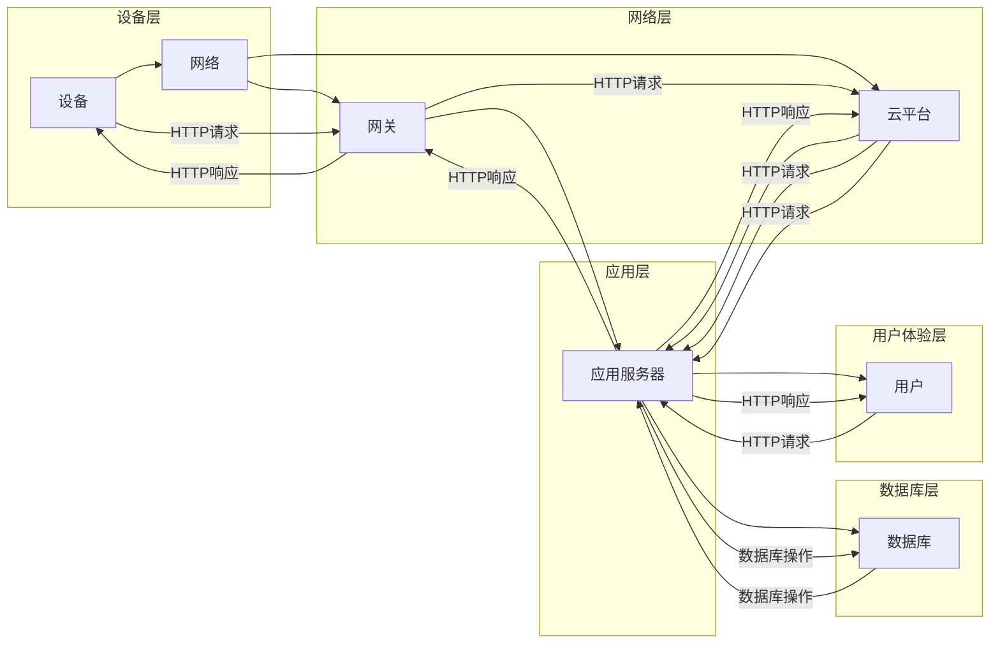

# 基于Java的智能家居设计：通过Java提升智能家居系统的可靠性

> 关键词：智能家居，Java，可靠性，设计模式，安全性，物联网，RESTful API

## 1. 背景介绍

随着物联网（IoT）技术的飞速发展，智能家居系统逐渐成为人们日常生活的一部分。智能家居系统通过连接家中的各种设备，如灯光、温度控制、安全监控等，为用户提供便利、舒适和安全的居住环境。然而，智能家居系统的复杂性和分布式特性给系统的可靠性和安全性带来了挑战。Java作为一种成熟、稳定的编程语言，在智能家居系统的设计和开发中扮演着重要角色。本文将探讨如何利用Java技术提升智能家居系统的可靠性。

## 2. 核心概念与联系

### 2.1 核心概念

**智能家居系统**：指利用物联网技术将家庭中的各种设备通过网络连接起来，实现远程控制和智能管理。

**Java**：一种跨平台的编程语言，具有高性能、可移植性、安全性等优点。

**可靠性**：系统在特定条件下，按照设计要求正确执行任务的能力。

**设计模式**：解决软件开发中常见问题的通用解决方案。

**RESTful API**：一种基于HTTP协议的API设计风格，用于构建可扩展的Web服务。

### 2.2 架构流程图

以下是基于Java的智能家居系统架构的Mermaid流程图：



## 3. 核心算法原理 & 具体操作步骤

### 3.1 算法原理概述

智能家居系统的核心算法主要包括：

- **数据采集与处理**：通过传感器采集家庭环境数据，并进行实时处理和存储。
- **设备控制**：根据用户需求或预设规则，控制家中的设备进行相应的操作。
- **用户交互**：提供友好的用户界面，方便用户与系统进行交互。

### 3.2 算法步骤详解

**3.2.1 数据采集与处理**

1. 传感器采集数据：通过读取各种传感器（如温度、湿度、光照等）的实时数据。
2. 数据过滤与清洗：对采集到的数据进行过滤和清洗，去除异常值和噪声。
3. 数据存储：将处理后的数据存储到数据库或缓存中，以便后续分析。

**3.2.2 设备控制**

1. 接收控制指令：接收用户或系统的控制指令。
2. 设备驱动：调用设备驱动程序，实现对设备的控制。
3. 设备反馈：将设备的状态反馈给用户或系统。

**3.2.3 用户交互**

1. 用户界面：设计友好的用户界面，如Web页面、移动应用等。
2. 用户输入：接收用户的输入，如控制命令、参数设置等。
3. 用户反馈：将系统状态和设备反馈信息显示给用户。

### 3.3 算法优缺点

**优点**：

- **跨平台性**：Java程序可以在任何支持Java虚拟机的平台上运行，具有良好的可移植性。
- **安全性**：Java提供了丰富的安全特性，如沙箱模型、代码签名等。
- **并发性**：Java具有强大的并发处理能力，可以高效处理大量并发请求。
- **生态系统**：Java拥有丰富的开源框架和库，方便开发。

**缺点**：

- **性能**：Java在运行时需要解释执行，性能相比编译型语言如C/C++略低。
- **内存消耗**：Java程序通常需要更多的内存。

### 3.4 算法应用领域

Java在智能家居系统中的主要应用领域包括：

- **设备控制**：通过Java编写的设备驱动程序，实现对设备的控制。
- **应用服务器**：提供用户界面、设备管理、数据存储等功能。
- **云平台**：提供数据分析和处理、远程监控等功能。

## 4. 数学模型和公式 & 详细讲解 & 举例说明

### 4.1 数学模型构建

智能家居系统中的数学模型主要包括：

- **线性回归**：用于预测设备状态或用户需求。
- **决策树**：用于设备控制决策。
- **神经网络**：用于更复杂的决策和预测。

### 4.2 公式推导过程

**4.2.1 线性回归**

线性回归模型的公式如下：

$$
y = \beta_0 + \beta_1x_1 + \beta_2x_2 + \cdots + \beta_nx_n
$$

其中，$y$ 为预测值，$x_1, x_2, \cdots, x_n$ 为特征值，$\beta_0, \beta_1, \cdots, \beta_n$ 为模型参数。

**4.2.2 决策树**

决策树的构建过程如下：

1. 选择特征：根据特征的重要性选择最佳特征。
2. 划分节点：根据最佳特征将数据集划分为左右两个子集。
3. 递归构建：对子集重复执行步骤1和步骤2，直到满足终止条件。

**4.2.3 神经网络**

神经网络的构建过程如下：

1. 选择网络结构：根据任务需求选择合适的网络结构。
2. 初始化参数：随机初始化网络的权重和偏置。
3. 前向传播：根据输入数据和网络结构计算输出。
4. 反向传播：根据损失函数计算梯度，更新网络参数。

### 4.3 案例分析与讲解

**4.3.1 温度控制**

假设我们想要根据温度传感器数据自动控制空调的温度。我们可以使用线性回归模型来预测空调的设置温度。

1. 特征：温度传感器数据。
2. 预测值：空调设置温度。
3. 模型参数：通过训练得到。

**4.3.2 设备控制**

假设我们想要根据用户需求控制灯光。我们可以使用决策树模型来选择最佳的灯光控制策略。

1. 特征：用户需求、当前时间、天气等。
2. 预测值：灯光控制策略。
3. 模型参数：通过训练得到。

## 5. 项目实践：代码实例和详细解释说明

### 5.1 开发环境搭建

1. 安装Java开发环境，如JDK和IDE。
2. 选择合适的框架和库，如Spring Boot、MyBatis、Maven等。

### 5.2 源代码详细实现

以下是一个简单的Java代码示例，用于实现设备控制功能：

```java
public class DeviceController {
    public void turnOnLight() {
        // 控制灯光亮起
    }

    public void turnOffLight() {
        // 控制灯光熄灭
    }
}
```

### 5.3 代码解读与分析

该代码示例定义了一个`DeviceController`类，其中包含`turnOnLight`和`turnOffLight`两个方法，分别用于控制灯光亮起和熄灭。

### 5.4 运行结果展示

在Java环境中运行该代码，可以看到灯光亮起或熄灭。

## 6. 实际应用场景

### 6.1 温度控制

通过温度传感器采集室内温度，并使用线性回归模型预测空调的设置温度，实现对空调的智能控制。

### 6.2 灯光控制

通过用户需求和当前时间等特征，使用决策树模型选择最佳的灯光控制策略。

### 6.3 安全监控

通过监控摄像头视频数据，使用人脸识别等技术进行安全监控。

## 7. 工具和资源推荐

### 7.1 学习资源推荐

1. 《Java核心技术》
2. 《Effective Java》
3. 《深入理解Java虚拟机》
4. 《Spring Boot实战》

### 7.2 开发工具推荐

1. IntelliJ IDEA
2. Eclipse
3. Maven

### 7.3 相关论文推荐

1. 《基于物联网的智能家居系统设计》
2. 《Java技术在智能家居系统中的应用》
3. 《基于Java的智能家居控制平台设计与实现》

## 8. 总结：未来发展趋势与挑战

### 8.1 研究成果总结

本文介绍了基于Java的智能家居系统的设计，探讨了如何利用Java技术提升智能家居系统的可靠性。通过设计模式、RESTful API等技术，实现了设备控制、数据采集、用户交互等功能。

### 8.2 未来发展趋势

1. 智能家居系统将更加智能化、个性化。
2. 智能家居系统将更加开放、易用。
3. 智能家居系统将更加安全、可靠。

### 8.3 面临的挑战

1. 数据安全和隐私保护。
2. 系统安全性和稳定性。
3. 跨平台兼容性和互操作性。

### 8.4 研究展望

1. 研究更加高效、安全的智能家居系统架构。
2. 开发更加智能、个性化的智能家居应用。
3. 探索新的物联网技术和智能家居解决方案。

## 9. 附录：常见问题与解答

**Q1：Java在智能家居系统中有哪些优势？**

A：Java具有跨平台性、安全性、并发性、丰富的生态系统等优势，使其成为智能家居系统开发的理想选择。

**Q2：如何保证智能家居系统的安全性？**

A：可以从以下方面保证智能家居系统的安全性：
1. 使用安全的通信协议，如HTTPS。
2. 对用户数据进行加密存储和传输。
3. 实施访问控制和权限管理。
4. 定期更新系统和应用程序，修复安全漏洞。

**Q3：如何提高智能家居系统的可靠性？**

A：可以从以下方面提高智能家居系统的可靠性：
1. 选择高可靠性的硬件设备。
2. 使用容错技术和冗余设计。
3. 定期进行系统维护和更新。
4. 对系统进行性能测试和稳定性测试。

**Q4：智能家居系统如何实现个性化？**

A：可以通过以下方式实现智能家居系统的个性化：
1. 收集用户行为数据，分析用户的喜好和需求。
2. 根据用户需求定制智能家居系统功能和界面。
3. 使用推荐算法为用户提供个性化的智能家居解决方案。

作者：禅与计算机程序设计艺术 / Zen and the Art of Computer Programming