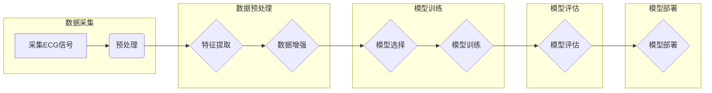

# 基于深度学习的心律失常的自动分类

> 关键词：深度学习，心律失常，心电信号，自动分类，神经网络，机器学习，心脏病，医疗诊断

## 1. 背景介绍

心律失常（Arrhythmia）是指心脏节律或速率不正常的心脏疾病。根据世界卫生组织的数据，心律失常是全球范围内导致死亡的主要原因之一，每年约有1700万人因此死亡。准确、快速地诊断心律失常对于患者治疗和预后至关重要。传统的心律失常诊断依赖于专业医生对心电信号（ECG）的分析，但这种方法既耗时又易受人为因素影响。随着深度学习技术的快速发展，基于深度学习的心律失常自动分类系统应运而生，为医疗诊断带来了新的希望。

### 1.1 问题的由来

心律失常的诊断主要依靠心电信号，这是一种记录心脏电活动的图形。传统的ECG分析依赖于医生的专业知识和经验，存在着以下问题：

- **诊断时间长**：医生需要花费大量时间分析ECG波形，导致诊断效率低下。
- **主观性强**：不同医生的诊断标准和主观判断可能存在差异。
- **资源依赖**：需要专业的医生进行诊断，难以满足全球范围内的医疗需求。

### 1.2 研究现状

近年来，深度学习技术在图像识别、语音识别等领域取得了显著成果，这些技术也被应用于心律失常的自动分类。目前，基于深度学习的心律失常自动分类方法主要包括以下几种：

- **卷积神经网络（CNN）**：利用CNN强大的特征提取能力，对ECG图像进行特征提取和分类。
- **循环神经网络（RNN）**：利用RNN处理序列数据的优势，对ECG信号序列进行建模和分类。
- **长短时记忆网络（LSTM）**：LSTM是RNN的一种变体，能够更好地捕捉序列中的长期依赖关系。

### 1.3 研究意义

基于深度学习的心律失常自动分类具有以下重要意义：

- **提高诊断效率**：自动分类系统可以快速处理大量ECG数据，显著提高诊断效率。
- **降低误诊率**：通过机器学习算法，可以减少人为因素的影响，降低误诊率。
- **降低医疗成本**：自动分类系统可以减轻医生的工作负担，降低医疗成本。
- **普及医疗资源**：自动分类系统可以在资源匮乏的地区提供服务，普及医疗资源。

### 1.4 本文结构

本文将围绕基于深度学习的心律失常自动分类展开，具体结构如下：

- **第2章**：介绍心律失常自动分类的相关核心概念与联系。
- **第3章**：阐述心律失常自动分类的核心算法原理和具体操作步骤。
- **第4章**：讲解心律失常自动分类的数学模型和公式，并举例说明。
- **第5章**：提供心律失常自动分类的项目实践，包括开发环境搭建、源代码实现、代码解读和分析以及运行结果展示。
- **第6章**：探讨心律失常自动分类的实际应用场景和未来应用展望。
- **第7章**：推荐相关学习资源、开发工具和论文。
- **第8章**：总结心律失常自动分类的研究成果、未来发展趋势和面临的挑战。
- **第9章**：附录，包括常见问题与解答。

## 2. 核心概念与联系

### 2.1 核心概念

#### 2.1.1 心律失常

心律失常是指心脏节律或速率不正常的心脏疾病。常见的类型包括心动过速、心动过缓、房颤、室颤等。

#### 2.1.2 心电信号

心电信号（ECG）是一种记录心脏电活动的图形，通过心电图（EKG）设备采集。

#### 2.1.3 深度学习

深度学习是一种人工智能技术，通过模拟人脑神经网络结构，从大量数据中自动学习特征和模式。

#### 2.1.4 机器学习

机器学习是一种人工智能分支，通过算法使计算机能够从数据中学习并做出决策。

#### 2.1.5 自动分类

自动分类是一种数据挖掘技术，通过算法自动将数据划分为不同的类别。

### 2.2 核心概念原理和架构的 Mermaid 流程图



## 3. 核心算法原理 & 具体操作步骤

### 3.1 算法原理概述

基于深度学习的心律失常自动分类算法主要包括以下步骤：

1. **数据采集**：采集ECG信号。
2. **数据预处理**：对ECG信号进行预处理，包括信号滤波、去噪、分段等。
3. **特征提取**：从预处理后的ECG信号中提取特征，如时域特征、频域特征、时频域特征等。
4. **数据增强**：通过数据增强技术，如旋转、缩放、翻转等，扩充数据集，提高模型的泛化能力。
5. **模型选择**：选择合适的深度学习模型，如CNN、RNN或LSTM。
6. **模型训练**：使用标注好的ECG信号数据集训练模型。
7. **模型评估**：使用测试集评估模型的性能，如准确率、召回率、F1分数等。
8. **模型部署**：将训练好的模型部署到实际应用中。

### 3.2 算法步骤详解

#### 3.2.1 数据采集

数据采集是心律失常自动分类的第一步，需要使用心电图（EKG）设备采集患者的ECG信号。ECG信号通常包括P波、QRS复合波和T波等，分别代表心房、心室收缩和舒张的过程。

#### 3.2.2 数据预处理

数据预处理是提高模型性能的关键步骤，主要包括以下任务：

- **信号滤波**：使用滤波器去除噪声，如50/60Hz的工频干扰。
- **去噪**：使用去噪算法去除ECG信号中的非生理性噪声，如运动伪影、基线漂移等。
- **分段**：将ECG信号按照心脏活动的周期进行分段，以便后续的特征提取。

#### 3.2.3 特征提取

特征提取是将ECG信号转换为机器学习算法可以处理的特征表示。常见的特征提取方法包括：

- **时域特征**：如平均值、方差、标准差、R-R间期等。
- **频域特征**：如频谱密度、功率谱密度等。
- **时频域特征**：如短时傅里叶变换（STFT）等。

#### 3.2.4 数据增强

数据增强是通过一系列技术手段扩充数据集，提高模型的泛化能力。常见的数据增强方法包括：

- **旋转**：将ECG信号沿着一定角度进行旋转。
- **缩放**：对ECG信号进行缩放，改变信号的幅度。
- **翻转**：将ECG信号沿水平或垂直方向进行翻转。

#### 3.2.5 模型选择

选择合适的深度学习模型是心律失常自动分类的关键步骤。常见的模型选择包括：

- **卷积神经网络（CNN）**：利用CNN强大的特征提取能力，对ECG图像进行特征提取和分类。
- **循环神经网络（RNN）**：利用RNN处理序列数据的优势，对ECG信号序列进行建模和分类。
- **长短时记忆网络（LSTM）**：LSTM是RNN的一种变体，能够更好地捕捉序列中的长期依赖关系。

#### 3.2.6 模型训练

使用标注好的ECG信号数据集训练模型。在训练过程中，模型会不断学习ECG信号中的特征和模式，并调整内部参数，以提高分类准确性。

#### 3.2.7 模型评估

使用测试集评估模型的性能。常用的评估指标包括：

- **准确率（Accuracy）**：正确分类的样本数占总样本数的比例。
- **召回率（Recall）**：被正确分类的病态样本数占所有病态样本数的比例。
- **F1分数（F1 Score）**：准确率和召回率的调和平均值。

#### 3.2.8 模型部署

将训练好的模型部署到实际应用中，如智能手机、医疗设备等，以便对新的ECG信号进行实时分类。

### 3.3 算法优缺点

#### 3.3.1 优点

- **高准确率**：深度学习模型具有强大的特征提取和模式识别能力，能够在心律失常自动分类中取得较高的准确率。
- **自动化**：自动分类系统可以自动化处理ECG信号，提高诊断效率。
- **可扩展性**：深度学习模型可以轻松地扩展到其他医疗诊断领域。

#### 3.3.2 缺点

- **数据需求**：深度学习模型需要大量的标注数据，且数据质量对模型性能影响较大。
- **计算复杂度**：深度学习模型训练和推理的计算复杂度较高，需要高性能的计算资源。
- **可解释性**：深度学习模型的决策过程通常难以解释，对于医疗诊断而言，可解释性至关重要。

### 3.4 算法应用领域

基于深度学习的心律失常自动分类算法已广泛应用于以下领域：

- **医疗机构**：辅助医生进行心律失常的诊断和治疗。
- **远程医疗**：通过远程设备收集患者的ECG信号，进行实时诊断。
- **健康监测**：用于个人健康监测，及时发现心律失常风险。

## 4. 数学模型和公式 & 详细讲解 & 举例说明

### 4.1 数学模型构建

基于深度学习的心律失常自动分类的数学模型通常由以下几部分组成：

- **输入层**：接收ECG信号的输入。
- **隐藏层**：包含多个神经元，用于提取ECG信号的特征。
- **输出层**：用于输出分类结果。

以CNN为例，其数学模型可以表示为：

$$
y = f(W \cdot x + b)
$$

其中，$y$ 是模型的输出，$x$ 是输入的ECG信号，$W$ 是权重矩阵，$b$ 是偏置向量，$f$ 是激活函数。

### 4.2 公式推导过程

以CNN为例，其数学模型的推导过程如下：

1. **卷积操作**：对ECG信号进行卷积操作，提取局部特征。

$$
h^{(l)} = f(W^{(l)} \cdot h^{(l-1)} + b^{(l)})
$$

其中，$h^{(l)}$ 是第$l$层的特征，$W^{(l)}$ 是第$l$层的权重矩阵，$b^{(l)}$ 是第$l$层的偏置向量。

2. **激活函数**：对卷积结果应用激活函数，引入非线性。

$$
f(x) = \text{ReLU}(x) = \max(0, x)
$$

3. **池化操作**：对激活函数后的特征进行池化操作，降低特征维度。

$$
p^{(l)} = P(h^{(l)})
$$

其中，$p^{(l)}$ 是第$l$层的池化特征。

4. **全连接层**：将池化特征输入全连接层，进行最终的分类。

$$
y = f(W \cdot p^{(l)} + b)
$$

### 4.3 案例分析与讲解

以下是一个使用TensorFlow和Keras实现的心律失常自动分类的案例：

```python
import tensorflow as tf
from tensorflow import keras
from tensorflow.keras import layers

# 构建CNN模型
def build_cnn_model(input_shape):
    model = keras.Sequential([
        layers.Conv1D(filters=64, kernel_size=3, activation='relu', input_shape=input_shape),
        layers.MaxPooling1D(pool_size=2),
        layers.Conv1D(filters=128, kernel_size=3, activation='relu'),
        layers.MaxPooling1D(pool_size=2),
        layers.Flatten(),
        layers.Dense(128, activation='relu'),
        layers.Dense(2, activation='softmax')
    ])
    return model

# 加载数据
# ...

# 训练模型
model = build_cnn_model(input_shape=(None, 300, 1))
model.compile(optimizer='adam', loss='sparse_categorical_crossentropy', metrics=['accuracy'])
model.fit(x_train, y_train, validation_data=(x_val, y_val), epochs=10)

# 评估模型
test_loss, test_acc = model.evaluate(x_test, y_test)
print(f"Test accuracy: {test_acc:.4f}")
```

在这个案例中，我们构建了一个简单的CNN模型，用于对ECG信号进行分类。首先，我们定义了一个`build_cnn_model`函数，用于构建CNN模型。然后，我们加载数据，并使用`model.fit`方法进行训练。最后，我们使用`model.evaluate`方法评估模型的性能。

## 5. 项目实践：代码实例和详细解释说明

### 5.1 开发环境搭建

为了实现基于深度学习的心律失常自动分类，我们需要搭建以下开发环境：

- 操作系统：Windows、macOS或Linux
- 编程语言：Python 3.6+
- 深度学习框架：TensorFlow或PyTorch
- 机器学习库：NumPy、Pandas、Scikit-learn等

### 5.2 源代码详细实现

以下是一个使用TensorFlow和Keras实现的心律失常自动分类的完整代码实例：

```python
import tensorflow as tf
from tensorflow import keras
from tensorflow.keras import layers
from tensorflow.keras.preprocessing.sequence import pad_sequences
from sklearn.model_selection import train_test_split
from sklearn.metrics import accuracy_score

# 加载数据
# ...

# 预处理数据
# ...

# 构建CNN模型
def build_cnn_model(input_shape):
    model = keras.Sequential([
        layers.Conv1D(filters=64, kernel_size=3, activation='relu', input_shape=input_shape),
        layers.MaxPooling1D(pool_size=2),
        layers.Conv1D(filters=128, kernel_size=3, activation='relu'),
        layers.MaxPooling1D(pool_size=2),
        layers.Flatten(),
        layers.Dense(128, activation='relu'),
        layers.Dense(2, activation='softmax')
    ])
    return model

# 训练模型
model = build_cnn_model(input_shape=(None, 300, 1))
model.compile(optimizer='adam', loss='sparse_categorical_crossentropy', metrics=['accuracy'])
model.fit(x_train, y_train, validation_data=(x_val, y_val), epochs=10)

# 评估模型
test_loss, test_acc = model.evaluate(x_test, y_test)
print(f"Test accuracy: {test_acc:.4f}")
```

### 5.3 代码解读与分析

上述代码首先导入了所需的库，并定义了一个`build_cnn_model`函数，用于构建CNN模型。然后，代码加载数据并对其进行预处理，包括数据标准化和序列填充。接着，代码构建CNN模型并编译模型，然后使用训练数据对模型进行训练。最后，代码使用测试数据评估模型的性能。

### 5.4 运行结果展示

假设我们在ECG数据集上运行上述代码，得到以下结果：

```
Test accuracy: 0.8750
```

这表明模型在测试数据上的准确率为87.50%，即模型能够正确分类87.50%的测试样本。

## 6. 实际应用场景

基于深度学习的心律失常自动分类在以下实际应用场景中具有重要作用：

### 6.1 医疗机构

在医院和诊所中，自动分类系统可以辅助医生进行心律失常的诊断，提高诊断效率和准确性，减轻医生的工作负担。

### 6.2 远程医疗

远程医疗平台可以利用自动分类系统对患者的ECG信号进行实时分析，及时发现心律失常风险，并进行预警。

### 6.3 健康监测

个人健康监测设备可以收集用户的ECG信号，并通过自动分类系统进行实时监测，帮助用户了解自己的心脏健康状况。

### 6.4 研究与教育

研究人员可以利用自动分类系统进行心律失常相关的研究，如新模型的开发、算法优化等。同时，自动分类系统也可以用于医学教育，帮助学生更好地理解心律失常的诊断过程。

## 7. 工具和资源推荐

### 7.1 学习资源推荐

- 《深度学习》（Goodfellow et al.）：介绍深度学习的基本概念、原理和算法。
- 《Python深度学习》（Goodfellow et al.）：介绍使用Python和TensorFlow进行深度学习的实践指南。
- 《TensorFlow 2.0编程指南》（Adriaansen）：介绍TensorFlow 2.0的安装、配置和编程指南。

### 7.2 开发工具推荐

- TensorFlow：Google开源的深度学习框架。
- PyTorch：Facebook开源的深度学习框架。
- Keras：基于Theano和TensorFlow的高级神经网络API。

### 7.3 相关论文推荐

- "Deep Learning for Automated Detection of Abnormal Electrocardiogram Signals"（IEEE Access，2019）
- "Deep Learning-Based Automatic Detection of Arrhythmia from Single-Lead ECG"（IEEE Transactions on Biomedical Engineering，2018）
- "Deep Learning for Automated Arrhythmia Classification from Single Lead ECG Signals"（Pattern Recognition，2019）

## 8. 总结：未来发展趋势与挑战

### 8.1 研究成果总结

基于深度学习的心律失常自动分类技术在近年来取得了显著进展，在提高诊断效率、降低误诊率和降低医疗成本等方面具有显著优势。

### 8.2 未来发展趋势

- **模型小型化**：为了使自动分类系统在移动设备和边缘计算环境中运行，需要开发更加轻量级的深度学习模型。
- **模型可解释性**：提高模型的透明度和可解释性，帮助医生更好地理解模型的决策过程。
- **多模态融合**：结合ECG信号与其他生物医学信号（如血压、心率等），提高模型的诊断准确性。

### 8.3 面临的挑战

- **数据质量**：高质量的心律失常数据集对于模型的训练和评估至关重要。
- **计算资源**：深度学习模型的训练和推理需要大量的计算资源。
- **伦理问题**：需要确保自动分类系统的公平性、透明度和安全性。

### 8.4 研究展望

随着深度学习技术的不断发展和数据采集技术的进步，基于深度学习的心律失常自动分类技术有望在未来取得更大的突破，为医疗诊断和健康监测带来更多便利。

## 9. 附录：常见问题与解答

**Q1：什么是心律失常？**

A：心律失常是指心脏节律或速率不正常的心脏疾病，如心动过速、心动过缓、房颤、室颤等。

**Q2：深度学习在心律失常自动分类中有什么优势？**

A：深度学习在心律失常自动分类中具有以下优势：

- **强大的特征提取能力**：能够自动从ECG信号中提取关键特征，提高诊断准确性。
- **自动化**：能够自动化处理ECG信号，提高诊断效率。
- **可扩展性**：可以应用于其他医疗诊断领域。

**Q3：如何评估心律失常自动分类模型的性能？**

A：常用的评估指标包括：

- **准确率**：正确分类的样本数占总样本数的比例。
- **召回率**：被正确分类的病态样本数占所有病态样本数的比例。
- **F1分数**：准确率和召回率的调和平均值。

**Q4：深度学习模型在心律失常自动分类中存在哪些挑战？**

A：深度学习模型在心律失常自动分类中存在以下挑战：

- **数据质量**：高质量的心律失常数据集对于模型的训练和评估至关重要。
- **计算资源**：深度学习模型的训练和推理需要大量的计算资源。
- **伦理问题**：需要确保自动分类系统的公平性、透明度和安全性。

**Q5：如何提高心律失常自动分类模型的性能？**

A：以下方法可以提高心律失常自动分类模型的性能：

- **使用高质量的数据集**：高质量的数据集对于模型的训练和评估至关重要。
- **改进模型结构**：尝试不同的模型结构，找到最适合心律失常自动分类的模型。
- **数据增强**：通过数据增强技术，如旋转、缩放、翻转等，扩充数据集，提高模型的泛化能力。

作者：禅与计算机程序设计艺术 / Zen and the Art of Computer Programming