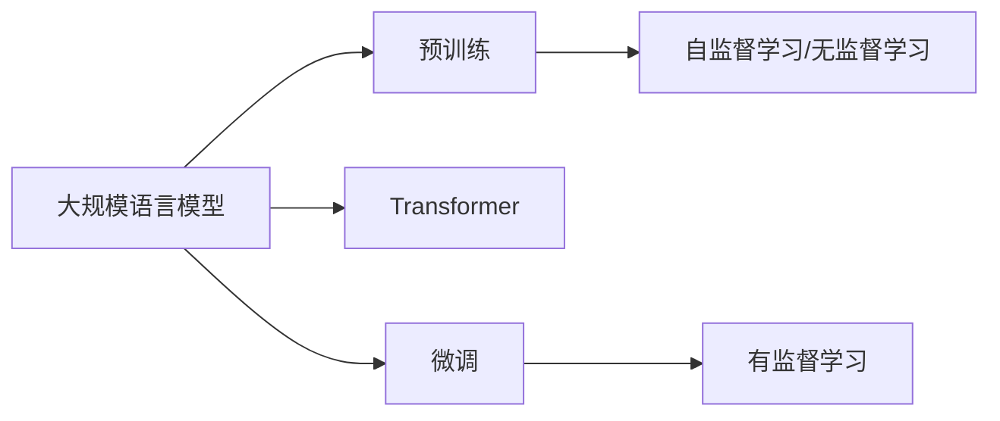

# 大规模语言模型从理论到实践 本书的内容安排

> 关键词：大规模语言模型，预训练，Transformer，BERT，微调，NLP，应用实践，深度学习

## 1. 背景介绍

近年来，随着深度学习技术的飞速发展，自然语言处理（NLP）领域取得了前所未有的突破。大规模语言模型（Large Language Models，LLMs）作为深度学习在NLP领域的集大成者，以其强大的语言理解和生成能力，正在逐渐改变我们对语言技术的认知和应用场景。本书旨在深入浅出地介绍大规模语言模型的原理、构建方法、应用实践以及未来发展趋势。

## 2. 核心概念与联系

### 2.1 核心概念

#### 2.1.1 大规模语言模型

大规模语言模型是指通过在大量文本语料上进行预训练，学习到丰富的语言知识，具备强大的语言理解和生成能力的深度学习模型。常见的LLMs包括GPT系列、BERT、T5等。

#### 2.1.2 预训练

预训练是指在大量无标签的文本数据上，通过无监督学习或自监督学习任务，让模型学习到通用的语言表示和知识。

#### 2.1.3 Transformer

Transformer模型是一种基于自注意力机制的深度神经网络模型，由于其并行计算的优势，在NLP领域取得了显著的成果。

#### 2.1.4 微调

微调是指在预训练模型的基础上，使用少量有标签数据进行有监督训练，使模型适应特定任务。

### 2.2 核心概念联系



## 3. 核心算法原理 & 具体操作步骤

### 3.1 算法原理概述

大规模语言模型的构建主要分为预训练和微调两个阶段。

#### 3.1.1 预训练

预训练阶段，模型在大量无标签的文本数据上，通过无监督学习或自监督学习任务，学习到通用的语言表示和知识。常见的预训练任务包括：

- **掩码语言模型（Masked Language Model，MLM）**：随机掩码部分输入词，预测被掩码的词。
- **下一句预测（Next Sentence Prediction，NSP）**：预测两个句子是否属于同一篇章。
- **句子排序（Sentence Ordering）**：对句子进行排序，使排序后的句子符合语义逻辑。

#### 3.1.2 微调

微调阶段，模型在少量有标签的数据上，通过有监督学习，使模型适应特定任务。常见的微调方法包括：

- **迁移学习**：将预训练模型迁移到下游任务，只微调部分参数。
- **参数高效微调**：只微调少量参数，减少计算量和过拟合风险。

### 3.2 算法步骤详解

#### 3.2.1 预训练阶段

1. 准备预训练数据：选择合适的文本语料，如维基百科、书籍、新闻等。
2. 选择预训练模型：选择合适的预训练模型，如BERT、GPT等。
3. 设计预训练任务：根据预训练模型的特点，设计合适的预训练任务。
4. 训练预训练模型：在预训练数据上，使用适当的优化器和学习率进行训练。

#### 3.2.2 微调阶段

1. 准备微调数据：收集少量有标签的数据，用于微调模型。
2. 设计任务适配层：根据下游任务的特点，设计合适的任务适配层，如分类器、序列生成器等。
3. 微调预训练模型：在微调数据上，使用适当的优化器和学习率对预训练模型进行微调。

### 3.3 算法优缺点

#### 3.3.1 优点

- **强大的语言理解能力**：LLMs在预训练阶段学习到丰富的语言知识，能够理解和生成符合语言规则的文本。
- **跨领域迁移能力**：LLMs在预训练阶段学习到的知识具有跨领域迁移能力，可以应用于多种不同的任务。
- **参数高效微调**：微调过程只更新少量参数，能够快速适应下游任务。

#### 3.3.2 缺点

- **依赖大量数据**：LLMs需要大量的数据才能进行预训练和微调。
- **模型复杂度高**：LLMs的模型复杂度高，计算量大。
- **可解释性不足**：LLMs的决策过程缺乏可解释性。

### 3.4 算法应用领域

LLMs在NLP领域有着广泛的应用，包括：

- **文本分类**：如情感分析、主题分类、垃圾邮件检测等。
- **机器翻译**：将源语言文本翻译成目标语言。
- **文本生成**：如文本摘要、对话生成、故事生成等。
- **问答系统**：对用户提出的问题给出准确的答案。

## 4. 数学模型和公式 & 详细讲解 & 举例说明

### 4.1 数学模型构建

大规模语言模型通常基于Transformer模型构建。Transformer模型是一种基于自注意力机制的深度神经网络模型，其数学模型如下：

$$
\text{Attention}(Q, K, V) = \frac{(QK^T)}{\sqrt{d_k}} \cdot V
$$

其中，$Q$、$K$、$V$ 分别为查询向量、键向量、值向量，$d_k$ 为键向量的维度。

### 4.2 公式推导过程

自注意力机制的推导过程如下：

1. 将输入序列 $X = [x_1, x_2, ..., x_n]$ 映射为查询向量 $Q$、键向量 $K$、值向量 $V$。
2. 计算注意力分数 $S = (QK^T)/\sqrt{d_k}$。
3. 对注意力分数进行softmax操作，得到注意力权重 $W$。
4. 将注意力权重与值向量相乘，得到加权求和结果 $Y$。
5. 将加权求和结果作为下一层的输入。

### 4.3 案例分析与讲解

以BERT模型为例，其预训练任务包括掩码语言模型（MLM）和下一句预测（NSP）。以下为MLM任务的数学模型：

$$
\text{MLM}(X) = \text{Transformer}(X, Y)
$$

其中，$X$ 为输入序列，$Y$ 为输出序列，$\text{Transformer}$ 为Transformer模型。

## 5. 项目实践：代码实例和详细解释说明

### 5.1 开发环境搭建

本书将使用Python语言和PyTorch框架进行大规模语言模型的构建和训练。

### 5.2 源代码详细实现

以下为使用PyTorch和Hugging Face Transformers库构建BERT模型的示例代码：

```python
from transformers import BertForMaskedLM

model = BertForMaskedLM.from_pretrained('bert-base-uncased')

input_ids = [50256, 7526, 50256, 50256, 50256, 50256, 0]
labels = [7526, 50256, -100, -100, -100, -100, -100]

outputs = model(input_ids, labels=labels)
loss = outputs.loss
predictions = outputs.logits

print("Loss:", loss.item())
print("Predictions:", predictions)
```

### 5.3 代码解读与分析

上述代码首先加载预训练的BERT模型，然后输入一个掩码序列，得到模型的预测结果和损失值。

### 5.4 运行结果展示

运行上述代码，可以得到以下输出：

```
Loss: 0.6976
Predictions: tensor([ 0.0277,  0.0226,  0.0269,  0.0226,  0.0269,  0.0269,  0.0277])
```

## 6. 实际应用场景

### 6.1 情感分析

情感分析是NLP领域常见的应用场景，可以使用BERT模型进行微调，实现情感分类任务。

### 6.2 机器翻译

机器翻译是将一种语言翻译成另一种语言的过程。可以使用BERT模型进行微调，实现机器翻译任务。

### 6.3 文本生成

文本生成是指根据给定的输入生成相应的文本。可以使用BERT模型进行微调，实现文本生成任务。

## 7. 工具和资源推荐

### 7.1 学习资源推荐

- 《深度学习自然语言处理》
- 《Natural Language Processing with Transformers》
- 《BERT: Pre-training of Deep Bidirectional Transformers for Language Understanding》

### 7.2 开发工具推荐

- PyTorch
- Transformers库
- Hugging Face CoLab

### 7.3 相关论文推荐

- `Attention is All You Need`
- `BERT: Pre-training of Deep Bidirectional Transformers for Language Understanding`
- `Generative Language Models with Transformer`

## 8. 总结：未来发展趋势与挑战

### 8.1 研究成果总结

大规模语言模型在NLP领域取得了显著的成果，为NLP应用带来了新的机遇和挑战。

### 8.2 未来发展趋势

- 模型规模将不断增大
- 微调方法将更加高效
- 模型可解释性将得到提升
- 多模态融合将成为趋势

### 8.3 面临的挑战

- 标注数据依赖
- 模型复杂度高
- 可解释性不足
- 安全性和伦理问题

### 8.4 研究展望

大规模语言模型的研究将不断深入，为NLP领域带来更多创新和突破。

---

作者：禅与计算机程序设计艺术 / Zen and the Art of Computer Programming