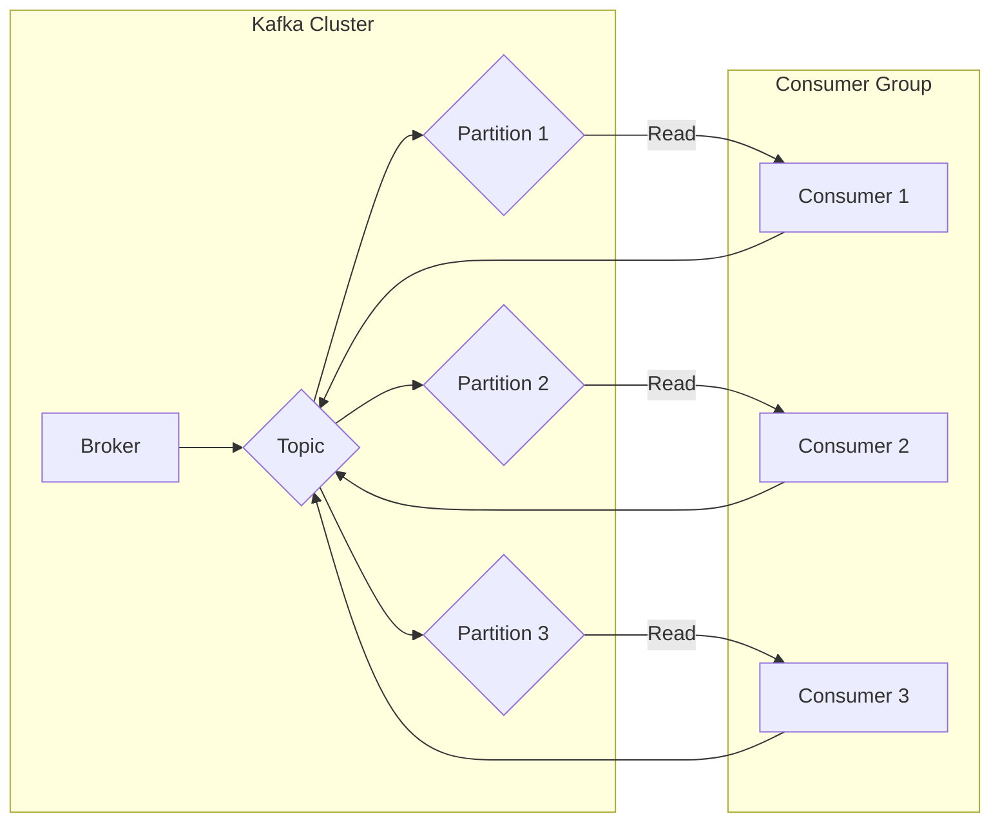

# Kafka Group原理与代码实例讲解

> 关键词：Kafka, Group, 消息队列, 分布式系统, 数据流, 分布式协调, 聚合, 消费者组

## 1. 背景介绍

Apache Kafka 是一个分布式流处理平台，它能够处理高吞吐量的数据流，并提供实时数据流处理和分析。在 Kafka 中，消费者组（Consumer Group）是一个核心概念，它允许多个消费者协同工作，共同消费同一个主题（Topic）中的消息。本文将深入探讨 Kafka Group 的原理，并通过代码实例进行详细讲解。

### 1.1 问题的由来

随着数据量的爆炸式增长，单个消费者可能无法处理所有消息。为了提高数据处理能力，需要多个消费者并行工作。然而，如何在多个消费者之间分配消息，并确保消息的顺序性和一致性，成为了分布式系统设计中的关键问题。Kafka 的消费者组提供了一种解决方案，允许消费者以组的形式协同工作。

### 1.2 研究现状

Kafka 的消费者组机制已经被广泛应用于各种分布式系统中，如实时数据收集、日志聚合、事件流处理等。随着 Kafka 版本的更新，消费者组的特性也在不断丰富，如支持跨分区消费、消费者组成员动态加入/退出等。

### 1.3 研究意义

理解 Kafka 消费者组的原理和机制，对于开发基于 Kafka 的分布式系统至关重要。它能够帮助开发者构建高可用、高性能的数据处理系统，并确保数据的一致性和顺序性。

### 1.4 本文结构

本文将按照以下结构进行阐述：

- 2. 核心概念与联系：介绍 Kafka Group 的核心概念，并使用 Mermaid 流程图展示其架构。
- 3. 核心算法原理 & 具体操作步骤：解释 Kafka Group 的工作原理，并详细说明其操作步骤。
- 4. 数学模型和公式 & 详细讲解 & 举例说明：使用数学模型和公式描述 Kafka Group 的内部工作过程，并通过实例进行说明。
- 5. 项目实践：提供 Kafka Group 的代码实例，并对其进行详细解释和分析。
- 6. 实际应用场景：讨论 Kafka Group 在实际应用中的场景和案例。
- 7. 工具和资源推荐：推荐学习 Kafka 和消费者组的资源。
- 8. 总结：总结研究成果，展望未来发展趋势和挑战。
- 9. 附录：常见问题与解答。

## 2. 核心概念与联系

### 2.1 核心概念

- **消费者（Consumer）**：消费者是 Kafka 系统中的客户端，它从 Kafka 主题中读取消息。
- **消费者组（Consumer Group）**：一组消费者组成的集合，它们共同消费同一个主题的消息。
- **主题（Topic）**：Kafka 中消息的分类，类似于数据库中的表。
- **分区（Partition）**：主题的分区，每个分区包含主题的一部分数据，分区数量决定了数据的并行度。

### 2.2 架构图

以下是一个简单的 Mermaid 流程图，展示了 Kafka Group 的架构：



在上图中，Kafka 集群包含一个主题，该主题有三个分区。三个消费者共同组成一个消费者组，每个消费者从不同的分区中读取消息。

## 3. 核心算法原理 & 具体操作步骤

### 3.1 算法原理概述

Kafka 消费者组的工作原理如下：

1. **消费者组成员动态分配**：当消费者组加入或离开时，Kafka 会自动重新分配分区，确保每个消费者负责的分区数量大致相等。
2. **消息顺序性**：Kafka 保证同一分区内消息的顺序性，但不同分区的消息可能无序。
3. **消息一致性**：消费者组内的消费者共同消费同一个主题的消息，确保消息的一致性。

### 3.2 算法步骤详解

1. **消费者组初始化**：消费者组在启动时向 Kafka 发送加入请求。
2. **分区分配**：Kafka 根据消费者组的规模和主题的分区数量，将分区分配给消费者。
3. **消息消费**：消费者从分配到的分区中读取消息。
4. **消息提交**：消费者消费消息后，将偏移量提交给 Kafka，表示消息已被成功消费。

### 3.3 算法优缺点

#### 优点

- **并行处理**：消费者组允许多个消费者并行处理消息，提高了系统的吞吐量。
- **负载均衡**：Kafka 会自动分配分区，实现负载均衡。
- **高可用性**：消费者组的动态分配机制保证了系统的容错性。

#### 缺点

- **顺序性问题**：不同分区的消息可能无序。
- **单点问题**：Kafka 集群的元数据（如分区分配信息）存储在单个或少数几个 Broker 上，可能成为系统的瓶颈。

## 4. 数学模型和公式 & 详细讲解 & 举例说明

### 4.1 数学模型构建

为了描述消费者组的工作原理，我们可以构建以下数学模型：

- **消费者组规模**：$|G|$，表示消费者组的消费者数量。
- **主题分区数量**：$|P|$，表示主题的分区数量。
- **消费者处理速率**：$r_i$，表示消费者 $i$ 的处理速率。

### 4.2 公式推导过程

假设消费者组在单位时间内消费的消息总数为 $M$，则有：

$$
M = \sum_{i=1}^{|G|} r_i
$$

如果 $M$ 是固定的，那么每个消费者的处理速率大致相等：

$$
r_i \approx \frac{M}{|G|}
$$

### 4.3 案例分析与讲解

假设有一个包含 5 个分区的主题，一个包含 3 个消费者的消费者组。每个消费者的处理速率相同，为 1 每秒。那么每个消费者将消费 1 个分区，每秒消费 1 条消息。

## 5. 项目实践：代码实例和详细解释说明

### 5.1 开发环境搭建

为了演示 Kafka 消费者组的使用，我们需要搭建以下开发环境：

- Kafka 集群
- 消费者客户端（如 Java、Python 等）

### 5.2 源代码详细实现

以下是一个使用 Java 实现的 Kafka 消费者组示例：

```java
Properties props = new Properties();
props.put("bootstrap.servers", "localhost:9092");
props.put("group.id", "test-group");
props.put("key.deserializer", "org.apache.kafka.common.serialization.StringDeserializer");
props.put("value.deserializer", "org.apache.kafka.common.serialization.StringDeserializer");

KafkaConsumer<String, String> consumer = new KafkaConsumer<>(props);
consumer.subscribe(Collections.singletonList("test-topic"));

while (true) {
    ConsumerRecords<String, String> records = consumer.poll(Duration.ofMillis(100));
    for (ConsumerRecord<String, String> record : records) {
        System.out.printf("offset = %d, key = %s, value = %s%n", record.offset(), record.key(), record.value());
    }
}
```

### 5.3 代码解读与分析

在上面的代码中，我们创建了一个 Kafka 消费者，并将其订阅到一个名为 "test-topic" 的主题。消费者组 ID 为 "test-group"。在循环中，我们使用 `poll` 方法从 Kafka 中读取消息，并打印消息的偏移量、键和值。

### 5.4 运行结果展示

假设 Kafka 集群中有一个名为 "test-topic" 的主题，该主题包含三条消息。当运行上述代码时，我们将在控制台看到以下输出：

```
offset = 0, key = key1, value = value1
offset = 1, key = key2, value = value2
offset = 2, key = key3, value = value3
```

这表明消费者成功消费了所有消息。

## 6. 实际应用场景

### 6.1 数据收集

Kafka 消费者组可以用于从多个源收集数据。例如，可以将来自不同传感器的数据写入 Kafka 主题，然后使用消费者组从主题中读取数据，并将其存储到数据库或分析工具中。

### 6.2 日志聚合

Kafka 消费者组可以用于聚合来自多个服务的日志。例如，可以将日志数据写入 Kafka 主题，然后使用消费者组从主题中读取日志，并将其聚合到中央日志存储中。

### 6.3 事件流处理

Kafka 消费者组可以用于处理事件流。例如，可以将用户行为数据写入 Kafka 主题，然后使用消费者组从主题中读取数据，并分析用户行为模式。

## 7. 工具和资源推荐

### 7.1 学习资源推荐

- Apache Kafka 官方文档：[https://kafka.apache.org/documentation/](https://kafka.apache.org/documentation/)
- 《Kafka权威指南》：[https://book.douban.com/subject/26880105/](https://book.douban.com/subject/26880105/)

### 7.2 开发工具推荐

- Kafka Manager：[https://github.com/yahoo/kafka-manager](https://github.com/yahoo/kafka-manager)
- Confluent Platform：[https://www.confluent.io/products/confluent-platform/](https://www.confluent.io/products/confluent-platform/)

### 7.3 相关论文推荐

- **《Kafka: A Distributed Streaming Platform》**：介绍了 Kafka 的设计原理和架构。
- **《A Scalable and High-Performance Stream Processing System》**：介绍了 Kafka 在 Apache Storm 中的应用。

## 8. 总结：未来发展趋势与挑战

### 8.1 研究成果总结

本文深入探讨了 Kafka Group 的原理和机制，并通过代码实例进行了详细讲解。我们了解了 Kafka Group 的核心概念、架构、算法原理和操作步骤，并分析了其优缺点和应用场景。

### 8.2 未来发展趋势

未来，Kafka 消费者组可能会在以下几个方面得到进一步发展：

- **更高的性能**：通过优化算法和硬件加速，提高消费者组的处理速度。
- **更灵活的配置**：提供更灵活的配置选项，满足不同场景的需求。
- **更好的可扩展性**：提高消费者组的可扩展性，支持更多的消费者和更大的数据量。

### 8.3 面临的挑战

Kafka 消费者组在以下方面仍然面临挑战：

- **顺序性问题**：如何保证不同分区的消息顺序性仍然是一个难题。
- **单点问题**：Kafka 集群的元数据存储在单个或少数几个 Broker 上，可能成为系统的瓶颈。
- **容错性问题**：如何提高消费者组的容错性，确保在出现故障时能够快速恢复。

### 8.4 研究展望

为了解决上述挑战，未来的研究可能会在以下方面进行：

- **分布式协调**：使用分布式协调框架（如 Apache ZooKeeper）来管理消费者组的状态。
- **多主题消费**：允许消费者组消费多个主题的消息。
- **更细粒度的分区分配**：根据消费者的能力和负载，更细粒度地分配分区。

## 9. 附录：常见问题与解答

**Q1：消费者组中的消费者可以消费多个分区吗？**

A：是的，消费者可以消费多个分区。Kafka 会根据消费者组的规模和主题的分区数量，将分区分配给消费者。

**Q2：消费者组中的消费者可以单独消费消息吗？**

A：不可以。消费者组中的消费者必须协同工作，共同消费同一个主题的消息。

**Q3：消费者组如何处理分区分配？**

A：消费者组在启动时会向 Kafka 发送加入请求。Kafka 会根据消费者组的规模和主题的分区数量，将分区分配给消费者。

**Q4：消费者组如何保证消息的顺序性？**

A：Kafka 保证同一分区内消息的顺序性。不同分区的消息可能无序。

**Q5：消费者组如何处理消息的丢失？**

A：消费者在消费消息后，会将其偏移量提交给 Kafka。如果消费者在提交偏移量之前崩溃，Kafka 会自动将未提交的消息分配给其他消费者。

---

作者：禅与计算机程序设计艺术 / Zen and the Art of Computer Programming