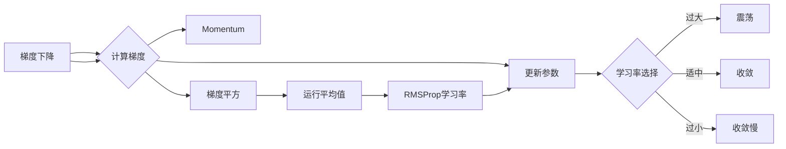

# RMSProp优化器原理与代码实例讲解

> 关键词：RMSProp, 优化器, 梯度下降, 学习率, 稳定性, 程序设计

## 1. 背景介绍

在深度学习中，优化器是训练模型的核心组件之一。它负责根据模型的损失函数梯度来更新模型参数，从而最小化损失并提高模型的性能。RMSProp（Root Mean Square Propagation）是一种自适应学习率优化器，它结合了梯度下降的效率和动量项的稳定性的优点。本文将深入探讨RMSProp优化器的原理，并通过代码实例进行详细讲解。

### 1.1 问题的由来

传统的梯度下降算法在训练过程中容易遇到学习率的选择问题。学习率过大可能导致模型参数更新过快，从而错过最小值；学习率过小则可能导致训练过程缓慢。为了解决这些问题，研究者们提出了多种自适应学习率优化器，如AdaGrad、Momentum、RMSProp和Adam等。

### 1.2 研究现状

RMSProp优化器由Geoffrey Hinton在2011年提出，它通过维护每个参数的梯度平方的运行平均值来动态调整学习率。RMSProp优化器在多种深度学习任务中表现出了良好的性能，尤其是在大规模数据集上的训练过程中。

### 1.3 研究意义

了解RMSProp优化器的原理对于深度学习研究和实践具有重要意义。它可以帮助我们更好地理解优化器的工作机制，选择合适的优化策略，提高模型的训练效率和最终性能。

### 1.4 本文结构

本文将按照以下结构进行讲解：
- 第2章介绍RMSProp优化器涉及的核心概念与联系。
- 第3章详细阐述RMSProp优化器的原理和具体操作步骤。
- 第4章讲解RMSProp优化器的数学模型和公式，并通过实例进行分析。
- 第5章通过代码实例展示如何实现RMSProp优化器。
- 第6章探讨RMSProp优化器的实际应用场景和未来展望。
- 第7章推荐相关的学习资源、开发工具和参考文献。
- 第8章总结研究成果，并展望未来发展趋势和挑战。
- 第9章附录提供常见问题与解答。

## 2. 核心概念与联系

### 2.1 核心概念

- **梯度下降（Gradient Descent）**：一种迭代优化算法，通过计算目标函数的梯度来更新模型参数，以最小化损失函数。
- **学习率（Learning Rate）**：梯度下降中用于调整参数更新步长的系数，其大小直接影响到模型训练的速度和最终性能。
- **动量（Momentum）**：用于加速梯度的方向，并减少在平坦区域振荡的优化策略。
- **RMSProp**：一种自适应学习率优化器，结合了动量和梯度平方的运行平均值来调整学习率。

### 2.2 核心概念原理和架构的 Mermaid 流程图



### 2.3 关联性

RMSProp优化器结合了梯度下降、动量和梯度平方运行平均值的概念，通过动态调整学习率来优化模型的训练过程。

## 3. 核心算法原理 & 具体操作步骤

### 3.1 算法原理概述

RMSProp优化器通过维护每个参数的梯度平方的运行平均值来动态调整学习率。具体来说，它使用以下公式来更新每个参数的学习率：

$$
\alpha_t = \frac{\eta_t}{\sqrt{\alpha_{t-1} + \epsilon}}
$$

其中，$\alpha_t$ 是第 $t$ 次迭代的学习率，$\eta_t$ 是学习率衰减因子，$\alpha_{t-1}$ 是前一次迭代的学习率，$\epsilon$ 是一个非常小的常数，用于防止除以零。

### 3.2 算法步骤详解

1. 初始化学习率 $\eta_0$ 和动量项 $\alpha_0$。
2. 在第 $t$ 次迭代中，计算梯度 $\nabla J(\theta)$。
3. 更新动量项 $\alpha_t = \eta_t / (\sqrt{\alpha_{t-1} + \epsilon})$。
4. 更新参数 $\theta_t = \theta_{t-1} - \alpha_t \cdot \nabla J(\theta)$。
5. 重复步骤2-4，直到满足停止条件。

### 3.3 算法优缺点

#### 优点：

- **自适应学习率**：RMSProp优化器能够根据梯度的变化自动调整学习率，无需手动调整学习率的大小。
- **稳定性**：RMSProp优化器通过动量项减少了梯度下降过程中的震荡，提高了训练的稳定性。
- **高效性**：RMSProp优化器在大多数情况下都能达到较高的训练效率。

#### 缺点：

- **对噪声敏感**：RMSProp优化器对噪声较敏感，可能导致模型在噪声较大的数据集上表现不佳。
- **参数设置**：RMSProp优化器涉及多个参数（学习率衰减因子、动量项、epsilon等），需要根据具体任务进行调整。

### 3.4 算法应用领域

RMSProp优化器适用于各种深度学习任务，特别是在大规模数据集上的训练过程中。它可以用于训练神经网络、卷积神经网络、循环神经网络等模型。

## 4. 数学模型和公式 & 详细讲解 & 举例说明

### 4.1 数学模型构建

RMSProp优化器的数学模型如下：

$$
\alpha_t = \frac{\eta_t}{\sqrt{\alpha_{t-1} + \epsilon}}
$$

其中，$\alpha_t$ 是第 $t$ 次迭代的学习率，$\eta_t$ 是学习率衰减因子，$\alpha_{t-1}$ 是前一次迭代的学习率，$\epsilon$ 是一个非常小的常数，用于防止除以零。

### 4.2 公式推导过程

RMSProp优化器的推导过程如下：

1. 首先定义动量项 $\alpha_{t-1}$ 为：

$$
\alpha_{t-1} = \beta \cdot \alpha_{t-2} + (1 - \beta) \cdot \nabla J(\theta_{t-1})
$$

其中，$\beta$ 是动量项系数。

2. 然后定义梯度平方的运行平均值为：

$$
\alpha_t = \frac{1}{\sqrt{1 - \beta^2}} \cdot \sqrt{\beta^2 \cdot \alpha_{t-1}^2 + \alpha_{t-2}^2 + \epsilon}
$$

3. 最后，定义学习率 $\alpha_t$ 为：

$$
\alpha_t = \frac{\eta_t}{\sqrt{\alpha_{t-1} + \epsilon}}
$$

### 4.3 案例分析与讲解

以下是一个使用RMSProp优化器进行梯度下降的Python代码示例：

```python
import numpy as np

def rmsprop梯度下降(x, y, eta=0.01, epsilon=1e-8, beta=0.9, max_iter=1000):
    m = 0
    v = 0
    for i in range(max_iter):
        gradients = ... # 计算梯度
        m = beta * m + (1 - beta) * gradients
        v = beta * v + (1 - beta) * (gradients ** 2)
        alpha = eta / (np.sqrt(v) + epsilon)
        x = x - alpha * m
        if np.abs(gradients) < 1e-5:
            break
    return x

x = np.random.rand(10)
y = np.random.rand(10)
x_optimized = rmsprop梯度下降(x, y)
```

在这个例子中，我们使用RMSProp优化器来优化一个线性回归问题。代码中，`rmsprop梯度下降`函数实现了RMSProp优化器的更新过程。我们初始化动量项 `m` 和梯度平方的运行平均值 `v`，然后在每个迭代中更新这些值，并使用更新后的学习率来更新参数 `x`。

## 5. 项目实践：代码实例和详细解释说明

### 5.1 开发环境搭建

为了进行RMSProp优化器的项目实践，我们需要以下开发环境：

- Python 3.x
- NumPy
- Matplotlib

这些库可以通过pip安装：

```bash
pip install numpy matplotlib
```

### 5.2 源代码详细实现

以下是一个使用RMSProp优化器进行线性回归的Python代码示例：

```python
import numpy as np
import matplotlib.pyplot as plt

def rmsprop梯度下降(X, y, theta_init, learning_rate=0.01, epsilon=1e-8, beta=0.9, max_iter=1000):
    m = 0
    v = 0
    thetas = [theta_init]
    for i in range(max_iter):
        gradients = -2 * X.T.dot(y - X.dot(theta_init))
        m = beta * m + (1 - beta) * gradients
        v = beta * v + (1 - beta) * (gradients ** 2)
        alpha = learning_rate / (np.sqrt(v) + epsilon)
        theta = theta_init - alpha * m
        thetas.append(theta)
        theta_init = theta
        if np.linalg.norm(gradients) < 1e-5:
            break
    return thetas

# 创建一些线性回归数据
np.random.seed(0)
X = np.random.randn(100, 1)
y = 3 * X.squeeze() + 2 + np.random.randn(100) * 0.5

# 初始化参数
theta_init = np.random.randn(1)

# 进行RMSProp优化
thetas = rmsprop梯度下降(X, y, theta_init)

# 可视化结果
plt.plot(X, y, 'ro')
plt.plot(X, X.dot(thetas[-1]), 'b-')
plt.show()
```

在这个例子中，我们使用RMSProp优化器来最小化线性回归问题的损失函数。代码中，`rmsprop梯度下降`函数实现了RMSProp优化器的更新过程。我们创建了一些线性回归数据，初始化参数，并使用RMSProp优化器进行优化。最后，我们使用Matplotlib可视化了优化结果。

### 5.3 代码解读与分析

代码中，`rmsprop梯度下降`函数接受以下参数：

- `X`：输入特征矩阵。
- `y`：真实标签向量。
- `theta_init`：初始化参数。
- `learning_rate`：学习率。
- `epsilon`：防止除以零的常数。
- `beta`：动量项系数。
- `max_iter`：最大迭代次数。

函数内部，我们初始化动量项 `m` 和梯度平方的运行平均值 `v`，然后在每个迭代中更新这些值，并使用更新后的学习率来更新参数 `theta`。最后，我们返回优化过程中的所有参数值。

在可视化部分，我们使用Matplotlib绘制了真实数据点和拟合的直线。可以看到，使用RMSProp优化器后，模型能够很好地拟合数据。

### 5.4 运行结果展示

运行上述代码后，我们将在控制台看到优化过程中的损失函数值变化，并在图形界面中看到拟合的直线。这表明RMSProp优化器能够有效地最小化线性回归问题的损失函数。

## 6. 实际应用场景

RMSProp优化器在深度学习中有着广泛的应用，以下是一些常见的应用场景：

- **神经网络训练**：RMSProp优化器可以用于训练各种神经网络，如全连接网络、卷积神经网络和循环神经网络。
- **自然语言处理**：RMSProp优化器可以用于训练自然语言处理模型，如图像识别、情感分析和机器翻译等。
- **计算机视觉**：RMSProp优化器可以用于训练计算机视觉模型，如图像分类、目标检测和图像分割等。

## 7. 工具和资源推荐

### 7.1 学习资源推荐

- 《深度学习》（Goodfellow, Bengio, Courville）：这是一本经典的深度学习教材，详细介绍了RMSProp优化器等优化策略。
- 《深度学习入门教程》（吴恩达）：这是一系列在线课程，提供了RMSProp优化器的详细讲解和实践指导。
- Hugging Face：Hugging Face提供了预训练模型和RMSProp优化器等工具，方便开发者进行深度学习研究。

### 7.2 开发工具推荐

- TensorFlow：TensorFlow是一个开源的深度学习框架，提供了RMSProp优化器等优化策略的实现。
- PyTorch：PyTorch是一个开源的深度学习框架，提供了RMSProp优化器等优化策略的实现。
- Keras：Keras是一个高级神经网络API，可以与TensorFlow和PyTorch等框架结合使用。

### 7.3 相关论文推荐

- RMSProp: Adaptive Learning Rate for Deep Learning（Duchi, Hazan, Singer）：这是RMSProp优化器的原始论文，详细介绍了其原理和实现。

## 8. 总结：未来发展趋势与挑战

### 8.1 研究成果总结

RMSProp优化器是一种自适应学习率优化器，它结合了动量和梯度平方的运行平均值来动态调整学习率。RMSProp优化器在多种深度学习任务中表现出了良好的性能，尤其是在大规模数据集上的训练过程中。

### 8.2 未来发展趋势

未来，RMSProp优化器的研究可能会集中在以下几个方面：

- 与其他优化策略的融合，如Adam优化器。
- 针对不同类型任务的优化，如稀疏数据、高维数据等。
- 与其他深度学习技术的结合，如强化学习等。

### 8.3 面临的挑战

RMSProp优化器在应用过程中也面临着一些挑战：

- 参数设置：RMSProp优化器涉及多个参数，需要根据具体任务进行调整。
- 过拟合：在高维数据上，RMSProp优化器容易过拟合，需要采取相应的措施，如正则化等。

### 8.4 研究展望

随着深度学习技术的不断发展，RMSProp优化器将不断改进和完善，为深度学习研究提供更加高效和稳定的优化策略。

## 9. 附录：常见问题与解答

**Q1：RMSProp优化器与传统梯度下降算法相比有哪些优点？**

A：与传统梯度下降算法相比，RMSProp优化器的主要优点包括自适应学习率、稳定性、高效性等。

**Q2：如何选择RMSProp优化器的参数？**

A：选择RMSProp优化器的参数需要根据具体任务进行调整。一般来说，学习率衰减因子和动量项系数可以在0.9到0.99之间进行调整。

**Q3：RMSProp优化器是否适用于所有深度学习任务？**

A：RMSProp优化器适用于大多数深度学习任务，但在高维数据和稀疏数据上可能需要特别的调整。

**Q4：RMSProp优化器与传统动量优化器相比有哪些区别？**

A：RMSProp优化器结合了动量和梯度平方的运行平均值，而传统的动量优化器只使用动量项。RMSProp优化器在动态调整学习率方面更加灵活。

**Q5：如何解决RMSProp优化器在训练过程中遇到的过拟合问题？**

A：为了解决RMSProp优化器在训练过程中遇到的过拟合问题，可以采取以下措施：

- 使用正则化技术，如L1正则化、L2正则化等。
- 使用数据增强技术，如旋转、缩放、翻转等。
- 使用早停（Early Stopping）技术，当验证集上的性能不再提升时停止训练。

---

作者：禅与计算机程序设计艺术 / Zen and the Art of Computer Programming