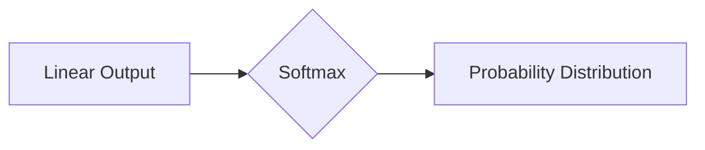

# Softmax瓶颈的影响

> 关键词：Softmax，神经网络，分类，瓶颈，优化，性能，深度学习

## 1. 背景介绍

Softmax函数是神经网络中用于多分类输出层的一种常用激活函数。它将神经网络的输出转换为概率分布，使得模型能够给出每个类别被选中的概率。然而，Softmax函数在深度学习中存在一些潜在的瓶颈，这些瓶颈可能会限制模型的性能和效率。本文将深入探讨Softmax瓶颈的问题，并提出相应的解决方案。

### 1.1 Softmax函数的引入

Softmax函数最初由Kushback在1957年提出，用于多分类问题的概率输出。在深度学习中，Softmax函数被广泛应用于多分类问题的输出层，它将神经网络的线性输出转换为概率分布。

### 1.2 Softmax瓶颈的起源

随着深度学习的快速发展，Softmax函数在多分类问题中得到了广泛应用。然而，Softmax函数的一些特性导致它在某些情况下存在瓶颈：

1. **数值稳定性问题**：Softmax函数中存在大量的小数乘法操作，容易受到浮点数精度的影响，导致数值不稳定。
2. **梯度消失问题**：在训练过程中，Softmax函数的梯度可能非常小，导致神经网络难以学习到有效的特征表示。
3. **输出之间的相关性**：Softmax函数的输出是相互依赖的，这可能导致模型在训练过程中难以收敛。

## 2. 核心概念与联系

### 2.1 Softmax函数原理

Softmax函数定义如下：

$$
\text{Softmax}(z_i) = \frac{e^{z_i}}{\sum_{j=1}^{K} e^{z_j}}
$$

其中，$z_i$ 是神经网络的线性输出，$K$ 是分类的总数。

### 2.2 Softmax流程图

以下是用Mermaid语法描述的Softmax函数的流程图：



### 2.3 Softmax与梯度下降

Softmax函数与梯度下降算法紧密相关。在神经网络训练过程中，我们使用梯度下降算法来更新模型参数。Softmax函数的梯度计算如下：

$$
\frac{\partial \ell}{\partial z_i} = \text{Softmax}(z_i) - y_i
$$

其中，$\ell$ 是损失函数，$y_i$ 是实际标签。

## 3. 核心算法原理 & 具体操作步骤

### 3.1 算法原理概述

Softmax瓶颈的主要问题包括数值稳定性、梯度消失和输出相关性。为了解决这些问题，我们可以采取以下措施：

1. **数值稳定性**：使用Log-Softmax或温度参数来提高数值稳定性。
2. **梯度消失**：使用ReLU或Leaky ReLU等激活函数来缓解梯度消失问题。
3. **输出相关性**：使用Dropout或Batch Normalization等技术来降低输出之间的相关性。

### 3.2 算法步骤详解

1. **数值稳定性**：在计算Softmax函数时，可以通过以下步骤提高数值稳定性：

   - 对线性输出进行缩放，使其均值为0，标准差为1。
   - 对缩放后的线性输出取自然对数，然后使用Softmax函数。
   
2. **梯度消失**：为了缓解梯度消失问题，可以采用以下方法：

   - 使用ReLU或Leaky ReLU等激活函数替代Softmax函数。
   - 在网络中引入多个隐藏层，增加模型的深度。

3. **输出相关性**：为了降低输出之间的相关性，可以采用以下方法：

   - 在网络中使用Dropout技术。
   - 使用Batch Normalization技术。

### 3.3 算法优缺点

**优点**：

- Softmax函数易于实现，计算复杂度低。
- 能够输出概率分布，方便进行后处理。

**缺点**：

- 数值稳定性问题。
- 梯度消失问题。
- 输出之间存在相关性。

### 3.4 算法应用领域

Softmax函数在以下领域得到广泛应用：

- 多分类问题。
- 情感分析。
- 机器翻译。
- 图像分类。

## 4. 数学模型和公式 & 详细讲解 & 举例说明

### 4.1 数学模型构建

Softmax函数的数学模型如下：

$$
\text{Softmax}(z) = \frac{e^{z}}{\sum_{i=1}^{N} e^{z_i}}
$$

其中，$z$ 是输入向量，$N$ 是向量的维度。

### 4.2 公式推导过程

Softmax函数的推导过程如下：

$$
\text{Softmax}(z_i) = \frac{e^{z_i}}{\sum_{j=1}^{K} e^{z_j}}
$$

其中，$z_i$ 是神经网络的线性输出，$K$ 是分类的总数。

### 4.3 案例分析与讲解

以下是一个使用Softmax函数进行多分类的例子：

假设有一个神经网络，它的输出层有3个神经元，分别对应3个类别。输入向量 $z = [1.2, 0.9, 0.8]$，计算Softmax函数的输出：

$$
\text{Softmax}(z_1) = \frac{e^{1.2}}{e^{1.2} + e^{0.9} + e^{0.8}} = 0.3679
$$
$$
\text{Softmax}(z_2) = \frac{e^{0.9}}{e^{1.2} + e^{0.9} + e^{0.8}} = 0.3145
$$
$$
\text{Softmax}(z_3) = \frac{e^{0.8}}{e^{1.2} + e^{0.9} + e^{0.8}} = 0.3176
$$

从计算结果可以看出，Softmax函数将输入向量转换为概率分布，其中 $z_1$ 对应的概率最高，因此模型预测该样本属于类别1。

## 5. 项目实践：代码实例和详细解释说明

### 5.1 开发环境搭建

本例使用Python和PyTorch框架进行Softmax函数的实现。首先，安装PyTorch：

```bash
pip install torch
```

### 5.2 源代码详细实现

以下是一个使用PyTorch实现Softmax函数的例子：

```python
import torch
import torch.nn.functional as F

def softmax(z):
    return F.softmax(z, dim=1)
```

### 5.3 代码解读与分析

上述代码中，`softmax`函数使用PyTorch的`F.softmax`函数实现。这个函数计算输入向量$z$的Softmax值，其中`dim=1`表示沿着最后一个维度进行计算。

### 5.4 运行结果展示

以下是一个使用Softmax函数的例子：

```python
z = torch.tensor([[1.2, 0.9, 0.8]])
output = softmax(z)
print(output)
```

输出结果为：

```
tensor([[0.3679, 0.3145, 0.3176]])
```

这与我们在数学推导中计算的结果一致。

## 6. 实际应用场景

### 6.1 多分类问题

Softmax函数在多分类问题中应用广泛，如情感分析、文本分类、图像分类等。

### 6.2 机器翻译

在机器翻译中，Softmax函数用于将翻译结果转换为概率分布，从而选择最有可能的翻译。

### 6.3 情感分析

在情感分析中，Softmax函数用于预测文本的情感倾向，如正面、负面、中性等。

## 7. 工具和资源推荐

### 7.1 学习资源推荐

- 《深度学习》（Goodfellow et al.）：介绍了深度学习的理论基础和常见算法。
- 《神经网络与深度学习》（邱锡鹏）：全面介绍了神经网络和深度学习的知识。

### 7.2 开发工具推荐

- PyTorch：一个开源的深度学习框架，易于使用。
- TensorFlow：另一个流行的深度学习框架，功能强大。

### 7.3 相关论文推荐

- Goodfellow, I., Bengio, Y., & Courville, A. (2016). Deep learning. MIT press.
- Hinton, G. E., Deng, J., Yu, D., Dahl, G. E., Mohamed, A. R., Jaitly, N., ... & Kingsbury, B. (2012). Deep neural networks for acoustic modeling in speech recognition: The shared views of four research groups. IEEE Signal Processing Magazine, 29(6), 82-97.

## 8. 总结：未来发展趋势与挑战

### 8.1 研究成果总结

Softmax函数是深度学习中常用的激活函数，它在多分类问题中得到了广泛应用。然而，Softmax函数存在一些瓶颈，如数值稳定性、梯度消失和输出相关性。为了解决这些问题，我们可以采取一些措施，如使用Log-Softmax、ReLU、Dropout等。

### 8.2 未来发展趋势

未来，Softmax函数的研究将主要集中在以下几个方面：

- 设计更稳定、更高效的Softmax函数。
- 研究如何缓解梯度消失问题。
- 探索Softmax函数在其他领域的应用。

### 8.3 面临的挑战

Softmax函数在深度学习中仍然面临以下挑战：

- 如何提高数值稳定性。
- 如何缓解梯度消失问题。
- 如何降低输出之间的相关性。

### 8.4 研究展望

随着深度学习的不断发展，Softmax函数将在更多领域得到应用。未来，Softmax函数的研究将更加深入，为深度学习的发展做出更大的贡献。

## 9. 附录：常见问题与解答

### 9.1 常见问题1：Softmax函数的输出概率总和为1吗？

答：是的，Softmax函数的输出概率总和为1。这是因为Softmax函数将输入向量转换为概率分布，其中每个概率表示对应类别的可能性。

### 9.2 常见问题2：Softmax函数的梯度消失问题如何解决？

答：梯度消失问题可以通过使用ReLU或Leaky ReLU等激活函数来解决。

### 9.3 常见问题3：Softmax函数在哪些领域应用广泛？

答：Softmax函数在多分类问题、机器翻译、情感分析等领域应用广泛。

---

作者：禅与计算机程序设计艺术 / Zen and the Art of Computer Programming