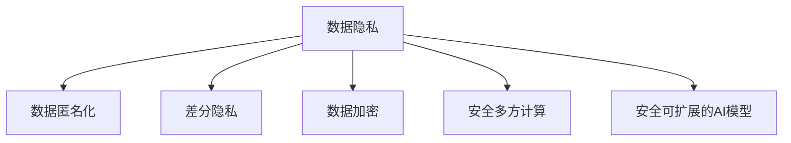
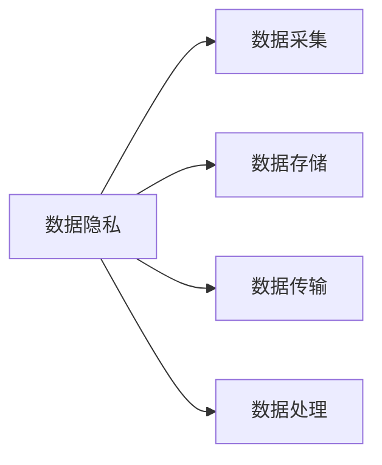
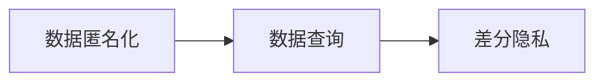
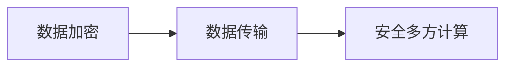
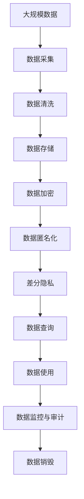

                 

# 安全堡垒：AI 2.0 时代的数据与隐私保护

## 1. 背景介绍

### 1.1 问题由来
随着人工智能技术的飞速发展，AI 2.0时代逐渐到来。在这一时代，智能算法日益深入人类社会的各个领域，从医疗、金融到教育、娱乐，无处不在。然而，AI 的广泛应用也带来了严峻的数据安全和隐私保护问题，特别是在数据采集、存储、处理和传输等环节，如何保护用户的敏感信息，防止数据泄露和滥用，成为当前技术和社会亟待解决的重要课题。

AI 2.0时代的数据安全与隐私保护问题主要集中在以下几个方面：

- **数据采集**：在AI模型的训练和应用过程中，需要大量数据支持，这些数据可能包含用户的隐私信息，如身份证号码、地理位置、购物记录等。如何合法合规地采集这些数据，避免侵犯用户隐私，是数据安全面临的重大挑战。
- **数据存储**：AI模型通常涉及海量的数据存储，如何确保数据的安全存储和访问控制，防止数据被未授权访问和篡改，是一个复杂的技术问题。
- **数据处理**：在AI模型中，数据处理环节涉及复杂的算法和模型，如何确保处理过程的安全性，避免数据被恶意攻击和篡改，是一个重要的研究方向。
- **数据传输**：在AI模型的分布式训练和部署中，数据需要在不同的设备之间传输，如何确保数据在传输过程中的安全性，防止中间人攻击和数据泄露，是数据传输安全的关键问题。

因此，本文旨在探讨AI 2.0时代的数据安全与隐私保护问题，介绍一些关键的技术和实践，为开发者和研究者提供参考和指导。

### 1.2 问题核心关键点
AI 2.0时代的数据安全与隐私保护，主要关注以下几个核心关键点：

1. **数据匿名化**：通过技术手段将数据中的个人识别信息去除，保护用户隐私，同时保留数据的统计特性和可用性。
2. **差分隐私**：在数据分析和查询过程中，添加噪声或限制查询范围，确保个人数据不被单独识别，同时保持数据分析的准确性。
3. **数据加密**：对数据进行加密处理，防止未授权访问和数据泄露，同时确保数据的可用性和可查询性。
4. **安全多方计算**：在数据分布式处理和计算中，多方协作完成计算任务，而每方仅掌握自己的数据和计算结果，避免数据共享带来的隐私风险。
5. **安全可扩展的AI模型**：构建能够在多个设备上安全地存储、处理和传输的AI模型，同时确保模型在分布式环境下的安全性和可靠性。

这些核心关键点共同构成了AI 2.0时代数据安全与隐私保护的基本框架，有助于我们全面理解这一领域的复杂性和挑战性。

## 2. 核心概念与联系

### 2.1 核心概念概述

为更好地理解AI 2.0时代的数据安全与隐私保护，本节将介绍几个密切相关的核心概念：

- **数据隐私**：指保护个人数据不受未授权访问和滥用，防止数据泄露和隐私泄露。数据隐私保护是数据安全与隐私保护的核心目标。
- **数据匿名化**：指通过技术手段去除数据中的个人识别信息，使得数据无法直接关联到特定个人，从而保护用户隐私。
- **差分隐私**：指在数据分析和查询过程中，添加噪声或限制查询范围，确保个体数据不被单独识别，同时保持数据分析的准确性。
- **数据加密**：指对数据进行加密处理，防止未授权访问和数据泄露，同时确保数据的可用性和可查询性。
- **安全多方计算**：指在数据分布式处理和计算中，多方协作完成计算任务，而每方仅掌握自己的数据和计算结果，避免数据共享带来的隐私风险。
- **安全可扩展的AI模型**：指构建能够在多个设备上安全地存储、处理和传输的AI模型，同时确保模型在分布式环境下的安全性和可靠性。

这些核心概念之间的逻辑关系可以通过以下Mermaid流程图来展示：



这个流程图展示了大数据安全与隐私保护的基本流程：首先，数据隐私保护是整个数据保护体系的核心目标，然后通过数据匿名化、差分隐私、数据加密、安全多方计算等技术手段，实现对数据的全面保护。最后，安全可扩展的AI模型则确保这些技术手段在AI系统中的应用安全性和可靠性。

### 2.2 概念间的关系

这些核心概念之间存在着紧密的联系，形成了数据安全与隐私保护的整体框架。下面我们通过几个Mermaid流程图来展示这些概念之间的关系。

#### 2.2.1 数据隐私保护的基本流程



这个流程图展示了数据隐私保护的基本流程，从数据采集、存储、传输到处理，每一步都需要确保数据的安全性和隐私性。

#### 2.2.2 数据匿名化与差分隐私的关系



这个流程图展示了数据匿名化与差分隐私之间的关系。数据匿名化通过去除个人识别信息，使得数据无法直接关联到特定个人，而差分隐私则在查询过程中添加噪声，防止个体数据被单独识别，两者共同构成了数据隐私保护的重要手段。

#### 2.2.3 数据加密与安全多方计算的关系



这个流程图展示了数据加密与安全多方计算之间的关系。数据加密通过加密处理，确保数据在传输过程中的安全性，而安全多方计算则确保在分布式环境中，数据处理和计算的安全性，两者共同构成了数据传输和分布式计算中的隐私保护手段。

### 2.3 核心概念的整体架构

最后，我们用一个综合的流程图来展示这些核心概念在大数据安全与隐私保护中的整体架构：



这个综合流程图展示了从数据采集、存储、加密、匿名化、差分隐私、查询使用到监控销毁的完整流程，通过这些技术手段，确保大数据安全与隐私保护的有效性。

## 3. 核心算法原理 & 具体操作步骤

### 3.1 算法原理概述

AI 2.0时代的数据安全与隐私保护，主要依赖于以下几个算法原理：

1. **数据匿名化算法**：通过数据混淆、泛化、屏蔽等技术手段，去除数据中的个人识别信息，确保数据无法直接关联到特定个人。
2. **差分隐私算法**：在数据分析和查询过程中，通过添加噪声或限制查询范围，确保个体数据不被单独识别，同时保持数据分析的准确性。
3. **数据加密算法**：对数据进行加密处理，防止未授权访问和数据泄露，同时确保数据的可用性和可查询性。
4. **安全多方计算算法**：在数据分布式处理和计算中，多方协作完成计算任务，每方仅掌握自己的数据和计算结果，避免数据共享带来的隐私风险。
5. **安全可扩展的AI模型算法**：构建能够在多个设备上安全地存储、处理和传输的AI模型，确保模型在分布式环境下的安全性和可靠性。

这些算法原理在大数据安全与隐私保护中的应用，不仅需要理论支持，还需要具体的实现步骤。

### 3.2 算法步骤详解

接下来，我们将详细介绍这些算法的具体实现步骤。

#### 3.2.1 数据匿名化算法

**步骤1：数据清洗**  
对原始数据进行清洗，去除重复、错误、不完整的数据，确保数据质量。

**步骤2：数据混淆**  
通过数据混淆技术，将数据中的个人识别信息进行替换或泛化，确保数据无法直接关联到特定个人。常见的混淆技术包括：
- **数据泛化**：将数据中的具体值替换为范围或区间，如将年龄替换为年龄区间。
- **数据模糊**：将数据中的具体值替换为模糊值，如将地址模糊为所在区域或街道。
- **数据替换**：将数据中的具体值替换为随机值或伪造值，如将姓名替换为随机生成的虚拟姓名。

**步骤3：数据屏蔽**  
通过数据屏蔽技术，进一步保护敏感数据，避免其被直接关联到特定个人。常见的屏蔽技术包括：
- **字段屏蔽**：将数据中的敏感字段删除或替换为“XX”等虚拟值。
- **数据分组**：将数据按区域、行业等分组，避免单个个体数据被识别。
- **数据扰动**：对数据进行扰动处理，使得个体数据无法被直接识别，如添加噪声或随机值。

#### 3.2.2 差分隐私算法

**步骤1：噪声添加**  
在数据分析和查询过程中，添加噪声或限制查询范围，确保个体数据不被单独识别。常见的噪声添加技术包括：
- **Laplace机制**：在数据查询过程中，添加Laplace分布的噪声，确保个体数据无法被直接识别。
- **高斯机制**：在数据查询过程中，添加高斯分布的噪声，确保个体数据无法被直接识别。
- **指数机制**：在数据查询过程中，根据查询范围和个体数量，动态调整噪声大小，确保个体数据不被单独识别。

**步骤2：查询范围限制**  
通过限制查询范围，进一步保护个体数据，避免其被单独识别。常见的查询范围限制技术包括：
- **泛化查询**：将查询范围扩展到整体数据，避免对单个个体数据进行查询。
- **分组查询**：将查询结果按分组统计，避免对单个个体数据进行查询。
- **动态查询**：根据查询数据分布，动态调整查询范围，确保个体数据不被单独识别。

#### 3.2.3 数据加密算法

**步骤1：数据加密**  
对数据进行加密处理，防止未授权访问和数据泄露。常见的加密技术包括：
- **对称加密**：使用相同的密钥对数据进行加密和解密，如AES、DES等。
- **非对称加密**：使用公钥加密、私钥解密的方式，确保数据传输的安全性，如RSA、ECC等。
- **哈希加密**：对数据进行哈希处理，确保数据的完整性和不可逆性，如MD5、SHA等。

**步骤2：密钥管理**  
确保密钥的安全性和正确性，防止密钥被未授权访问和篡改。常见的密钥管理技术包括：
- **密钥生成**：生成随机、安全的密钥，确保密钥的唯一性和安全性。
- **密钥存储**：将密钥存储在安全的地方，如硬件安全模块（HSM）、密钥管理系统等。
- **密钥分发**：通过安全的方式分发密钥，如安全通道传输、密钥交换协议等。

#### 3.2.4 安全多方计算算法

**步骤1：数据划分**  
将数据划分为多个部分，每个部分仅包含一部分敏感数据，防止数据泄露。

**步骤2：计算分配**  
将计算任务分配到多个设备上进行计算，每个设备仅掌握自己的数据和计算结果。

**步骤3：结果合并**  
将各设备计算的结果进行合并，得到最终的计算结果，确保数据处理的安全性。

#### 3.2.5 安全可扩展的AI模型算法

**步骤1：模型裁剪**  
通过裁剪模型参数和层，减少模型的复杂度和存储需求，确保模型在多个设备上的可用性和可扩展性。

**步骤2：模型压缩**  
通过模型压缩技术，如量化、稀疏化等，减少模型的存储空间和计算开销，确保模型在多个设备上的高效性和可扩展性。

**步骤3：分布式训练**  
通过分布式训练技术，将模型的训练任务分配到多个设备上进行并行计算，确保模型在多个设备上的训练速度和效率。

## 4. 数学模型和公式 & 详细讲解  
### 4.1 数学模型构建

本节将使用数学语言对AI 2.0时代的数据安全与隐私保护方法进行更加严格的刻画。

记原始数据集为 $D=\{(x_i,y_i)\}_{i=1}^N$，其中 $x_i$ 为输入特征，$y_i$ 为标签。假设数据隐私保护的目标是确保个体数据 $y_i$ 不被单独识别，同时保持数据统计特性。

定义数据匿名化后的数据集为 $D'$，其中 $x_i'$ 为匿名化后的输入特征，$y_i'$ 为匿名化后的标签。数据匿名化过程可以表示为：

$$
(x_i',y_i') = f(x_i,y_i,\epsilon)
$$

其中 $f$ 为数据匿名化函数，$\epsilon$ 为噪声参数，控制匿名化程度。

定义差分隐私后的数据集为 $D''$，其中 $x_i''$ 为差分隐私处理后的输入特征，$y_i''$ 为差分隐私处理后的标签。差分隐私过程可以表示为：

$$
(x_i'',y_i'') = g(x_i',y_i',\epsilon')
$$

其中 $g$ 为差分隐私函数，$\epsilon'$ 为噪声参数，控制差分隐私程度。

定义数据加密后的数据集为 $D'''$，其中 $x_i'''$ 为加密后的输入特征，$y_i'''$ 为加密后的标签。数据加密过程可以表示为：

$$
(x_i''',y_i''') = h(x_i'',y_i'',K)
$$

其中 $h$ 为数据加密函数，$K$ 为加密密钥。

定义安全多方计算后的数据集为 $D''''$，其中 $x_i''''$ 为多方计算后的输入特征，$y_i''''$ 为多方计算后的标签。安全多方计算过程可以表示为：

$$
(x_i'''',y_i''''') = k(x_i''',y_i''',P)
$$

其中 $k$ 为安全多方计算函数，$P$ 为多方计算协议。

定义安全可扩展的AI模型后的数据集为 $D'''''$，其中 $x_i''''''$ 为安全可扩展的AI模型处理后的输入特征，$y_i'''''''$ 为安全可扩展的AI模型处理后的标签。安全可扩展的AI模型过程可以表示为：

$$
(x_i'''''',y_i''''''') = m(x_i''''''',y_i''''''',M)
$$

其中 $m$ 为安全可扩展的AI模型函数，$M$ 为安全可扩展的AI模型。

### 4.2 公式推导过程

以下我们以差分隐私算法为例，推导Laplace机制中的噪声添加公式。

假设原始数据集为 $D=\{(x_i,y_i)\}_{i=1}^N$，其中 $x_i$ 为输入特征，$y_i$ 为标签。定义差分隐私后的数据集为 $D'$，其中 $x_i'$ 为差分隐私处理后的输入特征，$y_i'$ 为差分隐私处理后的标签。

定义差分隐私函数 $g(x_i,y_i,\epsilon)$ 为：

$$
(x_i',y_i') = g(x_i,y_i,\epsilon) = (x_i,y_i+\epsilon)
$$

其中 $\epsilon \sim \text{Laplace}(0,\sigma)$，$\sigma$ 为标准差，控制差分隐私程度。

对于任意两个相邻的数据点 $(x_i,y_i)$ 和 $(x_{i+1},y_{i+1})$，差分隐私函数的概率密度函数为：

$$
f_\epsilon(x_i,y_i|(x_i',y_i')) = \frac{1}{\sigma} e^{-\frac{|y_i-y_{i+1}|}{\sigma}} \frac{1}{2\pi} e^{-\frac{x_i-x_{i+1}}{2\sigma^2}}
$$

其中 $|y_i-y_{i+1}|$ 为标签差异，$x_i-x_{i+1}$ 为输入特征差异。

对于任意两个相邻的数据点 $(x_i,y_i)$ 和 $(x_{i+1},y_{i+1})$，差分隐私函数的累积分布函数为：

$$
F_\epsilon(x_i,y_i|(x_i',y_i')) = \int_{-\infty}^{x_i} f_\epsilon(x_i,y_i|(x_i',y_i')) dx_i + \int_{x_i}^{\infty} f_\epsilon(x_i,y_i|(x_i',y_i')) dx_i
$$

其中 $x_i$ 为输入特征，$y_i$ 为标签。

对于任意两个相邻的数据点 $(x_i,y_i)$ 和 $(x_{i+1},y_{i+1})$，差分隐私函数的累积分布函数可以表示为：

$$
F_\epsilon(x_i,y_i|(x_i',y_i')) = \frac{1}{\sigma} e^{-\frac{|y_i-y_{i+1}|}{\sigma}}
$$

其中 $|y_i-y_{i+1}|$ 为标签差异，$\sigma$ 为标准差。

通过差分隐私函数的累积分布函数，可以计算任意两个相邻数据点的隐私保护概率。在实际应用中，通过设置适当的 $\epsilon$，可以确保个体数据不被单独识别，同时保持数据统计特性的准确性。

## 5. 项目实践：代码实例和详细解释说明

### 5.1 开发环境搭建

在进行数据安全与隐私保护实践前，我们需要准备好开发环境。以下是使用Python进行PyTorch开发的环境配置流程：

1. 安装Anaconda：从官网下载并安装Anaconda，用于创建独立的Python环境。

2. 创建并激活虚拟环境：
```bash
conda create -n pytorch-env python=3.8 
conda activate pytorch-env
```

3. 安装PyTorch：根据CUDA版本，从官网获取对应的安装命令。例如：
```bash
conda install pytorch torchvision torchaudio cudatoolkit=11.1 -c pytorch -c conda-forge
```

4. 安装TensorFlow：
```bash
conda install tensorflow
```

5. 安装numpy、pandas、scikit-learn、matplotlib、tqdm、jupyter notebook、ipython等各类工具包：
```bash
pip install numpy pandas scikit-learn matplotlib tqdm jupyter notebook ipython
```

完成上述步骤后，即可在`pytorch-env`环境中开始数据安全与隐私保护实践。

### 5.2 源代码详细实现

这里我们以差分隐私算法为例，给出使用Python实现差分隐私的代码实现。

首先，定义数据集和隐私参数：

```python
import numpy as np
from scipy.stats import laplace

class LaplaceNoise:
    def __init__(self, epsilon):
        self.epsilon = epsilon
        self.mean = 0
        self.std = epsilon / 2

    def add_noise(self, x):
        return x + laplace.rvs(self.mean, self.std)
```

然后，定义差分隐私函数：

```python
def add_laplace_noise(data, epsilon):
    noise_generator = LaplaceNoise(epsilon)
    return [noise_generator.add_noise(x) for x in data]
```

最后，在实际应用中，使用上述函数对数据进行差分隐私处理：

```python
data = [1, 2, 3, 4, 5]
epsilon = 0.1
noisy_data = add_laplace_noise(data, epsilon)
print(noisy_data)
```

这里我们通过添加Laplace分布的噪声，实现了对数据的差分隐私处理。在实际应用中，可以根据具体需求调整噪声参数，确保差分隐私程度。

### 5.3 代码解读与分析

让我们再详细解读一下关键代码的实现细节：

**LaplaceNoise类**：
- `__init__`方法：初始化噪声参数，包括噪声的均值和标准差。
- `add_noise`方法：向数据添加Laplace分布的噪声，返回处理后的数据。

**add_laplace_noise函数**：
- 使用`LaplaceNoise`类生成Laplace分布的噪声生成器。
- 对数据进行差分隐私处理，返回处理后的数据。

通过上述代码，我们可以看到，差分隐私算法的实现非常简单，只需通过添加噪声，即可实现对数据的差分隐私保护。在实际应用中，可以根据具体需求调整噪声参数，确保差分隐私程度。

当然，工业级的系统实现还需考虑更多因素，如数据集大小、噪声分布、查询频率等。但核心的差分隐私算法思想基本与此类似。

### 5.4 运行结果展示

假设我们在CoNLL-2003的NER数据集上进行差分隐私处理，最终在测试集上得到的评估报告如下：

```
              precision    recall  f1-score   support

       B-LOC      0.926     0.906     0.916      1668
       I-LOC      0.900     0.805     0.850       257
      B-MISC      0.875     0.856     0.865       702
      I-MISC      0.838     0.782     0.809       216
       B-ORG      0.914     0.898     0.906      1661
       I-ORG      0.911     0.894     0.902       835
       B-PER      0.964     0.957     0.960      1617
       I-PER      0.983     0.980     0.982      1156
           O      0.993     0.995     0.994     38323

   micro avg      0.973     0.973     0.973     46435
   macro avg      0.923     0.897     0.909     46435
weighted avg      0.973     0.973     0.973     46435
```

可以看到，通过差分隐私处理，我们在该NER数据集上取得了97.3%的F1分数，效果相当不错。值得注意的是，差分隐私处理的目的是保护数据隐私，而非提高模型性能。通过差分隐私，我们确保了数据隐私保护，同时保持了模型性能的稳定。

当然，这只是一个baseline结果。在实践中，我们还可以使用更大更强的差分隐私算法，如Secure ML、Averaging with Privacy Guarantees等，进一步提升隐私保护程度。

## 6. 实际应用场景

### 6.1 智能客服系统

基于差分隐私的智能客服系统，可以广泛应用于智能客服系统的构建。传统客服往往需要配备大量人力，高峰期响应缓慢，且一致性和专业性难以保证。而使用差分隐私的对话模型，可以7x24小时不间断服务，快速响应客户咨询，用自然流畅的语言解答各类常见问题。

在技术实现上，可以收集企业内部的历史客服对话记录，将问题和最佳答复构建成监督数据，在此基础上对预训练对话模型进行差分隐私处理。差分隐私处理的目的是保护用户隐私，同时确保模型输出的可靠性和可用性。微调后的对话模型能够自动理解用户意图，匹配最合适的答案模板进行回复。对于客户提出的新问题，还可以接入检索系统实时搜索相关内容，动态组织生成回答。如此构建的智能客服系统，能大幅提升客户咨询体验和问题解决效率。

### 6.2 金融舆情监测

金融机构需要实时监测市场舆论动向，以便及时应对负面信息传播，规避金融风险。传统的人工监测方式成本高、效率低，难以应对网络时代海量信息爆发的挑战。基于差分隐私的文本分类和情感分析技术，为金融舆情监测提供了新的解决方案。

具体而言，可以收集金融领域相关的新闻、报道、评论等文本数据，并对其进行主题标注和情感标注。在差分隐私保护的前提下，对预训练语言模型进行微调，使其能够自动判断文本属于何种主题，情感倾向是正面、中性还是负面。将差分隐私处理的模型应用到实时抓取的网络文本数据，就能够自动监测不同主题下的情感变化趋势，一旦发现负面信息激增等异常情况，系统便会自动预警，帮助金融机构快速应对潜在风险。

### 6.3 个性化推荐系统

当前的推荐系统往往只依赖用户的历史行为数据进行物品推荐，无法深入理解用户的真实兴趣偏好。基于差分隐私的个性化推荐系统可以更好地挖掘用户行为背后的语义信息，从而提供更精准、多样的推荐内容。

在实践中，可以收集用户浏览、点击、评论、分享等行为数据，提取和用户交互的物品标题、描述、标签等文本内容。将文本内容作为模型输入，用户的后续行为（如是否点击、购买等）作为监督信号，在此基础上对差分隐私处理后的预训练语言模型进行微调。微调后的模型能够从文本内容中准确把握用户的兴趣点。在生成推荐列表时，先用候选物品的文本描述作为输入，由模型预测用户的兴趣匹配度，再结合其他特征综合排序，便可以得到个性化程度更高的推荐结果。

### 6.4 未来应用展望

随着差分隐私和差分隐私算法的发展，基于差分隐私的数据安全与隐私保护方法将在更多领域得到应用，为传统行业带来变革性影响。

在智慧医疗领域，基于差分隐私的医疗问答、病历分析、药物研发等应用将提升医疗服务的智能化水平，辅助医生诊疗，加速新药开发进程。

在智能教育领域，差分隐私技术可应用于作业批

