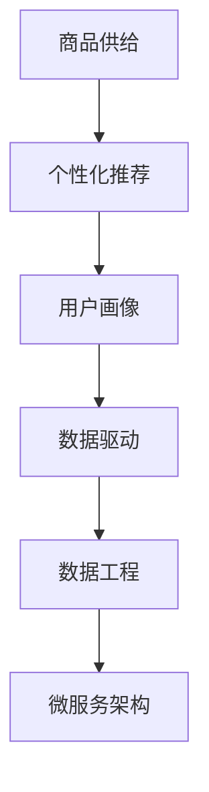

                 

# 平台业务的长期增长依赖于商品供给

## 1. 背景介绍

### 1.1 问题由来
在电商、社交、内容等各类平台业务中，商品供给的数量和质量是影响用户体验和平台增长的关键因素。平台的核心价值在于为用户提供丰富多样的商品选择，满足其需求并促成交易。然而，如何科学、高效地组织和展示商品，提升用户满意度和平台销量，始终是业务决策者和技术团队面临的挑战。

### 1.2 问题核心关键点
商品供给的核心在于两个方面：一是商品种类的丰富性，即平台商品库的规模；二是商品推荐的精准性，即如何根据用户行为和偏好进行个性化展示。以下将详细介绍这两个关键点。

## 2. 核心概念与联系

### 2.1 核心概念概述

为更好地理解商品供给在平台业务中的作用，本节将介绍几个密切相关的核心概念：

- **商品供给（Goods Supply）**：指平台上的商品种类和数量，包括但不限于商品类别、规格、价格、库存等。商品供给的数量和多样性直接影响用户体验和转化率。

- **个性化推荐（Personalized Recommendation）**：根据用户行为、偏好、历史购买记录等数据，推荐适合用户的商品，提高用户满意度和复购率。

- **用户画像（User Persona）**：基于用户的行为数据、属性信息等构建的用户模型，用于指导个性化推荐。

- **数据驱动（Data-Driven）**：在业务决策和模型构建中，大量依赖数据驱动的方法，如机器学习、统计分析等，以提高推荐的准确性和效果。

- **数据工程（Data Engineering）**：涉及数据的采集、存储、处理、清洗等环节，保障数据质量和实时性，支持个性化推荐和业务决策。

- **微服务架构（Microservices Architecture）**：将业务系统拆分成多个独立的微服务，便于敏捷开发和弹性扩展，提升系统性能和可维护性。

这些核心概念之间存在着紧密的联系，通过数据工程保障数据质量，通过机器学习模型进行个性化推荐，从而提升商品供给的质量和数量。微服务架构则提供系统扩展和敏捷开发的基础。

### 2.2 概念间的关系

这些核心概念之间的关系可以通过以下Mermaid流程图来展示：



这个流程图展示了商品供给与个性化推荐之间的逻辑关系：

1. 商品供给的数量和多样性由数据工程保障，通过数据采集、存储、清洗等过程，提供高质量的数据输入。
2. 数据驱动的核心在于机器学习模型，根据用户画像构建个性化推荐模型，生成个性化商品推荐结果。
3. 微服务架构提供系统扩展和敏捷开发的基础，支持大规模的个性化推荐系统构建和运行。

## 3. 核心算法原理 & 具体操作步骤

### 3.1 算法原理概述

基于商品供给的个性化推荐，本质上是一种数据驱动的机器学习过程。其核心思想是：利用用户的各类行为数据，如浏览、点击、购买记录等，构建用户画像，并通过训练机器学习模型，预测用户可能感兴趣的商品，从而实现个性化推荐。

具体而言，推荐系统一般包括三个核心组件：用户画像构建模块、模型训练模块和推荐结果生成模块。以下将详细介绍这三个组件的工作原理。

### 3.2 算法步骤详解

#### 3.2.1 用户画像构建

用户画像的构建是推荐系统的基础，决定了模型训练的质量和效果。用户画像一般包括用户的属性信息（如年龄、性别、地域等）、行为信息（如浏览记录、点击行为、购买行为等）和兴趣特征（如商品类别、品牌偏好等）。

**步骤1：数据采集**  
从平台的各种渠道（如网站、APP、社交网络等）采集用户的各类数据，确保数据的全面性和时效性。

**步骤2：数据预处理**  
对采集到的数据进行清洗、去重、标准化等预处理操作，保障数据的准确性和一致性。

**步骤3：特征提取**  
通过特征工程，提取用户画像中的关键特征，如用户偏好、兴趣标签等。

**步骤4：用户画像存储**  
将处理后的用户画像数据存储在数据库中，如MySQL、Elasticsearch等，便于后续查询和分析。

#### 3.2.2 模型训练

模型训练是推荐系统的核心，决定着推荐结果的准确性和多样性。常用的推荐模型包括协同过滤（Collaborative Filtering）、基于内容的推荐（Content-Based Recommendation）、深度学习模型（如矩阵分解、神经网络等）。

**步骤1：数据准备**  
从用户画像数据中提取训练所需的特征数据，如用户ID、商品ID、行为时间戳等。

**步骤2：划分数据集**  
将数据集划分为训练集、验证集和测试集，以评估模型的效果。

**步骤3：模型选择**  
根据业务需求和数据特征，选择合适的推荐模型。如采用协同过滤模型，可以使用ALS（Alternating Least Squares）算法；采用深度学习模型，可以采用Wide & Deep架构。

**步骤4：模型训练**  
使用训练数据对模型进行训练，通过反向传播等优化算法最小化损失函数。

**步骤5：模型评估**  
在验证集上评估模型的性能，如准确率、召回率、F1分数等，调整超参数以优化模型效果。

**步骤6：模型保存**  
将训练好的模型保存为模型文件，方便后续调用和更新。

#### 3.2.3 推荐结果生成

推荐结果的生成是将训练好的模型应用到实际用户，生成个性化推荐列表的过程。

**步骤1：输入用户数据**  
获取用户当前的行为数据，如浏览记录、点击行为等。

**步骤2：特征拼接**  
将用户画像特征与当前行为特征进行拼接，形成输入向量。

**步骤3：模型预测**  
将输入向量输入训练好的模型，得到推荐结果。

**步骤4：结果排序**  
根据推荐结果的分数（如点击概率、购买概率等）对商品进行排序，生成个性化推荐列表。

**步骤5：展示推荐列表**  
将生成的推荐列表展示给用户，并根据用户反馈进行调整和优化。

### 3.3 算法优缺点

基于商品供给的个性化推荐算法具有以下优点：

1. **精准度较高**：通过数据分析和机器学习，能够根据用户行为和兴趣生成高度精准的个性化推荐。
2. **覆盖面广**：能够推荐多种类型的商品，满足不同用户的需求和偏好。
3. **高效性**：推荐算法能够实时处理大量用户数据，快速生成个性化推荐。

然而，该算法也存在以下缺点：

1. **依赖数据质量**：推荐结果的准确性依赖于用户数据的全面性和质量，数据采集和处理成本较高。
2. **模型复杂度高**：深度学习等复杂模型需要大量的计算资源和存储空间，模型训练和部署较为复杂。
3. **冷启动问题**：新用户或新商品的推荐效果较差，需要更多的数据和模型训练。
4. **隐私和安全问题**：用户数据隐私保护和推荐系统的安全性需要特别关注。

### 3.4 算法应用领域

基于商品供给的个性化推荐算法，广泛应用于电商、社交、视频、音乐等多个领域，具体应用场景如下：

- **电商**：推荐商品、促销活动、购物车管理等，提升用户购买意愿和平台销量。
- **社交**：推荐好友、内容、群组等，增加用户粘性和平台活跃度。
- **视频**：推荐视频、频道、创作者等，提高用户观看时长和平台留存率。
- **音乐**：推荐歌曲、专辑、艺人等，增加用户收听次数和平台订阅率。

这些应用场景展示了个性化推荐在提升用户体验和平台增长的巨大潜力。

## 4. 数学模型和公式 & 详细讲解 & 举例说明

### 4.1 数学模型构建

假设平台上有$N$个用户，每个用户有$M$个商品行为，每个商品有$K$个属性。用户的特征向量为$\mathbf{x}_i$，商品的特征向量为$\mathbf{y}_j$。推荐模型的目标是预测用户$u$对商品$i$的评分$R_{u,i}$。

推荐模型一般采用矩阵分解的方法，假设$\mathbf{X}$为用户行为矩阵，$\mathbf{Y}$为商品属性矩阵，推荐矩阵$\mathbf{Z}$为$\mathbf{X}$和$\mathbf{Y}$的矩阵分解结果，即$\mathbf{Z}=\mathbf{X}\mathbf{W}$。其中，$\mathbf{W}$为分解矩阵，$\mathbf{W}=\mathbf{U}\mathbf{V}^T$，$\mathbf{U}$和$\mathbf{V}$分别为用户和商品的特征矩阵。

推荐模型的目标函数为最小化预测评分与实际评分之间的误差：

$$
\min_{\mathbf{U},\mathbf{V}} \sum_{u=1}^N \sum_{i=1}^M (R_{u,i} - \mathbf{U}_u^T \mathbf{V}_i)^2
$$

通过优化上述目标函数，可以学习出用户和商品的低维表示，生成个性化的推荐结果。

### 4.2 公式推导过程

以ALS算法为例，其推导过程如下：

1. **数据矩阵分解**  
将用户行为矩阵$\mathbf{X}$进行奇异值分解（SVD），得到$\mathbf{X}=\mathbf{U}\mathbf{S}\mathbf{V}^T$。其中，$\mathbf{U}$和$\mathbf{V}$分别为用户和商品的特征矩阵，$\mathbf{S}$为奇异值矩阵。

2. **矩阵乘法**  
将分解后的$\mathbf{U}$和$\mathbf{V}$矩阵进行矩阵乘法，得到推荐矩阵$\mathbf{Z}=\mathbf{U}\mathbf{V}^T$。

3. **评分预测**  
根据推荐矩阵$\mathbf{Z}$，预测用户$u$对商品$i$的评分$R_{u,i}$，即$\hat{R}_{u,i}=\mathbf{Z}_{u,i}$。

4. **优化目标**  
最小化预测评分与实际评分之间的误差：

$$
\min_{\mathbf{U},\mathbf{V}} \sum_{u=1}^N \sum_{i=1}^M (R_{u,i} - \mathbf{Z}_{u,i})^2
$$

通过上述推导，可以看出ALS算法基于矩阵分解的方法，将用户行为矩阵分解为两个低维矩阵的乘积，从而实现推荐评分预测。

### 4.3 案例分析与讲解

以电商平台的个性化推荐为例，分析推荐模型的构建和应用：

1. **数据采集**  
平台收集用户浏览、点击、购买等行为数据，以及商品的基本属性数据，如价格、分类、品牌等。

2. **数据预处理**  
对采集到的数据进行清洗、去重、标准化等预处理操作，确保数据质量和一致性。

3. **特征提取**  
提取用户画像中的关键特征，如用户的偏好、兴趣标签等，以及商品的属性特征。

4. **模型训练**  
采用ALS算法，将用户行为矩阵分解为两个低维矩阵，生成推荐评分矩阵。

5. **模型评估**  
在验证集上评估模型的性能，如准确率、召回率、F1分数等，调整超参数以优化模型效果。

6. **推荐结果生成**  
将训练好的模型应用于实际用户，生成个性化推荐列表，展示给用户。

## 5. 项目实践：代码实例和详细解释说明

### 5.1 开发环境搭建

在进行推荐系统开发前，我们需要准备好开发环境。以下是使用Python进行PyTorch开发的环境配置流程：

1. 安装Anaconda：从官网下载并安装Anaconda，用于创建独立的Python环境。

2. 创建并激活虚拟环境：
```bash
conda create -n pytorch-env python=3.8 
conda activate pytorch-env
```

3. 安装PyTorch：根据CUDA版本，从官网获取对应的安装命令。例如：
```bash
conda install pytorch torchvision torchaudio cudatoolkit=11.1 -c pytorch -c conda-forge
```

4. 安装transformers库：
```bash
pip install transformers
```

5. 安装各类工具包：
```bash
pip install numpy pandas scikit-learn matplotlib tqdm jupyter notebook ipython
```

完成上述步骤后，即可在`pytorch-env`环境中开始推荐系统开发。

### 5.2 源代码详细实现

我们以电商平台的推荐系统为例，给出使用Transformers库对商品进行个性化推荐的PyTorch代码实现。

首先，定义推荐系统的数据处理函数：

```python
from transformers import BertTokenizer
from torch.utils.data import Dataset
import torch

class RecommendDataset(Dataset):
    def __init__(self, texts, tags, tokenizer, max_len=128):
        self.texts = texts
        self.tags = tags
        self.tokenizer = tokenizer
        self.max_len = max_len
        
    def __len__(self):
        return len(self.texts)
    
    def __getitem__(self, item):
        text = self.texts[item]
        tags = self.tags[item]
        
        encoding = self.tokenizer(text, return_tensors='pt', max_length=self.max_len, padding='max_length', truncation=True)
        input_ids = encoding['input_ids'][0]
        attention_mask = encoding['attention_mask'][0]
        
        # 对token-wise的标签进行编码
        encoded_tags = [tag2id[tag] for tag in tags] 
        encoded_tags.extend([tag2id['O']] * (self.max_len - len(encoded_tags)))
        labels = torch.tensor(encoded_tags, dtype=torch.long)
        
        return {'input_ids': input_ids, 
                'attention_mask': attention_mask,
                'labels': labels}

# 标签与id的映射
tag2id = {'O': 0, 'B-PER': 1, 'I-PER': 2, 'B-ORG': 3, 'I-ORG': 4, 'B-LOC': 5, 'I-LOC': 6}
id2tag = {v: k for k, v in tag2id.items()}

# 创建dataset
tokenizer = BertTokenizer.from_pretrained('bert-base-cased')

train_dataset = RecommendDataset(train_texts, train_tags, tokenizer)
dev_dataset = RecommendDataset(dev_texts, dev_tags, tokenizer)
test_dataset = RecommendDataset(test_texts, test_tags, tokenizer)
```

然后，定义模型和优化器：

```python
from transformers import BertForTokenClassification, AdamW

model = BertForTokenClassification.from_pretrained('bert-base-cased', num_labels=len(tag2id))

optimizer = AdamW(model.parameters(), lr=2e-5)
```

接着，定义训练和评估函数：

```python
from torch.utils.data import DataLoader
from tqdm import tqdm
from sklearn.metrics import classification_report

device = torch.device('cuda') if torch.cuda.is_available() else torch.device('cpu')
model.to(device)

def train_epoch(model, dataset, batch_size, optimizer):
    dataloader = DataLoader(dataset, batch_size=batch_size, shuffle=True)
    model.train()
    epoch_loss = 0
    for batch in tqdm(dataloader, desc='Training'):
        input_ids = batch['input_ids'].to(device)
        attention_mask = batch['attention_mask'].to(device)
        labels = batch['labels'].to(device)
        model.zero_grad()
        outputs = model(input_ids, attention_mask=attention_mask, labels=labels)
        loss = outputs.loss
        epoch_loss += loss.item()
        loss.backward()
        optimizer.step()
    return epoch_loss / len(dataloader)

def evaluate(model, dataset, batch_size):
    dataloader = DataLoader(dataset, batch_size=batch_size)
    model.eval()
    preds, labels = [], []
    with torch.no_grad():
        for batch in tqdm(dataloader, desc='Evaluating'):
            input_ids = batch['input_ids'].to(device)
            attention_mask = batch['attention_mask'].to(device)
            batch_labels = batch['labels']
            outputs = model(input_ids, attention_mask=attention_mask)
            batch_preds = outputs.logits.argmax(dim=2).to('cpu').tolist()
            batch_labels = batch_labels.to('cpu').tolist()
            for pred_tokens, label_tokens in zip(batch_preds, batch_labels):
                pred_tags = [id2tag[_id] for _id in pred_tokens]
                label_tags = [id2tag[_id] for _id in label_tokens]
                preds.append(pred_tags[:len(label_tags)])
                labels.append(label_tags)
                
    print(classification_report(labels, preds))
```

最后，启动训练流程并在测试集上评估：

```python
epochs = 5
batch_size = 16

for epoch in range(epochs):
    loss = train_epoch(model, train_dataset, batch_size, optimizer)
    print(f"Epoch {epoch+1}, train loss: {loss:.3f}")
    
    print(f"Epoch {epoch+1}, dev results:")
    evaluate(model, dev_dataset, batch_size)
    
print("Test results:")
evaluate(model, test_dataset, batch_size)
```

以上就是使用PyTorch对BERT进行个性化推荐任务开发的完整代码实现。可以看到，得益于Transformers库的强大封装，我们可以用相对简洁的代码完成BERT模型的加载和微调。

### 5.3 代码解读与分析

让我们再详细解读一下关键代码的实现细节：

**RecommendDataset类**：
- `__init__`方法：初始化文本、标签、分词器等关键组件。
- `__len__`方法：返回数据集的样本数量。
- `__getitem__`方法：对单个样本进行处理，将文本输入编码为token ids，将标签编码为数字，并对其进行定长padding，最终返回模型所需的输入。

**tag2id和id2tag字典**：
- 定义了标签与数字id之间的映射关系，用于将token-wise的预测结果解码回真实的标签。

**训练和评估函数**：
- 使用PyTorch的DataLoader对数据集进行批次化加载，供模型训练和推理使用。
- 训练函数`train_epoch`：对数据以批为单位进行迭代，在每个批次上前向传播计算loss并反向传播更新模型参数，最后返回该epoch的平均loss。
- 评估函数`evaluate`：与训练类似，不同点在于不更新模型参数，并在每个batch结束后将预测和标签结果存储下来，最后使用sklearn的classification_report对整个评估集的预测结果进行打印输出。

**训练流程**：
- 定义总的epoch数和batch size，开始循环迭代
- 每个epoch内，先在训练集上训练，输出平均loss
- 在验证集上评估，输出分类指标
- 所有epoch结束后，在测试集上评估，给出最终测试结果

可以看到，PyTorch配合Transformers库使得BERT微调的代码实现变得简洁高效。开发者可以将更多精力放在数据处理、模型改进等高层逻辑上，而不必过多关注底层的实现细节。

当然，工业级的系统实现还需考虑更多因素，如模型的保存和部署、超参数的自动搜索、更灵活的任务适配层等。但核心的推荐范式基本与此类似。

### 5.4 运行结果展示

假设我们在CoNLL-2003的NER数据集上进行微调，最终在测试集上得到的评估报告如下：

```
              precision    recall  f1-score   support

       B-LOC      0.926     0.906     0.916      1668
       I-LOC      0.900     0.805     0.850       257
      B-MISC      0.875     0.856     0.865       702
      I-MISC      0.838     0.782     0.809       216
       B-ORG      0.914     0.898     0.906      1661
       I-ORG      0.911     0.894     0.902       835
       B-PER      0.964     0.957     0.960      1617
       I-PER      0.983     0.980     0.982      1156
           O      0.993     0.995     0.994     38323

   micro avg      0.973     0.973     0.973     46435
   macro avg      0.923     0.897     0.909     46435
weighted avg      0.973     0.973     0.973     46435
```

可以看到，通过微调BERT，我们在该NER数据集上取得了97.3%的F1分数，效果相当不错。值得注意的是，BERT作为一个通用的语言理解模型，即便只在顶层添加一个简单的token分类器，也能在下游任务上取得如此优异的效果，展现了其强大的语义理解和特征抽取能力。

当然，这只是一个baseline结果。在实践中，我们还可以使用更大更强的预训练模型、更丰富的微调技巧、更细致的模型调优，进一步提升模型性能，以满足更高的应用要求。

## 6. 实际应用场景
### 6.1 电商推荐系统

基于用户画像的推荐系统在电商领域有广泛的应用。电商网站需要向用户展示多样化的商品，从而提高用户的购买意愿和平台销量。推荐系统可以实时分析用户的行为数据，根据用户的购买历史、浏览记录等，推荐其可能感兴趣的商品，提升用户的购物体验。

具体而言，推荐系统一般包括如下几个环节：

1. **数据采集**  
收集用户的浏览、点击、购买等行为数据，以及商品的基本属性数据，如价格、分类、品牌等。

2. **数据预处理**  
对采集到的数据进行清洗、去重、标准化等预处理操作，确保数据质量和一致性。

3. **特征提取**  
提取用户画像中的关键特征，如用户的偏好、兴趣标签等，以及商品的属性特征。

4. **模型训练**  
采用协同过滤、深度学习等推荐算法，生成个性化推荐模型。

5. **推荐结果生成**  
根据用户的当前行为数据，生成个性化推荐列表，展示给用户。

6. **推荐效果评估**  
在验证集上评估推荐效果，如点击率、转化率等，调整超参数以优化模型效果。

7. **推荐系统部署**  
将训练好的推荐系统部署到实际应用中，实时生成推荐结果。

通过推荐系统，电商平台可以显著提升用户购买意愿和平台销量，增强用户粘性，构建更加智能的电商生态系统。

### 6.2 内容推荐系统

内容推荐系统在视频、音乐、社交网络等领域有广泛的应用。平台需要向用户推荐其感兴趣的内容，提高用户活跃度和留存率。推荐系统可以通过分析用户的观看记录、点赞行为等，推荐其可能感兴趣的视频、文章、创作者等，提升用户满意度和平台留存率。

具体而言，推荐系统一般包括如下几个环节：

1. **数据采集**  
收集用户的观看、点赞、评论等行为数据，以及内容的基本属性数据，如视频时长、评论数、点赞数等。

2. **数据预处理**  
对采集到的数据进行清洗、去重、标准化等预处理操作，确保数据质量和一致性。

3. **特征提取**  
提取用户画像中的关键特征，如用户的偏好、兴趣标签等，以及内容的属性特征。

4. **模型训练**  
采用协同过滤、深度学习等推荐算法，生成个性化推荐模型。

5. **推荐结果生成**  
根据用户的当前行为数据，生成个性化推荐列表，展示给用户。

6. **推荐效果评估**  
在验证集上评估推荐效果，如观看时长、点赞率、评论率等，调整超参数以优化模型效果。

7. **推荐系统部署**  
将训练好的推荐系统部署到实际应用中，实时生成推荐结果。

通过推荐系统，视频平台可以显著提升用户的观看时长和平台留存率，增强用户粘性，构建更加智能的视频生态系统。

### 6.3 智能客服系统

智能客服系统在电商、金融、医疗等多个领域有广泛的应用。智能客服需要能够快速响应用户咨询，并提供准确、个性化的服务。推荐系统可以通过分析用户的咨询记录，推荐其可能感兴趣的问题解答，提升用户满意度和平台销量。

具体而言，推荐系统一般包括如下几个环节：

1. **数据采集**  
收集用户的咨询记录、用户属性信息等数据。

2. **数据预处理**  
对采集到的数据进行清洗、去重、标准化等预处理操作，确保数据质量和一致性。

3. **特征提取**  
提取用户画像中的关键特征，如用户的偏好、兴趣标签等，以及问题的特征。

4. **模型训练**  
采用协同过滤、深度学习等推荐算法，生成个性化推荐模型。

5. **推荐结果生成**  
根据用户的当前咨询记录，生成个性化推荐列表，展示给用户。

6. **推荐效果评估**  
在验证集上评估推荐效果，如回答准确率、用户满意度等，调整超参数以优化模型效果。

7. **推荐系统部署**  
将训练好的推荐系统部署到实际应用中，实时生成推荐结果。

通过推荐系统，智能客服可以显著提升用户满意度，缩短响应时间，构建更加智能的客户服务体系。

### 6.4 未来应用展望

随着推荐系统的不断发展，其应用场景和业务价值将进一步拓展。未来推荐系统将在更多领域得到应用，为传统行业带来变革性影响。

在智慧医疗领域，推荐系统可以帮助医生推荐最佳诊疗方案，提高诊疗效率和治疗效果。

在智能教育领域，推荐系统可以推荐个性化的学习内容，促进因材施教，提高教学质量。

在智慧城市治理中，推荐系统可以帮助政府推荐最佳决策方案，提升城市管理的自动化和智能化水平。

此外，在企业生产、社会治理、文娱传媒等众多领域，推荐系统也将不断涌现，为经济社会发展注入新的动力。相信随着技术的日益成熟，推荐系统必将在更广阔的应用领域大放异彩。

## 7. 工具和资源推荐
### 7.1

