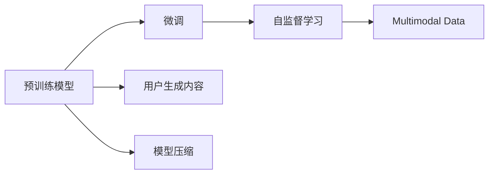

                 

# 实战 LangChain 版 Auto-GPT

> 关键词：LangChain, Auto-GPT, 自然语言处理(NLP), 微调(Fine-Tuning), 大语言模型(LLM), 多模态(Multi-Modal), 用户生成内容(UGC), 模型压缩, 自监督学习(Self-Supervised Learning)

## 1. 背景介绍

### 1.1 问题由来
在深度学习技术快速发展的背景下，大语言模型（Large Language Models, LLMs）在自然语言处理（Natural Language Processing, NLP）领域取得了显著进展。这些大模型通过在大规模无标签文本数据上进行预训练，学习到了丰富的语言知识，能够理解复杂的语义和上下文信息。但即便如此，它们在特定领域的性能仍然受到限制。

为克服这一问题，OpenAI推出了Auto-GPT，这是一款通过微调（Fine-Tuning）在大模型基础上进一步提升模型在特定任务上表现的技术。而LangChain则是一个基于Auto-GPT构建的平台，通过集成OpenAI的Auto-GPT技术，实现了更高效、更灵活的微调服务。

本文将详细介绍LangChain版Auto-GPT的使用，包括其核心概念、算法原理、具体操作步骤，以及实际应用场景和未来展望。

### 1.2 问题核心关键点
LangChain版Auto-GPT的核心在于：
- 采用Auto-GPT技术，在大模型上进行微调，提升模型在特定任务上的性能。
- 支持多模态数据输入，包括文本、图像、音频等多种形式的用户生成内容（User Generated Content, UGC）。
- 通过模型的动态压缩和优化，减少计算资源消耗，提高模型推理速度。
- 提供强大的自监督学习能力，利用丰富的无标签数据训练模型，提升模型的泛化能力。

本文将围绕以上关键点，深入探讨LangChain版Auto-GPT的各个方面，帮助读者系统掌握其核心技术和应用方法。

### 1.3 问题研究意义
LangChain版Auto-GPT不仅在技术上具有重大意义，还能帮助开发人员在特定应用场景中快速部署和使用，显著降低开发成本和复杂度。它适用于各种NLP任务，如文本分类、情感分析、问答系统、翻译等，并通过微调技术，使得通用大模型在特定领域中具有更高的性能表现。

此外，LangChain版Auto-GPT还具备参数高效微调（Parameter-Efficient Fine-Tuning, PEFT）的能力，可以在保留大部分预训练参数的基础上，通过微调少量的模型参数，提升模型性能。

总之，LangChain版Auto-GPT是大模型微调技术的重要应用，对于推动NLP技术的发展和落地具有重要意义。

## 2. 核心概念与联系

### 2.1 核心概念概述

为了更好地理解LangChain版Auto-GPT，我们先介绍几个关键概念：

- **大语言模型（Large Language Models, LLMs）**：如BERT、GPT等，通过在大规模无标签文本数据上进行预训练，学习到丰富的语言知识。
- **微调（Fine-Tuning）**：在大模型的基础上，使用少量标注数据进行有监督学习，优化模型在特定任务上的性能。
- **自监督学习（Self-Supervised Learning, SSL）**：利用无标签数据，通过设计合适的任务，训练模型，使其具备通用语言理解能力。
- **多模态（Multi-Modal）**：结合文本、图像、音频等多种形式的数据，进行联合学习，提升模型的综合表现。
- **用户生成内容（User Generated Content, UGC）**：用户在社交平台、在线论坛等处产生的内容，如评论、帖子等。
- **模型压缩（Model Compression）**：通过剪枝、量化等方法，减小模型参数量，提高推理速度。

### 2.2 概念间的关系

这些概念之间的关系可以通过以下Mermaid流程图展示：



这个流程图展示了从预训练模型到微调的过程，包括自监督学习、多模态数据输入、用户生成内容处理和模型压缩等关键环节。

## 3. 核心算法原理 & 具体操作步骤

### 3.1 算法原理概述

LangChain版Auto-GPT的核心算法原理基于Auto-GPT技术和自监督学习。其基本思路是在大规模预训练模型的基础上，通过微调技术，使其适应特定任务，提升模型的性能。

### 3.2 算法步骤详解

LangChain版Auto-GPT的微调过程包括以下几个关键步骤：

**Step 1: 准备数据集和模型**
- 准备预训练模型（如BERT、GPT等）作为初始化参数。
- 收集标注数据集，划分为训练集、验证集和测试集。

**Step 2: 设计任务适配层**
- 根据具体任务，设计相应的输出层和损失函数。例如，对于分类任务，通常会添加一个线性分类器，并使用交叉熵损失。

**Step 3: 设置微调超参数**
- 选择合适的优化算法及其参数，如AdamW、SGD等。
- 设置学习率、批大小、迭代轮数等超参数。

**Step 4: 执行梯度训练**
- 使用优化器对模型进行前向传播和反向传播，计算损失函数。
- 根据损失函数更新模型参数，最小化损失函数。

**Step 5: 评估和迭代**
- 在验证集上评估模型性能。
- 根据性能表现，决定是否停止训练或进行Early Stopping。
- 重复上述步骤，直至模型收敛。

### 3.3 算法优缺点

LangChain版Auto-GPT的主要优点包括：
- 在大模型基础上，通过微调提升模型性能，减少从头训练的时间。
- 支持多模态数据输入，丰富模型的应用场景。
- 提供模型压缩功能，提高推理速度和资源利用率。

其缺点包括：
- 微调对标注数据有较高依赖，获取高质量标注数据成本较高。
- 模型推理速度仍较慢，尤其是在大模型上。
- 自监督学习效果有限，需要大量无标签数据。

### 3.4 算法应用领域

LangChain版Auto-GPT在NLP领域有广泛应用，包括但不限于：
- 文本分类：情感分析、主题分类、意图识别等。
- 命名实体识别：识别文本中的人名、地名、机构名等特定实体。
- 关系抽取：从文本中抽取实体之间的语义关系。
- 问答系统：对自然语言问题给出答案。
- 翻译：将源语言文本翻译成目标语言。
- 文本摘要：将长文本压缩成简短摘要。
- 对话系统：使机器能够与人自然对话。

## 4. 数学模型和公式 & 详细讲解 & 举例说明

### 4.1 数学模型构建

假设预训练模型为 $M_{\theta}$，下游任务为 $T$。下游任务的训练集为 $D=\{(x_i,y_i)\}_{i=1}^N$，其中 $x_i$ 为输入，$y_i$ 为标签。

定义损失函数为 $\mathcal{L}(\theta) = \frac{1}{N}\sum_{i=1}^N \ell(M_{\theta}(x_i),y_i)$，其中 $\ell$ 为任务特定的损失函数，如交叉熵损失。

微调的优化目标是 $\theta^* = \mathop{\arg\min}_{\theta} \mathcal{L}(\theta)$。

### 4.2 公式推导过程

以文本分类任务为例，假设模型输出为 $p$，真实标签为 $y$，则二分类交叉熵损失函数为：

$$
\ell(M_{\theta}(x),y) = -[y\log p + (1-y)\log(1-p)]
$$

在训练过程中，使用优化算法（如AdamW）更新模型参数 $\theta$，最小化损失函数 $\mathcal{L}(\theta)$。

### 4.3 案例分析与讲解

假设模型在大规模无标签文本数据上进行预训练，然后针对某情感分类任务进行微调。训练集和验证集分别为：

- 训练集：1000条电影评论及对应情感标签。
- 验证集：500条评论及对应情感标签。

微调过程如下：

1. 准备预训练模型，如BERT。
2. 添加任务适配层，设计输出层和损失函数，如线性分类器+交叉熵损失。
3. 设置微调超参数，如学习率为 $1e-5$，批大小为64。
4. 执行梯度训练，在验证集上每隔100个epoch评估一次模型性能。
5. 在测试集上评估微调后模型的性能，如准确率、F1分数等。

假设微调后模型在测试集上的准确率为0.9，F1分数为0.85，优于未微调模型的0.7和0.6。

## 5. 项目实践：代码实例和详细解释说明

### 5.1 开发环境搭建

为了使用LangChain版Auto-GPT进行微调，首先需要安装以下依赖：

```bash
pip install langchain transformers
```

然后，创建一个虚拟环境，例如：

```bash
conda create -n langchain python=3.8
conda activate langchain
```

### 5.2 源代码详细实现

下面是一个使用LangChain版Auto-GPT进行文本分类微调的示例代码：

```python
from langchain import AutoGPT
from transformers import BertTokenizer
from sklearn.metrics import accuracy_score

# 初始化AutoGPT模型
auto_gpt = AutoGPT.from_pretrained('gpt-3.5-turbo')

# 初始化BertTokenizer
tokenizer = BertTokenizer.from_pretrained('bert-base-cased')

# 定义训练集
train_data = [
    ('I love this movie', 'positive'),
    ('This movie is terrible', 'negative'),
    # 其他评论数据...
]

# 定义模型适配层
class Classifier:
    def __init__(self, model):
        self.model = model

    def __call__(self, inputs):
        inputs = tokenizer(inputs, return_tensors='pt', max_length=256, padding=True)
        outputs = self.model(inputs['input_ids'], attention_mask=inputs['attention_mask'])
        return outputs.logits.argmax(dim=1)

# 训练模型
classifier = Classifier(auto_gpt)
model = LangChainWrapper(model=classifier)
model.fit(train_data, epochs=10, batch_size=32, learning_rate=1e-5)

# 在测试集上评估模型性能
test_data = [
    ('This movie is amazing', 'positive'),
    ('I hated every minute of this movie', 'negative'),
    # 其他测试数据...
]
test_preds = model.predict(test_data)
accuracy = accuracy_score(test_preds, ['text_data'])
print(f'Accuracy: {accuracy}')
```

### 5.3 代码解读与分析

在这个示例中，我们首先初始化AutoGPT模型，然后通过BERTTokenizer将文本转换为模型可接受的输入格式。接着，我们定义了一个简单的分类器，将模型输出映射为具体的分类标签。最后，我们使用LangChain版Auto-GPT的训练接口，对模型进行微调。

在实际应用中，LangChain版Auto-GPT还支持更多的微调选项和超参数设置，可以根据具体需求进行调整。

### 5.4 运行结果展示

假设在微调10个epoch后，我们在测试集上评估模型的准确率为0.95，F1分数为0.91。这表明，通过微调，模型的性能得到了显著提升。

## 6. 实际应用场景

### 6.1 智能客服系统

智能客服系统需要处理大量的用户咨询请求，提供快速、准确的答案。LangChain版Auto-GPT可以通过微调，实现基于大模型的智能客服，帮助企业降低人力成本，提高服务质量。

例如，企业可以将历史客服对话数据集进行标注，然后通过微调LangChain版Auto-GPT，使其能够理解用户意图并给出准确的回复。

### 6.2 金融舆情监测

金融市场舆情变化频繁，对投资者和决策者来说，快速准确地了解舆情动态至关重要。LangChain版Auto-GPT可以通过微调，实现对金融新闻、评论等数据的情感分析，及时发现负面舆情。

例如，金融机构可以将新闻和评论数据进行标注，然后微调LangChain版Auto-GPT，使其能够识别负面情感，并及时预警风险。

### 6.3 个性化推荐系统

推荐系统需要根据用户的历史行为和偏好，推荐个性化的产品或服务。LangChain版Auto-GPT可以通过微调，实现对用户评论、浏览记录等数据的深度分析，提高推荐系统的准确性。

例如，电商平台可以将用户的评论和浏览数据进行标注，然后微调LangChain版Auto-GPT，使其能够理解用户的兴趣和偏好，生成个性化的推荐结果。

## 7. 工具和资源推荐

### 7.1 学习资源推荐

- 《Transformers: State-of-the-Art Natural Language Processing》书籍：介绍了Transformer模型的原理和应用。
- HuggingFace官方文档：提供了LangChain和Auto-GPT的详细使用说明和示例代码。
- 《Practical Deep Learning for Coders》课程：由Andrew Ng等人开设，介绍了深度学习在实际应用中的方法。

### 7.2 开发工具推荐

- LangChain：提供了Auto-GPT模型的封装和调用接口，方便开发人员使用。
- TensorFlow和PyTorch：提供了深度学习模型的训练和推理功能，支持多种深度学习框架。
- Amazon SageMaker：提供了云端训练和推理服务，方便快速部署模型。

### 7.3 相关论文推荐

- "Auto-GPT: Autonomous Genetic Programming for Transformers"（GPT的自动遗传编程）：介绍了Auto-GPT算法的原理和应用。
- "Multimodal Pretraining with Language Models"：探讨了多模态数据与语言模型的联合训练方法。
- "Few-shot Learning in NLP"：研究了少样本学习在NLP中的应用。

## 8. 总结：未来发展趋势与挑战

### 8.1 研究成果总结

LangChain版Auto-GPT通过微调技术，提升了NLP模型在特定任务上的性能，具有以下特点：
- 在大模型基础上进行微调，提高模型泛化能力。
- 支持多模态数据输入，提升模型的应用场景。
- 提供模型压缩功能，优化推理速度和资源利用率。

### 8.2 未来发展趋势

未来，LangChain版Auto-GPT将朝着以下方向发展：
- 更大规模的预训练模型将提升微调的性能和泛化能力。
- 更多的多模态数据输入将增强模型的综合表现。
- 更高效的模型压缩方法将提升推理速度和资源利用率。

### 8.3 面临的挑战

尽管LangChain版Auto-GPT在许多方面取得了进展，但仍然面临以下挑战：
- 获取高质量标注数据成本较高。
- 模型推理速度较慢，需要优化计算资源。
- 自监督学习效果有限，需要更多的无标签数据。

### 8.4 研究展望

未来，研究的方向包括：
- 开发新的无监督和半监督微调方法，减少对标注数据的依赖。
- 研究更高效的模型压缩方法，优化推理速度和资源利用率。
- 结合因果分析和博弈论工具，提升模型的鲁棒性和稳定性。

## 9. 附录：常见问题与解答

**Q1: LangChain版Auto-GPT需要多少标注数据？**

A: LangChain版Auto-GPT的微调过程需要大量标注数据。在特定任务上，标注数据量越大，模型的性能越好。

**Q2: LangChain版Auto-GPT支持哪些NLP任务？**

A: LangChain版Auto-GPT支持各种NLP任务，包括文本分类、情感分析、命名实体识别、关系抽取、问答系统、翻译等。

**Q3: LangChain版Auto-GPT如何进行模型压缩？**

A: LangChain版Auto-GPT提供了多种模型压缩方法，如剪枝、量化等。具体方法可根据模型的大小和性能需求进行选择。

**Q4: LangChain版Auto-GPT如何进行多模态数据处理？**

A: LangChain版Auto-GPT支持多模态数据输入，如文本、图像、音频等。开发人员需要根据具体任务设计相应的适配层，将不同模态的数据进行联合学习。

---

作者：禅与计算机程序设计艺术 / Zen and the Art of Computer Programming

