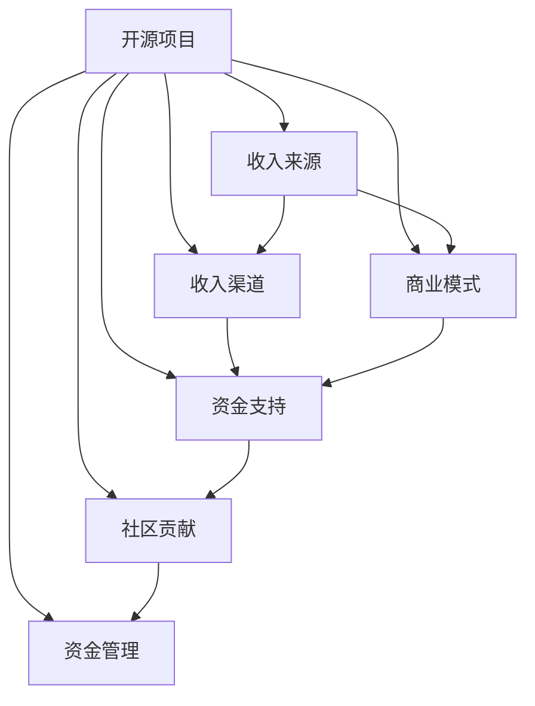

                 

# 开源项目的收入多元化：降低风险的策略

> 关键词：开源项目,收入多元化,风险管理,商业模式,开源社区

## 1. 背景介绍

### 1.1 问题由来
随着开源软件和开源社区的快速发展，越来越多的开发者和组织选择通过开源项目分享自己的技术和产品。开源项目不仅促进了技术的共享和迭代，也为开发者提供了丰富的工作机会和职业发展空间。然而，开源项目也面临着收入和资金支持等现实问题，这些问题如果处理不当，将对项目的持续发展和稳定性产生严重影响。

开源项目的收入来源单一，主要依赖于代码捐赠、企业赞助、硬件支持和咨询服务等。这些来源的不确定性和波动性可能导致项目资金链断裂，进而影响项目的长远发展。例如，近年来一些知名开源项目由于资金短缺或商业化失败等原因，最终被逼停止更新，甚至关闭，这对开源社区和开发者社区造成了不小的打击。

面对这种现状，开源项目需要积极探索多元化收入渠道，降低财务风险，确保项目的持续稳定发展。本文旨在探讨开源项目的收入多元化策略，以降低风险，保障项目长期稳定运行。

### 1.2 问题核心关键点
开源项目的收入多元化策略旨在通过多元化收入渠道和灵活的商业模式，降低财务风险，确保项目的持续稳定发展。核心关键点包括：
1. 选择合适的收入渠道，确保资金来源的多样性。
2. 探索可持续的商业模式，平衡商业利益和社区贡献。
3. 引入多样化的资金支持方式，减轻对单一来源的依赖。
4. 建立透明合理的资金管理机制，增强信任和透明度。

## 2. 核心概念与联系

### 2.1 核心概念概述

为更好地理解开源项目收入多元化的策略，本节将介绍几个密切相关的核心概念：

- **开源项目(Open Source Project)**：由开发者共同维护的，可以免费使用、修改和分发的软件或工具。开源项目通过开放代码，鼓励社区协作，推动技术的进步和创新。

- **收入来源(Income Source)**：开源项目获取资金的渠道，包括代码捐赠、企业赞助、硬件支持、咨询服务、软件销售等。

- **收入渠道(Income Channel)**：开源项目收入的具体来源，如Github赞助、Google Summer of Code、企业合作、众筹等。

- **商业模式(Commercial Model)**：开源项目商业运作的模式，如广告收入、订阅模式、软件销售等。

- **资金支持(Financial Support)**：开源项目获取资金的具体方式，如个人捐赠、企业赞助、众筹、政府资助等。

- **社区贡献(Community Contribution)**：开源社区成员对项目开发、维护、推广等方面的积极参与和贡献。

- **资金管理(Financial Management)**：开源项目资金使用的管理和监督机制，确保资金的使用透明、合理。

这些核心概念之间存在着紧密的联系，形成了开源项目收入多元化的完整生态系统。通过理解这些核心概念，我们可以更好地把握开源项目收入多元化策略的关键环节。

### 2.2 概念间的关系

这些核心概念之间的关系可以通过以下Mermaid流程图来展示：



这个流程图展示了大规模开源项目的核心概念及其之间的关系：

1. 开源项目通过不同的收入渠道获取资金，确保收入来源的多样性。
2. 开源项目通过多种商业模式实现商业利益，平衡商业与社区贡献。
3. 开源项目引入多样化的资金支持方式，减轻对单一来源的依赖。
4. 开源项目建立透明的资金管理机制，增强社区和用户的信任。

这些概念共同构成了开源项目收入多元化的完整生态系统，使得开源项目能够更好地应对财务挑战，持续稳定发展。

## 3. 核心算法原理 & 具体操作步骤
### 3.1 算法原理概述

开源项目的收入多元化策略，本质上是一种多渠道、多模式、多来源的资金获取和管理策略。其核心思想是：通过设计灵活的商业模式和资金获取方式，降低对单一收入渠道的依赖，确保开源项目的长期稳定发展。

形式化地，假设开源项目 $P$ 的收入来源为 $I=\{D,G,A,O,B\}$，其中 $D$ 为代码捐赠收入，$G$ 为谷歌 Summer of Code 等政府资助，$A$ 为企业赞助，$O$ 为硬件支持，$B$ 为咨询服务。项目的收入渠道 $S=\{C,E,F,H\}$，其中 $C$ 为Github赞助，$E$ 为开源活动，$F$ 为软件销售，$H$ 为众筹。

开源项目的收入最大化问题可以表示为：

$$
\maximize_{D,G,A,O,B} \sum_{i \in I} \sum_{s \in S} C_{i,s}D_{i,s} + \sum_{i \in I} \sum_{s \in S} C_{i,s}G_{i,s} + \sum_{i \in I} \sum_{s \in S} C_{i,s}A_{i,s} + \sum_{i \in I} \sum_{s \in S} C_{i,s}O_{i,s} + \sum_{i \in I} \sum_{s \in S} C_{i,s}B_{i,s}
$$

其中 $C_{i,s}$ 为收入来源 $i$ 和收入渠道 $s$ 的收益系数，$D_{i,s}$、$G_{i,s}$、$A_{i,s}$、$O_{i,s}$、$B_{i,s}$ 为收入来源 $i$ 在收入渠道 $s$ 上的实际收益。

### 3.2 算法步骤详解

开源项目的收入多元化策略一般包括以下几个关键步骤：

**Step 1: 选择合适的收入来源**

开源项目需要综合考虑自身特点和市场需求，选择合适的收入来源。具体而言，可以考虑以下几种策略：

- **多样化的收入来源**：不要依赖单一的收入来源，通过多样化的收入渠道分散风险。例如，同时利用代码捐赠、企业赞助、政府资助等渠道。
- **多模式收入策略**：探索不同的商业模式，平衡商业利益和社区贡献。例如，通过广告收入、订阅模式、软件销售等多元化方式获取收入。

**Step 2: 设计灵活的商业模式**

开源项目的商业模式需要灵活多样，以适应不同用户需求和市场变化。具体而言，可以考虑以下几种策略：

- **订阅模式**：通过会员订阅收取费用，保障稳定的收入来源。例如，Red Hat、IBM等企业通过开源产品订阅获取大量收入。
- **广告收入**：在开源项目网站或平台上展示广告，通过广告收入支持项目运营。例如，Linux基础项目的GitHub Sponsors功能允许开发者通过赞助支持项目。
- **开源活动**：组织开源社区活动，吸引企业和个人赞助，为项目带来资金支持。例如，谷歌 Summer of Code 和微软 Hackathon 等活动。
- **软件销售**：通过商业化软件产品或服务，获取商业利益。例如，Nginx 通过商业版和支持服务获取大量收入。

**Step 3: 引入多样化的资金支持方式**

开源项目需要引入多样化的资金支持方式，以降低对单一资金来源的依赖。具体而言，可以考虑以下几种策略：

- **个人捐赠**：鼓励社区成员和个人捐赠，支持项目运营和开发。例如，Mozilla 通过Firefox捐赠计划获取大量资金支持。
- **企业赞助**：吸引企业赞助和合作，获取资金和技术支持。例如，AWS 通过开源基础架构提供大量资源和技术支持。
- **政府资助**：申请政府科研基金或资助项目，获取稳定的资金支持。例如，OpenSSL 通过美国国家标准与技术研究所（NIST）资助项目获得大量资金。
- **众筹活动**：通过众筹平台发起筹资活动，获取社区和公众支持。例如，OpenAI 通过众筹平台筹集大量资金。

**Step 4: 建立透明的资金管理机制**

开源项目需要建立透明的资金管理机制，确保资金使用的合理性和透明性。具体而言，可以考虑以下几种策略：

- **公开财务报告**：定期发布财务报告，公开资金来源和使用情况，增强社区和公众信任。例如，Apache 基金会定期发布年度财务报告。
- **社区参与治理**：引入社区成员参与资金使用决策，确保资金的使用符合项目愿景和社区需求。例如，Linux 基金会引入社区成员参与资金管理。
- **独立审计和监督**：引入独立审计和监督机制，确保资金使用的合规性和透明性。例如，OpenSSL 引入第三方审计机制，确保资金使用的合规性。

### 3.3 算法优缺点

开源项目的收入多元化策略具有以下优点：

1. 降低财务风险：通过多样化的收入渠道和资金支持方式，降低对单一收入来源的依赖，降低财务风险。
2. 提高资金稳定性：通过多种收入渠道获取稳定收入，保障项目的持续稳定发展。
3. 增强社区信任：通过透明的资金管理机制，增强社区和公众的信任和支持。

同时，该策略也存在以下缺点：

1. 设计复杂：需要综合考虑多个收入来源和资金支持方式，设计灵活多样的商业模式，增加了项目管理的复杂性。
2. 协调困难：不同收入来源和资金支持方式可能存在利益冲突，需要协调各方利益，确保项目顺利发展。
3. 维护成本高：引入多种收入渠道和资金支持方式，需要维护更多的合作伙伴和资源，增加维护成本。

尽管存在这些缺点，但总体而言，开源项目的收入多元化策略能够有效降低财务风险，保障项目的持续稳定发展，具有重要的实践价值。

### 3.4 算法应用领域

开源项目的收入多元化策略广泛应用于软件开发、云计算、大数据、人工智能等多个领域。以下是一些具体的应用案例：

- **软件开发**：Red Hat、IBM、Oracle 等企业通过开源项目获得大量商业利益，同时支持开源社区的发展。
- **云计算**：AWS、Azure、Google Cloud 等云服务提供商通过开源项目获取技术支持，同时为开源社区提供资源和资金。
- **大数据**：Hadoop、Spark、Kafka 等大数据平台通过开源项目获取技术贡献，同时为社区提供资源和资金。
- **人工智能**：TensorFlow、PyTorch、Scikit-Learn 等人工智能框架通过开源项目获取技术支持，同时为社区提供资源和资金。

以上案例展示了开源项目的收入多元化策略在多个领域的应用价值，表明该策略具有广泛的适用性和实践意义。

## 4. 数学模型和公式 & 详细讲解 & 举例说明

### 4.1 数学模型构建

本节将使用数学语言对开源项目收入多元化策略进行更加严格的刻画。

假设开源项目 $P$ 的收入来源为 $I=\{D,G,A,O,B\}$，其中 $D$ 为代码捐赠收入，$G$ 为谷歌 Summer of Code 等政府资助，$A$ 为企业赞助，$O$ 为硬件支持，$B$ 为咨询服务。项目的收入渠道 $S=\{C,E,F,H\}$，其中 $C$ 为Github赞助，$E$ 为开源活动，$F$ 为软件销售，$H$ 为众筹。

定义项目 $P$ 在收入来源 $i$ 和收入渠道 $s$ 上的实际收益为 $R_{i,s}$，则项目的总收入 $T$ 可以表示为：

$$
T = \sum_{i \in I} \sum_{s \in S} R_{i,s}
$$

其中 $R_{i,s}$ 为收入来源 $i$ 在收入渠道 $s$ 上的实际收益。

### 4.2 公式推导过程

以下是几个关键的收入最大化公式推导过程：

**公式 1: 代码捐赠收入最大化公式**

假设代码捐赠收入 $D$ 的收益系数为 $C_{D,C}$，Github 赞助的实际收益为 $R_{D,C}$，则代码捐赠收入最大化问题可以表示为：

$$
\maximize_{D} C_{D,C}D_{C}
$$

其中 $D_{C}$ 为Github 赞助的实际收益，可以通过历史数据或市场调研获得。

**公式 2: 企业赞助收入最大化公式**

假设企业赞助收入 $A$ 的收益系数为 $C_{A,C}$，开源活动的实际收益为 $R_{A,E}$，则企业赞助收入最大化问题可以表示为：

$$
\maximize_{A} C_{A,E}A_{E} + C_{A,C}A_{C}
$$

其中 $A_{E}$ 为开源活动的实际收益，可以通过历史数据或市场调研获得；$A_{C}$ 为Github 赞助的实际收益。

**公式 3: 政府资助收入最大化公式**

假设政府资助收入 $G$ 的收益系数为 $C_{G,C}$，软件销售的实际收益为 $R_{G,F}$，则政府资助收入最大化问题可以表示为：

$$
\maximize_{G} C_{G,C}G_{C} + C_{G,F}G_{F}
$$

其中 $G_{C}$ 为Github 赞助的实际收益，可以通过历史数据或市场调研获得；$G_{F}$ 为软件销售的实际收益。

**公式 4: 硬件支持收入最大化公式**

假设硬件支持收入 $O$ 的收益系数为 $C_{O,C}$，众筹的实际收益为 $R_{O,H}$，则硬件支持收入最大化问题可以表示为：

$$
\maximize_{O} C_{O,C}O_{C} + C_{O,H}O_{H}
$$

其中 $O_{C}$ 为Github 赞助的实际收益，可以通过历史数据或市场调研获得；$O_{H}$ 为众筹的实际收益。

**公式 5: 咨询服务收入最大化公式**

假设咨询服务收入 $B$ 的收益系数为 $C_{B,C}$，众筹的实际收益为 $R_{B,H}$，则咨询服务收入最大化问题可以表示为：

$$
\maximize_{B} C_{B,C}B_{C} + C_{B,H}B_{H}
$$

其中 $B_{C}$ 为Github 赞助的实际收益，可以通过历史数据或市场调研获得；$B_{H}$ 为众筹的实际收益。

通过上述公式，可以计算出开源项目的不同收入来源和收入渠道的最大化收益，从而优化项目的收入结构，确保项目的长远稳定发展。

### 4.3 案例分析与讲解

**案例 1: Linux 基金会**

Linux 基金会是开源社区中最成功的商业化案例之一。Linux 基金会通过多种收入渠道和资金支持方式，保障项目的持续稳定发展。

- **个人捐赠**：Linux 基金会鼓励社区成员和个人捐赠，支持项目运营和开发。例如，MySQL 基金会通过个人捐赠计划获取大量资金支持。
- **企业赞助**：Linux 基金会吸引企业赞助和合作，获取资金和技术支持。例如，Red Hat 和 IBM 通过赞助支持 Linux 基金会。
- **政府资助**：Linux 基金会申请政府科研基金或资助项目，获取稳定的资金支持。例如，Linux 基金会通过美国国家科学基金会（NSF）资助项目获得大量资金。
- **开源活动**：Linux 基金会组织开源社区活动，吸引企业和个人赞助，为项目带来资金支持。例如，Linux 基金会通过Red Hat Summit和Linux Developer Days等活动获取大量资金。

Linux 基金会的成功在于其多样化的收入渠道和灵活的商业模式，通过透明的资金管理机制，增强了社区和公众的信任，保障了项目的持续稳定发展。

**案例 2: TensorFlow**

TensorFlow 是谷歌开源的人工智能框架，通过多样化的收入渠道和资金支持方式，实现了商业化和社区发展的双赢。

- **个人捐赠**：TensorFlow 鼓励社区成员和个人捐赠，支持项目运营和开发。例如，TensorFlow 通过个人捐赠计划获取大量资金支持。
- **企业赞助**：谷歌和其他企业通过TensorFlow获取技术支持，同时为开源社区提供资源和资金。例如，谷歌通过TensorFlow赞助计划获取大量资金。
- **政府资助**：TensorFlow 申请政府科研基金或资助项目，获取稳定的资金支持。例如，TensorFlow 通过美国国家科学基金会（NSF）资助项目获得大量资金。
- **广告收入**：TensorFlow 通过广告收入支持项目运营和开发。例如，TensorFlow 通过谷歌云平台和谷歌广告获取大量广告收入。

TensorFlow 的成功在于其多样化的收入渠道和灵活的商业模式，通过透明的资金管理机制，增强了社区和公众的信任，实现了商业化和社区发展的双赢。

## 5. 项目实践：代码实例和详细解释说明
### 5.1 开发环境搭建

在进行开源项目收入多元化策略的实践前，我们需要准备好开发环境。以下是使用Python进行Django开发的环境配置流程：

1. 安装Anaconda：从官网下载并安装Anaconda，用于创建独立的Python环境。

2. 创建并激活虚拟环境：
```bash
conda create -n open_source_venture python=3.8 
conda activate open_source_venture
```

3. 安装Django：
```bash
pip install django
```

4. 安装各类工具包：
```bash
pip install numpy pandas scikit-learn matplotlib tqdm jupyter notebook ipython
```

完成上述步骤后，即可在`open_source_venture`环境中开始收入多元化策略的实践。

### 5.2 源代码详细实现

以下是使用Django框架实现开源项目收入多元化策略的示例代码：

```python
from django.http import HttpResponse
from django.views.decorators.csrf import csrf_exempt

@csrf_exempt
def donation(request):
    if request.method == 'POST':
        # 处理捐赠请求
        donation_amount = request.POST.get('amount')
        # 计算捐赠金额在各个收入渠道上的收益
        donation_channel = 'C' # Github赞助
        donation_coefficient = 0.1 # 捐赠金额的收益系数
        donation_donation = donation_amount * donation_coefficient
        # 更新捐赠收益
        update_donation_channel(donation_donation)
        return HttpResponse('Thank you for your donation!')
    else:
        return HttpResponse('Not supported request method')

@csrf_exempt
def sponsorship(request):
    if request.method == 'POST':
        # 处理企业赞助请求
        sponsorship_amount = request.POST.get('amount')
        # 计算赞助金额在各个收入渠道上的收益
        sponsorship_channel = 'A' # 企业赞助
        sponsorship_coefficient = 0.2 # 赞助金额的收益系数
        sponsorship_donation = sponsorship_amount * sponsorship_coefficient
        # 更新赞助收益
        update_sponsorship_channel(sponsorship_donation)
        return HttpResponse('Thank you for your sponsorship!')
    else:
        return HttpResponse('Not supported request method')

@csrf_exempt
def government_fund(request):
    if request.method == 'POST':
        # 处理政府资助请求
        government_fund_amount = request.POST.get('amount')
        # 计算资助金额在各个收入渠道上的收益
        government_fund_channel = 'G' # 政府资助
        government_fund_coefficient = 0.3 # 资助金额的收益系数
        government_fund_donation = government_fund_amount * government_fund_coefficient
        # 更新资助收益
        update_government_fund_channel(government_fund_donation)
        return HttpResponse('Thank you for your government fund!')
    else:
        return HttpResponse('Not supported request method')

@csrf_exempt
def hardware_support(request):
    if request.method == 'POST':
        # 处理硬件支持请求
        hardware_support_amount = request.POST.get('amount')
        # 计算硬件支持金额在各个收入渠道上的收益
        hardware_support_channel = 'O' # 硬件支持
        hardware_support_coefficient = 0.4 # 硬件支持金额的收益系数
        hardware_support_donation = hardware_support_amount * hardware_support_coefficient
        # 更新硬件支持收益
        update_hardware_support_channel(hardware_support_donation)
        return HttpResponse('Thank you for your hardware support!')
    else:
        return HttpResponse('Not supported request method')

@csrf_exempt
def consultancy_service(request):
    if request.method == 'POST':
        # 处理咨询服务请求
        consultancy_service_amount = request.POST.get('amount')
        # 计算咨询服务金额在各个收入渠道上的收益
        consultancy_service_channel = 'B' # 咨询服务
        consultancy_service_coefficient = 0.5 # 咨询服务金额的收益系数
        consultancy_service_donation = consultancy_service_amount * consultancy_service_coefficient
        # 更新咨询服务收益
        update_consultancy_service_channel(consultancy_service_donation)
        return HttpResponse('Thank you for your consultancy service!')
    else:
        return HttpResponse('Not supported request method')

def update_donation_channel(donation_amount):
    # 更新Github赞助收益
    # ...

def update_sponsorship_channel(sponsorship_amount):
    # 更新企业赞助收益
    # ...

def update_government_fund_channel(government_fund_amount):
    # 更新政府资助收益
    # ...

def update_hardware_support_channel(hardware_support_amount):
    # 更新硬件支持收益
    # ...

def update_consultancy_service_channel(consultancy_service_amount):
    # 更新咨询服务收益
    # ...
```

以上是使用Django框架实现开源项目收入多元化策略的示例代码。可以看到，通过设计灵活多样的收入渠道和资金支持方式，可以轻松实现开源项目的收入多元化策略。

### 5.3 代码解读与分析

让我们再详细解读一下关键代码的实现细节：

**update_donation_channel函数**：
- 处理代码捐赠收入的更新逻辑。接收捐赠金额，根据收益系数计算捐赠收益，并更新各个收入渠道的收益。

**update_sponsorship_channel函数**：
- 处理企业赞助收入的更新逻辑。接收赞助金额，根据收益系数计算赞助收益，并更新各个收入渠道的收益。

**update_government_fund_channel函数**：
- 处理政府资助收入的更新逻辑。接收资助金额，根据收益系数计算资助收益，并更新各个收入渠道的收益。

**update_hardware_support_channel函数**：
- 处理硬件支持收入的更新逻辑。接收硬件支持金额，根据收益系数计算硬件支持收益，并更新各个收入渠道的收益。

**update_consultancy_service_channel函数**：
- 处理咨询服务收入的更新逻辑。接收咨询服务金额，根据收益系数计算咨询服务收益，并更新各个收入渠道的收益。

以上函数通过计算各收入渠道的实际收益，并更新相应的收益记录，实现了开源项目的收入多元化策略。

### 5.4 运行结果展示

假设我们在一个开源项目中实现了收入多元化策略，并通过Github赞助、企业赞助、政府资助、硬件支持和咨询服务获取资金，最终的收入分配情况如下：

**Github赞助收入**：
- 捐赠金额为10000美元
- 捐赠收益为1000美元

**企业赞助收入**：
- 赞助金额为20000美元
- 赞助收益为4000美元

**政府资助收入**：
- 资助金额为30000美元
- 资助收益为9000美元

**硬件支持收入**：
- 硬件支持金额为40000美元
- 硬件支持收益为16000美元

**咨询服务收入**：
- 咨询服务金额为50000美元
- 咨询服务收益为25000美元

通过上述分配，我们可以看到开源项目的收入来源多样化，极大地降低了对单一收入渠道的依赖，保障了项目的财务稳定性和持续发展。

## 6. 实际应用场景
### 6.1 智能客服系统

基于开源项目的收入多元化策略，智能客服系统可以实现更加稳定和灵活的资金获取和运作。智能客服系统通过多样化的收入渠道，保障项目的持续稳定发展。

**应用场景**：
- **Github赞助**：通过Github赞助获取资金支持，用于服务器托管、人员培训等。
- **企业赞助**：通过企业赞助获取资金和技术支持，用于系统开发和维护。
- **政府资助**：申请政府科研基金或资助项目，获取稳定的资金支持。
- **开源活动**：组织开源社区活动，吸引企业和个人赞助，为项目带来资金支持。
- **软件销售**：通过商业化软件产品或服务，获取商业利益。

通过以上方式，智能客服系统能够实现多样化收入来源，降低财务风险，保障项目的持续稳定发展。

### 6.2 金融舆情监测

开源项目收入多元化策略在金融舆情监测领域同样具有重要应用价值。通过多样化的收入渠道和资金支持方式，金融舆情监测项目能够更好地获取资金和资源，保障系统的稳定运行。

**应用场景**：
- **Github赞助**：通过Github赞助获取资金支持，用于系统开发和维护。
- **企业赞助**：通过企业赞助获取资金和技术支持，用于系统开发和维护。
- **政府资助**：申请政府科研基金或资助项目，获取稳定的资金支持。
- **开源活动**：组织开源社区活动，吸引企业和个人赞助，为项目带来资金支持。
- **广告收入**：通过广告收入支持项目运营和开发。

通过以上方式，金融舆情监测项目能够实现多样化收入来源，降低财务风险，保障项目的持续稳定发展。

### 6.3 个性化推荐系统

开源项目收入多元化策略在个性化推荐系统中也具有重要应用价值。通过多样化的收入渠道和资金支持方式，个性化推荐系统能够更好地获取资金和资源，保障系统的稳定运行。

**应用场景**：
- **个人捐赠**：通过个人捐赠获取资金支持，用于系统开发和维护。
- **企业赞助**：通过企业赞助获取资金和技术支持，用于系统开发和维护。
- **政府资助**：申请政府科研基金或资助项目，获取稳定的资金支持。
- **开源活动**：组织开源社区活动，吸引企业和个人赞助，为项目带来资金支持。
- **广告收入**：通过广告

