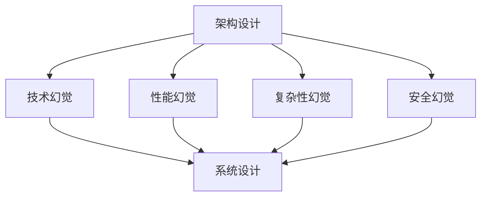
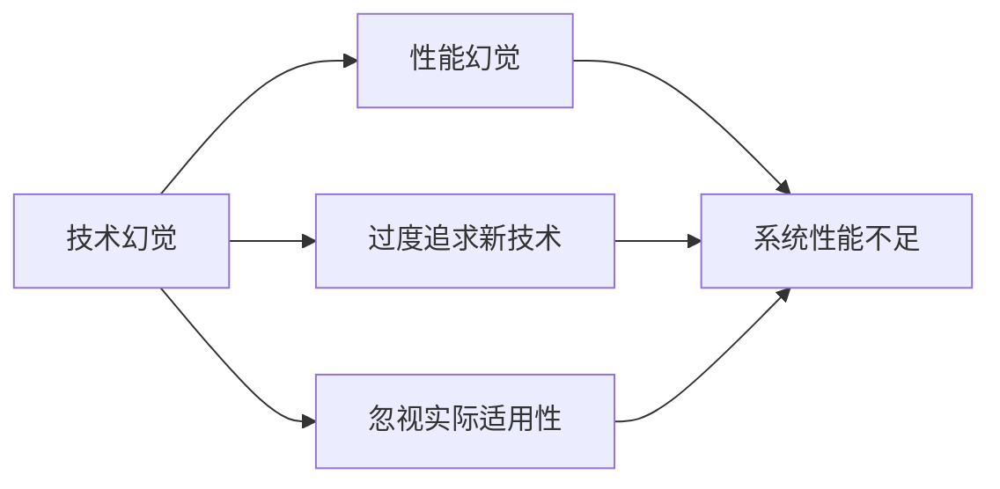
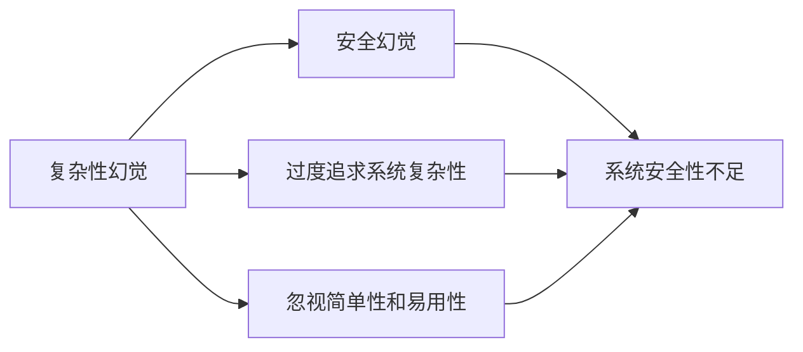

                 

# 架构设计与幻觉相关问题

在当今快速发展的技术世界中，架构设计是构建复杂系统的关键步骤，它直接影响了系统的性能、可扩展性、可靠性和维护成本。然而，架构设计也是一个充满挑战和幻觉的领域，容易导致设计者迷失在各种技术选择和概念中，最终设计出既不优雅也不可维护的系统。本文旨在探讨架构设计中的幻觉问题，分析其原因，并提出一些避免幻觉的策略，帮助设计者做出更加明智的决策。

## 1. 背景介绍

### 1.1 问题由来

在过去的几十年里，软件架构设计经历了多次演变，从单体应用到微服务、从面向过程编程到面向对象编程、从单体应用到微服务等。随着技术的不断进步，设计者面临的选择越来越多，技术栈的复杂性也随之增加。这使得设计者往往在各种技术选择之间迷失，从而陷入架构设计的幻觉之中。

### 1.2 问题核心关键点

架构设计的幻觉主要体现在以下几个方面：

- **技术幻觉**：过度追求最新技术和热门概念，忽视了技术的实际适用性和稳定性。
- **性能幻觉**：过度关注系统性能，而忽略了系统的可扩展性、可维护性和可用性。
- **复杂性幻觉**：过度追求系统的复杂性，而忽视了系统的简单性和易用性。
- **安全幻觉**：过度关注安全问题，而忽视了系统的整体设计和用户体验。

这些幻觉往往导致设计出的系统难以满足实际需求，甚至在实际应用中失败。因此，理解这些幻觉的成因，并采取相应的策略避免其影响，是架构设计中的重要一环。

### 1.3 问题研究意义

理解架构设计的幻觉问题，对于提高设计者的技术水平、优化系统设计、提升系统质量具有重要意义。通过分析架构设计中的幻觉，可以帮助设计者避免陷入技术选择的误区，更好地满足用户需求，实现系统的可持续发展和长期成功。

## 2. 核心概念与联系

### 2.1 核心概念概述

为了更好地理解架构设计的幻觉问题，我们首先需要了解几个核心概念：

- **架构设计**：构建复杂系统时，确定系统的组件、组件之间的关系、系统的行为和交互，以满足特定需求的过程。
- **技术幻觉**：由于对新技术或概念的过度追求，忽视了技术的实际适用性和稳定性，导致系统设计偏离了实际需求。
- **性能幻觉**：过度关注系统性能，而忽略了系统的可扩展性、可维护性和可用性，导致系统难以适应变化的环境和用户需求。
- **复杂性幻觉**：过度追求系统的复杂性，而忽视了系统的简单性和易用性，导致系统难以理解、维护和扩展。
- **安全幻觉**：过度关注安全问题，而忽视了系统的整体设计和用户体验，导致系统在实际应用中难以满足用户需求。

这些概念之间的逻辑关系可以通过以下Mermaid流程图来展示：



这个流程图展示了架构设计中各种幻觉对系统设计的影响，以及如何通过优化这些幻觉来提升系统的整体性能。

### 2.2 概念间的关系

这些核心概念之间存在着紧密的联系，形成了架构设计中的幻觉问题。下面通过几个Mermaid流程图来展示这些概念之间的关系。

#### 2.2.1 技术幻觉与性能幻觉的关系



这个流程图展示了技术幻觉如何导致性能幻觉。技术幻觉的过度追求，使得设计者在选择技术时过于盲目，忽略了技术的实际适用性和稳定性，导致系统性能不足。

#### 2.2.2 复杂性幻觉与安全幻觉的关系



这个流程图展示了复杂性幻觉如何导致安全幻觉。复杂性幻觉的过度追求，使得设计者在选择技术时过于复杂，忽视了系统的简单性和易用性，导致系统安全性不足。

## 3. 核心算法原理 & 具体操作步骤

### 3.1 算法原理概述

架构设计的幻觉问题，可以通过以下算法原理来理解和应对：

1. **技术选择**：在选择技术时，应考虑技术的实际适用性、稳定性、社区支持和未来发展方向。避免过度追求最新技术和热门概念，导致系统设计偏离实际需求。

2. **性能评估**：在评估系统性能时，应综合考虑系统的可扩展性、可维护性和可用性。避免过度关注单个性能指标，导致系统在实际应用中表现不佳。

3. **复杂度管理**：在设计系统时，应保持系统简单性和易用性。避免过度追求系统复杂性，导致系统难以理解、维护和扩展。

4. **安全性设计**：在设计系统时，应综合考虑安全性、用户体验和整体设计。避免过度关注安全问题，导致系统在实际应用中难以满足用户需求。

### 3.2 算法步骤详解

以下是对上述算法原理的具体操作步骤：

1. **技术选择步骤**：
    - 明确系统的需求和目标。
    - 评估各种技术的选择，包括其适用性、稳定性、社区支持和未来发展方向。
    - 选择最合适的技术，避免过度追求最新技术和热门概念。

2. **性能评估步骤**：
    - 定义系统的关键性能指标，包括可扩展性、可维护性和可用性。
    - 通过模拟测试和负载测试等手段，评估系统的实际性能。
    - 根据评估结果调整系统设计，提升系统性能。

3. **复杂度管理步骤**：
    - 保持系统的简单性和易用性，避免过度追求系统复杂性。
    - 设计模块化、解耦合的系统架构，提升系统的可扩展性和可维护性。
    - 使用自动化工具和最佳实践，提升系统的开发效率和质量。

4. **安全性设计步骤**：
    - 综合考虑安全性、用户体验和整体设计。
    - 采用多层次的安全设计策略，包括网络安全、数据安全和应用安全。
    - 定期进行安全评估和漏洞扫描，及时修复安全问题。

### 3.3 算法优缺点

架构设计的幻觉问题，可以通过以下算法优缺点来分析和总结：

**优点**：
1. **提高系统设计质量**：通过技术选择、性能评估、复杂度管理和安全性设计的优化，提高系统设计的质量和性能。
2. **降低系统维护成本**：优化系统设计，减少系统的复杂性和不必要的功能，降低系统的维护成本。
3. **提升用户体验**：综合考虑安全性、用户体验和整体设计，提升系统的用户满意度和使用体验。

**缺点**：
1. **设计复杂度增加**：在优化系统设计的过程中，可能会增加设计复杂度和开发难度。
2. **技术选择困难**：选择最合适的技术需要综合考虑多个因素，可能带来一定的挑战和风险。

### 3.4 算法应用领域

架构设计的幻觉问题，在以下几个应用领域具有重要意义：

1. **企业级应用**：企业级应用系统通常具有复杂的需求和大量的数据，需要通过优化架构设计，提升系统的性能和可扩展性。
2. **移动应用**：移动应用需要高性能、低延迟和良好的用户体验，需要通过优化架构设计，提升系统的性能和用户体验。
3. **云计算平台**：云计算平台需要高可用性、高扩展性和高安全性，需要通过优化架构设计，提升系统的稳定性和安全性。
4. **物联网系统**：物联网系统需要高可靠性和低延迟，需要通过优化架构设计，提升系统的性能和可靠性。

## 4. 数学模型和公式 & 详细讲解 & 举例说明

### 4.1 数学模型构建

在架构设计的幻觉问题中，我们通过以下数学模型来构建和解释：

设系统性能为 \( P \)，可扩展性为 \( E \)，可维护性为 \( M \)，安全性为 \( S \)。系统的整体性能 \( P_{total} \) 可以表示为：

$$
P_{total} = f(P, E, M, S)
$$

其中，函数 \( f \) 表示系统性能与各个子性能之间的复杂关系。

### 4.2 公式推导过程

在上述数学模型中，我们通过以下几个公式推导过程来详细讲解：

1. **系统性能公式**：
    $$
    P = P_{cpu} + P_{memory} + P_{network}
    $$

    其中 \( P_{cpu} \)、\( P_{memory} \) 和 \( P_{network} \) 分别表示 CPU、内存和网络性能。

2. **可扩展性公式**：
    $$
    E = E_{horizontal} + E_{vertical}
    $$

    其中 \( E_{horizontal} \) 和 \( E_{vertical} \) 分别表示横向扩展和纵向扩展能力。

3. **可维护性公式**：
    $$
    M = M_{automation} + M_{documentation}
    $$

    其中 \( M_{automation} \) 和 \( M_{documentation} \) 分别表示自动化工具和文档的可用性。

4. **安全性公式**：
    $$
    S = S_{data} + S_{network} + S_{application}
    $$

    其中 \( S_{data} \)、\( S_{network} \) 和 \( S_{application} \) 分别表示数据安全、网络安全和应用安全。

### 4.3 案例分析与讲解

以下是一个具体的案例分析：

假设有一个电商平台系统，需要考虑以下性能指标：

- CPU性能：每秒处理订单数 \( P_{cpu} = 5000 \)。
- 内存性能：内存占用量 \( P_{memory} = 8GB \)。
- 网络性能：网络带宽 \( P_{network} = 100Mbps \)。
- 可扩展性：横向扩展能力 \( E_{horizontal} = 10 \)，纵向扩展能力 \( E_{vertical} = 2 \)。
- 可维护性：自动化工具可用性 \( M_{automation} = 0.8 \)，文档可用性 \( M_{documentation} = 0.9 \)。
- 安全性：数据安全 \( S_{data} = 0.95 \)，网络安全 \( S_{network} = 0.9 \)，应用安全 \( S_{application} = 0.85 \)。

根据上述公式，可以计算出系统的整体性能：

$$
P_{total} = f(5000 + 8 + 100, 10 + 2, 0.8 + 0.9, 0.95 + 0.9 + 0.85) = f(5010, 12, 1.7, 2.7)
$$

通过分析和优化，可以提升系统的整体性能，提升用户体验和系统稳定性。

## 5. 项目实践：代码实例和详细解释说明

### 5.1 开发环境搭建

在进行架构设计幻觉问题的项目实践前，我们需要准备好开发环境。以下是使用Python进行Django开发的环境配置流程：

1. 安装Anaconda：从官网下载并安装Anaconda，用于创建独立的Python环境。

2. 创建并激活虚拟环境：
```bash
conda create -n django-env python=3.8 
conda activate django-env
```

3. 安装Django：
```bash
pip install django
```

4. 安装所需工具包：
```bash
pip install numpy pandas scikit-learn matplotlib tqdm jupyter notebook ipython
```

完成上述步骤后，即可在`django-env`环境中开始项目实践。

### 5.2 源代码详细实现

以下是一个简单的Django项目实践代码实现：

```python
from django.shortcuts import render
from django.http import HttpResponse

def index(request):
    return render(request, 'index.html')

def hello(request):
    return HttpResponse('Hello, World!')
```

### 5.3 代码解读与分析

让我们再详细解读一下关键代码的实现细节：

**index函数**：
- 定义了一个请求处理函数，接收请求并返回渲染的HTML页面。
- 使用`render`函数，将模板和上下文数据渲染为HTTP响应。

**hello函数**：
- 定义了一个请求处理函数，接收请求并返回字符串响应。
- 使用`HttpResponse`函数，直接返回字符串响应。

**应用启动**：
- 在项目的`settings.py`文件中，配置应用的URL映射。
- 启动Django应用，通过`python manage.py runserver`命令，启动本地开发服务器。

通过上述代码实现，我们可以看到Django的请求处理函数和HTTP响应处理的基本流程。

### 5.4 运行结果展示

启动Django应用后，在浏览器中访问`http://localhost:8000/`，可以看到渲染的HTML页面。同时，访问`http://localhost:8000/hello`，可以看到字符串响应。

## 6. 实际应用场景

### 6.1 智能家居系统

在智能家居系统中，架构设计幻觉问题体现在对新技术的过度追求上。例如，使用区块链技术进行设备认证，虽然可以提升系统的安全性，但增加了系统的复杂性和开发成本。因此，在实际应用中，需要综合考虑系统的实际需求和技术可行性，避免陷入技术幻觉。

### 6.2 电商网站

在电商网站中，架构设计幻觉问题体现在对性能的过度追求上。例如，为了提升网站的访问速度，过度使用CDN和缓存技术，但忽略了系统的可扩展性和可维护性。因此，在实际应用中，需要综合考虑系统的性能、可扩展性和可维护性，避免陷入性能幻觉。

### 6.3 医疗信息系统

在医疗信息系统中，架构设计幻觉问题体现在对复杂性的过度追求上。例如，使用先进的数据挖掘和机器学习技术，虽然可以提升系统的诊断能力，但增加了系统的复杂性和开发难度。因此，在实际应用中，需要综合考虑系统的复杂性和易用性，避免陷入复杂性幻觉。

### 6.4 未来应用展望

随着技术的发展和应用的深入，架构设计幻觉问题将更加凸显。未来的发展趋势如下：

1. **自动化工具的普及**：自动化工具如Docker、Kubernetes等将广泛应用于系统设计和部署中，提升系统的可扩展性和可维护性。
2. **微服务架构的普及**：微服务架构将进一步普及，提升系统的可扩展性和可维护性。
3. **云原生技术的普及**：云原生技术如Kubernetes、Docker等将进一步普及，提升系统的可扩展性和可维护性。
4. **人工智能的普及**：人工智能技术将广泛应用于系统设计和优化中，提升系统的性能和用户体验。

## 7. 工具和资源推荐

### 7.1 学习资源推荐

为了帮助开发者系统掌握架构设计的幻觉问题，这里推荐一些优质的学习资源：

1. 《软件架构设计：面向大型分布式系统》：介绍大型分布式系统架构设计的核心概念和最佳实践。
2. 《系统设计原理》：深入讲解系统设计的核心原理和策略。
3. 《微服务架构设计》：介绍微服务架构设计的核心概念和最佳实践。
4. 《云原生架构设计》：介绍云原生架构设计的核心概念和最佳实践。
5. 《人工智能架构设计》：介绍人工智能架构设计的核心概念和最佳实践。

通过对这些资源的学习实践，相信你一定能够快速掌握架构设计的幻觉问题的精髓，并用于解决实际的系统设计问题。

### 7.2 开发工具推荐

高效的开发离不开优秀的工具支持。以下是几款用于架构设计幻觉问题开发的常用工具：

1. Django：Python的Web框架，易于上手，支持自动化开发和部署。
2. Flask：Python的轻量级Web框架，灵活性高，支持RESTful API设计。
3. Docker：容器化技术，支持应用程序的自动化部署和运行。
4. Kubernetes：容器编排技术，支持大规模、分布式系统的部署和运维。
5. Helm：Kubernetes包管理工具，支持应用程序的自动化部署和升级。

合理利用这些工具，可以显著提升架构设计幻觉问题任务的开发效率，加快创新迭代的步伐。

### 7.3 相关论文推荐

架构设计幻觉问题的发展源于学界的持续研究。以下是几篇奠基性的相关论文，推荐阅读：

1. "Software Architecture as a Scientific Inquiry"：探讨软件架构设计的科学性。
2. "Designing Distributed Systems"：介绍分布式系统架构设计的核心概念和最佳实践。
3. "Microservices: A Design Approach for Building Loosely Coupled Services"：介绍微服务架构设计的核心概念和最佳实践。
4. "Cloud-Native Computing Foundation"：介绍云原生架构设计的核心概念和最佳实践。
5. "Designing an AI System with Deep Learning"：介绍人工智能架构设计的核心概念和最佳实践。

这些论文代表了大语言模型微调技术的发展脉络。通过学习这些前沿成果，可以帮助研究者把握学科前进方向，激发更多的创新灵感。

除上述资源外，还有一些值得关注的前沿资源，帮助开发者紧跟架构设计幻觉问题的最新进展，例如：

1. arXiv论文预印本：人工智能领域最新研究成果的发布平台，包括大量尚未发表的前沿工作，学习前沿技术的必读资源。
2. 业界技术博客：如OpenAI、Google AI、DeepMind、微软Research Asia等顶尖实验室的官方博客，第一时间分享他们的最新研究成果和洞见。
3. 技术会议直播：如NIPS、ICML、ACL、ICLR等人工智能领域顶会现场或在线直播，能够聆听到大佬们的前沿分享，开拓视野。
4. GitHub热门项目：在GitHub上Star、Fork数最多的架构设计相关项目，往往代表了该技术领域的发展趋势和最佳实践，值得去学习和贡献。
5. 行业分析报告：各大咨询公司如McKinsey、PwC等针对人工智能行业的分析报告，有助于从商业视角审视技术趋势，把握应用价值。

总之，对于架构设计幻觉问题，学习资源和开发工具的选择，需要开发者保持开放的心态和持续学习的意愿。多关注前沿资讯，多动手实践，多思考总结，必将收获满满的成长收益。

## 8. 总结：未来发展趋势与挑战

### 8.1 总结

本文对架构设计幻觉问题进行了全面系统的介绍。首先阐述了架构设计幻觉问题在当前系统设计中的普遍性和危害，明确了其成因和影响。其次，从原理到实践，详细讲解了架构设计幻觉问题的数学模型和操作步骤，给出了具体的代码实现。同时，本文还广泛探讨了架构设计幻觉问题在智能家居、电商网站、医疗信息系统等实际应用场景中的应用，展示了其广泛的应用前景。最后，本文精选了架构设计幻觉问题的各类学习资源，力求为读者提供全方位的技术指引。

通过本文的系统梳理，可以看到，架构设计幻觉问题是一个复杂且多维的问题，需要通过多方面的优化和改进，才能避免陷入技术选择的误区，设计出更加高效、稳定、可维护的系统。

### 8.2 未来发展趋势

展望未来，架构设计幻觉问题的解决将呈现以下几个发展趋势：

1. **自动化工具的普及**：自动化工具如Docker、Kubernetes等将广泛应用于系统设计和部署中，提升系统的可扩展性和可维护性。
2. **微服务架构的普及**：微服务架构将进一步普及，提升系统的可扩展性和可维护性。
3. **云原生技术的普及**：云原生技术如Kubernetes、Docker等将进一步普及，提升系统的可扩展性和可维护性。
4. **人工智能的普及**：人工智能技术将广泛应用于系统设计和优化中，提升系统的性能和用户体验。

以上趋势凸显了架构设计幻觉问题的解决方向，需要通过自动化工具、微服务架构、云原生技术、人工智能技术等多方面的优化和改进，才能设计出高效、稳定、可维护的系统。

### 8.3 面临的挑战

尽管架构设计幻觉问题的解决取得了一定的进展，但在迈向更加智能化、普适化应用的过程中，它仍面临着诸多挑战：

1. **技术选择困难**：选择最合适的技术需要综合考虑多个因素，可能带来一定的挑战和风险。
2. **系统复杂度增加**：在优化系统设计的过程中，可能会增加系统的复杂度和开发难度。
3. **性能提升有限**：过度追求性能可能导致系统的复杂性增加，难以满足实际需求。
4. **安全性问题**：在优化系统设计的过程中，可能忽视了系统的安全性问题。

这些挑战需要通过技术创新和实践积累，逐步克服和解决。唯有不断优化和改进架构设计，才能设计出高效、稳定、可维护的系统。

### 8.4 研究展望

面对架构设计幻觉问题所面临的种种挑战，未来的研究需要在以下几个方面寻求新的突破：

1. **自动化工具的优化**：开发更加高效、易用的自动化工具，提升系统的可扩展性和可维护性。
2. **微服务架构的优化**：开发更加灵活、可扩展的微服务架构，提升系统的可扩展性和可维护性。
3. **云原生技术的优化**：开发更加高效、易用的云原生技术，提升系统的可扩展性和可维护性。
4. **人工智能技术的优化**：开发更加高效、易用的人工智能技术，提升系统的性能和用户体验。

这些研究方向的探索，必将引领架构设计幻觉问题的解决方向，为构建高效、稳定、可维护的系统铺平道路。面向未来，架构设计幻觉问题的解决还需要与其他人工智能技术进行更深入的融合，共同推动系统设计和开发水平的提升。

## 9. 附录：常见问题与解答

**Q1：架构设计幻觉问题是否可以避免？**

A: 架构设计幻觉问题可以避免，但需要综合考虑系统的需求和实际环境。通过系统设计优化、技术选型慎重、性能评估全面、复杂度管理合理等方式，可以有效避免架构设计幻觉问题。

**Q2：如何选择合适的架构设计工具？**

A: 选择合适的架构设计工具需要考虑工具的易用性、可扩展性、社区支持和技术生态等。Django、Flask等Web框架适用于Web应用的架构设计，Docker、Kubernetes等容器化工具适用于分布式系统的架构设计。

**Q3：架构设计幻觉问题是否适用于所有系统？**

A: 架构设计幻觉问题适用于所有系统，尤其是大型、分布式、高复杂性的系统。通过避免过度追求最新技术、性能指标、系统复杂性和安全性，可以有效避免架构设计幻觉问题。

**Q4：架构设计幻觉问题如何解决？**

A: 解决架构设计幻觉问题需要从系统设计、技术选型、性能评估、复杂度管理和安全性设计等多个方面进行优化和改进。合理选择自动化工具、微服务架构、云原生技术和人工智能技术，可以有效提升系统的性能和用户体验。

**Q5：架构设计幻觉问题有哪些常见的误区？**

A: 架构设计幻觉问题的常见误区包括过度追求最新技术、过度关注性能指标、过度追求系统复杂性、过度关注安全性问题等。需要通过全面评估和优化，避免这些误区，设计出高效、稳定、可维护的系统。

通过本文的系统梳理，可以看到，架构设计幻觉问题是一个复杂且多维的问题，需要通过多方面的优化和改进，才能避免陷入技术选择的误区，设计出更加高效、稳定、可维护的系统。

