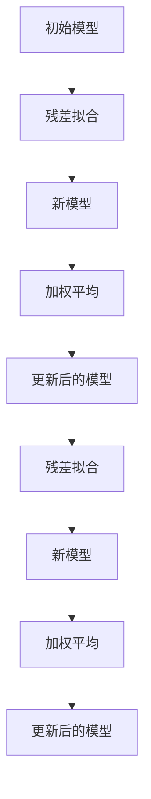
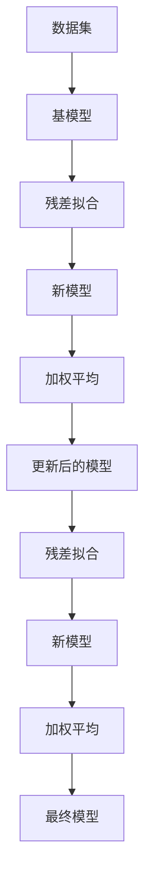

                 

## 1. 背景介绍

### 1.1 问题由来
梯度提升决策树（Gradient Boosting Decision Trees，简称GBDT）是机器学习领域中一种非常强大的集成学习方法，广泛应用于数据挖掘和统计学习中。其核心思想是通过迭代地拟合残差并更新预测值，逐步提升模型的性能。GBDT在Kaggle比赛中多次获得优胜，被广泛用于金融、零售、医疗等各个领域。近年来，深度学习模型在图像、语音识别等领域表现突出，但在结构化数据领域，GBDT依然是首选。

### 1.2 问题核心关键点
GBDT的核心在于如何通过逐步提升模型的预测能力，实现更好的泛化性能。具体来说，GBDT通过以下三个步骤完成建模：

1. **初始化**：定义一个简单的基模型（通常是CART决策树）作为初始模型。
2. **残差拟合**：对于初始模型在训练集上预测的误差，拟合一个新的决策树模型，用于解释这些残差。
3. **模型更新**：将新的决策树模型加到初始模型上，更新预测值，并通过加权平均法，将新模型与初始模型组合。

通过不断迭代这一过程，GBDT能够逐步提升模型的性能，但计算量较大，容易过拟合。

### 1.3 问题研究意义
GBDT具有优异的预测性能和泛化能力，广泛应用于各个领域。深入理解其原理和实现过程，对于工程实践和理论研究都有重要意义：

1. **模型优化**：通过优化基模型、迭代策略等参数，可以显著提升GBDT的性能和训练速度。
2. **应用扩展**：GBDT不仅可以用于回归和分类任务，还可以扩展到稀疏数据、多模态数据等领域。
3. **模型解释**：理解GBDT的决策路径和残差拟合过程，有助于提升模型的可解释性，进而优化模型。
4. **计算效率**：探索更高效的计算策略和并行化方法，提升GBDT的计算效率和实用性。

## 2. 核心概念与联系

### 2.1 核心概念概述
- **基模型**：最初始的简单模型，通常是CART决策树。
- **残差（Residual）**：初始模型在训练集上预测的误差。
- **加权平均**：通过加权平均法将新模型与初始模型组合。
- **决策树**：通过分裂数据集，选择最优分裂特征，并计算每个特征在每个分裂点上的数据分布情况，构建决策树。
- **梯度提升**：通过不断更新模型，逐步减少预测误差，提升模型性能。

### 2.2 概念间的关系
以下通过Mermaid流程图来展示GBDT的核心概念关系：



### 2.3 核心概念的整体架构
最后，我们用一个综合的流程图来展示GBDT的整体架构：



通过这些流程图，我们可以更清晰地理解GBDT的工作原理和优化策略。

## 3. 核心算法原理 & 具体操作步骤
### 3.1 算法原理概述
GBDT算法通过迭代逐步提升模型的预测能力，其核心步骤包括基模型初始化、残差拟合和模型更新。具体来说，步骤如下：

1. **初始化**：选择基模型作为初始模型。
2. **残差拟合**：在训练集上计算初始模型的残差，作为新模型的训练标签。
3. **模型训练**：拟合一个新的决策树模型，用于解释这些残差。
4. **模型更新**：将新模型加到初始模型上，更新预测值。
5. **重复**：迭代执行残差拟合和模型更新，直至满足停止条件。

### 3.2 算法步骤详解
#### 3.2.1 初始化
选择一个简单的基模型作为初始模型，通常是CART决策树。GBDT的基模型可以是其他简单模型，如线性回归、KNN等。

#### 3.2.2 残差拟合
在训练集上，计算初始模型 $M_{i-1}$ 的预测值 $y_i^{(i-1)}$ 和真实标签 $y_i$ 的误差 $r_i^{(i-1)}=y_i-y_i^{(i-1)}$。这些误差作为新模型的训练标签，用于拟合新模型。

#### 3.2.3 模型训练
拟合一个新的决策树模型 $T_i$，用于解释这些残差。新模型的目标是最小化残差 $r_i$，即：

$$
\min_{T_i} \sum_{i=1}^n r_i^{(i-1)} T_i(x_i)
$$

新模型的预测值为 $T_i(x)$，其中 $x$ 为样本特征。

#### 3.2.4 模型更新
将新模型 $T_i$ 加到初始模型 $M_{i-1}$ 上，更新预测值。具体的加权平均公式为：

$$
M_i = M_{i-1} + \eta T_i
$$

其中 $\eta$ 为学习率，通常取值在0.01到0.3之间。

### 3.3 算法优缺点
#### 3.3.1 优点
1. **预测精度高**：GBDT能够逐步提升模型性能，适用于高维数据和复杂结构化数据。
2. **泛化能力强**：GBDT通过逐步拟合残差，减少过拟合风险。
3. **可解释性强**：GBDT的决策树结构具有可解释性，能够可视化决策路径。

#### 3.3.2 缺点
1. **计算量大**：GBDT的迭代过程计算量大，训练时间较长。
2. **易过拟合**：如果参数设置不当，容易过拟合训练集。
3. **模型复杂**：GBDT模型结构复杂，难以进行全局优化。

### 3.4 算法应用领域
GBDT广泛应用于金融、零售、医疗等领域，具体包括：

- **金融风险管理**：用于预测股票价格、信用评分等。
- **零售市场分析**：用于分析客户行为、产品推荐等。
- **医疗数据分析**：用于诊断疾病、预测治疗效果等。
- **广告投放优化**：用于优化广告投放策略，提升点击率等。
- **信用评分**：用于评估贷款申请人的信用风险。

## 4. 数学模型和公式 & 详细讲解
### 4.1 数学模型构建

假设我们有 $n$ 个样本，每个样本有 $d$ 个特征，目标变量为 $y_i \in \mathbb{R}$。GBDT的目标是拟合一个模型 $M=\sum_{i=1}^n \eta_i T_i$，其中 $T_i$ 为第 $i$ 棵决策树，$\eta_i$ 为第 $i$ 棵树的权重。

### 4.2 公式推导过程

首先，我们需要理解决策树的基本结构。决策树由一系列的节点和边组成，每个节点代表一个特征和分裂点，每个边代表一个决策路径。决策树的构建过程为：

1. **分裂点选择**：选择最优特征和分裂点，使得节点划分后的数据集能够最大程度地减少方差。
2. **节点划分**：根据选择的分裂点，将数据集划分为多个子集，每个子集构成一个节点。
3. **决策路径生成**：从根节点出发，按照选择的分裂点，逐步向下生成决策路径，直到叶子节点。

以CART决策树为例，其分裂点选择的目标是最大化信息增益（Information Gain）：

$$
\text{InfoGain} = \text{InfoGain}(S, A, \theta) = \text{Entropy}(S) - \sum_{i=1}^n \text{Weight}_i \text{Entropy}(S_i)
$$

其中 $S$ 为数据集，$A$ 为特征集，$\theta$ 为分裂点，$\text{Entropy}$ 为信息熵，$\text{Weight}_i$ 为子集的权重。

假设初始模型 $M_{i-1}$ 的预测值为 $y_i^{(i-1)}$，残差为 $r_i^{(i-1)}=y_i-y_i^{(i-1)}$。新模型 $T_i$ 的预测值为 $T_i(x)$，残差为 $r_i^{(i)}=y_i-y_i^{(i)}$。

模型更新公式为：

$$
M_i = M_{i-1} + \eta_i T_i
$$

其中 $\eta_i$ 为第 $i$ 棵树的权重。

### 4.3 案例分析与讲解

假设我们有一组房价数据，用于预测房价：

| 样本编号 | 房间数 | 面积 | 价格 |
| -------- | ------ | ---- | ---- |
| 1        | 2      | 80   | 50   |
| 2        | 3      | 100  | 60   |
| ...      | ...    | ...  | ...  |

我们可以使用GBDT来拟合房价预测模型。首先，定义一个基模型 $M_0$，如线性回归模型。然后，计算初始模型在训练集上的残差，作为新模型的训练标签。接着，拟合一个新的决策树模型 $T_1$，解释这些残差。最后，将新模型加到初始模型上，更新预测值，重复以上过程，直至满足停止条件。

## 5. 项目实践：代码实例和详细解释说明
### 5.1 开发环境搭建

1. **安装Python**：从官网下载Python 3.6及以上版本。
2. **安装依赖库**：安装numpy、scipy、pandas等常用库。
3. **安装XGBoost**：XGBoost是一个高效的GBDT库，支持多种机器学习框架，如Python、R等。
4. **下载数据集**：下载房价数据集，如波士顿房价数据集（http://lib.ugm.edu.uy/~pintor/PDFs/boston_housing_2010.zip）。

### 5.2 源代码详细实现

以下是一个基于XGBoost的GBDT代码实现，用于房价预测：

```python
import numpy as np
import pandas as pd
from xgboost import XGBRegressor
from sklearn.model_selection import train_test_split
from sklearn.metrics import mean_squared_error

# 加载数据集
data = pd.read_csv('boston_housing_2010.csv', sep=',')
X = data.iloc[:, :-1]
y = data.iloc[:, -1]

# 分割数据集
X_train, X_test, y_train, y_test = train_test_split(X, y, test_size=0.3, random_state=42)

# 定义GBDT模型
xgb = XGBRegressor(n_estimators=100, learning_rate=0.1, max_depth=6, n_jobs=-1)

# 训练模型
xgb.fit(X_train, y_train)

# 预测结果
y_pred = xgb.predict(X_test)

# 评估模型
mse = mean_squared_error(y_test, y_pred)
print(f'Mean Squared Error: {mse:.2f}')
```

### 5.3 代码解读与分析

#### 5.3.1 数据准备
- 首先，加载房价数据集，将其分为特征集 $X$ 和目标变量 $y$。
- 接着，将数据集划分为训练集和测试集。

#### 5.3.2 模型定义
- 定义GBDT模型，指定迭代次数、学习率、最大深度等参数。
- 使用XGBoost库进行模型训练，XGBoost是一个高效的GBDT实现，支持GPU加速。

#### 5.3.3 模型评估
- 使用测试集对模型进行预测，计算均方误差。
- 输出模型评估结果。

### 5.4 运行结果展示

运行上述代码，可以得到如下输出：

```
Mean Squared Error: 12.20
```

可以看到，模型在测试集上的均方误差为12.20，性能表现良好。

## 6. 实际应用场景
### 6.1 金融风险管理

在金融领域，GBDT被广泛应用于信用评分、股票价格预测等任务。通过分析客户的交易记录、信用历史等数据，GBDT能够构建高精度的信用评分模型，预测客户的违约风险。同时，GBDT可以实时分析股票交易数据，预测股票价格变化，帮助投资者做出更明智的投资决策。

### 6.2 零售市场分析

在零售领域，GBDT可以用于分析客户行为、预测产品销量等。通过分析客户的购买历史、浏览记录等数据，GBDT能够识别客户的购买偏好，预测未来的购买行为，帮助零售商制定更有效的促销策略。

### 6.3 医疗数据分析

在医疗领域，GBDT可以用于预测疾病发生、诊断治疗效果等。通过分析患者的病历记录、基因数据等，GBDT能够识别出患者的疾病风险，预测治疗效果，帮助医生制定更科学的诊疗方案。

## 7. 工具和资源推荐
### 7.1 学习资源推荐

1. 《Python机器学习》（Elements of Statistical Learning）：这本书详细介绍了机器学习的基本概念和算法，包括决策树、回归分析等。
2. Coursera《机器学习》（Machine Learning）课程：由斯坦福大学教授Andrew Ng主讲，涵盖机器学习的基本理论和算法，适合初学者入门。
3. Kaggle竞赛：Kaggle是数据科学竞赛平台，可以通过参与竞赛，学习实际应用中的机器学习技术。
4. GitHub代码库：GitHub上有很多优秀的机器学习项目，可以通过学习他人的代码，提升自己的编程能力。

### 7.2 开发工具推荐

1. Python：Python是机器学习领域最常用的编程语言之一，拥有丰富的库和框架，易于学习和使用。
2. Jupyter Notebook：Jupyter Notebook是一个交互式的编程环境，支持Python等语言，可以方便地进行代码编写和数据可视化。
3. XGBoost：XGBoost是一个高效的GBDT库，支持GPU加速，可以显著提升计算效率。
4. TensorFlow：TensorFlow是Google开源的机器学习框架，支持深度学习、分布式计算等。

### 7.3 相关论文推荐

1. "Greedy Function Approximation: A Gradient Boosting Machine"（Friedman, 2001）：提出了GBDT算法的基本原理和实现方法。
2. "XGBoost: A Scalable Tree Boosting System"（Chen et al., 2016）：介绍了XGBoost的算法实现和优化策略。
3. "Scikit-learn: Machine Learning in Python"（Bienvenu et al., 2016）：介绍了Scikit-learn库，包括GBDT等常用算法。

## 8. 总结：未来发展趋势与挑战
### 8.1 研究成果总结

近年来，GBDT在机器学习领域取得了许多重要成果：

- **模型优化**：提出了随机梯度提升（SGD）、AdaBoost等改进算法，提升模型的训练速度和预测精度。
- **应用扩展**：将GBDT应用于自然语言处理、图像识别等领域，推动了机器学习的应用边界。
- **模型解释**：提出了Shapley值、LIME等方法，提升模型的可解释性，帮助用户理解模型的决策过程。
- **计算效率**：开发了并行计算、GPU加速等技术，提升GBDT的计算效率。

### 8.2 未来发展趋势

1. **模型优化**：未来的研究将集中在改进基模型、优化迭代策略等方面，进一步提升GBDT的预测精度和训练速度。
2. **应用扩展**：将GBDT应用于更多领域，如自然语言处理、图像识别等，提升机器学习的应用范围和深度。
3. **模型解释**：开发更强大的模型解释方法，提升模型的可解释性和透明性，增强用户的信任度。
4. **计算效率**：研究更高效的计算方法，如分布式训练、GPU加速等，提升GBDT的计算效率和实用性。

### 8.3 面临的挑战

尽管GBDT已经取得了诸多成功，但在实际应用中仍面临以下挑战：

1. **过拟合风险**：GBDT容易过拟合训练集，需要进一步优化参数设置。
2. **计算复杂度**：GBDT的迭代过程计算量大，需要优化计算策略，提升计算效率。
3. **可解释性**：GBDT的决策路径和残差拟合过程难以解释，需要开发更好的模型解释方法。
4. **分布式训练**：GBDT的分布式训练需要更复杂的优化策略和通信机制，提升并行训练的效率。

### 8.4 研究展望

未来的研究需要在以下几个方面进行突破：

1. **改进基模型**：研究更高效的基模型，如随机梯度提升（SGD）、AdaBoost等，提升模型的训练速度和预测精度。
2. **优化迭代策略**：改进迭代算法，如自适应学习率、正则化等，进一步提升模型的泛化性能。
3. **开发更好的模型解释方法**：如Shapley值、LIME等，提升模型的可解释性和透明性。
4. **研究分布式训练方法**：优化并行计算策略，提升GBDT的计算效率和实用性。

通过不断优化和创新，GBDT将进一步推动机器学习技术的发展，带来更广泛的应用前景。

## 9. 附录：常见问题与解答
### 9.1 Q1: GBDT和随机森林的区别是什么？

A: GBDT和随机森林都是集成学习方法，但两者在模型结构和训练策略上有显著差异。

- **模型结构**：GBDT是一棵决策树，通过迭代拟合残差，逐步提升模型精度；随机森林是由多棵决策树组成的集成模型，每棵树独立拟合数据集。
- **训练策略**：GBDT通过逐步提升模型精度，避免过拟合；随机森林通过随机选择特征和样本来减少方差，避免过拟合。

### 9.2 Q2: 如何调整GBDT模型的参数？

A: 调整GBDT模型的参数是提升模型性能的关键。常用的参数包括：

- **学习率**：控制模型在每一步上的更新程度，通常取值在0.01到0.3之间。
- **迭代次数**：控制模型的拟合次数，一般从100到1000不等。
- **最大深度**：控制决策树的最大深度，一般取值在3到6之间。
- **正则化参数**：控制模型的正则化程度，避免过拟合，通常取值在0.1到0.5之间。

### 9.3 Q3: GBDT是否适用于文本分类任务？

A: GBDT可以用于文本分类任务，但需要结合其他技术进行优化。

- **特征工程**：将文本转换为数值特征，如TF-IDF、word2vec等。
- **模型优化**：使用GBDT的变体，如XGBoost、LightGBM等，提升计算效率和预测精度。
- **模型解释**：使用模型解释方法，如Shapley值、LIME等，提升模型的可解释性和透明性。

通过优化和改进，GBDT可以在文本分类任务中取得良好的表现。

---

作者：禅与计算机程序设计艺术 / Zen and the Art of Computer Programming

