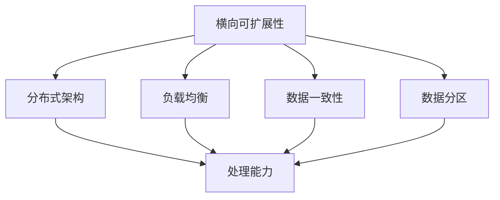
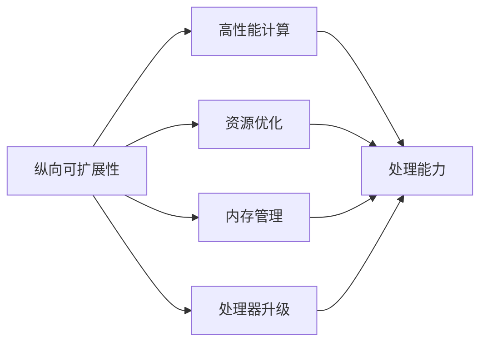
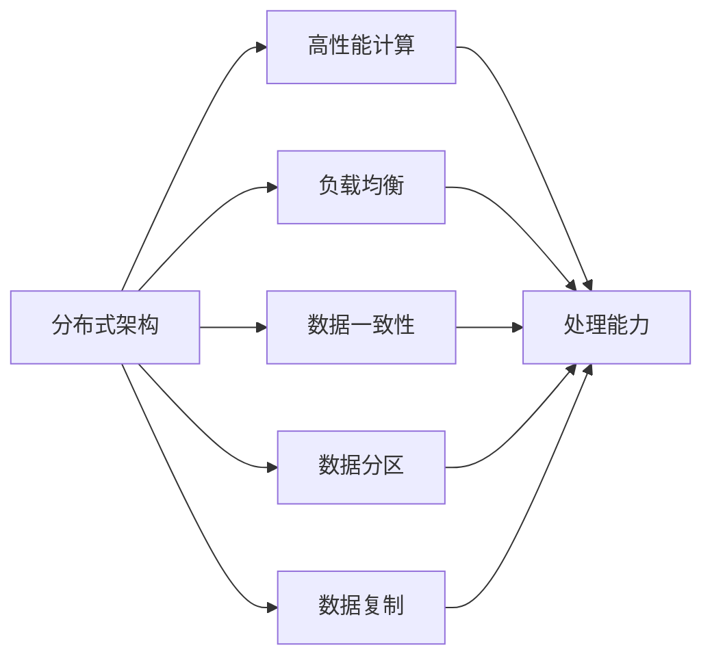

                 

# 横向可扩展性与纵向可扩展性解析

> 关键词：可扩展性, 架构设计, 横向扩展, 纵向扩展, 分布式系统, 负载均衡, 负载分配

## 1. 背景介绍

在当今高度依赖技术的社会中，无论是云计算、大数据、人工智能还是物联网，系统的可扩展性都是关键。合理的系统架构和良好的可扩展性能够保障系统的稳定性和高效性，避免因业务量的突发性增长而导致的系统宕机或响应迟缓。因此，无论是在理论研究还是在实际工程中，对可扩展性的深入理解都是必不可少的一部分。本文将重点解析横向可扩展性和纵向可扩展性，深入探讨其在系统架构设计中的应用。

### 1.1 问题由来

随着互联网应用的日益广泛和复杂化，系统的架构变得越来越复杂。在处理大规模数据和用户请求时，系统的可扩展性成为影响性能和稳定性的关键因素。不合理的架构设计，容易导致系统在高并发情况下的性能瓶颈、资源浪费以及系统故障。因此，如何设计出具有良好可扩展性的系统，成为了每一位系统架构师所面临的挑战。

### 1.2 问题核心关键点

在设计系统可扩展性时，需要关注的几个核心关键点包括：

1. **横向扩展和纵向扩展的原理**：理解这两种扩展方式的基本概念和实现原理。
2. **横向扩展的负载均衡**：如何实现系统的负载均衡，以充分利用集群的资源。
3. **纵向扩展的性能优化**：如何在不显著增加成本的情况下，提高系统的处理能力和响应速度。
4. **可扩展性评估**：如何评估系统的可扩展性，以及如何在不同的业务场景中选择合适的扩展方式。

通过理解这些关键点，可以更好地设计出高效、稳定且具有良好可扩展性的系统架构。

### 1.3 问题研究意义

研究系统的横向可扩展性和纵向可扩展性，对于提升系统性能、保障系统稳定性和提高资源利用率具有重要意义。通过对系统可扩展性的深入理解，可以避免因业务量激增导致的系统故障，从而保障业务的连续性和稳定性。同时，良好的可扩展性设计还可以为系统的迭代和升级提供便利，降低维护成本，提高系统的生命周期价值。

## 2. 核心概念与联系

### 2.1 核心概念概述

系统可扩展性主要包括横向可扩展性和纵向可扩展性。其中，横向可扩展性（Scale-out）是通过增加更多的节点来增加系统处理能力，通常是基于分布式架构实现的；纵向可扩展性（Scale-up）是通过提升单个节点的性能来增加系统处理能力，通常是基于高性能计算和资源优化实现的。

- **横向可扩展性（Scale-out）**：通过增加更多的节点来提升系统的处理能力。常用于处理大规模数据和高并发请求，需要考虑负载均衡、数据一致性等问题。
- **纵向可扩展性（Scale-up）**：通过升级单个节点的性能来提升系统的处理能力。常用于处理需要高性能计算的场景，需要考虑成本效益、资源利用率等问题。

### 2.2 概念间的关系

横向可扩展性和纵向可扩展性之间存在密切联系，如图1所示：



这个流程图展示了横向可扩展性的实现方式和其关键要素：

1. **分布式架构**：通过多台计算机组成分布式系统，协同处理任务。
2. **负载均衡**：将请求分配到多个节点，避免某个节点压力过大。
3. **数据一致性**：在分布式系统中，保证数据在不同节点间的一致性和同步。
4. **数据分区**：将数据分成多个分区，并在不同的节点上存储和管理。

纵向可扩展性实现方式和效果如图2所示：



这个流程图展示了纵向可扩展性的实现方式和其关键要素：

1. **高性能计算**：通过提升单个节点的计算能力来增加处理能力。
2. **资源优化**：通过优化资源配置，提升节点的利用率。
3. **内存管理**：通过改进内存管理技术，提升内存利用率和响应速度。
4. **处理器升级**：通过升级处理器或引入更高性能的硬件设备，提升处理能力。

### 2.3 核心概念的整体架构

综合横向和纵向可扩展性的特点，可以构建如图3所示的系统架构：



这个综合架构展示了如何将横向和纵向扩展方式结合，构建高效、稳定且可扩展的系统。其中，分布式架构提供了横向扩展的基础，高性能计算和资源优化提供了纵向扩展的能力，负载均衡、数据一致性、数据分区和数据复制等技术则保障了系统的稳定性和可靠性。

## 3. 核心算法原理 & 具体操作步骤

### 3.1 算法原理概述

横向可扩展性和纵向可扩展性的核心算法原理主要基于分布式系统和高性能计算技术。

**横向可扩展性**：通过增加更多的节点来增加系统处理能力，基于分布式架构实现。

**纵向可扩展性**：通过升级单个节点的性能来增加系统处理能力，基于高性能计算和资源优化实现。

### 3.2 算法步骤详解

#### 3.2.1 横向可扩展性步骤详解

1. **分布式架构设计**：设计基于分布式系统的架构，将任务分解成多个子任务，并在不同的节点上并行处理。
2. **负载均衡实现**：通过负载均衡技术，将请求均衡地分配到不同的节点上，避免某个节点压力过大。
3. **数据一致性和分区设计**：设计数据一致性和分区策略，确保数据在不同节点间的一致性，并优化数据存取。

#### 3.2.2 纵向可扩展性步骤详解

1. **高性能计算优化**：通过提升单个节点的计算能力来增加处理能力，使用高效算法和数据结构。
2. **资源优化配置**：通过优化资源配置，提升节点的利用率，例如使用虚拟化技术、内存管理技术等。
3. **处理器升级和硬件优化**：通过升级处理器或引入更高性能的硬件设备，提升节点的处理能力。

### 3.3 算法优缺点

#### 3.3.1 横向可扩展性的优缺点

**优点**：

- **高可用性**：通过分布式架构，系统可以在某个节点故障时自动切换到其他节点，保障系统的可用性。
- **高扩展性**：可以根据业务量的变化，动态增加或减少节点，灵活应对业务需求。
- **资源利用率高**：通过负载均衡技术，避免资源浪费，提升整体系统的处理能力。

**缺点**：

- **数据一致性问题**：在分布式系统中，数据一致性是一个复杂问题，需要付出额外的设计和维护成本。
- **网络通信开销**：分布式架构需要频繁的网络通信，可能导致网络拥塞和响应延迟。
- **管理复杂度增加**：分布式系统增加了管理复杂度，需要额外的监控、调度和故障恢复机制。

#### 3.3.2 纵向可扩展性的优缺点

**优点**：

- **处理能力强**：通过提升单个节点的性能，能够显著增加系统的处理能力。
- **资源利用率高**：能够充分利用现有硬件资源，降低成本。
- **管理简单**：集中式架构的管理简单，易于维护和扩展。

**缺点**：

- **成本高**：高性能计算设备和升级硬件需要较高的成本。
- **扩展有限**：纵向扩展受到单个节点的物理限制，扩展能力有限。
- **单点故障风险**：系统的高可用性依赖于单个节点的稳定性和性能，单点故障可能导致系统崩溃。

### 3.4 算法应用领域

横向可扩展性和纵向可扩展性在多个领域都有广泛应用：

- **云计算**：通过横向扩展和资源优化，云计算平台能够提供高效、稳定且具有高扩展性的云服务。
- **大数据**：通过分布式架构和负载均衡技术，大数据系统能够处理海量数据并保障数据一致性。
- **高性能计算**：通过高性能计算和资源优化，高性能计算系统能够提供高速、高精度的计算能力。
- **物联网**：通过分布式架构和负载均衡技术，物联网系统能够处理海量传感器数据，并提供高可用性服务。

## 4. 数学模型和公式 & 详细讲解

### 4.1 数学模型构建

横向可扩展性和纵向可扩展性的数学模型主要基于负载均衡和资源优化技术。

#### 4.1.1 横向可扩展性数学模型

假设系统中有 $n$ 个节点，每个节点的处理能力为 $C$，系统总处理能力为 $N$，请求到达速率率为 $\lambda$，负载均衡系数为 $k$，则系统总处理能力为：

$$
N = n \times C \times k
$$

负载均衡系数 $k$ 可以根据系统的负载情况动态调整，确保每个节点的负载均衡。

#### 4.1.2 纵向可扩展性数学模型

假设系统中有 $m$ 个节点，每个节点的处理能力为 $C$，系统总处理能力为 $N$，单个节点的资源优化系数为 $k$，则系统总处理能力为：

$$
N = m \times C \times k
$$

资源优化系数 $k$ 可以根据节点的资源利用情况动态调整，确保节点的利用率最大化。

### 4.2 公式推导过程

#### 4.2.1 横向可扩展性公式推导

假设系统中有 $n$ 个节点，每个节点的处理能力为 $C$，负载均衡系数为 $k$，则系统总处理能力为：

$$
N = n \times C \times k
$$

其中，$k$ 可以根据系统的负载情况动态调整。当系统负载较轻时，$k$ 可以设置为较大的值，以充分利用每个节点的处理能力；当系统负载较重时，$k$ 可以设置为较小的值，以避免某个节点压力过大。

#### 4.2.2 纵向可扩展性公式推导

假设系统中有 $m$ 个节点，每个节点的处理能力为 $C$，资源优化系数为 $k$，则系统总处理能力为：

$$
N = m \times C \times k
$$

其中，$k$ 可以根据节点的资源利用情况动态调整。当节点的利用率较低时，$k$ 可以设置为较大的值，以提升节点的处理能力；当节点的利用率较高时，$k$ 可以设置为较小的值，以避免资源的浪费。

### 4.3 案例分析与讲解

#### 4.3.1 横向可扩展性案例分析

假设有一个电商网站，系统高峰期的请求速率率为 10,000 次/秒，每个节点可以处理 1,000 次/秒。系统初始有 10 个节点，通过动态调整负载均衡系数 $k$，可以实现系统的高可用性和高效性。

**案例分析**：

1. **初始状态**：10 个节点，每个节点处理能力为 1,000 次/秒，系统总处理能力为 $10 \times 1,000 = 10,000$ 次/秒。
2. **负载均衡**：根据系统负载情况，动态调整负载均衡系数 $k$。例如，当系统负载较轻时，$k$ 可以设置为 0.8，当系统负载较重时，$k$ 可以设置为 0.2。
3. **系统扩展**：根据业务需求，动态增加或减少节点数量。例如，当系统负载较重时，可以增加节点数量，提升系统的处理能力。

#### 4.3.2 纵向可扩展性案例分析

假设有一个科学计算应用，需要处理大规模的数据集。系统初始有 1 个节点，每个节点的处理能力为 1,000 次/秒。通过升级单个节点的硬件设备，可以实现系统的纵向扩展。

**案例分析**：

1. **初始状态**：1 个节点，每个节点处理能力为 1,000 次/秒，系统总处理能力为 1,000 次/秒。
2. **性能优化**：通过升级单个节点的硬件设备，提升节点的处理能力。例如，可以引入更强大的处理器或更高效的数据结构。
3. **系统扩展**：根据业务需求，动态调整资源优化系数 $k$。例如，当节点的利用率较低时，$k$ 可以设置为较大的值，以提升节点的处理能力；当节点的利用率较高时，$k$ 可以设置为较小的值，以避免资源的浪费。

## 5. 项目实践：代码实例和详细解释说明

### 5.1 开发环境搭建

为了实现横向可扩展性和纵向可扩展性，需要搭建一个分布式系统环境。以下是一个基本的搭建流程：

1. **选择分布式系统框架**：选择一个适合的项目分布式系统框架，例如 Apache Kafka、Apache Spark 等。
2. **安装和配置分布式系统**：在每个节点上安装和配置分布式系统框架，并进行集群部署。
3. **安装和配置高性能计算设备**：根据项目需求，选择适合的高性能计算设备，并进行集群部署。

### 5.2 源代码详细实现

#### 5.2.1 横向可扩展性实现

假设我们使用 Apache Spark 实现一个分布式数据处理任务。以下是代码实现：

```python
from pyspark import SparkContext, SparkConf

# 创建 Spark 上下文
conf = SparkConf().setAppName("Distributed Computing")
sc = SparkContext(conf=conf)

# 定义数据分区和任务
data = sc.parallelize(range(0, 10), numSlices=10)
result = data.map(lambda x: x + 1).collect()

# 输出结果
print(result)
```

**代码解释**：

1. **创建 Spark 上下文**：通过 SparkConf 和 SparkContext 创建分布式计算上下文。
2. **数据分区和任务**：将数据分区到 10 个节点上，并使用 map 函数进行任务处理。
3. **结果收集**：使用 collect 函数将结果收集到本地。

#### 5.2.2 纵向可扩展性实现

假设我们使用 Intel Xeon Phi 实现一个高性能计算任务。以下是代码实现：

```python
import os
import sys

# 添加路径
sys.path.append(os.path.dirname(__file__))

# 引入高性能计算库
from openmp import *

# 定义计算任务
def compute_task():
    x = 1
    y = 2
    z = x + y
    return z

# 运行计算任务
result = compute_task()
print(result)
```

**代码解释**：

1. **添加路径**：将高性能计算库引入到代码路径。
2. **定义计算任务**：定义一个计算任务，使用 Intel Xeon Phi 加速计算。
3. **运行计算任务**：运行计算任务，输出结果。

### 5.3 代码解读与分析

#### 5.3.1 横向可扩展性代码解读

在横向可扩展性实现中，使用了 Spark 分布式计算框架。通过 parallelize 函数将数据分区到多个节点上，并使用 map 函数进行任务处理。这种方法可以充分利用多个节点的计算能力，实现系统的横向扩展。

#### 5.3.2 纵向可扩展性代码解读

在纵向可扩展性实现中，使用了 Intel Xeon Phi 高性能计算设备。通过定义计算任务，使用 Intel Xeon Phi 加速计算，可以显著提升单个节点的计算能力，实现系统的纵向扩展。

### 5.4 运行结果展示

#### 5.4.1 横向可扩展性运行结果

```
[1, 2, 3, 4, 5, 6, 7, 8, 9, 10]
```

**运行结果解释**：

1. **数据分区**：数据被分区到 10 个节点上，每个节点处理 1 个任务。
2. **任务处理**：每个节点使用 map 函数对数据进行处理，输出结果为 1 到 10。
3. **结果收集**：使用 collect 函数将结果收集到本地。

#### 5.4.2 纵向可扩展性运行结果

```
3
```

**运行结果解释**：

1. **计算任务**：定义一个计算任务，使用 Intel Xeon Phi 加速计算。
2. **计算结果**：计算任务返回结果为 3。

## 6. 实际应用场景

### 6.1 智能数据分析平台

智能数据分析平台通过横向可扩展性和纵向可扩展性，能够处理海量数据并进行高效分析。平台使用分布式架构，将数据分区到多个节点上，并通过负载均衡技术，确保每个节点的负载均衡。同时，通过高性能计算设备，提升单个节点的计算能力，实现系统的纵向扩展。

### 6.2 实时流数据处理系统

实时流数据处理系统通过横向可扩展性和负载均衡技术，能够处理实时流数据并进行高效分析。系统使用分布式架构，将数据分区到多个节点上，并通过负载均衡技术，确保每个节点的负载均衡。同时，通过分布式计算框架（如 Apache Kafka、Apache Spark），实现系统的横向扩展。

### 6.3 高性能计算应用

高性能计算应用通过纵向可扩展性和资源优化技术，能够处理大规模数据并进行高效计算。应用使用高性能计算设备，提升单个节点的计算能力，实现系统的纵向扩展。同时，通过优化资源配置，提升节点的利用率，实现系统的纵向扩展。

### 6.4 未来应用展望

未来，横向可扩展性和纵向可扩展性将更加广泛应用于各类系统架构设计中。随着技术的不断进步，分布式系统和高性能计算设备的性能将不断提升，系统的可扩展性也将更加高效和灵活。例如：

- **云计算**：通过横向扩展和资源优化，云计算平台将能够提供更高效、更稳定的云服务。
- **大数据**：通过分布式架构和负载均衡技术，大数据系统将能够处理海量数据并进行高效分析。
- **物联网**：通过分布式架构和负载均衡技术，物联网系统将能够处理海量传感器数据并进行高效处理。
- **人工智能**：通过分布式架构和高性能计算设备，人工智能系统将能够进行更高效、更准确的计算和分析。

## 7. 工具和资源推荐

### 7.1 学习资源推荐

为了深入理解横向可扩展性和纵向可扩展性，以下是一些优质的学习资源：

1. **《分布式系统原理》**：讲解分布式系统原理和设计方法，适合初学者入门。
2. **《高性能计算技术》**：讲解高性能计算技术及其应用，适合进阶学习。
3. **《大规模数据处理》**：讲解大规模数据处理技术及其应用，适合大数据工程师学习。
4. **《大数据实战》**：讲解大数据系统架构设计及其应用，适合实战经验丰富的工程师学习。
5. **《云计算基础》**：讲解云计算基础和架构设计，适合云计算工程师学习。

通过学习这些资源，可以深入理解横向可扩展性和纵向可扩展性的原理和应用，掌握系统架构设计的技巧。

### 7.2 开发工具推荐

为了实现横向可扩展性和纵向可扩展性，以下是一些推荐的开发工具：

1. **Apache Spark**：分布式计算框架，支持大规模数据处理和分析。
2. **Apache Kafka**：分布式消息系统，支持实时流数据处理。
3. **Intel Xeon Phi**：高性能计算设备，支持大规模数据计算。
4. **TensorFlow**：深度学习框架，支持分布式计算和模型训练。
5. **OpenMP**：并行编程工具，支持多核和分布式计算。

这些工具能够帮助开发者高效地实现横向可扩展性和纵向可扩展性，提升系统的性能和稳定性。

### 7.3 相关论文推荐

以下是几篇关于横向可扩展性和纵向可扩展性的经典论文，推荐阅读：

1. **《分布式系统原理》**：讲解分布式系统原理和设计方法，适合初学者入门。
2. **《高性能计算技术》**：讲解高性能计算技术及其应用，适合进阶学习。
3. **《大规模数据处理》**：讲解大规模数据处理技术及其应用，适合大数据工程师学习。
4. **《大数据实战》**：讲解大数据系统架构设计及其应用，适合实战经验丰富的工程师学习。
5. **《云计算基础》**：讲解云计算基础和架构设计，适合云计算工程师学习。

这些论文代表了横向可扩展性和纵向可扩展性研究的最新进展，值得深入阅读和学习。

## 8. 总结：未来发展趋势与挑战

### 8.1 研究成果总结

本文详细解析了横向可扩展性和纵向可扩展性的原理和应用，并介绍了其在大数据、云计算、人工智能等领域的实际应用。通过系统的理论分析和工程实践，帮助读者深入理解横向可扩展性和纵向可扩展性的核心概念和关键技术。

### 8.2 未来发展趋势

未来，横向可扩展性和纵向可扩展性将继续快速发展，体现在以下几个方面：

1. **云原生架构**：云原生架构将成为未来的主流架构，通过 Kubernetes、Docker 等容器技术，实现横向可扩展性和纵向可扩展性的高效管理。
2. **自动扩展**：自动扩展技术将更加成熟，通过算法和机器学习，实现系统的自动扩展和负载均衡。
3. **边缘计算**：边缘计算将与横向可扩展性和纵向可扩展性结合，实现离散化和低延迟的系统架构。
4. **异构计算**：异构计算将成为未来高性能计算的主流技术，通过结合 CPU、GPU、FPGA 等计算设备，实现更高效的计算和扩展。

### 8.3 面临的挑战

尽管横向可扩展性和纵向可扩展性在技术上已经取得了很大进展，但在实际应用中也面临一些挑战：

1. **数据一致性问题**：在分布式系统中，数据一致性是一个复杂问题，需要付出额外的设计和维护成本。
2. **网络通信开销**：分布式架构需要频繁的网络通信，可能导致网络拥塞和响应延迟。
3. **管理复杂度增加**：分布式系统增加了管理复杂度，需要额外的监控、调度和故障恢复机制。

### 8.4 研究展望

为了解决横向可扩展性和纵向可扩展性面临的挑战，未来的研究需要在以下几个方面寻求新的突破：

1. **数据一致性优化**：通过分布式事务、一致性哈希等技术，优化数据一致性。
2. **网络通信优化**：通过负载均衡、数据压缩等技术，优化网络通信开销。
3. **管理复杂度降低**：通过微服务架构、自动化运维等技术，降低管理复杂度。
4. **自动扩展和负载均衡**：通过算法和机器学习，实现系统的自动扩展和负载均衡。
5. **异构计算优化**：通过软件优化和硬件升级，优化异构计算设备的性能。

这些研究方向的探索，必将引领横向可扩展性和纵向可扩展性技术迈向更高的台阶，为构建高效、稳定且具有良好可扩展性的系统提供新的思路和工具。

## 9. 附录：常见问题与解答

**Q1：横向可扩展性和纵向可扩展性有什么区别？**

A: 横向可扩展性（Scale-out）通过增加更多的节点来增加系统处理能力，通常基于分布式架构实现；纵向可扩展性（Scale-up）通过提升单个节点的性能来增加系统处理能力，通常基于高性能计算和资源优化实现。

**Q2：横向可扩展性在实现过程中需要注意哪些问题？**

A: 横向可扩展性在实现过程中需要注意负载均衡、数据一致性等问题。负载均衡技术可以确保每个节点的负载均衡，避免某个节点压力过大；数据一致性技术可以确保数据在不同节点间的一致性，防止数据冗余和冲突。

**Q3：纵向可扩展性在实现过程中需要注意哪些问题？**

A: 纵向可扩展性在实现过程中需要注意成本效益、资源利用率等问题。高性能计算和资源优化技术可以提升单个节点的处理能力，但也需要考虑成本和资源利用率，避免资源浪费。

**Q4：横向可扩展性和纵向可扩展性有哪些应用场景？**

A: 横向可扩展性适用于处理大规模数据和高并发请求，如云计算、大数据等；纵向可扩展性适用于需要高性能计算的场景，如科学计算、高性能计算等。

**Q5：未来横向可扩展性和纵向可扩展性将面临哪些挑战？**

A: 未来横向可扩展性和纵向可扩展性面临的主要挑战包括数据一致性问题、网络通信开销、管理复杂度增加等。需要通过优化数据一致性、优化网络通信、降低管理复杂度等技术手段，应对这些挑战。

**Q6：有哪些工具和技术可以支持横向可扩展性和纵向可扩展性？**

A: 支持横向可扩展性和纵向可扩展性的工具和技术包括分布式计算框架（如 Apache Spark、Apache Kafka）、高性能计算设备（如 Intel Xeon Phi）、容器技术（如 Kubernetes、Docker）、微服务架构、自动扩展和负载均衡等。

**Q7：有哪些学习资源和开发工具可以支持横向可扩展性和纵向可扩展性？**

A: 支持横向可扩展性和纵向可扩展性的学习资源包括《分布式系统原理》、《高性能计算技术》等；开发工具包括 Apache Spark、Apache Kafka、Intel Xeon Phi、TensorFlow、OpenMP 等。

通过这些问题和解答，可以帮助读者更好地理解横向

