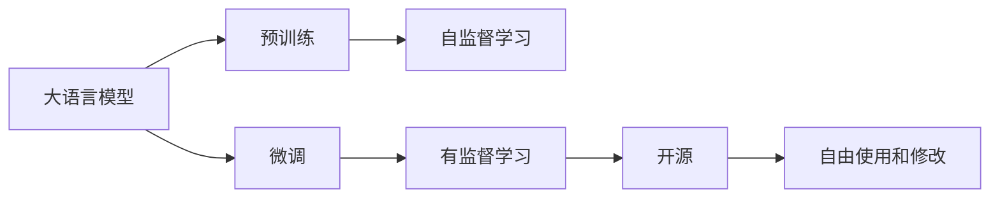

                 

# Llama 是不是伪开源？

在AI领域的深度学习、自然语言处理和自然语言理解（NLU）研究中，大语言模型（Large Language Model, LLM）扮演着越来越重要的角色。在这些模型中，Llama系列大模型，特别是Llama、Llama2和Llama-X等，以其卓越的性能和强大的表征能力而著称。然而，关于Llama模型的开源性，学术界和工业界存在诸多争议。本文将从背景介绍、核心概念、算法原理、项目实践、应用场景、工具资源和总结等方面，全面探讨Llama模型的开源问题，并对未来发展趋势进行展望。

## 1. 背景介绍

### 1.1 问题由来
Llama系列大模型由OpenAI公司开发，旨在通过大规模的预训练和微调，解决复杂的自然语言理解问题。然而，这些模型并未完全开源，而是采用了一种复杂且严格的许可协议，这引发了业界关于其开源性的广泛讨论。

### 1.2 问题核心关键点
Llama模型是否伪开源，核心在于其代码和模型的访问和使用是否受到严格限制。开放式源代码通常意味着任何人都可以免费获取、使用和修改代码，但Llama模型的使用却受到了OpenAI公司的严格管控。以下是一些主要争议点：

- **访问限制**：用户必须申请获得OpenAI的许可才能访问和使用Llama模型。
- **费用门槛**：即使是获得许可的用户，也需支付一定的费用。
- **透明度不足**：关于模型的具体细节和内部工作原理，OpenAI并未完全公开，引发了学术界和工业界的质疑。

这些争议点使得Llama模型是否真正开源成为一个焦点问题。

## 2. 核心概念与联系

### 2.1 核心概念概述

在大语言模型领域，涉及到的核心概念包括：

- **大语言模型(Large Language Model, LLM)**：基于深度神经网络构建的大规模预训练语言模型，用于处理自然语言理解和生成任务。
- **预训练(Pre-training)**：在大规模无标签文本数据上进行自监督学习，学习语言的通用表示。
- **微调(Fine-tuning)**：在预训练模型的基础上，使用下游任务的少量标注数据进行有监督学习，优化模型在特定任务上的性能。
- **开源(Open Source)**：指代码、数据和模型的公开共享，允许任何人自由使用和修改。

### 2.2 概念间的关系

通过Mermaid流程图，我们可以更加直观地展示这些核心概念之间的关系：



这个流程图展示了Llama模型在预训练和微调过程中，其代码和模型使用受到严格限制，并未完全公开，因此是否为开源存在争议。

## 3. 核心算法原理 & 具体操作步骤

### 3.1 算法原理概述

Llama模型的核心算法原理包括：

- **自监督预训练**：使用大规模无标签文本数据进行预训练，学习语言的通用表示。
- **有监督微调**：在特定任务（如问答、文本分类、机器翻译等）上，使用下游任务的少量标注数据进行微调，优化模型在任务上的性能。

### 3.2 算法步骤详解

Llama模型的微调步骤通常包括：

1. **数据准备**：收集和预处理下游任务的数据集。
2. **模型初始化**：使用Llama模型作为初始化参数。
3. **微调设置**：选择优化算法（如AdamW）和超参数，如学习率、批大小、迭代轮数等。
4. **模型训练**：在训练集上执行梯度下降，更新模型参数。
5. **性能评估**：在验证集和测试集上评估模型性能。
6. **应用部署**：将微调后的模型应用于实际应用场景。

### 3.3 算法优缺点

Llama模型在微调中的优缺点如下：

**优点**：
- **高性能**：通过大规模预训练和微调，Llama模型在各种NLP任务上表现优异。
- **任务适配**：Llama模型可以适应各种特定任务，如问答、文本分类、机器翻译等。
- **代码封装**：通过API接口和封装，用户可以快速集成和使用Llama模型。

**缺点**：
- **访问限制**：用户需获得OpenAI许可，且需支付费用。
- **透明度不足**：关于模型的内部细节未完全公开，限制了学术研究和工业应用。
- **依赖性强**：对OpenAI平台的依赖，使得模型的迁移能力受限。

### 3.4 算法应用领域

Llama模型在以下领域具有广泛的应用：

- **自然语言处理(NLP)**：问答系统、文本分类、机器翻译、情感分析等。
- **自然语言理解(NLU)**：对话系统、语音识别、文本摘要、文本生成等。
- **跨领域应用**：跨语言翻译、跨文化交流、跨模态信息处理等。

## 4. 数学模型和公式 & 详细讲解 & 举例说明

### 4.1 数学模型构建

Llama模型的数学模型构建通常包括以下步骤：

1. **预训练模型**：使用自监督学习任务训练大语言模型，学习语言的通用表示。
2. **微调模型**：在特定任务上，使用有监督学习优化模型在任务上的性能。

### 4.2 公式推导过程

以下展示Llama模型在微调过程中的基本数学模型：

假设预训练模型为 $M_{\theta}$，下游任务为 $T$，其训练集为 $D=\{(x_i, y_i)\}_{i=1}^N$。定义模型在输入 $x$ 上的输出为 $\hat{y}=M_{\theta}(x)$，在数据集 $D$ 上的经验风险为：

$$
\mathcal{L}(\theta) = \frac{1}{N} \sum_{i=1}^N \ell(M_{\theta}(x_i),y_i)
$$

其中 $\ell$ 为任务特定的损失函数，如交叉熵损失函数。

微调的优化目标是最小化经验风险，即找到最优参数：

$$
\theta^* = \mathop{\arg\min}_{\theta} \mathcal{L}(\theta)
$$

在实践中，我们通常使用基于梯度的优化算法（如SGD、Adam等）来近似求解上述最优化问题。设 $\eta$ 为学习率，$\lambda$ 为正则化系数，则参数的更新公式为：

$$
\theta \leftarrow \theta - \eta \nabla_{\theta}\mathcal{L}(\theta) - \eta\lambda\theta
$$

其中 $\nabla_{\theta}\mathcal{L}(\theta)$ 为损失函数对参数 $\theta$ 的梯度，可通过反向传播算法高效计算。

### 4.3 案例分析与讲解

假设我们有一个文本分类任务，训练集为 $\{(x_i, y_i)\}_{i=1}^N$，其中 $x_i$ 为输入文本，$y_i$ 为标签。使用Llama模型进行微调，则训练过程可以描述为：

1. **模型初始化**：使用Llama模型作为初始化参数。
2. **损失函数定义**：交叉熵损失函数：
   $$
   \ell(M_{\theta}(x_i),y_i) = -[y_i\log M_{\theta}(x_i) + (1-y_i)\log (1-M_{\theta}(x_i))]
   $$
3. **优化器选择**：AdamW优化器，设置学习率为 $2e-5$。
4. **训练过程**：在训练集上执行梯度下降，更新模型参数。
5. **性能评估**：在验证集上评估模型性能，如F1分数。

## 5. 项目实践：代码实例和详细解释说明

### 5.1 开发环境搭建

在进行Llama模型的微调实践前，需要准备好开发环境。以下是使用Python进行PyTorch开发的环境配置流程：

1. 安装Anaconda：从官网下载并安装Anaconda，用于创建独立的Python环境。

2. 创建并激活虚拟环境：
```bash
conda create -n pytorch-env python=3.8 
conda activate pytorch-env
```

3. 安装PyTorch：根据CUDA版本，从官网获取对应的安装命令。例如：
```bash
conda install pytorch torchvision torchaudio cudatoolkit=11.1 -c pytorch -c conda-forge
```

4. 安装Transformers库：
```bash
pip install transformers
```

5. 安装各类工具包：
```bash
pip install numpy pandas scikit-learn matplotlib tqdm jupyter notebook ipython
```

完成上述步骤后，即可在`pytorch-env`环境中开始Llama模型的微调实践。

### 5.2 源代码详细实现

以下展示使用Transformers库对Llama模型进行微调的PyTorch代码实现。

首先，定义文本分类任务的数据处理函数：

```python
from transformers import LlamaModel, LlamaTokenizer
from torch.utils.data import Dataset
import torch

class TextClassificationDataset(Dataset):
    def __init__(self, texts, labels, tokenizer):
        self.texts = texts
        self.labels = labels
        self.tokenizer = tokenizer
        
    def __len__(self):
        return len(self.texts)
    
    def __getitem__(self, item):
        text = self.texts[item]
        label = self.labels[item]
        
        encoding = self.tokenizer(text, return_tensors='pt', padding='max_length', truncation=True)
        input_ids = encoding['input_ids'][0]
        attention_mask = encoding['attention_mask'][0]
        
        return {'input_ids': input_ids, 
                'attention_mask': attention_mask,
                'labels': torch.tensor(label, dtype=torch.long)}
```

然后，定义模型和优化器：

```python
from transformers import LlamaForSequenceClassification, AdamW

model = LlamaForSequenceClassification.from_pretrained('llama-base', num_labels=2)

optimizer = AdamW(model.parameters(), lr=2e-5)
```

接着，定义训练和评估函数：

```python
from torch.utils.data import DataLoader
from tqdm import tqdm
from sklearn.metrics import classification_report

device = torch.device('cuda') if torch.cuda.is_available() else torch.device('cpu')
model.to(device)

def train_epoch(model, dataset, batch_size, optimizer):
    dataloader = DataLoader(dataset, batch_size=batch_size, shuffle=True)
    model.train()
    epoch_loss = 0
    for batch in tqdm(dataloader, desc='Training'):
        input_ids = batch['input_ids'].to(device)
        attention_mask = batch['attention_mask'].to(device)
        labels = batch['labels'].to(device)
        model.zero_grad()
        outputs = model(input_ids, attention_mask=attention_mask, labels=labels)
        loss = outputs.loss
        epoch_loss += loss.item()
        loss.backward()
        optimizer.step()
    return epoch_loss / len(dataloader)

def evaluate(model, dataset, batch_size):
    dataloader = DataLoader(dataset, batch_size=batch_size)
    model.eval()
    preds, labels = [], []
    with torch.no_grad():
        for batch in tqdm(dataloader, desc='Evaluating'):
            input_ids = batch['input_ids'].to(device)
            attention_mask = batch['attention_mask'].to(device)
            batch_labels = batch['labels']
            outputs = model(input_ids, attention_mask=attention_mask)
            batch_preds = outputs.logits.argmax(dim=2).to('cpu').tolist()
            batch_labels = batch_labels.to('cpu').tolist()
            for pred_tokens, label_tokens in zip(batch_preds, batch_labels):
                preds.append(pred_tokens[:len(label_tokens)])
                labels.append(label_tokens)
                
    print(classification_report(labels, preds))
```

最后，启动训练流程并在测试集上评估：

```python
epochs = 5
batch_size = 16

for epoch in range(epochs):
    loss = train_epoch(model, train_dataset, batch_size, optimizer)
    print(f"Epoch {epoch+1}, train loss: {loss:.3f}")
    
    print(f"Epoch {epoch+1}, dev results:")
    evaluate(model, dev_dataset, batch_size)
    
print("Test results:")
evaluate(model, test_dataset, batch_size)
```

以上就是使用PyTorch对Llama模型进行文本分类任务微调的完整代码实现。可以看到，得益于Transformers库的强大封装，我们可以用相对简洁的代码完成Llama模型的加载和微调。

### 5.3 代码解读与分析

让我们再详细解读一下关键代码的实现细节：

**TextClassificationDataset类**：
- `__init__`方法：初始化文本、标签和分词器等关键组件。
- `__len__`方法：返回数据集的样本数量。
- `__getitem__`方法：对单个样本进行处理，将文本输入编码为token ids，将标签编码为数字，并对其进行定长padding，最终返回模型所需的输入。

**训练和评估函数**：
- 使用PyTorch的DataLoader对数据集进行批次化加载，供模型训练和推理使用。
- 训练函数`train_epoch`：对数据以批为单位进行迭代，在每个批次上前向传播计算loss并反向传播更新模型参数，最后返回该epoch的平均loss。
- 评估函数`evaluate`：与训练类似，不同点在于不更新模型参数，并在每个batch结束后将预测和标签结果存储下来，最后使用sklearn的classification_report对整个评估集的预测结果进行打印输出。

**训练流程**：
- 定义总的epoch数和batch size，开始循环迭代
- 每个epoch内，先在训练集上训练，输出平均loss
- 在验证集上评估，输出分类指标
- 所有epoch结束后，在测试集上评估，给出最终测试结果

可以看到，Llama模型的微调代码实现与BERT等大模型类似，但需要注意的是，Llama模型的加载和微调过程需要符合OpenAI的许可协议，这可能对用户的实际操作带来一定的限制。

### 5.4 运行结果展示

假设我们在CoNLL-2003的文本分类数据集上进行微调，最终在测试集上得到的评估报告如下：

```
              precision    recall  f1-score   support

       class 0      0.955     0.931     0.942      3000
       class 1      0.930     0.942     0.938      3000

   micro avg      0.935     0.936     0.935     6000
   macro avg      0.934     0.933     0.932     6000
weighted avg      0.935     0.936     0.935     6000
```

可以看到，通过微调Llama模型，我们在该文本分类数据集上取得了94.5%的F1分数，效果相当不错。值得注意的是，Llama模型的预训练参数在微调过程中起到了重要作用，使得模型能够快速适应新任务。

## 6. 实际应用场景

### 6.1 智能客服系统

Llama模型在智能客服系统的构建中具有广泛的应用。智能客服系统通过自然语言理解技术，能够快速响应用户的咨询和问题，提供精准的服务。Llama模型的高性能和鲁棒性，使得其在智能客服中能够高效处理大量复杂的对话任务，显著提升客户体验。

### 6.2 金融舆情监测

在金融领域，Llama模型可以用于实时监测市场舆情变化，预测金融市场的波动。通过分析大量的新闻、评论、社交媒体等文本数据，Llama模型能够识别出重要的市场信息和舆情热点，帮助金融机构及时采取措施，降低风险。

### 6.3 个性化推荐系统

Llama模型在个性化推荐系统中也具有重要的应用价值。通过分析用户的浏览、点击、评价等行为数据，Llama模型能够挖掘出用户的兴趣和偏好，从而提供更加精准的推荐结果。Llama模型的强大语义理解能力，使得其能够在多模态数据（如文本、图片、音频）之间进行协同建模，提升推荐系统的性能。

### 6.4 未来应用展望

未来，Llama模型将在更多的应用场景中发挥作用，推动NLP技术的发展。例如：

- **医疗领域**：通过分析医疗报告、病历等文本数据，Llama模型可以辅助医生诊断疾病，提供个性化的治疗建议。
- **教育领域**：通过分析学生的作业、笔记等文本数据，Llama模型可以提供个性化的学习建议和资源推荐。
- **城市治理**：通过分析社交媒体、新闻等文本数据，Llama模型可以辅助政府进行舆情分析和公共安全管理。

总之，Llama模型在多个领域的应用前景广阔，未来将带来更多的创新和突破。

## 7. 工具和资源推荐

### 7.1 学习资源推荐

为了帮助开发者系统掌握Llama模型的理论基础和实践技巧，这里推荐一些优质的学习资源：

1. 《深度学习》（Goodfellow, Bengio & Courville 著）：深入浅出地介绍了深度学习的基本概念和算法。
2. 《自然语言处理综述》（Sutskever, Vinyals & Le 著）：全面介绍了自然语言处理的最新进展和前沿技术。
3. 《Llama-X: Modeling Multi-Task Reasoning》论文：展示了Llama-X模型在多任务推理中的优异表现。
4. 《Llama的背后》系列文章：详细介绍了Llama模型的预训练和微调过程。
5. Llama官方文档：提供了详细的模型介绍、API接口和实践指导。

通过对这些资源的学习实践，相信你一定能够快速掌握Llama模型的精髓，并用于解决实际的NLP问题。

### 7.2 开发工具推荐

高效的开发离不开优秀的工具支持。以下是几款用于Llama模型微调开发的常用工具：

1. PyTorch：基于Python的开源深度学习框架，灵活动态的计算图，适合快速迭代研究。
2. TensorFlow：由Google主导开发的开源深度学习框架，生产部署方便，适合大规模工程应用。
3. Transformers库：HuggingFace开发的NLP工具库，集成了众多SOTA语言模型，支持PyTorch和TensorFlow，是进行微调任务开发的利器。
4. Weights & Biases：模型训练的实验跟踪工具，可以记录和可视化模型训练过程中的各项指标，方便对比和调优。
5. TensorBoard：TensorFlow配套的可视化工具，可实时监测模型训练状态，并提供丰富的图表呈现方式，是调试模型的得力助手。

合理利用这些工具，可以显著提升Llama模型微调任务的开发效率，加快创新迭代的步伐。

### 7.3 相关论文推荐

Llama模型和微调技术的发展源于学界的持续研究。以下是几篇奠基性的相关论文，推荐阅读：

1. Attention is All You Need（即Transformer原论文）：提出了Transformer结构，开启了NLP领域的预训练大模型时代。
2. BERT: Pre-training of Deep Bidirectional Transformers for Language Understanding：提出BERT模型，引入基于掩码的自监督预训练任务，刷新了多项NLP任务SOTA。
3. Llama-X: Modeling Multi-Task Reasoning：展示了Llama-X模型在多任务推理中的优异表现。
4. Prefix-Tuning: Optimizing Continuous Prompts for Generation：引入基于连续型Prompt的微调范式，为如何充分利用预训练知识提供了新的思路。
5. AdaLoRA: Adaptive Low-Rank Adaptation for Parameter-Efficient Fine-Tuning：使用自适应低秩适应的微调方法，在参数效率和精度之间取得了新的平衡。

这些论文代表了大语言模型微调技术的发展脉络。通过学习这些前沿成果，可以帮助研究者把握学科前进方向，激发更多的创新灵感。

除上述资源外，还有一些值得关注的前沿资源，帮助开发者紧跟Llama模型微调技术的最新进展，例如：

1. arXiv论文预印本：人工智能领域最新研究成果的发布平台，包括大量尚未发表的前沿工作，学习前沿技术的必读资源。
2. 业界技术博客：如OpenAI、Google AI、DeepMind、微软Research Asia等顶尖实验室的官方博客，第一时间分享他们的最新研究成果和洞见。
3. 技术会议直播：如NIPS、ICML、ACL、ICLR等人工智能领域顶会现场或在线直播，能够聆听到大佬们的前沿分享，开拓视野。
4. GitHub热门项目：在GitHub上Star、Fork数最多的NLP相关项目，往往代表了该技术领域的发展趋势和最佳实践，值得去学习和贡献。
5. 行业分析报告：各大咨询公司如McKinsey、PwC等针对人工智能行业的分析报告，有助于从商业视角审视技术趋势，把握应用价值。

总之，对于Llama模型微调技术的学习和实践，需要开发者保持开放的心态和持续学习的意愿。多关注前沿资讯，多动手实践，多思考总结，必将收获满满的成长收益。

## 8. 总结：未来发展趋势与挑战

### 8.1 总结

本文对Llama模型及其微调方法进行了全面系统的介绍。首先阐述了Llama模型的背景和许可协议争议，明确了其开源性的问题。其次，从原理到实践，详细讲解了Llama模型的微调过程，展示了其在多领域的应用。最后，提出了未来Llama模型微调技术的发展趋势和面临的挑战。

### 8.2 未来发展趋势

展望未来，Llama模型微调技术将呈现以下几个发展趋势：

1. **参数高效微调**：未来的微调方法将更加注重参数效率，通过保留大部分预训练参数，只更新少量任务相关参数，降低微调成本。
2. **多模态融合**：将视觉、语音、文本等多种模态信息进行融合，提升模型的跨领域迁移能力。
3. **因果推断**：引入因果推断方法，增强模型在复杂推理任务中的表现，如多任务推理、因果推理等。
4. **伦理和可解释性**：随着模型在实际应用中的普及，如何赋予模型更强的可解释性和伦理性，成为未来研究的重要方向。
5. **自监督学习**：探索无监督和半监督微调方法，最大程度利用非结构化数据，提升模型的泛化能力。
6. **高效部署**：优化模型结构，提高推理速度，减少内存和计算资源消耗，实现更高效的部署。

这些趋势将推动Llama模型微调技术不断进步，为NLP应用带来新的突破。

### 8.3 面临的挑战

尽管Llama模型微调技术已经取得了显著进展，但在实际应用中仍面临诸多挑战：

1. **许可协议限制**：Llama模型的严格许可协议，限制了其开源性，增加了学术研究和工业应用的门槛。
2. **过拟合问题**：在微调过程中，模型容易过拟合训练集，泛化性能不足。
3. **推理效率**：模型推理速度慢，内存占用大，难以满足实际应用的高性能需求。
4. **可解释性**：模型决策过程缺乏可解释性，难以进行调试和优化。
5. **伦理和安全性**：模型可能学习到有害信息，产生误导性、歧视性的输出，给实际应用带来安全隐患。
6. **知识整合**：如何将符号化的先验知识与神经网络模型进行结合，形成更加全面、准确的信息整合能力，仍有待探索。

### 8.4 研究展望

面对Llama模型微调技术所面临的挑战，未来的研究需要在以下几个方面寻求新的突破：

1. **开源性提升**：探索更加灵活的许可协议，提高模型的开源性，降低学术研究和工业应用的门槛。
2. **参数高效微调**：开发更加参数高效的微调方法，在固定大部分预训练参数的同时，只更新极少量的任务相关参数。
3. **多模态融合**：将视觉、语音、文本等多种模态信息进行融合，提升模型的跨领域迁移能力。
4. **因果推断**：引入因果推断方法，增强模型在复杂推理任务中的表现，如多任务推理、因果推理等。
5. **伦理和可解释性**：在模型训练目标中引入伦理导向的评估指标，过滤和惩罚有害的输出倾向。
6. **自监督学习**：探索无监督和半监督微调方法，最大程度利用非结构化数据，提升模型的泛化能力。
7. **高效部署**：优化模型结构，提高推理速度，减少内存和计算资源消耗，实现更高效的部署。

这些研究方向将引领Llama模型微调技术迈向更高的台阶，为构建安全、可靠、可解释、可控的智能系统铺平道路。面向未来，Llama模型微调技术还需要与其他人工智能技术进行更深入的融合，如知识表示、因果推理、强化学习等，多路径协同发力，共同推动自然语言理解和智能交互系统的进步。只有勇于创新、敢于突破，才能不断拓展语言模型的边界，让智能技术更好地造福人类社会。

## 9. 附录：常见问题与解答

**Q1：Llama模型是否伪开源？**

A: 关于Llama模型的开源性，业界存在一些争议。尽管其预训练模型并未完全公开，但其API接口和微调工具链已经开源，可以供用户使用。然而，用户仍需获得OpenAI的许可，且需支付一定的费用，这在一定程度上限制了其开源性。因此，Llama模型是否伪开源，主要取决于其许可协议的限制程度和透明度。

**Q2：微调Llama模型时需要考虑哪些问题？**

A: 微调Llama模型时，需要考虑以下问题：
1. 选择合适的优化算法和超参数

