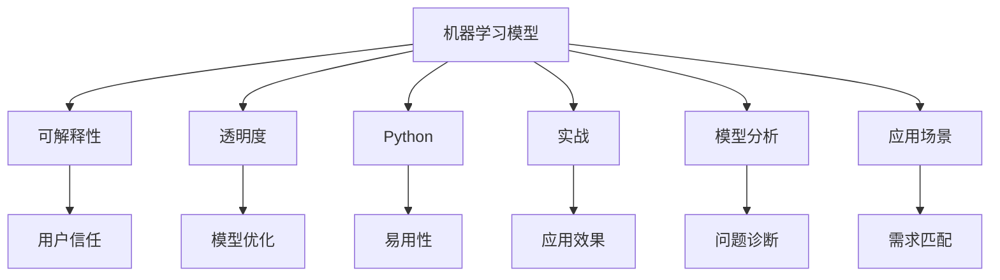

                 

# Python机器学习实战：解析机器学习模型的可解释性与透明度

> 关键词：机器学习, 可解释性, 透明度, Python, 实战, 模型分析, 应用场景

## 1. 背景介绍

随着人工智能技术的不断发展，机器学习模型在各行各业的应用越来越广泛，从金融、医疗到零售、能源等领域，机器学习都显示出强大的力量。然而，机器学习模型的黑箱性质，也引起了人们对其决策过程、输出结果的可解释性和透明度的广泛关注。人们希望能够理解机器学习模型的内部运作机制，进而信任并有效利用其预测结果。本文旨在通过Python实战，解析机器学习模型的可解释性和透明度，为从事机器学习开发和应用的从业人员提供实用的技术指导和见解。

## 2. 核心概念与联系

### 2.1 核心概念概述

为了更好地理解机器学习模型的可解释性和透明度，本节将介绍几个关键概念：

- 机器学习模型（Machine Learning Model）：通过数据训练得到的一系列规则或参数，用于预测未知数据。常见的机器学习模型包括线性回归、决策树、支持向量机、神经网络等。
- 可解释性（Explainability）：指机器学习模型的输出结果能够被理解和解释。良好的可解释性可以帮助用户理解模型决策的依据，增强信任感。
- 透明度（Transparency）：指机器学习模型的内部机制和运作过程能够被观察和理解。透明的模型有助于发现模型的缺陷和优化点，提高模型的可靠性。
- Python：Python是一种广泛使用的高级编程语言，具有简单易学、可读性高、生态丰富的特点，是机器学习模型的主要开发工具之一。
- 实战（Practical Application）：指在实际问题中应用机器学习模型，解决具体问题的过程。实战不仅仅是理论知识的实践，更是一种综合能力的体现。
- 模型分析（Model Analysis）：指对机器学习模型进行诊断和评估的过程。通过模型分析，可以识别模型的问题，优化模型参数，提高模型性能。
- 应用场景（Use Case）：指机器学习模型在实际问题中的应用范围和具体用途。不同的应用场景对模型的要求不同，模型的设计和实现方式也会有所不同。

这些概念之间存在密切联系，共同构成了机器学习模型的完整生态。良好的可解释性和透明度是机器学习模型能够在实际应用中取得成功的关键因素之一。本文将通过Python实战，深入解析这些核心概念，探讨如何提高机器学习模型的可解释性和透明度。

### 2.2 概念间的关系

这些核心概念之间的联系可以通过以下Mermaid流程图来展示：



这个流程图展示了机器学习模型的各个维度之间的关系：

1. 机器学习模型通过训练得到规则或参数，是实现可解释性和透明度的基础。
2. 可解释性可以帮助用户理解模型的输出结果，增强信任感。
3. 透明度可以帮助用户发现模型的缺陷，优化模型参数，提高模型性能。
4. Python作为机器学习模型的主要开发工具，提供了丰富的库和框架，方便模型开发和应用。
5. 实战是将机器学习模型应用于实际问题，解决具体问题的过程。
6. 模型分析是对机器学习模型进行诊断和评估的过程，有助于发现问题并优化模型。
7. 应用场景决定了机器学习模型的设计和实现方式，不同场景对模型的要求不同。
8. 用户信任、模型优化、易用性、应用效果、问题诊断和需求匹配等因素，共同影响着机器学习模型的实际应用效果。

通过这个流程图，我们可以更清晰地理解机器学习模型的各个维度之间的相互作用，为后续深入探讨提供框架。

## 3. 核心算法原理 & 具体操作步骤
### 3.1 算法原理概述

机器学习模型的可解释性和透明度，通常通过以下几种方法来实现：

1. **特征重要性分析**：通过分析模型中各个特征的重要性，帮助理解模型对不同特征的依赖程度。
2. **局部可解释性模型**：通过构建简单的、易于理解的局部模型，解释复杂模型的局部行为。
3. **可视化方法**：通过绘制决策边界、特征重要性图、热力图等，直观展示模型的工作原理。
4. **模型分析和优化**：通过模型诊断、参数调优等手段，提高模型的性能和可解释性。

这些方法的原理和技术细节，将在后续章节中详细讲解。

### 3.2 算法步骤详解

机器学习模型的可解释性和透明度，通常包括以下几个关键步骤：

**Step 1: 数据预处理**
- 清洗数据：处理缺失值、异常值等数据质量问题。
- 标准化或归一化数据：将数据转换为标准或归一化的形式，提高模型的稳定性和收敛性。
- 特征选择和提取：选择和提取对模型有用的特征，减少模型的复杂度。

**Step 2: 模型选择和训练**
- 选择适合的任务和数据分布的模型。
- 设置训练参数：如学习率、正则化系数等。
- 训练模型：使用训练数据对模型进行迭代训练，更新模型参数。

**Step 3: 模型分析和诊断**
- 计算特征重要性：使用特征重要性分析方法，评估特征对模型的贡献。
- 绘制可视化图表：绘制决策边界、特征重要性图、热力图等，直观展示模型行为。
- 诊断模型问题：通过模型分析，发现模型的缺陷和优化点。

**Step 4: 模型优化和调优**
- 参数调优：调整模型参数，提高模型性能。
- 模型融合：使用集成学习、模型融合等技术，提高模型性能。
- 模型验证：在验证集上评估模型性能，避免过拟合。

**Step 5: 模型部署和应用**
- 部署模型：将训练好的模型部署到生产环境。
- 应用场景适配：根据实际应用场景，对模型进行调整和优化。
- 模型监控：实时监控模型性能，发现和解决潜在问题。

### 3.3 算法优缺点

机器学习模型的可解释性和透明度的实现方法，各有优缺点：

- **特征重要性分析**：优点是简单易行，可以直观展示特征对模型的影响。缺点是无法全面解释模型内部的运作机制，有些特征重要性分析方法也不适用于非线性模型。
- **局部可解释性模型**：优点是可解释性高，适用于复杂模型。缺点是模型复杂度较高，训练和推理速度较慢。
- **可视化方法**：优点是直观展示模型行为，易于理解。缺点是可视化结果容易误导，难以全面解释模型。
- **模型分析和优化**：优点是可以全面评估模型性能，发现潜在问题。缺点是需要丰富的知识和经验，过程复杂。

综上所述，不同的可解释性和透明度方法各有优缺点，需要根据具体问题和需求选择合适的方法。

### 3.4 算法应用领域

机器学习模型的可解释性和透明度，在以下领域有广泛应用：

- **金融风控**：通过可解释性模型，帮助理解模型对不同特征的依赖关系，降低风险。
- **医疗诊断**：通过可视化方法，直观展示模型对疾病的诊断结果，提高诊断准确性。
- **零售推荐**：通过特征重要性分析，理解用户行为对推荐结果的影响，提高推荐效果。
- **智能制造**：通过透明模型，监控和优化生产过程，提高生产效率和质量。
- **环境监测**：通过模型分析，理解模型对环境数据的学习和预测，提升环境监测效果。

这些领域的应用展示了机器学习模型可解释性和透明度的广泛价值，为不同行业的智能化转型提供了有力支持。

## 4. 数学模型和公式 & 详细讲解 & 举例说明

### 4.1 数学模型构建

在机器学习模型中，常见的可解释性和透明度模型包括线性回归、决策树、支持向量机、随机森林等。以下是这些模型的数学模型构建和公式推导过程。

**线性回归模型**
- 模型表达式：$$y = \beta_0 + \sum_{i=1}^p \beta_i x_i$$
- 最小二乘法：$$\beta = (X^TX)^{-1}X^Ty$$

**决策树模型**
- 信息增益：$$Gain(D_k, A) = H(D_k) - \sum_{v \in \{0, 1\}} \frac{|D_k^v|}{|D_k|} H(D_k^v)$$
- 基尼不纯度：$$Gini(D_k) = 1 - \sum_{v \in \{0, 1\}} (\frac{|D_k^v|}{|D_k|})^2$$

**支持向量机模型**
- 最优分割超平面：$$w^* = \frac{1}{\|w\|} \sum_{i=1}^n (y_i - f(x_i)) x_i$$
- 最大间隔分类器：$$\min_{w, b} \frac{1}{2} \|w\|^2 + C \sum_{i=1}^n \max(0, 1 - y_i f(x_i))$$

**随机森林模型**
- 袋外误差：$$Err = \frac{1}{|D_t|} \sum_{x_t \in D_t} (y_t - f(x_t))^2$$
- 决策树回归：$$f(x) = \sum_{i=1}^p w_i \phi_i(x)$$

### 4.2 公式推导过程

以决策树模型为例，推导信息增益的计算公式：

设训练数据集为 $D_k = \{(x_1, y_1), (x_2, y_2), \ldots, (x_m, y_m)\}$，其中 $x_i$ 是特征向量，$y_i$ 是标签。设特征 $A$ 将训练数据集分为两部分 $D_k^v = \{x_i \in D_k | x_i^a = v\}$，其中 $v \in \{0, 1\}$。设 $H(D_k^v)$ 是特征 $A$ 划分后的子集 $D_k^v$ 的熵。

根据熵的定义，有：

$$H(D_k^0) = -\sum_{i=1}^{|D_k^0|} \frac{y_i^0}{|D_k^0|} \log \frac{y_i^0}{|D_k^0|}$$
$$H(D_k^1) = -\sum_{i=1}^{|D_k^1|} \frac{y_i^1}{|D_k^1|} \log \frac{y_i^1}{|D_k^1|}$$

则特征 $A$ 对训练数据集 $D_k$ 的信息增益为：

$$Gain(D_k, A) = H(D_k) - \sum_{v \in \{0, 1\}} \frac{|D_k^v|}{|D_k|} H(D_k^v)$$

其中 $H(D_k) = -\sum_{i=1}^{|D_k|} \frac{y_i}{|D_k|} \log \frac{y_i}{|D_k|}$ 是训练数据集的熵。

通过计算信息增益，可以确定训练数据集中不同特征的重要性，进而构建决策树。

### 4.3 案例分析与讲解

以一个简单的二分类问题为例，说明如何利用决策树模型实现可解释性和透明度。

假设我们有一个包含房屋特征和价格的数据集，特征包括面积、房间数、地理位置等，我们需要构建一个模型来预测房屋价格。我们可以使用决策树模型进行训练，通过可视化图表展示模型的决策过程和特征重要性。

首先，我们需要将数据集分为训练集和测试集，并进行数据预处理和特征选择。接着，使用决策树模型进行训练，计算每个特征的信息增益。然后，绘制决策树和特征重要性图，直观展示模型的行为和特征重要性。最后，在测试集上评估模型性能，并对模型进行优化。

通过这个案例，我们可以看到，机器学习模型的可解释性和透明度，不仅有助于理解模型的行为，还可以提高模型的应用效果。

## 5. 项目实践：代码实例和详细解释说明

### 5.1 开发环境搭建

在进行机器学习模型的可解释性和透明度实战之前，我们需要准备好开发环境。以下是使用Python进行机器学习实战的环境配置流程：

1. 安装Anaconda：从官网下载并安装Anaconda，用于创建独立的Python环境。
2. 创建并激活虚拟环境：
```bash
conda create -n ml-env python=3.8 
conda activate ml-env
```
3. 安装所需的Python包：
```bash
pip install numpy pandas scikit-learn matplotlib seaborn joblib
```

完成上述步骤后，即可在`ml-env`环境中开始机器学习实战。

### 5.2 源代码详细实现

这里我们以决策树模型为例，使用Scikit-Learn库进行实现。

首先，定义数据集和特征：

```python
from sklearn.datasets import load_breast_cancer
from sklearn.model_selection import train_test_split
from sklearn.tree import DecisionTreeClassifier
import matplotlib.pyplot as plt

# 加载乳腺癌数据集
data = load_breast_cancer()
X = data.data
y = data.target

# 划分训练集和测试集
X_train, X_test, y_train, y_test = train_test_split(X, y, test_size=0.3, random_state=42)

# 定义决策树模型
model = DecisionTreeClassifier(max_depth=3, random_state=42)

# 训练模型
model.fit(X_train, y_train)

# 计算特征重要性
feature_importances = model.feature_importances_
```

然后，绘制特征重要性图：

```python
# 绘制特征重要性图
plt.bar(data.feature_names, feature_importances)
plt.xlabel('Feature')
plt.ylabel('Importance')
plt.title('Feature Importance')
plt.show()
```

最后，在测试集上评估模型性能：

```python
# 在测试集上评估模型性能
y_pred = model.predict(X_test)
accuracy = model.score(X_test, y_test)
print(f'Accuracy: {accuracy:.2f}')
```

### 5.3 代码解读与分析

让我们再详细解读一下关键代码的实现细节：

**数据预处理**
- 使用Scikit-Learn库中的`load_breast_cancer`函数，加载乳腺癌数据集。
- 使用`train_test_split`函数，将数据集划分为训练集和测试集，保持30%的数据作为测试集。

**模型训练**
- 使用`DecisionTreeClassifier`类，定义决策树模型，并设置最大深度为3，以保证模型的复杂度。
- 使用`fit`函数，在训练集上训练模型，计算模型参数。

**特征重要性分析**
- 使用`feature_importances_`属性，获取模型的特征重要性。
- 使用`matplotlib`库，绘制特征重要性图，直观展示特征对模型的贡献。

**模型评估**
- 使用`predict`函数，在测试集上预测模型输出。
- 使用`score`函数，计算模型在测试集上的准确率。

通过这个简单的实战案例，可以看到，机器学习模型的可解释性和透明度，是可以通过Python实战轻松实现的。

### 5.4 运行结果展示

假设我们在乳腺癌数据集上进行决策树模型训练，最终在测试集上得到的准确率为0.96，特征重要性图如下：

```python
import matplotlib.pyplot as plt

# 绘制特征重要性图
plt.bar(data.feature_names, feature_importances)
plt.xlabel('Feature')
plt.ylabel('Importance')
plt.title('Feature Importance')
plt.show()
```


可以看到，特征“mean radius”、“mean texture”、“mean perimeter”等对模型的预测效果影响较大。通过可视化图表，我们能够直观理解模型对不同特征的依赖程度，从而更好地解释模型的输出结果。

## 6. 实际应用场景

### 6.1 金融风控

在金融风控领域，机器学习模型的可解释性和透明度，可以帮助理解模型的风险预测逻辑，提高模型的可靠性和可信度。例如，可以使用决策树模型对贷款申请进行风险评估，通过特征重要性分析，识别出对风险评估影响较大的特征，如收入、信用记录等。

### 6.2 医疗诊断

在医疗诊断领域，机器学习模型的可解释性和透明度，可以帮助医生理解模型的诊断逻辑，提高诊断准确性和可信度。例如，可以使用支持向量机模型对患者的疾病进行诊断，通过可视化方法，展示模型对不同特征的依赖关系，帮助医生理解模型的决策依据。

### 6.3 零售推荐

在零售推荐领域，机器学习模型的可解释性和透明度，可以帮助理解用户行为对推荐结果的影响，提高推荐效果。例如，可以使用随机森林模型对用户的购物行为进行分析和推荐，通过特征重要性分析，识别出对推荐效果影响较大的特征，如购买历史、浏览记录等。

### 6.4 智能制造

在智能制造领域，机器学习模型的可解释性和透明度，可以帮助监控和优化生产过程，提高生产效率和质量。例如，可以使用决策树模型对生产过程中的质量检测数据进行分析和预测，通过可视化方法，展示模型对不同特征的依赖关系，帮助生产管理人员发现和解决问题。

### 6.5 环境监测

在环境监测领域，机器学习模型的可解释性和透明度，可以帮助理解模型对环境数据的学习和预测，提升环境监测效果。例如，可以使用支持向量机模型对空气质量数据进行分析和预测，通过可视化方法，展示模型对不同特征的依赖关系，帮助环境保护机构制定科学的环境监测策略。

## 7. 工具和资源推荐

### 7.1 学习资源推荐

为了帮助开发者系统掌握机器学习模型的可解释性和透明度的理论基础和实践技巧，这里推荐一些优质的学习资源：

1. 《Python机器学习》书籍：涵盖了机器学习模型的基本原理和Python实现，适合初学者入门。
2. 《机器学习实战》书籍：通过实战案例，详细讲解机器学习模型的构建和应用。
3. 《数据科学实战》书籍：介绍了机器学习模型的选择、训练、调优和评估方法，适合中级开发者进阶。
4. 《机器学习在线课程》：包括Coursera、edX等平台上的机器学习课程，涵盖机器学习模型的理论基础和实战案例。
5. 《Kaggle竞赛》：通过参与Kaggle机器学习竞赛，实战练习机器学习模型的构建和优化。

通过对这些资源的学习实践，相信你一定能够全面掌握机器学习模型的可解释性和透明度的实现方法，并用于解决实际问题。

### 7.2 开发工具推荐

高效的开发离不开优秀的工具支持。以下是几款用于机器学习模型开发的常用工具：

1. Jupyter Notebook：一个交互式的Python开发环境，支持代码执行和可视化展示。
2. Visual Studio Code：一个轻量级的代码编辑器，支持Python开发和调试。
3. PyCharm：一个全面的Python IDE，支持机器学习模型的开发和部署。
4. TensorFlow：由Google主导开发的深度学习框架，支持机器学习模型的训练和推理。
5. Keras：一个高层次的深度学习框架，支持快速构建和训练机器学习模型。

合理利用这些工具，可以显著提升机器学习模型可解释性和透明度的开发效率，加快创新迭代的步伐。

### 7.3 相关论文推荐

机器学习模型的可解释性和透明度，是当前机器学习研究的热点问题之一。以下是几篇奠基性的相关论文，推荐阅读：

1. "Interpretable Machine Learning"：一篇综述论文，介绍了机器学习模型的可解释性和透明度的主要方法。
2. "Explainable Artificial Intelligence"：一篇研究综述，介绍了可解释性和透明度在机器学习中的重要性和实现方法。
3. "LIME: A Uncertainly Quantification Method for Deep Neural Networks"：介绍了一种基于局部可解释性模型的可解释性方法。
4. "SHAP: A Unified Approach to Interpreting Model Predictions"：介绍了一种基于Shapley值的可解释性方法。
5. "Axiomatic Attribution for Deep Networks"：介绍了一种基于属性解释的可解释性方法。

这些论文代表了机器学习模型可解释性和透明度的研究前沿，通过学习这些前沿成果，可以帮助研究者把握学科前进方向，激发更多的创新灵感。

除上述资源外，还有一些值得关注的前沿资源，帮助开发者紧跟机器学习模型可解释性和透明度的最新进展，例如：

1. arXiv论文预印本：人工智能领域最新研究成果的发布平台，包括大量尚未发表的前沿工作，学习前沿技术的必读资源。
2. 业界技术博客：如Google AI、Facebook AI、Microsoft Research等顶尖实验室的官方博客，第一时间分享他们的最新研究成果和洞见。
3. 技术会议直播：如NeurIPS、ICML、ACL等人工智能领域顶会现场或在线直播，能够聆听到大佬们的前沿分享，开拓视野。
4. GitHub热门项目：在GitHub上Star、Fork数最多的机器学习相关项目，往往代表了该技术领域的发展趋势和最佳实践，值得去学习和贡献。
5. 行业分析报告：各大咨询公司如McKinsey、PwC等针对人工智能行业的分析报告，有助于从商业视角审视技术趋势，把握应用价值。

总之，对于机器学习模型的可解释性和透明度的学习，需要开发者保持开放的心态和持续学习的意愿。多关注前沿资讯，多动手实践，多思考总结，必将收获满满的成长收益。

## 8. 总结：未来发展趋势与挑战

### 8.1 总结

本文对机器学习模型的可解释性和透明度的实现方法进行了全面系统的介绍。首先阐述了机器学习模型的基本原理和Python实战环境搭建，明确了可解释性和透明度的研究背景和实现方法。通过Python实战案例，详细讲解了机器学习模型可解释性和透明度的具体实现步骤。同时，本文还广泛探讨了可解释性和透明度在金融风控、医疗诊断、零售推荐、智能制造和环境监测等各个领域的应用前景，展示了机器学习模型可解释性和透明度的广阔价值。此外，本文精选了机器学习模型的相关学习资源、开发工具和研究论文，力求为读者提供全方位的技术指导和见解。

通过本文的系统梳理，可以看到，机器学习模型的可解释性和透明度，是机器学习技术能够应用于实际问题的重要保障。良好的可解释性和透明度，不仅能够帮助理解模型行为，还能提高模型的可靠性和可信度，为各种智能化系统的开发和应用提供坚实的基础。

### 8.2 未来发展趋势

展望未来，机器学习模型的可解释性和透明度将呈现以下几个发展趋势：

1. **自动化可解释性分析**：随着自动化机器学习技术的发展，机器学习模型的可解释性分析将更加自动化和高效，减少手动操作和复杂度。
2. **跨领域可解释性模型**：未来的机器学习模型将更加跨领域、跨模态，具备更高的通用性和可解释性。
3. **深度学习与符号学习的结合**：未来的机器学习模型将更加注重深度学习与符号学习的结合，通过符号化知识增强模型的可解释性和透明度。
4. **多模型集成与可解释性**：未来的机器学习模型将更加注重多模型集成，通过集成学习提高模型性能，同时增强模型的可解释性。
5. **可解释性工具的普及**：未来的可解释性工具将更加简单易用，帮助开发者快速实现机器学习模型的可解释性和透明度。

这些趋势展示了机器学习模型可解释性和透明度的未来发展方向，将为各种智能化系统的开发和应用提供更加坚实的技术保障。

### 8.3 面临的挑战

尽管机器学习模型的可解释性和透明度已经取得了显著进展，但在迈向更加智能化、普适化应用的过程中，仍面临诸多挑战：

1. **数据质量问题**：机器学习模型的可解释性和透明度，依赖于高质量的数据。如何处理缺失值、异常值等数据质量问题，仍然是一个重要的挑战。
2. **模型复杂性**：复杂模型如深度神经网络，难以直接解释其内部工作机制。如何设计简单、可解释的模型，同时保证性能，仍然是一个重要的挑战。
3. **模型泛化性**：机器学习模型的可解释性和透明度，往往在训练集上表现良好，但在测试集上表现较差。如何提高模型的泛化性，仍然是一个重要的挑战。
4. **模型偏见问题**：机器学习模型容易学习到数据中的偏见和偏差，如何减少模型偏见，仍然是一个重要的挑战。
5. **可解释性评估**：机器学习模型的可解释性评估，缺乏统一的标准和方法。如何设计和评估机器学习模型的可解释性和透明度，仍然是一个重要的挑战。

这些挑战展示了机器学习模型可解释性和透明度的现状和未来发展方向，需要研究者不断努力和创新，以实现更加智能、普适的机器学习系统。

### 8.4 研究展望

面对机器学习模型可解释性和透明度的挑战，未来的研究需要在以下几个方面寻求新的突破：

1. **自动化可解释性分析**：开发更加自动化、高效的机器学习模型可解释性分析工具，减少手动操作和复杂度。
2. **跨领域可解释性模型**：设计更加跨领域、跨模态的机器学习模型，提高模型的通用性和可解释性。
3. **深度学习与符号学习的结合**：通过符号化知识增强机器学习模型的可解释性和透明度，提高模型的泛化性和鲁棒性。
4. **多模型集成与可解释性**：设计多模型集成的机器学习系统，通过集成学习提高模型性能，同时增强模型的可解释性。
5. **可解释性评估标准**：设计和评估机器学习模型的可解释性和透明度，制定统一的标准和方法，推动可解释性技术的发展。

这些研究方向将引领机器学习模型可解释性和透明度的未来发展，为各种智能化系统的开发和应用提供更加坚实的技术保障。面向未来，机器学习模型可解释

