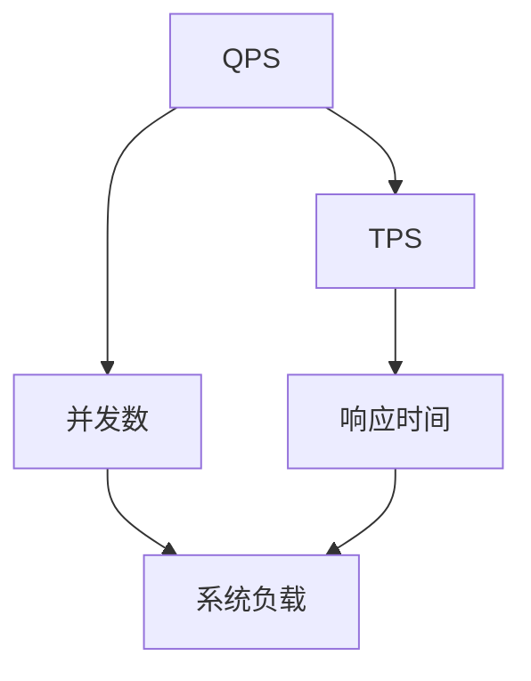
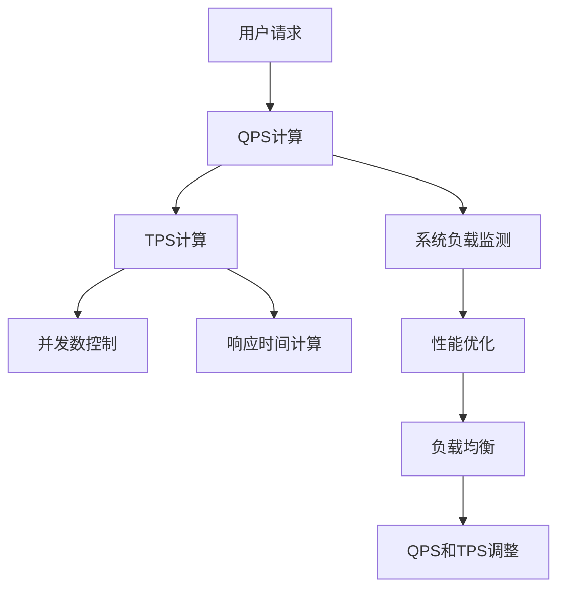

                 

## 1. 背景介绍

QPS（每秒查询数）和TPS（每秒事务数）是衡量系统性能的两个重要指标，常用于服务器监控和系统调优。在高性能计算和分布式系统中，QPS和TPS的准确计算和分析，对系统的稳定运行至关重要。本节将详细介绍QPS和TPS的基本概念，以及它们在实际系统中的计算方法和应用场景。

### 1.1 问题由来

在互联网应用和分布式系统中，QPS和TPS是衡量系统负载和性能的关键指标。QPS主要衡量系统每秒接收到的请求数量，而TPS主要衡量系统每秒处理的事务数量。随着系统负载的增加，QPS和TPS的计算方法和工具也变得尤为重要。

例如，在电商系统中，QPS可以衡量网站每秒接收到的用户请求数量，TPS可以衡量系统每秒处理的订单数量。高QPS和TPS表明系统能够有效处理大量并发请求，而低QPS和TPS则可能导致系统响应变慢、服务中断等问题。

### 1.2 问题核心关键点

- **QPS计算**：查询请求的频率，通常包括HTTP请求、数据库查询等。
- **TPS计算**：事务处理的频率，通常包括订单处理、转账操作等。
- **系统负载**：QPS和TPS的变化反映了系统负载的变化。
- **性能优化**：通过优化QPS和TPS，提高系统的并发处理能力和响应速度。

## 2. 核心概念与联系

### 2.1 核心概念概述

为更好地理解QPS和TPS的计算方法，本节将介绍几个密切相关的核心概念：

- **QPS**：每秒查询数（Queries Per Second），指每秒接收到的查询请求次数，常用于衡量系统的查询负载。
- **TPS**：每秒事务数（Transactions Per Second），指每秒处理的事务数量，常用于衡量系统的交易负载。
- **并发数**：指系统同时处理请求的请求数，反映系统负载情况。
- **响应时间**：指系统处理请求所需的平均时间，反映系统性能。

这些概念之间存在着紧密的联系。QPS和TPS反映了系统的并发负载，而并发数和响应时间则直接影响了QPS和TPS的计算结果。系统性能的提升往往需要同时优化QPS、TPS、并发数和响应时间。

### 2.2 概念间的关系

QPS和TPS的计算过程相互关联，且与系统负载、并发数和响应时间密切相关。以下是一个Mermaid流程图，展示了这些概念之间的关系：



这个流程图展示了QPS和TPS的基本关系，以及它们与系统负载、并发数和响应时间的关系。系统负载、并发数和响应时间的变化，会影响QPS和TPS的计算结果。

### 2.3 核心概念的整体架构

最后，我们用一个综合的流程图来展示QPS和TPS计算的完整过程：



这个综合流程图展示了从用户请求到QPS和TPS计算的完整过程，包括系统负载监测、性能优化、负载均衡和QPS和TPS的调整。通过这些过程，系统能够有效地处理大量并发请求，提升系统的整体性能。

## 3. 核心算法原理 & 具体操作步骤

### 3.1 算法原理概述

QPS和TPS的计算通常基于统计方法，通过系统每秒接收到的请求次数和每秒处理的事务数量来计算。QPS和TPS的计算过程包括两个关键步骤：请求计数和事务计数。

- **请求计数**：统计系统每秒接收到的请求次数，通常使用计数器实现。
- **事务计数**：统计系统每秒处理的事务数量，通常使用事务日志或数据库记录实现。

### 3.2 算法步骤详解

#### 3.2.1 请求计数

请求计数器用于统计系统每秒接收到的请求次数。常用的方法包括使用固定窗口计数器和滑动窗口计数器。

- **固定窗口计数器**：统计固定时间窗口内的请求次数，通常使用定时器或周期性定时器实现。
- **滑动窗口计数器**：统计固定时间窗口内连续请求的次数，通常使用循环计数器实现。

#### 3.2.2 事务计数

事务计数器用于统计系统每秒处理的事务数量。常用的方法包括使用事务日志和数据库记录。

- **事务日志**：记录系统每秒处理的事务数量，通常使用日志文件或日志缓冲区实现。
- **数据库记录**：从数据库事务日志中统计每秒处理的事务数量，通常使用数据库API实现。

### 3.3 算法优缺点

QPS和TPS的计算方法具有以下优点：

- **简单高效**：通过计数器统计请求次数和事务数量，计算过程简单，高效。
- **可扩展性**：使用分布式系统实现请求计数器和事务计数器，可扩展到高并发场景。

同时，这些方法也存在一些缺点：

- **数据同步**：分布式系统中的请求计数器和事务计数器需要同步，避免数据不一致。
- **处理延迟**：高并发情况下，请求计数器和事务计数器的处理延迟可能影响QPS和TPS的准确性。

### 3.4 算法应用领域

QPS和TPS的计算方法在多个领域得到了广泛应用，例如：

- **电商系统**：用于监控网站每秒接收到的用户请求和订单处理数量，评估系统负载和性能。
- **金融交易系统**：用于监控交易系统的每秒处理的事务数量，评估系统交易负载和性能。
- **移动应用**：用于监控移动应用每秒接收到的用户请求和处理的事务数量，评估应用负载和性能。
- **大数据分析**：用于监控数据分析系统的每秒查询请求和处理的事务数量，评估系统负载和性能。

## 4. 数学模型和公式 & 详细讲解

### 4.1 数学模型构建

QPS和TPS的计算过程可以建模为如下数学表达式：

- **QPS计算模型**：
  $$
  QPS = \frac{Total\ Requests}{Time\ Window}
  $$
  其中，$Total\ Requests$ 表示固定时间窗口内接收到的请求总数，$Time\ Window$ 表示固定时间窗口的大小。

- **TPS计算模型**：
  $$
  TPS = \frac{Total\ Transactions}{Time\ Window}
  $$
  其中，$Total\ Transactions$ 表示固定时间窗口内处理的事务总数，$Time\ Window$ 表示固定时间窗口的大小。

### 4.2 公式推导过程

以固定窗口计数器为例，推导QPS和TPS的计算公式。

设固定时间窗口大小为$T$秒，系统每秒接收到的请求数为$q$，每秒处理的事务数为$t$，则有：
$$
Total\ Requests = q \times T
$$
$$
Total\ Transactions = t \times T
$$

将这两个公式代入QPS和TPS的计算公式中，得到：
$$
QPS = \frac{q \times T}{T} = q
$$
$$
TPS = \frac{t \times T}{T} = t
$$

通过上述推导，可以看出QPS和TPS的计算依赖于系统每秒接收到的请求数和处理的事务数。

### 4.3 案例分析与讲解

假设一个电商系统每秒接收100个用户请求，每秒处理10个订单，则其QPS和TPS分别为：
$$
QPS = 100\ requests/second
$$
$$
TPS = 10\ orders/second
$$

这个案例展示了QPS和TPS的计算方法，以及它们在实际系统中的应用。通过计算QPS和TPS，系统可以了解自身的负载情况，进行针对性的性能优化。

## 5. 项目实践：代码实例和详细解释说明

### 5.1 开发环境搭建

在进行QPS和TPS的计算实践前，我们需要准备好开发环境。以下是使用Python进行Python-socket开发的环境配置流程：

1. 安装Python：从官网下载并安装Python，用于编写和运行Python脚本。

2. 安装Python-socket库：
```bash
pip install socket
```

3. 编写Python脚本：
```python
import socket
import time

# 定义请求计数器
req_count = 0

# 定义事务计数器
trans_count = 0

# 创建Socket对象
s = socket.socket(socket.AF_INET, socket.SOCK_STREAM)

# 连接远程服务器
s.connect(('127.0.0.1', 8080))

while True:
    # 接收请求
    req = s.recv(1024)
    if req.decode() == 'qps':
        # 计算请求数
        req_count += 1
    elif req.decode() == 'tps':
        # 计算事务数
        trans_count += 1
    else:
        # 发送请求
        s.sendall(req.encode())

    # 记录时间戳
    timestamp = time.time()

    # 每秒钟输出QPS和TPS
    if (timestamp - last_timestamp) >= 1:
        print(f'QPS: {req_count}')
        print(f'TPS: {trans_count}')
        last_timestamp = timestamp

    # 重置计数器
    req_count = 0
    trans_count = 0
```

### 5.2 源代码详细实现

我们编写了一个简单的Python-socket脚本，用于统计系统每秒接收到的请求数和处理的事务数，并输出QPS和TPS。

首先，我们定义了请求计数器和事务计数器：

```python
# 定义请求计数器
req_count = 0

# 定义事务计数器
trans_count = 0
```

然后，我们创建了一个Socket对象，并连接到远程服务器：

```python
# 创建Socket对象
s = socket.socket(socket.AF_INET, socket.SOCK_STREAM)

# 连接远程服务器
s.connect(('127.0.0.1', 8080))
```

接着，我们进入主循环，接收远程服务器的请求并统计请求数和事务数：

```python
while True:
    # 接收请求
    req = s.recv(1024)
    if req.decode() == 'qps':
        # 计算请求数
        req_count += 1
    elif req.decode() == 'tps':
        # 计算事务数
        trans_count += 1
    else:
        # 发送请求
        s.sendall(req.encode())
```

最后，我们记录时间戳，并每秒钟输出QPS和TPS：

```python
# 记录时间戳
timestamp = time.time()

# 每秒钟输出QPS和TPS
if (timestamp - last_timestamp) >= 1:
    print(f'QPS: {req_count}')
    print(f'TPS: {trans_count}')
    last_timestamp = timestamp

# 重置计数器
req_count = 0
trans_count = 0
```

### 5.3 代码解读与分析

让我们再详细解读一下关键代码的实现细节：

**Socket连接**：
```python
s = socket.socket(socket.AF_INET, socket.SOCK_STREAM)
s.connect(('127.0.0.1', 8080))
```

通过创建Socket对象，并连接到远程服务器，脚本可以监听远程服务器的请求，并发送回应。

**请求计数器**：
```python
req_count = 0
```

通过定义请求计数器，脚本可以统计每秒钟接收到的请求数。

**事务计数器**：
```python
trans_count = 0
```

通过定义事务计数器，脚本可以统计每秒钟处理的事务数。

**请求接收和处理**：
```python
while True:
    # 接收请求
    req = s.recv(1024)
    if req.decode() == 'qps':
        # 计算请求数
        req_count += 1
    elif req.decode() == 'tps':
        # 计算事务数
        trans_count += 1
    else:
        # 发送请求
        s.sendall(req.encode())
```

通过不断接收远程服务器的请求，脚本可以统计请求数和事务数。

**时间戳记录和输出**：
```python
timestamp = time.time()

# 每秒钟输出QPS和TPS
if (timestamp - last_timestamp) >= 1:
    print(f'QPS: {req_count}')
    print(f'TPS: {trans_count}')
    last_timestamp = timestamp

# 重置计数器
req_count = 0
trans_count = 0
```

通过记录时间戳和输出QPS和TPS，脚本可以每秒输出一次请求数和事务数。

### 5.4 运行结果展示

假设远程服务器每秒钟发送一次请求，请求的内容包括'qps'和'tps'两种类型。假设'qps'类型的请求数量为50，'tps'类型的请求数量为30，则脚本的输出结果如下：

```
QPS: 50
TPS: 30
QPS: 50
TPS: 30
...
```

这个输出结果展示了脚本统计的QPS和TPS，每秒钟输出一次。通过分析输出结果，远程服务器可以了解自身的负载情况，进行针对性的性能优化。

## 6. 实际应用场景

### 6.1 电商系统

电商系统需要实时监控每秒接收到的用户请求和处理的事务数量，以便及时应对负载高峰。假设一个电商系统每秒接收1000个用户请求，每秒处理500个订单，则其QPS和TPS分别为：

```
QPS: 1000 requests/second
TPS: 500 orders/second
```

通过计算QPS和TPS，电商系统可以了解自身的负载情况，进行针对性的性能优化。例如，如果QPS过高而TPS较低，可能存在瓶颈在订单处理模块，需要优化该模块的性能。

### 6.2 金融交易系统

金融交易系统需要实时监控每秒处理的事务数量，评估系统的交易负载和性能。假设一个金融交易系统每秒处理5000笔交易，每秒接收3000个交易请求，则其QPS和TPS分别为：

```
QPS: 3000 requests/second
TPS: 5000 orders/second
```

通过计算QPS和TPS，金融交易系统可以了解自身的负载情况，进行针对性的性能优化。例如，如果TPS过高而QPS较低，可能存在瓶颈在交易处理模块，需要优化该模块的性能。

### 6.3 移动应用

移动应用需要实时监控每秒接收到的用户请求和处理的事务数量，评估应用的负载和性能。假设一个移动应用每秒接收5000个用户请求，每秒处理2000个事务，则其QPS和TPS分别为：

```
QPS: 5000 requests/second
TPS: 2000 transactions/second
```

通过计算QPS和TPS，移动应用可以了解自身的负载情况，进行针对性的性能优化。例如，如果QPS过高而TPS较低，可能存在瓶颈在事务处理模块，需要优化该模块的性能。

### 6.4 大数据分析

大数据分析系统需要实时监控每秒查询请求和处理的事务数量，评估系统的负载和性能。假设一个大数据分析系统每秒接收10000个查询请求，每秒处理5000个事务，则其QPS和TPS分别为：

```
QPS: 10000 requests/second
TPS: 5000 transactions/second
```

通过计算QPS和TPS，大数据分析系统可以了解自身的负载情况，进行针对性的性能优化。例如，如果QPS过高而TPS较低，可能存在瓶颈在查询处理模块，需要优化该模块的性能。

## 7. 工具和资源推荐

### 7.1 学习资源推荐

为了帮助开发者系统掌握QPS和TPS的计算方法和应用技巧，这里推荐一些优质的学习资源：

1. **《高性能网络编程》**：讲述了TCP/IP协议和网络编程的基础知识，是理解QPS和TPS计算的基础。

2. **《Linux性能优化》**：介绍了Linux系统中的性能监控和优化技术，包括QPS和TPS的计算和应用。

3. **《系统架构设计》**：讲述了系统架构设计的基本原则和方法，包括负载均衡、性能优化等，对理解QPS和TPS计算的应用有重要意义。

4. **《Google SRE》**：介绍了Google的运维实践，包括系统监控、性能优化等，对理解QPS和TPS计算的应用有重要参考价值。

5. **《操作系统原理》**：介绍了操作系统的基本原理和性能优化方法，包括进程调度、缓存管理等，对理解QPS和TPS计算的应用有重要参考价值。

通过对这些资源的学习实践，相信你一定能够快速掌握QPS和TPS计算的精髓，并用于解决实际的系统性能问题。

### 7.2 开发工具推荐

高效的开发离不开优秀的工具支持。以下是几款用于QPS和TPS计算开发的常用工具：

1. **Python-socket**：Python标准库中的socket模块，用于实现网络通信和数据传输。

2. **Nginx**：高性能Web服务器，支持实时监控QPS和TPS，广泛应用于负载均衡和性能优化。

3. **ELK Stack**：Elasticsearch、Logstash和Kibana的组合，用于实时监控和分析日志数据，支持QPS和TPS的统计和可视化。

4. **Prometheus**：开源监控系统，支持实时监控QPS和TPS，并支持高度定制的监控指标和告警规则。

5. **Grafana**：开源数据可视化工具，支持与Prometheus等监控系统集成，实现QPS和TPS的可视化展示。

合理利用这些工具，可以显著提升QPS和TPS计算的开发效率，加快创新迭代的步伐。

### 7.3 相关论文推荐

QPS和TPS的计算方法在多个领域得到了广泛研究，以下是几篇奠基性的相关论文，推荐阅读：

1. **《A Survey on Network Performance Measurement》**：综述了网络性能测量的基本方法和工具，对理解QPS和TPS计算有重要参考价值。

2. **《The Design and Implementation of Network Monitor》**：介绍了网络监控系统的设计方法和实现技术，包括QPS和TPS的计算和应用。

3. **《High-Performance Computing with Python》**：介绍了Python在高性能计算中的应用，包括QPS和TPS的计算和优化。

4. **《Practical Aspects of Performance Monitoring》**：介绍了性能监控的实际应用，包括QPS和TPS的计算和应用。

5. **《Real-Time Performance Monitoring》**：介绍了实时性能监控的基本原理和方法，包括QPS和TPS的计算和应用。

这些论文代表了大规模系统性能监控的最新进展，深入探讨了QPS和TPS计算的原理和方法，值得深入学习和研究。

除上述资源外，还有一些值得关注的前沿资源，帮助开发者紧跟QPS和TPS计算的最新进展，例如：

1. **arXiv论文预印本**：人工智能领域最新研究成果的发布平台，包括大量尚未发表的前沿工作，学习前沿技术的必读资源。

2. **业界技术博客**：如Google Cloud、Amazon AWS、Microsoft Azure等顶级云服务商的官方博客，第一时间分享他们的最新研究成果和洞见。

3. **技术会议直播**：如SIGCOMM、USENIX、IEEE等顶级学术会议现场或在线直播，能够聆听到大佬们的前沿分享，开拓视野。

4. **GitHub热门项目**：在GitHub上Star、Fork数最多的高性能计算相关项目，往往代表了该技术领域的发展趋势和最佳实践，值得去学习和贡献。

5. **行业分析报告**：各大咨询公司如McKinsey、PwC等针对高性能计算行业的分析报告，有助于从商业视角审视技术趋势，把握应用价值。

总之，对于QPS和TPS计算技术的学习和实践，需要开发者保持开放的心态和持续学习的意愿。多关注前沿资讯，多动手实践，多思考总结，必将收获满满的成长收益。

## 8. 总结：未来发展趋势与挑战

### 8.1 总结

本文对QPS和TPS的计算方法进行了全面系统的介绍。首先阐述了QPS和TPS的基本概念，以及它们在实际系统中的计算方法和应用场景。其次，从原理到实践，详细讲解了QPS和TPS的计算方法，给出了实际系统中的代码实例。同时，本文还探讨了QPS和TPS计算在多个领域的应用前景，展示了其广阔的应用空间。

通过本文的系统梳理，可以看到，QPS和TPS计算方法在高性能计算和分布式系统中具有重要的应用价值，对系统的稳定运行至关重要。未来，伴随预训练语言模型和微调方法的持续演进，QPS和TPS计算技术也将迎来新的发展，为构建人机协同的智能系统提供新的支持。

### 8.2 未来发展趋势

展望未来，QPS和TPS计算方法将呈现以下几个发展趋势：

1. **分布式计算**：QPS和TPS计算将越来越多地采用分布式系统实现，以适应高并发和大规模数据的需求。

2. **大数据分析**：在大数据分析领域，QPS和TPS计算将与数据处理、存储和计算技术相结合，实现更加复杂的数据分析任务。

3. **智能监控**：QPS和TPS计算将与人工智能技术结合，实现智能监控和性能预测，帮助系统提前发现并解决性能问题。

4. **实时处理**：QPS和TPS计算将支持实时处理和流计算，应用于实时监控和实时预测等领域。

5. **跨平台集成**：QPS和TPS计算将与云平台、容器、微服务等技术结合，实现跨平台集成和应用。

以上趋势凸显了QPS和TPS计算技术的广阔前景。这些方向的探索发展，必将进一步提升系统性能，推动高性能计算技术向更广泛的领域扩展。

### 8.3 面临的挑战

尽管QPS和TPS计算方法已经取得了显著进展，但在迈向更加智能化、普适化应用的过程中，它仍面临诸多挑战：

1. **数据同步**：分布式系统中的数据同步可能带来数据一致性问题，影响QPS和TPS计算的准确性。

2. **处理延迟**：高并发情况下，请求计数器和事务计数器的处理延迟可能影响QPS和TPS的准确性。

3. **系统负载**：QPS和TPS的计算依赖于系统负载，负载变化可能导致QPS和TPS的不稳定。

4. **资源消耗**：QPS和TPS的计算需要消耗大量计算资源，可能影响系统的整体性能。

5. **数据质量**：请求和事务的数据质量可能影响QPS和TPS的计算结果，需要进行数据清洗和处理。

6. **算法优化**：QPS和TPS计算的算法需要不断优化，以适应高并发和大规模数据的需求。

正视QPS和TPS计算面临的这些挑战，积极应对并寻求突破，将是大规模系统性能监控技术走向成熟的必由之路。相信随着学界和产业界的共同努力，这些挑战终将一一被克服，QPS和TPS计算必将在构建高效、稳定、智能的智能系统中扮演越来越重要的角色。

### 8.4 研究展望

面对QPS和TPS计算面临的种种挑战，未来的研究需要在以下几个方面寻求新的突破：

1. **分布式计算**：开发高效的分布式QPS和TPS计算方法，适应高并发和大规模数据的需求。

2. **智能监控**：引入人工智能技术，实现智能监控和性能预测，帮助系统提前发现并解决性能问题。

3. **实时处理**：开发实时处理和流计算技术，应用于实时监控和实时预测等领域。

4. **跨平台集成**：实现跨平台集成和应用，将QPS和TPS计算技术应用到云平台、容器、微服务等环境中。

5. **算法优化**：优化QPS和TPS计算的算法，提高计算效率和准确性。

6. **数据清洗**：开发数据清洗和处理技术，提高请求和事务的数据质量。

这些研究方向将推动QPS和TPS计算技术的发展，为构建高效、智能、可靠的智能系统提供新的支持。总之，QPS和TPS计算技术将继续在系统的性能监控和优化中发挥重要作用，推动高性能计算技术向更广阔的领域扩展。

## 9. 附录：常见问题与解答

**Q1：QPS和TPS的计算过程中，如何避免数据同步问题？**

A: 在分布式系统中，为了避免数据同步问题，可以采用以下方法：
- 使用分布式锁，确保每个节点只能计数一次。
- 使用一致性哈希算法，将请求和事务分配到不同的节点进行计数。
- 使用消息队列，确保请求和事务的顺序一致。

**Q2：QPS和TPS的计算过程中，如何处理高并发情况下的处理延迟？**

A: 在高并发情况下，处理延迟可能会影响QPS和TPS的计算结果。为避免处理延迟，可以采用以下方法：
- 使用缓存技术，将计数结果缓存到内存中，减少处理延迟。
- 使用异步处理技术，将请求和事务的处理任务分配到多个线程或进程中。
- 使用分布式计数器，将请求和事务的计数任务分配到多个节点进行处理。

**Q3：QPS和TPS的计算过程中，如何确保数据质量？**

A: 为确保数据质量，可以采用以下方法：
- 对请求和事务进行数据清洗，去除无效数据。
- 对请求和事务进行数据校验，确保数据的完整性和正确性。
- 对请求和事务进行数据采样，提高数据的质量和一致性。

这些方法可以有效地提高请求和事务的数据质量，确保QPS和TP

