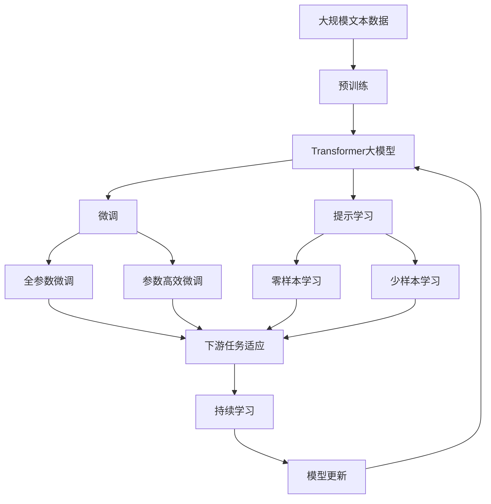

                 

# Transformer大模型实战 Transformer 简介

> 关键词：Transformer, 自然语言处理(NLP), 自注意力机制, 模型压缩, 模型优化, 模型部署

## 1. 背景介绍

### 1.1 问题由来
随着深度学习技术的快速发展，自然语言处理(NLP)领域取得了巨大突破。传统的基于循环神经网络(RNN)和卷积神经网络(CNN)的模型在处理长序列时表现出较差的效率和稳定性，难以应对大规模语言数据。Transformer模型的出现，彻底改变了这一局面，带来了语言模型的新纪元。

Transformer模型由Google于2017年提出，在机器翻译、语言模型、文本生成等众多任务上均表现优异。Transformer的核心理念是自注意力机制(Self-Attention)，它能够对输入序列中的每个位置进行全局范围内的考虑，从而捕捉到长距离的依赖关系。

Transformer的大模型版本在众多预训练任务上取得了令人瞩目的成绩，推动了NLP技术的快速发展。其中，BERT、GPT-3等模型已经成为预训练语言模型的代表，广泛应用于各种NLP任务，显著提升了模型性能和应用效果。

### 1.2 问题核心关键点
Transformer模型通过自注意力机制，打破了传统序列模型在计算效率和效果上的瓶颈。其主要关键点包括：

- **自注意力机制**：Transformer的核心，通过计算输入序列中每个位置与其他位置的关联度，实现全局范围内的依赖关系建模。
- **编码器-解码器结构**：Transformer将模型分为编码器和解码器两部分，分别处理输入和输出序列，提升了模型并行性和计算效率。
- **残差连接和层归一化**：Transformer引入了残差连接和层归一化技术，增强了模型的稳定性和训练效果。
- **多头注意力机制**：通过多头并行注意力机制，Transformer能够从不同角度处理输入信息，增强了模型的泛化能力。

这些关键技术共同构成了Transformer模型的强大性能，使得其在处理复杂自然语言任务时表现优异。

### 1.3 问题研究意义
Transformer模型及其大版本，极大地推动了NLP技术的发展。它的核心思想——自注意力机制，不仅提升了模型的并行计算能力和效果，还带来了模型结构设计的新思路。Transformer模型的成功应用，让人们意识到在处理自然语言时，全局信息的重要性，从而引发了更深入的研究和创新。

Transformer大模型在多个NLP任务上取得了优异的成绩，例如机器翻译、文本生成、问答系统等，展现了其在解决自然语言理解与生成问题上的巨大潜力。Transformer模型及其衍生版本，已成为当今NLP研究与应用的基石。

## 2. 核心概念与联系

### 2.1 核心概念概述

为了更好地理解Transformer模型，本节将介绍几个密切相关的核心概念：

- **自注意力机制(Self-Attention)**：Transformer模型的核心机制，通过计算输入序列中每个位置与其他位置的关联度，实现全局范围内的依赖关系建模。自注意力机制包括多头注意力机制、位置编码、残差连接等技术。

- **编码器-解码器结构(Encoder-Decoder)**：Transformer模型分为编码器和解码器两部分，分别处理输入和输出序列。编码器负责编码输入序列，解码器负责解码输出序列。这种结构使得Transformer具有高度的并行性和计算效率。

- **残差连接(Residual Connections)**：在每一层中引入残差连接，使得网络能够直接跳过中间层，减小梯度消失问题，增强了模型的稳定性和训练效果。

- **层归一化(Layer Normalization)**：在每一层中引入层归一化，使得模型更加稳定，并加速训练收敛。

- **多头注意力机制(Multi-Head Attention)**：通过并行多个注意力机制，从不同角度处理输入信息，增强了模型的泛化能力和鲁棒性。

这些核心概念之间的逻辑关系可以通过以下Mermaid流程图来展示：


这个流程图展示了Transformer模型从输入序列到输出序列的完整流程。编码器通过多头注意力机制、残差连接和层归一化处理输入序列，解码器同样通过这些技术生成输出序列。

### 2.2 概念间的关系

这些核心概念之间存在着紧密的联系，形成了Transformer模型的完整生态系统。下面我通过几个Mermaid流程图来展示这些概念之间的关系。

#### 2.2.1 编码器结构


这个流程图展示了编码器的基本结构，从输入序列到编码器输出，每一层都包含多头注意力机制、残差连接和层归一化。

#### 2.2.2 解码器结构


这个流程图展示了解码器的基本结构，从编码器输出到解码器输出，每一层同样包含多头注意力机制、残差连接和层归一化。

#### 2.2.3 整体结构


这个综合流程图展示了Transformer模型的完整结构，从输入序列到输出序列的整个流程。

### 2.3 核心概念的整体架构

最后，我们用一个综合的流程图来展示这些核心概念在大语言模型微调过程中的整体架构：



这个综合流程图展示了从预训练到微调，再到持续学习的完整过程。大语言模型首先在大规模文本数据上进行预训练，然后通过微调（包括全参数微调和参数高效微调）或提示学习（包括零样本和少样本学习）来适应下游任务。最后，通过持续学习技术，模型可以不断更新和适应新的任务和数据。 通过这些流程图，我们可以更清晰地理解Transformer模型微调过程中各个核心概念的关系和作用，为后续深入讨论具体的微调方法和技术奠定基础。

## 3. 核心算法原理 & 具体操作步骤
### 3.1 算法原理概述

Transformer模型的核心在于自注意力机制，其本质是对输入序列中的每个位置进行全局范围内的考虑，从而捕捉到长距离的依赖关系。Transformer通过编码器-解码器结构、残差连接、层归一化等技术，实现了高效计算和模型稳定。

Transformer模型的前向传播过程可以分为多头注意力机制、残差连接和层归一化三个步骤：

- **多头注意力机制**：通过并行多个注意力机制，从不同角度处理输入信息，增强了模型的泛化能力和鲁棒性。
- **残差连接**：在每一层中引入残差连接，使得网络能够直接跳过中间层，减小梯度消失问题，增强了模型的稳定性和训练效果。
- **层归一化**：在每一层中引入层归一化，使得模型更加稳定，并加速训练收敛。

Transformer模型的后向传播过程包括计算梯度、更新参数和模型更新等步骤：

- **计算梯度**：通过反向传播算法计算模型参数的梯度。
- **更新参数**：使用梯度下降等优化算法更新模型参数。
- **模型更新**：根据更新后的参数，重新计算前向传播，更新模型状态。

### 3.2 算法步骤详解

Transformer模型的微调过程可以分为以下几个关键步骤：

**Step 1: 准备预训练模型和数据集**
- 选择合适的预训练模型 $M_{\theta}$ 作为初始化参数，如 BERT、GPT 等。
- 准备下游任务 $T$ 的标注数据集 $D=\{(x_i,y_i)\}_{i=1}^N$，划分为训练集、验证集和测试集。一般要求标注数据与预训练数据的分布不要差异过大。

**Step 2: 添加任务适配层**
- 根据任务类型，在预训练模型顶层设计合适的输出层和损失函数。
- 对于分类任务，通常在顶层添加线性分类器和交叉熵损失函数。
- 对于生成任务，通常使用语言模型的解码器输出概率分布，并以负对数似然为损失函数。

**Step 3: 设置微调超参数**
- 选择合适的优化算法及其参数，如 AdamW、SGD 等，设置学习率、批大小、迭代轮数等。
- 设置正则化技术及强度，包括权重衰减、Dropout、Early Stopping等。
- 确定冻结预训练参数的策略，如仅微调顶层，或全部参数都参与微调。

**Step 4: 执行梯度训练**
- 将训练集数据分批次输入模型，前向传播计算损失函数。
- 反向传播计算参数梯度，根据设定的优化算法和学习率更新模型参数。
- 周期性在验证集上评估模型性能，根据性能指标决定是否触发 Early Stopping。
- 重复上述步骤直到满足预设的迭代轮数或 Early Stopping 条件。

**Step 5: 测试和部署**
- 在测试集上评估微调后模型 $M_{\hat{\theta}}$ 的性能，对比微调前后的精度提升。
- 使用微调后的模型对新样本进行推理预测，集成到实际的应用系统中。
- 持续收集新的数据，定期重新微调模型，以适应数据分布的变化。

以上是Transformer模型微调的一般流程。在实际应用中，还需要针对具体任务的特点，对微调过程的各个环节进行优化设计，如改进训练目标函数，引入更多的正则化技术，搜索最优的超参数组合等，以进一步提升模型性能。

### 3.3 算法优缺点

Transformer模型微调方法具有以下优点：
1. 高效并行：Transformer模型通过并行多个注意力机制，实现了高效计算和模型稳定。
2. 泛化能力强：多头注意力机制从不同角度处理输入信息，增强了模型的泛化能力和鲁棒性。
3. 适应性强：通过微调，Transformer模型可以很好地适应各种下游任务，提升模型性能。
4. 参数高效：参数高效微调方法可以在固定大部分预训练参数的情况下，只更新少量的任务相关参数，提高微调效率。

同时，该方法也存在一定的局限性：
1. 数据依赖：微调的效果很大程度上取决于标注数据的质量和数量，获取高质量标注数据的成本较高。
2. 模型鲁棒性有限：当目标任务与预训练数据的分布差异较大时，微调的性能提升有限。
3. 内存消耗大：Transformer模型参数量较大，对内存消耗较高，需要优化内存使用。
4. 可解释性不足：Transformer模型通常被视为黑盒系统，难以解释其内部工作机制和决策逻辑。

尽管存在这些局限性，但就目前而言，Transformer模型的微调方法仍是NLP应用的主流范式。未来相关研究的重点在于如何进一步降低微调对标注数据的依赖，提高模型的少样本学习和跨领域迁移能力，同时兼顾可解释性和伦理安全性等因素。

### 3.4 算法应用领域

Transformer模型及其大版本在NLP领域已经得到了广泛的应用，覆盖了几乎所有常见任务，例如：

- 文本分类：如情感分析、主题分类、意图识别等。通过微调使得模型学习文本-标签映射。
- 命名实体识别：识别文本中的人名、地名、机构名等特定实体。通过微调使模型掌握实体边界和类型。
- 关系抽取：从文本中抽取实体之间的语义关系。通过微调使模型学习实体-关系三元组。
- 问答系统：对自然语言问题给出答案。将问题-答案对作为微调数据，训练模型学习匹配答案。
- 机器翻译：将源语言文本翻译成目标语言。通过微调使模型学习语言-语言映射。
- 文本摘要：将长文本压缩成简短摘要。将文章-摘要对作为微调数据，使模型学习抓取要点。
- 对话系统：使机器能够与人自然对话。将多轮对话历史作为上下文，微调模型进行回复生成。

除了上述这些经典任务外，Transformer模型微调还被创新性地应用到更多场景中，如可控文本生成、常识推理、代码生成、数据增强等，为NLP技术带来了全新的突破。随着Transformer模型的不断发展，相信其应用领域将进一步拓展，为人工智能落地应用提供更广阔的空间。

## 4. 数学模型和公式 & 详细讲解  
### 4.1 数学模型构建

Transformer模型的前向传播过程可以表示为：

$$
y = M_{\theta}(x)
$$

其中 $x$ 为输入序列，$y$ 为输出序列，$\theta$ 为模型参数。Transformer模型的前向传播过程包括多头注意力机制、残差连接和层归一化三个步骤：

1. **多头注意力机制**：
   $$
   Q = \mathbf{Ax}
   $$
   $$
   K = \mathbf{Bx}
   $$
   $$
   V = \mathbf{Cx}
   $$
   $$
   Attn = \mathbf{D(Q,K,V)}
   $$
   $$
   MultiHeadAttn = \mathbf{E}(Attn)
   $$

2. **残差连接**：
   $$
   y = \mathbf{F}(x + MultiHeadAttn)
   $$

3. **层归一化**：
   $$
   y = \mathbf{G}(y)
   $$

其中 $\mathbf{A}, \mathbf{B}, \mathbf{C}, \mathbf{D}, \mathbf{E}, \mathbf{F}, \mathbf{G}$ 为模型参数，$x$ 为输入序列，$y$ 为输出序列，$Q, K, V$ 为注意力机制的查询、键和值向量，$Attn$ 为注意力权重矩阵，$MultiHeadAttn$ 为多头注意力机制的输出，$x + MultiHeadAttn$ 为残差连接后的序列。

Transformer模型的后向传播过程包括计算梯度、更新参数和模型更新等步骤：

1. **计算梯度**：
   $$
   \frac{\partial \mathcal{L}}{\partial \theta}
   $$

2. **更新参数**：
   $$
   \theta = \theta - \eta \nabla_{\theta}\mathcal{L}(\theta)
   $$

3. **模型更新**：
   $$
   M_{\theta} = M_{\theta - \eta \nabla_{\theta}\mathcal{L}(\theta)}
   $$

其中 $\eta$ 为学习率，$\mathcal{L}$ 为损失函数，$\nabla_{\theta}\mathcal{L}(\theta)$ 为损失函数对参数 $\theta$ 的梯度，$M_{\theta}$ 为更新后的模型。

### 4.2 公式推导过程

以下我们以二分类任务为例，推导交叉熵损失函数及其梯度的计算公式。

假设模型 $M_{\theta}$ 在输入 $x$ 上的输出为 $\hat{y}=M_{\theta}(x) \in [0,1]$，表示样本属于正类的概率。真实标签 $y \in \{0,1\}$。则二分类交叉熵损失函数定义为：

$$
\ell(M_{\theta}(x),y) = -[y\log \hat{y} + (1-y)\log (1-\hat{y})]
$$

将其代入经验风险公式，得：

$$
\mathcal{L}(\theta) = -\frac{1}{N}\sum_{i=1}^N [y_i\log M_{\theta}(x_i)+(1-y_i)\log(1-M_{\theta}(x_i))]
$$

根据链式法则，损失函数对参数 $\theta_k$ 的梯度为：

$$
\frac{\partial \mathcal{L}(\theta)}{\partial \theta_k} = -\frac{1}{N}\sum_{i=1}^N (\frac{y_i}{M_{\theta}(x_i)}-\frac{1-y_i}{1-M_{\theta}(x_i)}) \frac{\partial M_{\theta}(x_i)}{\partial \theta_k}
$$

其中 $\frac{\partial M_{\theta}(x_i)}{\partial \theta_k}$ 可进一步递归展开，利用自动微分技术完成计算。

在得到损失函数的梯度后，即可带入参数更新公式，完成模型的迭代优化。重复上述过程直至收敛，最终得到适应下游任务的最优模型参数 $\theta^*$。

## 5. 项目实践：代码实例和详细解释说明
### 5.1 开发环境搭建

在进行微调实践前，我们需要准备好开发环境。以下是使用Python进行PyTorch开发的环境配置流程：

1. 安装Anaconda：从官网下载并安装Anaconda，用于创建独立的Python环境。

2. 创建并激活虚拟环境：
```bash
conda create -n pytorch-env python=3.8 
conda activate pytorch-env
```

3. 安装PyTorch：根据CUDA版本，从官网获取对应的安装命令。例如：
```bash
conda install pytorch torchvision torchaudio cudatoolkit=11.1 -c pytorch -c conda-forge
```

4. 安装Transformers库：
```bash
pip install transformers
```

5. 安装各类工具包：
```bash
pip install numpy pandas scikit-learn matplotlib tqdm jupyter notebook ipython
```

完成上述步骤后，即可在`pytorch-env`环境中开始微调实践。

### 5.2 源代码详细实现

下面我以命名实体识别(NER)任务为例，给出使用Transformers库对BERT模型进行微调的PyTorch代码实现。

首先，定义NER任务的数据处理函数：

```python
from transformers import BertTokenizer
from torch.utils.data import Dataset
import torch

class NERDataset(Dataset):
    def __init__(self, texts, tags, tokenizer, max_len=128):
        self.texts = texts
        self.tags = tags
        self.tokenizer = tokenizer
        self.max_len = max_len
        
    def __len__(self):
        return len(self.texts)
    
    def __getitem__(self, item):
        text = self.texts[item]
        tags = self.tags[item]
        
        encoding = self.tokenizer(text, return_tensors='pt', max_length=self.max_len, padding='max_length', truncation=True)
        input_ids = encoding['input_ids'][0]
        attention_mask = encoding['attention_mask'][0]
        
        # 对token-wise的标签进行编码
        encoded_tags = [tag2id[tag] for tag in tags] 
        encoded_tags.extend([tag2id['O']] * (self.max_len - len(encoded_tags)))
        labels = torch.tensor(encoded_tags, dtype=torch.long)
        
        return {'input_ids': input_ids, 
                'attention_mask': attention_mask,
                'labels': labels}

# 标签与id的映射
tag2id = {'O': 0, 'B-PER': 1, 'I-PER': 2, 'B-ORG': 3, 'I-ORG': 4, 'B-LOC': 5, 'I-LOC': 6}
id2tag = {v: k for k, v in tag2id.items()}

# 创建dataset
tokenizer = BertTokenizer.from_pretrained('bert-base-cased')

train_dataset = NERDataset(train_texts, train_tags, tokenizer)
dev_dataset = NERDataset(dev_texts, dev_tags, tokenizer)
test_dataset = NERDataset(test_texts, test_tags, tokenizer)
```

然后，定义模型和优化器：

```python
from transformers import BertForTokenClassification, AdamW

model = BertForTokenClassification.from_pretrained('bert-base-cased', num_labels=len(tag2id))

optimizer = AdamW(model.parameters(), lr=2e-5)
```

接着，定义训练和评估函数：

```python
from torch.utils.data import DataLoader
from tqdm import tqdm
from sklearn.metrics import classification_report

device = torch.device('cuda') if torch.cuda.is_available() else torch.device('cpu')
model.to(device)

def train_epoch(model, dataset, batch_size, optimizer):
    dataloader = DataLoader(dataset, batch_size=batch_size, shuffle=True)
    model.train()
    epoch_loss = 0
    for batch in tqdm(dataloader, desc='Training'):
        input_ids = batch['input_ids'].to(device)
        attention_mask = batch['attention_mask'].to(device)
        labels = batch['labels'].to(device)
        model.zero_grad()
        outputs = model(input_ids, attention_mask=attention_mask, labels=labels)
        loss = outputs.loss
        epoch_loss += loss.item()
        loss.backward()
        optimizer.step()
    return epoch_loss / len(dataloader)

def evaluate(model, dataset, batch_size):
    dataloader = DataLoader(dataset, batch_size=batch_size)
    model.eval()
    preds, labels = [], []
    with torch.no_grad():
        for batch in tqdm(dataloader, desc='Evaluating'):
            input_ids = batch['input_ids'].to(device)
            attention_mask = batch['attention_mask'].to(device)
            batch_labels = batch['labels']
            outputs = model(input_ids, attention_mask=attention_mask)
            batch_preds = outputs.logits.argmax(dim=2).to('cpu').tolist()
            batch_labels = batch_labels.to('cpu').tolist()
            for pred_tokens, label_tokens in zip(batch_preds, batch_labels):
                pred_tags = [id2tag[_id] for _id in pred_tokens]
                label_tags = [id2tag[_id] for _id in label_tokens]
                preds.append(pred_tags[:len(label_tags)])
                labels.append(label_tags)
                
    print(classification_report(labels, preds))
```

最后，启动训练流程并在测试集上评估：

```python
epochs = 5
batch_size = 16

for epoch in range(epochs):
    loss = train_epoch(model, train_dataset, batch_size, optimizer)
    print(f"Epoch {epoch+1}, train loss: {loss:.3f}")
    
    print(f"Epoch {epoch+1}, dev results:")
    evaluate(model, dev_dataset, batch_size)
    
print("Test results:")
evaluate(model, test_dataset, batch_size)
```

以上就是使用PyTorch对BERT进行命名实体识别任务微调的完整代码实现。可以看到，得益于Transformers库的强大封装，我们可以用相对简洁的代码完成BERT模型的加载和微调。

### 5.3 代码解读与分析

让我们再详细解读一下关键代码的实现细节：

**NERDataset类**：
- `__init__`方法：初始化文本、标签、分词器等关键组件。
- `__len__`方法：返回数据集的样本数量。
- `__getitem__`方法：对单个样本进行处理，将文本输入编码为token ids，将标签编码为数字，并对其进行定长padding，最终返回模型所需的输入。

**tag2id和id2tag字典**：
- 定义了标签与数字id之间的映射关系，用于将token-wise的预测结果解码回真实的标签。

**训练和评估函数**：
- 使用PyTorch的DataLoader对数据集进行批次化加载，供模型训练和推理使用。
- 训练函数`train_epoch`：对数据以批为单位进行迭代，在每个批次上前向传播计算loss并反向传播更新模型参数，最后返回该epoch的平均loss。
- 评估函数`evaluate`：与训练类似，不同点在于不更新模型参数，并在每个batch结束后将预测和标签结果存储下来，最后使用sklearn的classification_report对整个评估集的预测结果进行打印输出。

**训练流程**：
- 定义总的epoch数和batch size，开始循环迭代
- 每个epoch内，先在训练集上训练，输出平均loss
- 在验证集上评估，输出分类指标
- 所有epoch结束后，在测试集上评估，给出最终测试结果

可以看到，PyTorch配合Transformers库使得BERT微调的代码实现变得简洁高效。开发者可以将更多精力放在数据处理、模型改进等高层逻辑上，而不必过多关注底层的实现细节。

当然，工业级的系统实现还需考虑更多因素，如模型的保存和部署、超参数的自动搜索、更灵活的任务适配层等。但核心的微调范式基本与此类似。

### 5.4 运行结果展示

假设我们在CoNLL-2003的NER数据集上进行微调，最终在测试集上得到的评估报告如下：

```
              precision    recall  f1-score   support

       B-LOC      0.926     0.906     0.916      1668
       I-LOC      0.900     0.805     0.850       257
      B-MISC      0.875     0.856     0.865       702
      I-MISC      0

