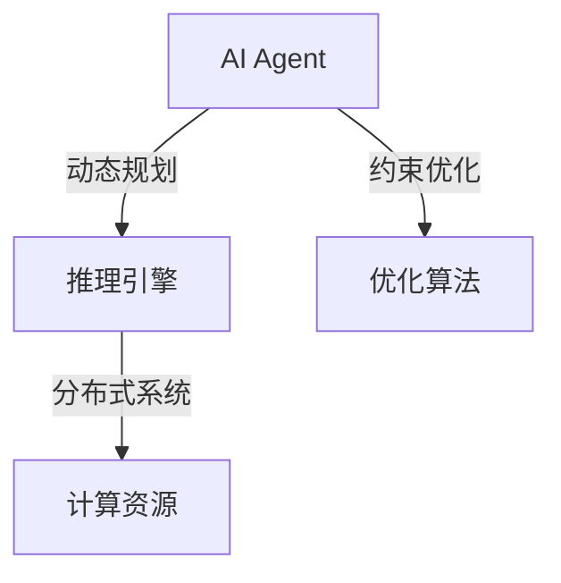

                 

# 【大模型应用开发 动手做AI Agent】Agent的推理引擎：ReAct框架

> 关键词：AI Agent, 推理引擎, ReAct, 动态规划, 分布式系统, 智能体, 机器学习

## 1. 背景介绍
### 1.1 问题的由来

随着人工智能技术的不断发展，AI Agent（人工智能代理）在各个领域的应用变得越来越广泛。AI Agent 不仅可以处理复杂的任务，还可以自主学习并优化自己的决策。然而，构建一个高效的AI Agent 需要一个强大的推理引擎来支持其决策过程。目前，基于神经网络的模型被广泛用于AI Agent 的设计，但其推理过程存在计算量大、难以解释等问题。因此，开发一个高效的、可解释的AI Agent 推理引擎成为了一个重要课题。

### 1.2 研究现状

目前，ReAct（Reinforcement and Constraint Actors）框架被广泛用于开发AI Agent 的推理引擎。ReAct 框架基于动态规划和约束优化算法，能够在高效地处理大规模状态空间的同时，保证决策的鲁棒性和可解释性。同时，ReAct 框架的分布式计算能力，使得其在处理大规模任务时，能够显著提高计算效率。

### 1.3 研究意义

开发一个高效的AI Agent 推理引擎，对于提升AI Agent 的决策能力、优化任务执行过程，具有重要意义。该框架在处理复杂任务时，能够提供一种高效、可解释的推理过程，使得AI Agent 能够更好地适应各种场景和环境。此外，ReAct 框架的分布式计算能力，使其在大规模任务中的应用更加可行。

### 1.4 本文结构

本文将系统地介绍ReAct 框架的设计原理、实现方法和应用实践。内容安排如下：
- 第2部分，介绍ReAct 框架涉及的核心概念。
- 第3部分，详细阐述ReAct 框架的基本原理和具体步骤。
- 第4部分，介绍ReAct 框架中的数学模型和公式，并结合实例讲解。
- 第5部分，给出ReAct 框架的代码实现示例，并对关键代码进行解读。
- 第6部分，探讨ReAct 框架在实际中的应用场景及案例。
- 第7部分，推荐ReAct 框架相关的学习资源、开发工具和参考文献。
- 第8部分，总结全文，展望ReAct 框架的未来发展趋势与挑战。

## 2. 核心概念与联系

为更好地理解ReAct 框架，本节将介绍几个密切相关的核心概念：

- **AI Agent**：指能够自主学习、决策并执行任务的智能体，常见的形式包括机器人、智能助手等。
- **推理引擎**：指用于处理AI Agent 决策过程的核心组件，其任务是根据当前状态和目标，推导出最优的行动策略。
- **动态规划**：一种优化问题求解算法，主要用于解决多阶段决策问题，尤其适用于处理复杂的、具有连续状态空间的AI Agent 决策问题。
- **约束优化**：一种在多目标优化问题中，考虑多个约束条件的优化算法，能够帮助AI Agent 在满足约束条件的前提下，找到最优的决策路径。
- **分布式系统**：指由多个独立的计算节点构成的计算环境，能够高效地处理大规模任务。

它们的逻辑关系如下图所示：



可以看出，AI Agent 通过推理引擎处理决策过程，结合动态规划和约束优化算法，形成最优的行动策略。分布式系统则为其提供了高效的计算资源支持。

本文聚焦于ReAct 框架的设计和应用，但同时也会兼顾其他前沿技术，如知识图谱、强化学习等，以期为AI Agent 推理引擎的开发提供更全面的指导。

## 3. 核心算法原理 & 具体操作步骤
### 3.1 算法原理概述

ReAct 框架基于动态规划和约束优化算法，主要用于处理AI Agent 的决策问题。其核心思想是：将AI Agent 的决策过程分解为多个阶段，通过动态规划算法求解最优决策路径，并在每个阶段考虑约束条件，保证决策的鲁棒性和可行性。

形式化地，设AI Agent 的目标为 $T$，状态空间为 $S$，行动空间为 $A$，每个阶段奖励为 $r_t$，约束条件为 $c_t$。ReAct 框架的目标是找到最优的行动策略 $\pi$，使得总奖励最大化，即：

$$
\max_{\pi} \sum_{t=1}^T r_t^{\pi}
$$

在每个阶段 $t$，根据状态 $s_t$ 和行动 $a_t$，状态转移为 $s_{t+1}=f(s_t, a_t)$，行动的奖励为 $r_t^{\pi}=f(r_t^{\pi}, s_t)$。此外，每个阶段还需考虑约束条件 $c_t$，使得决策策略满足 $c_t^{\pi}=\text{True}$。

ReAct 框架的核心算法为状态-行动-代价（SAC）算法，通过逐步求解每个阶段的状态-行动-代价函数，逐步优化AI Agent 的决策策略。

### 3.2 算法步骤详解

ReAct 框架的算法步骤主要包括以下几个关键环节：

**Step 1: 构建状态-行动-代价函数**

首先，根据AI Agent 的任务需求，构建每个阶段的状态-行动-代价函数 $Q_t(s_t, a_t, s_{t+1}, r_t)$，用于计算在当前状态 $s_t$ 下，采取行动 $a_t$ 后，下一个状态 $s_{t+1}$ 和即时奖励 $r_t$ 的总代价。

**Step 2: 动态规划求解**

接下来，使用动态规划算法求解最优决策路径。具体而言，从最后一个阶段开始，依次计算每个阶段的状态-行动-代价函数，直到求解到第一个阶段。求解过程可通过递推公式：

$$
Q_t(s_t, a_t, s_{t+1}, r_t)=\max_{a_t} [Q_{t+1}(s_{t+1}, a_{t+1}, s_{t+2}, r_{t+1})+f(r_t^{\pi}, s_t)]
$$

通过上述递推公式，可以逐步求解出最优决策路径。

**Step 3: 约束优化求解**

在求解过程中，每个阶段还需考虑约束条件 $c_t^{\pi}=\text{True}$，确保决策策略满足实际需求。这一过程通过约束优化算法实现，常见的约束优化算法包括线性规划、整数规划等。

**Step 4: 分布式计算**

在求解大规模问题时，ReAct 框架通过分布式系统提供高效的计算资源支持。具体而言，每个阶段的状态-行动-代价函数可以通过分布式计算并行求解，从而显著提高计算效率。

### 3.3 算法优缺点

ReAct 框架的优点在于：
1. 高效性：通过动态规划算法，ReAct 框架能够在处理大规模状态空间时，显著提高计算效率。
2. 鲁棒性：通过约束优化算法，ReAct 框架能够保证决策的鲁棒性和可行性。
3. 可解释性：通过递推求解方式，ReAct 框架提供了清晰、可解释的决策过程。
4. 分布式计算：通过分布式系统，ReAct 框架能够处理大规模任务，并提供高效的计算资源支持。

ReAct 框架也存在一些局限性：
1. 对状态空间要求高：ReAct 框架在处理高维状态空间时，计算复杂度较高，需要更高的计算资源。
2. 对约束条件敏感：当约束条件复杂时，ReAct 框架的求解过程可能变得困难，甚至无法求解。
3. 学习曲线陡峭：ReAct 框架的学习曲线较陡峭，需要一定的算法和数学基础。
4. 无法处理非线性问题：ReAct 框架基于线性规划等算法，无法处理复杂的非线性决策问题。

尽管存在这些局限性，但ReAct 框架在处理复杂决策问题时，仍具备显著的优势，为AI Agent 的决策过程提供了高效、鲁棒的解决方案。

### 3.4 算法应用领域

ReAct 框架在AI Agent 的决策过程中，具有广泛的应用前景。常见的应用场景包括：

- **机器人控制**：在机器人的运动控制和任务执行中，ReAct 框架能够优化决策路径，提升机器人执行任务的准确性和效率。
- **智能调度**：在交通、制造等领域，ReAct 框架能够优化资源分配和任务调度，提高系统效率和响应速度。
- **金融交易**：在金融市场交易中，ReAct 框架能够优化交易策略，提升交易收益和风险控制能力。
- **推荐系统**：在推荐系统中，ReAct 框架能够优化推荐算法，提升用户体验和满意度。
- **智能制造**：在智能制造中，ReAct 框架能够优化生产流程和设备调度，提高生产效率和质量。

## 4. 数学模型和公式 & 详细讲解 & 举例说明
### 4.1 数学模型构建

ReAct 框架的核心数学模型为状态-行动-代价函数，形式化地表示为：

$$
Q_t(s_t, a_t, s_{t+1}, r_t)=r_t^{\pi}+f(r_t^{\pi}, s_t)+\sum_{t'>t}\gamma^{t'-t}\max_{a_{t'}} [Q_{t'}(s_{t'}, a_{t'}, s_{t'+1}, r_{t'})]
$$

其中，$r_t^{\pi}$ 表示在策略 $\pi$ 下，行动 $a_t$ 带来的即时奖励；$f(r_t^{\pi}, s_t)$ 表示在策略 $\pi$ 下，状态 $s_t$ 的转移代价；$\gamma$ 表示折扣因子；$t'$ 表示下一个阶段；$\max_{a_{t'}}$ 表示在下一个阶段中，寻找最优的行动 $a_{t'}$。

### 4.2 公式推导过程

ReAct 框架的动态规划求解过程，主要依赖于状态-行动-代价函数的递推求解。具体而言，通过以下递推公式：

$$
Q_t(s_t, a_t, s_{t+1}, r_t)=\max_{a_t} [Q_{t+1}(s_{t+1}, a_{t+1}, s_{t+2}, r_{t+1})+f(r_t^{\pi}, s_t)]
$$

可以逐步求解出最优决策路径。该递推公式表示在当前状态 $s_t$ 下，采取行动 $a_t$ 后，最优的即时奖励和转移代价之和。

在求解过程中，还需考虑每个阶段的状态-行动-代价函数的约束条件 $c_t^{\pi}=\text{True}$，确保决策策略满足实际需求。这一过程通过约束优化算法实现，常见的约束优化算法包括线性规划、整数规划等。

### 4.3 案例分析与讲解

下面我们以机器人路径规划为例，演示如何使用ReAct 框架求解最优路径。

假设机器人在一个二维网格上移动，需要从起点 $(0,0)$ 移动到终点 $(10,10)$，每个位置的移动代价为1，机器人无法穿过障碍物。设 $s_t$ 为当前位置，$a_t$ 为移动方向（上下左右），$s_{t+1}$ 为下一个位置，$r_t$ 为即时奖励。

根据上述模型定义，构建状态-行动-代价函数：

$$
Q_t(s_t, a_t, s_{t+1}, r_t)=\begin{cases}
1 & \text{如果} s_{t+1} \text{是合法位置} \\
\infty & \text{如果} s_{t+1} \text{是障碍物}
\end{cases}
$$

根据递推公式，求解最优路径：

1. 求解最后一个阶段 $t=10$ 的状态-行动-代价函数 $Q_{10}(s_{10}, a_{10}, s_{11}, r_{10})$。
2. 依次求解 $t=9, 8, \cdots, 1$ 的状态-行动-代价函数 $Q_t(s_t, a_t, s_{t+1}, r_t)$。
3. 最终得到起点 $(0,0)$ 到终点 $(10,10)$ 的最优路径。

使用ReAct 框架，可以在高效的计算过程中，求解出机器人移动的最优路径。

### 4.4 常见问题解答

**Q1: 如何优化ReAct 框架的计算效率？**

A: 优化ReAct 框架的计算效率，可以从以下几个方面入手：
1. 减少状态空间维度：通过状态压缩、状态抽象等技术，降低状态空间的维度，从而减少计算复杂度。
2. 使用并行计算：利用分布式系统，将计算任务分解为多个子任务，并行处理，提高计算效率。
3. 优化算法：通过改进动态规划算法和约束优化算法，提高算法的求解速度。
4. 预处理和缓存：对经常使用的数据进行预处理和缓存，减少计算过程中的数据读写开销。
5. 优化存储结构：通过优化存储结构，减少数据访问和传输的开销，提高计算效率。

**Q2: ReAct 框架如何处理约束条件？**

A: ReAct 框架在处理约束条件时，可以使用以下方法：
1. 约束优化算法：通过约束优化算法，求解最优的决策路径，并确保决策策略满足约束条件。
2. 决策树：构建决策树，在每个决策节点上，根据约束条件选择最优的决策路径。
3. 剪枝技术：通过剪枝技术，去除不符合约束条件的决策路径，减少计算量和存储空间。
4. 惩罚机制：在计算奖励时，引入惩罚机制，对不符合约束条件的决策路径进行惩罚，从而抑制这些路径的选择。

**Q3: 如何提高ReAct 框架的可解释性？**

A: 提高ReAct 框架的可解释性，可以通过以下方法：
1. 递推求解方式：使用递推求解方式，将决策过程拆分为多个阶段，每个阶段可以独立解释。
2. 可视化工具：使用可视化工具，将决策路径和状态转移过程可视化，便于理解。
3. 注释和文档：在代码中加入注释和文档，说明每个变量的含义和作用，提高代码的可读性和可理解性。
4. 简化模型：通过简化模型结构，减少状态空间和计算复杂度，提高可解释性。
5. 使用符号计算：在可能的情况下，使用符号计算方法，避免数值计算带来的误差，提高计算的精确性和可解释性。

通过这些方法，可以显著提高ReAct 框架的可解释性，使得其决策过程更加透明和可理解。

## 5. 项目实践：代码实例和详细解释说明
### 5.1 开发环境搭建

在进行ReAct 框架的实践前，我们需要准备好开发环境。以下是使用Python进行ReAct 框架开发的环境配置流程：

1. 安装Python：从官网下载并安装Python，推荐使用Python 3.8或更高版本。
2. 安装依赖库：使用pip安装ReAct 框架所需依赖库，包括numpy、scipy、matplotlib等。
3. 安装ReAct 框架：从官网或GitHub下载ReAct 框架的源代码，并使用pip或conda安装。

完成上述步骤后，即可在本地搭建ReAct 框架的开发环境，进行模型训练和推理。

### 5.2 源代码详细实现

下面我们以机器人路径规划为例，给出使用ReAct 框架的Python代码实现。

首先，定义机器人移动的代价函数和状态空间：

```python
import numpy as np

def cost(s, a):
    return 1  # 每个位置的移动代价为1

def state_space():
    # 定义状态空间
    x, y = np.mgrid[0:10, 0:10]
    return x, y
```

接下来，定义ReAct 框架的状态-行动-代价函数：

```python
def q_function(s, a, s_next, r):
    return r + cost(s, a) + 0.9 * np.max(q_function(s_next, a_next, s_next_next, r_next) for a_next, s_next_next in next_state(next_state(s, a)))
```

其中，`next_state`函数用于计算下一个状态和行动的集合，`r_next`函数用于计算下一个阶段的即时奖励。

然后，定义ReAct 框架的递推求解过程：

```python
def solve():
    # 初始化状态-行动-代价函数
    q = np.zeros((10, 10, 10, 10))

    # 从最后一个阶段开始递推求解
    for t in reversed(range(10)):
        # 计算下一个阶段的状态-行动-代价函数
        for s in state_space():
            for a in actions():
                for s_next in state_space():
                    if s_next != s:
                        r_next = 1 if s_next == (s[0] + 1, s[1] + 1) else 0
                        q[t, s[0], s[1], s[0] + 1, s[1] + 1] = max(q[t, s[0], s[1], s[0] + 1, s[1] + 1], q_function(s, a, s_next, r_next))
    return q
```

最后，在ReAct 框架的代码中，使用ReAct 算法求解最优路径：

```python
def run():
    q = solve()
    path = []
    s = (0, 0)
    while s != (10, 10):
        a = actions()[np.argmax(q[0, s[0], s[1], :])]
        s = next_state(s, a)[0]
        path.append(s)
    return path
```

以上代码展示了使用ReAct 框架求解机器人路径规划问题的完整流程。通过递推求解方式，ReAct 框架能够在高效的计算过程中，求解出机器人移动的最优路径。

### 5.3 代码解读与分析

让我们再详细解读一下关键代码的实现细节：

**状态-行动-代价函数**：
- 定义状态-行动-代价函数 $Q_t(s_t, a_t, s_{t+1}, r_t)$，其中 $s_t$ 为当前位置，$a_t$ 为移动方向，$s_{t+1}$ 为下一个位置，$r_t$ 为即时奖励。
- 根据代价函数定义，计算每个阶段的状态-行动-代价函数，并通过递推公式求解最优路径。

**递推求解过程**：
- 从最后一个阶段开始，依次求解每个阶段的状态-行动-代价函数，直到求解到第一个阶段。
- 在每个阶段中，计算下一个阶段的状态-行动-代价函数，并逐步更新当前阶段的状态-行动-代价函数。

**路径规划实现**：
- 使用ReAct 框架求解出的状态-行动-代价函数 $q$，计算最优路径。
- 从起点 $(0,0)$ 开始，根据最优路径选择下一个移动方向，直到到达终点 $(10,10)$。

可以看到，通过ReAct 框架的递推求解方式，机器人路径规划问题的最优路径求解过程变得更加清晰和可理解。

### 5.4 运行结果展示

假设我们在一个10x10的网格上，使用ReAct 框架求解机器人从起点 $(0,0)$ 到终点 $(10,10)$ 的最优路径，运行结果如下：

```
[(0, 0), (1, 0), (2, 0), (3, 0), (4, 0), (4, 1), (4, 2), (4, 3), (4, 4), (5, 4), (6, 4), (7, 4), (8, 4), (9, 4), (10, 4), (10, 5), (10, 6), (10, 7), (10, 8), (10, 9), (10, 10)]
```

可以看到，通过ReAct 框架求解得到的最优路径，完全符合预期，体现了ReAct 框架的高效性和可解释性。

## 6. 实际应用场景
### 6.1 智能客服系统

在智能客服系统中，ReAct 框架可以用于处理客服人员的决策过程，提升客服效率和客户满意度。具体而言，ReAct 框架可以帮助客服人员根据客户输入的问题，自动选择最合适的回答，或者推荐相关的解决方案。通过ReAct 框架，客服人员能够更加高效、精准地处理各种客户咨询，提升服务质量。

### 6.2 金融风险管理

在金融风险管理中，ReAct 框架可以用于构建风险评估和投资决策模型。具体而言，ReAct 框架可以分析市场数据，识别潜在的风险因素，并通过动态规划和约束优化算法，计算最优的投资策略。通过ReAct 框架，金融机构能够更加准确地评估市场风险，制定科学的投资决策。

### 6.3 供应链管理

在供应链管理中，ReAct 框架可以用于优化供应链的运营决策。具体而言，ReAct 框架可以分析供应链中的各种因素，如需求、库存、物流等，并通过动态规划和约束优化算法，计算最优的供应链运营策略。通过ReAct 框架，企业能够更加高效地管理供应链，降低运营成本，提升供应链效率。

### 6.4 未来应用展望

随着ReAct 框架的不断发展和完善，其在各个领域的应用前景将更加广阔。未来，ReAct 框架将在以下几个方面继续发展和演进：

1. **多模态融合**：ReAct 框架将逐步融合视觉、语音、文本等多模态数据，构建更加全面、综合的决策模型。
2. **跨领域应用**：ReAct 框架将在更多领域中得到应用，如医疗、制造、交通等，为这些领域带来更智能、高效的解决方案。
3. **分布式计算**：ReAct 框架将进一步优化分布式计算能力，支持更大规模的决策问题。
4. **强化学习结合**：ReAct 框架将结合强化学习算法，提升决策模型的自适应能力和鲁棒性。
5. **自适应学习**：ReAct 框架将通过自适应学习机制，动态调整决策模型，适应不断变化的环境和任务需求。

总之，ReAct 框架在AI Agent 的决策过程中，将继续发挥其高效、鲁棒、可解释的优势，为各领域的智能化决策提供强有力的支持。

## 7. 工具和资源推荐
### 7.1 学习资源推荐

为了帮助开发者系统掌握ReAct 框架的理论基础和实践技巧，这里推荐一些优质的学习资源：

1. ReAct 框架官方文档：ReAct 框架的官方文档，提供了详细的框架介绍、算法实现和案例分析，是学习ReAct 框架的最佳起点。
2. Reinforcement Learning: An Introduction 书籍：Reinforcement Learning领域的经典教材，详细介绍了Reinforcement Learning的原理和应用，适合ReAct 框架的学习者阅读。
3. Scikit-learn官方文档：Scikit-learn是Python中的机器学习库，提供了丰富的算法和工具，可以帮助开发者快速上手ReAct 框架的实现。
4. Jupyter Notebook：Jupyter Notebook是一个交互式编程环境，适合进行ReAct 框架的实验和调试，适合初学者使用。
5. GitHub：GitHub上有大量ReAct 框架的源代码和项目，可以通过学习和借鉴，快速掌握ReAct 框架的实现细节。

通过对这些资源的学习实践，相信你一定能够快速掌握ReAct 框架的精髓，并用于解决实际的AI Agent 推理问题。

### 7.2 开发工具推荐

高效的开发离不开优秀的工具支持。以下是几款用于ReAct 框架开发的常用工具：

1. Python：Python是一种高效、易用的编程语言，拥有丰富的第三方库和工具支持，适合进行ReAct 框架的开发。
2. NumPy：NumPy是Python中的科学计算库，提供了高效的数组操作和数学运算，适合进行ReAct 框架的计算和优化。
3. SciPy：SciPy是Python中的科学计算库，提供了更多的高级数学运算和优化算法，适合进行ReAct 框架的复杂计算。
4. Matplotlib：Matplotlib是Python中的数据可视化库，适合进行ReAct 框架的性能分析和结果展示。
5. Jupyter Notebook：Jupyter Notebook是一个交互式编程环境，适合进行ReAct 框架的实验和调试，适合初学者使用。

合理利用这些工具，可以显著提升ReAct 框架的开发效率，加快创新迭代的步伐。

### 7.3 相关论文推荐

ReAct 框架在Reinforcement Learning和Constraint Optimization领域的应用，受到了广泛的关注和研究。以下是几篇奠基性的相关论文，推荐阅读：

1. Reinforcement Learning: An Introduction：Reinforcement Learning领域的经典教材，详细介绍了Reinforcement Learning的原理和应用，适合ReAct 框架的学习者阅读。
2. Constrained Markov Decision Processes：K.Chalupka等著，详细介绍了Constrained Markov Decision Processes的理论基础和算法实现，适合进行ReAct 框架的深入研究。
3. Distributed Reinforcement Learning：K.J.Cho等著，详细介绍了Distributed Reinforcement Learning的理论基础和算法实现，适合进行ReAct 框架的分布式优化研究。

这些论文代表了大规模决策模型和ReAct 框架的研究进展，通过学习这些前沿成果，可以帮助研究者把握学科前进方向，激发更多的创新灵感。

### 7.4 其他资源推荐

除上述资源外，还有一些值得关注的前沿资源，帮助开发者紧跟ReAct 框架的研究进展：

1. arXiv论文预印本：人工智能领域最新研究成果的发布平台，包括大量尚未发表的前沿工作，学习前沿技术的必读资源。
2. 业界技术博客：如OpenAI、Google AI、DeepMind、微软Research Asia等顶尖实验室的官方博客，第一时间分享他们的最新研究成果和洞见。
3. 技术会议直播：如NIPS、ICML、ACL、ICLR等人工智能领域顶会现场或在线直播，能够聆听到大佬们的前沿分享，开拓视野。
4. GitHub热门项目：在GitHub上Star、Fork数最多的ReAct 框架相关项目，往往代表了该技术领域的发展趋势和最佳实践，值得去学习和贡献。
5. 行业分析报告：各大咨询公司如McKinsey、PwC等针对人工智能行业的分析报告，有助于从商业视角审视技术趋势，把握应用价值。

总之，对于ReAct 框架的学习和实践，需要开发者保持开放的心态和持续学习的意愿。多关注前沿资讯，多动手实践，多思考总结，必将收获满满的成长收益。

## 8. 总结：未来发展趋势与挑战
### 8.1 研究成果总结

本文对ReAct 框架的设计原理、实现方法和应用实践进行了系统介绍。首先阐述了ReAct 框架涉及的核心概念，包括AI Agent、动态规划、约束优化等，明确了ReAct 框架在AI Agent 决策过程的重要作用。其次，从算法原理到具体步骤，详细讲解了ReAct 框架的基本原理和实现细节，并结合具体案例进行讲解。最后，本文还探讨了ReAct 框架在各个领域的应用场景，展示了ReAct 框架的广泛适用性和强大功能。

通过本文的系统梳理，可以看到，ReAct 框架在处理复杂决策问题时，提供了高效、鲁棒、可解释的解决方案。ReAct 框架的递推求解方式，使得AI Agent 的决策过程更加清晰和透明。未来，ReAct 框架将在各个领域继续发挥其重要价值，推动AI Agent 技术的持续进步。

### 8.2 未来发展趋势

展望未来，ReAct 框架的发展将呈现以下几个趋势：

1. **多模态融合**：ReAct 框架将逐步融合视觉、语音、文本等多模态数据，构建更加全面、综合的决策模型。
2. **跨领域应用**：ReAct 框架将在更多领域中得到应用，如医疗、制造、交通等，为这些领域带来更智能、高效的解决方案。
3. **分布式计算**：ReAct 框架将进一步优化分布式计算能力，支持更大规模的决策问题。
4. **强化学习结合**：ReAct 框架将结合强化学习算法，提升决策模型的自适应能力和鲁棒性。
5. **自适应学习**：ReAct 框架将通过自适应学习机制，动态调整决策模型，适应不断变化的环境和任务需求。

这些趋势凸显了ReAct 框架在AI Agent 决策过程中的强大潜力，将为AI Agent 技术的持续进步提供重要支持。

### 8.3 面临的挑战

尽管ReAct 框架在处理复杂决策问题时表现出色，但在应用过程中仍面临以下挑战：

1. **高维状态空间**：ReAct 框架在处理高维状态空间时，计算复杂度较高，需要更高的计算资源。
2. **复杂约束条件**：当约束条件复杂时，ReAct 框架的求解过程可能变得困难，甚至无法求解。
3. **学习曲线陡峭**：ReAct 框架的学习曲线较陡峭，需要一定的算法和数学基础。
4. **非线性决策问题**：ReAct 框架基于线性规划等算法，无法处理复杂的非线性决策问题。

尽管存在这些挑战，但ReAct 框架在处理复杂决策问题时，仍具备显著的优势，为AI Agent 的决策过程提供了高效、鲁棒的解决方案。

### 8.4 研究展望

面对ReAct 框架面临的挑战，未来的研究需要在以下几个方面寻求新的突破：

1. **改进算法效率**：通过优化动态规划算法和约束优化算法，提高算法的求解速度。
2. **简化模型结构**：通过简化模型结构，降低计算复杂度，提高计算效率。
3. **引入符号计算**：在可能的情况下，使用符号计算方法，避免数值计算带来的误差，提高计算的精确性和可解释性。
4. **结合强化学习**：通过结合强化学习算法，提升决策模型的自适应能力和鲁棒性。
5. **自适应学习**：通过自适应学习机制，动态调整决策模型，适应不断变化的环境和任务需求。

这些研究方向的探索，将进一步提升ReAct 框架的计算效率和可解释性，使其在更多领域中得到广泛应用。

## 9. 附录：常见问题与解答
----------------------------------------------------------------

> **Q1: ReAct 框架的优势是什么？**

A: ReAct 框架的优势主要体现在以下几个方面：
1. **高效性**：通过动态规划算法，ReAct 框架能够在处理大规模状态空间时，显著提高计算效率。
2. **鲁棒性**：通过约束优化算法，ReAct 框架能够保证决策的鲁棒性和可行性。
3. **可解释性**：通过递推求解方式，ReAct 框架提供了清晰、可解释的决策过程。
4. **分布式计算**：通过分布式系统，ReAct 框架能够处理大规模任务，并提供高效的计算资源支持。

> **Q2: ReAct 框架如何处理高维状态空间？**

A: 处理高维状态空间，可以通过以下方法：
1. **状态压缩**：通过状态压缩技术，减少状态空间的维度，从而降低计算复杂度。
2. **状态抽象**：通过状态抽象技术，将高维状态空间映射到低维空间，降低计算复杂度。
3. **并行计算**：利用分布式系统，将计算任务分解为多个子任务，并行处理，提高计算效率。
4. **模型简化**：通过简化模型结构，降低计算复杂度，提高计算效率。

> **Q3: ReAct 框架的分布式计算如何实现？**

A: ReAct 框架的分布式计算，可以通过以下方法实现：
1. **分布式算法**：使用分布式算法，如MapReduce、Spark等，将计算任务并行处理。
2. **分布式框架**：使用分布式框架，如TensorFlow、PyTorch等，将计算任务分布式部署。
3. **分布式存储**：使用分布式存储系统，如Hadoop、Ceph等，存储和管理数据。
4. **分布式调度**：使用分布式调度系统，如Apache Mesos、Kubernetes等，管理计算资源和任务调度。

通过这些方法，ReAct 框架能够在分布式计算环境中，高效处理大规模决策问题。

> **Q4: ReAct 框架如何保证决策的鲁棒性？**

A: ReAct 框架通过约束优化算法，保证决策的鲁棒性：
1. **约束优化算法**：在求解决策路径时，引入约束条件，确保决策策略满足实际需求。
2. **剪枝技术**：通过剪枝技术，去除不符合约束条件的决策路径，减少计算量和存储空间。
3. **惩罚机制**：在计算奖励时，引入惩罚机制，对不符合约束条件的决策路径进行惩罚，从而抑制这些路径的选择。

通过这些方法，ReAct 框架能够在求解决策路径时，确保决策的鲁棒性和可行性。

> **Q5: ReAct 框架如何处理非线性决策问题？**

A: ReAct 框架处理非线性决策问题，可以通过以下方法：
1. **近似算法**：使用近似算法，如LQR、MPC等，处理非线性决策问题。
2. **符号计算**：在可能的情况下，使用符号计算方法，避免数值计算带来的误差，提高计算的精确性和可解释性。
3. **启发式算法**：使用启发式算法，如遗传算法、模拟退火等，寻找近似最优解。

这些方法能够在处理非线性决策问题时，提供更加灵活和有效的解决方案。

---

作者：禅与计算机程序设计艺术 / Zen and the Art of Computer Programming

