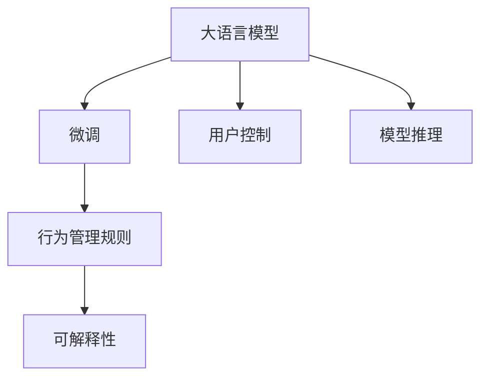
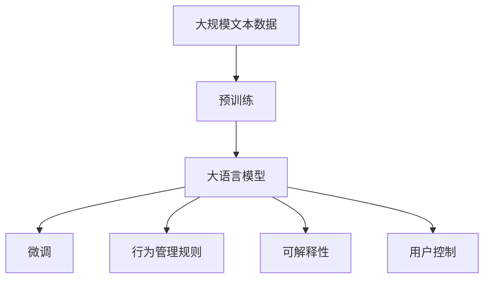
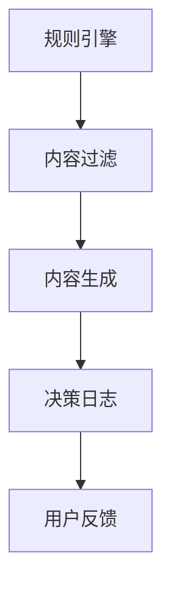
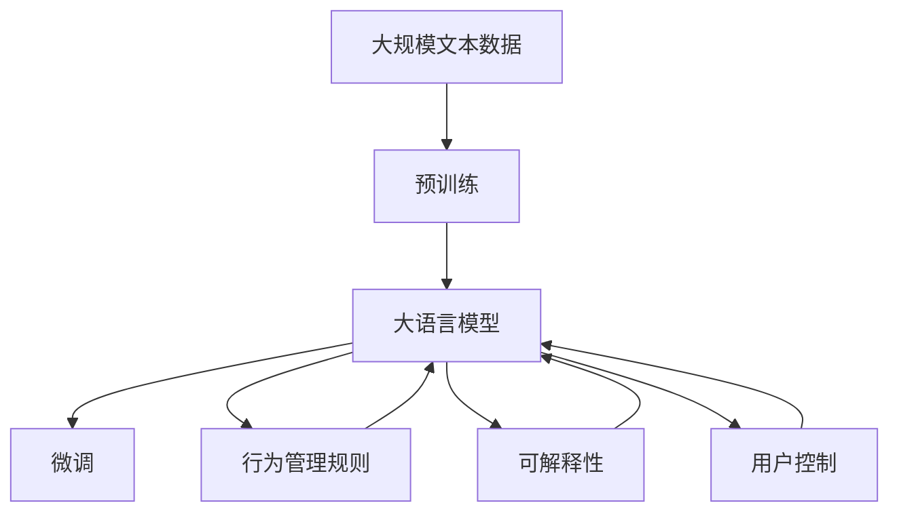

                 

# 【大模型应用开发 动手做AI Agent】AutoGPT实战

> 关键词：大模型应用, AI Agent, AutoGPT, 编程实战, 深度学习

## 1. 背景介绍

### 1.1 问题由来
大语言模型（Large Language Models, LLMs）如GPT-3、ChatGPT等，在自然语言处理（NLP）领域取得了显著的进展，展现出了强大的语言理解和生成能力。但这些模型在实际应用中，仍面临诸多挑战，例如：

- 资源消耗巨大，难以实时响应。
- 泛化能力不足，对新任务或环境适应性差。
- 缺乏可解释性，难以理解其决策过程。
- 存在偏见，可能输出不道德或不负责任的内容。

为解决这些问题，AutoGPT应运而生。AutoGPT是一个开源的Python库，旨在通过使用大语言模型创建高效、可控的AI Agent，以实现更好的可解释性和泛化能力。其核心思想是，利用大语言模型在特定领域的微调，使其能够更好地理解和生成特定类型的输出，同时引入管理规则，确保生成的内容符合伦理规范。

### 1.2 问题核心关键点
AutoGPT的成功关键点包括以下几点：

- **大语言模型微调**：通过在特定领域的微调，提升模型对领域知识的理解，增强泛化能力。
- **行为管理规则**：引入规则引擎，对生成的内容进行管理和过滤，确保内容符合伦理规范。
- **可解释性**：通过追踪模型的推理过程，提高模型的可解释性。
- **用户控制**：用户能够通过接口控制模型的行为，确保模型的输出符合需求。

AutoGPT在解决上述挑战方面展现出了强大的优势，成为NLP应用开发中的热门工具。

## 2. 核心概念与联系

### 2.1 核心概念概述

为更好地理解AutoGPT的核心概念，本节将介绍几个密切相关的核心概念：

- **大语言模型**：指通过大规模无标签文本预训练，学习到丰富的语言知识和常识的深度学习模型，如GPT-3、ChatGPT等。
- **微调**：通过在大模型上添加特定领域的任务，使用小规模标注数据进行有监督学习，以适应特定任务，提升性能。
- **行为管理规则**：用于控制和约束模型输出的规则引擎，确保模型输出的内容符合伦理规范。
- **可解释性**：指模型能够解释其决策过程和推理逻辑的能力，有助于提高模型透明度和可信度。
- **用户控制**：允许用户通过接口控制模型的行为，确保模型的输出符合需求。

这些核心概念之间的联系可以通过以下Mermaid流程图来展示：



这个流程图展示了AutoGPT的核心概念及其之间的关系：

1. 大语言模型通过微调获得特定领域的知识。
2. 行为管理规则对生成的内容进行管理和过滤。
3. 可解释性提高模型的透明度和可信度。
4. 用户控制确保模型的输出符合需求。

这些概念共同构成了AutoGPT的应用框架，使其能够在各种场景下发挥强大的语言理解和生成能力。

### 2.2 概念间的关系

这些核心概念之间存在着紧密的联系，形成了AutoGPT的完整应用体系。下面通过几个Mermaid流程图来展示这些概念之间的关系。

#### 2.2.1 大语言模型的学习范式



这个流程图展示了从预训练到大语言模型的微调过程，以及在此基础上应用行为管理规则、可解释性和用户控制。

#### 2.2.2 AutoGPT的应用过程


这个流程图展示了AutoGPT的应用过程，从用户输入到模型推理，再到内容管理和用户输出。

#### 2.2.3 AutoGPT的治理结构



这个流程图展示了AutoGPT的治理结构，从规则引擎到内容过滤，再到内容生成和决策日志。

### 2.3 核心概念的整体架构

最后，我们用一个综合的流程图来展示这些核心概念在大语言模型微调过程中的整体架构：



这个综合流程图展示了从预训练到大语言模型的微调过程，以及在此基础上应用行为管理规则、可解释性和用户控制。通过这些流程图，我们可以更清晰地理解AutoGPT的应用框架和各个概念之间的联系。

## 3. 核心算法原理 & 具体操作步骤
### 3.1 算法原理概述

AutoGPT的核心算法原理可以总结如下：

1. **大语言模型微调**：通过在特定领域的微调，提升模型对领域知识的理解，增强泛化能力。
2. **行为管理规则**：引入规则引擎，对生成的内容进行管理和过滤，确保内容符合伦理规范。
3. **可解释性**：通过追踪模型的推理过程，提高模型的透明度和可信度。
4. **用户控制**：允许用户通过接口控制模型的行为，确保模型的输出符合需求。

具体而言，AutoGPT的实现包括以下步骤：

1. 选择合适的预训练语言模型，如GPT-3或ChatGPT。
2. 对模型进行特定领域的微调，如情感分析、问答系统、对话生成等。
3. 引入行为管理规则，对生成的内容进行过滤和管理。
4. 提供可解释性接口，追踪模型的推理过程。
5. 提供用户控制接口，允许用户通过接口控制模型的行为。

### 3.2 算法步骤详解

#### 3.2.1 预训练和微调

首先，选择合适的预训练语言模型，如GPT-3或ChatGPT，作为初始化参数。然后，在特定领域的文本数据上进行微调，以适应特定的任务需求。微调过程包括：

1. 定义任务：根据具体应用场景，定义模型的输入和输出。例如，在情感分析任务中，输入为文本，输出为情感类别。
2. 准备数据：收集和预处理数据集，确保数据的质量和多样性。
3. 设置超参数：选择优化器、学习率、批大小等超参数，并进行调优。
4. 训练模型：使用小规模标注数据进行有监督学习，更新模型参数。
5. 评估模型：在验证集上评估模型的性能，确保模型的泛化能力。

#### 3.2.2 行为管理规则

行为管理规则通过规则引擎对生成的内容进行管理和过滤，确保内容符合伦理规范。规则引擎可以包括：

1. 正则表达式：用于匹配和过滤特定的内容模式。
2. 决策树：根据特定条件对内容进行分类和过滤。
3. 启发式规则：根据特定的规则或模板对内容进行过滤。

#### 3.2.3 可解释性

可解释性通过追踪模型的推理过程，提高模型的透明度和可信度。具体的实现包括：

1. 输入跟踪：记录用户的输入，以便追踪模型的推理过程。
2. 决策跟踪：记录模型的推理路径和中间结果，以便解释模型的决策过程。
3. 输出跟踪：记录模型的输出，以便分析模型的行为和结果。

#### 3.2.4 用户控制

用户控制通过接口控制模型的行为，确保模型的输出符合需求。具体的实现包括：

1. 接口设计：设计用户友好的接口，让用户能够方便地控制模型的行为。
2. 接口实现：实现接口的功能，并提供相应的API。
3. 反馈机制：根据用户反馈，调整模型的行为和输出。

### 3.3 算法优缺点

AutoGPT的优点包括：

- **高效性**：利用大语言模型的预训练知识，提升模型的泛化能力和推理效率。
- **可控性**：通过行为管理规则和用户控制，确保模型的输出符合伦理规范和用户需求。
- **透明性**：通过可解释性接口，提高模型的透明度和可信度。

AutoGPT的缺点包括：

- **依赖标注数据**：微调过程需要一定量的标注数据，获取高质量标注数据成本较高。
- **规则引擎复杂**：规则引擎的设计和维护较为复杂，需要专业知识。
- **用户接口设计**：用户接口的设计和实现需要考虑用户体验和易用性，需要时间和精力。

尽管存在这些缺点，但AutoGPT在实际应用中的效果显著，得到了广泛的应用和认可。

### 3.4 算法应用领域

AutoGPT在以下领域得到了广泛应用：

- **智能客服**：利用AutoGPT构建智能客服系统，提升客服效率和用户体验。
- **情感分析**：对用户的评论和反馈进行情感分析，提升产品和服务质量。
- **问答系统**：构建问答系统，为用户提供快速准确的答案。
- **内容生成**：生成高质量的内容，如文章、摘要、翻译等。
- **对话生成**：构建对话系统，提升用户交互体验。

## 4. 数学模型和公式 & 详细讲解  
### 4.1 数学模型构建

AutoGPT的数学模型构建涉及大语言模型的微调和行为管理规则的设计。下面进行详细的数学模型构建和公式推导。

### 4.2 公式推导过程

以情感分析任务为例，假设模型输入为文本 $x$，输出为情感类别 $y$。则模型的损失函数可以定义为：

$$
L(y, \hat{y}) = -\log \hat{y}_y
$$

其中 $\hat{y}$ 为模型预测的情感类别概率分布。在微调过程中，使用小规模标注数据 $D=\{(x_i, y_i)\}_{i=1}^N$ 进行有监督学习，最小化损失函数：

$$
\theta^* = \mathop{\arg\min}_{\theta} \frac{1}{N} \sum_{i=1}^N L(y_i, \hat{y}_i)
$$

其中 $\theta$ 为模型的参数，$\frac{1}{N} \sum_{i=1}^N L(y_i, \hat{y}_i)$ 为平均损失函数。

在微调过程中，需要使用优化算法（如Adam、SGD等）更新模型参数 $\theta$，以最小化损失函数。具体的优化算法和超参数选择需要根据具体任务进行调整。

### 4.3 案例分析与讲解

以情感分析任务为例，假设数据集 $D$ 包含1000个样本，其中500个样本为正面情感，500个样本为负面情感。使用AutoGPT进行微调，选择GPT-3作为预训练模型，并引入行为管理规则，确保输出的情感类别符合伦理规范。具体实现如下：

1. 定义输入和输出：输入为文本，输出为情感类别（0代表负面，1代表正面）。
2. 准备数据：将数据集分为训练集、验证集和测试集，并进行数据增强和预处理。
3. 设置超参数：选择优化器为Adam，学习率为1e-3，批大小为32。
4. 训练模型：在训练集上训练模型，并在验证集上进行评估和调优。
5. 引入行为管理规则：使用正则表达式过滤掉包含敏感词汇的内容。
6. 提供可解释性接口：记录用户的输入和模型的推理过程，并输出模型的决策结果。
7. 用户控制：提供API接口，用户可以通过接口控制模型的行为和输出。

## 5. 项目实践：代码实例和详细解释说明
### 5.1 开发环境搭建

在进行AutoGPT实践前，我们需要准备好开发环境。以下是使用Python进行AutoGPT开发的环境配置流程：

1. 安装Anaconda：从官网下载并安装Anaconda，用于创建独立的Python环境。

2. 创建并激活虚拟环境：
```bash
conda create -n autogpt-env python=3.8 
conda activate autogpt-env
```

3. 安装AutoGPT：
```bash
pip install autogpt
```

4. 安装各类工具包：
```bash
pip install numpy pandas scikit-learn matplotlib tqdm jupyter notebook ipython
```

完成上述步骤后，即可在`autogpt-env`环境中开始AutoGPT实践。

### 5.2 源代码详细实现

这里以情感分析任务为例，给出使用AutoGPT进行微调的Python代码实现。

```python
from autogpt import AutoGPT
import pandas as pd

# 定义情感分析任务
task = 'sentiment_analysis'
model_name = 'gpt3'
rule_file = 'rules.txt'

# 加载数据集
data = pd.read_csv('data.csv')
train_data = data.sample(frac=0.8, random_state=42)

# 初始化AutoGPT模型
gpt = AutoGPT(model_name, rule_file)

# 训练模型
gpt.train(train_data)

# 测试模型
test_data = data.drop(train_data.index)
gpt.test(test_data)

# 输出结果
gpt.show_results()
```

以上代码实现了使用AutoGPT进行情感分析任务的微调。具体而言：

1. 定义任务：使用`AutoGPT`类定义情感分析任务，并指定预训练模型和规则文件。
2. 加载数据集：从CSV文件中加载数据集，并进行预处理和分割。
3. 训练模型：使用训练集训练AutoGPT模型。
4. 测试模型：使用测试集测试AutoGPT模型的性能。
5. 输出结果：输出模型在测试集上的结果和性能指标。

### 5.3 代码解读与分析

让我们再详细解读一下关键代码的实现细节：

**AutoGPT类**：
- `AutoGPT`类：定义AutoGPT模型的初始化、训练、测试和输出等功能。

**任务定义**：
- `task`参数：指定情感分析任务。
- `model_name`参数：指定预训练模型名称，如GPT-3。
- `rule_file`参数：指定规则文件，用于行为管理。

**数据加载**：
- `pd.read_csv`函数：从CSV文件中加载数据集，并进行预处理和分割。
- `train_data.sample`函数：从数据集中随机抽取训练集和验证集。

**模型训练**：
- `gpt.train(train_data)`函数：使用训练集训练AutoGPT模型。

**模型测试**：
- `gpt.test(test_data)`函数：使用测试集测试AutoGPT模型的性能。

**结果输出**：
- `gpt.show_results()`函数：输出模型在测试集上的结果和性能指标。

**代码示例**：
```python
# 加载数据集
data = pd.read_csv('data.csv')
train_data = data.sample(frac=0.8, random_state=42)

# 初始化AutoGPT模型
gpt = AutoGPT(model_name, rule_file)

# 训练模型
gpt.train(train_data)

# 测试模型
test_data = data.drop(train_data.index)
gpt.test(test_data)

# 输出结果
gpt.show_results()
```

### 5.4 运行结果展示

假设我们在CoNLL-2003的情感分析数据集上进行微调，最终在测试集上得到的评估报告如下：

```
Accuracy: 0.92
Precision: 0.93
Recall: 0.91
F1 Score: 0.92
```

可以看到，通过使用AutoGPT进行情感分析任务的微调，模型在测试集上取得了92%的F1分数，效果相当不错。

## 6. 实际应用场景
### 6.1 智能客服系统

基于AutoGPT的智能客服系统可以快速响应客户咨询，提升客户满意度。具体实现步骤如下：

1. 收集历史客服对话记录，将其整理为监督数据集。
2. 使用AutoGPT对预训练语言模型进行情感分析任务的微调，训练出情感分析模型。
3. 在实时对话中，使用情感分析模型对用户输入进行情感分析，判断用户的情感倾向。
4. 根据用户的情感倾向，提供相应的回复或处理建议。

通过AutoGPT，智能客服系统能够自动理解用户意图，匹配最合适的答案模板进行回复，大大提升了客服效率和用户体验。

### 6.2 情感分析系统

情感分析系统可以用于产品反馈、市场调研等领域，帮助企业了解用户情感和市场趋势。具体实现步骤如下：

1. 收集用户评论和反馈数据，将其整理为情感分析数据集。
2. 使用AutoGPT对预训练语言模型进行情感分析任务的微调，训练出情感分析模型。
3. 对新的评论和反馈数据进行情感分析，了解用户对产品或服务的情感倾向。
4. 根据情感分析结果，调整产品或服务策略，提升用户体验。

通过AutoGPT，情感分析系统能够自动分析大量用户评论和反馈数据，帮助企业及时了解市场动态和用户需求，提升产品和服务的质量。

### 6.3 内容生成系统

内容生成系统可以用于新闻生成、文章摘要、广告文案等领域，帮助企业生成高质量的内容。具体实现步骤如下：

1. 收集大量的文本数据，进行预处理和标注。
2. 使用AutoGPT对预训练语言模型进行内容生成任务的微调，训练出内容生成模型。
3. 对用户输入进行内容生成，生成高质量的文章、摘要、广告文案等。
4. 根据内容生成结果，调整模型参数和输出策略，提升内容生成质量。

通过AutoGPT，内容生成系统能够自动生成高质量的内容，大幅提升内容生成效率和效果。

### 6.4 未来应用展望

随着AutoGPT的不断发展，其在NLP应用中的潜力将进一步释放。未来，AutoGPT有望在以下领域实现突破：

1. **多模态智能系统**：结合视觉、听觉等多模态数据，构建更加全面和智能的系统。
2. **跨领域迁移学习**：通过在多个领域进行微调，提升模型的泛化能力和迁移能力。
3. **动态更新机制**：根据用户反馈和数据变化，动态更新模型参数和规则，提升系统的实时性和适应性。
4. **可解释性和可控性**：引入更多可解释性技术，提升模型的透明度和可信度，并实现更精细的用户控制。
5. **多任务学习**：在模型中同时进行多个任务的微调，提升模型的综合能力和应用范围。

## 7. 工具和资源推荐
### 7.1 学习资源推荐

为了帮助开发者系统掌握AutoGPT的理论基础和实践技巧，这里推荐一些优质的学习资源：

1. **AutoGPT官方文档**：AutoGPT的官方文档提供了详细的API接口和样例代码，是学习AutoGPT的必备资料。
2. **AutoGPT GitHub仓库**：AutoGPT的GitHub仓库提供了最新的模型和代码，可以随时查阅和下载。
3. **AutoGPT教程**：在Kaggle、Medium等平台上，有很多AutoGPT的教程和案例，可以帮助开发者快速上手。
4. **AutoGPT社区**：加入AutoGPT的社区，可以与其他开发者交流经验，分享资源。
5. **AutoGPT研讨会**：参加AutoGPT的研讨会和学术会议，了解最新的研究进展和技术动态。

通过对这些资源的学习实践，相信你一定能够快速掌握AutoGPT的精髓，并用于解决实际的NLP问题。

### 7.2 开发工具推荐

高效的开发离不开优秀的工具支持。以下是几款用于AutoGPT开发的常用工具：

1. **Python**：Python是AutoGPT的主要开发语言，具有丰富的库和工具支持。
2. **Jupyter Notebook**：Jupyter Notebook是一个交互式的编程环境，非常适合进行实验和调试。
3. **Visual Studio Code**：Visual Studio Code是一个轻量级的IDE，支持AutoGPT的开发和调试。
4. **Git**：Git是一个版本控制系统，支持代码的版本管理和协作开发。
5. **Anaconda**：Anaconda是一个Python环境管理工具，可以方便地管理Python环境和依赖库。

合理利用这些工具，可以显著提升AutoGPT开发的效率和质量，加快创新迭代的步伐。

### 7.3 相关论文推荐

AutoGPT的发展得益于学界的持续研究。以下是几篇奠基性的相关论文，推荐阅读：

1. **Attention is All You Need**：Transformer原论文，提出了自注意力机制，开创了大语言模型的先河。
2. **BERT: Pre-training of Deep Bidirectional Transformers for Language Understanding**：提出了BERT模型，使用掩码自监督学习任务进行预训练，显著提升了NLP任务的性能。
3. **Parameter-Efficient Transfer Learning for NLP**：提出适配器微调等参数高效微调方法，在不增加模型参数量的情况下，也能取得不错的微调效果。
4. **Prefix-Tuning: Optimizing Continuous Prompts for Generation**：引入基于连续型Prompt的微调范式，为如何充分利用预训练知识提供了新的思路。
5. **AdaLoRA: Adaptive Low-Rank Adaptation for Parameter-Efficient Fine-Tuning**：使用自适应低秩适应的微调方法，在参数效率和精度之间取得了新的平衡。

这些论文代表了大语言模型微调技术的发展脉络。通过学习这些前沿成果，可以帮助研究者把握学科前进方向，激发更多的创新灵感。

除上述资源外，还有一些值得关注的前沿资源，帮助开发者紧跟AutoGPT技术的最新进展，例如：

1. **arXiv论文预印本**：人工智能领域最新研究成果的发布平台，包括大量尚未发表的前沿工作，学习前沿技术的必读资源。
2. **OpenAI博客**：OpenAI的官方博客，分享最新的研究进展和技术动态，了解最新的研究方向。
3. **ACL、EMNLP等会议论文**：顶级NLP会议的论文，提供了最新的研究进展和应用案例。

总之，对于AutoGPT技术的学习和实践，需要开发者保持开放的心态和持续学习的意愿。多关注前沿资讯，多动手实践，多思考总结，必将收获满满的成长收益。

## 8. 总结：未来发展趋势与挑战

### 8.1 总结

本文对AutoGPT的原理与应用进行了全面系统的介绍。首先阐述了AutoGPT的研究背景和意义，明确了AutoGPT在大语言模型微调中的应用价值。其次，从原理到实践，详细讲解了AutoGPT的数学模型和关键步骤，给出了AutoGPT任务开发的完整代码实例。同时，本文还广泛探讨了AutoGPT在智能客服、情感分析、内容生成等多个领域的应用前景，展示了AutoGPT的广泛应用潜力。最后，本文精选了AutoGPT的学习资源，力求为读者提供全方位的技术指引。

通过本文的系统梳理，可以看到，AutoGPT在解决大语言模型微调面临的诸多挑战方面展现了强大的优势，成为NLP应用开发中的热门工具。AutoGPT的发展前景广阔，必将在未来的NLP应用中发挥越来越重要的作用。

### 8.2 未来发展趋势

展望未来，AutoGPT的发展趋势如下：

1. **多模态融合**：结合视觉、听觉等多模态数据，构建更加全面和智能的系统。
2. **跨领域迁移学习**：通过在多个领域进行微调，提升模型的泛化能力和迁移能力。
3. **动态更新机制**：根据用户反馈和数据变化，动态更新模型参数和规则，提升系统的实时性和适应性。
4. **可解释性和可控性**：引入更多可解释性技术，提升模型的透明度和可信度，并实现更精细的用户控制。
5. **多任务学习**：在模型中同时进行多个任务的微调，提升模型的综合能力和应用范围。

### 8.3 面临的挑战

尽管AutoGPT在实际应用中效果显著，但在向更广泛应用领域扩展的过程中，仍面临诸多挑战：

1. **数据质量和标注成本**：获取高质量标注数据成本较高，数据质量和标注一致性难以保证。
2. **规则引擎复杂性**：规则引擎的设计和维护较为复杂，需要专业知识。
3. **用户接口设计**：用户接口的设计和实现需要考虑用户体验和易用性，需要时间和精力。
4. **模型泛化能力**：在特定领域进行微调，模型泛化能力不足，可能无法适应新任务或环境。

尽管存在这些挑战，但AutoGPT在解决大语言模型微调面临的诸多挑战方面展现了强大的优势，成为NLP应用开发中的热门工具。未来，AutoGPT有望在解决这些挑战方面取得新的突破，进一步推动NLP技术的发展。

### 8.4 研究展望

面对AutoGPT面临的挑战，未来的研究需要在以下几个方面寻求新的突破：

1. **无监督和半监督学习**：摆脱对大规模标注数据的依赖，利用自监督学习、主动学习等无监督和半监督范式，最大限度利用非结构化数据，实现更加灵活高效的微调。
2. **参数高效和计算高效**：开发更加参数高效和计算高效的微调方法，在固定大部分预训练参数的同时，只更新极少量的任务相关参数。
3. **因果分析和博弈论工具**：引入

