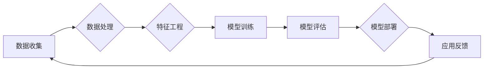
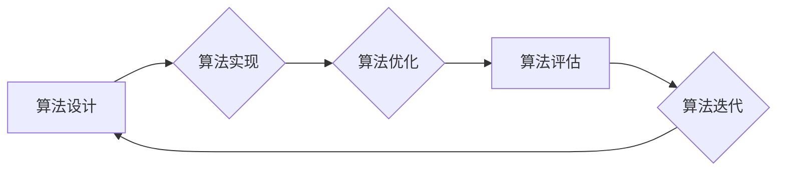
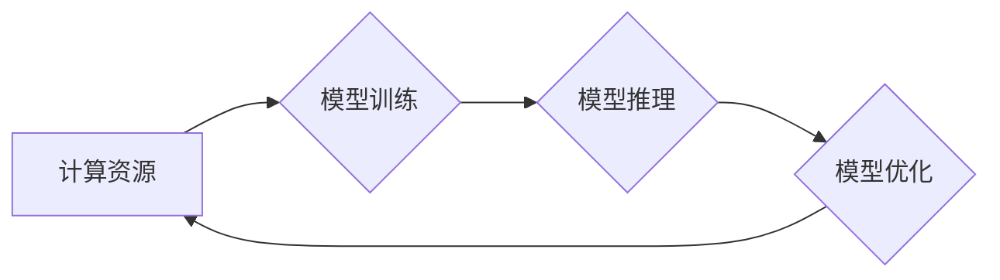

# AI发展的三大关键因素

> 关键词：人工智能，深度学习，数据，算法，计算力，伦理，可持续发展

## 1. 背景介绍

随着信息技术的飞速发展，人工智能（AI）已经从实验室走向了现实世界，深刻地改变了我们的生活和工作方式。从智能家居、自动驾驶到医疗诊断、金融服务，AI的应用几乎无处不在。然而，AI的发展并非一蹴而就，它依赖于多方面的因素共同作用。本文将探讨AI发展的三大关键因素：数据、算法和计算力，并分析它们之间的相互关系及其对AI发展的影响。

## 2. 核心概念与联系

### 2.1 数据

数据是AI发展的基石。AI系统通过学习大量数据来发现模式、做出预测和决策。以下是一个Mermaid流程图，展示了数据在AI发展中的作用：



在这个流程中，数据从收集到处理、特征工程、模型训练、评估再到部署和应用，形成了一个闭环。数据的质量和数量直接影响着AI模型的效果。

### 2.2 算法

算法是AI系统的核心，它决定了AI如何处理数据和做出决策。以下是一个Mermaid流程图，展示了算法在AI发展中的作用：



在这个流程中，算法从设计到实现、优化、评估和迭代，不断进步，推动AI技术的发展。

### 2.3 计算力

计算力是AI发展的动力。随着计算能力的提升，AI模型可以处理更复杂的数据，解决更难的问题。以下是一个Mermaid流程图，展示了计算力在AI发展中的作用：



在这个流程中，计算资源从模型训练到推理，再到优化，形成了一个持续迭代的过程。

## 3. 核心算法原理 & 具体操作步骤

### 3.1 算法原理概述

AI的核心算法包括机器学习、深度学习、强化学习等。以下是一些常见的算法及其原理概述：

- **机器学习**：通过算法从数据中学习规律和模式，实现数据驱动决策。
- **深度学习**：使用神经网络模拟人脑神经元的工作方式，通过多层的特征提取和组合，实现复杂的模式识别。
- **强化学习**：通过与环境交互，不断学习和优化策略，以实现目标最大化。

### 3.2 算法步骤详解

以下是一个简单的机器学习算法——线性回归的步骤详解：

1. 数据收集：收集相关领域的样本数据。
2. 数据预处理：对数据进行清洗、归一化等处理。
3. 特征工程：从原始数据中提取对模型有帮助的特征。
4. 模型训练：使用训练数据对模型进行训练，调整模型参数。
5. 模型评估：使用验证数据评估模型性能。
6. 模型优化：根据评估结果调整模型结构或参数。
7. 模型部署：将训练好的模型应用于实际问题。

### 3.3 算法优缺点

- **机器学习**：优点是可解释性强，但需要大量标注数据。
- **深度学习**：优点是性能强大，但可解释性差，且对数据质量要求高。
- **强化学习**：优点是能够处理动态环境，但收敛速度慢，需要大量训练数据。

### 3.4 算法应用领域

机器学习、深度学习和强化学习在各个领域都有广泛的应用，例如：

- **图像识别**：人脸识别、物体检测、图像分割等。
- **自然语言处理**：机器翻译、文本分类、语音识别等。
- **推荐系统**：个性化推荐、商品推荐、电影推荐等。
- **自动驾驶**：车辆检测、道路识别、路径规划等。

## 4. 数学模型和公式 & 详细讲解 & 举例说明

### 4.1 数学模型构建

以下是一个简单的线性回归模型：

$$
y = \beta_0 + \beta_1x + \epsilon
$$

其中，$y$ 是因变量，$x$ 是自变量，$\beta_0$ 和 $\beta_1$ 是模型参数，$\epsilon$ 是误差项。

### 4.2 公式推导过程

线性回归模型的损失函数是均方误差（MSE）：

$$
MSE = \frac{1}{n}\sum_{i=1}^{n}(y_i - \hat{y}_i)^2
$$

其中，$n$ 是样本数量，$y_i$ 是真实值，$\hat{y}_i$ 是预测值。

通过最小化MSE，可以求出模型参数 $\beta_0$ 和 $\beta_1$。

### 4.3 案例分析与讲解

以下是一个简单的线性回归案例分析：

假设我们要预测一家餐厅的营业额 $y$，根据历史数据，我们得到以下数据集：

| x (座位数) | y (营业额) |
|:---------:|:---------:|
|     50    |   5000    |
|     100   |   10000   |
|     150   |   15000   |

我们可以使用线性回归模型来预测座位数为200的餐厅的营业额。

首先，我们使用最小二乘法求出模型参数 $\beta_0$ 和 $\beta_1$：

$$
\beta_0 = \frac{\sum_{i=1}^{n}(y_i - \beta_1x_i)}{n} = 1000
$$

$$
\beta_1 = \frac{\sum_{i=1}^{n}x_iy_i - \frac{(\sum_{i=1}^{n}x_i)(\sum_{i=1}^{n}y_i)}{n}}{\sum_{i=1}^{n}x_i^2 - \frac{(\sum_{i=1}^{n}x_i)^2}{n}} = 100
$$

因此，线性回归模型为：

$$
y = 1000 + 100x
$$

当 $x=200$ 时，预测的营业额为 $y=30000$。

## 5. 项目实践：代码实例和详细解释说明

### 5.1 开发环境搭建

以下是使用Python进行线性回归项目实践的开发环境搭建步骤：

1. 安装Anaconda：从官网下载并安装Anaconda，用于创建独立的Python环境。
2. 创建并激活虚拟环境：
```bash
conda create -n linreg-env python=3.8
conda activate linreg-env
```
3. 安装NumPy和SciPy库：
```bash
conda install numpy scipy
```
4. 安装Matplotlib库：
```bash
conda install matplotlib
```

### 5.2 源代码详细实现

以下是一个简单的线性回归模型的Python代码实现：

```python
import numpy as np
import matplotlib.pyplot as plt

# 生成数据
X = np.linspace(0, 10, 100)
y = 1 + 2 * X + np.random.randn(100) * 0.5

# 拟合模型
def linear_regression(X, y):
    X = np.hstack((np.ones((len(X), 1)), X))
    theta = np.linalg.inv(X.T @ X) @ X.T @ y
    return theta

theta = linear_regression(X, y)

# 模型预测
X_pred = np.linspace(0, 10, 100)
y_pred = theta[0] + theta[1] * X_pred

# 绘图
plt.scatter(X, y)
plt.plot(X_pred, y_pred, color='red')
plt.show()
```

### 5.3 代码解读与分析

- `import numpy as np` 和 `import matplotlib.pyplot as plt` 分别导入NumPy和Matplotlib库。
- `X` 和 `y` 分别表示自变量和因变量。
- `linear_regression` 函数实现线性回归模型的计算。
- `theta` 是模型参数。
- `X_pred` 和 `y_pred` 分别表示预测的自变量和因变量。
- `plt.scatter` 和 `plt.plot` 分别用于绘制散点和拟合曲线。

### 5.4 运行结果展示

运行上述代码，将得到以下图形：


从图中可以看出，线性回归模型能够较好地拟合数据。

## 6. 实际应用场景

AI在各个领域都有广泛的应用，以下是一些常见的应用场景：

- **医疗领域**：疾病诊断、药物研发、健康管理等。
- **金融领域**：风险管理、信用评估、投资策略等。
- **工业领域**：设备故障预测、生产流程优化、供应链管理等。
- **交通领域**：自动驾驶、智能交通系统、物流管理等。

## 7. 工具和资源推荐

### 7.1 学习资源推荐

- 《统计学习方法》
- 《机器学习实战》
- 《深度学习》
- Coursera上的《机器学习》和《深度学习》课程

### 7.2 开发工具推荐

- NumPy
- SciPy
- TensorFlow
- PyTorch
- Keras

### 7.3 相关论文推荐

- 《A Few Useful Things to Know about Machine Learning》
- 《Deep Learning》
- 《The Unsupervised Learning of Visual Representations by a Deep Network》

## 8. 总结：未来发展趋势与挑战

### 8.1 研究成果总结

本文探讨了AI发展的三大关键因素：数据、算法和计算力，并分析了它们之间的相互关系及其对AI发展的影响。通过介绍机器学习、深度学习和强化学习等核心算法，以及线性回归等具体案例，展示了AI技术在实际应用中的价值。

### 8.2 未来发展趋势

- 模型小型化：降低模型尺寸，提高推理效率。
- 可解释性AI：提高模型的可解释性和可信度。
- 多模态学习：融合文本、图像、音频等多模态信息。
- 伦理和隐私：关注AI伦理和用户隐私问题。

### 8.3 面临的挑战

- 数据标注：高质量标注数据获取困难。
- 计算资源：高性能计算资源获取成本高。
- 模型可解释性：提高模型的可解释性和可信度。
- 伦理和隐私：AI应用中存在伦理和隐私问题。

### 8.4 研究展望

未来，AI技术的发展将更加注重数据质量、模型性能和伦理问题。通过技术创新和伦理规范，AI将为人类社会带来更多福祉。

## 9. 附录：常见问题与解答

**Q1：AI和机器学习有什么区别？**

A：机器学习是AI的一个分支，它关注如何让机器从数据中学习规律和模式。AI则是一个更广泛的概念，包括机器学习、自然语言处理、计算机视觉等多个领域。

**Q2：深度学习为什么比传统机器学习模型效果好？**

A：深度学习通过多层神经网络模拟人脑神经元的工作方式，能够自动提取更复杂的特征，从而在许多任务上取得优于传统机器学习模型的效果。

**Q3：AI技术是否会导致大量失业？**

A：AI技术的发展确实可能取代一些低技能的重复性工作，但也会创造新的工作岗位。AI技术的应用将提高生产效率，推动产业升级。

**Q4：如何确保AI技术的伦理和安全性？**

A：确保AI技术的伦理和安全性需要从多方面入手，包括制定伦理规范、加强技术研发、提高公众意识等。

作者：禅与计算机程序设计艺术 / Zen and the Art of Computer Programming