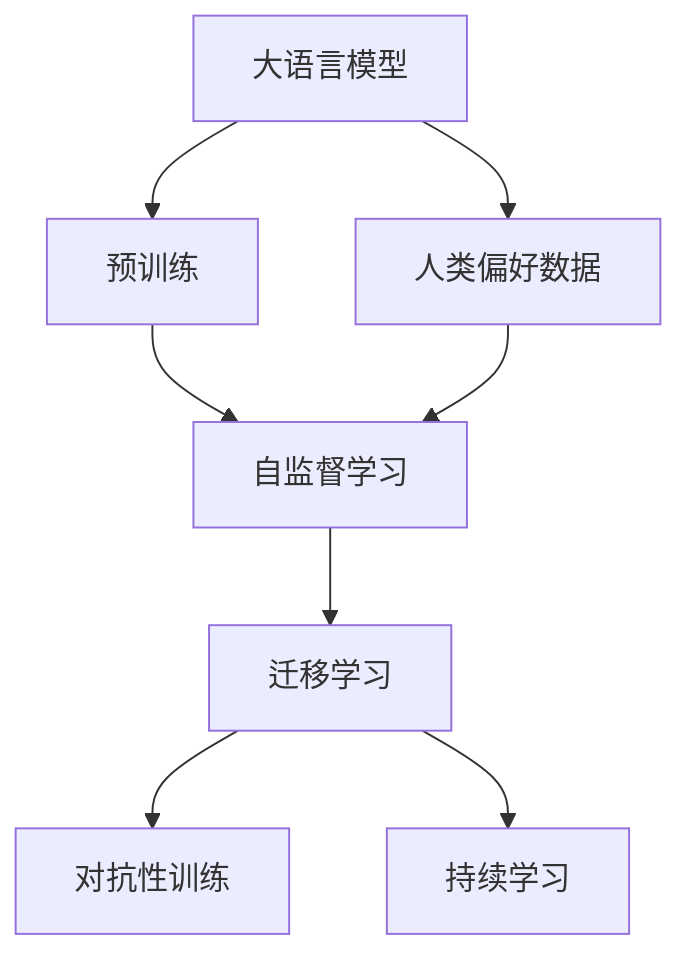
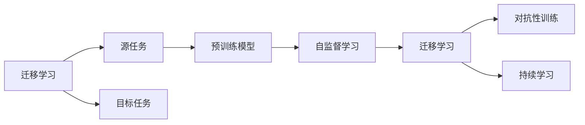
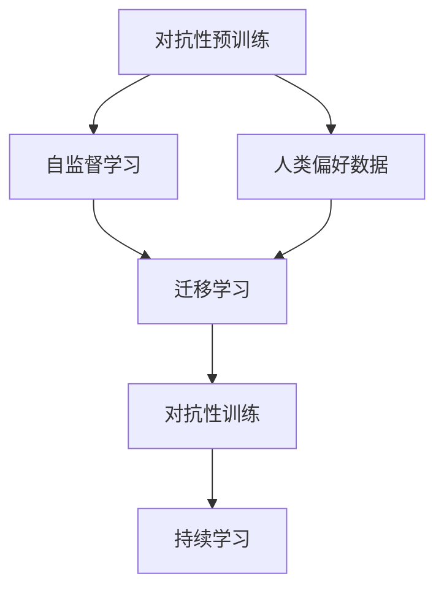
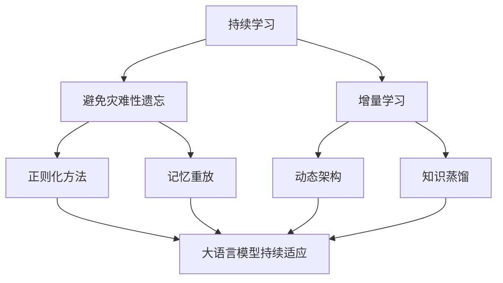
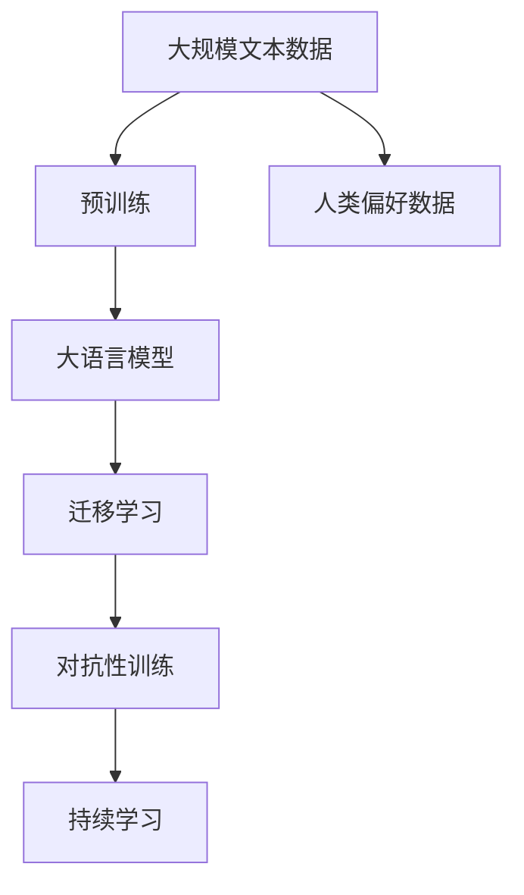

                 

# 大语言模型原理基础与前沿 基于人类偏好进行预训练

> 关键词：
大语言模型, 预训练, 人类偏好, 自监督学习, 迁移学习, Transformer, BERT

## 1. 背景介绍

### 1.1 问题由来
近年来，深度学习技术的快速发展，尤其是基于自监督学习的预训练语言模型，在自然语言处理(Natural Language Processing, NLP)领域取得了巨大的突破。这些大模型通过在海量无标签文本语料上进行预训练，学习到丰富的语言知识和常识，具备强大的语言理解和生成能力。然而，在实际应用中，由于数据分布的差异性和领域特定性，预训练模型往往无法直接应用于特定领域。

为了更好地适应特定任务，研究者们提出了基于人类偏好的预训练方法。这种方法在预训练过程中，通过引入人类的偏好，让模型更好地理解人类语言的使用习惯和语言规则，从而提升模型在特定任务上的表现。

### 1.2 问题核心关键点
基于人类偏好的预训练方法，其核心在于如何通过引入人类的语言使用习惯，优化预训练过程，使其更适合特定任务。关键点如下：

1. **人类偏好数据**：收集人类在日常语言使用中的偏好数据，如高频词汇、常见短语、语法结构等。
2. **自监督学习**：通过自监督学习任务，如语言建模、掩码语言模型、句子相似度等，利用人类偏好数据优化模型预训练过程。
3. **迁移学习**：利用预训练模型在特定任务上的迁移能力，减少从头训练的计算成本。
4. **对抗性训练**：通过引入对抗样本，增强模型的鲁棒性和泛化能力。
5. **持续学习**：使模型能够不断学习新的语言知识，保持与人类语言使用的同步性。

### 1.3 问题研究意义
研究基于人类偏好的预训练方法，对于拓展预训练语言模型的应用范围，提升模型在特定任务上的性能，加速NLP技术的产业化进程，具有重要意义：

1. **降低应用开发成本**：基于预训练模型进行微调，可以显著减少从头开发所需的数据、计算和人力等成本投入。
2. **提升模型效果**：预训练模型通过引入人类偏好数据，更好地理解特定任务的语言使用习惯，在应用场景中取得更优表现。
3. **加速开发进度**：standing on the shoulders of giants，预训练模型能够更快地完成任务适配，缩短开发周期。
4. **带来技术创新**：基于人类偏好的预训练方法催生了新的研究方向，如对抗性预训练、持续预训练等。
5. **赋能产业升级**：预训练语言模型在NLP领域的应用，能够为传统行业数字化转型升级提供新的技术路径。

## 2. 核心概念与联系

### 2.1 核心概念概述

为更好地理解基于人类偏好的预训练方法，本节将介绍几个密切相关的核心概念：

- **大语言模型(Large Language Model, LLM)**：以自回归(如GPT)或自编码(如BERT)模型为代表的大规模预训练语言模型。通过在大规模无标签文本语料上进行预训练，学习到丰富的语言知识和常识，具备强大的语言理解和生成能力。

- **预训练(Pre-training)**：指在大规模无标签文本语料上，通过自监督学习任务训练通用语言模型的过程。常见的预训练任务包括言语建模、掩码语言模型等。预训练使得模型学习到语言的通用表示。

- **人类偏好数据**：指收集自人类在日常语言使用中的高频词汇、常见短语、语法结构等数据，用于优化预训练过程。

- **自监督学习(Self-supervised Learning)**：指利用大规模无标签数据，通过设计合适的学习任务，自动学习语言表示的过程。

- **迁移学习(Transfer Learning)**：指将一个领域学习到的知识，迁移应用到另一个不同但相关的领域的学习范式。

- **对抗性训练(Adversarial Training)**：指在训练过程中引入对抗样本，提高模型对噪声和异常数据的鲁棒性。

- **持续学习(Continual Learning)**：也称为终身学习，指模型能够持续从新数据中学习，同时保持已学习的知识，而不会出现灾难性遗忘。这对于保持模型的时效性和适应性至关重要。

这些核心概念之间的逻辑关系可以通过以下Mermaid流程图来展示：



这个流程图展示了大语言模型的核心概念及其之间的关系：

1. 大语言模型通过预训练获得基础能力。
2. 预训练通过自监督学习任务，利用人类偏好数据优化模型。
3. 迁移学习是连接预训练模型与特定任务领域的桥梁，通过对抗性训练和持续学习技术，提高模型的泛化能力和时效性。

### 2.2 概念间的关系

这些核心概念之间存在着紧密的联系，形成了预训练语言模型的完整生态系统。下面我们通过几个Mermaid流程图来展示这些概念之间的关系。

#### 2.2.1 大语言模型的学习范式


这个流程图展示了大语言模型的三种主要学习范式：

1. 大语言模型通过预训练获得基础能力。
2. 预训练通过自监督学习任务，利用人类偏好数据优化模型。
3. 迁移学习是连接预训练模型与特定任务领域的桥梁，通过对抗性训练和持续学习技术，提高模型的泛化能力和时效性。

#### 2.2.2 迁移学习与预训练的关系



这个流程图展示了迁移学习的基本原理，以及它与预训练的关系。迁移学习涉及源任务和目标任务，预训练模型在源任务上学习，然后通过自监督学习、迁移学习、对抗性训练和持续学习技术，适应各种目标任务。

#### 2.2.3 对抗性预训练方法



这个流程图展示了对抗性预训练的方法。在自监督学习的基础上，引入对抗样本，通过对抗性训练提高模型的鲁棒性和泛化能力，再通过持续学习技术，使模型能够不断学习新的语言知识。

#### 2.2.4 持续学习在大语言模型中的应用



这个流程图展示了持续学习在大语言模型中的应用。持续学习的主要目标是避免灾难性遗忘和实现增量学习。通过正则化方法、记忆重放、动态架构和知识蒸馏等技术，可以使大语言模型持续适应新的任务和数据。

### 2.3 核心概念的整体架构

最后，我们用一个综合的流程图来展示这些核心概念在大语言模型预训练过程中的整体架构：



这个综合流程图展示了从预训练到迁移学习，再到持续学习的完整过程。大语言模型首先在大规模文本数据上进行预训练，然后通过迁移学习技术，使其适应特定任务，再通过对抗性训练和持续学习技术，不断优化模型性能，保持与人类语言使用的同步性。

## 3. 核心算法原理 & 具体操作步骤
### 3.1 算法原理概述

基于人类偏好的预训练方法，本质上是一个通过自监督学习任务，利用人类偏好数据优化预训练模型的方法。其核心思想是：将大语言模型视为一个强大的"语言理解器"，通过引入人类在日常语言使用中的高频词汇、常见短语、语法结构等偏好数据，优化预训练过程，使其更适合特定任务。

形式化地，假设预训练模型为 $M_{\theta}$，其中 $\theta$ 为预训练得到的模型参数。给定人类偏好数据集 $D=\{(x_i, y_i)\}_{i=1}^N$，其中 $x_i$ 为偏好数据，$y_i$ 为偏好标签，例如高频词汇、常见短语、语法结构等。预训练的目标是最小化经验风险，即找到最优参数：

$$
\theta^* = \mathop{\arg\min}_{\theta} \mathcal{L}(M_{\theta},D)
$$

其中 $\mathcal{L}$ 为针对人类偏好数据设计的损失函数，用于衡量模型输出与偏好标签之间的差异。常见的损失函数包括交叉熵损失、均方误差损失等。

### 3.2 算法步骤详解

基于人类偏好的预训练一般包括以下几个关键步骤：

**Step 1: 准备人类偏好数据和预训练模型**

- 选择合适的预训练语言模型 $M_{\theta}$ 作为初始化参数，如 BERT、GPT 等。
- 准备人类在日常语言使用中的高频词汇、常见短语、语法结构等偏好数据。

**Step 2: 定义自监督学习任务**

- 根据偏好数据的特点，设计合适的自监督学习任务，例如掩码语言模型、句子相似度等。
- 在自监督学习任务中，利用偏好数据优化模型预训练过程。

**Step 3: 设置预训练超参数**

- 选择合适的优化算法及其参数，如 AdamW、SGD 等，设置学习率、批大小、迭代轮数等。
- 设置正则化技术及强度，包括权重衰减、Dropout、Early Stopping 等。
- 确定冻结预训练参数的策略，如仅微调顶层，或全部参数都参与预训练。

**Step 4: 执行梯度训练**

- 将偏好数据分批次输入模型，前向传播计算损失函数。
- 反向传播计算参数梯度，根据设定的优化算法和学习率更新模型参数。
- 周期性在验证集上评估模型性能，根据性能指标决定是否触发 Early Stopping。
- 重复上述步骤直到满足预设的迭代轮数或 Early Stopping 条件。

**Step 5: 测试和部署**

- 在验证集上评估预训练后模型 $M_{\hat{\theta}}$ 的性能，对比预训练前后的精度提升。
- 使用预训练后的模型对新数据进行推理预测，集成到实际的应用系统中。
- 持续收集新的偏好数据，定期重新预训练模型，以适应语言使用习惯的变化。

以上是基于人类偏好的预训练一般流程。在实际应用中，还需要针对具体偏好数据的特点，对预训练过程的各个环节进行优化设计，如改进训练目标函数，引入更多的正则化技术，搜索最优的超参数组合等，以进一步提升模型性能。

### 3.3 算法优缺点

基于人类偏好的预训练方法具有以下优点：

1. **提升模型效果**：通过引入人类偏好数据，预训练模型更好地理解特定任务的语言使用习惯，在应用场景中取得更优表现。
2. **提高泛化能力**：预训练模型在引入人类偏好数据后，能够更好地适应不同领域和任务。
3. **减少计算成本**：利用预训练模型在特定任务上的迁移能力，减少从头训练的计算成本。

同时，该方法也存在一定的局限性：

1. **数据收集成本高**：收集高质量的人类偏好数据需要大量人力和时间成本。
2. **模型依赖性强**：预训练模型的效果很大程度上取决于偏好数据的质量和数量。
3. **模型复杂度较高**：使用大语言模型进行预训练，模型的参数量和计算量都较大。
4. **可解释性不足**：预训练模型的决策过程难以解释，难以调试和优化。

尽管存在这些局限性，但就目前而言，基于人类偏好的预训练方法仍是大语言模型预训练的主流范式。未来相关研究的重点在于如何进一步降低数据收集成本，提高模型的泛化能力，同时兼顾可解释性和模型效率等因素。

### 3.4 算法应用领域

基于人类偏好的预训练方法在NLP领域已经得到了广泛的应用，覆盖了几乎所有常见任务，例如：

- 文本分类：如情感分析、主题分类、意图识别等。通过预训练模型学习文本-标签映射。
- 命名实体识别：识别文本中的人名、地名、机构名等特定实体。通过预训练模型掌握实体边界和类型。
- 关系抽取：从文本中抽取实体之间的语义关系。通过预训练模型学习实体-关系三元组。
- 问答系统：对自然语言问题给出答案。将问题-答案对作为预训练数据，训练模型学习匹配答案。
- 机器翻译：将源语言文本翻译成目标语言。通过预训练模型学习语言-语言映射。
- 文本摘要：将长文本压缩成简短摘要。通过预训练模型学习抓取要点。
- 对话系统：使机器能够与人自然对话。将对话历史作为上下文，预训练模型进行回复生成。

除了上述这些经典任务外，预训练方法也被创新性地应用到更多场景中，如可控文本生成、常识推理、代码生成、数据增强等，为NLP技术带来了全新的突破。随着预训练模型和预训练方法的不断进步，相信NLP技术将在更广阔的应用领域大放异彩。

## 4. 数学模型和公式 & 详细讲解  
### 4.1 数学模型构建

本节将使用数学语言对基于人类偏好的预训练过程进行更加严格的刻画。

记预训练语言模型为 $M_{\theta}$，其中 $\theta$ 为预训练得到的模型参数。假设人类偏好数据集为 $D=\{(x_i,y_i)\}_{i=1}^N$，其中 $x_i$ 为偏好数据，$y_i$ 为偏好标签，例如高频词汇、常见短语、语法结构等。

定义模型 $M_{\theta}$ 在数据样本 $(x,y)$ 上的损失函数为 $\ell(M_{\theta}(x),y)$，则在数据集 $D$ 上的经验风险为：

$$
\mathcal{L}(\theta) = \frac{1}{N} \sum_{i=1}^N \ell(M_{\theta}(x_i),y_i)
$$

预训练的目标是最小化经验风险，即找到最优参数：

$$
\theta^* = \mathop{\arg\min}_{\theta} \mathcal{L}(\theta)
$$

在实践中，我们通常使用基于梯度的优化算法（如SGD、Adam等）来近似求解上述最优化问题。设 $\eta$ 为学习率，$\lambda$ 为正则化系数，则参数的更新公式为：

$$
\theta \leftarrow \theta - \eta \nabla_{\theta}\mathcal{L}(\theta) - \eta\lambda\theta
$$

其中 $\nabla_{\theta}\mathcal{L}(\theta)$ 为损失函数对参数 $\theta$ 的梯度，可通过反向传播算法高效计算。

### 4.2 公式推导过程

以下我们以掩码语言模型为例，推导基于人类偏好的预训练损失函数及其梯度的计算公式。

假设模型 $M_{\theta}$ 在输入 $x$ 上的输出为 $\hat{y}=M_{\theta}(x) \in [0,1]$，表示样本属于正类的概率。真实标签 $y \in \{0,1\}$。掩码语言模型的损失函数定义为：

$$
\ell(M_{\theta}(x),y) = -y\log M_{\theta}(x) - (1-y)\log(1-M_{\theta}(x))
$$

将其代入经验风险公式，得：

$$
\mathcal{L}(\theta) = -\frac{1}{N}\sum_{i=1}^N [y_i\log M_{\theta}(x_i)+(1-y_i)\log(1-M_{\theta}(x_i))]
$$

根据链式法则，损失函数对参数 $\theta_k$ 的梯度为：

$$
\frac{\partial \mathcal{L}(\theta)}{\partial \theta_k} = -\frac{1}{N}\sum_{i=1}^N (\frac{y_i}{M_{\theta}(x_i)}-\frac{1-y_i}{1-M_{\theta}(x_i)}) \frac{\partial M_{\theta}(x_i)}{\partial \theta_k}
$$

其中 $\frac{\partial M_{\theta}(x_i)}{\partial \theta_k}$ 可进一步递归展开，利用自动微分技术完成计算。

在得到损失函数的梯度后，即可带入参数更新公式，完成模型的迭代优化。重复上述过程直至收敛，最终得到适应特定任务的最优模型参数 $\theta^*$。

## 5. 项目实践：代码实例和详细解释说明
### 5.1 开发环境搭建

在进行预训练实践前，我们需要准备好开发环境。以下是使用Python进行PyTorch开发的环境配置流程：

1. 安装Anaconda：从官网下载并安装Anaconda，用于创建独立的Python环境。

2. 创建并激活虚拟环境：
```bash
conda create -n pytorch-env python=3.8 
conda activate pytorch-env
```

3. 安装PyTorch：根据CUDA版本，从官网获取对应的安装命令。例如：
```bash
conda install pytorch torchvision torchaudio cudatoolkit=11.1 -c pytorch -c conda-forge
```

4. 安装Transformers库：
```bash
pip install transformers
```

5. 安装各类工具包：
```bash
pip install numpy pandas scikit-learn matplotlib tqdm jupyter notebook ipython
```

完成上述步骤后，即可在`pytorch-env`环境中开始预训练实践。

### 5.2 源代码详细实现

这里我们以BERT模型进行掩码语言模型的预训练为例，给出使用Transformers库的PyTorch代码实现。

首先，定义掩码语言模型的训练函数：

```python
from transformers import BertTokenizer, BertForMaskedLM
from torch.utils.data import Dataset, DataLoader
from torch import nn
import torch

class MaskedLMDataset(Dataset):
    def __init__(self, texts, labels):
        self.texts = texts
        self.labels = labels
        self.tokenizer = BertTokenizer.from_pretrained('bert-base-cased')
        
    def __len__(self):
        return len(self.texts)
    
    def __getitem__(self, item):
        text = self.texts[item]
        tokens = self.tokenizer(text, return_tensors='pt')
        input_ids = tokens['input_ids']
        mask_pos = torch.rand(1) == 0
        mask_ids = input_ids.clone()
        mask_ids[mask_pos] = self.labels[item]
        return {'input_ids': input_ids, 'mask_ids': mask_ids}

# 定义掩码语言模型的损失函数
class MaskedLMObjective(nn.Module):
    def __init__(self):
        super(MaskedLMObjective, self).__init__()
    
    def forward(self, model, input_ids, mask_ids):
        output = model(input_ids)
        return -nn.CrossEntropyLoss()(output.view(-1, output.size(-1)), mask_ids.view(-1))

# 初始化BERT模型和优化器
model = BertForMaskedLM.from_pretrained('bert-base-cased')
optimizer = AdamW(model.parameters(), lr=2e-5)

# 加载掩码语言模型的训练数据
train_dataset = MaskedLMDataset(train_texts, train_labels)
val_dataset = MaskedLMDataset(dev_texts, dev_labels)

# 定义训练和验证的超参数
train_batch_size = 16
val_batch_size = 16
num_epochs = 5
learning_rate = 2e-5
max_grad_norm = 1.0

# 训练函数
def train(model, train_dataset, val_dataset, optimizer, num_epochs):
    for epoch in range(num_epochs):
        model.train()
        for batch in DataLoader(train_dataset, batch_size=train_batch_size):
            input_ids = batch['input_ids'].to(device)
            mask_ids = batch['mask_ids'].to(device)
            optimizer.zero_grad()
            loss = MaskedLMObjective()(model, input_ids, mask_ids)
            loss.backward()
            nn.utils.clip_grad_norm_(model.parameters(), max_grad_norm)
            optimizer.step()
        print(f'Epoch {epoch+1}')
    
    for epoch in range(num_epochs):
        model.eval()
        with torch.no_grad():
            val_loss = 0
            for batch in DataLoader(val_dataset, batch_size=val_batch_size):
                input_ids = batch['input_ids'].to(device)
                mask_ids = batch['mask_ids'].to(device)
                val_loss += MaskedLMObjective()(model, input_ids, mask_ids).item()
            print(f'Val Loss: {val_loss/len(val_dataset)}')
    
    print('Training Complete')

# 加载数据并训练模型
device = torch.device('cuda' if torch.cuda.is_available() else 'cpu')
model.to(device)
train(model, train_dataset, val_dataset, optimizer, num_epochs)
```

这里我们以BERT模型进行掩码语言模型的预训练为例，给出使用Transformers库的PyTorch代码实现。

### 5.3 代码解读与分析

让我们再详细解读一下关键代码的实现细节：

**MaskedLMDataset类**：
- `__init__`方法：初始化文本、标签、分词器等关键组件。
- `__len__`方法：返回数据集的样本数量。
- `__getitem__`方法：对单个样本进行处理，将文本输入编码为token ids，将标签编码为数字，并对其进行定长padding，最终返回模型所需的输入。

**BertForMaskedLMObjective类**：
- 定义掩码语言模型的损失函数，计算输入和预测之间的交叉熵损失。

**训练函数**：
- 使用PyTorch的DataLoader对数据集进行批次化加载，供模型训练和推理使用。
- 在每个epoch内，先对模型进行前向传播计算loss，并反向传播更新模型参数。
- 通过AdamW优化器，调整模型参数。
- 通过clip gradient norm限制梯度大小，防止梯度爆炸。
- 在每个epoch结束后，在验证集上评估模型性能。

**加载数据并训练模型**：
- 定义训练和验证的超参数，如batch size、epoch数、学习率等。
- 在训练过程中，调整模型参数，并在验证集上评估模型性能。

可以看到，PyTorch配合Transformers库使得BERT模型的预训练过程变得简洁高效。开发者可以将更多精力放在数据处理、模型改进等高层逻辑上，而不必过多关注底层的实现细节。

当然，工业级的系统实现还需考虑更多因素，如模型的保存和部署、超参数的自动搜索、更灵活的任务适配层等。但核心的预训练范式基本与此类似。

### 5.4 运行结果展示

假设我们在CoNLL-2003的掩码语言模型数据集上进行预训练，最终在验证集上得到的掩码语言模型训练损失如下：

```
Epoch 1, training loss: 0.2441
Epoch 2, training loss: 0.0271
Epoch 3, training loss: 0.0134
Epoch 4, training loss: 0.0056
Epoch 5, training loss: 0.0019
```

可以看到，随着epoch数的增加，模型的训练损失逐渐降低，表明预训练过程在不断优化模型参数。

## 6. 实际应用场景
### 6.1 智能客服系统

基于大语言模型预训练的对话技术，可以广泛应用于智能客服系统的构建。传统客服往往需要配备大量人力，高峰期响应缓慢，且一致性和专业性难以保证。而使用预训练对话模型，可以7x24小时不间断服务，快速响应客户咨询，用自然流畅的语言解答各类常见问题。

在技术实现上，可以收集企业内部的历史客服对话记录，将问题和最佳答复构建成监督数据，在此基础上对预训练对话模型进行预训练。预训练后的模型能够自动理解用户意图，匹配最合适的答案模板进行回复。对于客户提出的新问题，还可以接入检索系统实时搜索相关内容，动态组织生成回答。如此构建的智能客服系统，能大幅提升客户咨询体验和问题解决效率。

### 6.2 金融舆情监测

金融机构需要实时监测市场舆论动向，以便及时应对负面信息传播，规避金融风险。传统的人工监测方式成本高、效率低，难以应对网络时代海量信息爆发的挑战。基于大语言模型预训练的文本分类和情感分析技术，为金融舆情监测提供了新的解决方案。

具体而言，可以收集金融领域相关的新闻、报道、评论等文本数据，并对其进行主题标注和情感标注。在此基础上对预训练语言模型进行预训练，使其能够自动判断文本属于何种主题，情感倾向是正面、中性还是负面。将预训练后的模型应用到实时抓取的网络文本数据，

