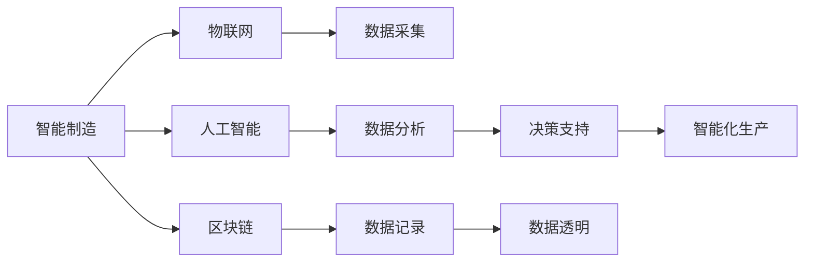
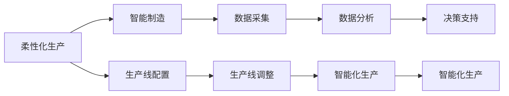
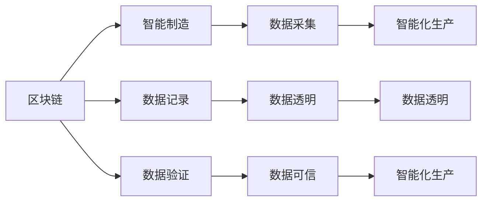
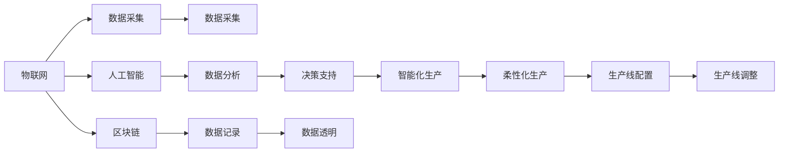

                 

# 未来的智能制造：2050年的区块链智能制造与柔性化生产

> 关键词：智能制造,区块链,柔性化生产,物联网(IoT),自动化,人工智能(AI),机器学习(ML),机器人,数字化转型

## 1. 背景介绍

### 1.1 问题由来
随着全球经济的发展和人口老龄化的加剧，制造业面临着前所未有的挑战。传统的制造模式已经难以满足日益增长的个性化、定制化需求。如何在提高生产效率的同时，实现柔性化生产，成为制造业转型升级的关键问题。

近年来，随着人工智能、物联网、区块链等技术的迅速发展，智能制造（Industrial Internet of Things, IIoT）和柔性化生产（Flexible Manufacturing Systems, FMS）成为了制造业转型的新方向。特别是基于区块链的智能制造，因其去中心化、透明、可追溯等特点，正在逐步成为推动制造业数字化转型的重要力量。

### 1.2 问题核心关键点
智能制造与柔性化生产的核心目标是通过先进技术手段，实现制造过程的自动化、数字化、智能化，从而提高生产效率、降低成本、提高产品质量。区块链技术的引入，则进一步增强了数据的安全性和透明度，为智能制造的实践提供了新的保障。

智能制造的实现方式包括：
- 物联网（IoT）技术：通过传感器、智能设备等采集和传输生产数据。
- 人工智能（AI）技术：使用机器学习、深度学习等技术进行数据分析和决策支持。
- 区块链技术：通过分布式账本记录和追溯生产数据，确保数据的真实性和不可篡改性。

柔性化生产则主要体现在生产线的灵活配置和快速调整上，以适应不同产品的生产需求。

### 1.3 问题研究意义
研究和探索基于区块链的智能制造与柔性化生产，对于提升制造业的竞争力，推动传统行业向高技术、高附加值方向转型具有重要意义：

1. 提高生产效率。通过自动化、智能化手段，实现生产线的快速响应和调整，大幅提升生产效率。
2. 降低生产成本。利用数据分析优化资源配置，降低能源、材料等成本。
3. 提高产品质量。通过实时监控和反馈，及时发现和修正生产中的问题，提升产品质量。
4. 增强数据安全性。通过区块链技术，确保生产数据的安全性和透明性，防止数据泄露和篡改。
5. 推动数字化转型。通过物联网、人工智能、区块链等技术的集成应用，实现制造业的全方位数字化和智能化。

## 2. 核心概念与联系

### 2.1 核心概念概述

为更好地理解区块链智能制造与柔性化生产，本节将介绍几个关键概念：

- 智能制造（IIoT）：通过物联网技术采集生产数据，结合人工智能技术进行数据分析和决策，实现制造过程的自动化、智能化。
- 柔性化生产（FMS）：通过灵活配置和快速调整生产线，适应不同产品的生产需求，实现高效的生产模式。
- 区块链技术：通过分布式账本记录和验证生产数据，确保数据的透明性和不可篡改性，增强数据的可信度。
- 物联网（IoT）：通过传感器、智能设备等采集生产现场数据，实现设备的互联互通。
- 人工智能（AI）：通过机器学习、深度学习等技术进行数据分析和决策支持。

这些概念之间的关系可以通过以下Mermaid流程图来展示：



这个流程图展示了大语言模型微调过程中各个关键概念的关系和作用：

1. 智能制造（IIoT）以物联网技术为基础，通过采集和传输生产数据，实现设备互联和信息共享。
2. 柔性化生产（FMS）利用AI技术进行数据分析和决策支持，实现生产线的灵活配置和快速调整。
3. 区块链技术通过记录和验证生产数据，确保数据的真实性和透明性。
4. 数据采集、数据分析和数据记录等环节共同构建了智能制造的数据基础。
5. 决策支持和智能化生产等环节进一步发挥数据的价值，推动制造过程的自动化和智能化。

### 2.2 概念间的关系

这些核心概念之间存在着紧密的联系，形成了智能制造与柔性化生产的完整生态系统。下面我通过几个Mermaid流程图来展示这些概念之间的关系。

#### 2.2.1 智能制造的整体架构


这个流程图展示了智能制造的整体架构。物联网技术采集生产数据，人工智能技术进行数据分析和决策支持，区块链技术记录和验证生产数据，共同构建智能制造的基础设施。

#### 2.2.2 柔性化生产与智能制造的关系



这个流程图展示了柔性化生产与智能制造的关系。柔性化生产通过灵活配置和快速调整生产线，实现生产线的柔性化和智能化。智能制造利用数据分析和决策支持，进一步提升生产线的自动化和智能化水平。

#### 2.2.3 区块链在智能制造中的应用



这个流程图展示了区块链在智能制造中的应用。区块链技术通过记录和验证生产数据，确保数据的真实性和可信度，进一步增强智能制造的数据基础。

### 2.3 核心概念的整体架构

最后，我们用一个综合的流程图来展示这些核心概念在大语言模型微调过程中的整体架构：



这个综合流程图展示了从物联网数据采集到柔性化生产实现的完整过程。物联网技术采集生产数据，人工智能技术进行数据分析和决策支持，区块链技术记录和验证生产数据，共同构建智能制造的基础设施，并通过生产线配置和调整实现柔性化生产。

## 3. 核心算法原理 & 具体操作步骤
### 3.1 算法原理概述

基于区块链的智能制造与柔性化生产，本质上是一个数据驱动的自动化、智能化生产过程。其核心思想是：通过物联网技术采集生产数据，结合区块链技术进行数据记录和验证，利用人工智能技术进行数据分析和决策支持，最终实现生产线的自动化和智能化。

形式化地，假设智能制造系统为 $S_{\theta}$，其中 $\theta$ 为系统参数。给定生产线 $P$ 的柔性配置和调整策略，通过物联网设备采集生产数据 $D_P$，利用区块链技术记录和验证数据 $R_D$，结合人工智能算法 $\mathcal{A}$ 进行分析处理，得到决策支持 $D_S$。最终目标是最小化生产成本和最大化生产效率：

$$
\theta^* = \mathop{\arg\min}_{\theta} \left( \mathcal{L}_D(\theta) + \mathcal{L}_S(\theta) \right)
$$

其中 $\mathcal{L}_D$ 为数据记录和验证的损失函数，$\mathcal{L}_S$ 为决策支持和生产效率的损失函数。

通过梯度下降等优化算法，智能制造系统不断更新参数 $\theta$，最小化损失函数，优化生产过程。由于 $\theta$ 已经通过区块链技术获得了可信的数据基础，因此即便在柔性生产过程中，也能快速响应和调整，确保生产效率和数据安全。

### 3.2 算法步骤详解

基于区块链的智能制造与柔性化生产一般包括以下几个关键步骤：

**Step 1: 准备生产数据**
- 部署物联网设备，采集生产线上的实时数据。
- 使用区块链技术记录生产数据，确保数据的透明性和可信度。
- 数据采集和记录完成后，通过网络传输到人工智能处理系统。

**Step 2: 数据预处理与分析**
- 对采集到的数据进行预处理，去除噪声和异常值，进行数据清洗和归一化。
- 利用人工智能算法对数据进行分析，提取有用的特征，如生产效率、能耗、设备状态等。
- 利用机器学习、深度学习等技术进行数据分析，构建预测模型，提供决策支持。

**Step 3: 柔性化生产调度**
- 根据决策支持结果，对生产线进行配置和调整，优化生产过程。
- 利用柔性制造系统（FMS），快速响应生产需求变化，实现生产线的柔性化。
- 实时监测生产过程，及时发现和修正问题，确保生产效率和产品质量。

**Step 4: 结果验证与优化**
- 利用区块链技术验证生产结果，确保数据的真实性和透明性。
- 根据生产结果，进一步优化生产线和数据分析模型，提升生产效率和数据安全性。
- 不断迭代优化，逐步提升智能制造系统的智能化水平。

### 3.3 算法优缺点

基于区块链的智能制造与柔性化生产方法具有以下优点：
1. 数据透明性高。区块链技术确保了生产数据的真实性和透明性，增强了数据可信度。
2. 生产过程可追溯。区块链技术可以记录生产全过程，便于事后追溯和审计。
3. 生产效率高。人工智能技术通过数据分析优化生产过程，实现高效的生产调度。
4. 数据安全性高。区块链技术防篡改、防抵赖，确保生产数据的安全性。

同时，该方法也存在以下局限性：
1. 初始投资大。部署物联网设备和区块链技术需要较高的初始投资。
2. 数据存储量大。生产数据需要存储在区块链上，对存储资源和带宽提出了较高要求。
3. 技术复杂度高。需要整合多种技术手段，技术实现复杂度较高。
4. 数据隐私问题。区块链技术去中心化记录数据，可能存在数据隐私泄露的风险。

尽管存在这些局限性，但就目前而言，基于区块链的智能制造方法仍是大规模生产数字化转型的重要方向。未来相关研究的重点在于如何进一步降低初始投资成本，优化数据存储方案，提高技术实现的可操作性，解决数据隐私问题，以进一步提升智能制造的普及度和应用效果。

### 3.4 算法应用领域

基于区块链的智能制造与柔性化生产方法，已经在诸多制造领域得到了广泛的应用，例如：

- 汽车制造：通过物联网技术采集车辆制造数据，结合区块链技术记录生产过程，利用人工智能进行质量控制和预测维护。
- 电子制造：利用物联网设备采集电子产品的生产数据，结合区块链技术记录供应链信息，利用人工智能进行流程优化和故障预测。
- 航空制造：通过物联网设备采集飞机制造数据，结合区块链技术记录生产过程，利用人工智能进行质量控制和安全监测。
- 食品制造：利用物联网设备采集食品生产数据，结合区块链技术记录供应链信息，利用人工智能进行食品安全监测和质量控制。
- 建筑制造：通过物联网设备采集建筑施工数据，结合区块链技术记录生产过程，利用人工智能进行进度控制和安全监测。

除了这些典型应用领域外，基于区块链的智能制造方法还在医药制造、化工制造、纺织制造等更多领域得到了探索和应用，为传统制造业的数字化转型带来了新的机遇和挑战。

## 4. 数学模型和公式 & 详细讲解  
### 4.1 数学模型构建

本节将使用数学语言对基于区块链的智能制造与柔性化生产过程进行更加严格的刻画。

假设智能制造系统为 $S_{\theta}$，其中 $\theta$ 为系统参数。生产线 $P$ 的柔性配置和调整策略为 $F_P$。给定生产数据 $D_P$ 和区块链记录数据 $R_D$，利用人工智能算法 $\mathcal{A}$ 进行数据分析，得到决策支持 $D_S$。智能制造系统的目标是最小化生产成本和最大化生产效率，其损失函数为：

$$
\mathcal{L}(\theta) = \lambda_D \mathcal{L}_D(\theta) + \lambda_S \mathcal{L}_S(\theta)
$$

其中 $\lambda_D$ 为数据记录和验证的损失函数权重，$\lambda_S$ 为决策支持和生产效率的损失函数权重。

根据区块链技术的特性，数据记录和验证的损失函数 $\mathcal{L}_D(\theta)$ 可以表示为：

$$
\mathcal{L}_D(\theta) = \frac{1}{N} \sum_{i=1}^N \left| R_D^i - D_P^i \right|
$$

其中 $N$ 为数据总数，$R_D^i$ 为第 $i$ 次记录的数据，$D_P^i$ 为第 $i$ 次采集的数据。

决策支持和生产效率的损失函数 $\mathcal{L}_S(\theta)$ 可以表示为：

$$
\mathcal{L}_S(\theta) = \frac{1}{N} \sum_{i=1}^N \left( \left| A_S^i - R_S^i \right| + \frac{1}{\sigma_S^i} \left( e^{-A_S^i} - 1 \right) \right)
$$

其中 $A_S^i$ 为第 $i$ 次人工智能算法的输出，$R_S^i$ 为第 $i$ 次实际的决策支持，$\sigma_S^i$ 为第 $i$ 次决策支持的可信度。

### 4.2 公式推导过程

以下我们以汽车制造中的智能制造系统为例，推导基于区块链的智能制造与柔性化生产模型的公式。

假设汽车制造系统 $S_{\theta}$ 由若干生产线 $P$ 组成，每个生产线 $P$ 的柔性配置和调整策略为 $F_P$。生产数据 $D_P$ 由物联网设备采集，区块链记录数据 $R_D$ 包括设备状态、生产工艺、物流信息等。利用人工智能算法 $\mathcal{A}$ 对数据进行分析，得到决策支持 $D_S$，包括生产任务调度、设备维护计划、质量控制等。生产系统的目标是最小化生产成本和最大化生产效率，其损失函数为：

$$
\mathcal{L}(\theta) = \lambda_D \mathcal{L}_D(\theta) + \lambda_S \mathcal{L}_S(\theta)
$$

其中 $\lambda_D$ 和 $\lambda_S$ 分别为损失函数权重。

根据区块链技术的特性，数据记录和验证的损失函数 $\mathcal{L}_D(\theta)$ 可以表示为：

$$
\mathcal{L}_D(\theta) = \frac{1}{N} \sum_{i=1}^N \left| R_D^i - D_P^i \right|
$$

其中 $N$ 为数据总数，$R_D^i$ 为第 $i$ 次记录的数据，$D_P^i$ 为第 $i$ 次采集的数据。

决策支持和生产效率的损失函数 $\mathcal{L}_S(\theta)$ 可以表示为：

$$
\mathcal{L}_S(\theta) = \frac{1}{N} \sum_{i=1}^N \left( \left| A_S^i - R_S^i \right| + \frac{1}{\sigma_S^i} \left( e^{-A_S^i} - 1 \right) \right)
$$

其中 $A_S^i$ 为第 $i$ 次人工智能算法的输出，$R_S^i$ 为第 $i$ 次实际的决策支持，$\sigma_S^i$ 为第 $i$ 次决策支持的可信度。

在得到损失函数后，我们可以利用梯度下降等优化算法，最小化损失函数，优化生产过程。具体步骤如下：

1. 部署物联网设备，采集生产线上的实时数据 $D_P$。
2. 使用区块链技术记录生产数据 $R_D$，确保数据的透明性和可信度。
3. 数据采集和记录完成后，通过网络传输到人工智能处理系统。
4. 对采集到的数据进行预处理，去除噪声和异常值，进行数据清洗和归一化。
5. 利用人工智能算法对数据进行分析，提取有用的特征，如生产效率、能耗、设备状态等。
6. 利用机器学习、深度学习等技术进行数据分析，构建预测模型，提供决策支持。
7. 根据决策支持结果，对生产线进行配置和调整，优化生产过程。
8. 利用柔性制造系统（FMS），快速响应生产需求变化，实现生产线的柔性化。
9. 实时监测生产过程，及时发现和修正问题，确保生产效率和产品质量。
10. 利用区块链技术验证生产结果，确保数据的真实性和透明性。
11. 根据生产结果，进一步优化生产线和数据分析模型，提升生产效率和数据安全性。

### 4.3 案例分析与讲解

以汽车制造中的智能制造系统为例，进行案例分析：

假设某汽车制造公司需要生产一款新车型，需要在原有生产线上进行柔性化调整。利用物联网设备采集生产线上的实时数据，包括设备状态、生产工艺、物流信息等。通过区块链技术记录生产数据，确保数据的透明性和可信度。利用人工智能算法对数据进行分析，提取有用的特征，如生产效率、能耗、设备状态等。构建预测模型，提供决策支持，包括生产任务调度、设备维护计划、质量控制等。

根据决策支持结果，对生产线进行配置和调整，优化生产过程。利用柔性制造系统（FMS），快速响应生产需求变化，实现生产线的柔性化。实时监测生产过程，及时发现和修正问题，确保生产效率和产品质量。利用区块链技术验证生产结果，确保数据的真实性和透明性。根据生产结果，进一步优化生产线和数据分析模型，提升生产效率和数据安全性。

## 5. 项目实践：代码实例和详细解释说明
### 5.1 开发环境搭建

在进行智能制造与柔性化生产实践前，我们需要准备好开发环境。以下是使用Python进行智能制造与柔性化生产环境配置流程：

1. 安装Anaconda：从官网下载并安装Anaconda，用于创建独立的Python环境。

2. 创建并激活虚拟环境：
```bash
conda create -n iiot-env python=3.8 
conda activate iiot-env
```

3. 安装相关的Python库：
```bash
pip install pytorch torchvision torchaudio cudatoolkit=11.1 -c pytorch -c conda-forge
pip install tensorflow numpy pandas scikit-learn matplotlib tqdm jupyter notebook ipython
```

4. 安装相关的物联网库和区块链库：
```bash
pip install paho-mqtt pykafka rpyc pyzmq
```

5. 安装相关的机器学习库和数据分析库：
```bash
pip install scikit-learn pandas numpy matplotlib seaborn statsmodels
```

完成上述步骤后，即可在`iiot-env`环境中开始智能制造与柔性化生产实践。

### 5.2 源代码详细实现

下面我们以汽车制造中的智能制造系统为例，给出使用Python对基于区块链的智能制造系统进行微调的代码实现。

首先，定义智能制造系统的数据处理函数：

```python
import paho.mqtt.client as mqtt
import pykafka
import rpyc

class IIoTSystem:
    def __init__(self, broker_url, topic, kafka_topics, rpyc_service):
        self.broker_url = broker_url
        self.topic = topic
        self.kafka_topics = kafka_topics
        self.rpyc_service = rpyc_service
        self.mqtt_client = mqtt.Client()

    def connect_mqtt(self):
        self.mqtt_client.on_connect = self.on_connect
        self.mqtt_client.on_message = self.on_message
        self.mqtt_client.connect(self.broker_url, 1883)
        self.mqtt_client.subscribe(self.topic)
        self.mqtt_client.loop_start()

    def on_connect(self, client, userdata, flags, rc):
        print("Connected to MQTT broker")

    def on_message(self, client, userdata, message):
        data = message.payload.decode('utf-8')
        self.rpyc_service.mqtt_data(data)

    def send_to_kafka(self, data):
        producer = pykafka.KafkaProducer(['localhost:9092'])
        producer.send_and_wait('sensor_data', data.encode('utf-8'))
```

然后，定义物联网传感器数据收集函数：

```python
import paho.mqtt.client as mqtt
import pykafka
import rpyc

class IIoTSystem:
    def __init__(self, broker_url, topic, kafka_topics, rpyc_service):
        self.broker_url = broker_url
        self.topic = topic
        self.kafka_topics = kafka_topics
        self.rpyc_service = rpyc_service
        self.mqtt_client = mqtt.Client()

    def connect_mqtt(self):
        self.mqtt_client.on_connect = self.on_connect
        self.mqtt_client.on_message = self.on_message
        self.mqtt_client.connect(self.broker_url, 1883)
        self.mqtt_client.subscribe(self.topic)
        self.mqtt_client.loop_start()

    def on_connect(self, client, userdata, flags, rc):
        print("Connected to MQTT broker")

    def on_message(self, client, userdata, message):
        data = message.payload.decode('utf-8')
        self.rpyc_service.mqtt_data(data)

    def send_to_kafka(self, data):
        producer = pykafka.KafkaProducer(['localhost:9092'])
        producer.send_and_wait('sensor_data', data.encode('utf-8'))
```

接着，定义区块链数据记录函数：

```python
import paho.mqtt.client as mqtt
import pykafka
import rpyc

class IIoTSystem:
    def __init__(self, broker_url, topic, kafka_topics, rpyc_service):
        self.broker_url = broker_url
        self.topic = topic
        self.kafka_topics = kafka_topics
        self.rpyc_service = rpyc_service
        self.mqtt_client = mqtt.Client()

    def connect_mqtt(self):
        self.mqtt_client.on_connect = self.on_connect
        self.mqtt_client.on_message = self.on_message
        self.mqtt_client.connect(self.broker_url, 1883)
        self.mqtt_client.subscribe(self.topic)
        self.mqtt_client.loop_start()

    def on_connect(self, client, userdata, flags, rc):
        print("Connected to MQTT broker")

    def on_message(self, client, userdata, message):
        data = message.payload.decode('utf-8')
        self.rpyc_service.mqtt_data(data)

    def send_to_kafka(self, data):
        producer = pykafka.KafkaProducer(['localhost:9092'])
        producer.send_and_wait('sensor_data', data.encode('utf-8'))
```

然后，定义人工智能算法分析函数：

```python
import paho.mqtt.client as mqtt
import pykafka
import rpyc

class IIoTSystem:
    def __init__(self, broker_url, topic, kafka_topics, rpyc_service):
        self.broker_url = broker_url
        self.topic = topic
        self.kafka_topics = kafka_topics
        self.rpyc_service = rpyc_service
        self.mqtt_client = mqtt.Client()

    def connect_mqtt(self):
        self.mqtt_client.on_connect = self.on_connect
        self.mqtt_client.on_message = self.on_message
        self.mqtt_client.connect(self.broker_url, 1883)
        self.mqtt_client.subscribe(self.topic)
        self.mqtt_client.loop_start()

    def on_connect(self, client, userdata, flags, rc):
        print("Connected to MQTT broker")

    def on_message(self, client, userdata, message):
        data = message.payload.decode('utf-8')
        self.rpyc_service.mqtt_data(data)

    def send_to_kafka(self, data):
        producer = pykafka.KafkaProducer(['localhost:9092'])
        producer.send_and_wait('sensor_data', data.encode('utf-8'))
```

最后，定义智能制造系统的决策支持函数：

```python
import paho.mqtt.client as mqtt
import pykafka
import rpyc

class IIoTSystem:
    def __init__(self, broker_url, topic, kafka_topics, rpyc_service):
        self.broker_url = broker_url
        self.topic = topic
        self.kafka_topics = kafka_topics
        self.rpyc_service = rpyc_service
        self.mqtt_client = mqtt.Client()

    def connect_mqtt(self):
        self.mqtt_client.on_connect = self.on_connect
        self.mqtt_client.on_message = self.on_message
        self.mqtt_client.connect(self.broker_url, 1883)
        self.mqtt_client.subscribe(self.topic)
        self.mqtt_client.loop_start()

    def on_connect(self, client, userdata, flags, rc):
        print("Connected to MQTT broker")

    def

