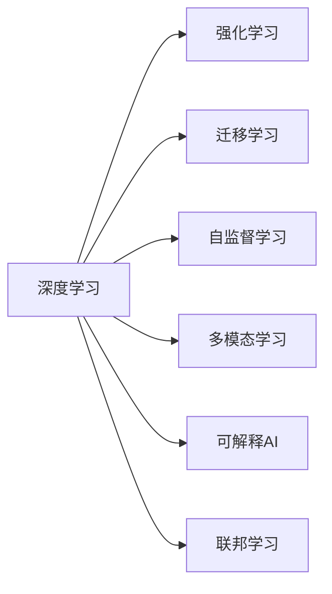

                 

# 李开复：AI 2.0 时代的开发者

## 1. 背景介绍

### 1.1 问题由来
人工智能（AI）在过去几十年里取得了飞速发展，从早期基于规则的专家系统，到20世纪90年代兴起的符号主义AI，再到21世纪初出现的基于统计的机器学习模型，AI技术经历了多次变革。然而，这些早期的AI方法往往难以处理复杂的现实问题，未能真正落地应用。

进入21世纪后，随着深度学习技术的兴起，尤其是2012年ImageNet图像识别大赛的胜利，AI技术进入了一个新的阶段。深度学习模型如卷积神经网络（CNN）和循环神经网络（RNN）在图像、语音、自然语言处理等领域取得了显著进展。然而，这一阶段的AI仍存在一些问题：数据需求量大、模型复杂度高、计算成本高，难以大规模部署。

### 1.2 问题核心关键点
为了解决上述问题，AI技术正在朝着更加智能、普适、可解释、可控的方向发展，我们将其称为AI 2.0时代。AI 2.0时代的核心目标是实现更加通用、灵活、自适应、可解释的智能系统。这种智能系统不仅能处理结构化数据，还能理解自然语言、图像、视频等非结构化数据，具备自主学习、推理、决策的能力，并能够与人类进行自然交互。

AI 2.0时代对开发者的要求也相应地提升到了一个新的层次。开发者需要具备更全面、深入的AI知识，能够构建更加复杂、高效、可解释的AI系统。同时，开发者还需要具备跨学科的知识背景，能够将AI技术与不同行业的应用场景相结合，推动AI技术的落地应用。

## 2. AI 2.0 的核心概念与联系

### 2.1 核心概念概述

AI 2.0时代涉及众多核心概念，这些概念之间存在着紧密的联系。以下是对这些核心概念的简要介绍：

- **深度学习（Deep Learning）**：一种基于多层神经网络的机器学习模型，能够自动从大量数据中学习特征和模式，广泛应用于图像、语音、自然语言处理等领域。
- **强化学习（Reinforcement Learning, RL）**：通过与环境互动，学习最优策略，使其在特定环境中取得最大奖励的机器学习技术。强化学习在自动驾驶、游戏AI等领域有广泛应用。
- **迁移学习（Transfer Learning）**：将在一个任务上学到的知识迁移到另一个相关任务上，可以减少新任务的学习成本，提升模型效果。
- **自监督学习（Self-supervised Learning）**：利用未标记数据进行自我监督训练，自动生成大量有监督的数据，用于提升模型泛化能力。
- **多模态学习（Multimodal Learning）**：结合多种模态的数据（如视觉、听觉、文本）进行学习，提升模型的综合理解能力。
- **可解释AI（Explainable AI, XAI）**：使AI模型能够解释其决策过程，提高模型的透明度和可信度。
- **联邦学习（Federated Learning）**：在分布式环境中，多个设备或服务器协作训练模型，保护用户隐私的同时提升模型性能。

这些核心概念之间存在紧密的联系，共同构成了AI 2.0时代的技术生态。下面，我们将通过Mermaid流程图来展示这些概念之间的联系。



这个流程图展示了AI 2.0时代的技术生态，各个概念相互补充，共同推动AI技术的进步。

### 2.2 概念间的关系

这些核心概念之间存在复杂的交互和依赖关系，以下是对这些关系的进一步解释：

- **深度学习与强化学习**：深度学习在许多任务上取得了显著进展，但强化学习能够通过与环境互动，学习更加复杂的策略和决策能力，在一些任务上表现更加出色。两者可以相互补充，共同提升AI系统的智能水平。
- **迁移学习与自监督学习**：迁移学习利用已有知识加速新任务的学习，而自监督学习能够自动生成大量有监督数据，提升模型的泛化能力。两者结合使用，可以在新任务上取得更好的效果。
- **多模态学习与可解释AI**：多模态学习结合多种数据源，提升模型的综合理解能力，而可解释AI能够揭示模型的决策过程，增强模型的透明度和可信度。两者结合，可以使AI系统更加可靠和可信。
- **联邦学习与隐私保护**：联邦学习在分布式环境中协作训练模型，保护用户隐私，而隐私保护是AI 2.0时代的重要需求，两者结合使用，可以构建更加安全的AI系统。

这些概念之间的关系，使得AI 2.0时代的技术生态更加复杂和丰富，开发者需要具备更全面的知识背景，才能构建高效的AI系统。

## 3. AI 2.0 的核心算法原理 & 具体操作步骤

### 3.1 算法原理概述

AI 2.0时代的技术体系庞大复杂，涉及众多算法和模型。以下是对核心算法的简要介绍：

- **神经网络（Neural Networks）**：是深度学习的基础，通过多层神经元模拟人脑的神经网络，学习数据的特征和模式。
- **卷积神经网络（Convolutional Neural Networks, CNNs）**：主要用于图像处理，通过卷积层、池化层等结构，提取图像中的特征。
- **循环神经网络（Recurrent Neural Networks, RNNs）**：主要用于序列数据处理，通过时间步的递归结构，学习时间序列的特征和模式。
- **生成对抗网络（Generative Adversarial Networks, GANs）**：通过生成器和判别器两个网络的对抗训练，生成高质量的图像、文本等内容。
- **图神经网络（Graph Neural Networks, GNNs）**：主要用于处理图结构数据，通过图卷积、图注意力等方法，学习图结构中的特征和关系。

这些算法和技术构成了AI 2.0时代的基础，开发者需要深入理解这些算法的原理和应用场景，才能构建高效的AI系统。

### 3.2 算法步骤详解

以下是对AI 2.0时代核心算法的详细步骤介绍：

#### 3.2.1 神经网络训练
1. **数据准备**：收集、清洗、标注数据，划分为训练集、验证集和测试集。
2. **模型选择**：选择合适的神经网络模型，如CNN、RNN、GAN等。
3. **模型初始化**：随机初始化模型参数。
4. **前向传播**：将输入数据输入模型，通过网络层的逐层计算，得到输出结果。
5. **损失计算**：计算输出结果与真实标签之间的误差，得到损失函数。
6. **反向传播**：使用反向传播算法计算损失函数对模型参数的梯度，更新模型参数。
7. **模型评估**：在验证集和测试集上评估模型性能，调整模型超参数。
8. **模型保存**：保存训练好的模型，用于后续部署。

#### 3.2.2 强化学习训练
1. **环境设计**：设计AI系统与环境互动的环境，如自动驾驶、游戏等。
2. **策略定义**：定义AI系统的策略，如Q-learning、策略梯度等。
3. **环境交互**：在环境中进行多次训练，AI系统根据策略选择动作，接收环境反馈。
4. **损失计算**：计算策略的奖励函数，评估策略的优劣。
5. **策略优化**：使用梯度下降等优化算法优化策略，提升策略的性能。
6. **策略评估**：在测试环境中评估优化后的策略性能。

#### 3.2.3 迁移学习应用
1. **任务选择**：选择目标任务，如自然语言处理、计算机视觉等。
2. **源任务选择**：选择源任务，如ImageNet、Wikipedia等。
3. **特征提取**：使用源任务上的预训练模型提取特征。
4. **微调**：在目标任务上微调预训练模型，调整顶层分类器或解码器。
5. **评估**：在测试集上评估微调后的模型性能。

#### 3.2.4 自监督学习应用
1. **数据准备**：收集未标记的数据，如文本、图像等。
2. **任务设计**：设计自监督任务，如语言建模、图像复原等。
3. **模型训练**：使用未标记数据训练自监督模型，自动生成大量有监督数据。
4. **特征提取**：使用自监督模型提取数据特征。
5. **迁移学习**：将提取的特征应用于目标任务，提升模型性能。

#### 3.2.5 多模态学习应用
1. **数据收集**：收集多种模态的数据，如图像、文本、音频等。
2. **数据融合**：使用特征融合技术，将多种模态的数据融合为一个综合表示。
3. **模型训练**：使用融合后的数据训练多模态模型。
4. **模型评估**：在测试集上评估多模态模型的性能。

#### 3.2.6 可解释AI应用
1. **模型选择**：选择可解释性较强的模型，如LIME、SHAP等。
2. **解释计算**：计算模型的特征重要性、局部可解释性等指标。
3. **解释可视化**：使用可视化工具展示模型的解释结果。
4. **解释验证**：验证解释结果的准确性和可靠性。

#### 3.2.7 联邦学习应用
1. **数据收集**：收集分布式环境中的数据。
2. **模型选择**：选择合适的联邦学习框架，如Federated Learning、Gossip Learning等。
3. **模型训练**：在分布式环境中协作训练模型。
4. **模型评估**：在测试集上评估模型性能。
5. **隐私保护**：保护用户隐私，使用差分隐私、同态加密等技术。

### 3.3 算法优缺点

AI 2.0时代的技术算法各具优缺点，以下是对这些优缺点的简要介绍：

#### 3.3.1 深度学习的优点
- **高效特征提取**：深度学习能够自动提取数据中的复杂特征，提升模型性能。
- **广泛应用**：深度学习在图像、语音、自然语言处理等领域有广泛应用。
- **灵活性高**：深度学习模型可以灵活调整结构，适用于各种复杂任务。

#### 3.3.2 深度学习的缺点
- **计算资源需求高**：深度学习模型参数量大，计算资源需求高。
- **过拟合风险大**：深度学习模型容易过拟合，需要大量数据进行训练。
- **模型难以解释**：深度学习模型通常是"黑盒"，难以解释其决策过程。

#### 3.3.3 强化学习的优点
- **自我优化**：强化学习能够自我优化策略，适应复杂环境。
- **决策能力强**：强化学习模型在决策任务上表现优异。
- **可解释性高**：强化学习策略相对简单，易于解释。

#### 3.3.4 强化学习的缺点
- **环境设计复杂**：强化学习需要设计复杂的环境，难以在实际应用中实现。
- **训练时间长**：强化学习模型训练时间长，需要大量时间与环境互动。
- **鲁棒性差**：强化学习模型对环境变化敏感，容易失效。

#### 3.3.5 迁移学习的优点
- **知识迁移**：迁移学习能够将已有知识迁移到新任务，减少训练时间。
- **泛化能力强**：迁移学习模型具有较强的泛化能力，适用于复杂任务。
- **数据需求低**：迁移学习需要的标注数据少，提升数据利用率。

#### 3.3.6 迁移学习的缺点
- **任务相关性要求高**：迁移学习要求源任务与目标任务有较强的相关性，限制了迁移范围。
- **模型复杂度高**：迁移学习模型需要调整顶层分类器或解码器，模型复杂度高。
- **知识迁移不完全**：迁移学习只能部分迁移已有知识，无法完全覆盖新任务。

#### 3.3.7 自监督学习的优点
- **数据需求低**：自监督学习需要的标注数据少，提升数据利用率。
- **自动化生成数据**：自监督学习能够自动生成大量有监督数据，提升模型泛化能力。
- **适应性强**：自监督学习适用于各种复杂任务，适应性强。

#### 3.3.8 自监督学习的缺点
- **任务相关性要求高**：自监督学习任务设计复杂，要求数据与任务有较强相关性。
- **模型复杂度高**：自监督学习模型需要设计复杂的任务，模型复杂度高。
- **性能提升有限**：自监督学习性能提升有限，需要与其他方法结合使用。

#### 3.3.9 多模态学习的优点
- **综合理解能力强**：多模态学习能够结合多种数据源，提升模型的综合理解能力。
- **适用性强**：多模态学习适用于各种复杂任务，适用性强。
- **数据利用率高**：多模态学习能够高效利用多种模态数据，提升模型性能。

#### 3.3.10 多模态学习的缺点
- **数据采集复杂**：多模态学习需要采集多种模态数据，数据采集复杂。
- **模型复杂度高**：多模态学习模型需要设计复杂的数据融合方法，模型复杂度高。
- **技术要求高**：多模态学习需要具备多学科知识，技术要求高。

#### 3.3.11 可解释AI的优点
- **透明度高**：可解释AI能够揭示模型的决策过程，提高模型的透明度。
- **可信度高**：可解释AI模型具有较高的可信度，便于理解和验证。
- **应用广泛**：可解释AI适用于各种复杂任务，应用广泛。

#### 3.3.12 可解释AI的缺点
- **计算资源需求高**：可解释AI模型需要额外的计算资源进行解释计算。
- **解释效果有限**：可解释AI模型的解释效果有限，难以完全解释复杂模型。
- **解释复杂度高**：可解释AI模型的解释复杂度高，难以实现可视化。

#### 3.3.13 联邦学习的优点
- **隐私保护好**：联邦学习在分布式环境中协作训练模型，保护用户隐私。
- **数据利用率高**：联邦学习能够高效利用分布式环境中的数据，提升模型性能。
- **可扩展性好**：联邦学习适用于大规模分布式环境，可扩展性好。

#### 3.3.14 联邦学习的缺点
- **通信成本高**：联邦学习需要频繁进行通信，通信成本高。
- **计算资源需求高**：联邦学习需要大量计算资源进行模型训练。
- **同步困难**：联邦学习需要在多个设备上同步训练，同步困难。

### 3.4 算法应用领域

AI 2.0时代的核心算法和技术在各个领域都有广泛应用，以下是对这些应用领域的简要介绍：

#### 3.4.1 自然语言处理（NLP）
- **文本分类**：使用深度学习模型进行文本分类，如情感分析、主题分类等。
- **命名实体识别**：使用深度学习模型进行命名实体识别，如人名、地名、组织名等。
- **机器翻译**：使用深度学习模型进行机器翻译，如英中翻译、中英翻译等。
- **问答系统**：使用深度学习模型进行问答系统，如智能客服、智能助手等。
- **情感分析**：使用深度学习模型进行情感分析，如用户评论情感分析等。

#### 3.4.2 计算机视觉（CV）
- **图像分类**：使用深度学习模型进行图像分类，如物体识别、场景分类等。
- **目标检测**：使用深度学习模型进行目标检测，如人脸检测、车辆检测等。
- **图像生成**：使用生成对抗网络（GAN）进行图像生成，如照片修复、人脸生成等。
- **图像分割**：使用深度学习模型进行图像分割，如语义分割、实例分割等。

#### 3.4.3 语音识别与处理
- **语音识别**：使用深度学习模型进行语音识别，如自动语音识别（ASR）等。
- **语音合成**：使用深度学习模型进行语音合成，如文本转语音（TTS）等。
- **情感识别**：使用深度学习模型进行语音情感识别，如情绪识别、情绪分析等。

#### 3.4.4 智能决策与控制系统
- **自动驾驶**：使用强化学习模型进行自动驾驶决策，如路径规划、避障等。
- **机器人控制**：使用强化学习模型进行机器人控制，如运动控制、任务规划等。
- **推荐系统**：使用深度学习模型进行推荐系统，如电商推荐、新闻推荐等。

#### 3.4.5 生物医学
- **基因组分析**：使用深度学习模型进行基因组分析，如基因识别、基因突变检测等。
- **医学影像**：使用深度学习模型进行医学影像分析，如X光影像分析、CT影像分析等。
- **个性化医疗**：使用深度学习模型进行个性化医疗，如疾病预测、治疗方案推荐等。

## 4. AI 2.0 的数学模型和公式 & 详细讲解 & 举例说明

### 4.1 数学模型构建

AI 2.0时代的数学模型涉及深度学习、强化学习、迁移学习等多个领域的数学模型，以下是对这些模型的简要介绍：

#### 4.1.1 神经网络模型
- **单层神经网络**：定义如下：
$$y = \sigma(Wx + b)$$
其中 $W$ 和 $b$ 为模型参数，$\sigma$ 为激活函数，$x$ 为输入，$y$ 为输出。

- **多层神经网络**：定义如下：
$$y = \sigma(W_L\sigma(W_{L-1}\cdots\sigma(W_1x + b_1)\cdots + b_L))$$
其中 $W_L, W_{L-1},\cdots,W_1$ 和 $b_L, b_{L-1},\cdots,b_1$ 为模型参数，$\sigma$ 为激活函数。

#### 4.1.2 卷积神经网络（CNN）
- **卷积层**：定义如下：
$$y = \sigma(W * x + b)$$
其中 $W$ 为卷积核，$x$ 为输入，$b$ 为偏置，$\sigma$ 为激活函数。

- **池化层**：定义如下：
$$y = \max_k(x_k)$$
其中 $x_k$ 为池化层输入，$y$ 为池化层输出。

#### 4.1.3 循环神经网络（RNN）
- **时间步递归**：定义如下：
$$h_t = \sigma(W * h_{t-1} + U * x_t + b)$$
其中 $h_t$ 为时间步 $t$ 的隐藏状态，$W$ 和 $U$ 为模型参数，$x_t$ 为时间步 $t$ 的输入，$b$ 为偏置，$\sigma$ 为激活函数。

- **长短期记忆网络（LSTM）**：定义如下：
$$h_t = \sigma(W * h_{t-1} + U * x_t + b)$$
其中 $h_t$ 为时间步 $t$ 的隐藏状态，$W$ 和 $U$ 为模型参数，$x_t$ 为时间步 $t$ 的输入，$b$ 为偏置，$\sigma$ 为激活函数。

#### 4.1.4 生成对抗网络（GAN）
- **生成器**：定义如下：
$$G(z) = \sigma(W * z + b)$$
其中 $z$ 为噪声向量，$W$ 和 $b$ 为模型参数，$\sigma$ 为激活函数。

- **判别器**：定义如下：
$$D(x) = \sigma(W * x + b)$$
其中 $x$ 为输入，$W$ 和 $b$ 为模型参数，$\sigma$ 为激活函数。

#### 4.1.5 图神经网络（GNN）
- **图卷积网络（GCN）**：定义如下：
$$\tilde{A} = \frac{1}{\sqrt{d}}A * \sqrt{d}$$
其中 $A$ 为邻接矩阵，$d$ 为节点度数。

- **图注意力网络（GAT）**：定义如下：
$$\alpha_{ij} = \frac{e_{ij}^{h_i h_j}}{\sum_{j \in N(i)} e_{ij}^{h_i h_j}}$$
其中 $e_{ij}^{h_i h_j}$ 为节点 $i$ 和 $j$ 之间的注意力权重，$h_i$ 和 $h_j$ 为节点 $i$ 和 $j$ 的特征向量。

### 4.2 公式推导过程

以下是对AI 2.0时代核心算法的公式推导过程的详细讲解：

#### 4.2.1 神经网络模型
- **单层神经网络**：
$$y = \sigma(Wx + b)$$

- **多层神经网络**：
$$y = \sigma(W_L\sigma(W_{L-1}\cdots\sigma(W_1x + b_1)\cdots + b_L))$$

#### 4.2.2 卷积神经网络（CNN）
- **卷积层**：
$$y = \sigma(W * x + b)$$

- **池化层**：
$$y = \max_k(x_k)$$

#### 4.2.3 循环神经网络（RNN）
- **时间步递归**：
$$h_t = \sigma(W * h_{t-1} + U * x_t + b)$$

- **长短期记忆网络（LSTM）**：
$$h_t = \sigma(W * h_{t-1} + U * x_t + b)$$

#### 4.2.4 生成对抗网络（GAN）
- **生成器**：
$$G(z) = \sigma(W * z + b)$$

- **判别器**：
$$D(x) = \sigma(W * x + b)$$

#### 4.2.5 图神经网络（GNN）
- **图卷积网络（GCN）**：
$$\tilde{A} = \frac{1}{\sqrt{d}}A * \sqrt{d}$$

- **图注意力网络（GAT）**：
$$\alpha_{ij} = \frac{e_{ij}^{h_i h_j}}{\sum_{j \in N(i)} e_{ij}^{h_i h_j}}$$

### 4.3 案例分析与讲解

以下是对AI 2.0时代核心算法在实际应用中的案例分析：

#### 4.3.1 深度学习在计算机视觉中的应用
- **图像分类**：使用卷积神经网络（CNN）进行图像分类，如ImageNet图像分类竞赛等。
- **目标检测**：使用卷积神经网络（CNN）进行目标检测，如Faster R-CNN、YOLO等。
- **图像生成**：使用生成对抗网络（GAN）进行图像生成，如StyleGAN、DCGAN等。
- **图像分割**：使用卷积神经网络（CNN）进行图像分割，如U-Net、FCN等。

#### 4.3.2 强化学习在自动驾驶中的应用
- **路径规划**：使用强化学习模型进行路径规划，如DeepDrive、DriveNet等。
- **避障决策**：使用强化学习模型进行避障决策，如CARL、CARLA等。

#### 4.3.3 迁移学习在自然语言处理中的应用
- **情感分析**：使用迁移学习模型进行情感分析，如BERT、GPT等。
- **命名实体识别**：使用迁移学习模型进行命名实体识别，如DistilBERT、RoBERTa等。
- **机器翻译**：使用迁移学习模型进行机器翻译，如Google Translate、OpenAI Translate等。

#### 4.3.4 自监督学习在语音识别中的应用
- **语音识别**：使用自监督学习模型进行语音识别，如wav2vec、Deformable Transformer等。

#### 4.3.5 多模态学习在智能决策中的应用
- **智能推荐系统**：使用多模态学习模型进行智能推荐系统，如电商推荐、新闻推荐等。
- **智能医疗**：使用多模态学习模型进行智能医疗，如医学影像分析、基因组分析等。

#### 4.3.6 可解释AI在金融风险评估中的应用
- **信用评估**：使用可解释AI模型进行信用评估，如RiskAIG、Altman等。
- **欺诈检测**：使用可解释AI模型进行欺诈检测，如KDD Cup、PhishMe等。

#### 4.3.7 联邦学习在医疗数据共享中的应用
- **隐私保护**：使用联邦学习模型进行隐私保护，如 federated-learning、FederatedCTGAN等。

## 5. AI 2.0 的项目实践：代码实例和详细解释说明

### 5.1 开发环境搭建

在开始AI 2.0项目实践前，我们需要准备开发环境。以下是使用Python进行PyTorch开发的环境配置流程：

1. 安装Anaconda：从官网下载并安装Anaconda，用于创建独立的Python环境。

2. 创建并激活虚拟环境：
```bash
conda create -n ai-env python=3.7 
conda activate ai-env
```

3. 安装PyTorch：根据C

