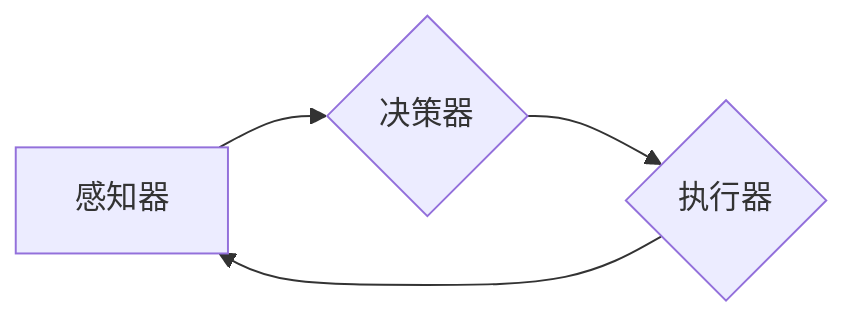

> 关键词：AI Agent, 智能体, 人工智能, 机器学习, 强化学习, 自然语言处理, 实时决策, 智能系统

# AI Agent: AI的下一个风口 重新审视智能体的重要性

随着人工智能技术的飞速发展，从早期的专家系统到如今的深度学习，AI技术在各个领域的应用已经越来越广泛。然而，尽管AI技术在图像识别、自然语言处理等领域取得了显著的成就，但一个关键的问题始终存在：如何让AI系统具备自主决策能力，成为能够适应复杂环境、进行实时交互的智能体？本文将深入探讨AI Agent的概念、原理、应用，以及其在未来AI发展中的重要地位。

## 1. 背景介绍

### 1.1 问题的由来

在传统的AI应用中，我们通常将AI系统视为一个黑盒，它根据输入数据产生输出结果。这种模式在处理一些结构化、确定性的任务时效果良好，但面对复杂、动态的环境，AI系统往往难以胜任。例如，自动驾驶汽车在复杂的交通环境中需要实时做出决策，仅仅依靠传统的AI技术是无法实现的。

### 1.2 研究现状

为了解决这一问题，研究者们提出了AI Agent的概念。AI Agent，即智能体，是一个能够感知环境、根据感知信息进行决策并采取行动的实体。近年来，随着机器学习、强化学习、自然语言处理等技术的不断发展，AI Agent的研究和应用也取得了显著的进展。

### 1.3 研究意义

AI Agent的研究对于推动人工智能技术的发展具有重要意义：

1. **提高AI系统的自主性**：AI Agent能够根据环境变化自主调整行为策略，从而提高AI系统的自主性和适应性。
2. **实现复杂任务自动化**：AI Agent可以应用于复杂任务的自动化，如自动驾驶、智能机器人等。
3. **促进人机交互**：AI Agent能够理解人类意图，与人类进行自然交互，提高人机交互的效率和便利性。
4. **推动AI伦理研究**：AI Agent的研究需要考虑伦理问题，如隐私保护、决策透明度等。

### 1.4 本文结构

本文将分为以下几个部分：

- 第二部分：介绍AI Agent的核心概念和联系。
- 第三部分：探讨AI Agent的核心算法原理和具体操作步骤。
- 第四部分：分析AI Agent的数学模型和公式，并结合实例进行讲解。
- 第五部分：提供AI Agent的代码实例和详细解释说明。
- 第六部分：探讨AI Agent的实际应用场景和未来应用展望。
- 第七部分：推荐AI Agent相关的学习资源、开发工具和参考文献。
- 第八部分：总结AI Agent的研究成果、未来发展趋势、面临的挑战和研究展望。
- 第九部分：附录，提供常见问题与解答。

## 2. 核心概念与联系

### 2.1 AI Agent的定义

AI Agent是一个能够感知环境、根据感知信息进行决策并采取行动的实体。它通常由以下几个部分组成：

- **感知器**：用于感知环境信息的传感器，如摄像头、麦克风等。
- **决策器**：根据感知信息进行决策的模块，如基于规则的决策、基于学习的决策等。
- **执行器**：根据决策结果执行具体行为的模块，如电机、伺服器等。

### 2.2 AI Agent的Mermaid流程图



### 2.3 AI Agent与相关概念的联系

AI Agent与其他人工智能概念之间的联系如下：

- **机器学习**：AI Agent的决策器部分可以基于机器学习算法进行构建，如监督学习、强化学习等。
- **自然语言处理**：AI Agent可以感知和生成自然语言，从而实现与人类的自然交互。
- **计算机视觉**：AI Agent可以感知图像和视频，从而理解视觉信息。
- **机器人技术**：AI Agent可以控制机器人执行具体的任务。

## 3. 核心算法原理 & 具体操作步骤

### 3.1 算法原理概述

AI Agent的算法原理主要包括感知、决策和执行三个部分。

- **感知**：AI Agent通过传感器收集环境信息。
- **决策**：AI Agent根据感知到的信息，利用决策算法选择合适的动作。
- **执行**：AI Agent通过执行器执行选择的动作。

### 3.2 算法步骤详解

1. **感知**：AI Agent通过传感器感知环境信息，如图像、声音、传感器数据等。
2. **决策**：AI Agent根据感知到的信息，利用决策算法选择合适的动作。常见的决策算法包括基于规则的决策、基于学习的决策等。
   - **基于规则的决策**：根据预先定义的规则进行决策。
   - **基于学习的决策**：利用机器学习算法，如决策树、支持向量机等，根据历史数据学习决策策略。
3. **执行**：AI Agent通过执行器执行选择的动作，如控制机器人移动、调整摄像头角度等。

### 3.3 算法优缺点

- **优点**：
  - 提高AI系统的自主性和适应性。
  - 实现复杂任务的自动化。
  - 促进人机交互。
- **缺点**：
  - 算法复杂度高，需要大量的计算资源。
  - 需要大量的训练数据。

### 3.4 算法应用领域

AI Agent的应用领域非常广泛，包括：

- **自动驾驶**：自动驾驶汽车需要实时感知环境信息，并根据感知到的信息做出决策。
- **智能机器人**：智能机器人需要根据环境变化调整行为策略。
- **智能客服**：智能客服可以理解用户意图，并根据意图提供相应的服务。
- **推荐系统**：推荐系统可以根据用户的历史行为和兴趣推荐相应的商品或内容。

## 4. 数学模型和公式 & 详细讲解 & 举例说明

### 4.1 数学模型构建

AI Agent的数学模型主要包括以下部分：

- **感知模型**：用于描述AI Agent如何感知环境信息的模型。
- **决策模型**：用于描述AI Agent如何根据感知信息进行决策的模型。
- **执行模型**：用于描述AI Agent如何执行动作的模型。

### 4.2 公式推导过程

以下是一个简单的感知模型的公式推导过程：

$$
\text{感知模型} = f(\text{传感器数据})
$$

其中，$f$ 表示感知函数，将传感器数据转换为AI Agent可理解的感知信息。

### 4.3 案例分析与讲解

以下是一个基于强化学习的智能体决策模型的案例：

- **环境**：一个简单的迷宫环境，智能体需要从起点到达终点。
- **状态**：智能体当前所在的位置。
- **动作**：向上、向下、向左、向右。
- **奖励**：成功到达终点时奖励10分，否则每次移动减去1分。

基于以上设定，我们可以使用Q学习算法构建智能体的决策模型。Q学习算法的目标是学习一个Q函数，表示在特定状态下采取特定动作的期望奖励。

$$
Q(s,a) = \sum_{s' \in S} R(s,a,s') + \gamma \max_{a' \in A} Q(s',a')
$$

其中，$R(s,a,s')$ 表示在状态 $s$ 下采取动作 $a$ 后转移到状态 $s'$ 的奖励，$\gamma$ 表示折扣因子，$S$ 表示所有可能的状态集合，$A$ 表示所有可能的动作集合。

通过迭代更新Q函数，智能体可以学习到最优策略，从而在迷宫环境中找到最优路径。

## 5. 项目实践：代码实例和详细解释说明

### 5.1 开发环境搭建

为了进行AI Agent的开发，我们需要以下环境：

- Python编程语言
- TensorFlow或PyTorch深度学习框架
- OpenAI Gym环境库

### 5.2 源代码详细实现

以下是一个简单的基于Q学习的AI Agent的代码实例：

```python
import gym
import numpy as np
import random

# 定义环境
env = gym.make('CartPole-v0')

# 初始化Q表
q_table = np.zeros([env.observation_space.n, env.action_space.n])

# Q学习参数
alpha = 0.1  # 学习率
gamma = 0.95  # 折扣因子
epsilon = 0.1  # 探索率

# Q学习训练循环
for episode in range(1000):
    state = env.reset()
    done = False
    while not done:
        # 随机选择探索或利用
        if random.uniform(0, 1) < epsilon:
            action = random.randint(0, env.action_space.n-1)
        else:
            action = np.argmax(q_table[state])

        # 执行动作并获取反馈
        next_state, reward, done, _ = env.step(action)

        # 更新Q表
        q_table[state, action] = q_table[state, action] + alpha * (
            reward + gamma * np.max(q_table[next_state]) - q_table[state, action]
        )

        state = next_state

# 评估Q表
for _ in range(100):
    state = env.reset()
    done = False
    while not done:
        action = np.argmax(q_table[state])
        state, reward, done, _ = env.step(action)
```

### 5.3 代码解读与分析

- 我们使用OpenAI Gym库中的CartPole环境作为测试环境。
- 初始化一个Q表，用于存储每个状态-动作对的Q值。
- 设置Q学习参数，包括学习率、折扣因子和探索率。
- 在Q学习训练循环中，智能体根据Q表选择动作，并根据执行结果更新Q表。
- 最后，使用训练好的Q表评估智能体的性能。

## 6. 实际应用场景

### 6.1 自动驾驶

自动驾驶是AI Agent应用最典型的场景之一。自动驾驶汽车需要实时感知周围环境，如车道线、交通标志、其他车辆和行人等，并根据感知到的信息做出决策，如加速、减速、转向等。

### 6.2 智能机器人

智能机器人可以应用于家庭、工业、医疗等多个领域。例如，家庭机器人可以帮助老人或儿童完成日常任务，工业机器人可以替代人类完成危险或重复性工作。

### 6.3 智能客服

智能客服可以理解用户的意图，并根据意图提供相应的服务，如查询信息、解决故障等。

### 6.4 推荐系统

推荐系统可以根据用户的历史行为和兴趣推荐相应的商品或内容。

## 7. 工具和资源推荐

### 7.1 学习资源推荐

- 《Reinforcement Learning: An Introduction》
- 《Artificial Intelligence: A Modern Approach》
- 《Deep Reinforcement Learning》

### 7.2 开发工具推荐

- TensorFlow
- PyTorch
- OpenAI Gym

### 7.3 相关论文推荐

- "Deep Q-Network" by Volodymyr Mnih et al.
- "Algorithms for Reinforcement Learning" by Csaba Szepesvári
- "Reinforcement Learning: A Survey" by Sergey Levine et al.

## 8. 总结：未来发展趋势与挑战

### 8.1 研究成果总结

AI Agent作为一种能够感知环境、进行决策和采取行动的实体，在自动驾驶、智能机器人、智能客服、推荐系统等领域的应用前景广阔。近年来，随着机器学习、强化学习、自然语言处理等技术的不断发展，AI Agent的研究和应用取得了显著的进展。

### 8.2 未来发展趋势

- **多模态感知**：AI Agent将能够感知和处理多种类型的信息，如视觉、听觉、触觉等。
- **强化学习**：强化学习将在AI Agent的决策过程中发挥越来越重要的作用。
- **人机交互**：AI Agent将与人类进行更加自然、流畅的交互。
- **跨领域迁移**：AI Agent将在不同领域之间进行知识迁移和复用。

### 8.3 面临的挑战

- **数据获取**：AI Agent需要大量的训练数据，尤其是在多模态感知领域。
- **计算资源**：AI Agent的训练和推理需要大量的计算资源。
- **安全性**：AI Agent的决策过程需要保证安全性和可靠性。
- **伦理问题**：AI Agent的决策过程需要符合伦理道德规范。

### 8.4 研究展望

未来，AI Agent的研究将朝着以下方向发展：

- **多智能体系统**：研究多个AI Agent之间的协作和竞争。
- **自适应学习**：AI Agent能够根据环境变化自适应地调整行为策略。
- **可解释性**：研究AI Agent的决策过程，提高其可解释性。
- **伦理道德**：研究AI Agent的伦理道德问题，确保其决策过程符合伦理道德规范。

## 9. 附录：常见问题与解答

**Q1：什么是AI Agent？**

A：AI Agent是一个能够感知环境、根据感知信息进行决策并采取行动的实体。

**Q2：AI Agent有哪些应用场景？**

A：AI Agent的应用场景非常广泛，包括自动驾驶、智能机器人、智能客服、推荐系统等。

**Q3：如何实现AI Agent？**

A：实现AI Agent需要结合多种技术，如机器学习、强化学习、自然语言处理等。

**Q4：AI Agent面临哪些挑战？**

A：AI Agent面临的主要挑战包括数据获取、计算资源、安全性和伦理问题。

**Q5：AI Agent的未来发展趋势是什么？**

A：AI Agent的未来发展趋势包括多模态感知、强化学习、人机交互、跨领域迁移等。

---

作者：禅与计算机程序设计艺术 / Zen and the Art of Computer Programming