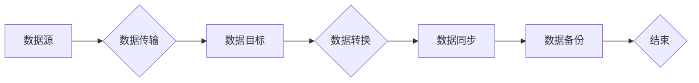

# AI 大模型应用数据中心的数据迁移架构

> 关键词：AI大模型，数据中心，数据迁移，架构设计，性能优化，安全可靠，多云部署

## 1. 背景介绍

随着人工智能技术的飞速发展，AI大模型在各个领域得到广泛应用，从自然语言处理到图像识别，从推荐系统到决策分析，AI大模型的能力已经成为了提升企业竞争力的关键因素。然而，AI大模型的训练和部署往往需要大量的数据和强大的计算资源，这就要求企业建立一个高效、可靠、安全的AI大模型应用数据中心。其中，数据迁移架构是数据中心的重要组成部分，它决定了数据在数据中心内外的流动效率和质量。

### 1.1 数据迁移的重要性

数据迁移是AI大模型应用数据中心的关键环节，它涉及以下方面：

- **数据同步**：确保数据中心内外的数据一致性，保证数据在训练和推理过程中的准确性。
- **数据备份**：防止数据丢失，保证数据的安全性和可靠性。
- **数据扩展**：随着业务的发展，数据中心需要能够扩展存储和处理能力，数据迁移是实现扩展的关键。
- **数据治理**：规范数据格式、质量、访问权限等，提高数据利用效率。

### 1.2 数据迁移的挑战

数据迁移面临着以下挑战：

- **数据量庞大**：AI大模型训练和推理需要处理的数据量往往非常庞大，对数据迁移架构的性能提出了很高的要求。
- **数据类型多样**：AI大模型需要处理的结构化、半结构化和非结构化数据，对数据迁移架构的兼容性和灵活性提出了挑战。
- **数据安全**：数据在迁移过程中容易受到泄露、篡改等安全威胁，对数据迁移架构的安全性提出了严格的要求。
- **迁移成本**：数据迁移需要大量的计算资源，对成本控制提出了挑战。

## 2. 核心概念与联系

### 2.1 核心概念原理

数据迁移架构的核心概念包括：

- **数据源**：数据迁移的起点，可以是数据库、文件系统、云存储等。
- **数据目标**：数据迁移的终点，可以是数据库、文件系统、云存储等。
- **数据传输**：数据在数据源和数据目标之间的传输过程，可以使用网络传输、存储复制、云服务等方式。
- **数据转换**：数据在迁移过程中可能需要进行格式转换、编码转换等操作。
- **数据同步**：确保数据在数据源和数据目标之间的一致性。
- **数据备份**：定期备份数据，防止数据丢失。

Mermaid流程图如下：



### 2.2 核心概念联系

数据迁移架构中的核心概念之间存在着紧密的联系。数据源是数据迁移的起点，数据传输是连接数据源和数据目标的关键环节，数据转换和同步是保证数据质量和一致性的重要手段，数据备份则提供了数据安全的保障。

## 3. 核心算法原理 & 具体操作步骤

### 3.1 算法原理概述

数据迁移架构的核心算法包括：

- **数据同步算法**：如Rsync、Differential Sync等，用于同步数据源和数据目标之间的差异。
- **数据压缩算法**：如Hadoop的HDFS压缩、Snappy等，用于减少数据传输的带宽消耗。
- **数据加密算法**：如AES、RSA等，用于保证数据在传输过程中的安全性。
- **数据去重算法**：如MD5、SHA-1等，用于检测数据是否重复，避免重复传输。

### 3.2 算法步骤详解

数据迁移架构的具体操作步骤如下：

1. **数据源和目标选择**：根据数据迁移的需求，选择合适的数据源和目标。
2. **数据准备**：对数据进行清洗、格式化等预处理操作，确保数据质量。
3. **数据传输**：选择合适的数据传输方式，如网络传输、存储复制、云服务等。
4. **数据转换**：根据需要，对数据进行格式转换、编码转换等操作。
5. **数据同步**：使用数据同步算法，确保数据源和数据目标之间的一致性。
6. **数据备份**：定期备份数据，防止数据丢失。

### 3.3 算法优缺点

- **数据同步算法**：优点是能够保证数据的一致性，缺点是可能存在延迟。
- **数据压缩算法**：优点是能够减少数据传输的带宽消耗，缺点是可能增加计算开销。
- **数据加密算法**：优点是能够保证数据的安全性，缺点是可能增加计算开销。
- **数据去重算法**：优点是能够避免重复传输，缺点是可能增加计算开销。

### 3.4 算法应用领域

数据迁移算法广泛应用于以下领域：

- **数据中心迁移**：将现有数据中心的数据迁移到新的数据中心。
- **云迁移**：将数据从本地存储迁移到云存储。
- **数据备份**：定期备份数据，防止数据丢失。
- **数据集成**：将来自不同数据源的数据集成到一个统一的平台。

## 4. 数学模型和公式 & 详细讲解 & 举例说明

### 4.1 数学模型构建

数据迁移架构的数学模型可以表示为：

$$
\text{数据迁移模型} = f(\text{数据源}, \text{数据目标}, \text{数据传输}, \text{数据转换}, \text{数据同步}, \text{数据备份})
$$

其中，$f$ 表示数据迁移过程的操作。

### 4.2 公式推导过程

数据迁移过程的公式推导过程如下：

- 数据源到数据目标的传输过程可以表示为 $T_{\text{传输}}(\text{数据源}, \text{数据目标})$。
- 数据转换过程可以表示为 $T_{\text{转换}}(\text{数据源}, \text{数据目标})$。
- 数据同步过程可以表示为 $T_{\text{同步}}(\text{数据源}, \text{数据目标})$。
- 数据备份过程可以表示为 $T_{\text{备份}}(\text{数据源}, \text{数据目标})$。

因此，数据迁移模型可以表示为：

$$
\text{数据迁移模型} = T_{\text{传输}}(\text{数据源}, \text{数据目标}) \times T_{\text{转换}}(\text{数据源}, \text{数据目标}) \times T_{\text{同步}}(\text{数据源}, \text{数据目标}) \times T_{\text{备份}}(\text{数据源}, \text{数据目标})
$$

### 4.3 案例分析与讲解

以下是一个数据迁移的案例分析：

假设企业需要将现有数据中心的数据迁移到新的数据中心，数据量约为1PB，数据类型包括结构化数据、半结构化数据和非结构化数据。

**数据源**：现有数据中心的数据存储在多个数据库和文件系统中。

**数据目标**：新的数据中心使用云存储服务，包括对象存储和块存储。

**数据传输**：采用数据传输软件，通过专线或互联网进行数据传输。

**数据转换**：根据云存储服务的格式要求，对结构化数据进行ETL转换，对半结构化数据进行JSON格式转换，对非结构化数据进行压缩和加密。

**数据同步**：使用数据同步工具，实现数据源和数据目标之间的一致性。

**数据备份**：使用数据备份软件，定期备份数据到云存储服务。

通过上述方案，企业成功将现有数据中心的数据迁移到新的数据中心，保证了数据的完整性和一致性，提高了数据的安全性和可靠性。

## 5. 项目实践：代码实例和详细解释说明

### 5.1 开发环境搭建

以下是使用Python进行数据迁移的示例代码：

```python
import os
import subprocess

def sync_data(source, target):
    """同步数据"""
    command = f"rsync -avh {source} {target}"
    subprocess.run(command, shell=True)

def migrate_data(source, target):
    """迁移数据"""
    sync_data(source, target)

if __name__ == "__main__":
    source = "/path/to/source"
    target = "/path/to/target"
    migrate_data(source, target)
```

### 5.2 源代码详细实现

上述代码展示了如何使用Python进行数据同步。`sync_data`函数使用`rsync`命令同步数据源和数据目标，`migrate_data`函数是数据迁移的主函数。

### 5.3 代码解读与分析

- `sync_data`函数接收两个参数：数据源和数据目标。
- 使用`rsync`命令同步数据，`-avh`参数表示同步所有文件和目录，保持文件属性和时间，详细输出同步过程。
- `migrate_data`函数调用`sync_data`函数进行数据迁移。

### 5.4 运行结果展示

在运行上述代码后，数据源中的文件将被同步到数据目标中。

## 6. 实际应用场景

### 6.1 数据中心迁移

数据中心迁移是企业常见的场景之一。通过数据迁移架构，企业可以将现有数据中心的数据迁移到新的数据中心，提高数据的安全性和可靠性。

### 6.2 云迁移

随着云计算的普及，越来越多的企业选择将数据迁移到云上。数据迁移架构可以帮助企业实现云迁移，降低成本，提高效率。

### 6.3 数据备份

数据备份是企业数据安全的重要保障。数据迁移架构可以帮助企业实现数据的定期备份，防止数据丢失。

### 6.4 数据集成

数据集成是企业数据治理的重要环节。数据迁移架构可以帮助企业实现数据集成，提高数据利用效率。

## 7. 工具和资源推荐

### 7.1 学习资源推荐

- 《大数据技术原理与应用》
- 《云计算技术与应用》
- 《数据迁移与同步技术》

### 7.2 开发工具推荐

- Rsync
- rsync同步工具
- Python
- Python代码示例

### 7.3 相关论文推荐

- 《Data Migration: Techniques and Challenges》
- 《Cloud Data Migration: A Survey》
- 《A Practical Approach to Data Migration》

## 8. 总结：未来发展趋势与挑战

### 8.1 研究成果总结

本文对AI大模型应用数据中心的数据迁移架构进行了全面介绍，包括核心概念、算法原理、具体操作步骤、实际应用场景等。通过分析数据迁移的挑战和趋势，提出了未来研究方向。

### 8.2 未来发展趋势

- **自动化**：数据迁移过程将更加自动化，减少人工干预。
- **智能化**：数据迁移将结合人工智能技术，实现智能优化和决策。
- **多云部署**：数据迁移将支持多云部署，提高数据的安全性、可靠性和可扩展性。

### 8.3 面临的挑战

- **数据安全**：数据在迁移过程中可能受到安全威胁，需要加强数据安全保障措施。
- **数据一致性**：保证数据迁移过程中数据的一致性是一个挑战。
- **迁移成本**：数据迁移需要大量的计算资源，需要优化成本控制。

### 8.4 研究展望

- **数据迁移优化**：研究更加高效、可靠的数据迁移算法和架构。
- **数据安全保障**：研究数据迁移过程中的安全防护技术。
- **人工智能与数据迁移融合**：研究人工智能在数据迁移中的应用，实现智能优化和决策。

## 9. 附录：常见问题与解答

**Q1：数据迁移过程中如何保证数据的安全性？**

A：数据迁移过程中，可以采取以下措施保证数据安全性：

- 使用加密算法对数据进行加密。
- 使用安全协议进行数据传输。
- 对数据迁移过程进行监控和审计。

**Q2：数据迁移过程中如何保证数据的一致性？**

A：数据迁移过程中，可以采取以下措施保证数据一致性：

- 使用数据同步算法进行数据同步。
- 使用数据校验算法进行数据校验。
- 定期进行数据比对，确保数据一致性。

**Q3：数据迁移的成本如何控制？**

A：数据迁移的成本可以通过以下措施进行控制：

- 选择合适的数据迁移工具和架构。
- 优化数据迁移策略，减少数据传输量。
- 使用云计算服务降低成本。

作者：禅与计算机程序设计艺术 / Zen and the Art of Computer Programming