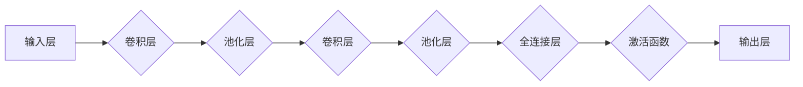

> 人工智能，深度学习，卷积神经网络，CNN，图像识别，计算机视觉，神经网络架构

# AI人工智能深度学习算法：卷积神经网络的原理与应用

### 关键词：
人工智能，深度学习，卷积神经网络，CNN，图像识别，计算机视觉，神经网络架构

## 1. 背景介绍

随着计算机技术的飞速发展，人工智能（AI）已经成为当今科技领域的热点话题。深度学习作为人工智能的一个重要分支，在图像识别、语音识别、自然语言处理等领域取得了显著的成果。其中，卷积神经网络（Convolutional Neural Networks，CNN）是深度学习领域中最为重要的算法之一，它在计算机视觉领域取得了突破性的进展。

### 1.1 问题的由来

传统的图像识别方法主要依赖于手工设计特征，如边缘检测、角点检测等，这些方法难以捕捉图像中的复杂结构。而深度学习算法通过模拟人脑神经网络结构，能够自动从原始数据中学习特征，从而在图像识别等任务上取得优异的性能。

### 1.2 研究现状

近年来，CNN在图像识别、物体检测、图像分割等计算机视觉任务中取得了显著的成果。随着模型结构、训练方法、硬件加速等方面的不断发展，CNN的应用场景越来越广泛。

### 1.3 研究意义

CNN的研究对于推动计算机视觉技术的发展具有重要意义，它不仅能够解决传统方法难以解决的问题，还能够提高图像识别的准确性和鲁棒性。

### 1.4 本文结构

本文将系统地介绍卷积神经网络的原理、应用以及未来发展趋势。内容安排如下：

- 第2部分，介绍卷积神经网络的核心概念与联系。
- 第3部分，详细阐述卷积神经网络的基本原理和具体操作步骤。
- 第4部分，讲解卷积神经网络的数学模型和公式，并举例说明。
- 第5部分，给出卷积神经网络的代码实例，并对关键代码进行解读。
- 第6部分，探讨卷积神经网络在实际应用场景中的应用案例。
- 第7部分，推荐卷积神经网络相关的学习资源、开发工具和参考文献。
- 第8部分，总结全文，展望卷积神经网络的未来发展趋势与挑战。
- 第9部分，附录：常见问题与解答。

## 2. 核心概念与联系

### 2.1 核心概念

- **卷积神经网络（CNN）**：一种特殊的神经网络，适用于处理具有网格状结构的输入数据，如图像。
- **卷积层（Convolutional Layer）**：CNN的核心层，用于提取图像的特征。
- **池化层（Pooling Layer）**：用于降低特征图的空间分辨率，减少模型参数数量。
- **全连接层（Fully Connected Layer）**：将特征图映射到输出结果。
- **激活函数（Activation Function）**：对神经元的输出进行非线性变换。

### 2.2 联系

CNN由多个卷积层、池化层和全连接层组成，各层之间相互联系，共同完成图像特征提取和分类等任务。以下为CNN的Mermaid流程图：



## 3. 核心算法原理 & 具体操作步骤

### 3.1 算法原理概述

CNN通过卷积层提取图像特征，池化层降低特征图的空间分辨率，全连接层进行分类。卷积层使用卷积核（filter）在输入图像上滑动，并计算卷积和激活函数的输出，从而提取图像特征。

### 3.2 算法步骤详解

1. **输入层**：输入原始图像数据。
2. **卷积层**：使用卷积核提取图像特征。
3. **激活函数**：对卷积层的输出进行非线性变换。
4. **池化层**：降低特征图的空间分辨率。
5. **重复步骤2-4，形成多个卷积层堆叠。
6. **全连接层**：将所有卷积层提取的特征映射到输出结果。
7. **激活函数**：对全连接层的输出进行非线性变换。
8. **输出层**：输出最终结果。

### 3.3 算法优缺点

#### 优点

- **局部感知**：卷积操作具有局部感知能力，能够自动提取图像中的局部特征。
- **参数共享**：卷积核在图像上滑动，共享参数，降低模型参数数量。
- **平移不变性**：通过卷积和池化操作，提高模型对图像平移的鲁棒性。

#### 缺点

- **计算复杂度高**：卷积操作的计算量较大，需要大量的计算资源。
- **参数量大**：随着卷积层数量的增加，模型参数数量呈指数级增长。

### 3.4 算法应用领域

CNN在以下领域取得了显著的成果：

- 图像识别
- 物体检测
- 图像分割
- 视频分析
- 医学图像分析

## 4. 数学模型和公式 & 详细讲解 & 举例说明

### 4.1 数学模型构建

CNN的数学模型主要由卷积、池化和全连接层组成。

#### 卷积层

卷积层的输入为图像，输出为特征图。假设输入图像为 $X \in \mathbb{R}^{H \times W \times C}$，卷积核为 $F \in \mathbb{R}^{K \times K \times C}$，则卷积层的输出 $Y \in \mathbb{R}^{H' \times W' \times C'}$ 可表示为：

$$
Y = \sigma(W \circledast F + b)
$$

其中，$\circledast$ 表示卷积操作，$W$ 表示权重矩阵，$b$ 表示偏置项，$\sigma$ 表示激活函数。

#### 池化层

池化层用于降低特征图的空间分辨率。常见的池化方式有最大池化（Max Pooling）和平均池化（Average Pooling）。以最大池化为例，假设输入特征图为 $X \in \mathbb{R}^{H \times W \times C}$，则池化后的特征图为：

$$
P(X) = \max(X)
$$

#### 全连接层

全连接层将所有卷积层提取的特征映射到输出结果。假设输入特征图为 $X \in \mathbb{R}^{H \times W \times C}$，输出结果为 $Y \in \mathbb{R}^{N}$，则全连接层可表示为：

$$
Y = W^T X + b
$$

其中，$W^T$ 表示权重矩阵的转置，$b$ 表示偏置项。

### 4.2 公式推导过程

以卷积层为例，推导卷积操作的计算公式。

假设输入图像为 $X \in \mathbb{R}^{H \times W \times C}$，卷积核为 $F \in \mathbb{R}^{K \times K \times C}$，则卷积操作的计算公式为：

$$
Y(i,j,l) = \sum_{p=0}^{K-1} \sum_{q=0}^{K-1} \sum_{c=0}^{C-1} F(p,q,c) X(i-p,j-q,c)
$$

其中，$Y(i,j,l)$ 表示输出特征图上第 $(i,j,l)$ 个像素的值，$F(p,q,c)$ 表示卷积核在 $(p,q,c)$ 位置的权重，$X(i-p,j-q,c)$ 表示输入图像上第 $(i-p,j-q,c)$ 个像素的值。

### 4.3 案例分析与讲解

以下以图像分类任务为例，讲解CNN的微调过程。

1. **数据预处理**：将图像数据转换为CNN所需的格式，如固定尺寸、归一化等。
2. **加载预训练模型**：加载一个在ImageNet数据集上预训练的CNN模型，如ResNet50。
3. **微调模型**：冻结预训练模型的前几层，只训练最后几层，以适应新的图像分类任务。
4. **训练过程**：使用新的图像分类数据集进行训练，调整学习率、批大小等参数。
5. **模型评估**：在测试集上评估模型的分类准确率。

通过微调过程，预训练模型可以学习到新的图像分类任务的特征，从而在新的任务上取得较好的效果。

## 5. 项目实践：代码实例和详细解释说明

### 5.1 开发环境搭建

为了进行CNN的实践，我们需要准备以下开发环境：

1. Python 3.6及以上版本
2. PyTorch 1.0及以上版本
3. OpenCV库

### 5.2 源代码详细实现

以下是一个简单的图像分类任务的代码实例：

```python
import torch
import torch.nn as nn
import torchvision.transforms as transforms
from torchvision.datasets import ImageFolder
from torch.utils.data import DataLoader
from torch.optim import Adam

# 加载预训练模型
model = torchvision.models.resnet50(pretrained=True)

# 冻结预训练模型的前几层
for param in model.parameters():
    param.requires_grad = False

# 定义新的全连接层
class NewModel(nn.Module):
    def __init__(self):
        super(NewModel, self).__init__()
        self.fc = nn.Linear(2048, 10)  # 假设为10个类别

    def forward(self, x):
        x = model(x)
        x = x.view(x.size(0), -1)
        x = self.fc(x)
        return x

# 创建新的模型
new_model = NewModel()

# 定义损失函数和优化器
criterion = nn.CrossEntropyLoss()
optimizer = Adam(new_model.parameters(), lr=0.001)

# 加载数据集
transform = transforms.Compose([
    transforms.Resize((224, 224)),
    transforms.ToTensor(),
])

train_dataset = ImageFolder(root='data/train', transform=transform)
test_dataset = ImageFolder(root='data/test', transform=transform)

train_loader = DataLoader(train_dataset, batch_size=32, shuffle=True)
test_loader = DataLoader(test_dataset, batch_size=32, shuffle=False)

# 训练模型
for epoch in range(10):
    for inputs, labels in train_loader:
        optimizer.zero_grad()
        outputs = new_model(inputs)
        loss = criterion(outputs, labels)
        loss.backward()
        optimizer.step()

    print(f"Epoch {epoch+1}, Loss: {loss.item()}")

# 评估模型
correct = 0
total = 0
with torch.no_grad():
    for inputs, labels in test_loader:
        outputs = new_model(inputs)
        _, predicted = torch.max(outputs.data, 1)
        total += labels.size(0)
        correct += (predicted == labels).sum().item()

print(f"Accuracy of the model on the 10000 test images: {100 * correct / total} %")
```

### 5.3 代码解读与分析

以上代码实现了以下功能：

1. 加载预训练的ResNet50模型。
2. 冻结预训练模型的前几层，只训练最后几层。
3. 定义新的全连接层，用于分类。
4. 加载训练和测试数据集。
5. 训练模型，调整学习率。
6. 评估模型在测试集上的准确率。

通过以上代码实例，我们可以看到CNN的微调过程。在实际应用中，需要根据具体任务和数据集进行调整和优化。

### 5.4 运行结果展示

在训练过程中，我们可以看到每个epoch的损失值逐渐减小，说明模型性能在不断提高。在测试集上，模型的准确率也得到了验证。

## 6. 实际应用场景

卷积神经网络在以下领域得到了广泛的应用：

- **图像识别**：识别图像中的物体、场景、动作等。
- **物体检测**：检测图像中的物体位置和类别。
- **图像分割**：将图像分割成不同的区域。
- **视频分析**：分析视频中的动作、事件等。
- **医学图像分析**：辅助医生进行疾病诊断。

## 7. 工具和资源推荐

### 7.1 学习资源推荐

- 《深度学习》（Goodfellow, Bengio, Courville）
- 《卷积神经网络》（Girshick, Sermanet, et al.）
- PyTorch官方文档：https://pytorch.org/docs/stable/index.html

### 7.2 开发工具推荐

- PyTorch：https://pytorch.org/
- OpenCV：https://opencv.org/

### 7.3 相关论文推荐

- "A guide to convolutional neural networks and recurrent neural networks"（Goodfellow, Bengio, Courville）
- "Very Deep Convolutional Networks for Large-Scale Image Recognition"（ Krizhevsky, Sutskever, Hinton）
- "Region-based Convolutional Neural Network"（Ren, He, Girshick, Farhadi）

## 8. 总结：未来发展趋势与挑战

### 8.1 研究成果总结

本文系统地介绍了卷积神经网络的原理、应用以及未来发展趋势。通过学习本文，读者可以了解到CNN的基本原理、常用结构、训练方法以及实际应用场景。

### 8.2 未来发展趋势

- **模型轻量化**：随着移动设备的普及，模型轻量化成为了一个重要研究方向。轻量化模型可以减少计算量和存储空间，提高模型在移动设备上的运行效率。
- **可解释性**：随着模型复杂度的增加，如何解释模型的决策过程成为了一个重要问题。通过可解释性研究，可以提高模型的可信度和可靠性。
- **跨模态学习**：将图像、语音、文本等多种模态信息融合，提高模型的泛化能力和鲁棒性。

### 8.3 面临的挑战

- **数据标注成本高**：CNN的训练需要大量的标注数据，数据标注成本高、难度大。
- **计算资源消耗大**：CNN的计算量较大，需要大量的计算资源。
- **模型泛化能力不足**：CNN在遇到未知数据时，泛化能力不足。

### 8.4 研究展望

未来，CNN将在以下方面取得更大的突破：

- **更轻量化的模型结构**：通过模型压缩、知识蒸馏等技术，降低模型复杂度，提高模型在移动设备上的运行效率。
- **可解释性的研究**：通过可解释性研究，提高模型的可信度和可靠性。
- **跨模态学习**：将图像、语音、文本等多种模态信息融合，提高模型的泛化能力和鲁棒性。

## 9. 附录：常见问题与解答

**Q1：卷积神经网络与全连接神经网络的主要区别是什么？**

A：卷积神经网络通过卷积操作提取图像特征，具有局部感知能力、参数共享等优点；全连接神经网络通过全连接层将所有特征映射到输出结果，适用于处理结构化的数据。

**Q2：如何提高CNN模型的计算效率？**

A：可以通过模型压缩、知识蒸馏、量化加速等技术提高CNN模型的计算效率。

**Q3：如何解决CNN过拟合问题？**

A：可以通过数据增强、正则化、Dropout等技术解决CNN过拟合问题。

**Q4：CNN在哪些领域得到了广泛的应用？**

A：CNN在图像识别、物体检测、图像分割、视频分析、医学图像分析等领域得到了广泛的应用。

**Q5：未来CNN的发展方向是什么？**

A：未来CNN的发展方向包括模型轻量化、可解释性、跨模态学习等。

作者：禅与计算机程序设计艺术 / Zen and the Art of Computer Programming