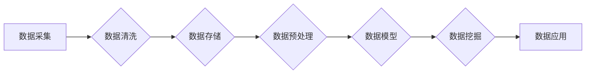

# AI创业：数据管理的实战经验

> 关键词：人工智能，创业，数据管理，数据治理，数据分析，数据质量，机器学习，深度学习

## 1. 背景介绍

随着人工智能技术的飞速发展，AI创业已经成为一个热门领域。然而，AI创业的成功不仅仅依赖于先进的算法和技术，数据管理同样至关重要。数据是AI算法的“食物”，没有高质量的数据，再强大的算法也无法发挥其潜力。本文将基于实战经验，探讨AI创业中的数据管理策略，提供一些建议和最佳实践。

### 1.1 问题的由来

在AI创业过程中，数据管理面临以下挑战：

- **数据质量问题**：原始数据可能存在缺失、错误、不一致等问题，影响模型的训练和推理效果。
- **数据隐私和安全问题**：收集和处理数据时，需要遵守相关法律法规，确保数据隐私和安全。
- **数据存储和访问问题**：随着数据量的增长，如何高效存储和访问数据成为一个挑战。
- **数据治理问题**：如何建立有效的数据治理体系，确保数据的一致性、完整性和可靠性。

### 1.2 研究现状

目前，数据管理在AI创业中已成为一个重要议题。许多企业开始关注数据质量、数据安全和数据治理，并采取了一系列措施：

- **数据清洗和预处理**：通过数据清洗工具和预处理方法，提高数据质量。
- **数据加密和脱敏**：采用加密技术保护数据隐私，对敏感数据进行脱敏处理。
- **数据湖和数据仓库**：建立数据湖或数据仓库，实现数据的集中存储和高效访问。
- **数据治理框架**：建立数据治理框架，规范数据管理流程。

### 1.3 研究意义

有效管理数据对于AI创业具有重要意义：

- **提高模型性能**：高质量的数据可以显著提高模型的准确性和鲁棒性。
- **降低成本**：优化数据管理流程可以降低数据存储和处理的成本。
- **确保合规性**：遵守相关法律法规，保护数据隐私和安全。
- **提升竞争力**：数据管理能力是AI创业企业的核心竞争力之一。

### 1.4 本文结构

本文将围绕数据管理在AI创业中的应用，展开以下内容：

- 介绍数据管理中的核心概念和流程。
- 分析数据管理的算法原理和操作步骤。
- 通过数学模型和公式阐述数据管理的理论基础。
- 提供数据管理项目实践的代码实例和分析。
- 探讨数据管理在实际应用场景中的案例和未来发展趋势。
- 推荐数据管理相关的学习资源、开发工具和论文。

## 2. 核心概念与联系

### 2.1 数据管理核心概念

- **数据质量**：数据是否符合特定标准和要求，包括准确性、完整性、一致性、及时性和可靠性。
- **数据隐私**：保护个人隐私，防止数据泄露和滥用。
- **数据安全**：防止数据被非法访问、篡改和破坏。
- **数据存储**：数据的存储方式、存储介质和存储架构。
- **数据访问**：用户如何获取和使用数据。
- **数据治理**：建立数据管理流程和规范，确保数据的一致性、完整性和可靠性。

### 2.2 Mermaid 流程图



### 2.3 数据管理流程

1. 数据采集：从各种来源收集数据，包括内部数据和外部数据。
2. 数据清洗：去除数据中的噪声和异常值，提高数据质量。
3. 数据存储：将数据存储在合适的存储系统中，如数据库、数据湖等。
4. 数据预处理：对数据进行格式转换、特征工程等操作，为后续分析做好准备。
5. 数据模型：建立数据模型，如关系型数据库模型、NoSQL模型等。
6. 数据挖掘：使用机器学习和深度学习算法挖掘数据中的知识。
7. 数据应用：将挖掘到的知识应用于实际业务场景。

## 3. 核心算法原理 & 具体操作步骤

### 3.1 算法原理概述

数据管理涉及多种算法和技术，主要包括：

- **数据清洗算法**：如删除重复项、填补缺失值、异常值检测和修正等。
- **数据预处理算法**：如特征选择、特征提取、特征缩放等。
- **数据存储算法**：如索引、查询优化、分布式存储等。
- **数据挖掘算法**：如聚类、分类、关联规则挖掘等。
- **机器学习算法**：如线性回归、决策树、支持向量机等。
- **深度学习算法**：如卷积神经网络、循环神经网络、长短期记忆网络等。

### 3.2 算法步骤详解

1. 数据清洗：对采集到的数据进行初步清洗，去除重复项、异常值等。
2. 数据预处理：对清洗后的数据进行特征工程，提取有用信息，并进行数据转换。
3. 数据存储：将预处理后的数据存储到数据库或数据湖中。
4. 数据挖掘：使用机器学习或深度学习算法对数据进行挖掘，提取知识。
5. 数据应用：将挖掘到的知识应用于实际业务场景，如推荐系统、智能客服等。

### 3.3 算法优缺点

- **数据清洗算法**：优点是简单易行，缺点是可能丢失有用信息。
- **数据预处理算法**：优点是提高数据质量，缺点是可能引入偏差。
- **数据存储算法**：优点是提高数据访问效率，缺点是存储成本高。
- **数据挖掘算法**：优点是发现数据中的模式，缺点是结果可能不可解释。
- **机器学习算法**：优点是自动化，缺点是可能过拟合。
- **深度学习算法**：优点是模型复杂度更高，缺点是计算成本高。

### 3.4 算法应用领域

数据管理算法在AI创业中应用广泛，如：

- **推荐系统**：利用用户行为数据推荐商品或服务。
- **智能客服**：利用自然语言处理技术自动回答用户问题。
- **欺诈检测**：利用异常检测算法识别欺诈行为。
- **文本分类**：对文本数据进行自动分类，如新闻分类、情感分析等。

## 4. 数学模型和公式 & 详细讲解 & 举例说明

### 4.1 数学模型构建

数据管理中的数学模型主要包括：

- **数据清洗模型**：如k最近邻算法（k-NN）用于异常值检测。
- **数据预处理模型**：如主成分分析（PCA）用于特征降维。
- **数据挖掘模型**：如决策树模型用于分类。

### 4.2 公式推导过程

以下以k最近邻算法为例，介绍公式推导过程：

假设数据集中有N个数据点，每个数据点有D个特征，目标是为新数据点 $x$ 找到最相似的 $k$ 个邻居，并根据这些邻居的标签预测 $x$ 的标签。

1. 计算新数据点 $x$ 与数据集中每个数据点的距离：
   $$
   d(x, x_i) = \sqrt{(x_1 - x_{1i})^2 + (x_2 - x_{2i})^2 + \cdots + (x_D - x_{Di})^2}
   $$
2. 对距离进行排序，找到最接近的 $k$ 个邻居：
   $$
   d(x, x_1) \leq d(x, x_2) \leq \cdots \leq d(x, x_k)
   $$
3. 根据这 $k$ 个邻居的标签投票，预测新数据点 $x$ 的标签：
   $$
   \hat{y}(x) = \text{mode}(\{y_1, y_2, \cdots, y_k\})
   $$

### 4.3 案例分析与讲解

以下以文本分类任务为例，讲解数据管理在AI创业中的应用：

1. **数据采集**：从新闻网站、社交媒体等渠道收集大量文本数据。
2. **数据清洗**：去除停用词、标点符号等无用信息，进行词性标注等。
3. **数据预处理**：将文本数据转换为向量表示，如TF-IDF向量或Word2Vec向量。
4. **数据存储**：将预处理后的数据存储到数据库或数据湖中。
5. **数据挖掘**：使用文本分类算法，如朴素贝叶斯、支持向量机等，对文本数据进行分类。
6. **数据应用**：将分类结果用于新闻推荐、舆情监测等场景。

## 5. 项目实践：代码实例和详细解释说明

### 5.1 开发环境搭建

1. 安装Python和pip。
2. 安装必要的库：如NumPy、Pandas、Scikit-learn、Jieba等。

### 5.2 源代码详细实现

以下是一个简单的文本分类任务代码示例：

```python
import jieba
from sklearn.feature_extraction.text import TfidfVectorizer
from sklearn.model_selection import train_test_split
from sklearn.naive_bayes import MultinomialNB

# 数据准备
texts = ["我喜欢编程", "我热爱AI", "今天天气真好"]
labels = [0, 1, 2]

# 分词
jieba.enable_parallel(4)
texts = [jieba.cut(text) for text in texts]

# 转换为TF-IDF向量
vectorizer = TfidfVectorizer()
X = vectorizer.fit_transform(texts)

# 划分训练集和测试集
X_train, X_test, y_train, y_test = train_test_split(X, labels, test_size=0.2, random_state=42)

# 训练模型
model = MultinomialNB()
model.fit(X_train, y_train)

# 评估模型
print("Test accuracy:", model.score(X_test, y_test))
```

### 5.3 代码解读与分析

- 使用Jieba进行中文分词。
- 使用TF-IDFVectorizer将文本数据转换为向量表示。
- 使用朴素贝叶斯模型进行分类。
- 评估模型在测试集上的准确率。

### 5.4 运行结果展示

假设测试集的准确率为80%，说明模型能够较好地识别文本类别。

## 6. 实际应用场景

### 6.1 智能推荐系统

基于数据管理技术，可以构建智能推荐系统，为用户推荐感兴趣的商品、服务或内容。

### 6.2 舆情分析

利用数据管理技术，可以对社交媒体、新闻网站等渠道的文本数据进行舆情分析，了解公众对特定事件或产品的看法。

### 6.3 欺诈检测

通过数据管理技术，可以构建欺诈检测系统，识别和防范欺诈行为。

### 6.4 文本分类

利用数据管理技术，可以对文本数据进行自动分类，如新闻分类、情感分析等。

## 7. 工具和资源推荐

### 7.1 学习资源推荐

1. 《数据科学入门》
2. 《机器学习实战》
3. 《深度学习》
4. 《Scikit-learn用户指南》

### 7.2 开发工具推荐

1. Python编程语言
2. Jupyter Notebook
3. PyCharm
4. Scikit-learn
5. TensorFlow

### 7.3 相关论文推荐

1. "TensorFlow: Large-Scale Machine Learning on Heterogeneous Systems"
2. "Distributed Deep Learning with TensorFlow"
3. "Scikit-learn: Machine Learning in Python"
4. "Fast.ai: Practical Deep Learning for Coders"

## 8. 总结：未来发展趋势与挑战

### 8.1 研究成果总结

本文从数据管理的角度，探讨了AI创业中的实战经验。通过介绍数据管理的核心概念、算法原理、项目实践和实际应用场景，为AI创业者提供了数据管理的理论指导和实践参考。

### 8.2 未来发展趋势

1. **数据管理技术将进一步发展**：随着技术的发展，数据管理技术将更加成熟，如自动化数据清洗、自动化特征工程等。
2. **数据治理将更加规范**：随着数据隐私和安全法规的完善，数据治理将变得更加规范。
3. **数据驱动型组织将越来越多**：越来越多的企业将数据视为重要的资产，并建立数据驱动型组织。

### 8.3 面临的挑战

1. **数据质量和隐私安全**：如何保证数据质量和隐私安全是一个重要挑战。
2. **数据治理**：如何建立有效的数据治理体系，确保数据的一致性、完整性和可靠性。
3. **技术门槛**：数据管理技术具有一定的技术门槛，需要专业人才。

### 8.4 研究展望

1. **数据治理框架**：研究更加完善的数据治理框架，规范数据管理流程。
2. **数据质量评估**：研究数据质量评估方法，提高数据质量。
3. **数据安全**：研究数据安全技术，保护数据隐私和安全。

## 9. 附录：常见问题与解答

**Q1：数据管理在AI创业中的重要性是什么？**

A：数据管理是AI创业的基础，没有高质量的数据，再强大的算法也无法发挥其潜力。

**Q2：如何保证数据质量？**

A：可以通过数据清洗、数据预处理等方法保证数据质量。

**Q3：数据治理是什么？**

A：数据治理是指建立数据管理流程和规范，确保数据的一致性、完整性和可靠性。

**Q4：如何进行数据安全防护？**

A：可以通过数据加密、数据脱敏等方法进行数据安全防护。

**Q5：如何进行数据挖掘？**

A：可以使用机器学习、深度学习等技术进行数据挖掘。

作者：禅与计算机程序设计艺术 / Zen and the Art of Computer Programming