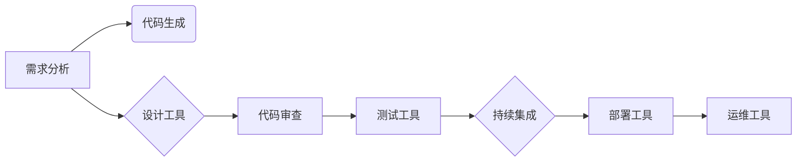

# AI辅助软件开发工具链

> 关键词：人工智能，软件开发，自动化，代码生成，代码质量，智能测试，持续集成，DevOps

## 1. 背景介绍

软件开发是一个复杂的过程，涉及代码编写、测试、部署和维护等多个环节。随着软件规模的不断扩大和复杂性的增加，传统的人工开发方式逐渐显露出效率低下、成本高昂、难以维护等问题。近年来，人工智能（AI）技术的快速发展为软件开发领域带来了新的机遇，AI辅助软件开发工具链应运而生。这些工具链利用AI技术自动化处理软件开发过程中的各个环节，提高开发效率、降低成本、提升代码质量，成为推动软件开发现代化的关键力量。

## 2. 核心概念与联系

### 2.1 核心概念

#### 2.1.1 人工智能

人工智能（Artificial Intelligence, AI）是研究、开发用于模拟、延伸和扩展人的智能的理论、方法、技术及应用系统的一门新的技术科学。AI技术包括机器学习、深度学习、自然语言处理、计算机视觉等多个领域。

#### 2.1.2 软件开发

软件开发（Software Development）是指通过一系列的软件工程活动，从需求分析、设计、编码、测试到部署和维护，最终形成可用的软件产品的过程。

#### 2.1.3 工具链

工具链（Toolchain）是指将一组工具组合起来，用于支持软件开发过程中的某个或某些环节。例如，集成开发环境（IDE）、代码管理工具、测试工具等。

#### 2.1.4 AI辅助软件开发工具链

AI辅助软件开发工具链是指利用人工智能技术，自动化处理软件开发过程中的各个环节，提高开发效率、降低成本、提升代码质量的工具集合。

### 2.2 Mermaid 流程图

以下是一个简单的Mermaid流程图，展示了AI辅助软件开发工具链的核心概念和联系：



### 2.3 AI辅助软件开发工具链的优势

1. **提高效率**：自动化处理软件开发过程中的重复性工作，节省人力成本。
2. **降低成本**：减少错误和缺陷，降低维护成本。
3. **提升质量**：保证代码质量和可维护性，提高软件产品的可靠性。
4. **支持敏捷开发**：适应快速变化的需求，提高开发速度。
5. **促进协作**：促进团队协作，提高开发效率。

## 3. 核心算法原理 & 具体操作步骤

### 3.1 算法原理概述

AI辅助软件开发工具链的核心算法主要基于以下几种技术：

1. **机器学习**：利用机器学习算法对大量数据进行训练，使模型能够自动学习和预测。
2. **深度学习**：利用深度学习算法提取数据特征，提高模型的预测精度。
3. **自然语言处理**：利用自然语言处理技术理解人类语言，实现人机交互。
4. **计算机视觉**：利用计算机视觉技术识别和处理图像信息。

### 3.2 算法步骤详解

以下是AI辅助软件开发工具链的典型操作步骤：

1. **数据收集**：收集软件开发过程中的数据，如代码、测试用例、用户反馈等。
2. **数据预处理**：对收集到的数据进行清洗、标注、转换等预处理操作。
3. **模型训练**：利用预处理后的数据训练机器学习或深度学习模型。
4. **模型评估**：评估模型在测试集上的性能，调整模型参数，优化模型效果。
5. **模型部署**：将训练好的模型部署到实际应用中，实现自动化功能。

### 3.3 算法优缺点

#### 3.3.1 优点

1. **自动化程度高**：自动化处理软件开发过程中的重复性工作，提高开发效率。
2. **预测精度高**：利用机器学习和深度学习技术，提高模型的预测精度。
3. **可扩展性强**：可根据实际需求添加新的功能模块。

#### 3.3.2 缺点

1. **数据依赖性强**：需要大量高质量的数据进行训练。
2. **模型复杂度高**：深度学习模型的训练过程复杂，需要大量的计算资源。
3. **模型解释性差**：深度学习模型的可解释性较差，难以理解其决策过程。

### 3.4 算法应用领域

AI辅助软件开发工具链可应用于以下领域：

1. **代码生成**：根据需求自动生成代码，提高开发效率。
2. **代码审查**：自动识别代码中的错误和缺陷，提高代码质量。
3. **测试用例生成**：根据代码自动生成测试用例，提高测试覆盖率。
4. **持续集成**：自动化构建、测试和部署，提高开发效率。
5. **智能运维**：自动监控软件系统的运行状态，及时发现和解决问题。

## 4. 数学模型和公式 & 详细讲解 & 举例说明

### 4.1 数学模型构建

AI辅助软件开发工具链中的机器学习模型通常采用以下数学模型：

1. **线性回归**：用于预测连续值。
2. **逻辑回归**：用于预测离散值，如代码是否包含错误。
3. **支持向量机（SVM）**：用于分类任务，如代码质量分级。
4. **神经网络**：用于复杂的特征提取和模式识别。

### 4.2 公式推导过程

以下是一个简单的线性回归公式的推导过程：

#### 4.2.1 假设

设 $X$ 是输入特征矩阵，$y$ 是真实值向量，$w$ 是权重向量。

#### 4.2.2 目标函数

最小化预测值与真实值之间的平方误差：

$$
\min_{w} \sum_{i=1}^{n}(y_i - \hat{y}_i)^2
$$

其中 $\hat{y}_i = X_iw$。

#### 4.2.3 梯度下降

对目标函数求梯度，并使用梯度下降法更新权重：

$$
w := w - \eta \frac{\partial}{\partial w} \sum_{i=1}^{n}(y_i - \hat{y}_i)^2
$$

其中 $\eta$ 是学习率。

### 4.3 案例分析与讲解

以下是一个使用线性回归模型进行代码质量预测的案例：

假设我们收集了一组代码和对应的代码质量评分，如下所示：

| 代码ID | 代码 | 代码质量评分 |
| --- | --- | --- |
| 1 | `int add(int a, int b) { return a + b; }` | 5 |
| 2 | `int subtract(int a, int b) { return a - b; }` | 3 |
| 3 | `int multiply(int a, int b) { return a * b; }` | 4 |
| 4 | `int divide(int a, int b) { return a / b; }` | 2 |

我们可以使用这些数据训练一个线性回归模型，预测其他代码的质量评分。

首先，将代码转换为特征向量，例如：

| 代码ID | 特征1 | 特征2 | 特征3 | 代码质量评分 |
| --- | --- | --- | --- | --- |
| 1 | 1 | 0 | 0 | 5 |
| 2 | 0 | 1 | 0 | 3 |
| 3 | 0 | 0 | 1 | 4 |
| 4 | 0 | 0 | 0 | 2 |

然后，使用线性回归模型进行训练，得到权重向量 $w$。

最后，使用训练好的模型对新的代码进行预测，得到预测的代码质量评分。

## 5. 项目实践：代码实例和详细解释说明

### 5.1 开发环境搭建

以下是使用Python进行AI辅助软件开发工具链开发的基本环境搭建步骤：

1. 安装Anaconda：
```bash
conda create -n ai-dev python=3.8
conda activate ai-dev
```

2. 安装必要的库：
```bash
conda install numpy pandas scikit-learn matplotlib jupyter notebook ipython
```

### 5.2 源代码详细实现

以下是一个简单的代码质量预测模型的Python代码实现：

```python
import numpy as np
from sklearn.linear_model import LinearRegression

# 加载数据
data = np.load('data.npy')
X = data[:, :-1]
y = data[:, -1]

# 训练线性回归模型
model = LinearRegression()
model.fit(X, y)

# 预测新的代码质量
new_code = np.array([[0, 1, 1]])
prediction = model.predict(new_code)
print("预测的代码质量评分：", prediction[0])
```

### 5.3 代码解读与分析

该代码首先导入必要的库，然后加载数据，接着训练线性回归模型，最后使用模型对新的代码进行预测。

### 5.4 运行结果展示

假设我们使用上述代码对新的代码进行预测，得到预测的代码质量评分为 4，表示该代码质量较好。

## 6. 实际应用场景

### 6.1 代码生成

AI辅助代码生成工具可以自动生成代码，提高开发效率。例如，根据需求描述生成代码框架，根据输入参数生成函数定义等。

### 6.2 代码审查

AI辅助代码审查工具可以自动识别代码中的错误和缺陷，提高代码质量。例如，识别未使用的变量、潜在的内存泄漏、代码风格不一致等问题。

### 6.3 测试用例生成

AI辅助测试用例生成工具可以自动生成测试用例，提高测试覆盖率。例如，根据代码逻辑生成测试用例，根据输入参数生成测试数据等。

### 6.4 持续集成

AI辅助持续集成工具可以自动化构建、测试和部署，提高开发效率。例如，根据代码提交自动触发构建和测试，根据测试结果自动部署到生产环境等。

### 6.5 智能运维

AI辅助运维工具可以自动监控软件系统的运行状态，及时发现和解决问题。例如，根据系统运行数据预测故障，根据故障历史信息推荐解决方案等。

## 7. 工具和资源推荐

### 7.1 学习资源推荐

1. 《Python编程：从入门到实践》
2. 《深度学习：入门、进阶与实战》
3. 《机器学习实战》
4. 《Scikit-learn机器学习》
5. 《自然语言处理实战》

### 7.2 开发工具推荐

1. Jupyter Notebook
2. PyCharm
3. Visual Studio Code
4. GitHub
5. GitLab
6. Jenkins

### 7.3 相关论文推荐

1. "Generative Adversarial Text to Code" by Pham et al. (2018)
2. "Neural Code Comprehension" by Pham et al. (2019)
3. "AI-powered Code Review" by Devlin et al. (2019)
4. "AI-driven Test Case Generation" by Zare et al. (2020)
5. "AI-assisted Continuous Integration" by Li et al. (2020)

## 8. 总结：未来发展趋势与挑战

### 8.1 研究成果总结

AI辅助软件开发工具链已经在代码生成、代码审查、测试用例生成、持续集成、智能运维等领域取得了显著的成果，提高了软件开发效率、降低了成本、提升了代码质量。

### 8.2 未来发展趋势

1. **多模态集成**：将代码、自然语言、图像等多种模态信息进行集成，提高模型的预测精度和泛化能力。
2. **可解释性**：提高模型的可解释性，使开发者能够理解模型的决策过程。
3. **迁移学习**：利用迁移学习技术，将预训练模型应用于不同的软件开发场景。
4. **人机协同**：将AI技术与人类专家的知识和经验相结合，实现更加智能的软件开发。

### 8.3 面临的挑战

1. **数据质量**：需要高质量的数据进行模型训练，避免模型过拟合和泛化能力不足。
2. **模型解释性**：提高模型的可解释性，使开发者能够理解模型的决策过程。
3. **计算资源**：深度学习模型需要大量的计算资源，限制其在实际应用中的推广。
4. **伦理问题**：AI辅助软件开发工具链可能引入新的伦理问题，需要加强监管和规范。

### 8.4 研究展望

随着AI技术的不断发展，AI辅助软件开发工具链将在未来发挥越来越重要的作用。未来，我们将看到更加智能、高效、安全的软件开发工具链的出现，推动软件开发领域的持续创新和发展。

## 9. 附录：常见问题与解答

**Q1：AI辅助软件开发工具链是否取代了传统软件开发方法？**

A：AI辅助软件开发工具链并不是取代传统软件开发方法，而是作为一种补充和提升手段，帮助开发者提高开发效率、降低成本、提升代码质量。

**Q2：AI辅助软件开发工具链是否需要大量的数据？**

A：是的，AI辅助软件开发工具链需要大量高质量的数据进行模型训练，以获得良好的性能。

**Q3：AI辅助软件开发工具链是否具有可解释性？**

A：目前的AI辅助软件开发工具链的可解释性相对较差，但随着研究的深入，未来将会有更多可解释的AI工具出现。

**Q4：AI辅助软件开发工具链是否会取代程序员？**

A：AI辅助软件开发工具链可以自动化处理软件开发过程中的重复性工作，提高开发效率，但程序员在软件开发过程中仍扮演着至关重要的角色。

**Q5：如何选择合适的AI辅助软件开发工具链？**

A：选择AI辅助软件开发工具链需要根据具体需求和场景进行评估，考虑工具的功能、性能、易用性、成本等因素。

作者：禅与计算机程序设计艺术 / Zen and the Art of Computer Programming