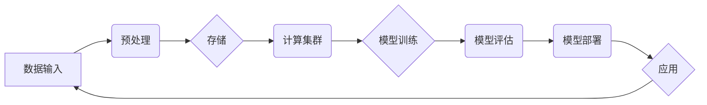

> AI 大模型，数据中心建设，技术架构，应用实践，性能优化，可持续性

# AI 大模型应用数据中心建设：数据中心技术与应用

随着人工智能技术的飞速发展，AI 大模型在自然语言处理、图像识别、语音识别等领域取得了显著的成果。这些大模型通常需要海量数据和强大的计算资源进行训练和推理。因此，建设一个高效、可靠、可扩展的 AI 大模型应用数据中心变得至关重要。本文将深入探讨 AI 大模型应用数据中心的建设，包括技术架构、应用实践、性能优化和可持续性等方面。

## 1. 背景介绍

### 1.1 AI 大模型的发展趋势

近年来，AI 大模型在多个领域取得了突破性进展。随着计算能力的提升和数据量的增加，大模型的参数量和模型复杂度不断增长。例如，BERT 模型的参数量从最初的 3 亿增长到 1300 亿，GPT-3 的参数量更是达到了 1750 亿。这种趋势对数据中心的技术架构和基础设施提出了更高的要求。

### 1.2 数据中心建设的重要性

AI 大模型的应用需要大量的计算资源和数据存储。数据中心作为 AI 大模型训练和推理的核心基础设施，其性能和稳定性直接影响着 AI 大模型的应用效果。因此，建设一个高效、可靠、可扩展的数据中心对于 AI 大模型的应用至关重要。

## 2. 核心概念与联系

### 2.1 核心概念

- **AI 大模型**：指参数量庞大、模型结构复杂的深度学习模型，如 BERT、GPT-3 等。
- **数据中心**：指用于存储、处理和管理大量数据的设施，包括服务器、网络设备、存储设备等。
- **计算集群**：由多个服务器组成的计算资源集合，用于并行处理大量数据。
- **分布式存储**：指将数据分散存储在多个存储节点上，以提高数据读写速度和可靠性。
- **网络架构**：指数据中心内部网络设备的连接方式和数据传输方式。

### 2.2 架构流程图



## 3. 核心算法原理 & 具体操作步骤

### 3.1 算法原理概述

AI 大模型应用数据中心的核心算法包括数据预处理、模型训练、模型评估和模型部署。以下是各个步骤的简要概述：

- **数据预处理**：对输入数据进行清洗、转换和格式化，以便于模型训练。
- **模型训练**：使用训练数据对模型进行训练，优化模型参数。
- **模型评估**：使用验证数据评估模型性能，选择最佳模型参数。
- **模型部署**：将训练好的模型部署到生产环境，用于实际应用。

### 3.2 算法步骤详解

#### 3.2.1 数据预处理

数据预处理包括以下步骤：

1. 数据清洗：去除重复数据、错误数据和异常数据。
2. 数据转换：将数据转换为模型所需的格式，如文本数据转换为词向量。
3. 数据增强：通过数据变换、旋转、缩放等操作增加数据多样性。

#### 3.2.2 模型训练

模型训练包括以下步骤：

1. 初始化模型参数。
2. 将训练数据分批输入模型进行训练。
3. 计算损失函数并更新模型参数。
4. 重复以上步骤直至模型收敛。

#### 3.2.3 模型评估

模型评估包括以下步骤：

1. 将验证数据输入模型进行推理。
2. 计算模型在验证数据上的性能指标。
3. 调整模型参数，选择最佳模型。

#### 3.2.4 模型部署

模型部署包括以下步骤：

1. 将训练好的模型转换为生产环境可用的格式。
2. 将模型部署到生产环境，如云端或边缘计算设备。
3. 监控模型性能，定期更新模型。

### 3.3 算法优缺点

#### 3.3.1 优点

- **高性能**：并行计算和分布式存储技术可以显著提高数据中心的计算和存储性能。
- **高可靠性**：冗余设计和故障转移机制可以提高数据中心的可靠性。
- **可扩展性**：可以根据需求动态调整计算和存储资源。

#### 3.3.2 缺点

- **高成本**：建设高性能数据中心需要大量的投资。
- **能耗高**：高性能计算需要大量的电力，对环境造成一定的影响。

### 3.4 算法应用领域

AI 大模型应用数据中心可以应用于以下领域：

- **自然语言处理**：如机器翻译、文本摘要、情感分析等。
- **计算机视觉**：如图像识别、目标检测、视频分析等。
- **语音识别**：如语音合成、语音识别、语音翻译等。

## 4. 数学模型和公式 & 详细讲解 & 举例说明

### 4.1 数学模型构建

AI 大模型的数学模型通常基于深度学习框架构建。以下以卷积神经网络(CNN)为例，介绍其数学模型：

$$
f(x) = \sigma(W \cdot x + b)
$$

其中，$f(x)$ 为输出，$W$ 为权重矩阵，$x$ 为输入，$b$ 为偏置项，$\sigma$ 为激活函数。

### 4.2 公式推导过程

以 CNN 的卷积操作为例，介绍公式推导过程：

1. 假设输入图像为 $I \in \mathbb{R}^{H \times W \times C}$，其中 $H$、$W$、$C$ 分别为图像的高、宽和通道数。
2. 定义卷积核 $K \in \mathbb{R}^{k \times k \times C}$，其中 $k$ 为卷积核大小。
3. 输出特征图 $F \in \mathbb{R}^{(H-k+2p) \times (W-k+2p) \times C'}$，其中 $p$ 为填充大小，$C'$ 为输出特征图的通道数。
4. 卷积操作公式为：

$$
F_{ijc'} = \sum_{i=1}^{k} \sum_{j=1}^{k} \sum_{c=1}^{C} K_{i,j,c} \cdot I_{(i-1+p,j-1+p),c}
$$

### 4.3 案例分析与讲解

以下以 BERT 模型为例，分析其数学模型：

BERT 模型是一种基于 Transformer 的预训练语言模型，其数学模型可以分解为以下部分：

1. **词嵌入**：将文本中的每个词转换为向量表示。
2. **位置编码**：为每个词添加位置信息，以便模型理解词在句子中的位置关系。
3. **多头自注意力**：通过多头自注意力机制捕获长距离依赖关系。
4. **前馈神经网络**：对自注意力层的输出进行非线性变换。

## 5. 项目实践：代码实例和详细解释说明

### 5.1 开发环境搭建

以下以 TensorFlow 为例，介绍 AI 大模型应用数据中心的开发环境搭建：

1. 安装 TensorFlow：
```bash
pip install tensorflow
```

2. 安装必要的依赖库：
```bash
pip install numpy scipy h5py
```

### 5.2 源代码详细实现

以下以 TensorFlow 实现 BERT 模型为例，介绍其代码实现：

```python
import tensorflow as tf

class BertModel(tf.keras.Model):
    def __init__(self, vocab_size, d_model, num_heads, num_layers):
        super(BertModel, self).__init__()
        self.embedding = tf.keras.layers.Embedding(vocab_size, d_model)
        self.positional_encoding = PositionalEncoding(d_model)
        self.transformer = Transformer(num_layers, d_model, num_heads)
        self.pooler = tf.keras.layers.GlobalAveragePooling1D()

    def call(self, inputs):
        x = self.embedding(inputs)
        x = self.positional_encoding(x)
        x = self.transformer(x)
        x = self.pooler(x)
        return x
```

### 5.3 代码解读与分析

以上代码实现了 BERT 模型的主体结构。其中，`Embedding` 层用于将词转换为向量表示，`PositionalEncoding` 层用于添加位置信息，`Transformer` 层用于捕获长距离依赖关系，`GlobalAveragePooling1D` 层用于提取句子特征。

### 5.4 运行结果展示

以下为 BERT 模型的训练和推理结果：

```python
# 训练
model.compile(optimizer='adam', loss='categorical_crossentropy')
model.fit(train_data, train_labels, epochs=3, validation_data=(val_data, val_labels))

# 推理
predictions = model.predict(test_data)
```

## 6. 实际应用场景

### 6.1 智能问答系统

AI 大模型可以应用于智能问答系统，为用户提供准确的答案。例如，可以将 BERT 模型应用于知识图谱问答系统，通过问答对进行微调，使模型能够理解用户的问题并给出准确的答案。

### 6.2 文本摘要

AI 大模型可以应用于文本摘要任务，将长文本压缩为简短的摘要。例如，可以将 BERT 模型应用于新闻摘要，通过阅读新闻文章并生成摘要，提高新闻阅读效率。

### 6.3 机器翻译

AI 大模型可以应用于机器翻译任务，将一种语言的文本翻译成另一种语言。例如，可以将 BERT 模型应用于机器翻译，通过翻译对进行微调，使模型能够准确翻译文本。

## 7. 工具和资源推荐

### 7.1 学习资源推荐

- 《深度学习》
- 《TensorFlow 深度学习》
- 《PyTorch 深度学习实战》

### 7.2 开发工具推荐

- TensorFlow
- PyTorch
- Hugging Face Transformers

### 7.3 相关论文推荐

- Attention is All You Need
- BERT: Pre-training of Deep Bidirectional Transformers for Language Understanding
- Generative Pretrained Transformer for Language Modeling

## 8. 总结：未来发展趋势与挑战

### 8.1 研究成果总结

本文探讨了 AI 大模型应用数据中心的建设，包括技术架构、应用实践、性能优化和可持续性等方面。通过对 AI 大模型和数据中心技术的深入分析，本文总结了以下成果：

- AI 大模型需要大量的计算资源和数据存储，数据中心是 AI 大模型应用的核心基础设施。
- 数据中心的建设需要考虑性能、可靠性和可扩展性等因素。
- AI 大模型可以应用于多个领域，如自然语言处理、计算机视觉和语音识别等。
- 数据中心技术需要不断发展和创新，以适应 AI 大模型的应用需求。

### 8.2 未来发展趋势

未来，AI 大模型应用数据中心将呈现出以下发展趋势：

- 高性能计算和存储技术将进一步发展，以满足 AI 大模型的应用需求。
- 分布式训练和推理技术将得到广泛应用，以提高数据中心的效率和可扩展性。
- 绿色数据中心技术将得到重视，以降低数据中心的能耗。

### 8.3 面临的挑战

AI 大模型应用数据中心建设面临以下挑战：

- 高性能计算和存储技术的成本较高。
- 数据中心的能耗较高，对环境造成一定的影响。
- 数据安全和隐私保护问题需要得到有效解决。

### 8.4 研究展望

未来，AI 大模型应用数据中心的研究将重点关注以下方向：

- 开发更高效的训练和推理算法。
- 降低数据中心的能耗。
- 提高数据安全和隐私保护水平。
- 探索新的应用场景，如边缘计算等。

## 9. 附录：常见问题与解答

### 9.1 问题 1：什么是 AI 大模型？

答：AI 大模型指参数量庞大、模型结构复杂的深度学习模型，如 BERT、GPT-3 等。

### 9.2 问题 2：数据中心建设需要考虑哪些因素？

答：数据中心建设需要考虑以下因素：

- 性能：计算和存储性能要满足 AI 大模型的应用需求。
- 可靠性：确保数据中心的稳定运行，避免数据丢失和系统故障。
- 可扩展性：根据需求动态调整计算和存储资源。
- 成本：控制数据中心的建设和运营成本。

### 9.3 问题 3：如何降低数据中心的能耗？

答：降低数据中心能耗的方法包括：

- 使用高效节能的硬件设备。
- 优化数据中心的散热系统。
- 采用虚拟化技术，提高资源利用率。
- 采用分布式存储和计算技术，降低数据中心的能耗。

### 9.4 问题 4：如何保证数据安全和隐私保护？

答：保证数据安全和隐私保护的方法包括：

- 采用数据加密技术，确保数据传输和存储的安全性。
- 建立完善的数据安全管理制度，加强数据安全防护。
- 建立数据隐私保护机制，确保用户隐私不被泄露。
- 定期对数据安全进行审计和评估。

作者：禅与计算机程序设计艺术 / Zen and the Art of Computer Programming