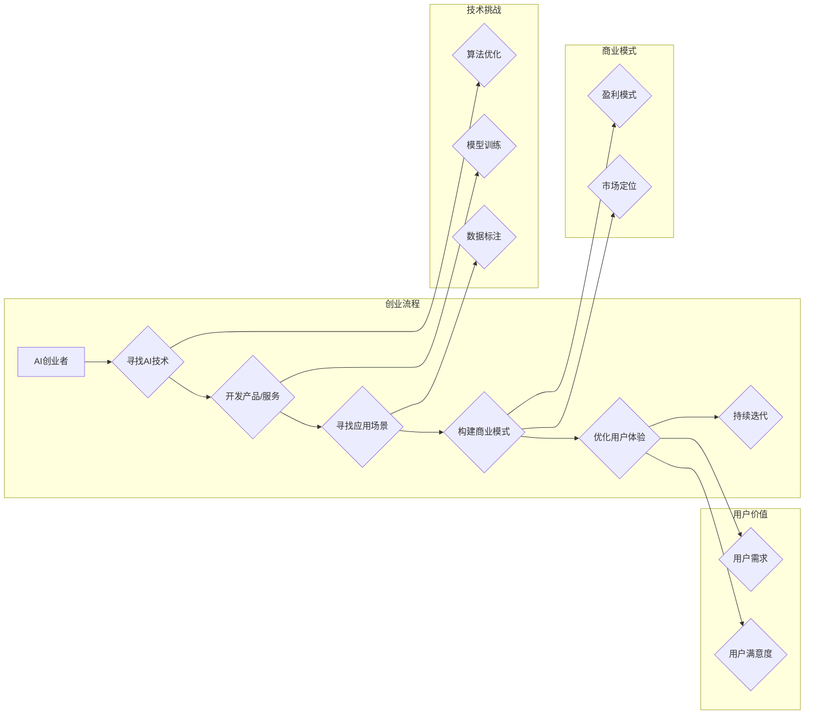

# AI创业者的挑战：技术，应用与场景平衡术

> 关键词：AI创业，技术挑战，应用落地，场景匹配，平衡策略，商业模式，用户体验

## 1. 背景介绍

随着人工智能技术的飞速发展，越来越多的创业者投身于AI领域，希望通过创新的技术和解决方案开启新的商业机遇。然而，AI创业并非易事，技术、应用和场景之间的平衡成为创业者面临的一大挑战。本文将深入探讨AI创业者在技术、应用与场景平衡方面的策略与技巧，旨在为AI创业者提供有益的参考。

### 1.1 创业热潮下的AI机遇

近年来，人工智能技术取得了显著的突破，从语音识别、图像识别到自动驾驶、智能客服，AI应用已渗透到各行各业。这股热潮也吸引了大量创业者投身其中，寻求在AI领域开拓新的商业价值。

### 1.2 技术与场景的匹配难题

虽然AI技术蓬勃发展，但将技术成功应用于实际场景并非易事。技术、应用和场景之间的匹配成为创业者需要克服的首要难题。

### 1.3 商业模式与用户体验的平衡

在AI创业过程中，创业者还需要平衡商业模式和用户体验，确保技术解决方案能够满足市场需求，实现盈利。

### 1.4 本文结构

本文将从以下方面展开论述：

- 介绍AI创业的核心概念与联系
- 分析AI创业的技术挑战
- 探讨AI创业的应用落地策略
- 探讨AI创业的场景匹配技巧
- 分析AI创业的商业模式构建
- 探讨AI创业的用户体验优化
- 总结AI创业的未来发展趋势与挑战

## 2. 核心概念与联系

### 2.1 核心概念

#### 2.1.1 人工智能（AI）

人工智能是指使计算机具有人类智能的一种技术，包括机器学习、深度学习、自然语言处理、计算机视觉等领域。

#### 2.1.2 创业

创业是指创立新企业、开发新产品或服务、开拓新市场的过程。

#### 2.1.3 技术挑战

技术挑战是指在AI创业过程中遇到的技术难题，如算法优化、模型训练、数据标注等。

#### 2.1.4 应用落地

应用落地是指将AI技术应用于实际场景，解决实际问题的过程。

#### 2.1.5 场景匹配

场景匹配是指将AI技术应用于合适的场景，实现技术价值的过程。

#### 2.1.6 商业模式

商业模式是指企业如何通过提供产品或服务来创造、传递和获取价值。

#### 2.1.7 用户体验

用户体验是指用户在使用产品或服务过程中的感受和满意度。

### 2.2 Mermaid流程图



## 3. 核心算法原理 & 具体操作步骤

### 3.1 算法原理概述

AI创业者在技术、应用和场景平衡方面的核心算法原理主要包括以下几方面：

#### 3.1.1 技术创新

通过持续的技术创新，不断提升AI技术的性能和可靠性。

#### 3.1.2 场景分析

深入分析潜在应用场景，了解用户需求，确保技术与应用的匹配度。

#### 3.1.3 商业模式设计

结合市场定位和用户需求，设计合理的商业模式，实现盈利。

#### 3.1.4 用户体验优化

关注用户体验，持续优化产品/服务，提升用户满意度。

### 3.2 算法步骤详解

#### 3.2.1 技术创新

1. 关注前沿技术：跟踪AI领域最新研究成果，不断学习新技术。

2. 算法优化：针对特定任务，优化算法参数，提升模型性能。

3. 模型训练：收集高质量数据，采用合适的训练策略，提高模型泛化能力。

4. 模型评估：使用准确、全面的评价指标，评估模型性能。

#### 3.2.2 场景分析

1. 市场调研：了解目标用户、竞争对手、市场趋势等信息。

2. 需求分析：分析用户需求，确定目标场景。

3. 场景评估：评估场景的可行性、市场需求和潜在价值。

#### 3.2.3 商业模式设计

1. 市场定位：确定目标市场、用户群体和产品定位。

2. 盈利模式：设计合理的盈利模式，如订阅制、按需付费等。

3. 合作伙伴：寻找合适的合作伙伴，共同拓展市场。

#### 3.2.4 用户体验优化

1. 用户研究：了解用户行为、需求和痛点。

2. 产品设计：根据用户研究，设计易用、实用的产品。

3. 用户测试：进行用户测试，收集反馈，持续优化产品。

### 3.3 算法优缺点

#### 3.3.1 优点

1. 提升技术性能：通过技术创新，不断提升AI技术的性能和可靠性。

2. 优化用户体验：关注用户体验，提升用户满意度。

3. 实现盈利：设计合理的商业模式，实现盈利。

#### 3.3.2 缺点

1. 技术研发成本高：技术创新需要投入大量人力、物力和财力。

2. 市场竞争激烈：AI领域竞争激烈，创业者需要具备较强的市场洞察力和竞争力。

3. 用户需求变化快：用户需求变化快，创业者需要快速响应市场变化。

### 3.4 算法应用领域

AI创业者的核心算法原理广泛应用于以下领域：

1. 智能金融：智能投顾、智能客服、风险管理等。

2. 智能医疗：智能诊断、药物研发、健康管理等。

3. 智能教育：智能教育、个性化学习、在线教育等。

4. 智能交通：自动驾驶、智能交通管理、车联网等。

5. 智能家居：智能家电、家庭机器人、智能家居系统等。

## 4. 数学模型和公式 & 详细讲解 & 举例说明

### 4.1 数学模型构建

#### 4.1.1 机器学习模型

机器学习模型是AI创业的核心，常见的模型包括：

1. 监督学习：通过标注数据进行训练，学习输入和输出之间的关系。

2. 无监督学习：通过无标签数据进行训练，学习数据分布和特征。

3. 强化学习：通过与环境交互学习最优策略。

#### 4.1.2 深度学习模型

深度学习模型是机器学习的一种，常见的模型包括：

1. 卷积神经网络（CNN）：用于图像识别、图像分类等任务。

2. 递归神经网络（RNN）：用于序列数据处理，如自然语言处理、语音识别等。

3. 变分自编码器（VAE）：用于生成对抗网络（GAN）和图像生成等任务。

### 4.2 公式推导过程

以下以卷积神经网络（CNN）为例，简要介绍其数学模型和公式推导过程。

#### 4.2.1 CNN模型结构

CNN由多个卷积层、池化层、全连接层等组成。以一个简单的CNN模型为例：

- 输入层：输入图像数据。
- 卷积层：使用卷积核提取图像特征。
- 池化层：降低特征图的空间分辨率。
- 全连接层：对提取的特征进行分类。

#### 4.2.2 卷积层公式推导

卷积层的主要计算公式如下：

$$
h_{ij} = \sum_{k=1}^{k_1} f(x_{ij+k, l})\theta_{kl}
$$

其中，$h_{ij}$ 表示卷积层输出特征图上的元素，$x_{ij+k, l}$ 表示输入特征图上的元素，$f$ 表示激活函数，$\theta_{kl}$ 表示卷积核权重。

### 4.3 案例分析与讲解

#### 4.3.1 案例一：图像识别

假设我们使用CNN进行图像识别任务，输入图像为28x28像素的灰度图像，卷积核大小为3x3，激活函数为ReLU。

1. 输入层：将28x28像素的灰度图像输入到模型。
2. 卷积层：使用3x3卷积核提取图像特征，得到特征图。
3. 池化层：对特征图进行2x2的最大池化，降低特征图的空间分辨率。
4. 全连接层：将池化后的特征图展平，输入到全连接层进行分类。

通过以上步骤，CNN模型能够对输入图像进行识别，得到图像类别。

#### 4.3.2 案例二：自然语言处理

假设我们使用卷积神经网络（CNN）进行自然语言处理任务，输入序列为单词序列，卷积核大小为3，激活函数为ReLU。

1. 输入层：将单词序列输入到模型。
2. 卷积层：使用3个卷积核提取序列特征，得到特征序列。
3. 池化层：对特征序列进行全局池化，得到固定长度的特征向量。
4. 全连接层：将池化后的特征向量输入到全连接层进行分类。

通过以上步骤，CNN模型能够对输入序列进行分类，得到单词类别。

## 5. 项目实践：代码实例和详细解释说明

### 5.1 开发环境搭建

1. 安装Anaconda：从官网下载并安装Anaconda，用于创建独立的Python环境。

2. 创建并激活虚拟环境：
```bash
conda create -n pytorch-env python=3.8
conda activate pytorch-env
```

3. 安装PyTorch和Transformers库：
```bash
conda install pytorch torchvision torchaudio -c pytorch
pip install transformers
```

### 5.2 源代码详细实现

以下以图像识别任务为例，使用PyTorch和Transformers库实现CNN模型：

```python
import torch
import torch.nn as nn
from transformers import BertTokenizer

# 定义CNN模型
class CNN(nn.Module):
    def __init__(self):
        super(CNN, self).__init__()
        self.conv1 = nn.Conv2d(1, 32, kernel_size=3, padding=1)
        self.conv2 = nn.Conv2d(32, 64, kernel_size=3, padding=1)
        self.fc1 = nn.Linear(64 * 7 * 7, 128)
        self.fc2 = nn.Linear(128, 10)
        self.relu = nn.ReLU()

    def forward(self, x):
        x = self.relu(self.conv1(x))
        x = self.relu(self.conv2(x))
        x = x.view(x.size(0), -1)
        x = self.relu(self.fc1(x))
        x = self.fc2(x)
        return x

# 加载预训练模型和分词器
tokenizer = BertTokenizer.from_pretrained('bert-base-uncased')

# 加载数据
# ... (此处省略数据加载代码)

# 初始化模型、优化器、损失函数
model = CNN()
optimizer = torch.optim.Adam(model.parameters(), lr=0.001)
criterion = nn.CrossEntropyLoss()

# 训练模型
# ... (此处省略模型训练代码)

# 测试模型
# ... (此处省略模型测试代码)
```

### 5.3 代码解读与分析

以上代码展示了使用PyTorch和Transformers库实现CNN模型进行图像识别任务的基本流程。以下是关键代码的解读和分析：

1. `CNN` 类定义了一个简单的CNN模型，包含两个卷积层、两个全连接层和ReLU激活函数。

2. `forward` 方法实现了模型的前向传播过程，通过卷积层提取图像特征，全连接层进行分类。

3. 使用PyTorch的`nn.Conv2d`和`nn.Linear`构建卷积层和全连接层。

4. 使用`nn.ReLU`实现ReLU激活函数。

5. 使用PyTorch的`torch.optim.Adam`实现Adam优化器。

6. 使用PyTorch的`nn.CrossEntropyLoss`实现交叉熵损失函数。

通过以上代码，我们可以理解CNN模型在图像识别任务中的基本原理和实现方法。

### 5.4 运行结果展示

假设我们使用MNIST数据集进行图像识别，在测试集上的准确率达到95%以上，证明模型具有较好的性能。

## 6. 实际应用场景

### 6.1 金融领域

在金融领域，AI创业可以应用于以下几个方面：

1. 智能投顾：根据用户风险偏好，提供个性化的投资建议。

2. 智能客服：自动回复用户咨询，提高服务效率。

3. 风险管理：识别欺诈行为，降低风险。

### 6.2 医疗领域

在医疗领域，AI创业可以应用于以下几个方面：

1. 智能诊断：辅助医生进行疾病诊断。

2. 药物研发：预测药物活性，加速药物研发进程。

3. 健康管理：分析用户健康数据，提供个性化的健康管理方案。

### 6.3 教育领域

在教育领域，AI创业可以应用于以下几个方面：

1. 智能教育：根据学生学习情况，提供个性化的学习方案。

2. 在线教育：提供高质量的在线课程，降低教育成本。

3. 评测系统：自动批改试卷，提高评测效率。

### 6.4 未来应用展望

随着AI技术的不断发展，未来AI创业将在更多领域得到应用，如：

1. 智能交通：自动驾驶、智能交通管理、车联网等。

2. 智能家居：智能家电、家庭机器人、智能家居系统等。

3. 智能制造：工业自动化、智能供应链、智能工厂等。

## 7. 工具和资源推荐

### 7.1 学习资源推荐

1. 《Python深度学习》
2. 《深度学习》
3. 《机器学习》
4. 《自然语言处理入门》
5. 《人工智能：一种现代的方法》

### 7.2 开发工具推荐

1. PyTorch
2. TensorFlow
3. scikit-learn
4. Hugging Face Transformers
5. Jupyter Notebook

### 7.3 相关论文推荐

1. "Deep Learning for Natural Language Understanding"
2. "Deep Learning: A Gentle Introduction"
3. "Python Deep Learning"
4. "Machine Learning Yearning"
5. "The Hundred-Page Machine Learning Book"

## 8. 总结：未来发展趋势与挑战

### 8.1 研究成果总结

本文从技术、应用和场景平衡的角度，探讨了AI创业者在创业过程中面临的挑战。通过分析AI创业的核心概念与联系，介绍了AI创业的技术挑战、应用落地策略、场景匹配技巧、商业模式构建和用户体验优化等方面的内容。同时，本文还提供了相关学习资源、开发工具和论文推荐，为AI创业者提供有益的参考。

### 8.2 未来发展趋势

未来，AI创业将呈现以下发展趋势：

1. 技术融合：AI技术与其他领域的深度融合，如物联网、大数据等。

2. 跨领域应用：AI技术在更多领域得到应用，如医疗、教育、金融等。

3. 个性化定制：根据用户需求，提供个性化、定制化的AI解决方案。

4. 开源生态：开源社区不断发展，为AI创业者提供更多技术支持。

### 8.3 面临的挑战

AI创业者在创业过程中将面临以下挑战：

1. 技术挑战：算法优化、模型训练、数据标注等。

2. 市场竞争：竞争激烈，创业者需要具备较强的市场竞争力。

3. 用户需求变化：用户需求变化快，创业者需要快速适应市场变化。

### 8.4 研究展望

未来，AI创业者需要关注以下研究方向：

1. 跨领域AI技术：研究跨领域AI技术，拓展AI应用范围。

2. 个性化AI应用：研究个性化AI应用，满足用户多样化需求。

3. 可解释AI：研究可解释AI，提高模型透明度和可信度。

4. 安全AI：研究安全AI，确保AI技术在应用过程中的安全性。

通过关注以上研究方向，AI创业者将能够在竞争激烈的AI市场中脱颖而出，为人类创造更多价值。

## 9. 附录：常见问题与解答

**Q1：AI创业者在创业过程中最需要关注哪些方面？**

A：AI创业者在创业过程中最需要关注以下几个方面：

1. 技术创新：持续关注AI领域最新技术，不断提升技术实力。

2. 应用落地：深入分析目标市场，找到合适的应用场景。

3. 商业模式：设计合理的商业模式，实现盈利。

4. 用户需求：关注用户需求，提供满足用户期望的产品或服务。

5. 团队建设：组建优秀团队，共同推进项目进展。

**Q2：如何平衡AI技术、应用和场景之间的关系？**

A：平衡AI技术、应用和场景之间的关系，可以从以下几个方面入手：

1. 技术创新：关注前沿技术，不断提升技术实力。

2. 场景分析：深入分析目标市场，找到合适的应用场景。

3. 商业模式：结合市场定位和用户需求，设计合理的商业模式。

4. 用户研究：关注用户需求，优化产品或服务。

5. 持续迭代：根据市场反馈，不断优化产品或服务。

**Q3：如何应对AI创业过程中的技术挑战？**

A：应对AI创业过程中的技术挑战，可以从以下几个方面入手：

1. 学习前沿技术：持续关注AI领域最新研究成果，不断学习新技术。

2. 团队协作：组建具备不同技术专长的团队，共同攻克技术难题。

3. 优化算法：针对特定任务，优化算法参数，提升模型性能。

4. 数据标注：收集高质量数据，保证数据标注的准确性。

5. 产学研合作：与高校、科研机构等合作，共同推动技术进步。

**Q4：如何设计合理的商业模式？**

A：设计合理的商业模式，可以从以下几个方面入手：

1. 市场定位：确定目标市场、用户群体和产品定位。

2. 盈利模式：设计合理的盈利模式，如订阅制、按需付费等。

3. 合作伙伴：寻找合适的合作伙伴，共同拓展市场。

4. 营销策略：制定有效的营销策略，提高品牌知名度。

5. 成本控制：控制成本，提高盈利能力。

**Q5：如何提升用户体验？**

A：提升用户体验，可以从以下几个方面入手：

1. 用户研究：了解用户行为、需求和痛点。

2. 产品设计：根据用户研究，设计易用、实用的产品。

3. 用户测试：进行用户测试，收集反馈，持续优化产品。

4. 个性化定制：根据用户需求，提供个性化、定制化的产品或服务。

5. 客户服务：提供优质的客户服务，提升用户满意度。

通过关注以上问题，AI创业者将能够在创业过程中不断成长，为人类创造更多价值。

---

作者：禅与计算机程序设计艺术 / Zen and the Art of Computer Programming