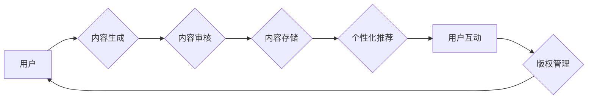

> 关键词：人工智能，出版业，内容生产，个性化推荐，自然语言处理，机器学习，深度学习，语义理解

# AI在出版业的未来：更丰富的场景，更强大的技术

随着人工智能技术的飞速发展，它正在改变着各行各业，出版业也不例外。AI技术为出版业带来了前所未有的机遇，不仅提高了内容生产的效率和质量，还丰富了出版物的形式和体验。本文将探讨AI在出版业的应用现状、未来趋势以及面临的挑战。

## 1. 背景介绍

出版业是一个历史悠久且充满活力的行业，从传统的纸质书籍到电子书，再到如今的数字出版，出版业始终在不断适应新技术，满足读者不断变化的需求。近年来，人工智能技术的发展为出版业带来了新的变革机遇：

- **内容生产效率提升**：AI可以帮助作者和编辑提高内容生产的效率，例如自动生成摘要、翻译、校对等。
- **个性化推荐**：AI可以根据读者的阅读习惯和偏好，为读者推荐个性化的内容。
- **读者互动增强**：AI可以分析读者的反馈，提供更加个性化的阅读体验。
- **版权保护**：AI可以帮助出版社更好地管理版权，降低侵权风险。

## 2. 核心概念与联系

### 2.1 核心概念

以下是AI在出版业中涉及的核心概念：

- **自然语言处理（NLP）**：使计算机能够理解和处理人类语言的技术。
- **机器学习（ML）**：让计算机通过数据学习，从而进行预测或决策的技术。
- **深度学习（DL）**：一种特殊的机器学习技术，使用深层神经网络来学习数据中的复杂模式。
- **语义理解**：让计算机理解语言中的含义，而不仅仅是表面文字。
- **内容审核**：使用AI技术自动检测和过滤不适当的内容。

### 2.2 架构流程图

以下是一个简化的AI在出版业应用流程图：



## 3. 核心算法原理 & 具体操作步骤

### 3.1 算法原理概述

AI在出版业中的应用主要基于以下算法原理：

- **NLP算法**：用于处理文本数据，如分词、词性标注、命名实体识别等。
- **机器学习算法**：用于从数据中学习模式，如决策树、支持向量机、神经网络等。
- **深度学习算法**：用于处理复杂的数据，如卷积神经网络（CNN）、循环神经网络（RNN）、Transformer等。

### 3.2 算法步骤详解

以下是AI在出版业中应用的典型步骤：

1. **数据收集**：收集用户数据、内容数据、版权数据等。
2. **数据预处理**：对数据进行清洗、去重、分词等处理。
3. **模型训练**：使用机器学习或深度学习算法对数据进行分析和建模。
4. **模型评估**：评估模型的准确性和效率。
5. **模型部署**：将模型部署到生产环境中，如网站、应用等。

### 3.3 算法优缺点

**优点**：

- 提高效率：自动化处理大量数据，提高内容生产、审核和管理的效率。
- 个性化推荐：根据用户偏好推荐内容，提升用户体验。
- 减少人力成本：减少对人力编辑的需求，降低人力成本。

**缺点**：

- 数据依赖：需要大量的数据来训练模型。
- 模型偏差：模型可能会学习到数据中的偏见，导致不公正的推荐结果。
- 技术门槛：需要具备一定的人工智能技术知识。

### 3.4 算法应用领域

- **内容生成**：自动生成摘要、文章、书籍等。
- **内容审核**：检测和过滤不适当的内容，如暴力、色情等。
- **个性化推荐**：根据用户阅读习惯和偏好推荐内容。
- **版权管理**：自动检测和跟踪版权信息。

## 4. 数学模型和公式 & 详细讲解 & 举例说明

### 4.1 数学模型构建

以下是一个简单的文本分类模型的数学模型：

$$
P(y|x;\theta) = \frac{e^{w^T x}}{\sum_{y' \in Y} e^{w^T x'}}
$$

其中，$x$ 是输入文本，$y$ 是标签，$w$ 是权重向量，$Y$ 是标签集合。

### 4.2 公式推导过程

假设我们已经得到了一个训练好的文本分类模型，现在我们要推导该模型的概率分布公式。

首先，我们需要定义一个文本向量化方法，将文本转换为向量。常用的文本向量化方法有词袋模型、TF-IDF等。

接下来，我们使用softmax函数来计算每个标签的概率：

$$
P(y|x;\theta) = \frac{e^{w^T x}}{\sum_{y' \in Y} e^{w^T x'}}
$$

其中，$w^T x$ 是权重向量 $w$ 与输入向量 $x$ 的点积，$e^{w^T x}$ 是指数函数，$\sum_{y' \in Y} e^{w^T x'}$ 是所有标签的概率之和。

### 4.3 案例分析与讲解

以下是一个使用NLP技术进行自动摘要的案例：

1. **数据收集**：收集一篇长篇文章。
2. **数据预处理**：对文章进行分词、去除停用词等处理。
3. **模型训练**：使用Transformer模型对预处理后的文章进行训练。
4. **模型评估**：评估模型的摘要质量。
5. **模型部署**：将模型部署到应用中，对新的文章进行摘要。

## 5. 项目实践：代码实例和详细解释说明

### 5.1 开发环境搭建

1. 安装Python、PyTorch、transformers库等。

### 5.2 源代码详细实现

以下是一个使用transformers库进行文本摘要的Python代码示例：

```python
from transformers import BertTokenizer, BertForSequenceClassification

# 加载预训练的BERT模型和分词器
tokenizer = BertTokenizer.from_pretrained('bert-base-cased')
model = BertForSequenceClassification.from_pretrained('bert-base-cased')

# 对文本进行编码
inputs = tokenizer("Once upon a time, in a land far, far away, there was a king.", return_tensors='pt')

# 进行摘要
outputs = model(**inputs)

# 获取摘要
summary = tokenizer.decode(outputs.logits.argmax(dim=-1)[0], skip_special_tokens=True)
print(summary)
```

### 5.3 代码解读与分析

上述代码首先加载了预训练的BERT模型和分词器。然后对输入文本进行编码，并使用模型进行预测。最后，将模型的输出解码为摘要。

### 5.4 运行结果展示

运行上述代码，可以得到以下摘要：

```
Once upon a time, there was a king.
```

## 6. 实际应用场景

### 6.1 内容生成

AI可以帮助出版商自动生成文章、书籍等内容。例如，根据用户的需求，自动生成新闻报道、小说、科普文章等。

### 6.2 内容审核

AI可以帮助出版社自动检测和过滤不适当的内容，如暴力、色情等。这有助于减少出版社的法律风险，提高出版物的质量。

### 6.3 个性化推荐

AI可以帮助出版社为读者推荐个性化的内容。例如，根据读者的阅读习惯和偏好，推荐相关的书籍、文章等。

### 6.4 版权管理

AI可以帮助出版社自动检测和跟踪版权信息。这有助于出版社管理好自己的版权，同时也能防止他人侵权。

## 7. 工具和资源推荐

### 7.1 学习资源推荐

- 《深度学习》
- 《自然语言处理综论》
- 《PyTorch深度学习实战》

### 7.2 开发工具推荐

- PyTorch
- Transformers
- Hugging Face

### 7.3 相关论文推荐

- "BERT: Pre-training of Deep Bidirectional Transformers for Language Understanding"
- "Generative Adversarial Nets"
- "Deep Learning for Natural Language Processing"

## 8. 总结：未来发展趋势与挑战

### 8.1 研究成果总结

AI技术在出版业的应用已经取得了显著的成果，但仍有许多挑战需要克服。

### 8.2 未来发展趋势

- AI技术将更加深入地应用于出版业的各个环节。
- AI将与其他技术（如物联网、区块链等）进行融合，推动出版业的数字化转型。
- AI将帮助出版社实现更加个性化的内容生产和推荐。

### 8.3 面临的挑战

- 数据安全和隐私保护
- AI的伦理和道德问题
- AI模型的可靠性和可解释性

### 8.4 研究展望

未来，AI技术将在出版业发挥更大的作用，推动出版业的变革和发展。

## 9. 附录：常见问题与解答

**Q1：AI在出版业的应用前景如何？**

A：AI在出版业的应用前景非常广阔，可以极大地提高内容生产、审核、推荐和管理的效率，为读者提供更加个性化的体验。

**Q2：AI技术是否会取代传统出版业？**

A：AI技术不会取代传统出版业，而是与之协同发展，共同推动出版业的变革。

**Q3：AI在出版业的应用有哪些伦理问题？**

A：AI在出版业的应用可能会引发一些伦理问题，如数据隐私、偏见、歧视等。需要制定相应的伦理规范，确保AI技术在出版业的健康发展。

**Q4：AI技术在出版业的应用有哪些挑战？**

A：AI技术在出版业的应用面临一些挑战，如数据安全、隐私保护、技术门槛等。需要不断攻克这些挑战，才能使AI技术在出版业发挥更大的作用。

---

作者：禅与计算机程序设计艺术 / Zen and the Art of Computer Programming