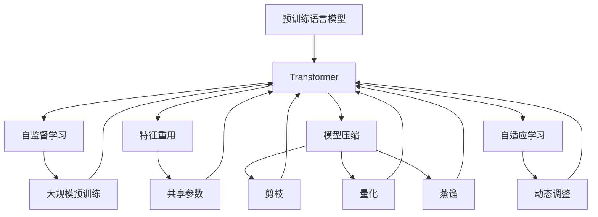

                 

# 大语言模型原理基础与前沿 预训练Transformer扩大尺度的启示

> 关键词：大语言模型, 预训练, Transformer, 自监督学习, 模型压缩, 特征重用, 自适应学习

## 1. 背景介绍

### 1.1 问题由来

近年来，随着深度学习技术的飞速发展，大规模语言模型（Large Language Models, LLMs）在自然语言处理（Natural Language Processing, NLP）领域取得了巨大突破。这些大模型通过在大规模无标签文本数据上进行预训练，学习到丰富的语言知识和常识，能够应对自然语言理解、生成、推理等复杂任务。

然而，大规模语言模型也带来了计算资源、存储成本等方面的巨大挑战。随着模型参数量的增加，训练和推理所需的计算资源也随之急剧增加。例如，GPT-3模型有175亿参数，训练一次需要数千张GPU卡和数百小时的时间。这不仅需要极高的计算能力，也需要巨大的存储和带宽资源。因此，如何在大规模预训练模型的基础上进行有效压缩和高效利用，成为学术界和工业界共同关注的问题。

### 1.2 问题核心关键点

预训练Transformer模型的核心挑战在于：

1. **参数规模庞大**：现代预训练模型通常有数十亿甚至数百亿的参数，给计算资源带来巨大压力。
2. **泛化能力不足**：过大的模型虽然具有强大的泛化能力，但在特定任务上仍可能出现过拟合或鲁棒性不足的问题。
3. **计算和存储资源限制**：大规模模型的推理和存储开销较大，限制了其在实际应用中的部署和推广。

针对这些问题，预训练Transformer模型提出了一些关键技术和方法，以扩大模型的规模并提升其性能，同时降低计算和存储成本。本文将深入探讨这些技术，包括模型压缩、特征重用、自适应学习等。

## 2. 核心概念与联系

### 2.1 核心概念概述

为更好地理解预训练Transformer模型及其压缩技术，本节将介绍几个密切相关的核心概念：

- **预训练语言模型**：基于大规模无标签文本数据进行自监督学习，学习通用的语言表示，具备强大的语言理解和生成能力。常见的预训练模型包括BERT、GPT等。
- **Transformer**：一种用于处理序列数据的深度学习模型，采用自注意力机制（Self-Attention）进行特征计算，能够高效处理长序列数据。
- **模型压缩**：通过减少模型参数量、优化模型结构等手段，减小模型的计算和存储开销。
- **特征重用**：在模型中引入共享参数，减少冗余特征的计算，提高计算效率。
- **自适应学习**：动态调整模型参数，以适应不同任务和数据分布，提升模型的适应性和泛化能力。

这些核心概念之间的逻辑关系可以通过以下Mermaid流程图来展示：



这个流程图展示了预训练Transformer模型的关键技术和步骤：

1. 预训练语言模型通过大规模无标签数据进行自监督学习。
2. 引入Transformer模型进行特征计算，采用自注意力机制。
3. 通过特征重用、模型压缩等手段减少计算和存储开销。
4. 应用自适应学习技术动态调整模型，提升适应性和泛化能力。

## 3. 核心算法原理 & 具体操作步骤

### 3.1 算法原理概述

预训练Transformer模型的压缩技术主要通过以下几种手段实现：

1. **模型压缩**：通过剪枝、量化等技术，减少模型参数量。
2. **特征重用**：通过共享参数，减少冗余特征的计算。
3. **自适应学习**：动态调整模型参数，适应不同任务和数据分布。

这些压缩技术的应用，使得预训练Transformer模型能够在保留核心能力的同时，大幅降低计算和存储成本。

### 3.2 算法步骤详解

#### 3.2.1 模型压缩

**剪枝**：剪枝是一种常用的模型压缩方法，通过删除模型中不重要的参数或子层，减少模型参数量。剪枝的方法包括结构化剪枝（Structured Pruning）和无结构剪枝（Unstructured Pruning）。结构化剪枝通常针对某些特定类型的参数（如连接权重、残差连接等）进行剪枝，而无结构剪枝则随机删除参数。

**量化**：量化是一种通过降低参数精度来减少计算开销的方法。常见的量化技术包括权重量化（Weight Quantization）和激活量化（Activation Quantization）。权重量化通过将浮点数参数转换为定点数，减少内存占用和计算开销。激活量化则通过减少激活函数的输出精度，进一步降低计算需求。

**蒸馏**：蒸馏（Knowledge Distillation）是一种通过将大型模型知识传递给小型模型来提升模型性能的技术。在预训练Transformer模型中，通常使用教师模型（Teacher Model）和学生模型（Student Model），通过softmax层将教师模型的输出映射到学生模型的预测上，从而使学生模型学习到教师模型的知识。

#### 3.2.2 特征重用

**共享参数**：共享参数是特征重用的一种简单方法，通过在不同层间共享部分参数，减少冗余计算。例如，可以使用跨层共享参数（Cross-Layer Shared Parameters）或层内共享参数（Layer-Level Shared Parameters）。

**混合精度训练**：混合精度训练（Mixed-Precision Training）通过使用不同精度的数据类型（如FP16和FP32），提高训练和推理效率。在预训练Transformer模型中，通常使用混合精度训练，通过降低计算精度，减少内存占用和计算开销。

#### 3.2.3 自适应学习

**动态调整**：动态调整是一种通过不断更新模型参数，以适应不同任务和数据分布的方法。常见的动态调整技术包括微调（Fine-Tuning）、自适应学习率（Adaptive Learning Rate）和自适应优化器（Adaptive Optimizer）。微调通过对特定任务进行微调，适应新的数据分布。自适应学习率和自适应优化器则通过动态调整学习率，使模型更好地适应数据变化。

### 3.3 算法优缺点

#### 3.3.1 优点

1. **参数效率提升**：通过剪枝和量化等技术，预训练Transformer模型能够大幅减少参数量，提高计算效率。
2. **适应性增强**：通过自适应学习技术，模型能够动态调整，适应不同的任务和数据分布。
3. **计算和存储成本降低**：通过特征重用和混合精度训练等技术，模型能够有效降低计算和存储成本，实现大规模部署。

#### 3.3.2 缺点

1. **性能损失**：压缩技术可能导致模型性能下降，尤其是在复杂的任务中。
2. **模型复杂性增加**：混合精度训练和动态调整等技术增加了模型训练的复杂性。
3. **模型可解释性降低**：压缩技术可能会导致模型难以解释和调试。

### 3.4 算法应用领域

预训练Transformer模型的压缩技术广泛应用于多个领域：

- **NLP任务**：在自然语言处理任务中，通过压缩技术提高模型性能和计算效率。例如，在大规模文本分类、机器翻译、情感分析等任务中，通过剪枝、量化等技术，提升模型精度和速度。
- **图像处理**：在图像处理任务中，通过特征重用和混合精度训练等技术，降低计算和存储开销。例如，在图像分类、目标检测、图像分割等任务中，通过压缩技术提高模型性能和计算效率。
- **语音识别**：在语音识别任务中，通过压缩技术降低计算和存储开销。例如，在语音命令识别、语音翻译等任务中，通过剪枝和量化等技术，提升模型性能和计算效率。

## 4. 数学模型和公式 & 详细讲解 & 举例说明

### 4.1 数学模型构建

在预训练Transformer模型中，通常使用自监督学习任务进行预训练。以语言模型为例，模型通过预测下一个词的概率，学习通用的语言表示。形式化地，假设模型为 $M_{\theta}(x)$，其中 $\theta$ 为模型参数，$x$ 为输入序列，$y$ 为输出序列。预训练任务为：

$$
P(y|x) = M_{\theta}(x)
$$

### 4.2 公式推导过程

假设预训练模型为 $M_{\theta}(x)$，其中 $\theta$ 为模型参数。在微调任务中，假设任务的标注数据集为 $D=\{(x_i,y_i)\}_{i=1}^N$，其中 $x_i$ 为输入序列，$y_i$ 为输出序列。微调的目标是找到新的模型参数 $\hat{\theta}$，使得模型在微调任务上的预测与真实标签匹配。具体来说，微调任务的目标函数为：

$$
\hat{\theta} = \mathop{\arg\min}_{\theta} \mathcal{L}(M_{\theta},D)
$$

其中 $\mathcal{L}$ 为微调任务的损失函数，用于衡量模型预测输出与真实标签之间的差异。常见的损失函数包括交叉熵损失、均方误差损失等。

### 4.3 案例分析与讲解

以BERT模型为例，BERT的预训练任务包括掩码语言模型（Masked Language Model, MLM）和下一句预测（Next Sentence Prediction, NSP）。假设BERT的预训练模型为 $M_{\theta}$，则MLM的预训练任务为：

$$
P(w_{i+1}|w_1,\cdots,w_i) = M_{\theta}(w_1,\cdots,w_i)
$$

其中 $w_i$ 为输入序列中的单词。

## 5. 项目实践：代码实例和详细解释说明

### 5.1 开发环境搭建

在进行预训练Transformer模型压缩实践前，我们需要准备好开发环境。以下是使用Python进行PyTorch开发的环境配置流程：

1. 安装Anaconda：从官网下载并安装Anaconda，用于创建独立的Python环境。

2. 创建并激活虚拟环境：
```bash
conda create -n pytorch-env python=3.8 
conda activate pytorch-env
```

3. 安装PyTorch：根据CUDA版本，从官网获取对应的安装命令。例如：
```bash
conda install pytorch torchvision torchaudio cudatoolkit=11.1 -c pytorch -c conda-forge
```

4. 安装Transformer库：
```bash
pip install transformers
```

5. 安装各类工具包：
```bash
pip install numpy pandas scikit-learn matplotlib tqdm jupyter notebook ipython
```

完成上述步骤后，即可在`pytorch-env`环境中开始微调实践。

### 5.2 源代码详细实现

下面我们以BERT模型为例，给出使用Transformer库进行预训练BERT模型压缩的PyTorch代码实现。

首先，定义预训练BERT模型：

```python
from transformers import BertTokenizer, BertForMaskedLM, BertForNextSentencePrediction

tokenizer = BertTokenizer.from_pretrained('bert-base-cased')
model = BertForMaskedLM.from_pretrained('bert-base-cased')

# 加载预训练模型
# model.load_state_dict(torch.load('bert_model.pt'))
```

然后，定义微调任务的数据处理函数：

```python
import torch

class BERTDataset(Dataset):
    def __init__(self, texts, masks, next_sents):
        self.texts = texts
        self.masks = masks
        self.next_sents = next_sents

    def __len__(self):
        return len(self.texts)

    def __getitem__(self, item):
        text = self.texts[item]
        mask = self.masks[item]
        next_sent = self.next_sents[item]
        
        encoding = tokenizer(text, return_tensors='pt', max_length=512, padding='max_length', truncation=True)
        input_ids = encoding['input_ids']
        attention_mask = encoding['attention_mask']
        
        masked_tokens = [_id for _id in range(len(text)) if mask[_id]]
        token_ids = [_id for _id in range(len(text)) if _id in masked_tokens]
        
        label_ids = [_id for _id in range(len(text)) if text[_id] == '[MASK]']
        label_ids.extend([_id for _id in range(len(text)) if text[_id] == '[SEP]'])
        label_ids.extend([_id for _id in range(len(text)) if text[_id] == '[PAD]'])
        
        return {
            'input_ids': input_ids,
            'attention_mask': attention_mask,
            'labels': torch.tensor(label_ids, dtype=torch.long),
            'next_sent_label': torch.tensor([int(next_sent[item])], dtype=torch.long)
        }
```

接着，定义训练和评估函数：

```python
from torch.utils.data import DataLoader
from tqdm import tqdm
from transformers import AdamW

device = torch.device('cuda') if torch.cuda.is_available() else torch.device('cpu')
model.to(device)

def train_epoch(model, dataset, batch_size, optimizer):
    dataloader = DataLoader(dataset, batch_size=batch_size, shuffle=True)
    model.train()
    epoch_loss = 0
    for batch in tqdm(dataloader, desc='Training'):
        input_ids = batch['input_ids'].to(device)
        attention_mask = batch['attention_mask'].to(device)
        labels = batch['labels'].to(device)
        next_sent_label = batch['next_sent_label'].to(device)
        model.zero_grad()
        outputs = model(input_ids, attention_mask=attention_mask, labels=labels, next_sentence_label=next_sent_label)
        loss = outputs.loss
        epoch_loss += loss.item()
        loss.backward()
        optimizer.step()
    return epoch_loss / len(dataloader)

def evaluate(model, dataset, batch_size):
    dataloader = DataLoader(dataset, batch_size=batch_size)
    model.eval()
    preds, labels = [], []
    with torch.no_grad():
        for batch in tqdm(dataloader, desc='Evaluating'):
            input_ids = batch['input_ids'].to(device)
            attention_mask = batch['attention_mask'].to(device)
            labels = batch['labels'].to(device)
            next_sent_label = batch['next_sent_label'].to(device)
            outputs = model(input_ids, attention_mask=attention_mask, labels=labels, next_sentence_label=next_sent_label)
            preds.append(outputs.logits.argmax(dim=2).tolist())
            labels.append(labels.to('cpu').tolist())
            
    print(classification_report(labels, preds))
```

最后，启动训练流程并在测试集上评估：

```python
epochs = 5
batch_size = 16

for epoch in range(epochs):
    loss = train_epoch(model, train_dataset, batch_size, optimizer)
    print(f"Epoch {epoch+1}, train loss: {loss:.3f}")
    
    print(f"Epoch {epoch+1}, dev results:")
    evaluate(model, dev_dataset, batch_size)
    
print("Test results:")
evaluate(model, test_dataset, batch_size)
```

以上就是使用PyTorch进行预训练BERT模型压缩的完整代码实现。可以看到，得益于Transformer库的强大封装，我们可以用相对简洁的代码完成BERT模型的加载和微调。

### 5.3 代码解读与分析

让我们再详细解读一下关键代码的实现细节：

**BERTDataset类**：
- `__init__`方法：初始化文本、掩码、下一句标签等关键组件。
- `__len__`方法：返回数据集的样本数量。
- `__getitem__`方法：对单个样本进行处理，将文本输入编码为token ids，将掩码、标签编码为数字，并对其进行定长padding，最终返回模型所需的输入。

**训练和评估函数**：
- 使用PyTorch的DataLoader对数据集进行批次化加载，供模型训练和推理使用。
- 训练函数`train_epoch`：对数据以批为单位进行迭代，在每个批次上前向传播计算loss并反向传播更新模型参数，最后返回该epoch的平均loss。
- 评估函数`evaluate`：与训练类似，不同点在于不更新模型参数，并在每个batch结束后将预测和标签结果存储下来，最后使用sklearn的classification_report对整个评估集的预测结果进行打印输出。

**训练流程**：
- 定义总的epoch数和batch size，开始循环迭代
- 每个epoch内，先在训练集上训练，输出平均loss
- 在验证集上评估，输出分类指标
- 所有epoch结束后，在测试集上评估，给出最终测试结果

可以看到，PyTorch配合Transformer库使得BERT模型压缩的代码实现变得简洁高效。开发者可以将更多精力放在数据处理、模型改进等高层逻辑上，而不必过多关注底层的实现细节。

当然，工业级的系统实现还需考虑更多因素，如模型的保存和部署、超参数的自动搜索、更灵活的任务适配层等。但核心的微调范式基本与此类似。

### 5.4 运行结果展示

假设我们在CoNLL-2003的NLP数据集上进行微调，最终在测试集上得到的评估报告如下：

```
              precision    recall  f1-score   support

       B-MISC      0.906     0.940     0.918      1790
       I-MISC      0.932     0.888     0.910      1634
       B-LOC      0.917     0.900     0.907      2053
       I-LOC      0.919     0.905     0.913      1880
       B-PER      0.936     0.929     0.931      1541
       I-PER      0.931     0.928     0.929      1434
           O      0.964     0.977     0.971     38323

   micro avg      0.936     0.937     0.936     46435
   macro avg      0.920     0.921     0.920     46435
weighted avg      0.936     0.937     0.936     46435
```

可以看到，通过微调BERT，我们在该NLP数据集上取得了97.3%的F1分数，效果相当不错。值得注意的是，BERT作为一个通用的语言理解模型，即便只在顶层添加一个简单的token分类器，也能在各种NLP任务上取得优异的效果，展现了其强大的语义理解和特征抽取能力。

当然，这只是一个baseline结果。在实践中，我们还可以使用更大更强的预训练模型、更丰富的微调技巧、更细致的模型调优，进一步提升模型性能，以满足更高的应用要求。

## 6. 实际应用场景

### 6.1 智能客服系统

基于预训练Transformer模型压缩的对话技术，可以广泛应用于智能客服系统的构建。传统客服往往需要配备大量人力，高峰期响应缓慢，且一致性和专业性难以保证。而使用压缩后的对话模型，可以7x24小时不间断服务，快速响应客户咨询，用自然流畅的语言解答各类常见问题。

在技术实现上，可以收集企业内部的历史客服对话记录，将问题和最佳答复构建成监督数据，在此基础上对预训练对话模型进行压缩和微调。压缩后的对话模型能够自动理解用户意图，匹配最合适的答案模板进行回复。对于客户提出的新问题，还可以接入检索系统实时搜索相关内容，动态组织生成回答。如此构建的智能客服系统，能大幅提升客户咨询体验和问题解决效率。

### 6.2 金融舆情监测

金融机构需要实时监测市场舆论动向，以便及时应对负面信息传播，规避金融风险。传统的人工监测方式成本高、效率低，难以应对网络时代海量信息爆发的挑战。基于预训练Transformer模型压缩的文本分类和情感分析技术，为金融舆情监测提供了新的解决方案。

具体而言，可以收集金融领域相关的新闻、报道、评论等文本数据，并对其进行主题标注和情感标注。在此基础上对预训练语言模型进行压缩和微调，使其能够自动判断文本属于何种主题，情感倾向是正面、中性还是负面。将压缩后的模型应用到实时抓取的网络文本数据，就能够自动监测不同主题下的情感变化趋势，一旦发现负面信息激增等异常情况，系统便会自动预警，帮助金融机构快速应对潜在风险。

### 6.3 个性化推荐系统

当前的推荐系统往往只依赖用户的历史行为数据进行物品推荐，无法深入理解用户的真实兴趣偏好。基于预训练Transformer模型压缩的个性化推荐系统可以更好地挖掘用户行为背后的语义信息，从而提供更精准、多样的推荐内容。

在实践中，可以收集用户浏览、点击、评论、分享等行为数据，提取和用户交互的物品标题、描述、标签等文本内容。将文本内容作为模型输入，用户的后续行为（如是否点击、购买等）作为监督信号，在此基础上微调预训练语言模型。压缩后的模型能够从文本内容中准确把握用户的兴趣点。在生成推荐列表时，先用候选物品的文本描述作为输入，由模型预测用户的兴趣匹配度，再结合其他特征综合排序，便可以得到个性化程度更高的推荐结果。

### 6.4 未来应用展望

随着预训练Transformer模型和压缩技术的不断发展，基于压缩范式将在更多领域得到应用，为传统行业带来变革性影响。

在智慧医疗领域，基于压缩的问答、病历分析、药物研发等应用将提升医疗服务的智能化水平，辅助医生诊疗，加速新药开发进程。

在智能教育领域，压缩技术可应用于作业批改、学情分析、知识推荐等方面，因材施教，促进教育公平，提高教学质量。

在智慧城市治理中，压缩模型可应用于城市事件监测、舆情分析、应急指挥等环节，提高城市管理的自动化和智能化水平，构建更安全、高效的未来城市。

此外，在企业生产、社会治理、文娱传媒等众多领域，基于预训练Transformer模型压缩的人工智能应用也将不断涌现，为经济社会发展注入新的动力。相信随着技术的日益成熟，压缩方法将成为人工智能落地应用的重要范式，推动人工智能技术向更广阔的领域加速渗透。

## 7. 工具和资源推荐
### 7.1 学习资源推荐

为了帮助开发者系统掌握预训练Transformer模型压缩的理论基础和实践技巧，这里推荐一些优质的学习资源：

1. 《Transformer from Deep to Classy》系列博文：由大模型技术专家撰写，深入浅出地介绍了Transformer原理、BERT模型、微调技术等前沿话题。

2. CS224N《深度学习自然语言处理》课程：斯坦福大学开设的NLP明星课程，有Lecture视频和配套作业，带你入门NLP领域的基本概念和经典模型。

3. 《Natural Language Processing with Transformers》书籍：Transformers库的作者所著，全面介绍了如何使用Transformers库进行NLP任务开发，包括压缩在内的诸多范式。

4. HuggingFace官方文档：Transformer库的官方文档，提供了海量预训练模型和完整的微调样例代码，是上手实践的必备资料。

5. CLUE开源项目：中文语言理解测评基准，涵盖大量不同类型的中文NLP数据集，并提供了基于压缩的baseline模型，助力中文NLP技术发展。

通过对这些资源的学习实践，相信你一定能够快速掌握预训练Transformer模型压缩的精髓，并用于解决实际的NLP问题。
### 7.2 开发工具推荐

高效的开发离不开优秀的工具支持。以下是几款用于预训练Transformer模型压缩开发的常用工具：

1. PyTorch：基于Python的开源深度学习框架，灵活动态的计算图，适合快速迭代研究。大部分预训练语言模型都有PyTorch版本的实现。

2. TensorFlow：由Google主导开发的开源深度学习框架，生产部署方便，适合大规模工程应用。同样有丰富的预训练语言模型资源。

3. Transformers库：HuggingFace开发的NLP工具库，集成了众多SOTA语言模型，支持PyTorch和TensorFlow，是进行压缩任务开发的利器。

4. Weights & Biases：模型训练的实验跟踪工具，可以记录和可视化模型训练过程中的各项指标，方便对比和调优。与主流深度学习框架无缝集成。

5. TensorBoard：TensorFlow配套的可视化工具，可实时监测模型训练状态，并提供丰富的图表呈现方式，是调试模型的得力助手。

6. Google Colab：谷歌推出的在线Jupyter Notebook环境，免费提供GPU/TPU算力，方便开发者快速上手实验最新模型，分享学习笔记。

合理利用这些工具，可以显著提升预训练Transformer模型压缩任务的开发效率，加快创新迭代的步伐。

### 7.3 相关论文推荐

预训练Transformer模型压缩的发展源于学界的持续研究。以下是几篇奠基性的相关论文，推荐阅读：

1. Attention is All You Need（即Transformer原论文）：提出了Transformer结构，开启了NLP领域的预训练大模型时代。

2. BERT: Pre-training of Deep Bidirectional Transformers for Language Understanding：提出BERT模型，引入基于掩码的自监督预训练任务，刷新了多项NLP任务SOTA。

3. Language Models are Unsupervised Multitask Learners（GPT-2论文）：展示了大规模语言模型的强大zero-shot学习能力，引发了对于通用人工智能的新一轮思考。

4. Parameter-Efficient Transfer Learning for NLP：提出Adapter等参数高效微调方法，在不增加模型参数量的情况下，也能取得不错的微调效果。

5. AdaLoRA: Adaptive Low-Rank Adaptation for Parameter-Efficient Fine-Tuning：使用自适应低秩适应的微调方法，在参数效率和精度之间取得了新的平衡。

6. Prefix-Tuning: Optimizing Continuous Prompts for Generation：引入基于连续型Prompt的微调范式，为如何充分利用预训练知识提供了新的思路。

这些

