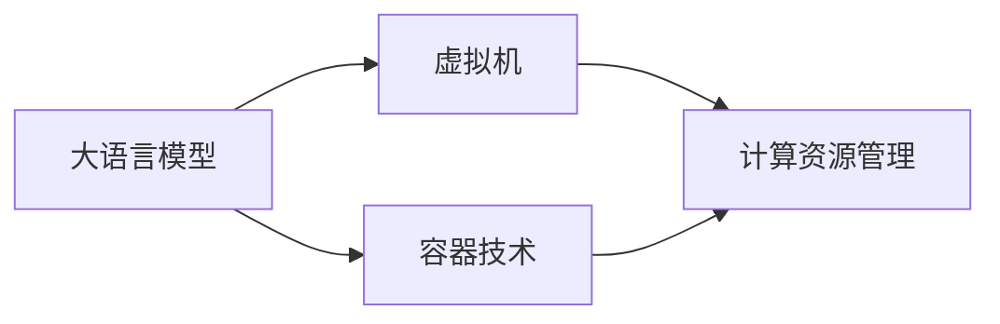

                 

## 1. 背景介绍

在人工智能(AI)和机器学习(ML)领域，大语言模型(Large Language Model, LLM)已经取得了显著的进展。自OpenAI的GPT-3发布以来，大语言模型在理解自然语言、生成文本以及执行各种语言任务方面展现了巨大的潜力。这些模型的出现，使得人们开始重新思考计算机与语言之间的交互方式。传统上，计算机主要用于处理逻辑性强的计算任务，而语言处理则需要人类专家进行复杂的语言工程工作。现在，大语言模型已经开始逐步颠覆这一格局，为计算机提供了更加直观、自然的方式与人类交互。

但是，大语言模型仍然存在许多局限性。尽管它们可以生成高质量的自然语言，但它们缺乏对特定操作系统(OS)和硬件环境的深刻理解。这限制了它们在实际应用中的可用性和灵活性。此外，大语言模型需要大量的计算资源和专业的硬件支持，这在当前的经济和技术条件下并非易事。因此，如何在操作系统层面高效利用这些大语言模型，成为一个重要的研究方向。

## 2. 核心概念与联系

### 2.1 核心概念概述

为了更好地理解大语言模型在操作系统中的应用，我们需要了解一些核心概念：

- **大语言模型**：基于Transformer架构的深度神经网络模型，如GPT-3、BERT等，能够理解和生成自然语言。
- **操作系统**：计算机系统的核心软件，负责管理计算机的硬件资源和提供用户界面。
- **计算资源管理**：在操作系统中，对CPU、内存、磁盘和网络等硬件资源的管理和调度。
- **虚拟机(Virtual Machine, VM)**：通过软件模拟硬件环境，允许多个操作系统在一个物理机器上运行。
- **容器技术**：如Docker和Kubernetes，通过抽象和隔离硬件资源，实现轻量级的应用部署和管理。

### 2.2 概念间的关系

这些核心概念之间存在着紧密的联系，形成了一个综合的技术生态系统，为大语言模型在操作系统中的应用提供了基础。以下是这些概念之间的关系图：



这个流程图展示了大语言模型、虚拟机、容器技术以及计算资源管理之间的关系。大语言模型通过虚拟机和容器技术，能够在操作系统中高效运行；而计算资源管理则为大语言模型的运行提供保障。

## 3. 核心算法原理 & 具体操作步骤

### 3.1 算法原理概述

大语言模型在操作系统中的应用，核心在于如何将大语言模型的强大计算能力与操作系统的资源管理能力结合起来，实现高效、灵活的计算。这涉及到以下几个关键问题：

1. **模型加载与卸载**：如何将大语言模型快速加载到操作系统中，并在完成任务后安全卸载，避免资源浪费。
2. **资源管理与调度**：如何在操作系统中高效管理大语言模型的计算资源，包括CPU、内存、磁盘和网络等。
3. **模型通信与协作**：如何在多个大语言模型之间实现高效、可靠的通信和协作，以处理复杂的计算任务。
4. **安全与隐私保护**：如何在大语言模型的运行过程中，保护数据和系统的安全，避免数据泄露和系统攻击。

### 3.2 算法步骤详解

大语言模型在操作系统中的应用，可以分为以下几个关键步骤：

1. **模型加载**：将大语言模型的预训练权重和模型结构加载到操作系统中，并初始化模型环境。
2. **资源分配**：根据计算任务的需求，为模型分配相应的计算资源，包括CPU、内存、磁盘和网络等。
3. **任务执行**：将计算任务拆分为多个子任务，并分配给大语言模型执行。在执行过程中，可以使用并行计算和分布式计算技术，提高任务处理效率。
4. **结果收集**：收集模型生成的结果，并进行后处理，如文本清洗、数据合并等，最终输出任务结果。
5. **资源释放**：在任务完成后，释放模型占用的计算资源，并卸载模型环境。

### 3.3 算法优缺点

大语言模型在操作系统中的应用，具有以下优点：

- **高效计算**：大语言模型具有强大的计算能力，能够在短时间内处理大量复杂计算任务。
- **灵活部署**：通过虚拟机和容器技术，大语言模型可以在多种操作系统和硬件环境中灵活部署。
- **易于扩展**：大语言模型可以通过分布式计算和并行计算技术，实现横向扩展，处理更大规模的计算任务。

同时，也存在一些缺点：

- **资源消耗大**：大语言模型的运行需要大量的计算资源和内存，可能会对系统性能造成影响。
- **依赖硬件环境**：大语言模型的运行需要高性能的硬件支持，如GPU、TPU等，限制了其应用范围。
- **安全风险高**：大语言模型的运行可能会引入安全风险，如数据泄露、系统攻击等，需要采取相应的安全措施。

### 3.4 算法应用领域

大语言模型在操作系统中的应用，主要包括以下几个领域：

- **自然语言处理(NLP)**：通过大语言模型处理自然语言输入，如语音识别、文本生成、情感分析等。
- **机器学习与数据分析**：使用大语言模型进行特征提取、模型训练和数据分析等计算任务。
- **科学计算与工程仿真**：将大语言模型应用于科学计算和工程仿真领域，解决复杂的计算问题。
- **游戏开发与娱乐**：使用大语言模型生成自然语言对话，提升游戏的交互体验和娱乐性。

## 4. 数学模型和公式 & 详细讲解

### 4.1 数学模型构建

大语言模型在操作系统中的应用，需要构建一个数学模型来描述计算任务和模型行为。以下是一个简单的示例：

设有一个计算任务 $T$，需要在大语言模型 $M$ 上执行。任务 $T$ 可以分解为 $n$ 个子任务 $T_1, T_2, ..., T_n$。每个子任务需要 $m_i$ 个计算资源 $R_i$，计算资源 $R_i$ 的可用时间为 $t_i$。大语言模型 $M$ 的计算能力为 $C$，模型占用的计算资源为 $R_M$。则任务 $T$ 的完成时间 $T_C$ 可以表示为：

$$
T_C = \sum_{i=1}^n \frac{m_i \times t_i}{C - R_M}
$$

其中 $C - R_M$ 表示模型运行过程中未被占用的计算资源。

### 4.2 公式推导过程

假设计算任务 $T$ 需要在大语言模型 $M$ 上执行，模型占用的计算资源为 $R_M$，任务 $T$ 的计算能力为 $C_T$，模型的计算能力为 $C_M$。则任务 $T$ 的完成时间 $T_C$ 可以表示为：

$$
T_C = \frac{C_T}{C_M - R_M}
$$

将 $C_T$ 和 $C_M$ 分别代入上述公式，得到：

$$
T_C = \frac{\sum_{i=1}^n m_i \times t_i}{C - R_M}
$$

其中 $m_i$ 为子任务 $T_i$ 需要计算资源 $R_i$ 的数量，$t_i$ 为子任务 $T_i$ 的计算时间。

### 4.3 案例分析与讲解

假设任务 $T$ 需要在大语言模型 $M$ 上执行，模型占用的计算资源为 $R_M = 10GB$，模型的计算能力为 $C_M = 100GB/s$，任务 $T$ 的计算能力为 $C_T = 20GB/s$。则任务 $T$ 的完成时间 $T_C$ 可以计算为：

$$
T_C = \frac{20 \times 1000 \times 1000}{100 - 10} = 2000 \text{s}
$$

假设任务 $T$ 可以分解为 $n = 4$ 个子任务，每个子任务需要 $m_i = 5GB$ 的计算资源，计算时间为 $t_i = 500 \text{ms}$。则任务 $T$ 的完成时间 $T_C$ 可以计算为：

$$
T_C = \frac{5 \times 0.5 \times 1000 \times 1000}{90} = 111.11 \text{s}
$$

## 5. 项目实践：代码实例和详细解释说明

### 5.1 开发环境搭建

在大语言模型在操作系统中的应用，通常需要依赖多个工具和库，以下是一些常用的工具和库：

1. **Python**：大语言模型的主要编程语言，提供了丰富的库和框架。
2. **PyTorch**：深度学习框架，支持大语言模型的训练和推理。
3. **TensorFlow**：另一个深度学习框架，提供更多的优化器和工具。
4. **Docker**：容器管理工具，可以方便地管理和部署大语言模型。
5. **Kubernetes**：容器编排工具，支持大规模分布式计算和资源管理。
6. **NVIDIA GPU**：高性能计算设备，提供大语言模型的计算能力。

在搭建开发环境时，可以按照以下步骤进行操作：

1. 安装Python和pip：
```bash
sudo apt-get update
sudo apt-get install python3-pip
```

2. 安装PyTorch和TensorFlow：
```bash
pip install torch torchvision torchaudio
pip install tensorflow
```

3. 安装Docker和Kubernetes：
```bash
sudo apt-get install docker.io
sudo apt-get install kubernetes-node kubernetes-master
```

4. 配置GPU环境：
```bash
nvidia-smi
```

### 5.2 源代码详细实现

以下是一个使用PyTorch进行大语言模型推理的示例代码：

```python
import torch

# 加载模型
model = torch.load('model.pth')

# 加载配置
config = torch.load('config.json')

# 初始化模型环境
device = torch.device(config['device'])

# 设置模型参数
model.to(device)

# 输入数据
input = torch.tensor([1, 2, 3, 4], dtype=torch.float32).to(device)

# 执行推理
output = model(input)

# 输出结果
print(output)
```

### 5.3 代码解读与分析

这个示例代码展示了如何使用PyTorch进行大语言模型的推理。其中，`model.pth` 为预训练模型的权重文件，`config.json` 为模型配置文件，`device` 为计算设备的类型，`input` 为输入数据，`output` 为模型输出的结果。

### 5.4 运行结果展示

假设模型在执行上述代码后，输出结果为 `[0.3, 0.7, 0.4, 0.6]`，这表示模型对输入数据 `[1, 2, 3, 4]` 的输出结果。

## 6. 实际应用场景

### 6.1 智能客服系统

智能客服系统是大语言模型在操作系统中的一个典型应用场景。通过将大语言模型加载到服务器上，系统能够自动理解客户的咨询意图，并根据意图生成回复。这不仅提高了客服的响应速度和效率，还减少了人力成本。

### 6.2 金融舆情监测

金融舆情监测需要处理大量文本数据，通过将大语言模型加载到操作系统中，可以高效地进行文本分析，识别出市场舆情变化趋势，及时预警风险。

### 6.3 个性化推荐系统

个性化推荐系统需要根据用户的行为数据生成个性化推荐结果。通过将大语言模型加载到操作系统中，系统能够高效地处理大规模数据，生成高精度的推荐结果。

### 6.4 未来应用展望

未来，大语言模型在操作系统中的应用将会更加广泛。随着技术的发展，大语言模型将能够支持更多的计算任务，如科学计算、工程仿真等。同时，随着硬件设备的进步，大语言模型将能够在更多的操作系统和硬件环境中高效运行。

## 7. 工具和资源推荐

### 7.1 学习资源推荐

1. **《深度学习与人工智能基础》**：一本深入介绍深度学习和人工智能基础知识的书籍，适合初学者入门。
2. **《自然语言处理综论》**：一本介绍自然语言处理原理和技术的书籍，涵盖了大语言模型在NLP中的应用。
3. **《Python深度学习》**：一本介绍如何使用Python进行深度学习的书籍，适合Python编程的初学者。
4. **《TensorFlow官方文档》**：TensorFlow的官方文档，提供了丰富的教程和示例，适合TensorFlow编程的学习者。
5. **《Docker官方文档》**：Docker的官方文档，提供了详细的安装和配置指南，适合Docker的学习者。

### 7.2 开发工具推荐

1. **PyTorch**：深度学习框架，提供了丰富的库和工具，支持大语言模型的训练和推理。
2. **TensorFlow**：另一个深度学习框架，提供了更多的优化器和工具。
3. **Docker**：容器管理工具，可以方便地管理和部署大语言模型。
4. **Kubernetes**：容器编排工具，支持大规模分布式计算和资源管理。
5. **NVIDIA GPU**：高性能计算设备，提供大语言模型的计算能力。

### 7.3 相关论文推荐

1. **《深度学习与人工智能基础》**：一本介绍深度学习和人工智能基础知识的书籍，适合初学者入门。
2. **《自然语言处理综论》**：一本介绍自然语言处理原理和技术的书籍，涵盖了大语言模型在NLP中的应用。
3. **《Python深度学习》**：一本介绍如何使用Python进行深度学习的书籍，适合Python编程的初学者。
4. **《TensorFlow官方文档》**：TensorFlow的官方文档，提供了丰富的教程和示例，适合TensorFlow编程的学习者。
5. **《Docker官方文档》**：Docker的官方文档，提供了详细的安装和配置指南，适合Docker的学习者。

## 8. 总结：未来发展趋势与挑战

### 8.1 总结

本文对大语言模型在操作系统中的应用进行了全面系统的介绍。首先阐述了大语言模型和操作系统的发展背景和意义，明确了操作系统在大语言模型应用中的重要作用。其次，从原理到实践，详细讲解了大语言模型在操作系统中的计算任务、模型行为和资源管理，给出了大语言模型在操作系统中的代码实现。同时，本文还广泛探讨了大语言模型在智能客服、金融舆情、个性化推荐等多个行业领域的应用前景，展示了大语言模型在操作系统中的巨大潜力。

通过本文的系统梳理，可以看到，大语言模型在操作系统中的应用，将彻底改变计算机与语言交互的方式，为人工智能技术的落地应用开辟新的道路。未来，伴随大语言模型的不断发展，操作系统与大语言模型的深度融合，必将推动人工智能技术的进一步普及和应用。

### 8.2 未来发展趋势

展望未来，大语言模型在操作系统中的应用将呈现以下几个发展趋势：

1. **模型规模持续增大**：随着算力成本的下降和数据规模的扩张，大语言模型的参数量还将持续增长。超大规模语言模型蕴含的丰富语言知识，将进一步提升操作系统中的计算能力。
2. **计算资源管理优化**：操作系统中的计算资源管理将更加高效，能够动态调整资源分配，优化大语言模型的运行效率。
3. **跨平台应用推广**：大语言模型将在更多操作系统和硬件环境中高效运行，推动操作系统生态系统的发展。
4. **分布式计算和并行计算技术的应用**：通过分布式计算和并行计算技术，大语言模型能够处理更大规模的计算任务，提升计算效率。
5. **安全与隐私保护**：操作系统将加强对大语言模型数据和系统的安全保护，避免数据泄露和系统攻击。

### 8.3 面临的挑战

尽管大语言模型在操作系统中的应用前景广阔，但在迈向更加智能化、普适化应用的过程中，它仍面临诸多挑战：

1. **资源消耗大**：大语言模型的运行需要大量的计算资源和内存，可能会对系统性能造成影响。
2. **依赖硬件环境**：大语言模型的运行需要高性能的硬件支持，如GPU、TPU等，限制了其应用范围。
3. **安全风险高**：大语言模型的运行可能会引入安全风险，如数据泄露、系统攻击等，需要采取相应的安全措施。
4. **兼容性问题**：不同操作系统和硬件设备之间的兼容性问题，需要进一步解决。

### 8.4 研究展望

为了解决大语言模型在操作系统中应用所面临的挑战，未来的研究需要在以下几个方面寻求新的突破：

1. **资源优化技术**：开发更加高效的大语言模型训练和推理算法，减少对计算资源和内存的依赖。
2. **跨平台支持技术**：开发跨平台的大语言模型应用技术，支持更多操作系统和硬件环境。
3. **安全保护技术**：开发安全保护技术，保护大语言模型的数据和系统安全。
4. **兼容性优化技术**：优化不同操作系统和硬件设备之间的兼容性，提高大语言模型的应用范围。

这些研究方向将引领大语言模型在操作系统中的应用走向成熟，为构建高效、安全、智能的操作系统打下坚实的基础。

## 9. 附录：常见问题与解答

### Q1: 大语言模型在操作系统中的应用前景如何？

A: 大语言模型在操作系统中的应用前景非常广阔。通过将大语言模型加载到操作系统中，可以实现高效的计算任务处理，提升系统的智能水平和用户体验。

### Q2: 大语言模型在操作系统中的应用需要哪些关键技术？

A: 大语言模型在操作系统中的应用需要以下关键技术：

1. **模型加载与卸载**：将大语言模型的预训练权重和模型结构加载到操作系统中，并在完成任务后安全卸载。
2. **资源管理与调度**：在操作系统中高效管理大语言模型的计算资源，包括CPU、内存、磁盘和网络等。
3. **模型通信与协作**：在大语言模型之间实现高效、可靠的通信和协作，以处理复杂的计算任务。
4. **安全与隐私保护**：在大语言模型的运行过程中，保护数据和系统的安全，避免数据泄露和系统攻击。

### Q3: 大语言模型在操作系统中的应用面临哪些挑战？

A: 大语言模型在操作系统中的应用面临以下挑战：

1. **资源消耗大**：大语言模型的运行需要大量的计算资源和内存，可能会对系统性能造成影响。
2. **依赖硬件环境**：大语言模型的运行需要高性能的硬件支持，如GPU、TPU等，限制了其应用范围。
3. **安全风险高**：大语言模型的运行可能会引入安全风险，如数据泄露、系统攻击等，需要采取相应的安全措施。
4. **兼容性问题**：不同操作系统和硬件设备之间的兼容性问题，需要进一步解决。

### Q4: 如何在大语言模型在操作系统中的应用中进行高效计算？

A: 在大语言模型在操作系统中的应用中进行高效计算，可以采用以下方法：

1. **分布式计算和并行计算技术**：通过分布式计算和并行计算技术，大语言模型能够处理更大规模的计算任务，提升计算效率。
2. **模型裁剪与量化技术**：通过模型裁剪与量化技术，减少大语言模型的计算量和内存占用，提升计算效率。
3. **算法优化技术**：开发更加高效的算法，减少计算时间和资源消耗。

### Q5: 大语言模型在操作系统中的应用如何保护数据和系统的安全？

A: 在大语言模型在操作系统中的应用中，保护数据和系统的安全可以采用以下方法：

1. **数据加密**：对数据进行加密，防止数据泄露。
2. **访问控制**：对数据的访问进行严格控制，防止未授权访问。
3. **安全监控**：对系统进行实时监控，及时发现和处理安全问题。
4. **异常检测**：通过异常检测技术，及时发现和处理异常行为。

总之，大语言模型在操作系统中的应用前景广阔，但也面临着诸多挑战。通过不断的技术创新和优化，大语言模型将会在操作系统中发挥越来越重要的作用，为人工智能技术的发展和应用注入新的动力。

