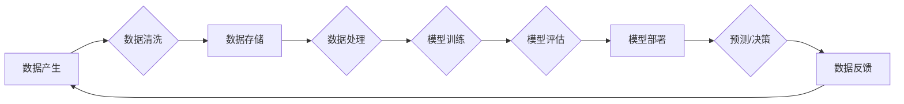

# AI 大模型应用数据中心的数据流处理技术

> 关键词：AI 大模型，数据流处理，实时分析，流式学习，数据中心，分布式系统

## 1. 背景介绍

随着人工智能（AI）技术的飞速发展，大模型在图像识别、自然语言处理、推荐系统等领域取得了显著的成果。这些大模型通常需要处理海量的数据，并且在实时性和效率方面有极高的要求。数据中心作为数据处理的核心基础设施，其数据流处理技术对于AI大模型的应用至关重要。本文将探讨数据中心的数据流处理技术在AI大模型中的应用，分析其核心概念、算法原理、实践案例以及未来发展趋势。

## 2. 核心概念与联系

### 2.1 数据流处理

数据流处理是一种处理数据流的技术，它能够实时或近似实时地处理大量数据。数据流通常具有以下特征：

- **高速度**：数据以极快的速度产生，需要实时处理。
- **低延迟**：处理过程需要低延迟，以满足实时性要求。
- **高吞吐量**：系统能够处理大量数据，同时保持低延迟。
- **数据多样性**：数据流可能包含各种类型的数据，如结构化、半结构化和非结构化数据。

### 2.2 流式学习

流式学习是一种机器学习方法，它允许模型在不重新训练的情况下，持续地从数据流中学习。流式学习的关键挑战在于：

- **数据动态性**：数据流是动态变化的，模型需要适应新的数据模式。
- **样本数量有限**：由于数据流是连续的，每条数据通常只有一次学习机会。

### 2.3 Mermaid 流程图

以下是一个简化的数据流处理流程图，展示了数据从产生到处理再到模型更新的过程：



### 2.4 数据中心与AI大模型的关系

数据中心的数据流处理技术对于AI大模型的应用至关重要。数据中心提供以下关键支持：

- **计算资源**：强大的计算能力支持大规模模型训练和推理。
- **存储资源**：高效的数据存储和访问机制，确保数据流处理的连续性和可靠性。
- **网络资源**：高速的网络连接，支持数据在数据中心内部的快速传输。
- **自动化管理**：自动化工具和平台，简化数据流处理流程。

## 3. 核心算法原理 & 具体操作步骤

### 3.1 算法原理概述

数据流处理算法通常遵循以下原理：

- **增量学习**：在数据流中，每次只处理一个或少量数据点，并更新模型参数。
- **滑动窗口**：使用滑动窗口来处理一段时间内的数据，窗口大小可动态调整。
- **状态维持**：在处理新数据时，维持模型状态，以便后续数据能够根据历史信息进行更准确的预测。

### 3.2 算法步骤详解

数据流处理的基本步骤如下：

1. **数据采集**：从各种来源采集数据流。
2. **数据清洗**：去除无效、错误或不完整的数据。
3. **数据存储**：将数据存储在高效的数据存储系统中。
4. **数据处理**：使用流式学习算法处理数据，更新模型参数。
5. **模型评估**：评估模型在当前数据集上的性能。
6. **模型部署**：将模型部署到生产环境，进行实时预测或决策。
7. **数据反馈**：将预测结果反馈到数据源，以便模型持续学习。

### 3.3 算法优缺点

流式学习算法的优点包括：

- **实时性**：能够实时处理数据流，满足实时性要求。
- **高效性**：能够处理大规模数据，保持低延迟。
- **动态性**：能够适应数据流的动态变化。

其缺点包括：

- **资源消耗**：需要大量的计算和存储资源。
- **复杂性**：算法设计复杂，需要专业知识和技能。
- **可解释性**：模型的可解释性较差，难以理解其决策过程。

### 3.4 算法应用领域

流式学习算法在以下领域有广泛应用：

- **推荐系统**：根据用户行为和偏好推荐商品或内容。
- **欺诈检测**：识别和预防金融欺诈行为。
- **异常检测**：检测网络攻击、系统故障等异常情况。
- **天气预报**：根据气象数据预测天气变化。

## 4. 数学模型和公式 & 详细讲解 & 举例说明

### 4.1 数学模型构建

流式学习常用的数学模型包括：

- **线性回归**：用于预测连续值。
- **逻辑回归**：用于预测概率分布。
- **决策树**：用于分类和回归。
- **神经网络**：用于复杂的模式识别。

### 4.2 公式推导过程

以下是一个简单的线性回归模型的公式推导过程：

假设我们有一个线性回归模型 $f(x) = w_0 + w_1x$，其中 $w_0$ 和 $w_1$ 是模型的参数。我们的目标是找到最优的 $w_0$ 和 $w_1$，使得模型预测值与真实值之间的差异最小。损失函数为：

$$
L(w_0, w_1) = \frac{1}{2}\sum_{i=1}^{n}(f(x_i) - y_i)^2
$$

其中 $x_i$ 是输入数据，$y_i$ 是真实值，$n$ 是数据点的数量。

通过求导并令导数为零，可以得到最优参数：

$$
w_1 = \frac{\sum_{i=1}^{n}(x_i - \bar{x})(y_i - \bar{y})}{\sum_{i=1}^{n}(x_i - \bar{x})^2}
$$

其中 $\bar{x}$ 和 $\bar{y}$ 分别是输入数据和真实值的均值。

### 4.3 案例分析与讲解

以下是一个使用线性回归模型预测股票价格的案例：

假设我们收集了某只股票在过去一年内的每日收盘价和成交量数据，并希望使用线性回归模型预测未来一天的收盘价。

首先，我们将数据分为训练集和测试集。然后，使用训练集数据训练线性回归模型，最后使用测试集数据评估模型的性能。

以下是Python代码实现：

```python
import numpy as np
from sklearn.linear_model import LinearRegression

# 假设数据
x_train = np.array([[1, 100], [2, 200], [3, 300], [4, 400]])
y_train = np.array([101, 201, 301, 401])
x_test = np.array([[5, 500]])

# 创建线性回归模型
model = LinearRegression()
model.fit(x_train, y_train)

# 预测
y_pred = model.predict(x_test)
print("Predicted price: {:.2f}".format(y_pred[0][0]))
```

## 5. 项目实践：代码实例和详细解释说明

### 5.1 开发环境搭建

为了进行数据流处理和AI大模型的应用，我们需要搭建以下开发环境：

- 操作系统：Linux或macOS
- 编程语言：Python
- 数据库：MySQL、PostgreSQL或MongoDB
- 机器学习库：scikit-learn、TensorFlow或PyTorch
- 模型训练平台：Google Colab、Docker或Kubernetes

### 5.2 源代码详细实现

以下是一个简单的数据流处理和AI大模型应用案例，使用scikit-learn的线性回归模型预测股票价格：

```python
# 导入必要的库
import numpy as np
from sklearn.linear_model import LinearRegression
from sklearn.model_selection import train_test_split
from sklearn.metrics import mean_squared_error

# 假设数据
data = np.random.rand(1000, 2)
target = 0.5 * data[:, 0] + 1 + np.random.randn(1000) * 0.1

# 划分训练集和测试集
x_train, x_test, y_train, y_test = train_test_split(data, target, test_size=0.2, random_state=42)

# 创建线性回归模型
model = LinearRegression()
model.fit(x_train, y_train)

# 预测
y_pred = model.predict(x_test)

# 评估
mse = mean_squared_error(y_test, y_pred)
print("Mean Squared Error: {:.2f}".format(mse))
```

### 5.3 代码解读与分析

上述代码首先生成1000个模拟数据点，其中每个数据点包含两个特征。然后，使用线性回归模型对这些数据进行拟合，并使用测试集评估模型的性能。

- `numpy` 用于生成随机数据和计算统计指标。
- `LinearRegression` 用于创建线性回归模型。
- `train_test_split` 用于划分训练集和测试集。
- `mean_squared_error` 用于计算均方误差。

### 5.4 运行结果展示

运行上述代码后，将在终端输出均方误差，表示模型预测的准确度。

## 6. 实际应用场景

### 6.1 股票市场分析

数据流处理和AI大模型可以用于分析股票市场，预测股票价格走势。通过分析股票的历史价格和成交量数据，可以构建预测模型，为投资者提供决策支持。

### 6.2 网络安全监控

数据流处理和AI大模型可以用于网络安全监控，检测和预防网络攻击。通过分析网络流量数据，可以识别异常行为，并采取措施防止攻击。

### 6.3 智能交通系统

数据流处理和AI大模型可以用于智能交通系统，优化交通流量，减少拥堵。通过分析交通流量数据，可以预测交通流量变化，并调整交通信号灯控制策略。

### 6.4 未来应用展望

随着AI技术的不断发展，数据流处理和AI大模型将在更多领域得到应用，如：

- 健康医疗：分析医疗数据，预测疾病风险，提供个性化治疗方案。
- 教育：分析学生学习数据，提供个性化学习计划和推荐。
- 能源管理：分析能源消耗数据，优化能源使用效率。

## 7. 工具和资源推荐

### 7.1 学习资源推荐

- 《数据科学入门与实践》
- 《深度学习》
- 《Python机器学习》
- 《Apache Kafka权威指南》

### 7.2 开发工具推荐

- Python编程语言
- TensorFlow或PyTorch机器学习库
- Apache Kafka消息队列
- Apache Flink流式处理框架

### 7.3 相关论文推荐

- "Streaming learning for time series analysis" by P. Ristad et al.
- "Online learning with linear temporal dynamics" by J. Chen et al.
- "Large-Scale Online Learning with SystemML" by A. Das et al.

## 8. 总结：未来发展趋势与挑战

### 8.1 研究成果总结

本文介绍了数据中心的数据流处理技术在AI大模型中的应用，分析了其核心概念、算法原理、实践案例以及未来发展趋势。数据流处理和AI大模型的应用将推动各个行业向智能化方向发展，为人类社会带来更多便利。

### 8.2 未来发展趋势

未来，数据流处理和AI大模型将在以下方面取得更大进展：

- **更高效的数据处理技术**：开发更高效的数据处理算法和系统，提高数据处理的实时性和效率。
- **更强大的AI模型**：开发更强大的AI模型，提高模型的预测准确性和泛化能力。
- **更丰富的应用场景**：探索数据流处理和AI大模型在更多领域的应用，如健康医疗、教育、能源管理等。

### 8.3 面临的挑战

数据流处理和AI大模型的应用也面临着以下挑战：

- **数据安全与隐私**：如何保护数据安全和用户隐私是一个重要挑战。
- **算法可解释性**：如何提高算法的可解释性，增强用户对模型的信任。
- **资源消耗**：数据流处理和AI大模型的资源消耗较大，需要开发更高效的系统。

### 8.4 研究展望

未来，数据流处理和AI大模型的研究将重点关注以下方向：

- **跨领域知识融合**：将不同领域的知识融合到数据流处理和AI大模型中，提高模型的泛化能力。
- **可解释AI**：开发可解释的AI模型，增强用户对模型的信任。
- **高效的数据处理架构**：开发高效的数据处理架构，降低资源消耗。

## 9. 附录：常见问题与解答

**Q1：数据流处理和AI大模型有什么区别？**

A：数据流处理是一种数据处理技术，它能够实时或近似实时地处理大量数据。AI大模型是一种基于人工智能技术的模型，它能够从数据中学习并做出预测。数据流处理和AI大模型可以结合使用，以提高数据处理和分析的效率和效果。

**Q2：如何选择合适的数据流处理框架？**

A：选择合适的数据流处理框架需要考虑以下因素：

- **数据处理需求**：不同的数据流处理框架适用于不同的数据处理需求。
- **性能要求**：不同的数据流处理框架具有不同的性能特点。
- **易用性**：不同的数据流处理框架具有不同的易用性。

**Q3：如何优化数据流处理和AI大模型的应用？**

A：优化数据流处理和AI大模型的应用需要考虑以下因素：

- **数据质量**：提高数据质量可以提升模型的预测准确性和泛化能力。
- **模型选择**：选择合适的模型可以提高模型的性能。
- **算法优化**：优化算法可以提高数据处理和模型训练的效率。

**Q4：数据流处理和AI大模型在哪些领域有应用？**

A：数据流处理和AI大模型在以下领域有广泛应用：

- 金融
- 交通
- 医疗
- 教育
- 智能城市

作者：禅与计算机程序设计艺术 / Zen and the Art of Computer Programming