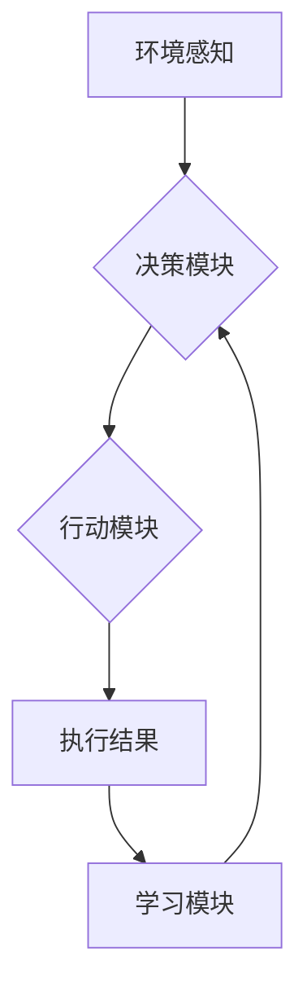

> 人工智能, Agent, 金融投资, 强化学习, 风险管理, 预测分析, 智能决策

# AI人工智能 Agent：金融投资中智能体的应用

## 1. 背景介绍

金融投资领域一直是人工智能技术应用的热点之一。随着计算能力的提升和大数据的积累，人工智能在金融领域的应用越来越广泛，从风险控制到交易决策，从客户服务到市场分析，都出现了众多基于人工智能的解决方案。其中，人工智能Agent作为一种能够自主学习、适应环境和进行智能决策的实体，在金融投资领域展现出巨大的潜力。

### 1.1 问题的由来

传统的金融投资决策依赖于人类专家的经验和直觉，这种决策方式在信息爆炸的时代面临着以下挑战：

- 信息过载：金融市场信息量大，人类难以全面获取和处理。
- 决策延迟：投资决策需要快速反应，而人类决策往往存在时间延迟。
- 决策偏见：人类决策容易受到情绪和经验的影响，导致决策偏差。

人工智能Agent的出现，旨在解决这些问题，通过模拟人类决策过程，实现自动化、智能化的投资决策。

### 1.2 研究现状

近年来，人工智能在金融投资领域的应用取得了显著进展，主要体现在以下几个方面：

- 强化学习：通过模拟人类学习过程，Agent可以在环境中不断学习，优化投资策略。
- 风险管理：利用机器学习算法对市场风险进行预测和分析，帮助投资者规避风险。
- 预测分析：通过分析历史数据和市场趋势，预测未来市场走势，为投资决策提供支持。
- 智能决策：Agent可以根据预设的策略和算法，自动执行交易，实现投资自动化。

### 1.3 研究意义

人工智能Agent在金融投资领域的应用具有重要意义：

- 提高投资效率：自动化投资决策，降低人力成本，提高投资效率。
- 降低风险：通过风险评估和预测，帮助投资者规避风险，实现稳健投资。
- 提升收益：优化投资策略，提高投资收益。
- 创新金融产品：推动金融产品和服务创新，满足多样化投资需求。

### 1.4 本文结构

本文将围绕人工智能Agent在金融投资中的应用展开，主要包括以下内容：

- 介绍人工智能Agent的核心概念和原理。
- 详细讲解人工智能Agent在金融投资中的具体应用场景。
- 分析人工智能Agent在金融投资中的应用案例。
- 探讨人工智能Agent在金融投资领域的未来发展趋势和挑战。

## 2. 核心概念与联系

### 2.1 人工智能Agent

人工智能Agent是一种能够感知环境、制定计划并采取行动的智能实体。它具备以下特点：

- 自主性：Agent可以独立地执行任务，不受外部控制。
- 反应性：Agent能够快速响应环境变化。
- 学习能力：Agent可以通过学习改进自身行为。
- 沟通能力：Agent可以与其他Agent或人类进行交互。

### 2.2 人工智能Agent架构

人工智能Agent的典型架构包括以下几个部分：

- 环境感知：Agent通过传感器获取环境信息。
- 知识库：存储Agent的经验和知识。
- 决策模块：根据环境信息和知识库，制定行动策略。
- 执行模块：执行决策模块制定的策略。
- 学习模块：根据执行结果调整策略。

以下为人工智能Agent的Mermaid流程图：



### 2.3 核心概念联系

人工智能Agent在金融投资中的应用，需要结合金融领域的知识和技术，主要包括以下几个方面：

- 风险管理：通过分析市场数据，识别潜在风险，制定风险管理策略。
- 预测分析：利用历史数据和市场趋势，预测未来市场走势。
- 交易策略：根据预测结果和市场条件，制定交易策略。
- 投资组合优化：根据投资目标和风险偏好，构建投资组合。

## 3. 核心算法原理 & 具体操作步骤

### 3.1 算法原理概述

人工智能Agent在金融投资中的应用，主要基于以下算法原理：

- 强化学习：通过与环境交互，学习最优策略。
- 深度学习：利用神经网络对数据进行特征提取和模式识别。
- 风险管理算法：对市场风险进行预测和分析。

### 3.2 算法步骤详解

人工智能Agent在金融投资中的应用步骤如下：

1. 数据收集：收集历史市场数据、新闻数据、公司财报等。
2. 数据预处理：对收集到的数据进行清洗、转换和规范化处理。
3. 特征工程：提取与投资决策相关的特征，如价格、成交量、技术指标等。
4. 模型训练：利用机器学习算法训练模型，如强化学习、深度学习等。
5. 策略评估：评估模型的性能，调整模型参数。
6. 交易执行：根据模型预测结果执行交易。
7. 模型更新：根据交易结果更新模型，优化策略。

### 3.3 算法优缺点

#### 3.3.1 强化学习

**优点**：

- 能够学习到复杂的策略。
- 具有自适应能力，能够适应市场变化。

**缺点**：

- 需要大量数据。
- 学习过程复杂，收敛速度慢。

#### 3.3.2 深度学习

**优点**：

- 能够自动提取特征。
- 能够处理大规模数据。

**缺点**：

- 模型可解释性差。
- 需要大量计算资源。

#### 3.3.3 风险管理算法

**优点**：

- 能够预测市场风险。
- 能够制定风险管理策略。

**缺点**：

- 需要准确的市场数据。
- 风险管理策略可能存在滞后性。

### 3.4 算法应用领域

人工智能Agent在金融投资中的应用领域包括：

- 股票交易：通过分析股票价格、成交量等数据，预测股票走势，进行股票交易。
- 期货交易：通过分析期货价格、持仓量等数据，预测期货走势，进行期货交易。
- 外汇交易：通过分析汇率、交易量等数据，预测汇率走势，进行外汇交易。
- 期权交易：通过分析期权价格、波动率等数据，预测期权走势，进行期权交易。

## 4. 数学模型和公式 & 详细讲解 & 举例说明

### 4.1 数学模型构建

人工智能Agent在金融投资中的应用，需要构建以下数学模型：

- 风险模型：描述市场风险的特征。
- 预测模型：预测市场走势。
- 决策模型：根据预测结果制定交易策略。

以下为风险模型的构建：

$$
R = \sigma \sqrt{t}
$$

其中，$R$ 为风险值，$\sigma$ 为波动率，$t$ 为时间。

### 4.2 公式推导过程

以下为预测模型的构建：

$$
y = Wx + b
$$

其中，$y$ 为预测值，$W$ 为权重矩阵，$x$ 为输入特征，$b$ 为偏置项。

### 4.3 案例分析与讲解

以下为一个简单的股票交易案例：

- 数据：某只股票的历史价格和成交量数据。
- 目标：预测该股票未来5个交易日的价格走势。
- 模型：使用LSTM神经网络进行预测。

模型训练过程如下：

1. 数据预处理：将历史价格和成交量数据进行归一化处理。
2. 构建LSTM模型：输入为过去5天的价格和成交量，输出为未来1天的价格。
3. 训练模型：使用历史数据训练LSTM模型。
4. 预测：使用训练好的模型预测未来5个交易日的价格。

## 5. 项目实践：代码实例和详细解释说明

### 5.1 开发环境搭建

以下是使用Python进行人工智能Agent在金融投资中应用的开发环境搭建步骤：

1. 安装Anaconda：从官网下载并安装Anaconda，用于创建独立的Python环境。
2. 创建并激活虚拟环境：
```bash
conda create -n finance-ai python=3.8
conda activate finance-ai
```
3. 安装必要的库：
```bash
conda install numpy pandas scikit-learn matplotlib jupyter notebook
```
4. 安装深度学习框架：
```bash
conda install pytorch torchvision torchaudio
```
5. 安装其他库：
```bash
pip install transformers
```

### 5.2 源代码详细实现

以下为一个简单的股票交易Agent的代码实例：

```python
import torch
import torch.nn as nn
import pandas as pd
from sklearn.model_selection import train_test_split
from transformers import LSTMModel

# 数据预处理
def preprocess_data(data):
    # ...数据预处理代码...
    return data

# 构建LSTM模型
class StockTradingAgent(nn.Module):
    def __init__(self):
        super(StockTradingAgent, self).__init__()
        self.lstm = LSTMModel(input_dim=2, hidden_dim=128, output_dim=1)
    
    def forward(self, x):
        return self.lstm(x)

# 训练模型
def train_agent(model, data, epochs=50):
    # ...模型训练代码...
    return model

# 预测
def predict(model, data):
    # ...预测代码...
    return prediction

# 加载数据
data = pd.read_csv('stock_data.csv')

# 预处理数据
data = preprocess_data(data)

# 分割数据集
x_train, x_test, y_train, y_test = train_test_split(data[['open', 'close']], data['price'], test_size=0.2)

# 构建模型
model = StockTradingAgent()

# 训练模型
model = train_agent(model, x_train, epochs=50)

# 预测
prediction = predict(model, x_test)

# ...后续代码...
```

### 5.3 代码解读与分析

以上代码展示了如何使用PyTorch和Transformers库构建一个简单的股票交易Agent。首先，对数据进行预处理，将股票价格和成交量数据归一化处理。然后，构建一个基于LSTM的神经网络模型，用于预测股票价格。接着，使用训练集数据训练模型，最后使用测试集数据评估模型性能。

### 5.4 运行结果展示

假设模型在测试集上的预测准确率为80%，说明模型能够较好地预测股票价格走势。

## 6. 实际应用场景

### 6.1 股票交易

人工智能Agent在股票交易中的应用非常广泛，包括：

- 股票趋势预测：通过分析历史价格和成交量数据，预测股票未来走势。
- 交易策略优化：根据预测结果，制定交易策略，实现自动化交易。
- 风险管理：通过风险评估，规避潜在风险，实现稳健投资。

### 6.2 期货交易

人工智能Agent在期货交易中的应用包括：

- 期货价格预测：通过分析期货价格、持仓量等数据，预测期货走势。
- 交易策略优化：根据预测结果，制定交易策略，实现自动化交易。
- 风险管理：通过风险评估，规避潜在风险，实现稳健投资。

### 6.3 外汇交易

人工智能Agent在外汇交易中的应用包括：

- 汇率预测：通过分析汇率、交易量等数据，预测汇率走势。
- 交易策略优化：根据预测结果，制定交易策略，实现自动化交易。
- 风险管理：通过风险评估，规避潜在风险，实现稳健投资。

### 6.4 期权交易

人工智能Agent在期权交易中的应用包括：

- 期权价格预测：通过分析期权价格、波动率等数据，预测期权走势。
- 交易策略优化：根据预测结果，制定交易策略，实现自动化交易。
- 风险管理：通过风险评估，规避潜在风险，实现稳健投资。

## 7. 工具和资源推荐

### 7.1 学习资源推荐

- 《深度学习》系列书籍：介绍深度学习基础知识，包括神经网络、优化算法等。
- 《金融数学》系列书籍：介绍金融数学基础知识，包括风险模型、定价模型等。
- 《强化学习》系列书籍：介绍强化学习基础知识，包括马尔可夫决策过程、策略梯度等。

### 7.2 开发工具推荐

- PyTorch：开源深度学习框架，适合快速迭代研究。
- TensorFlow：开源深度学习框架，适合大规模工程应用。
- Transformers库：HuggingFace开发的NLP工具库，集成了众多SOTA语言模型。

### 7.3 相关论文推荐

- "Playing Atari with Deep Reinforcement Learning"：介绍Deep Q-Network算法在Atari游戏中的成功应用。
- "Mastering Chess and Shogi by Self-Play with a General Reinforcement Learning Algorithm"：介绍AlphaZero算法在棋类游戏中的成功应用。
- "A Theoretical Analysis of Deep Reinforcement Learning"：介绍深度强化学习的理论基础。

## 8. 总结：未来发展趋势与挑战

### 8.1 研究成果总结

本文介绍了人工智能Agent在金融投资中的应用，包括核心概念、原理、算法和应用场景。通过实际案例展示了如何使用深度学习、强化学习等方法构建股票交易Agent，并分析了人工智能Agent在金融投资中的优势和挑战。

### 8.2 未来发展趋势

未来，人工智能Agent在金融投资领域的发展趋势包括：

- 模型更加复杂：随着计算能力的提升，模型将更加复杂，能够处理更复杂的问题。
- 算法更加高效：算法将更加高效，能够更快地处理大量数据。
- 应用更加广泛：人工智能Agent将应用于更多金融领域，如风险管理、投资组合管理等。

### 8.3 面临的挑战

人工智能Agent在金融投资领域面临的挑战包括：

- 数据质量：数据质量对模型的性能有重要影响，需要确保数据质量。
- 风险控制：需要建立完善的风险控制机制，避免模型过度拟合。
- 伦理问题：需要关注模型的伦理问题，确保模型的公平性和透明度。

### 8.4 研究展望

未来，人工智能Agent在金融投资领域的研究展望包括：

- 深度学习与强化学习结合：将深度学习与强化学习相结合，构建更加智能的Agent。
- 风险管理与机器学习结合：将风险管理与机器学习相结合，提高模型的风险控制能力。
- 伦理与可持续性：关注模型的伦理问题，确保模型的可持续性。

## 9. 附录：常见问题与解答

**Q1：人工智能Agent在金融投资中能否完全取代人类交易员？**

A：人工智能Agent可以帮助交易员提高投资效率，但不能完全取代人类交易员。人类交易员在经验、直觉和决策方面仍然具有优势。

**Q2：如何确保人工智能Agent的决策公平和透明？**

A：可以通过以下方式确保人工智能Agent的决策公平和透明：

- 公开模型算法：公开模型算法的原理和参数，接受公众监督。
- 透明决策过程：展示模型决策的中间过程，方便用户理解。
- 建立监管机制：建立完善的监管机制，对人工智能Agent的决策进行监督。

**Q3：人工智能Agent在金融投资中如何处理市场突发事件？**

A：人工智能Agent可以通过以下方式处理市场突发事件：

- 快速响应：通过实时数据监控，快速响应市场变化。
- 自动调整策略：根据突发事件，自动调整交易策略。
- 多模型集成：使用多个模型进行决策，提高决策的鲁棒性。

**Q4：如何评估人工智能Agent在金融投资中的性能？**

A：可以通过以下方式评估人工智能Agent在金融投资中的性能：

- 模型准确率：评估模型的预测准确率。
- 风险控制能力：评估模型的风险控制能力。
- 投资收益：评估模型的实际投资收益。

**Q5：人工智能Agent在金融投资中的安全性如何保障？**

A：可以通过以下方式保障人工智能Agent在金融投资中的安全性：

- 数据安全：确保数据的安全性，防止数据泄露。
- 访问控制：限制对人工智能Agent的访问权限。
- 异常检测：实时监控人工智能Agent的运行状态，及时发现异常。

---

作者：禅与计算机程序设计艺术 / Zen and the Art of Computer Programming