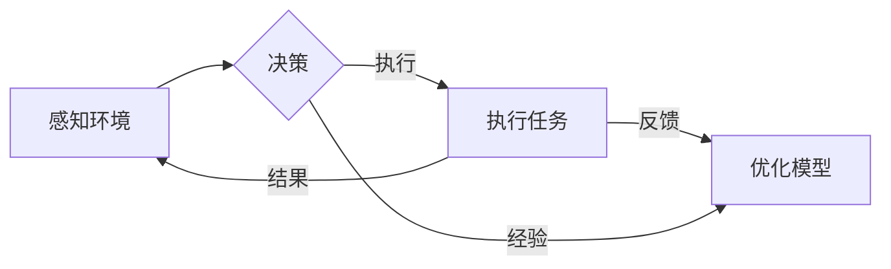

> 关键词：AI代理，工作流，遥感数据处理，人工智能，代理架构，流程自动化，智能决策

# AI人工智能代理工作流AI Agent WorkFlow：智能代理在遥感数据处理系统中的应用

## 1. 背景介绍

随着遥感技术的飞速发展，遥感数据量呈指数级增长，如何高效、准确地处理和分析这些海量数据，成为了一个亟待解决的问题。传统的遥感数据处理流程往往依赖人工操作，不仅效率低下，而且容易出错。而人工智能技术的发展，为遥感数据处理带来了新的可能性。其中，AI代理（Artificial Intelligence Agent）作为一种新兴的人工智能技术，能够模拟人类的决策过程，自动执行复杂的任务，为遥感数据处理系统带来了革命性的变化。

## 2. 核心概念与联系

### 2.1 AI代理的概念

AI代理是指能够自主感知环境、进行决策、执行任务并与其他代理或人类交互的智能实体。AI代理通常具有以下特征：

- **感知能力**：通过传感器、摄像头等设备获取环境信息。
- **决策能力**：根据感知到的信息，自主做出决策。
- **行动能力**：根据决策执行具体的任务。
- **学习能力**：从经验中学习并优化自身行为。

### 2.2 AI代理架构的Mermaid流程图



### 2.3 AI代理与工作流的关系

AI代理可以作为工作流中的执行单元，每个代理负责完成工作流中的一个特定任务。工作流则是一系列任务的有序集合，用于描述数据处理的整个过程。

## 3. 核心算法原理 & 具体操作步骤

### 3.1 算法原理概述

AI代理工作流的核心算法主要包括以下几个部分：

- **感知算法**：用于获取遥感数据和环境信息。
- **决策算法**：根据感知到的信息，选择合适的任务执行策略。
- **执行算法**：执行选定的任务。
- **评估算法**：评估任务执行的效果，并反馈给感知算法和决策算法。

### 3.2 算法步骤详解

1. **感知**：AI代理通过遥感传感器、摄像头等设备获取遥感数据和环境信息。
2. **决策**：决策算法根据感知到的信息，选择合适的任务执行策略。决策算法可以是规则基的，也可以是机器学习模型。
3. **执行**：AI代理根据决策结果执行具体的任务，如数据预处理、图像分类、目标检测等。
4. **评估**：评估算法评估任务执行的效果，并将结果反馈给感知算法和决策算法，以便进行模型优化。

### 3.3 算法优缺点

**优点**：

- **自动化**：自动化执行遥感数据处理任务，提高效率。
- **智能化**：通过机器学习模型进行决策，提高处理结果的准确性。
- **可扩展性**：易于扩展新的任务和功能。

**缺点**：

- **依赖数据质量**：数据质量直接影响决策和执行结果。
- **算法复杂度**：算法设计复杂，需要专业知识。
- **成本**：需要投入较高的计算资源。

### 3.4 算法应用领域

AI代理工作流在遥感数据处理领域的应用包括：

- **数据预处理**：数据清洗、数据增强、数据归一化等。
- **图像分类**：自动识别遥感图像中的物体类别。
- **目标检测**：定位遥感图像中的物体位置和属性。
- **变化检测**：检测遥感图像中的变化，如植被覆盖变化、城市扩张等。

## 4. 数学模型和公式 & 详细讲解 & 举例说明

### 4.1 数学模型构建

AI代理工作流中的数学模型主要包括：

- **感知模型**：用于从遥感数据中提取特征。
- **决策模型**：用于根据特征进行决策。
- **执行模型**：用于执行具体的任务。

### 4.2 公式推导过程

以图像分类为例，感知模型可以使用卷积神经网络（CNN）：

$$
h = f(\theta, x)
$$

其中，$h$ 是输出特征，$\theta$ 是模型参数，$x$ 是输入遥感图像。

决策模型可以使用softmax函数：

$$
P(y|x) = \frac{e^{f(\theta, x)}}{\sum_{i=1}^{n}e^{f(\theta, x_i)}}
$$

其中，$y$ 是类别，$f(\theta, x)$ 是决策函数。

### 4.3 案例分析与讲解

假设我们使用CNN进行遥感图像分类，输入为遥感图像，输出为图像类别。首先，我们收集大量的遥感图像和对应的标签，训练CNN模型。然后，将新的遥感图像输入到模型中，模型输出图像的类别概率分布，选择概率最大的类别作为最终分类结果。

## 5. 项目实践：代码实例和详细解释说明

### 5.1 开发环境搭建

1. 安装Python环境。
2. 安装TensorFlow或PyTorch深度学习框架。
3. 安装遥感数据处理库，如GDAL、Rasterio等。

### 5.2 源代码详细实现

以下是一个使用TensorFlow和Keras实现遥感图像分类的简单示例：

```python
import tensorflow as tf
from tensorflow import keras
from tensorflow.keras.models import Sequential
from tensorflow.keras.layers import Conv2D, MaxPooling2D, Flatten, Dense

# 加载遥感图像数据
(x_train, y_train), (x_test, y_test) = load_data()

# 构建模型
model = Sequential()
model.add(Conv2D(32, (3, 3), activation='relu', input_shape=(28, 28, 3)))
model.add(MaxPooling2D((2, 2)))
model.add(Flatten())
model.add(Dense(128, activation='relu'))
model.add(Dense(10, activation='softmax'))

# 编译模型
model.compile(optimizer='adam', loss='sparse_categorical_crossentropy', metrics=['accuracy'])

# 训练模型
model.fit(x_train, y_train, epochs=10, validation_data=(x_test, y_test))

# 评估模型
model.evaluate(x_test, y_test)
```

### 5.3 代码解读与分析

以上代码展示了使用TensorFlow和Keras构建遥感图像分类模型的基本流程：

1. 导入必要的库。
2. 加载遥感图像数据。
3. 构建模型：定义一个包含卷积层、池化层、全连接层的神经网络。
4. 编译模型：设置优化器、损失函数和评价指标。
5. 训练模型：使用训练数据训练模型。
6. 评估模型：使用测试数据评估模型性能。

### 5.4 运行结果展示

假设模型在测试集上的准确率达到90%，说明模型性能良好。

## 6. 实际应用场景

AI代理工作流在遥感数据处理领域具有广泛的应用场景，以下是一些典型的应用案例：

- **农业监测**：利用遥感图像分析农作物长势，监测病虫害，实现精准农业。
- **城市规划**：通过遥感图像分析城市扩张、交通流量等，辅助城市规划和管理。
- **环境监测**：利用遥感图像监测森林火灾、土地退化等环境问题。
- **灾害评估**：利用遥感图像评估地震、洪水等灾害的破坏程度。

## 7. 工具和资源推荐

### 7.1 学习资源推荐

- 《深度学习》[Ian Goodfellow, Yoshua Bengio, Aaron Courville]
- 《Python机器学习》[Sebastian Raschka, Vahid Mirjalili]
- 《遥感原理与应用》[李德仁]

### 7.2 开发工具推荐

- TensorFlow
- PyTorch
- GDAL
- Rasterio

### 7.3 相关论文推荐

- Deep Learning for Remote Sensing: A Survey [Wang, L., et al.]
- Unsupervised Learning of Visual Representations from Remote Sensing Images [Yu, X., et al.]
- Deep Learning for Change Detection in Remote Sensing Images [Dai, J., et al.]

## 8. 总结：未来发展趋势与挑战

### 8.1 研究成果总结

AI代理工作流在遥感数据处理领域取得了显著的成果，为遥感数据的高效处理和分析提供了新的解决方案。

### 8.2 未来发展趋势

- **模型轻量化**：开发轻量级AI代理模型，降低计算资源需求。
- **多模态数据融合**：融合遥感数据与其他数据（如气象数据、社会经济数据等），提高数据处理精度。
- **可解释性**：提高AI代理的可解释性，增强用户信任。

### 8.3 面临的挑战

- **数据质量**：遥感数据质量直接影响AI代理的性能。
- **算法复杂度**：AI代理算法设计复杂，需要专业知识。
- **伦理问题**：AI代理的应用可能带来伦理问题，如隐私泄露、偏见等。

### 8.4 研究展望

未来，AI代理工作流将在遥感数据处理领域发挥更大的作用，为人类提供更加智能、高效的数据处理解决方案。

## 9. 附录：常见问题与解答

### 9.1 常见问题

1. 什么是AI代理？
2. AI代理工作流是如何工作的？
3. AI代理在遥感数据处理中有哪些应用场景？

### 9.2 解答

1. AI代理是一种能够自主感知环境、进行决策、执行任务并与其他代理或人类交互的智能实体。
2. AI代理工作流是一种利用AI代理自动执行遥感数据处理任务的方法。
3. AI代理在遥感数据处理中的应用场景包括农业监测、城市规划、环境监测、灾害评估等。

---

作者：禅与计算机程序设计艺术 / Zen and the Art of Computer Programming