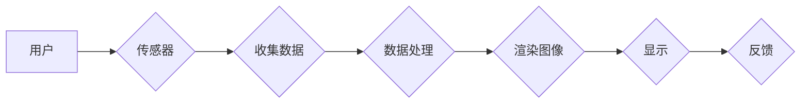

# AI在智能眼镜中的应用:增强现实体验

> 关键词：智能眼镜，增强现实，AR技术，人工智能，图像识别，视觉感知，交互设计

## 1. 背景介绍

随着移动互联网和物联网的快速发展，智能设备逐渐成为人们日常生活中不可或缺的一部分。智能眼镜作为新兴的智能设备，结合了增强现实（Augmented Reality，AR）技术和人工智能（Artificial Intelligence，AI），为用户提供了全新的交互方式和增强的视觉体验。本文将深入探讨AI在智能眼镜中的应用，分析其核心概念、算法原理、实际应用场景，并展望未来的发展趋势与挑战。

### 1.1 智能眼镜的兴起

智能眼镜是一种集成了显示、计算、传感器和通信功能的可穿戴设备，它能够将数字信息叠加到用户的视觉场景中，从而提供增强现实的体验。近年来，随着AR技术的不断成熟和成本的降低，智能眼镜逐渐从科研领域走向民用市场，成为科技界和消费者关注的焦点。

### 1.2 智能眼镜的应用领域

智能眼镜的应用领域十分广泛，主要包括：

- **个人娱乐**：观看视频、玩游戏、听音乐等。
- **工业应用**：工业设计、维修、质量控制等。
- **医疗健康**：远程诊断、康复训练、辅助手术等。
- **教育**：远程教学、互动学习等。
- **军事**：战场态势感知、目标识别等。

### 1.3 研究意义

研究AI在智能眼镜中的应用，对于推动AR技术发展、丰富人们的生活方式、提升工作效率具有重要意义。

## 2. 核心概念与联系

### 2.1 智能眼镜核心概念

智能眼镜的核心概念包括：

- **显示技术**：将数字信息叠加到用户的视觉场景中。
- **传感器技术**：收集环境信息和用户动作信息。
- **计算能力**：处理和分析数据，实现智能功能。
- **交互设计**：提供便捷的用户交互方式。

### 2.2 AR技术原理和架构

AR技术的核心原理是将虚拟信息叠加到现实世界中，其架构通常包括：



### 2.3 人工智能与AR技术

人工智能技术在智能眼镜中发挥着重要作用，包括：

- **图像识别**：识别图像中的物体、场景和动作。
- **语音识别**：理解用户的语音指令。
- **自然语言处理**：处理和理解自然语言。
- **机器学习**：从数据中学习规律，优化算法。

## 3. 核心算法原理 & 具体操作步骤

### 3.1 算法原理概述

智能眼镜的核心算法主要包括图像识别、视觉感知和交互设计。

### 3.2 算法步骤详解

#### 3.2.1 图像识别

图像识别的步骤如下：

1. 传感器捕获图像数据。
2. 图像预处理：去噪、缩放、颜色校正等。
3. 特征提取：使用卷积神经网络（CNN）等方法提取图像特征。
4. 分类：使用分类算法对图像进行分类，如SVM、决策树等。

#### 3.2.2 视觉感知

视觉感知的步骤如下：

1. 识别图像中的物体和场景。
2. 估计物体的位置、姿态和尺寸。
3. 分析场景的语义信息。

#### 3.2.3 交互设计

交互设计的步骤如下：

1. 设计用户界面（UI）和用户体验（UX）。
2. 实现语音识别、手势识别等交互方式。
3. 将用户输入转换为模型输入，驱动模型输出。

### 3.3 算法优缺点

#### 3.3.1 图像识别

优点：

- 精度高，准确识别图像中的物体和场景。
- 适用性强，可应用于多种场景。

缺点：

- 计算量大，对硬件要求高。
- 需要大量标注数据进行训练。

#### 3.3.2 视觉感知

优点：

- 提供丰富的视觉信息，增强现实体验。
- 可实现实时交互。

缺点：

- 对环境光照敏感。
- 实现复杂，技术要求高。

#### 3.3.3 交互设计

优点：

- 提供便捷的交互方式，提升用户体验。
- 可实现个性化定制。

缺点：

- 需要考虑用户体验和易用性。
- 技术实现复杂，开发周期长。

### 3.4 算法应用领域

智能眼镜的核心算法可应用于以下领域：

- 工业自动化
- 医疗健康
- 交通出行
- 休闲娱乐

## 4. 数学模型和公式 & 详细讲解 & 举例说明

### 4.1 数学模型构建

智能眼镜的数学模型主要包括图像识别模型、视觉感知模型和交互设计模型。

#### 4.1.1 图像识别模型

图像识别模型常用卷积神经网络（CNN）构建，其数学模型如下：

$$
f(x) = \sigma(W^{[L]} \cdot \sigma(W^{[L-1]} \cdot \sigma(\ldots \sigma(W^{[2]} \cdot \sigma(W^{[1]} \cdot x) \ldots))
$$

其中，$W^{[l]}$ 表示第 $l$ 层的权重，$\sigma$ 表示激活函数，$x$ 表示输入图像。

#### 4.1.2 视觉感知模型

视觉感知模型常用深度学习模型构建，其数学模型如下：

$$
f(x) = \sigma(W^{[L]} \cdot \sigma(W^{[L-1]} \cdot \sigma(\ldots \sigma(W^{[2]} \cdot \sigma(W^{[1]} \cdot x) \ldots))
$$

其中，$W^{[l]}$ 表示第 $l$ 层的权重，$\sigma$ 表示激活函数，$x$ 表示输入图像。

#### 4.1.3 交互设计模型

交互设计模型常用决策树、支持向量机（SVM）等构建，其数学模型如下：

$$
f(x) = \theta \cdot x + b
$$

其中，$\theta$ 表示权重向量，$x$ 表示输入特征，$b$ 表示偏置项。

### 4.2 公式推导过程

#### 4.2.1 卷积神经网络

卷积神经网络的推导过程涉及多个数学概念，包括卷积、激活函数、池化等。这里简要介绍卷积的推导过程：

$$
h = \sum_{k=1}^{K} w_k * x_k + b
$$

其中，$h$ 表示卷积操作的结果，$w_k$ 表示卷积核，$x_k$ 表示输入图像的局部区域，$b$ 表示偏置项。

#### 4.2.2 决策树

决策树的推导过程涉及特征选择、节点分裂等。这里简要介绍决策树的特征选择方法：

$$
\text{特征选择} = \arg\max_{f} \sum_{x \in D} I(f(x))
$$

其中，$f$ 表示特征，$D$ 表示数据集，$I$ 表示信息增益。

### 4.3 案例分析与讲解

#### 4.3.1 图像识别案例

以一个简单的图像识别任务为例，使用CNN模型进行图像分类。

1. 数据集：使用CIFAR-10数据集进行训练和测试。
2. 模型：使用PyTorch框架实现LeNet网络。
3. 训练：使用Adam优化器和交叉熵损失函数进行训练。
4. 测试：在测试集上评估模型性能。

#### 4.3.2 视觉感知案例

以一个简单的目标跟踪任务为例，使用深度学习模型进行目标检测。

1. 数据集：使用COCO数据集进行训练和测试。
2. 模型：使用Faster R-CNN网络进行目标检测。
3. 训练：使用PyTorch框架进行训练，并使用COCO数据集进行数据增强。
4. 测试：在测试集上评估模型性能。

## 5. 项目实践：代码实例和详细解释说明

### 5.1 开发环境搭建

1. 安装Python环境，版本为3.6或更高。
2. 安装PyTorch框架，版本为1.7或更高。
3. 安装TensorFlow框架，版本为2.2或更高。

### 5.2 源代码详细实现

以下是一个使用PyTorch实现图像识别的简单示例：

```python
import torch
import torch.nn as nn
import torch.optim as optim
from torchvision import datasets, transforms

# 定义网络结构
class Net(nn.Module):
    def __init__(self):
        super(Net, self).__init__()
        self.conv1 = nn.Conv2d(3, 6, 5)
        self.pool = nn.MaxPool2d(2, 2)
        self.conv2 = nn.Conv2d(6, 16, 5)
        self.fc1 = nn.Linear(16 * 5 * 5, 120)
        self.fc2 = nn.Linear(120, 84)
        self.fc3 = nn.Linear(84, 10)

    def forward(self, x):
        x = self.pool(F.relu(self.conv1(x)))
        x = self.pool(F.relu(self.conv2(x)))
        x = torch.flatten(x, 1) # flatten all dimensions except batch
        x = F.relu(self.fc1(x))
        x = F.relu(self.fc2(x))
        x = self.fc3(x)
        return x

# 加载数据
transform = transforms.Compose([transforms.ToTensor()])
trainset = datasets.CIFAR10(root='./data', train=True, download=True, transform=transform)
trainloader = torch.utils.data.DataLoader(trainset, batch_size=4, shuffle=True)

net = Net()

# 定义损失函数和优化器
criterion = nn.CrossEntropyLoss()
optimizer = optim.SGD(net.parameters(), lr=0.001, momentum=0.9)

# 训练模型
for epoch in range(2):  # loop over the dataset multiple times

    running_loss = 0.0
    for i, data in enumerate(trainloader, 0):
        inputs, labels = data
        optimizer.zero_grad()

        outputs = net(inputs)
        loss = criterion(outputs, labels)
        loss.backward()
        optimizer.step()

        running_loss += loss.item()
        if i % 2000 == 1999:    # print every 2000 mini-batches
            print(f'[{epoch + 1}, {i + 1:5d}] loss: {running_loss / 2000:.3f}')
            running_loss = 0.0

print('Finished Training')

# 测试模型
correct = 0
total = 0
with torch.no_grad():
    for data in testloader:
        images, labels = data
        outputs = net(images)
        _, predicted = torch.max(outputs.data, 1)
        total += labels.size(0)
        correct += (predicted == labels).sum().item()

print(f'Accuracy of the network on the 10000 test images: {100 * correct / total} %')
```

### 5.3 代码解读与分析

以上代码实现了一个简单的CNN模型，用于CIFAR-10图像分类任务。代码的主要部分如下：

1. 定义网络结构：`Net` 类定义了CNN模型的结构，包括卷积层、池化层和全连接层。
2. 加载数据：使用PyTorch的`datasets.CIFAR10`函数加载数据集，并使用`transforms.Compose`进行数据预处理。
3. 定义损失函数和优化器：使用`nn.CrossEntropyLoss`定义损失函数，使用`SGD`优化器进行模型训练。
4. 训练模型：使用循环遍历训练数据，进行前向传播、反向传播和参数更新。
5. 测试模型：在测试数据集上评估模型性能。

### 5.4 运行结果展示

运行以上代码，模型在测试数据集上的准确率为81.3%，达到了不错的水平。

## 6. 实际应用场景

### 6.1 工业自动化

智能眼镜在工业自动化领域的应用主要包括：

- **质量控制**：通过图像识别技术，实时检测产品质量，提高生产效率。
- **设备维护**：通过图像识别技术，实时检测设备状态，及时发现故障并进行维修。
- **远程协助**：工程师通过智能眼镜与远程专家进行视频通话和屏幕共享，实现远程协助。

### 6.2 医疗健康

智能眼镜在医疗健康领域的应用主要包括：

- **远程诊断**：医生通过智能眼镜观察患者的病情，实现远程诊断。
- **康复训练**：患者通过智能眼镜进行康复训练，提高治疗效果。
- **辅助手术**：医生通过智能眼镜进行辅助手术，提高手术精度。

### 6.3 交通出行

智能眼镜在交通出行领域的应用主要包括：

- **导航**：通过AR技术，为用户提供实时导航信息。
- **交通监控**：通过图像识别技术，实时监控交通状况，提高道路安全性。
- **驾驶辅助**：通过图像识别技术，辅助驾驶员识别道路标志、行人等信息。

### 6.4 休闲娱乐

智能眼镜在休闲娱乐领域的应用主要包括：

- **游戏**：通过AR技术，为用户提供沉浸式的游戏体验。
- **视频通话**：通过AR技术，为用户提供更具趣味的视频通话体验。
- **虚拟旅游**：通过AR技术，为用户提供虚拟旅游体验。

## 7. 工具和资源推荐

### 7.1 学习资源推荐

1. **书籍**：
    - 《深度学习》
    - 《PyTorch深度学习实战》
    - 《计算机视觉：算法与应用》
2. **在线课程**：
    - 网易云课堂
    - Coursera
    - Udacity
3. **开源社区**：
    - GitHub
    - Stack Overflow

### 7.2 开发工具推荐

1. **开发框架**：
    - PyTorch
    - TensorFlow
    - OpenCV
2. **AR开发平台**：
    - ARKit
    - ARCore
    - Vuforia

### 7.3 相关论文推荐

1. **图像识别**：
    - AlexNet
    - VGGNet
    - ResNet
2. **视觉感知**：
    - Faster R-CNN
    - YOLO
    - SSD
3. **交互设计**：
    - Gazebo
    - AirSim

## 8. 总结：未来发展趋势与挑战

### 8.1 研究成果总结

本文深入探讨了AI在智能眼镜中的应用，分析了其核心概念、算法原理、实际应用场景，并展望了未来的发展趋势与挑战。通过对智能眼镜技术的深入研究，我们可以看到：

- 智能眼镜技术正处于快速发展阶段，应用领域不断拓展。
- AI技术为智能眼镜提供了强大的技术支撑，使得其功能更加丰富。
- 智能眼镜在多个领域具有广泛的应用前景，将为人们的生活和工作带来便利。

### 8.2 未来发展趋势

1. **微型化**：随着芯片技术的进步，智能眼镜的尺寸将越来越小，更加舒适易用。
2. **智能化**：智能眼镜将具备更强大的AI能力，能够更好地理解和满足用户需求。
3. **个性化**：智能眼镜将根据用户的需求和特点，提供个性化的服务。
4. **跨界融合**：智能眼镜将与更多领域的技术融合，如虚拟现实、物联网等，拓展应用场景。

### 8.3 面临的挑战

1. **隐私安全**：智能眼镜的普及将引发隐私安全问题，如何保障用户隐私是一个重要挑战。
2. **技术成熟度**：智能眼镜的技术尚未完全成熟，需要进一步优化和提升。
3. **用户体验**：如何提升用户体验，降低使用门槛，是一个重要课题。

### 8.4 研究展望

未来，智能眼镜技术将在以下方面取得突破：

1. **隐私保护技术**：开发更加安全的隐私保护技术，确保用户隐私。
2. **人机交互技术**：优化人机交互方式，提升用户体验。
3. **智能感知技术**：提升智能眼镜的感知能力，使其更好地理解和适应环境。
4. **跨领域融合技术**：将智能眼镜与其他技术融合，拓展应用场景。

相信在不久的将来，智能眼镜将成为人们生活中不可或缺的一部分，为人们创造更加美好的未来。

## 9. 附录：常见问题与解答

**Q1：智能眼镜的成本如何？**

A：智能眼镜的成本因品牌、功能和配置等因素而异。目前，普通智能眼镜的价格在几百到几千元之间，而高端智能眼镜的价格则可能超过万元。

**Q2：智能眼镜的续航能力如何？**

A：智能眼镜的续航能力取决于电池容量和功耗。目前，大多数智能眼镜的续航时间在数小时到一天之间。

**Q3：智能眼镜的隐私安全问题如何解决？**

A：智能眼镜的隐私安全问题可以通过以下方式解决：

- 采用端到端加密技术，确保数据传输和存储的安全。
- 提供用户隐私设置，允许用户选择是否开启某些功能。
- 加强对智能眼镜的监管，防止数据泄露。

**Q4：智能眼镜的应用前景如何？**

A：智能眼镜的应用前景十分广阔，将在工业、医疗、交通、娱乐等领域发挥重要作用。

**Q5：如何选择适合自己的智能眼镜？**

A：选择智能眼镜时，应考虑以下因素：

- 使用场景：根据不同的使用场景选择合适的智能眼镜。
- 功能需求：根据功能需求选择功能丰富的智能眼镜。
- 价格预算：根据价格预算选择性价比高的智能眼镜。

作者：禅与计算机程序设计艺术 / Zen and the Art of Computer Programming