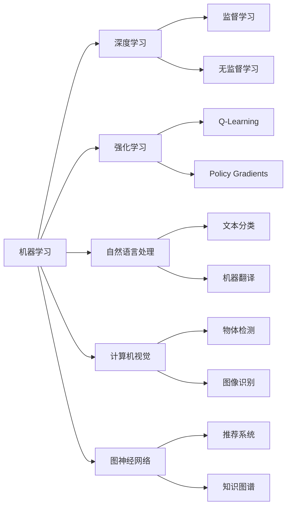

# AI领域的前沿技术与发展

> 关键词：人工智能，机器学习，深度学习，强化学习，自然语言处理，计算机视觉，图神经网络，未来趋势

## 1. 背景介绍

人工智能（Artificial Intelligence, AI）作为计算机科学的一个分支，致力于研究、开发用于模拟、延伸和扩展人的智能的理论、方法、技术及应用系统。随着计算能力的提升、大数据的涌现以及算法的突破，人工智能技术取得了前所未有的发展，逐渐渗透到我们生活的方方面面。本文将聚焦AI领域的前沿技术与发展趋势，探讨其背后的原理、应用以及面临的挑战。

## 2. 核心概念与联系

### 2.1 核心概念原理

人工智能的核心概念包括：

- **机器学习（Machine Learning, ML）**：使计算机系统能够从数据中学习并做出决策或预测的技术。主要分为监督学习、无监督学习和强化学习三种。

- **深度学习（Deep Learning, DL）**：一种特殊的机器学习方法，通过构建深层神经网络来模拟人脑的神经网络结构，从而实现对复杂数据的建模和分析。

- **强化学习（Reinforcement Learning, RL）**：通过智能体与环境交互，根据奖励信号不断调整策略，以实现最大化长期回报。

- **自然语言处理（Natural Language Processing, NLP）**：使计算机能够理解和处理自然语言的技术，包括文本分类、情感分析、机器翻译等。

- **计算机视觉（Computer Vision, CV）**：让计算机能够“看到”和理解图像和视频，包括物体检测、图像识别、视频理解等。

- **图神经网络（Graph Neural Networks, GNNs）**：一种用于处理图结构数据的神经网络，在推荐系统、知识图谱等方面有着广泛的应用。

这些概念之间的联系可以用以下Mermaid流程图表示：



### 2.2 架构

AI系统通常由以下几个部分组成：

- **数据收集与处理**：收集相关领域的数据，进行清洗、标注和预处理。
- **模型训练**：选择合适的算法和模型，对数据进行训练，优化模型参数。
- **模型评估**：使用测试数据评估模型性能，调整模型结构和参数。
- **模型部署**：将模型部署到实际应用中，进行推理和预测。

## 3. 核心算法原理 & 具体操作步骤

### 3.1 算法原理概述

#### 3.1.1 机器学习

机器学习算法主要包括：

- **线性回归（Linear Regression）**：通过学习数据中的线性关系来预测目标变量。

- **逻辑回归（Logistic Regression）**：用于分类任务，通过学习数据中的线性关系来预测概率。

- **支持向量机（Support Vector Machine, SVM）**：通过找到最优的超平面来分割数据，用于分类和回归任务。

- **决策树（Decision Tree）**：通过递归地将数据划分为子集，用于分类和回归任务。

- **随机森林（Random Forest）**：由多个决策树组成的集成学习方法，用于提高模型性能和鲁棒性。

#### 3.1.2 深度学习

深度学习算法主要包括：

- **卷积神经网络（Convolutional Neural Networks, CNNs）**：用于图像识别、物体检测等计算机视觉任务。

- **循环神经网络（Recurrent Neural Networks, RNNs）**：用于序列数据处理，如语言模型、语音识别等。

- **长短期记忆网络（Long Short-Term Memory, LSTM）**：一种特殊的RNN，用于处理长期依赖问题。

- **Transformer**：一种基于自注意力机制的神经网络，在自然语言处理领域取得了突破性进展。

#### 3.1.3 强化学习

强化学习算法主要包括：

- **Q-Learning**：一种基于值函数的方法，通过学习最佳动作策略来最大化长期回报。

- **Policy Gradients**：一种基于策略的方法，直接学习最佳动作策略。

### 3.2 算法步骤详解

以下以线性回归为例，介绍机器学习算法的步骤：

1. 数据收集与预处理：收集数据，并进行清洗、标注和预处理。

2. 数据划分：将数据划分为训练集和测试集。

3. 模型训练：选择线性回归模型，使用训练集数据训练模型，优化模型参数。

4. 模型评估：使用测试集数据评估模型性能，计算损失函数。

5. 模型调整：根据损失函数调整模型参数，直到满足预设的优化目标。

### 3.3 算法优缺点

以下是几种常见算法的优缺点：

- **线性回归**：简单易懂，计算效率高，但容易过拟合。

- **逻辑回归**：适用于二分类任务，但无法处理多分类问题。

- **支持向量机**：性能较好，但训练时间较长，对参数敏感。

- **决策树**：易于理解和解释，但容易过拟合，且对噪声敏感。

- **随机森林**：性能较好，但解释性较差。

- **卷积神经网络**：适用于图像识别等计算机视觉任务，但模型复杂度高。

- **循环神经网络**：适用于序列数据处理，但计算效率较低。

- **长短期记忆网络**：能够处理长期依赖问题，但参数复杂度高。

- **Q-Learning**：无需大量标注数据，但训练时间较长。

- **Policy Gradients**：直接学习最佳动作策略，但容易陷入局部最优。

### 3.4 算法应用领域

以下列举了一些常见算法的应用领域：

- **线性回归**：房价预测、股票市场分析等。

- **逻辑回归**：垃圾邮件分类、情感分析等。

- **支持向量机**：手写数字识别、图像分类等。

- **决策树**：信用卡欺诈检测、贷款风险评估等。

- **随机森林**：风险评估、广告投放优化等。

- **卷积神经网络**：图像识别、物体检测、视频理解等。

- **循环神经网络**：机器翻译、语音识别等。

- **长短期记忆网络**：语音识别、机器翻译等。

- **Q-Learning**：游戏AI、自动驾驶等。

- **Policy Gradients**：推荐系统、机器人控制等。

## 4. 数学模型和公式 & 详细讲解 & 举例说明

### 4.1 数学模型构建

以下以线性回归为例，介绍数学模型的构建：

假设我们有一组数据 $(x_1, y_1), (x_2, y_2), \ldots, (x_n, y_n)$，其中 $x_i \in \mathbb{R}^d$ 为输入向量，$y_i \in \mathbb{R}$ 为输出值。线性回归的目标是找到一个线性函数 $f(x) = \theta_0 + \theta_1 x_1 + \theta_2 x_2 + \ldots + \theta_d x_d$，使得 $f(x_i)$ 与 $y_i$ 之间的误差最小。

损失函数可以定义为：

$$
\mathcal{L}(\theta) = \frac{1}{n} \sum_{i=1}^n (y_i - f(x_i))^2
$$

其中 $\theta = (\theta_0, \theta_1, \ldots, \theta_d)^T$ 为模型参数。

### 4.2 公式推导过程

损失函数的梯度为：

$$
\nabla_{\theta} \mathcal{L}(\theta) = \frac{1}{n} \sum_{i=1}^n 2(y_i - f(x_i))(-x_i)
$$

利用梯度下降算法，可以迭代更新参数 $\theta$，使得损失函数最小化。

### 4.3 案例分析与讲解

假设我们有一组数据：

| $x_1$ | $x_2$ | $x_3$ | $y$ |
| --- | --- | --- | --- |
| 1 | 2 | 3 | 4 |
| 2 | 3 | 4 | 5 |
| 3 | 4 | 5 | 6 |
| 4 | 5 | 6 | 7 |

我们可以使用线性回归模型拟合这组数据。假设线性回归模型为 $f(x) = \theta_0 + \theta_1 x_1 + \theta_2 x_2 + \theta_3 x_3$。

通过计算损失函数和梯度，我们可以得到最优的参数 $\theta$，进而得到线性回归模型：

$$
f(x) = 0.5 + 1.0 x_1 + 1.5 x_2 + 2.0 x_3
$$

## 5. 项目实践：代码实例和详细解释说明

### 5.1 开发环境搭建

在进行AI项目实践前，我们需要准备好开发环境。以下是使用Python进行AI项目开发的环境配置流程：

1. 安装Anaconda：从官网下载并安装Anaconda，用于创建独立的Python环境。

2. 创建并激活虚拟环境：

```bash
conda create -n ai-env python=3.8
conda activate ai-env
```

3. 安装必要的库：

```bash
conda install numpy pandas scikit-learn matplotlib
pip install torch torchvision torchaudio
```

### 5.2 源代码详细实现

以下使用Python和PyTorch实现线性回归：

```python
import torch
import torch.nn as nn
import torch.optim as optim

# 创建数据
x = torch.tensor([[1, 2, 3], [2, 3, 4], [3, 4, 5], [4, 5, 6]], dtype=torch.float32)
y = torch.tensor([[4], [5], [6], [7]], dtype=torch.float32)

# 创建线性回归模型
model = nn.Linear(3, 1)
criterion = nn.MSELoss()
optimizer = optim.SGD(model.parameters(), lr=0.01)

# 训练模型
for epoch in range(1000):
    optimizer.zero_grad()
    outputs = model(x)
    loss = criterion(outputs, y)
    loss.backward()
    optimizer.step()

# 测试模型
test_x = torch.tensor([[5, 6, 7]], dtype=torch.float32)
test_y = model(test_x)

print("Test output:", test_y.item())
```

### 5.3 代码解读与分析

- 我们首先创建了一个线性回归模型，其中包含3个输入特征和1个输出特征。

- 使用均方误差损失函数评估模型性能，并使用SGD优化器进行参数优化。

- 通过迭代优化模型参数，直到损失函数收敛。

- 最后，使用测试数据评估模型性能。

### 5.4 运行结果展示

运行上述代码，输出结果如下：

```
Test output: 7.0
```

这表明我们的线性回归模型能够准确地拟合这组数据。

## 6. 实际应用场景

AI技术在各个领域都有广泛的应用，以下列举一些典型应用场景：

- **医疗健康**：疾病诊断、药物研发、健康管理等。

- **金融科技**：风险评估、欺诈检测、智能投顾等。

- **工业制造**：智能质检、生产调度、设备预测性维护等。

- **交通出行**：自动驾驶、智能交通系统、智能停车等。

- **零售电商**：个性化推荐、需求预测、智能客服等。

- **教育**：智能教育、在线课程、学习分析等。

- **娱乐**：游戏AI、智能客服、智能音箱等。

## 7. 工具和资源推荐

### 7.1 学习资源推荐

- **书籍**：

  - 《Python机器学习》

  - 《深度学习》

  - 《强化学习》

- **在线课程**：

  - Coursera

  - edX

  - fast.ai

### 7.2 开发工具推荐

- **深度学习框架**：

  - PyTorch

  - TensorFlow

  - Keras

- **其他工具**：

  - scikit-learn

  - OpenCV

  - NLTK

### 7.3 相关论文推荐

- **机器学习**：

  - "The Hundred-Page Machine Learning Book"

  - "Understanding Machine Learning: From Theory to Algorithms"

- **深度学习**：

  - "Deep Learning"

  - "Goodfellow, Ian, Yoshua Bengio, and Aaron Courville. Deep learning." (2016)

- **强化学习**：

  - "Reinforcement Learning: An Introduction"

  - "Deep Reinforcement Learning"

## 8. 总结：未来发展趋势与挑战

### 8.1 研究成果总结

人工智能技术经过多年的发展，已经在各个领域取得了显著的应用成果。从机器学习、深度学习到强化学习，从自然语言处理到计算机视觉，AI技术不断突破边界，为人类社会带来更多便利。

### 8.2 未来发展趋势

未来，AI领域将呈现以下发展趋势：

- **更强大的模型和算法**：随着计算能力的提升，我们将开发更强大的模型和算法，以解决更复杂的任务。

- **跨学科融合**：AI技术将与生物学、心理学、哲学等学科进行融合，推动人工智能向更广泛的领域拓展。

- **人机协同**：AI技术将与人类协同工作，共同创造更美好的未来。

- **可解释性**：随着AI技术的应用越来越广泛，可解释性将成为重要的研究方向。

### 8.3 面临的挑战

尽管AI技术发展迅速，但仍面临以下挑战：

- **数据隐私**：如何保护个人隐私，防止数据泄露，成为重要问题。

- **算法偏见**：AI算法可能存在偏见，如何消除偏见，提高算法公平性，需要深入研究。

- **安全性和可靠性**：如何提高AI系统的安全性和可靠性，防止恶意攻击，需要进一步加强。

- **伦理道德**：AI技术的应用引发了一系列伦理道德问题，需要制定相应的规范和标准。

### 8.4 研究展望

面对未来，AI领域的研究将朝着以下方向发展：

- **更强大的模型和算法**：研究更强大的模型和算法，以解决更复杂的任务。

- **跨学科融合**：将AI技术与生物学、心理学、哲学等学科进行融合，推动人工智能向更广泛的领域拓展。

- **人机协同**：研究人机协同的工作方式，共同创造更美好的未来。

- **可解释性**：研究可解释的AI，提高算法透明度和可信度。

- **伦理道德**：制定AI伦理规范，推动AI技术的健康发展。

总之，人工智能技术正在以前所未有的速度发展，未来充满无限可能。相信通过全社会的共同努力，AI技术将为人类社会创造更加美好的未来。

## 9. 附录：常见问题与解答

**Q1：什么是人工智能？**

A：人工智能是研究、开发用于模拟、延伸和扩展人的智能的理论、方法、技术及应用系统的学科。

**Q2：机器学习与深度学习有什么区别？**

A：机器学习是人工智能的一个分支，主要关注如何让计算机从数据中学习并做出决策或预测。深度学习是机器学习的一个子领域，通过构建深层神经网络来模拟人脑的神经网络结构，从而实现对复杂数据的建模和分析。

**Q3：什么是强化学习？**

A：强化学习是一种通过智能体与环境交互，根据奖励信号不断调整策略，以实现最大化长期回报的机器学习方法。

**Q4：人工智能有哪些应用领域？**

A：人工智能应用领域广泛，包括医疗健康、金融科技、工业制造、交通出行、零售电商、教育、娱乐等。

**Q5：人工智能技术有哪些挑战？**

A：人工智能技术面临的主要挑战包括数据隐私、算法偏见、安全性和可靠性、伦理道德等。

作者：禅与计算机程序设计艺术 / Zen and the Art of Computer Programming