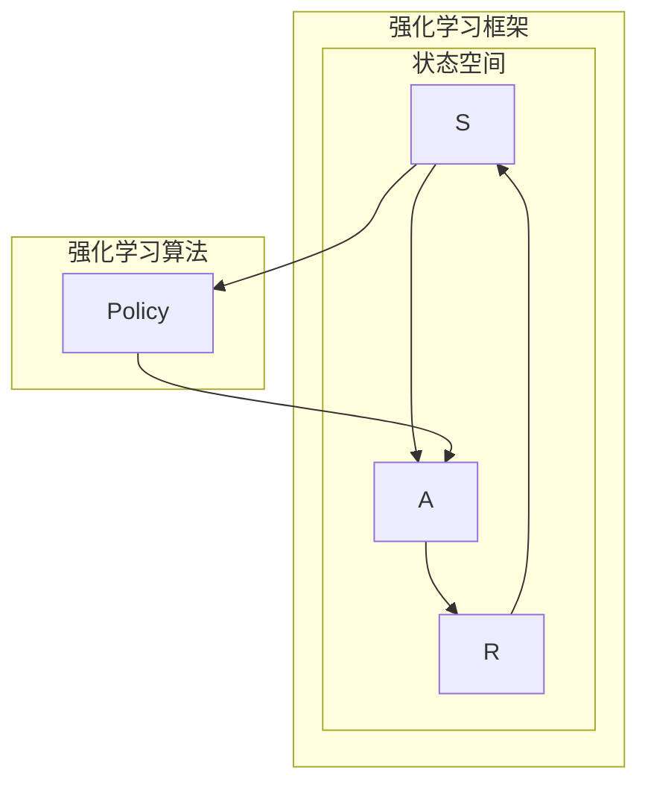
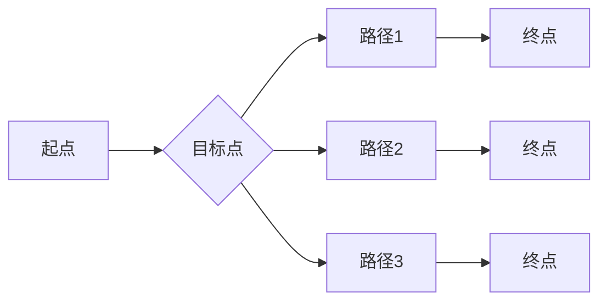
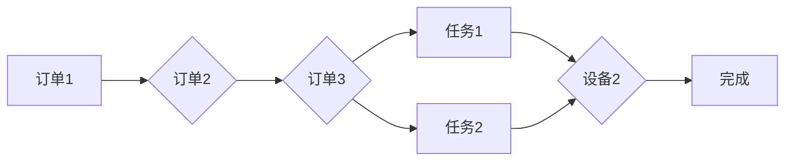
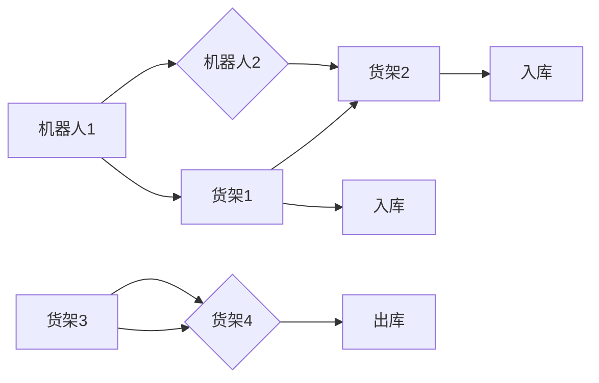

# 强化学习：在无人仓库中的应用

作者：禅与计算机程序设计艺术 / Zen and the Art of Computer Programming

## 1. 背景介绍
### 1.1 问题的由来

随着物联网、人工智能等技术的快速发展，无人仓库作为智能物流的重要组成部分，正逐渐成为现代物流体系的核心。无人仓库通过自动化设备和智能控制系统，实现了货物的自动出入库、分拣、存储等功能，大幅提高了仓储效率和降低人力成本。然而，无人仓库的运作过程中也面临着诸多挑战，如路径规划、任务调度、设备协同等，需要引入先进的智能算法进行优化。

强化学习（Reinforcement Learning，RL）作为一种模拟人类学习过程的智能算法，近年来在无人仓库领域得到了广泛的应用。通过让智能体在虚拟环境中学习和探索，强化学习可以帮助无人仓库实现高效、智能的运作。

### 1.2 研究现状

目前，强化学习在无人仓库中的应用主要集中在以下几个方面：

1. **路径规划**：通过强化学习算法，为机器人规划最优路径，避免碰撞，提高配送效率。

2. **任务调度**：根据仓库作业需求和设备状态，动态调度任务，优化作业流程。

3. **设备协同**：协调仓库内不同设备之间的动作，实现高效协同作业。

4. **风险评估**：实时评估仓库作业风险，及时采取措施防止事故发生。

### 1.3 研究意义

强化学习在无人仓库中的应用具有重要的研究意义：

1. **提高仓储效率**：通过优化路径规划、任务调度等，提高仓库作业效率，降低运营成本。

2. **提升安全性**：实时评估风险，预防事故发生，保障人员和设备安全。

3. **促进技术创新**：推动无人仓库领域的技术创新，推动物流行业智能化发展。

4. **拓展应用场景**：为无人仓库的扩展应用提供技术支持，如无人配送、智能拣选等。

### 1.4 本文结构

本文将从以下方面对强化学习在无人仓库中的应用进行详细介绍：

- 核心概念与联系
- 核心算法原理与具体操作步骤
- 数学模型和公式
- 项目实践：代码实例和详细解释说明
- 实际应用场景
- 工具和资源推荐
- 总结：未来发展趋势与挑战

## 2. 核心概念与联系

为更好地理解强化学习在无人仓库中的应用，本节将介绍一些关键概念及其相互联系：

- **强化学习**：一种通过与环境交互学习最优策略的机器学习方法。
- **智能体**：强化学习中的学习主体，通过与环境的交互来学习策略。
- **环境**：智能体执行动作、观察结果的场所。
- **状态**：智能体在某一时刻所处的环境状态。
- **动作**：智能体在状态上可以执行的操作。
- **奖励**：智能体执行动作后，环境给予的奖励信号。
- **策略**：智能体在给定状态下选择动作的规则。

这些概念之间的关系如下：



智能体在环境中的状态空间中不断进行状态-动作-奖励的交互，通过学习策略，在给定状态下选择最优动作，以获得最大化的累积奖励。

## 3. 核心算法原理 & 具体操作步骤
### 3.1 算法原理概述

强化学习算法的核心思想是：智能体通过与环境交互，学习到一种策略，使得在给定状态下能够选择最优动作，从而获得最大化的累积奖励。

强化学习算法通常分为以下几种：

- **值函数方法**：通过学习状态值函数和动作值函数，预测未来奖励，并选择最优动作。
- **策略梯度方法**：直接优化策略，使得在给定状态下能够选择最优动作。
- **模型预测方法**：在智能体内部建立环境模型，根据环境模型和策略进行决策。

### 3.2 算法步骤详解

强化学习算法的一般步骤如下：

1. 初始化智能体、环境、状态空间、动作空间、奖励函数等参数。
2. 智能体在环境中随机选择一个状态。
3. 根据当前状态，智能体选择一个动作。
4. 环境根据智能体的动作产生一个新的状态和奖励。
5. 智能体接收到新的状态和奖励，并更新其策略。
6. 重复步骤2-5，直到达到终止条件。

### 3.3 算法优缺点

**优点**：

- 自适应性强：能够根据环境的变化动态调整策略。
- 无需大量标注数据：可以通过与环境交互学习，无需大量标注数据。
- 应用范围广：适用于各种复杂环境，如无人驾驶、机器人控制等。

**缺点**：

- 训练过程耗时：需要大量的时间来与环境交互学习。
- 难以评估效果：评估强化学习算法的效果相对困难。
- 稳定性差：训练过程中容易受到随机性的影响。

### 3.4 算法应用领域

强化学习算法在无人仓库中的应用领域包括：

- 路径规划：为机器人规划最优路径，避免碰撞，提高配送效率。
- 任务调度：根据仓库作业需求和设备状态，动态调度任务，优化作业流程。
- 设备协同：协调仓库内不同设备之间的动作，实现高效协同作业。
- 风险评估：实时评估仓库作业风险，及时采取措施防止事故发生。

## 4. 数学模型和公式 & 详细讲解 & 举例说明
### 4.1 数学模型构建

强化学习算法的数学模型主要包括以下部分：

- **状态空间**：表示智能体可能处于的所有状态集合，通常用 $S$ 表示。
- **动作空间**：表示智能体可以执行的所有动作集合，通常用 $A$ 表示。
- **策略**：智能体在给定状态下选择动作的规则，通常用 $\pi(s)$ 表示。
- **奖励函数**：表示智能体执行动作后获得的奖励，通常用 $R(s,a)$ 表示。

### 4.2 公式推导过程

以下以Q学习算法为例，讲解强化学习算法的公式推导过程。

Q学习算法的目标是学习一个Q值函数 $Q(s,a)$，表示在状态 $s$ 下执行动作 $a$ 的期望奖励：

$$
Q(s,a) = \sum_{s'} P(s'|s,a)R(s,a) + \gamma \max_{a'} Q(s',a')
$$

其中，$P(s'|s,a)$ 表示在状态 $s$ 下执行动作 $a$，转移到状态 $s'$ 的概率；$\gamma$ 表示未来奖励的折扣因子。

Q学习算法的更新公式如下：

$$
Q(s,a) \leftarrow Q(s,a) + \alpha [R(s,a) + \gamma \max_{a'} Q(s',a') - Q(s,a)]
$$

其中，$\alpha$ 表示学习率。

### 4.3 案例分析与讲解

以下以路径规划为例，讲解强化学习算法在无人仓库中的应用。

假设仓库内的机器人需要从起点 $s_0$ 移动到终点 $s_1$，状态空间为 $S = \{s_0, s_1, \ldots, s_n\}$，动作空间为 $A = \{\text{左}, \text{右}, \text{上}, \text{下}\}$。

定义奖励函数 $R(s,a)$ 为：

- 当机器人移动到终点 $s_1$ 时，奖励 $R(s_1,a) = 1$；
- 当机器人发生碰撞时，奖励 $R(s,a) = -10$；
- 其他情况，奖励 $R(s,a) = 0$。

初始化Q值函数 $Q(s,a)$ 为：

$$
Q(s,a) = \begin{cases}
0, & s \
eq s_0 \
1, & s = s_1
\end{cases}
$$

智能体开始从起点 $s_0$ 开始，随机选择一个动作 $a$，假设选择了向右移动的动作 $a_1$。移动到状态 $s_1$ 后，获得奖励 $R(s_1,a_1) = 1$。然后，智能体继续向右移动，最终到达终点 $s_1$。

通过迭代更新Q值函数，智能体可以学习到在给定状态下选择最优动作的规则。

### 4.4 常见问题解答

**Q1：强化学习算法如何处理连续动作空间？**

A：对于连续动作空间，可以使用连续动作空间的优化算法，如梯度上升法、演员-评论家算法等。

**Q2：如何解决强化学习算法的稀疏奖励问题？**

A：可以通过以下方法解决稀疏奖励问题：
- 使用奖励衰减策略，降低奖励的稀疏性；
- 使用目标网络或经验回放等技术，提高算法的稳定性。

**Q3：如何评估强化学习算法的性能？**

A：可以通过以下方法评估强化学习算法的性能：
- 计算累积奖励；
- 评估算法的收敛速度；
- 评估算法在不同环境下的适应性。

## 5. 项目实践：代码实例和详细解释说明
### 5.1 开发环境搭建

以下是使用Python进行强化学习开发的环境配置流程：

1. 安装Anaconda：从官网下载并安装Anaconda，用于创建独立的Python环境。

2. 创建并激活虚拟环境：
```bash
conda create -n rl-env python=3.8
conda activate rl-env
```

3. 安装PyTorch：根据CUDA版本，从官网获取对应的安装命令。例如：
```bash
conda install pytorch torchvision torchaudio cudatoolkit=11.1 -c pytorch -c conda-forge
```

4. 安装其他工具包：
```bash
pip install gym matplotlib
```

完成上述步骤后，即可在`rl-env`环境中开始强化学习实践。

### 5.2 源代码详细实现

以下是一个简单的路径规划强化学习算法的示例：

```python
import gym
import numpy as np
import random

# 定义环境
class PathPlanningEnv(gym.Env):
    def __init__(self):
        super(PathPlanningEnv, self).__init__()
        self.action_space = gym.spaces.Discrete(4)  # 上下左右移动
        self.observation_space = gym.spaces.Discrete(16)  # 状态空间

    def step(self, action):
        s = self.state
        if action == 0:  # 向上移动
            s = s + 1 if s < 15 else s
        elif action == 1:  # 向下移动
            s = s - 1 if s > 0 else s
        elif action == 2:  # 向左移动
            s = s % 4 + 4
        elif action == 3:  # 向右移动
            s = (s + 1) % 4 + 4

        if s == 15:
            reward = 10
            done = True
        else:
            reward = 0
            done = False

        next_state = s
        return next_state, reward, done, {}

    def reset(self):
        self.state = random.randint(0, 15)
        return self.state

    def render(self, mode='human'):
        pass

# 创建环境
env = PathPlanningEnv()

# 定义Q学习算法
class QLearningAgent:
    def __init__(self, alpha=0.1, gamma=0.9, epsilon=0.1):
        self.alpha = alpha  # 学习率
        self.gamma = gamma  # 未来奖励的折扣因子
        self.epsilon = epsilon  # 探索概率
        self.q_table = np.zeros((16, 4))

    def choose_action(self, state):
        if random.random() < self.epsilon:
            return random.randint(0, 3)
        else:
            return np.argmax(self.q_table[state])

    def learn(self, state, action, reward, next_state):
        self.q_table[state][action] += self.alpha * (
            reward + self.gamma * np.max(self.q_table[next_state]) - self.q_table[state][action]
        )

# 实例化智能体
agent = QLearningAgent()

# 训练智能体
for i in range(1000):
    state = env.reset()
    done = False
    while not done:
        action = agent.choose_action(state)
        next_state, reward, done, _ = env.step(action)
        agent.learn(state, action, reward, next_state)
        state = next_state

# 评估智能体
state = env.reset()
done = False
while not done:
    action = agent.choose_action(state)
    next_state, reward, done, _ = env.step(action)
    print(f"状态: {state}, 动作: {action}, 奖励: {reward}")
    state = next_state
```

### 5.3 代码解读与分析

以上代码展示了使用Python实现路径规划强化学习算法的示例。主要包含以下几个部分：

- **PathPlanningEnv类**：定义了一个简单的路径规划环境，智能体需要在环境中找到从起点到终点的路径。

- **QLearningAgent类**：定义了一个Q学习智能体，包含选择动作、学习策略等方法。

- **训练智能体**：使用随机策略初始化智能体，然后通过与环境交互学习，不断更新Q值表。

- **评估智能体**：使用训练好的智能体在环境中进行测试，观察其性能。

### 5.4 运行结果展示

运行以上代码，可以看到智能体在环境中找到从起点到终点的路径，并不断优化其策略。

## 6. 实际应用场景
### 6.1 路径规划

路径规划是强化学习在无人仓库中最常见应用之一。通过让机器人学习在仓库环境中找到最优路径，避免碰撞，提高配送效率。

以下是一个无人仓库路径规划的示例：



### 6.2 任务调度

任务调度是强化学习在无人仓库中的另一个重要应用。通过让智能体学习在给定任务需求和设备状态的情况下，动态调度任务，优化作业流程。

以下是一个无人仓库任务调度的示例：



### 6.3 设备协同

设备协同是强化学习在无人仓库中的另一个重要应用。通过让智能体学习在仓库内不同设备之间协调动作，实现高效协同作业。

以下是一个无人仓库设备协同的示例：



### 6.4 未来应用展望

随着强化学习技术的不断发展，其在无人仓库中的应用将更加广泛，以下是一些未来应用展望：

- **多智能体协同**：实现多个机器人之间的协同作业，提高仓库作业效率。
- **动态环境适应**：让智能体能够适应动态变化的仓库环境，如货物摆放、货架高度等。
- **柔性生产**：实现无人仓库的柔性生产，适应不同产品种类和生产规模。
- **跨域应用**：将强化学习技术应用于其他物流场景，如无人配送、智能仓储等。

## 7. 工具和资源推荐
### 7.1 学习资源推荐

以下是一些关于强化学习的优质学习资源：

1. 《Reinforcement Learning: An Introduction》
2. 《Reinforcement Learning: Deep Reinforcement Learning with Python》
3. OpenAI Gym
4. TensorFlow Agents
5. stable_baselines3

### 7.2 开发工具推荐

以下是一些用于强化学习开发的工具：

1. PyTorch
2. TensorFlow
3. Stable Baselines
4. Ray
5. Stable Baselines3

### 7.3 相关论文推荐

以下是一些关于强化学习的经典论文：

1. "Reinforcement Learning: An Introduction"
2. "Playing Atari with Deep Reinforcement Learning"
3. "Asynchronous Methods for Deep Reinforcement Learning"
4. "Deep Q-Network"
5. "Proximal Policy Optimization"

### 7.4 其他资源推荐

以下是一些其他关于强化学习的资源：

1. arXiv
2. Coursera
3. Udacity
4. KEG Lab
5. UCL

## 8. 总结：未来发展趋势与挑战
### 8.1 研究成果总结

本文从强化学习的核心概念、算法原理、项目实践等方面，对强化学习在无人仓库中的应用进行了详细介绍。通过本文的学习，读者可以了解到强化学习在无人仓库领域的应用现状、挑战和发展趋势。

### 8.2 未来发展趋势

随着强化学习技术的不断发展，其在无人仓库中的应用将呈现以下发展趋势：

1. **算法创新**：开发更加高效、稳定、可解释的强化学习算法。
2. **跨域应用**：将强化学习技术应用于其他物流场景，如无人配送、智能仓储等。
3. **人机协同**：实现人机协同作业，提高仓库作业效率。
4. **个性化定制**：为不同类型的仓库提供个性化解决方案。

### 8.3 面临的挑战

尽管强化学习在无人仓库中具有广泛的应用前景，但同时也面临着以下挑战：

1. **算法复杂性**：强化学习算法通常较为复杂，难以理解和应用。
2. **数据需求**：强化学习需要大量的数据，获取和标注数据成本较高。
3. **环境建模**：构建准确的环境模型对强化学习效果至关重要。
4. **安全性和可靠性**：需要确保强化学习系统的安全性和可靠性。

### 8.4 研究展望

为了克服上述挑战，未来需要从以下几个方面进行研究和探索：

1. **算法简化**：研究更加高效、易用的强化学习算法。
2. **数据高效利用**：开发数据高效利用技术，降低数据获取和标注成本。
3. **环境建模**：研究更加准确、高效的环境建模方法。
4. **安全性和可靠性**：确保强化学习系统的安全性和可靠性。

相信随着研究的不断深入，强化学习在无人仓库中的应用将会更加广泛，为现代物流体系的发展贡献力量。

## 9. 附录：常见问题与解答

**Q1：什么是强化学习？**

A：强化学习是一种通过与环境交互学习最优策略的机器学习方法。

**Q2：强化学习有哪些应用领域？**

A：强化学习可以应用于各种领域，如无人驾驶、机器人控制、游戏、金融等。

**Q3：如何解决强化学习中的稀疏奖励问题？**

A：可以通过以下方法解决稀疏奖励问题：
- 使用奖励衰减策略，降低奖励的稀疏性；
- 使用目标网络或经验回放等技术，提高算法的稳定性。

**Q4：如何评估强化学习算法的性能？**

A：可以通过以下方法评估强化学习算法的性能：
- 计算累积奖励；
- 评估算法的收敛速度；
- 评估算法在不同环境下的适应性。

**Q5：如何将强化学习应用于无人仓库？**

A：可以将强化学习应用于无人仓库的路径规划、任务调度、设备协同等场景。

**Q6：如何克服强化学习中的挑战？**

A：可以通过以下方法克服强化学习中的挑战：
- 算法简化；
- 数据高效利用；
- 环境建模；
- 安全性和可靠性。

通过以上解答，希望能够帮助读者更好地理解强化学习在无人仓库中的应用。