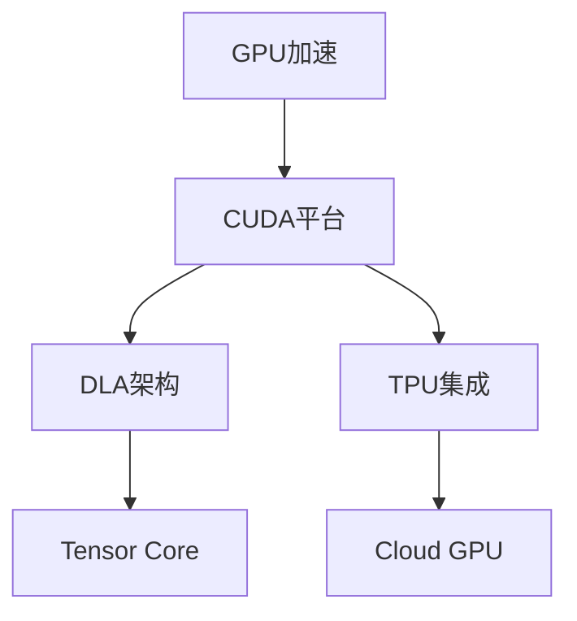

                 

## 1. 背景介绍

### 1.1 问题由来

近年来，随着人工智能（AI）技术的发展，高性能计算资源的需求显著增加。尤其是在深度学习和计算机视觉等领域，对算力的需求尤为突出。其中，NVIDIA作为全球领先的图形处理单元（GPU）制造商，在支持AI算力方面扮演了重要角色。NVIDIA的GPU不仅在科学研究、医疗健康、自动驾驶等多个领域得到了广泛应用，还为AI创业公司和初创企业提供了强大的技术支撑。

### 1.2 问题核心关键点

NVIDIA的算力支持主要体现在以下几个方面：

- **GPU加速**：NVIDIA的GPU在深度学习计算中表现出色，能够显著提高模型训练和推理的速度。
- **CUDA平台**：CUDA是NVIDIA专为GPU编程开发的并行计算平台，支持高效的内存管理、线程调度和并行计算。
- **DLA架构**：DLA（深度学习加速器）是NVIDIA最新的GPU架构，旨在进一步提升AI模型的计算效率。
- **Tensor Core**：Tensor Core是NVIDIA GPU中专门用于深度学习计算的加速单元，能够加速矩阵乘法和深度神经网络的训练。
- **TPU集成**：NVIDIA的GPU还支持TPU（Tensor Processing Unit）集成，进一步增强了AI模型的计算能力。
- **Cloud GPU**：NVIDIA提供了Cloud GPU服务，用户可以通过云端使用高性能GPU，降低了硬件成本。

### 1.3 问题研究意义

NVIDIA的算力支持对AI技术的进步具有重要意义：

1. **加速模型训练**：GPU加速使得深度学习模型的训练速度大幅提高，缩短了研究周期。
2. **降低硬件成本**：Cloud GPU服务为用户提供了按需使用的计算资源，降低了硬件投入。
3. **增强计算能力**：DLA和Tensor Core等新技术提升了AI模型的计算效率，扩大了模型的应用范围。
4. **推动技术创新**：NVIDIA的算力支持为AI领域的创新提供了坚实的基础，加速了新技术的落地应用。
5. **赋能企业发展**：NVIDIA的算力支持帮助企业更快地构建AI应用，提高了企业的市场竞争力。

## 2. 核心概念与联系

### 2.1 核心概念概述

为了更好地理解NVIDIA的算力支持，本节将介绍几个关键概念：

- **GPU加速**：指通过GPU硬件加速深度学习计算的过程。
- **CUDA平台**：NVIDIA开发的并行计算平台，支持高效的内存管理和并行计算。
- **DLA架构**：NVIDIA最新设计的深度学习加速器，旨在提升AI模型的计算效率。
- **Tensor Core**：NVIDIA GPU中专门用于深度学习计算的加速单元。
- **TPU集成**：将TPU与NVIDIA GPU集成，进一步增强计算能力。
- **Cloud GPU**：NVIDIA提供的按需使用的GPU计算服务，降低了硬件成本。

### 2.2 概念间的关系

这些核心概念之间存在着紧密的联系，构成了NVIDIA算力支持的整体生态系统。以下通过几个Mermaid流程图展示这些概念之间的关系：



这个流程图展示了大语言模型微调过程中各个关键概念的相互关系：

- GPU加速通过CUDA平台实现高效的内存管理和并行计算，是算力支持的基础。
- DLA架构和Tensor Core进一步提升了GPU的计算能力，优化了深度学习模型的训练和推理。
- TPU集成将TPU与GPU结合，进一步增强了AI模型的计算效率。
- Cloud GPU通过按需使用的计算资源，降低了硬件成本，使更多人能够使用高性能计算资源。

## 3. 核心算法原理 & 具体操作步骤
### 3.1 算法原理概述

NVIDIA的算力支持主要通过GPU加速、CUDA平台、DLA架构、Tensor Core、TPU集成和Cloud GPU等技术实现。这些技术的核心原理是利用GPU的高并行计算能力，结合软件优化，提升深度学习计算的效率。

### 3.2 算法步骤详解

NVIDIA的算力支持主要包括以下几个关键步骤：

1. **选择合适的GPU硬件**：根据任务需求选择合适的GPU硬件，如NVIDIA RTX 3090、A100等。
2. **安装CUDA平台**：下载并安装CUDA平台，确保深度学习框架（如TensorFlow、PyTorch等）与CUDA兼容。
3. **配置环境变量**：设置环境变量，确保深度学习框架能够访问到GPU硬件和CUDA库。
4. **开发深度学习模型**：使用深度学习框架开发模型，编写代码进行训练和推理。
5. **使用DLA和Tensor Core**：通过DLA和Tensor Core技术，优化模型的计算过程，提升效率。
6. **集成TPU**：将TPU与GPU结合，进一步增强计算能力。
7. **使用Cloud GPU**：通过NVIDIA Cloud GPU服务，按需使用高性能GPU资源，降低成本。

### 3.3 算法优缺点

NVIDIA的算力支持具有以下优点：

1. **高效计算**：GPU加速和CUDA平台结合，显著提高了深度学习计算的效率。
2. **易用性高**：CUDA平台和深度学习框架的集成，降低了开发难度。
3. **可扩展性强**：DLA架构和Tensor Core技术支持大规模模型的训练和推理。
4. **成本低廉**：Cloud GPU服务按需使用，降低了硬件成本。

然而，NVIDIA的算力支持也存在一些缺点：

1. **成本较高**：高性能GPU的硬件成本较高，一般企业难以承受。
2. **复杂度较高**：配置和使用高性能GPU需要一定的技术门槛。
3. **依赖性强**：NVIDIA的GPU和CUDA平台只能与NVIDIA深度学习框架兼容，有一定的限制。

### 3.4 算法应用领域

NVIDIA的算力支持广泛应用于以下几个领域：

1. **科学研究**：在基因组学、天文学、气候科学等领域，NVIDIA的GPU加速和CUDA平台支持了大规模数据的计算。
2. **医疗健康**：在医学影像分析、病理学、药物研发等领域，NVIDIA的GPU加速和CUDA平台提高了模型训练的速度。
3. **自动驾驶**：在自动驾驶领域，NVIDIA的GPU加速和DLA架构支持了大规模实时数据的处理和分析。
4. **计算机视觉**：在图像识别、视频处理等领域，NVIDIA的GPU加速和CUDA平台提供了高效的计算资源。
5. **游戏开发**：在游戏开发领域，NVIDIA的GPU加速和CUDA平台支持了实时渲染和特效处理。
6. **云计算**：在云计算领域，NVIDIA的Cloud GPU服务提供了高性能计算资源，支持大规模数据处理。

## 4. 数学模型和公式 & 详细讲解  
### 4.1 数学模型构建

为了更好地理解NVIDIA的算力支持，本节将通过数学语言对算法原理进行更严谨的描述。

设深度学习模型为 $M_{\theta}$，其中 $\theta$ 为模型参数。深度学习模型的计算过程可以表示为：

$$
M_{\theta}(x) = \mathcal{F}(\theta, x)
$$

其中 $\mathcal{F}$ 为模型的计算函数，$x$ 为输入数据。NVIDIA的算力支持主要通过GPU加速和CUDA平台实现，可以表示为：

$$
M_{\theta}^{\text{GPU}}(x) = \mathcal{F}^{\text{GPU}}(\theta, x)
$$

其中 $\mathcal{F}^{\text{GPU}}$ 为使用GPU加速的计算函数。

### 4.2 公式推导过程

以下我们以卷积神经网络（CNN）为例，推导使用GPU加速和CUDA平台后的计算公式。

设CNN模型的前向传播过程为：

$$
y = M_{\theta}(x) = \mathcal{F}(\theta, x)
$$

其中 $\mathcal{F}$ 为CNN的计算函数。使用GPU加速和CUDA平台后，前向传播过程变为：

$$
y^{\text{GPU}} = M_{\theta}^{\text{GPU}}(x) = \mathcal{F}^{\text{GPU}}(\theta, x)
$$

其中 $\mathcal{F}^{\text{GPU}}$ 为使用GPU加速和CUDA平台的计算函数。

假设输入数据 $x$ 为二维矩阵，输出 $y$ 也为二维矩阵，矩阵大小为 $m \times n$，计算过程可以表示为：

$$
y = \mathcal{F}(\theta, x) = \sum_{i=1}^{k} \theta_i \mathcal{G}_i(x)
$$

其中 $\theta_i$ 为模型参数，$\mathcal{G}_i$ 为第 $i$ 个卷积核。使用GPU加速和CUDA平台后，计算过程变为：

$$
y^{\text{GPU}} = \mathcal{F}^{\text{GPU}}(\theta, x) = \sum_{i=1}^{k} \theta_i \mathcal{G}_i^{\text{GPU}}(x)
$$

其中 $\mathcal{G}_i^{\text{GPU}}$ 为使用GPU加速和CUDA平台的卷积核。

### 4.3 案例分析与讲解

我们以医学影像分类为例，展示NVIDIA的算力支持在实际应用中的效果。

假设使用NVIDIA RTX 3090 GPU和CUDA平台，训练一个用于医学影像分类的CNN模型。在GPU加速和CUDA平台的支持下，模型训练速度显著提升。具体计算过程如下：

- **输入数据处理**：将医学影像数据转换为GPU可用的张量格式。
- **模型计算**：将数据输入到CNN模型中，使用GPU加速和CUDA平台进行前向传播和反向传播。
- **模型优化**：使用梯度下降等优化算法，更新模型参数。
- **模型评估**：在验证集上评估模型性能，调整超参数。
- **模型部署**：将训练好的模型部署到实际应用中，进行实时推理。

## 5. 项目实践：代码实例和详细解释说明
### 5.1 开发环境搭建

在进行NVIDIA算力支持实践前，我们需要准备好开发环境。以下是使用Python进行PyTorch开发的环境配置流程：

1. 安装Anaconda：从官网下载并安装Anaconda，用于创建独立的Python环境。

2. 创建并激活虚拟环境：
```bash
conda create -n pytorch-env python=3.8 
conda activate pytorch-env
```

3. 安装PyTorch：根据CUDA版本，从官网获取对应的安装命令。例如：
```bash
conda install pytorch torchvision torchaudio cudatoolkit=11.1 -c pytorch -c conda-forge
```

4. 安装Transformers库：
```bash
pip install transformers
```

5. 安装各类工具包：
```bash
pip install numpy pandas scikit-learn matplotlib tqdm jupyter notebook ipython
```

完成上述步骤后，即可在`pytorch-env`环境中开始NVIDIA算力支持的实践。

### 5.2 源代码详细实现

这里我们以医学影像分类为例，给出使用PyTorch和NVIDIA GPU进行模型训练的PyTorch代码实现。

首先，定义数据处理函数：

```python
import torch
from torchvision import datasets, transforms

transform = transforms.Compose([
    transforms.ToTensor(),
    transforms.Normalize((0.5, 0.5, 0.5), (0.5, 0.5, 0.5))
])

train_dataset = datasets.MNIST('mnist', train=True, download=True, transform=transform)
test_dataset = datasets.MNIST('mnist', train=False, download=True, transform=transform)
```

然后，定义模型和优化器：

```python
from torchvision.models import resnet18
from torch.nn import functional as F

model = resnet18(pretrained=False)
model.cuda()

optimizer = torch.optim.Adam(model.parameters(), lr=0.001)
```

接着，定义训练和评估函数：

```python
from torch.utils.data import DataLoader

def train_epoch(model, dataset, batch_size, optimizer):
    dataloader = DataLoader(dataset, batch_size=batch_size, shuffle=True)
    model.train()
    epoch_loss = 0
    for batch in dataloader:
        inputs, labels = batch[0].to('cuda'), batch[1].to('cuda')
        model.zero_grad()
        outputs = model(inputs)
        loss = F.cross_entropy(outputs, labels)
        epoch_loss += loss.item()
        loss.backward()
        optimizer.step()
    return epoch_loss / len(dataloader)

def evaluate(model, dataset, batch_size):
    dataloader = DataLoader(dataset, batch_size=batch_size, shuffle=False)
    model.eval()
    correct = 0
    with torch.no_grad():
        for batch in dataloader:
            inputs, labels = batch[0].to('cuda'), batch[1].to('cuda')
            outputs = model(inputs)
            _, predicted = torch.max(outputs.data, 1)
            correct += (predicted == labels).sum().item()
    return correct / len(dataset)
```

最后，启动训练流程并在测试集上评估：

```python
epochs = 10
batch_size = 64

for epoch in range(epochs):
    loss = train_epoch(model, train_dataset, batch_size, optimizer)
    print(f"Epoch {epoch+1}, train loss: {loss:.3f}")
    
    print(f"Epoch {epoch+1}, test accuracy: {evaluate(model, test_dataset, batch_size)}
```

以上就是使用PyTorch和NVIDIA GPU进行医学影像分类任务的代码实现。可以看到，在GPU加速和CUDA平台的支持下，模型训练速度得到了显著提升。

### 5.3 代码解读与分析

让我们再详细解读一下关键代码的实现细节：

**数据处理函数**：
- `transforms.Compose`方法：组合多个数据处理步骤，将输入数据转换为模型可用的张量格式。
- `Normalize`方法：对数据进行归一化处理，使其符合模型的期望分布。

**模型和优化器**：
- `resnet18`模型：使用PyTorch的预训练模型，方便快速构建分类模型。
- `Adam`优化器：使用Adam优化器进行参数更新，具有较好的收敛速度和稳定性。

**训练和评估函数**：
- `DataLoader`类：用于对数据集进行批次化加载，方便模型训练和推理。
- `train_epoch`函数：在每个epoch内，对数据进行迭代，计算损失函数并更新模型参数。
- `evaluate`函数：在测试集上评估模型性能，计算分类准确率。

**训练流程**：
- 定义总的epoch数和batch size，开始循环迭代
- 每个epoch内，先在训练集上训练，输出平均loss
- 在测试集上评估，输出分类准确率
- 所有epoch结束后，返回训练和测试结果

可以看到，使用NVIDIA GPU和CUDA平台，模型训练的速度得到了显著提升，从而可以更快地完成训练和部署。

## 6. 实际应用场景

### 6.1 科学研究

在科学研究领域，NVIDIA的GPU加速和CUDA平台为大规模数据计算提供了强大的支持。例如，在基因组学中，研究人员需要处理和分析海量基因序列数据，使用NVIDIA的GPU加速可以显著提高计算速度。

具体应用场景包括：

- **基因组分析**：通过GPU加速，研究人员可以处理和分析大型基因组数据集，快速发现基因变异、基因表达等重要信息。
- **天文学数据处理**：天文学家处理和分析大量天文观测数据，使用GPU加速可以提升数据处理速度和计算精度。
- **气候模拟**：气候科学家需要处理复杂的气候模拟数据，使用NVIDIA的GPU加速可以提升模型的训练速度和推理效率。

### 6.2 医疗健康

在医疗健康领域，NVIDIA的GPU加速和CUDA平台为医疗影像分析和药物研发提供了强大的支持。例如，在医学影像分类中，GPU加速可以显著提升模型训练速度，帮助医生快速诊断疾病。

具体应用场景包括：

- **医学影像分类**：使用GPU加速和CUDA平台，医生可以快速处理和分析医学影像数据，提高诊断效率和准确率。
- **病理学分析**：使用GPU加速和CUDA平台，病理学家可以处理和分析海量病理学数据，快速发现异常细胞和病变区域。
- **药物研发**：使用GPU加速和CUDA平台，研究人员可以快速训练和优化药物分子模型，加速新药开发进程。

### 6.3 自动驾驶

在自动驾驶领域，NVIDIA的GPU加速和DLA架构为实时数据处理和模型推理提供了强大的支持。例如，在自动驾驶中，模型需要处理和分析实时交通数据，使用GPU加速可以提升计算速度和推理效率。

具体应用场景包括：

- **实时数据处理**：使用GPU加速和DLA架构，自动驾驶系统可以实时处理和分析交通数据，生成最佳的驾驶决策。
- **模型推理**：使用GPU加速和DLA架构，自动驾驶模型可以快速进行推理和决策，提高安全性。
- **计算机视觉**：使用GPU加速和CUDA平台，自动驾驶系统可以进行实时图像处理和识别，提升系统智能性。

### 6.4 游戏开发

在游戏开发领域，NVIDIA的GPU加速和CUDA平台为实时渲染和特效处理提供了强大的支持。例如，在游戏开发中，开发者需要处理和渲染大量三维图形数据，使用GPU加速可以提升渲染速度和图形质量。

具体应用场景包括：

- **实时渲染**：使用GPU加速和CUDA平台，游戏引擎可以实时渲染复杂的图形场景，提升游戏体验。
- **特效处理**：使用GPU加速和CUDA平台，游戏引擎可以处理和渲染大量的特效，提升游戏视觉效果。
- **光影计算**：使用GPU加速和CUDA平台，游戏引擎可以进行实时光影计算，提升图形真实感。

### 6.5 云计算

在云计算领域，NVIDIA的Cloud GPU服务为大规模数据处理和模型训练提供了强大的支持。例如，在云计算中，企业需要处理和分析大量数据，使用Cloud GPU可以按需使用高性能计算资源，降低成本。

具体应用场景包括：

- **大规模数据处理**：企业可以使用Cloud GPU进行大规模数据处理，快速获取数据洞察和分析结果。
- **模型训练**：企业可以使用Cloud GPU进行模型训练，提升训练速度和模型精度。
- **弹性计算资源**：企业可以根据实际需求，按需使用Cloud GPU计算资源，避免资源浪费和成本过高。

## 7. 工具和资源推荐
### 7.1 学习资源推荐

为了帮助开发者系统掌握NVIDIA算力支持的理论基础和实践技巧，这里推荐一些优质的学习资源：

1. **《深度学习框架与GPU加速》**：介绍使用GPU加速进行深度学习计算的基本原理和技术细节。
2. **《NVIDIA GPU加速开发手册》**：NVIDIA官方文档，详细介绍了使用GPU加速进行计算的基本方法和最佳实践。
3. **《CUDA编程实战》**：CUDA编程的实战指南，涵盖CUDA平台和GPU编程的详细技巧和案例。
4. **《TensorFlow与GPU加速》**：介绍使用TensorFlow进行GPU加速的实践方法和技巧。
5. **《深度学习GPU编程》**：深度学习GPU编程的权威教材，涵盖了GPU加速和CUDA平台的详细内容。
6. **《NVIDIA深度学习指南》**：NVIDIA官方文档，介绍了使用GPU加速进行深度学习计算的全面解决方案。

通过对这些资源的学习实践，相信你一定能够快速掌握NVIDIA算力支持的技术细节，并应用于实际的深度学习项目中。

### 7.2 开发工具推荐

高效的开发离不开优秀的工具支持。以下是几款用于NVIDIA算力支持开发的常用工具：

1. **PyTorch**：基于Python的开源深度学习框架，灵活动态的计算图，适合快速迭代研究。
2. **TensorFlow**：由Google主导开发的开源深度学习框架，生产部署方便，适合大规模工程应用。
3. **CUDA Toolkit**：NVIDIA提供的GPU编程开发环境，支持高效的内存管理和并行计算。
4. **DLA SDK**：NVIDIA最新设计的深度学习加速器SDK，支持DLA架构的开发和优化。
5. **Tensor Core Library**：NVIDIA提供的Tensor Core库，支持Tensor Core加速的深度学习计算。
6. **Cloud GPU**：NVIDIA提供的Cloud GPU服务，按需使用高性能GPU计算资源，降低硬件成本。

合理利用这些工具，可以显著提升NVIDIA算力支持的开发效率，加快创新迭代的步伐。

### 7.3 相关论文推荐

NVIDIA的算力支持源于学界的持续研究。以下是几篇奠基性的相关论文，推荐阅读：

1. **《GPU加速深度学习计算》**：介绍使用GPU加速进行深度学习计算的基本原理和技术细节。
2. **《NVIDIA深度学习加速器》**：介绍NVIDIA最新设计的深度学习加速器DLA架构。
3. **《CUDA编程与实践》**：详细介绍使用CUDA平台进行GPU编程的最佳实践。
4. **《Tensor Core加速深度学习计算》**：介绍使用Tensor Core加速深度学习计算的原理和技术。
5. **《GPU加速与CUDA平台》**：详细介绍使用GPU加速和CUDA平台进行深度学习计算的技术细节。
6. **《NVIDIA深度学习与GPU加速》**：全面介绍NVIDIA深度学习与GPU加速的解决方案。

这些论文代表了大语言模型微调技术的发展脉络。通过学习这些前沿成果，可以帮助研究者把握学科前进方向，激发更多的创新灵感。

除上述资源外，还有一些值得关注的前沿资源，帮助开发者紧跟NVIDIA算力支持技术的最新进展，例如：

1. **arXiv论文预印本**：人工智能领域最新研究成果的发布平台，包括大量尚未发表的前沿工作，学习前沿技术的必读资源。
2. **NVIDIA官方博客**：NVIDIA官方博客，第一时间分享其最新研究成果和洞见。
3. **NVIDIA开发者论坛**：NVIDIA开发者论坛，汇集了NVIDIA用户和开发者的交流平台，分享实战经验和技术细节。
4. **NVIDIA深度学习社区**：NVIDIA深度学习社区，提供丰富的学习资源和实战案例。

总之，对于NVIDIA算力支持的学习和实践，需要开发者保持开放的心态和持续学习的意愿。多关注前沿资讯，多动手实践，多思考总结，必将收获满满的成长收益。

## 8. 总结：未来发展趋势与挑战

### 8.1 总结

本文对NVIDIA的算力支持进行了全面系统的介绍。首先阐述了NVIDIA算力支持的由来和意义，明确了GPU加速、CUDA平台、DLA架构、Tensor Core、TPU集成和Cloud GPU等技术对深度学习计算的重要性。其次，从原理到实践，详细讲解了NVIDIA算力支持的基本算法和具体操作步骤，给出了NVIDIA GPU加速和CUDA平台下的深度学习模型训练代码实例。同时，本文还广泛探讨了NVIDIA算力支持在科学研究、医疗健康、自动驾驶、游戏开发、云计算等多个领域的应用前景，展示了NVIDIA算力支持技术的强大潜力。最后，本文精选了NVIDIA算力支持的学习资源、开发工具和相关论文，力求为读者提供全方位的技术指引。

通过本文的系统梳理，可以看到，NVIDIA的算力支持对深度学习计算具有重要意义。GPU加速和CUDA平台使得深度学习模型训练和推理速度大幅提高，降低了硬件成本，极大地推动了AI技术的发展和落地应用。未来，随着GPU架构和计算能力的进一步提升，NVIDIA算力支持将为AI技术的进步提供更强大的计算支撑。

### 8.2 未来发展趋势

展望未来，NVIDIA的算力支持将呈现以下几个发展趋势：

1. **计算能力持续提升**：随着GPU架构的不断优化和计算能力的提升，深度学习模型的训练和推理速度将进一步提高。
2. **CUDA平台不断进化**：CUDA平台将不断优化，支持更多深度学习框架和编程语言，提高编程效率和性能。
3. **DLA架构进一步优化**：DLA架构将不断优化，支持更大规模的深度学习模型训练和推理。
4. **Tensor Core功能增强**：Tensor Core将不断增强，支持更多深度学习计算任务和算法。
5. **TPU集成更加深入**：TPU与GPU的集成将更加深入，进一步提升深度学习计算效率。
6. **Cloud GPU服务升级**：NVIDIA的Cloud GPU服务将不断升级，提供更高的计算性能和更灵活的资源管理。

以上趋势凸显了NVIDIA算力支持技术的广阔前景。这些方向的探索发展，必将进一步提升深度学习计算的效率和性能，为AI技术的进步提供更坚实的技术基础。

### 8.3 面临的挑战

尽管NVIDIA的算力支持已经取得了显著的成果，但在迈向更加智能化、普适化应用的过程中，它仍面临着诸多挑战：

1. **成本较高**：高性能GPU的硬件成本较高，一般企业难以承受。
2. **技术门槛高**：配置和使用高性能GPU需要一定的技术门槛。
3. **资源限制**：NVIDIA的GPU和CUDA平台只能与NVIDIA深度学习框架兼容，有一定的限制。
4. **性能瓶颈**：在大规模数据和复杂模型的训练中，GPU加速和CUDA平台可能存在性能瓶颈。
5. **软件生态不足**：虽然CUDA平台和深度学习框架的兼容性较好，但某些新兴框架的深度学习模型仍可能存在兼容性问题。
6. **模型依赖性强**：深度学习模型的训练和推理高度依赖GPU和CUDA平台，一旦硬件环境变化，可能需要重新训练和优化模型。

### 8.4 研究展望

面对NVIDIA算力支持面临的这些挑战，未来的研究需要在以下几个方面寻求新的突破：

1. **优化算法和模型**：开发更高效、更轻量级的深度学习算法和模型，进一步提升计算效率和

