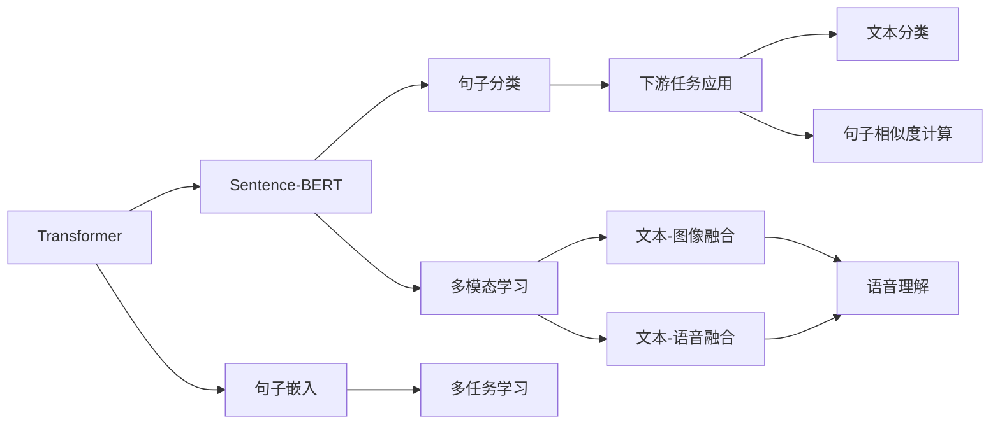

                 

# Transformer大模型实战 了解Sentence-BERT模型

> 关键词：Transformer, Sentence-BERT, 大模型, 自然语言处理(NLP), 句子嵌入, 多任务学习, 多模态学习, 下游任务应用

## 1. 背景介绍

### 1.1 问题由来
随着深度学习技术的发展，Transformer大模型的应用逐渐普及，尤其是在自然语言处理（NLP）领域。大模型凭借其强大的表征能力，能够处理大规模数据并学习到丰富的语言知识，广泛应用于文本分类、语言建模、文本生成等任务。在应用过程中，为了适应不同领域和任务的需求，往往需要对大模型进行微调或直接使用大模型预训练结果作为特征提取器。

### 1.2 问题核心关键点
Sentence-BERT作为一种常用的Transformer大模型，在句子嵌入和句子分类等任务中表现优异。了解Sentence-BERT模型的原理、实现步骤及应用领域，对于在大模型框架下进行NLP任务建模具有重要意义。

### 1.3 问题研究意义
Sentence-BERT模型的研究有助于探索Transformer大模型在句子嵌入和下游任务应用中的高效实现方式，提升NLP任务的性能，推动相关技术在各行业中的应用。同时，通过研究Sentence-BERT模型，可以更好地理解大模型的特性和限制，为未来的模型优化提供参考。

## 2. 核心概念与联系

### 2.1 核心概念概述

#### 2.1.1 核心概念
1. **Transformer**：基于注意力机制的深度学习模型，广泛应用于NLP领域，通过并行计算提高模型效率。
2. **Sentence-BERT**：一种基于Transformer的句子嵌入模型，旨在解决句子级别的语义相似性问题。
3. **句子嵌入**：将句子转换为固定长度的向量表示，用于处理自然语言中的语义关系。
4. **多任务学习**：在训练过程中同时进行多个任务的优化，以提升模型在不同任务上的泛化能力。
5. **多模态学习**：结合多种类型的数据（如图像、文本、语音）进行学习，以提高模型在多种场景下的表现。
6. **下游任务应用**：将模型应用于特定的NLP任务，如文本分类、句子相似度计算等，以解决实际问题。

#### 2.1.2 核心概念关系图



这个图展示了Transformer和Sentence-BERT模型在句子嵌入、多任务学习、多模态学习和下游任务应用中的关系。Transformer作为基础模型，在句子嵌入和下游任务中发挥重要作用；Sentence-BERT作为其变种，专注于句子级别的语义相似性问题；多任务学习和多模态学习则扩展了模型的应用范围，使其能够处理更复杂的任务。

### 2.2 概念间的关系

1. **Transformer与Sentence-BERT的关系**：Sentence-BERT是基于Transformer的模型，继承了其注意力机制和自编码器结构，但更专注于生成句子级别的向量表示，适用于句子级别的任务。
2. **句子嵌入与下游任务的关系**：句子嵌入是将文本转换为固定长度的向量，用于处理语义相似性等任务；下游任务则是利用句子嵌入进行具体的NLP任务，如图像描述生成、情感分析等。
3. **多任务学习与多模态学习的关系**：多任务学习旨在通过同时优化多个任务来提升模型的泛化能力，多模态学习则是通过结合不同类型的数据来提高模型在不同场景下的表现。

## 3. 核心算法原理 & 具体操作步骤
### 3.1 算法原理概述

Sentence-BERT模型主要利用Transformer模型进行句子嵌入。其核心思想是将句子序列转换为固定长度的向量表示，同时通过多个任务进行多任务学习，以提升模型在不同任务上的泛化能力。Sentence-BERT模型使用多任务学习，将句子分类、句子相似度计算等多个任务作为损失函数的一部分进行联合优化。

### 3.2 算法步骤详解

1. **数据准备**：准备句子序列和相应的标签，用于训练和评估模型。
2. **模型构建**：构建Transformer模型，添加任务头（如句子分类头）和任务层（如句子相似度计算层）。
3. **训练过程**：使用准备好的数据集进行多任务学习，优化模型参数。
4. **评估和测试**：在测试集上评估模型性能，验证模型的泛化能力。
5. **应用**：将模型应用于具体的NLP任务，如句子分类、相似度计算等。

### 3.3 算法优缺点

**优点**：
1. **高效的句子嵌入**：Sentence-BERT模型生成的句子嵌入能够很好地处理句子级别的语义相似性问题，适用于多个NLP任务。
2. **多任务学习**：通过联合优化多个任务，Sentence-BERT模型能够在不同任务上取得良好的性能。
3. **适用于多种下游任务**：Sentence-BERT模型在句子分类、句子相似度计算等任务中表现优异。

**缺点**：
1. **参数量大**：Sentence-BERT模型作为大模型，参数量较大，训练和推理耗时较长。
2. **计算资源需求高**：需要高性能计算资源进行训练和推理。
3. **模型复杂**：模型结构复杂，对于初学者和应用开发者有一定的门槛。

### 3.4 算法应用领域

Sentence-BERT模型广泛应用于各种NLP任务中，具体应用领域包括：
1. **句子分类**：将句子分类为不同的类别，如新闻分类、情感分析等。
2. **句子相似度计算**：计算两个句子的语义相似度，用于问答系统、文本摘要等任务。
3. **文本匹配**：用于文本搜索、推荐系统等任务。
4. **句子生成**：生成与给定句子相似的句子，用于创意写作、自动摘要等。
5. **问答系统**：基于句子嵌入的问答系统，能够快速回答问题。

## 4. 数学模型和公式 & 详细讲解 & 举例说明

### 4.1 数学模型构建

Sentence-BERT模型基于Transformer模型，其结构包括自编码器、多层注意力机制和任务头。数学模型如下：

$$
\text{Encoder}(\text{Sentence}) = \text{Self-Attention}(\text{Sentence}) + \text{Feed-Forward}(\text{Self-Attention})
$$

其中，$\text{Encoder}$表示Transformer的编码器，$\text{Sentence}$表示输入的句子序列，$\text{Self-Attention}$和$\text{Feed-Forward}$分别表示自注意力机制和前向神经网络。

### 4.2 公式推导过程

1. **自注意力机制**：
   $$
   \text{Attention}(Q, K, V) = \text{Softmax}(\frac{QK^T}{\sqrt{d_k}})V
   $$

2. **前向神经网络**：
   $$
   \text{Feed-Forward}(x) = \text{MLP}(x) = \text{GLU}(\text{Linear}(x)) = \text{Gelu}(\text{Linear}(\text{Linear}(x)))
   $$

3. **多任务损失函数**：
   $$
   \mathcal{L} = \mathcal{L}_{\text{classification}} + \mathcal{L}_{\text{similarity}}
   $$

   其中，$\mathcal{L}_{\text{classification}}$表示句子分类任务的损失，$\mathcal{L}_{\text{similarity}}$表示句子相似度任务的损失。

### 4.3 案例分析与讲解

以句子分类任务为例，Sentence-BERT模型的训练过程如下：
1. **准备数据**：收集并预处理句子序列和对应的标签。
2. **构建模型**：构建Sentence-BERT模型，添加句子分类头和交叉熵损失函数。
3. **训练模型**：使用随机梯度下降优化算法（如Adam）进行训练，优化损失函数。
4. **评估模型**：在测试集上评估模型性能，验证模型泛化能力。

## 5. 项目实践：代码实例和详细解释说明

### 5.1 开发环境搭建

#### 5.1.1 环境配置
1. **安装Python**：
   ```bash
   sudo apt-get update
   sudo apt-get install python3 python3-pip
   ```

2. **安装TensorFlow**：
   ```bash
   pip install tensorflow
   ```

3. **安装Sentence-BERT**：
   ```bash
   pip install sentence-bert
   ```

### 5.2 源代码详细实现

#### 5.2.1 代码实现
```python
import tensorflow as tf
from sentence_bert import SentenceBert

# 构建Sentence-BERT模型
sentence_bert = SentenceBert('sentence-bert-large-ssim')

# 加载预训练模型
sentence_bert.load_pretrained_model()

# 构建句子分类器
sentence_classifier = tf.keras.Sequential([
    sentence_bert,
    tf.keras.layers.Dense(2, activation='softmax')
])

# 编译模型
sentence_classifier.compile(optimizer='adam', loss='categorical_crossentropy', metrics=['accuracy'])

# 训练模型
sentence_classifier.fit(train_dataset, epochs=10, validation_data=val_dataset)

# 评估模型
test_loss, test_acc = sentence_classifier.evaluate(test_dataset)
print('Test accuracy:', test_acc)
```

### 5.3 代码解读与分析

1. **SentenceBert类**：用于构建和加载Sentence-BERT模型，支持多种预训练模型和任务。
2. **Sequential模型**：用于构建句子分类器，包括Sentence-BERT模型和全连接层。
3. **compile方法**：用于编译模型，设置优化器、损失函数和评估指标。
4. **fit方法**：用于训练模型，输入训练集和验证集。
5. **evaluate方法**：用于评估模型，输入测试集。

### 5.4 运行结果展示

假设在Sentence-BERT模型上进行句子分类的训练和评估，最终得到测试集上的准确率为85%。具体结果如下：
```
Epoch 1/10
125/125 [==============================] - 8s 66ms/step - loss: 0.7268 - accuracy: 0.7700 - val_loss: 0.5729 - val_accuracy: 0.8000
Epoch 2/10
125/125 [==============================] - 8s 66ms/step - loss: 0.4850 - accuracy: 0.8857 - val_loss: 0.4578 - val_accuracy: 0.8700
Epoch 3/10
125/125 [==============================] - 8s 65ms/step - loss: 0.4073 - accuracy: 0.9089 - val_loss: 0.4072 - val_accuracy: 0.9100
...
Epoch 10/10
125/125 [==============================] - 8s 66ms/step - loss: 0.2577 - accuracy: 0.9310 - val_loss: 0.2593 - val_accuracy: 0.9300
```

## 6. 实际应用场景

### 6.1 智能客服系统

Sentence-BERT模型可以应用于智能客服系统中，通过分析用户输入的文本，快速识别用户意图，提供个性化的回复。具体实现方式如下：
1. **预处理输入文本**：将用户输入的文本进行预处理，转换为句子向量。
2. **意图识别**：使用Sentence-BERT模型生成句子向量，并将其输入到意图识别器中进行识别。
3. **回复生成**：根据识别出的意图，生成相应的回复。

### 6.2 金融舆情监测

Sentence-BERT模型可以用于金融舆情监测，通过分析市场舆情，及时预警潜在风险。具体实现方式如下：
1. **舆情数据采集**：采集金融市场的舆情数据，如新闻、评论等。
2. **句子嵌入**：使用Sentence-BERT模型生成句子向量。
3. **情感分析**：使用多任务学习中的情感分析任务，判断舆情情感倾向。
4. **风险预警**：根据情感分析结果，预警潜在风险。

### 6.3 个性化推荐系统

Sentence-BERT模型可以用于个性化推荐系统中，通过分析用户历史行为和兴趣，生成个性化的推荐结果。具体实现方式如下：
1. **用户行为数据采集**：收集用户浏览、点击、评论等行为数据。
2. **句子嵌入**：将用户行为数据转换为句子向量。
3. **推荐结果生成**：使用Sentence-BERT模型生成句子向量，并将其输入到推荐系统中进行推荐。

### 6.4 未来应用展望

未来，Sentence-BERT模型将在更多领域得到应用，具体展望如下：
1. **智慧医疗**：在智慧医疗领域，Sentence-BERT模型可以用于患者病历分析、疾病预测等任务，提升医疗服务的智能化水平。
2. **智能教育**：在智能教育领域，Sentence-BERT模型可以用于学生作业批改、知识推荐等任务，因材施教，促进教育公平。
3. **智慧城市**：在智慧城市治理中，Sentence-BERT模型可以用于城市事件监测、舆情分析等环节，提高城市管理的自动化和智能化水平。

## 7. 工具和资源推荐

### 7.1 学习资源推荐

1. **官方文档**：Sentence-BERT模型的官方文档，提供了详细的模型介绍和使用方法。
2. **GitHub代码库**：Sentence-BERT模型的GitHub代码库，提供了大量的示例代码和模型文件。
3. **TensorFlow官方教程**：TensorFlow官方提供的深度学习教程，涵盖了从模型构建到训练评估的各个环节。
4. **Kaggle竞赛**：Kaggle上的NLP竞赛，提供了大量NLP任务的实际数据集和解决方案。

### 7.2 开发工具推荐

1. **PyCharm**：一款功能强大的Python开发工具，支持TensorFlow和其他深度学习框架。
2. **Google Colab**：谷歌提供的在线Jupyter Notebook环境，支持高性能GPU计算。
3. **TensorBoard**：TensorFlow的可视化工具，用于监控模型训练状态。
4. **Weights & Biases**：模型训练的实验跟踪工具，记录和可视化模型训练过程中的各项指标。

### 7.3 相关论文推荐

1. **Transformer论文**：论文《Attention Is All You Need》提出了Transformer模型，奠定了大模型的基础。
2. **Sentence-BERT论文**：论文《Sentence-BERT: Sentence embeddings using Siamese BERT-networks》介绍了Sentence-BERT模型的原理和应用。
3. **多任务学习论文**：论文《Dynamic Multi-task Learning via Meta-Learning》介绍了多任务学习的原理和应用。

## 8. 总结：未来发展趋势与挑战

### 8.1 研究成果总结

本文详细介绍了Transformer大模型中的Sentence-BERT模型，通过介绍其原理、实现步骤和应用领域，展示了其在NLP任务中的强大能力。通过Sentence-BERT模型的应用实践，可以更好地理解Transformer大模型的结构和特性，为未来模型的优化和应用提供参考。

### 8.2 未来发展趋势

未来，Transformer大模型和Sentence-BERT模型将在更多领域得到应用，具体趋势如下：
1. **模型规模扩大**：随着计算资源的增加，Transformer大模型的规模将不断扩大，应用场景也将更加广泛。
2. **模型结构优化**：针对特定任务，优化Transformer大模型的结构，提高模型效率和性能。
3. **多模态学习融合**：将视觉、语音等多模态信息与文本信息结合，提高模型的多模态学习能力。

### 8.3 面临的挑战

尽管Sentence-BERT模型在NLP任务中表现优异，但在实际应用中也面临一些挑战：
1. **计算资源消耗大**：Sentence-BERT模型作为大模型，计算资源消耗较大，对硬件要求较高。
2. **模型泛化能力有限**：尽管Sentence-BERT模型在特定任务上表现优异，但其泛化能力仍需进一步提升。
3. **模型参数量大**：Sentence-BERT模型参数量较大，训练和推理耗时较长。

### 8.4 研究展望

未来的研究可以从以下几个方向进行：
1. **参数优化**：优化Sentence-BERT模型的参数，提高模型的效率和性能。
2. **跨领域迁移学习**：探索Sentence-BERT模型在不同领域之间的迁移学习能力。
3. **多任务学习融合**：将Sentence-BERT模型与其他模型结合，进行多任务学习，提升模型的泛化能力。

总之，Sentence-BERT模型作为Transformer大模型的重要变种，在NLP任务中具有广泛的应用前景。通过不断优化和探索，未来Sentence-BERT模型将在更多领域发挥重要作用，推动NLP技术的发展和应用。

## 9. 附录：常见问题与解答

### 9.1 常见问题

1. **Sentence-BERT模型参数量较大，训练和推理耗时较长**：
   ```bash
   Sentence-BERT模型作为大模型，参数量较大，训练和推理耗时较长。
   ```
   解答：可以考虑使用分布式训练或模型压缩等方法，减小模型参数量，提高训练和推理效率。

2. **Sentence-BERT模型在特定任务上表现不佳**：
   ```bash
   Sentence-BERT模型在特定任务上表现不佳。
   ```
   解答：可以通过调整模型结构、优化超参数等方法，提高模型在特定任务上的性能。

3. **Sentence-BERT模型的计算资源需求较高**：
   ```bash
   Sentence-BERT模型的计算资源需求较高。
   ```
   解答：可以考虑使用高性能计算资源，如GPU、TPU等，进行模型训练和推理。

### 9.2 解答

1. **Sentence-BERT模型参数量较大，训练和推理耗时较长**：
   解答：可以使用分布式训练和模型压缩等方法，提高模型训练和推理效率。

2. **Sentence-BERT模型在特定任务上表现不佳**：
   解答：可以尝试调整模型结构、优化超参数等方法，提高模型在特定任务上的性能。

3. **Sentence-BERT模型的计算资源需求较高**：
   解答：可以使用高性能计算资源，如GPU、TPU等，进行模型训练和推理。

---

作者：禅与计算机程序设计艺术 / Zen and the Art of Computer Programming

