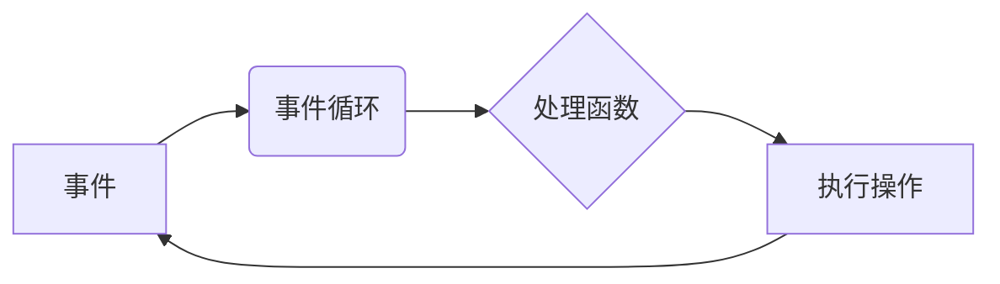

# 异步处理在高吞吐量中的应用

作者：禅与计算机程序设计艺术 / Zen and the Art of Computer Programming

## 关键词：

异步编程，高吞吐量，并发，事件驱动，性能优化，多线程，消息队列，Reactors模式，Producers-Consumers模式

## 1. 背景介绍

在信息爆炸的时代，系统需要处理的数据量和请求量日益增长，对系统的吞吐量提出了更高的要求。为了满足高吞吐量的需求，传统的同步编程模型逐渐暴露出瓶颈，而异步处理技术凭借其高效的资源利用和灵活的编程模型，成为了提升系统吞吐量的利器。本文将深入探讨异步处理在高吞吐量中的应用，分析其核心概念、原理、实现方法以及未来发展趋势。

### 1.1 问题的由来

随着互联网的普及和移动互联网的快速发展，用户对系统的响应速度和吞吐量要求越来越高。传统的同步编程模型在处理高并发请求时，容易产生以下问题：

1. **线程资源消耗大**：每个请求都需要创建一个线程进行处理，线程的创建、销毁和上下文切换等操作消耗大量资源，难以满足高并发需求。

2. **线程安全问题**：线程之间的同步和互斥机制复杂，容易产生死锁、竞态条件等问题，影响系统稳定性。

3. **开发效率低**：同步编程模型需要编写大量的线程同步代码，开发效率低，难以维护。

4. **扩展性差**：系统难以适应业务增长带来的并发请求增加，扩展性差。

为了解决以上问题，异步处理技术应运而生。

### 1.2 研究现状

异步处理技术已经广泛应用于高并发场景，如Web服务器、消息队列、数据库连接池等。目前，主流的异步处理技术包括以下几种：

1. **多线程**：使用多线程并发处理多个任务，实现并发执行。

2. **多进程**：使用多进程并发处理多个任务，实现并发执行，具有更好的资源隔离性。

3. **事件驱动**：使用事件循环机制，响应外部事件（如I/O操作）并执行相应的处理逻辑。

4. **协程**：使用协程实现函数间的协作，避免了线程的创建和销毁，降低资源消耗。

5. **消息队列**：使用消息队列实现任务队列化，异步处理任务，提高系统吞吐量。

6. Reactors模式：使用Reactor模式处理I/O事件，提高I/O处理效率。

7. Producers-Consumers模式：使用Producers-Consumers模式处理任务队列，提高系统吞吐量。

### 1.3 研究意义

异步处理技术在高吞吐量系统中具有重要意义：

1. **提高资源利用率**：异步处理技术可以有效地利用系统资源，提高系统吞吐量。

2. **降低开发难度**：异步编程模型相对简单，降低了开发难度，提高了开发效率。

3. **提高系统稳定性**：异步处理技术可以避免线程安全问题，提高系统稳定性。

4. **提高系统扩展性**：异步处理技术可以方便地扩展系统，满足业务增长带来的并发请求增加。

### 1.4 本文结构

本文将分为以下几部分：

1. 介绍异步处理的核心概念和联系。

2. 详细讲解异步处理的核心算法原理和具体操作步骤。

3. 分析异步处理技术的数学模型和公式，并结合实例进行讲解。

4. 给出异步处理的代码实例，并进行详细解释说明。

5. 探讨异步处理技术的实际应用场景和未来发展趋势。

6. 推荐异步处理相关的学习资源、开发工具和参考文献。

7. 总结异步处理技术的未来发展趋势与挑战。

## 2. 核心概念与联系

异步处理技术涉及以下核心概念：

1. **事件**：指由外部或内部触发的一组动作，如I/O请求、定时器等。

2. **事件循环**：事件循环负责监听事件，并执行相应的事件处理函数。

3. **回调函数**：回调函数是事件处理函数的别称，用于执行事件对应的处理逻辑。

4. **异步编程**：异步编程是一种编程范式，允许程序在等待某个操作完成时继续执行其他操作。

5. **并发**：并发指同时执行多个任务的能力。

6. **线程**：线程是操作系统分配处理器资源的基本单位。

7. **进程**：进程是计算机中正在运行的程序实例。

8. 以下是一个Mermaid流程图，展示了异步处理的核心概念及其联系：



## 3. 核心算法原理 & 具体操作步骤

### 3.1 算法原理概述

异步处理技术主要基于以下原理：

1. **事件驱动**：异步处理技术基于事件驱动模型，程序在等待某个操作完成时可以继续执行其他操作。

2. **非阻塞I/O**：非阻塞I/O允许程序在等待I/O操作完成时，继续执行其他操作。

3. **协程**：协程允许函数之间协作，避免线程的创建和销毁，降低资源消耗。

4. **消息队列**：消息队列允许程序异步处理任务，提高系统吞吐量。

### 3.2 算法步骤详解

异步处理的一般步骤如下：

1. **注册事件**：注册需要监听的事件，如I/O请求、定时器等。

2. **事件循环**：创建事件循环，监听并执行事件处理函数。

3. **事件处理**：根据事件的类型，调用相应的事件处理函数，执行对应操作。

4. **任务队列**：对于耗时的操作，可以将其放入任务队列，由事件循环异步执行。

5. **回调函数**：事件处理函数执行完成后，调用回调函数进行后续操作。

以下是一个简单的异步编程示例：

```python
import asyncio

async def hello_world():
    print("Hello, world!")
    await asyncio.sleep(1)
    print("Task done.")

async def main():
    await hello_world()

asyncio.run(main())
```

### 3.3 算法优缺点

异步处理技术的优点如下：

1. **提高资源利用率**：异步处理技术可以有效地利用系统资源，提高系统吞吐量。

2. **降低开发难度**：异步编程模型相对简单，降低了开发难度。

3. **提高系统稳定性**：异步处理技术可以避免线程安全问题，提高系统稳定性。

4. **提高系统扩展性**：异步处理技术可以方便地扩展系统。

异步处理技术的缺点如下：

1. **编程复杂**：异步编程模型需要编写大量的回调函数，编程复杂度较高。

2. **调试困难**：异步编程的调试相对困难，需要使用专门的调试工具。

3. **性能开销**：异步编程模型存在一定的性能开销，如事件循环、协程切换等。

### 3.4 算法应用领域

异步处理技术在以下领域得到广泛应用：

1. **Web服务器**：如Nginx、Apache等。

2. **消息队列**：如RabbitMQ、Kafka等。

3. **数据库连接池**：如HikariCP、c3p0等。

4. **网络爬虫**：如Scrapy、Crawly等。

5. **分布式系统**：如分布式存储、分布式计算等。

## 4. 数学模型和公式 & 详细讲解 & 举例说明

### 4.1 数学模型构建

异步处理技术的数学模型可以表示为以下公式：

$$
T_n = \sum_{i=1}^{n} T_i
$$

其中，$T_n$ 表示第 $n$ 个任务的执行时间，$T_i$ 表示第 $i$ 个子任务的执行时间。

### 4.2 公式推导过程

假设一个任务可以分解为 $n$ 个子任务，则该任务的执行时间可以表示为各个子任务执行时间之和。

### 4.3 案例分析与讲解

以下是一个使用异步编程处理并发请求的示例：

```python
import asyncio

async def handle_request(request):
    print(f"Handling request: {request}")
    await asyncio.sleep(1)  # 模拟耗时的请求处理
    return f"Processed request: {request}"

async def main():
    requests = [f"Request {i}" for i in range(10)]
    tasks = [handle_request(request) for request in requests]
    results = await asyncio.gather(*tasks)
    print(results)

asyncio.run(main())
```

在这个示例中，`handle_request` 函数模拟处理请求的过程，`main` 函数并发执行10个请求。通过`asyncio.gather`函数，我们可以同时执行多个异步任务，并等待所有任务完成。

### 4.4 常见问题解答

**Q1：异步编程与传统同步编程有什么区别？**

A：异步编程与传统同步编程的主要区别在于，异步编程允许程序在等待某个操作完成时，继续执行其他操作。在传统同步编程中，程序会阻塞等待某个操作完成，无法执行其他任务。

**Q2：如何选择异步编程模型？**

A：选择异步编程模型需要考虑以下因素：

1. **系统性能要求**：如果系统需要处理大量并发请求，异步编程模型可以更好地满足性能需求。

2. **开发效率**：异步编程模型开发难度较高，如果开发效率是关键因素，可以考虑使用传统的同步编程模型。

3. **资源消耗**：异步编程模型可以更好地利用系统资源，降低资源消耗。

4. **系统稳定性**：异步编程模型可以避免线程安全问题，提高系统稳定性。

## 5. 项目实践：代码实例和详细解释说明

### 5.1 开发环境搭建

在进行异步处理实践前，我们需要准备好开发环境。以下是使用Python进行异步编程的环境配置流程：

1. 安装Python：从官网下载并安装Python。

2. 安装异步编程库：安装asyncio库，用于实现异步编程。

3. 安装其他库：安装requests库，用于发送HTTP请求。

### 5.2 源代码详细实现

以下是一个使用Python异步编程库requests实现HTTP请求的示例：

```python
import asyncio
import requests

async def fetch(session, url):
    async with session.get(url) as response:
        return await response.text()

async def main():
    url = "https://www.example.com"
    async with aiohttp.ClientSession() as session:
        html = await fetch(session, url)
        print(html)

asyncio.run(main())
```

在这个示例中，`fetch` 函数使用`aiohttp.ClientSession`对象发送HTTP请求，并返回响应内容。`main` 函数创建一个ClientSession对象，并发执行`fetch`函数，最后打印响应内容。

### 5.3 代码解读与分析

让我们详细解读一下关键代码的实现细节：

**fetch函数**：

- 使用`aiohttp.ClientSession`对象发送HTTP请求。

- 使用`async with`语句确保Session对象在操作完成后自动关闭。

- 使用`await response.text()`异步读取响应内容。

**main函数**：

- 定义目标URL。

- 创建ClientSession对象。

- 调用`fetch`函数发送HTTP请求。

- 打印响应内容。

- 使用`asyncio.run(main())`启动异步主函数。

### 5.4 运行结果展示

运行上述代码，将输出HTTP请求的响应内容。这个简单的示例展示了异步编程处理HTTP请求的流程，在实际应用中，可以进一步扩展和优化。

## 6. 实际应用场景

异步处理技术在以下场景得到广泛应用：

1. **Web服务器**：如Nginx、Apache等。

2. **消息队列**：如RabbitMQ、Kafka等。

3. **数据库连接池**：如HikariCP、c3p0等。

4. **网络爬虫**：如Scrapy、Crawly等。

5. **分布式系统**：如分布式存储、分布式计算等。

### 6.4 未来应用展望

随着异步处理技术的不断发展，未来将呈现以下趋势：

1. **跨语言支持**：异步处理技术将支持更多编程语言，提高编程效率。

2. **性能优化**：异步处理技术将进一步提升性能，降低资源消耗。

3. **编程模型简化**：异步编程模型将更加简单易用，降低开发难度。

4. **应用领域拓展**：异步处理技术将应用于更多领域，如物联网、自动驾驶等。

## 7. 工具和资源推荐

### 7.1 学习资源推荐

以下是一些学习异步处理技术的资源推荐：

1. 《异步编程实战》

2. 《Python异步编程》

3. 《Node.js异步编程指南》

4. 《Go并发编程》

### 7.2 开发工具推荐

以下是一些异步处理开发工具推荐：

1. **Python**：使用asyncio库实现异步编程。

2. **Node.js**：使用async/await语法实现异步编程。

3. **Go**：使用goroutine实现并发编程。

4. **Java**：使用CompletableFuture、CompletionStage等实现异步编程。

### 7.3 相关论文推荐

以下是一些异步处理相关的论文推荐：

1. 《Non-blocking I/O: A New Approach to Concurrent Programming》

2. 《Asynchronous I/O and Lightweight Processes》

3. 《Asynchronous Programming in Python with asyncio》

4. 《Asynchronous I/O with libevent》

### 7.4 其他资源推荐

以下是一些其他异步处理资源推荐：

1. **异步编程社区**：如asyncio、Node.js异步编程社区等。

2. **异步编程博客**：如异步编程实战、Python异步编程等。

3. **异步编程论坛**：如Stack Overflow、CSDN等。

## 8. 总结：未来发展趋势与挑战

异步处理技术在提高系统吞吐量、降低资源消耗等方面具有重要意义。随着异步处理技术的不断发展，未来将呈现以下趋势：

1. **跨语言支持**：异步处理技术将支持更多编程语言，提高编程效率。

2. **性能优化**：异步处理技术将进一步提升性能，降低资源消耗。

3. **编程模型简化**：异步编程模型将更加简单易用，降低开发难度。

4. **应用领域拓展**：异步处理技术将应用于更多领域，如物联网、自动驾驶等。

然而，异步处理技术也面临以下挑战：

1. **编程复杂**：异步编程模型相对复杂，需要开发者具备一定的异步编程知识。

2. **调试困难**：异步编程的调试相对困难，需要使用专门的调试工具。

3. **性能开销**：异步编程模型存在一定的性能开销，如事件循环、协程切换等。

为了应对这些挑战，需要开发者不断学习和积累异步编程经验，并关注异步处理技术的最新发展。

## 9. 附录：常见问题与解答

**Q1：异步处理和并发有什么区别？**

A：异步处理和并发都是提高系统吞吐量的技术，但它们的实现方式不同。异步处理是指程序在等待某个操作完成时，可以继续执行其他操作，而并发是指同时执行多个任务。

**Q2：异步编程模型有哪些优点和缺点？**

A：异步编程模型的优点包括提高资源利用率、降低开发难度、提高系统稳定性、提高系统扩展性等。缺点包括编程复杂、调试困难、性能开销等。

**Q3：如何选择异步编程模型？**

A：选择异步编程模型需要考虑以下因素：系统性能要求、开发效率、资源消耗、系统稳定性等。

**Q4：异步编程如何实现？**

A：异步编程可以使用多种技术实现，如多线程、多进程、事件驱动、协程等。

**Q5：异步编程如何调试？**

A：异步编程的调试相对困难，需要使用专门的调试工具，如asyncio-debugger、node-inspector等。

**Q6：异步处理技术在哪些领域得到广泛应用？**

A：异步处理技术在Web服务器、消息队列、数据库连接池、网络爬虫、分布式系统等领域得到广泛应用。

**Q7：异步处理技术的未来发展趋势是什么？**

A：异步处理技术的未来发展趋势包括跨语言支持、性能优化、编程模型简化、应用领域拓展等。

**Q8：异步处理技术面临哪些挑战？**

A：异步处理技术面临的主要挑战包括编程复杂、调试困难、性能开销等。

**Q9：如何克服异步处理技术的挑战？**

A：为了克服异步处理技术的挑战，需要开发者不断学习和积累异步编程经验，并关注异步处理技术的最新发展。

**Q10：异步处理技术和微服务架构有什么关系？**

A：异步处理技术和微服务架构相辅相成，异步处理技术可以提高微服务架构的并发能力和性能，而微服务架构可以为异步处理技术提供更好的支持。