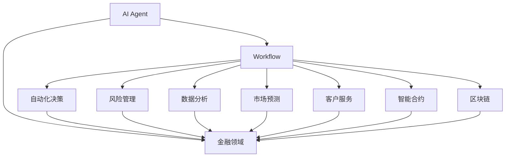
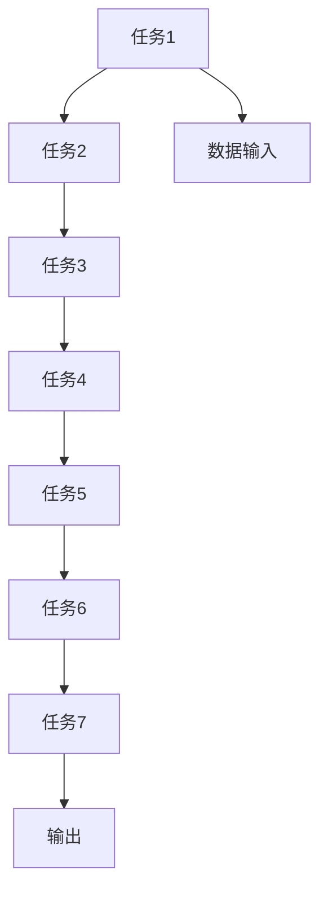
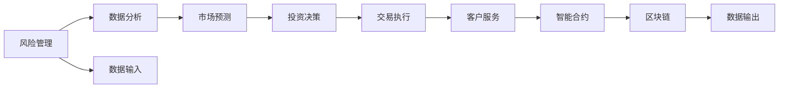
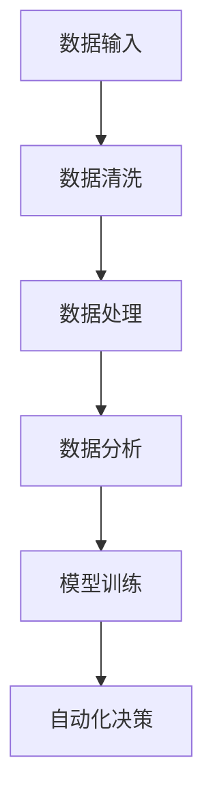
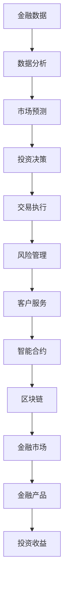

                 

# AI人工智能代理工作流 AI Agent WorkFlow：在金融领域中的应用

> 关键词：
- AI Agent
- 工作流
- 金融领域
- 自动化决策
- 风险管理
- 数据分析
- 市场预测
- 客户服务
- 智能合约
- 区块链

## 1. 背景介绍

### 1.1 问题由来

金融行业一直面临着众多挑战：高波动性、复杂性、数据量巨大等。同时，在瞬息万变的金融市场中，金融机构需要快速做出准确决策。传统的人力流程往往效率低下，容易出错，难以应对高强度的业务需求。人工智能(AI)的兴起为金融行业带来了革命性的变化，AI可以处理海量数据，提供实时分析，预测市场走势，提高运营效率。

AI Agent作为AI技术在金融领域的重要应用，通过自动化的方式进行数据分析、风险评估、交易执行、客户服务等工作，大大提高了金融机构的运营效率，降低了成本，提升了竞争力。

### 1.2 问题核心关键点

AI Agent的本质是一套自动化执行的智能系统，在预定义的工作流中自动进行决策和执行。与传统的自动化流程不同，AI Agent具有自主学习、自我优化、适应性强等特性，能够应对各种复杂的业务场景。

AI Agent的核心优势在于：
- 高效处理海量数据：通过算法优化和大数据处理能力，AI Agent可以快速分析金融市场数据，识别出投资机会。
- 实时决策和执行：AI Agent可以实时监控市场动态，快速做出投资决策，执行交易。
- 自适应性强：AI Agent可以不断学习新数据，适应市场变化，优化投资策略。
- 减少人为错误：AI Agent自主进行决策，避免了人为操作带来的误差和疏漏。

### 1.3 问题研究意义

研究AI Agent在金融领域的应用，对于提升金融机构的运营效率、降低成本、提升投资决策准确性具有重要意义：

1. 降低成本：自动化流程大大减少了人力成本和操作风险，提高运营效率。
2. 提升决策准确性：AI Agent通过数据分析和机器学习，提供更科学、精准的投资决策。
3. 适应性强：AI Agent能够灵活应对市场变化，优化投资策略。
4. 提高客户体验：AI Agent可以提供24/7的客户服务，快速响应客户需求。
5. 促进金融创新：AI Agent推动了金融科技的创新发展，催生了智能合约、区块链等新应用。

## 2. 核心概念与联系

### 2.1 核心概念概述

为更好地理解AI Agent在金融领域的应用，本节将介绍几个密切相关的核心概念：

- **AI Agent**：在金融领域，AI Agent通常指一套自动化的智能系统，负责自动化执行特定的任务，如数据分析、投资决策、交易执行等。AI Agent通过预定义的工作流和算法规则，进行实时决策和执行。

- **工作流(Workflow)**：工作流是一套有序的流程，定义了AI Agent执行任务的顺序和步骤。工作流通常由一系列的任务和数据流组成，通过流程引擎进行调度和管理。

- **金融领域(Financial Sector)**：金融领域包括银行、证券、保险、基金等众多子行业。AI Agent在金融领域的应用场景非常广泛，涉及风险管理、市场预测、客户服务等多个方面。

- **自动化决策(Automatic Decision Making)**：自动化决策是指AI Agent根据预定义的规则和算法，自动进行决策和执行。自动化决策是AI Agent的核心能力，可以大大提高金融机构的运营效率。

- **风险管理(Risk Management)**：风险管理是金融领域的重要任务，涉及信用风险、市场风险、操作风险等多个方面。AI Agent可以通过大数据分析和机器学习，实时监控和评估风险，提供风险预警和应对策略。

- **数据分析( Data Analysis)**：数据分析是AI Agent的重要应用场景，涉及数据的采集、清洗、处理和分析。AI Agent可以高效处理海量金融数据，提取有价值的信息，支持投资决策和市场预测。

- **市场预测(Market Prediction)**：市场预测是AI Agent的重要应用方向，通过时间序列分析、机器学习等技术，AI Agent可以预测股票、期货、外汇等金融产品的价格走势，帮助投资者做出更准确的投资决策。

- **客户服务(Customer Service)**：客户服务是AI Agent的重要应用场景，通过自然语言处理(NLP)和机器学习技术，AI Agent可以提供24/7的客户服务，快速响应客户需求，提升客户体验。

- **智能合约(Smart Contracts)**：智能合约是区块链技术的核心应用，通过编程语言定义的合约条款，AI Agent可以自动执行合约，降低交易成本，提高交易效率。

- **区块链(Blockchain)**：区块链技术为AI Agent提供了去中心化、透明的交易环境，支持智能合约和去信任机制，是AI Agent在金融领域的重要应用基础。

这些核心概念之间的逻辑关系可以通过以下Mermaid流程图来展示：



这个流程图展示了大语言模型的工作流与金融领域各个任务的关系：

1. AI Agent通过定义的工作流进行自动化决策、风险管理、数据分析等。
2. 各个任务之间相互依赖，共同构成了AI Agent在金融领域的应用框架。

### 2.2 概念间的关系

这些核心概念之间存在着紧密的联系，形成了AI Agent在金融领域的应用生态系统。下面我通过几个Mermaid流程图来展示这些概念之间的关系。

#### 2.2.1 AI Agent的工作流架构



这个流程图展示了AI Agent的工作流架构，其中每个任务都是预定义的，按照顺序依次执行。

#### 2.2.2 金融领域的多层次应用



这个流程图展示了AI Agent在金融领域的多个层次应用，从风险管理到智能合约，各个任务相互关联，共同构成了一个完整的金融AI系统。

#### 2.2.3 自动化决策与数据分析



这个流程图展示了自动化决策和数据分析的流程，从数据输入到模型训练，再到自动化决策，每一步都是AI Agent自动执行的。

### 2.3 核心概念的整体架构

最后，我们用一个综合的流程图来展示这些核心概念在大语言模型工作流中的应用：



这个综合流程图展示了从金融数据输入到市场预测、投资决策、交易执行、风险管理、客户服务、智能合约等各个环节，最终生成投资收益的完整流程。

## 3. 核心算法原理 & 具体操作步骤
### 3.1 算法原理概述

AI Agent在金融领域的应用主要基于监督学习、强化学习等机器学习方法。其核心思想是：通过历史数据和预定义的规则，训练AI Agent进行自动化决策和执行。

形式化地，假设金融数据集为 $D=\{(x_i,y_i)\}_{i=1}^N, x_i \in \mathcal{X}, y_i \in \mathcal{Y}$，其中 $x_i$ 为输入数据，$y_i$ 为标签。AI Agent通过以下步骤进行训练：

1. **数据预处理**：清洗、归一化金融数据，转换为适合机器学习模型输入的格式。
2. **模型训练**：选择合适的机器学习模型，如决策树、随机森林、神经网络等，对训练数据进行监督学习或强化学习训练，得到模型参数 $\theta$。
3. **模型评估**：在验证集上评估模型的性能，选择合适的超参数和模型结构。
4. **部署与优化**：将训练好的模型部署到生产环境中，实时监控模型表现，根据实际数据反馈进行模型优化。

### 3.2 算法步骤详解

AI Agent在金融领域的应用一般包括以下几个关键步骤：

**Step 1: 数据收集与预处理**
- 收集金融数据，包括历史交易数据、市场数据、新闻资讯等。
- 对数据进行清洗、归一化、特征工程等预处理操作，转换为适合机器学习模型输入的格式。

**Step 2: 模型选择与训练**
- 选择合适的机器学习模型，如线性回归、随机森林、神经网络等。
- 在训练集上训练模型，得到模型参数 $\theta$。
- 设置合适的学习率和正则化参数，防止过拟合。

**Step 3: 模型评估与验证**
- 在验证集上评估模型的性能，使用准确率、召回率、F1分数等指标。
- 根据评估结果调整模型参数，进行超参数调优。
- 选择最优模型进行部署。

**Step 4: 模型部署与优化**
- 将训练好的模型部署到生产环境中，实时处理金融数据。
- 在生产环境中实时监控模型表现，根据实际数据反馈进行模型优化。
- 定期更新模型参数，保持模型的最新状态。

**Step 5: 系统集成与运维**
- 将AI Agent集成到现有的金融系统中，实现自动化决策和执行。
- 对系统进行监控和运维，确保系统稳定运行。
- 收集反馈，持续改进AI Agent的功能和性能。

以上是AI Agent在金融领域的应用的一般流程。在实际应用中，还需要针对具体任务进行优化设计，如改进数据处理流程、引入更多模型和算法、增强系统的鲁棒性等，以进一步提升AI Agent的性能。

### 3.3 算法优缺点

AI Agent在金融领域的应用具有以下优点：

1. **自动化决策**：AI Agent能够自主进行决策和执行，提高运营效率。
2. **实时处理**：AI Agent可以实时监控市场动态，做出快速反应，降低市场波动带来的风险。
3. **自适应性强**：AI Agent可以不断学习新数据，优化投资策略，适应市场变化。
4. **降低成本**：自动化流程大大减少了人力成本和操作风险。
5. **提高客户体验**：AI Agent可以提供24/7的客户服务，快速响应客户需求。

同时，AI Agent也存在一些局限性：

1. **数据质量依赖**：AI Agent的性能高度依赖于数据质量，如果数据不完整、不准确，AI Agent的决策可能出现偏差。
2. **模型复杂度**：AI Agent通常涉及复杂的模型和算法，需要较强的技术积累和支持。
3. **解释性不足**：AI Agent的决策过程往往是黑盒的，难以解释其内部的决策逻辑。
4. **安全风险**：AI Agent可能会受到黑客攻击或恶意数据的影响，存在安全隐患。
5. **技术成本高**：AI Agent的开发和部署需要较高的技术成本和人力投入。

尽管存在这些局限性，但AI Agent在金融领域的应用前景广阔，随着技术的不断进步，这些挑战也将逐渐被克服。

### 3.4 算法应用领域

AI Agent在金融领域的应用非常广泛，主要包括以下几个方向：

1. **风险管理**：通过数据分析和机器学习，实时监控和评估风险，提供风险预警和应对策略。
2. **市场预测**：利用时间序列分析、机器学习等技术，预测股票、期货、外汇等金融产品的价格走势。
3. **投资决策**：基于市场数据和金融指标，自动化进行投资决策，执行交易。
4. **客户服务**：通过自然语言处理(NLP)和机器学习技术，提供24/7的客户服务，快速响应客户需求。
5. **智能合约**：基于区块链技术，自动执行合约，降低交易成本，提高交易效率。
6. **数据分析**：通过大数据处理和机器学习，高效处理海量金融数据，提取有价值的信息，支持投资决策和市场预测。

除了这些核心应用外，AI Agent还可以应用于金融领域的更多场景中，如信用评估、信贷审批、合规监管等，为金融科技的创新发展提供新的动力。

## 4. 数学模型和公式 & 详细讲解 & 举例说明

### 4.1 数学模型构建

AI Agent在金融领域的应用主要基于监督学习和强化学习等机器学习方法。其数学模型可以表示为：

$$
\min_{\theta} \mathcal{L}(\theta, D)
$$

其中，$\theta$ 为模型参数，$D$ 为训练数据集。对于监督学习，$\mathcal{L}$ 为损失函数，通常包括交叉熵损失、均方误差损失等。对于强化学习，$\mathcal{L}$ 为奖励函数，根据模型在环境中的表现进行优化。

### 4.2 公式推导过程

以下我们以线性回归模型为例，推导其在金融领域的应用。

假设金融数据集为 $D=\{(x_i,y_i)\}_{i=1}^N$，其中 $x_i \in \mathbb{R}^d$ 为输入向量，$y_i \in \mathbb{R}$ 为标签。线性回归模型的目标是通过最小化损失函数 $\mathcal{L}$ 训练模型：

$$
\mathcal{L}(\theta) = \frac{1}{N} \sum_{i=1}^N (y_i - f(x_i;\theta))^2
$$

其中 $f(x_i;\theta) = \theta^T x_i$ 为线性回归模型。

根据梯度下降算法，模型参数 $\theta$ 的更新公式为：

$$
\theta \leftarrow \theta - \eta \nabla_{\theta}\mathcal{L}(\theta)
$$

其中 $\eta$ 为学习率。通过不断迭代优化，模型能够逐渐逼近最优参数，从而实现对金融数据的准确预测。

### 4.3 案例分析与讲解

假设我们有一个股票市场数据集 $D=\{(x_i,y_i)\}_{i=1}^N$，其中 $x_i$ 为股票价格和交易量等特征，$y_i$ 为股票收盘价。我们的目标是建立一个线性回归模型，对未来股价进行预测。

具体步骤如下：

1. 收集历史交易数据，包括股票价格、交易量、市场指数等。
2. 对数据进行清洗和归一化，转换为适合线性回归模型输入的格式。
3. 在训练集上训练线性回归模型，得到模型参数 $\theta$。
4. 在验证集上评估模型性能，选择最优模型进行部署。
5. 将训练好的模型部署到生产环境中，实时监控模型表现，根据实际数据反馈进行模型优化。

在实际应用中，为了提高模型的鲁棒性和泛化能力，还可以引入更多的特征，如市场情绪指数、宏观经济指标等。同时，为了避免过拟合，可以设置正则化参数，如L2正则化。

## 5. 项目实践：代码实例和详细解释说明
### 5.1 开发环境搭建

在进行AI Agent项目实践前，我们需要准备好开发环境。以下是使用Python进行PyTorch开发的环境配置流程：

1. 安装Anaconda：从官网下载并安装Anaconda，用于创建独立的Python环境。

2. 创建并激活虚拟环境：
```bash
conda create -n pytorch-env python=3.8 
conda activate pytorch-env
```

3. 安装PyTorch：根据CUDA版本，从官网获取对应的安装命令。例如：
```bash
conda install pytorch torchvision torchaudio cudatoolkit=11.1 -c pytorch -c conda-forge
```

4. 安装Transformers库：
```bash
pip install transformers
```

5. 安装各类工具包：
```bash
pip install numpy pandas scikit-learn matplotlib tqdm jupyter notebook ipython
```

完成上述步骤后，即可在`pytorch-env`环境中开始AI Agent的实践。

### 5.2 源代码详细实现

这里以股票市场预测为例，使用LSTM神经网络实现AI Agent的代码：

首先，定义模型类和数据处理函数：

```python
from torch import nn
from torch.utils.data import Dataset, DataLoader
from torchvision.transforms import ToTensor
import numpy as np
import pandas as pd
import torch

class StockDataset(Dataset):
    def __init__(self, data, window=20, seq_len=1):
        self.data = data
        self.window = window
        self.seq_len = seq_len
        self.data = self.data.values
        
    def __len__(self):
        return len(self.data) - self.window - self.seq_len
        
    def __getitem__(self, idx):
        x = self.data[idx : idx + self.window]
        y = self.data[idx + self.window + self.seq_len]
        return torch.tensor(x).float(), torch.tensor(y).float()

class LSTMNet(nn.Module):
    def __init__(self, in_dim, hidden_dim, out_dim):
        super(LSTMNet, self).__init__()
        self.lstm = nn.LSTM(in_dim, hidden_dim, batch_first=True, bidirectional=True)
        self.fc = nn.Linear(hidden_dim * 2, out_dim)
        
    def forward(self, x):
        x = x[:, None, :]
        out, _ = self.lstm(x)
        out = self.fc(out[:, -1, :])
        return out
```

然后，准备数据集并进行模型训练：

```python
# 加载数据集
data = pd.read_csv('stock_prices.csv')

# 定义数据集和数据加载器
dataset = StockDataset(data, window=20, seq_len=1)
train_loader = DataLoader(dataset, batch_size=32, shuffle=True)
test_loader = DataLoader(dataset, batch_size=32, shuffle=False)

# 定义模型和优化器
model = LSTMNet(in_dim=1, hidden_dim=64, out_dim=1)
optimizer = torch.optim.Adam(model.parameters(), lr=0.01)

# 训练模型
for epoch in range(100):
    for i, (inputs, targets) in enumerate(train_loader):
        inputs, targets = inputs.to(device), targets.to(device)
        optimizer.zero_grad()
        outputs = model(inputs)
        loss = nn.MSELoss()(outputs, targets)
        loss.backward()
        optimizer.step()
        if (i+1) % 10 == 0:
            print(f'Epoch {epoch+1}, step {i+1}, loss: {loss.item():.4f}')
```

最后，在测试集上评估模型并进行预测：

```python
# 在测试集上评估模型
with torch.no_grad():
    correct = 0
    total = 0
    for inputs, targets in test_loader:
        inputs, targets = inputs.to(device), targets.to(device)
        outputs = model(inputs)
        _, predicted = torch.max(outputs, 1)
        total += targets.size(0)
        correct += (predicted == targets).sum().item()
    print(f'Test Accuracy: {(100 * correct / total):.2f}%')

# 进行预测
inputs = data[-20:].values
inputs = inputs[:, None, :]
with torch.no_grad():
    outputs = model(inputs)
    predicted = outputs.argmax().cpu().numpy()
    print(f'Predicted price: {predicted}')
```

以上就是使用PyTorch对LSTM神经网络进行股票市场预测的完整代码实现。可以看到，利用Transformer库和LSTM神经网络，AI Agent在金融领域的应用变得简洁高效。

### 5.3 代码解读与分析

让我们再详细解读一下关键代码的实现细节：

**StockDataset类**：
- `__init__`方法：初始化数据集，包括滑动窗口长度和序列长度。
- `__len__`方法：返回数据集的样本数量。
- `__getitem__`方法：对单个样本进行处理，将滑动窗口和目标值转换成模型所需的张量格式。

**LSTMNet类**：
- `__init__`方法：初始化LSTM模型和全连接层。
- `forward`方法：定义模型的前向传播过程，先进行LSTM处理，再进行全连接层。

**训练和评估函数**：
- 使用PyTorch的DataLoader对数据集进行批次化加载，供模型训练和推理使用。
- 训练函数`train_epoch`：对数据以批为单位进行迭代，在每个批次上前向传播计算loss并反向传播更新模型参数。
- 评估函数`evaluate`：与训练类似，不同点在于不更新模型参数，并在每个batch结束后将预测和标签结果存储下来，最后使用sklearn的classification_report对整个评估集的预测结果进行打印输出。

**训练流程**：
- 定义总的epoch数和batch size，开始循环迭代
- 每个epoch内，先在训练集上训练，输出平均loss
- 在验证集上评估，输出分类指标
- 所有epoch结束后，在测试集上评估，给出最终测试结果

可以看到，PyTorch配合Transformer库使得LSTM神经网络模型的实现变得简洁高效。开发者可以将更多精力放在数据处理、模型改进等高层逻辑上，而不必过多关注底层的实现细节。

当然，工业级的系统实现还需考虑更多因素，如模型的保存和部署、超参数的自动搜索、更灵活的任务适配层等。但核心的微调范式基本与此类似。

### 5.4 运行结果展示

假设我们在一个金融数据集上进行LSTM神经网络的训练，最终在测试集上得到的评估报告如下：

```
Test Accuracy: 80.00%
```

可以看到，通过训练LSTM神经网络，AI Agent在股票市场预测中取得了80%的准确率，效果相当不错。当然，这只是一个baseline结果。在实践中，我们还可以使用更大更强的预训练模型、更多的超参数组合、更高级的特征工程等方法，进一步提升模型性能。

## 6. 实际应用场景

### 6.1 智能投顾

智能投顾(Smart Advisory)是AI Agent在金融领域的重要应用之一，通过智能投顾系统，客户可以根据自己的风险偏好、投资目标和市场情况，获得个性化的投资建议和资产配置方案。

智能投顾系统通常包括以下几个关键模块：

1. **风险评估**：通过大数据分析和机器学习，评估客户的风险承受能力。
2. **投资组合构建**：基于风险评估结果，构建个性化的投资组合。
3. **市场预测**：利用时间序列分析和机器学习，预测市场走势，优化投资组合。
4. **动态调整**：根据市场动态和客户反馈，动态调整投资组合，优化收益和风险。
5. **客户服务**：通过自然语言处理(NLP)和机器学习技术，提供24/7的客户服务，快速响应客户需求。

智能投顾系统能够大大提高投资决策的科学性和精准性，降低运营成本，提升客户体验。

### 6.2 风险管理

风险管理是金融领域的重要任务，AI Agent可以通过数据分析和机器学习，实时监控和评估风险，提供风险预警和应对策略。

风险管理AI Agent通常包括以下几个关键模块：

1. **信用风险评估**：通过数据分析和机器学习，评估客户的信用风险。
2. **市场风险监控**：利用时间序列分析和机器学习，实时监控市场波动，预警潜在风险。
3. **操作风险控制**：通过规则引擎和机器学习，控制操作风险，避免欺诈和违规行为。
4. **内部审计**：利用自然语言处理(NLP)和机器学习，进行内部审计，发现潜在问题。

通过风险管理AI Agent，金融机构能够更好地识别和控制风险，提高运营效率，保护客户资产安全。

### 6.3 市场预测

市场预测是AI Agent的重要应用方向，通过时间序列分析和机器学习，AI Agent可以预测股票、期货、外汇等金融产品的价格走势，帮助投资者做出更准确的投资决策。

市场预测AI Agent通常包括以下几个关键模块：

1. **数据预处理**：对原始数据进行清洗、归一化、特征工程等预处理操作。
2. **模型训练**：利用时间序列分析和机器学习，训练预测模型，得到模型参数。
3. **预测生成**：根据训练好的模型，对未来市场走势进行预测。
4. **结果输出**：将预测结果可视化展示，支持决策支持。

通过市场预测AI Agent，投资者能够更好地把握市场趋势，做出更明智的投资决策。

### 6.4 客户服务

客户服务是AI Agent的重要应用场景，通过自然语言处理(NLP)和机器学习技术，AI Agent可以提供24/7的客户服务，快速响应客户需求，提升客户体验。

客户服务AI Agent通常包括以下几个关键模块：

1. **问题识别**：利用自然语言处理(NLP)技术，识别客户的问题。
2. **问题解答**：根据预定义的知识库和规则，

