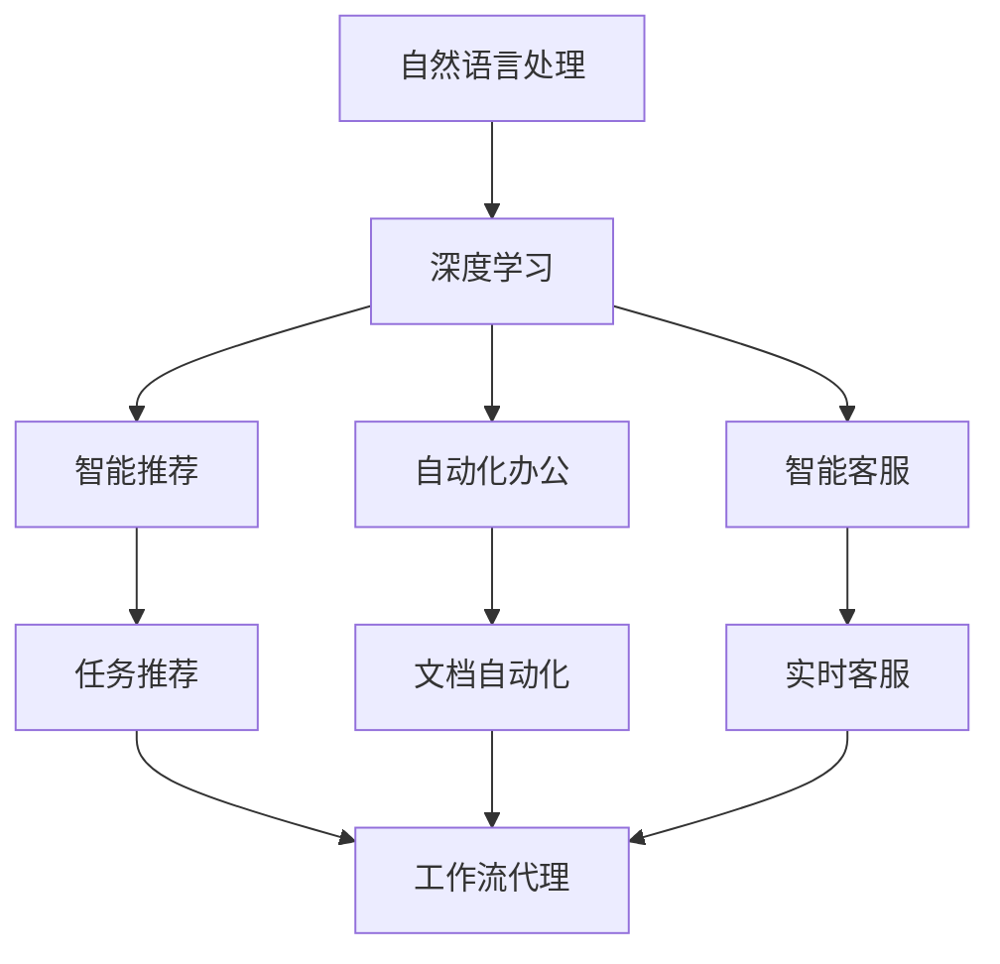
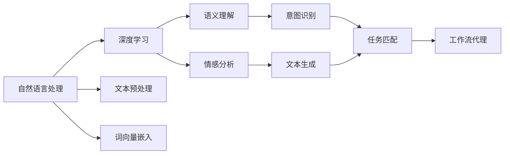
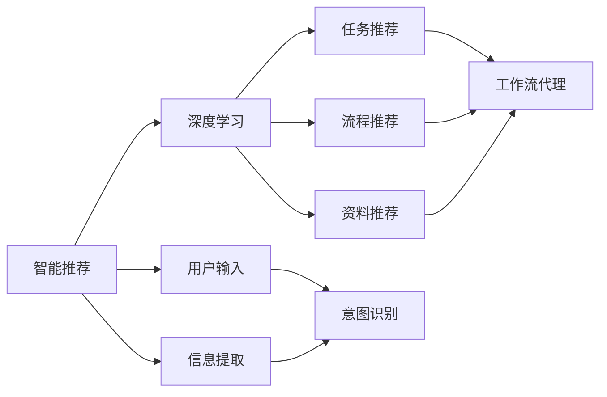
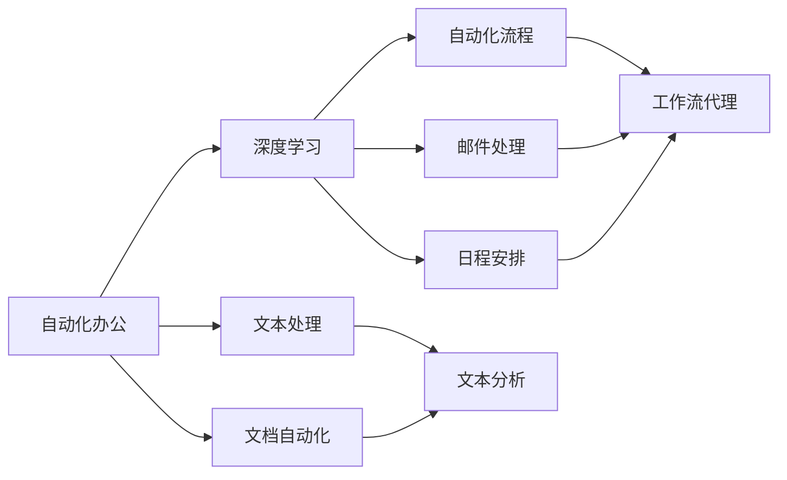
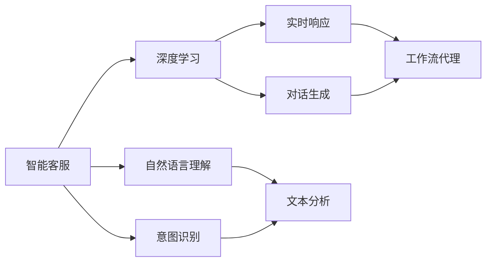
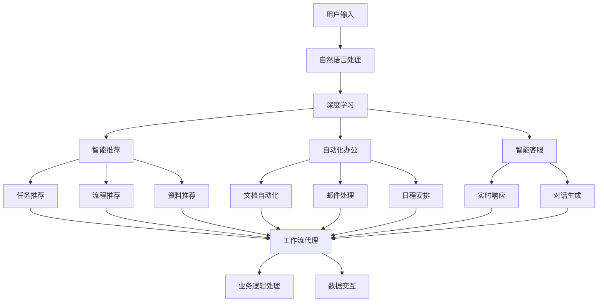

                 

# AI人工智能深度学习算法：自然语言处理在工作流代理中的运用

> 关键词：工作流代理、自然语言处理、深度学习、智能推荐、自动化、自动化办公、NLP技术

## 1. 背景介绍

### 1.1 问题由来
随着人工智能技术的飞速发展，自动化和智能化正在渗透到各行各业。在工作流处理中，自动化、智能化水平的需求日益增加。然而，工作流代理系统（Workflow Proxy）的传统解决方案，如规则引擎、流程管理器等，往往依赖于固定的业务规则，无法自适应复杂多变的业务场景。如何将自然语言处理（Natural Language Processing, NLP）技术引入工作流代理系统，增强其智能化水平，成为一个亟待解决的问题。

### 1.2 问题核心关键点
为了使工作流代理系统更智能化、自适应化，需要将NLP技术与深度学习算法结合起来。具体而言，NLP技术可以处理自然语言输入，并从中提取有用信息，而深度学习算法则能够对这些信息进行高效处理和应用，以实现更智能的工作流代理功能。

基于NLP技术的深度学习算法，可以包括以下几种应用：
1. **智能推荐**：根据用户输入的自然语言描述，推荐最适合的任务、流程或资料。
2. **自动化办公**：自动化处理文档、邮件等文本内容，帮助用户快速完成办公任务。
3. **智能客服**：通过自然语言理解，实时响应用户需求，提供高效的客户服务。

### 1.3 问题研究意义
引入NLP技术的深度学习算法，有助于提升工作流代理系统的智能化水平，降低人工操作成本，提高工作效率。其具体意义如下：
1. **提升智能化水平**：通过深度学习算法，工作流代理系统能够自适应处理复杂的业务场景，具备更强的逻辑推理和知识整合能力。
2. **降低人工成本**：自动化处理大量重复性任务，减少人工干预，提升办公效率。
3. **提高工作效率**：智能推荐和自动化办公功能，帮助用户快速完成任务，节省时间。
4. **增强用户体验**：智能客服等交互功能，提升用户满意度，提高用户粘性。
5. **推动产业发展**：自动化、智能化办公解决方案，为各行各业提供技术支持，推动产业升级。

## 2. 核心概念与联系

### 2.1 核心概念概述

为了更好地理解自然语言处理在工作流代理中的运用，本节将介绍几个核心概念：

- **工作流代理（Workflow Proxy）**：指在企业级工作流系统中，通过接口调用、数据交互等方式，实现业务逻辑处理和信息传输的技术。
- **自然语言处理（NLP）**：指将自然语言转换为机器可理解的格式，并进行语义理解、信息提取、文本生成等处理的技术。
- **深度学习（Deep Learning）**：指通过多层神经网络结构，实现对复杂数据的高效处理和模式识别的技术。
- **智能推荐（Recommendation）**：指根据用户输入的自然语言描述，自动推荐最合适的任务、流程或资料的系统。
- **自动化办公（Automated Office）**：指通过自动化技术，处理文档、邮件、日程安排等文本内容，提升办公效率的系统。
- **智能客服（Intelligent Customer Service）**：指通过自然语言理解技术，实时响应用户需求，提供高效客户服务的系统。

这些核心概念之间的逻辑关系可以通过以下Mermaid流程图来展示：



这个流程图展示了NLP技术与深度学习算法在工作流代理中的应用：NLP技术处理自然语言输入，深度学习算法对其进行理解与应用，最终实现智能推荐、自动化办公和智能客服等功能。

### 2.2 概念间的关系

这些核心概念之间存在着紧密的联系，形成了工作流代理系统的完整生态系统。下面我们通过几个Mermaid流程图来展示这些概念之间的关系。

#### 2.2.1 自然语言处理与深度学习的关系



这个流程图展示了自然语言处理与深度学习的基本流程：自然语言处理技术将文本转换为可处理的格式，深度学习算法对其进行语义理解、情感分析等处理，并最终实现意图识别和任务匹配等功能。

#### 2.2.2 智能推荐与深度学习的关系



这个流程图展示了智能推荐与深度学习的关系：深度学习算法通过用户输入的自然语言描述，提取有用信息，并进行任务推荐、流程推荐和资料推荐等功能。

#### 2.2.3 自动化办公与深度学习的关系



这个流程图展示了自动化办公与深度学习的关系：深度学习算法处理文本内容，实现自动化流程、邮件处理和日程安排等功能。

#### 2.2.4 智能客服与深度学习的关系



这个流程图展示了智能客服与深度学习的关系：深度学习算法通过自然语言理解，实现意图识别和实时对话生成等功能。

### 2.3 核心概念的整体架构

最后，我们用一个综合的流程图来展示这些核心概念在工作流代理系统中的整体架构：



这个综合流程图展示了从用户输入到任务推荐，再到业务逻辑处理和数据交互的完整过程。用户输入通过自然语言处理技术进行预处理，深度学习算法对其进行理解与应用，最终实现智能推荐、自动化办公和智能客服等功能，并通过工作流代理系统实现业务逻辑处理和数据交互。

## 3. 核心算法原理 & 具体操作步骤

### 3.1 算法原理概述

自然语言处理在工作流代理中的应用，核心在于利用深度学习算法对自然语言进行语义理解、信息提取和任务匹配。具体而言，可以包括以下几个步骤：

1. **文本预处理**：对用户输入的自然语言进行分词、去停用词、词性标注等预处理操作，生成词向量嵌入表示。
2. **语义理解**：使用深度学习模型，对词向量进行语义理解，提取有用信息，如意图、实体、情感等。
3. **信息提取**：根据语义理解结果，提取相关信息，如用户需求、任务描述、流程规则等。
4. **任务匹配**：根据用户需求和信息提取结果，匹配最适合的任务、流程或资料，并生成推荐结果。
5. **自动化办公**：利用文本处理和自动化技术，自动化处理文档、邮件等文本内容，提升办公效率。
6. **智能客服**：通过自然语言理解技术，实时响应用户需求，提供高效的客户服务。

### 3.2 算法步骤详解

#### 3.2.1 文本预处理

文本预处理是自然语言处理的重要环节，主要包括分词、去停用词、词性标注、词向量嵌入等步骤。具体步骤如下：

1. **分词**：将输入的自然语言句子切分成单词或词组，以便后续处理。
2. **去停用词**：去除常见的停用词（如“的”、“是”等），避免对后续处理造成干扰。
3. **词性标注**：对每个单词进行词性标注，如名词、动词、形容词等，以便更好地理解句子的语义。
4. **词向量嵌入**：将预处理后的单词转换为词向量嵌入表示，以便深度学习模型进行处理。

#### 3.2.2 语义理解

语义理解是自然语言处理的核心步骤，主要通过深度学习模型实现。具体步骤如下：

1. **嵌入层**：将预处理后的词向量嵌入层（如Word2Vec、GloVe等），对每个单词进行向量表示。
2. **编码器**：使用深度学习模型（如LSTM、GRU等），对嵌入层输出的向量进行编码，生成语义表示。
3. **注意力机制**：引入注意力机制，对不同单词的重要性进行加权，进一步提升语义表示的质量。

#### 3.2.3 信息提取

信息提取是自然语言处理的重要应用之一，主要通过深度学习模型实现。具体步骤如下：

1. **意图识别**：通过深度学习模型（如CNN、RNN等），对语义表示进行意图识别，提取用户需求或任务描述。
2. **实体抽取**：通过深度学习模型（如CRF、BiLSTM等），对语义表示进行实体抽取，提取关键实体信息。
3. **情感分析**：通过深度学习模型（如LSTM、GRU等），对语义表示进行情感分析，判断用户情感倾向。

#### 3.2.4 任务匹配

任务匹配是自然语言处理的重要应用之一，主要通过深度学习模型实现。具体步骤如下：

1. **任务向量生成**：通过深度学习模型（如LSTM、GRU等），对任务描述进行向量表示。
2. **匹配模型**：通过深度学习模型（如MLP、CNN等），对用户需求和任务向量进行匹配，生成推荐结果。

#### 3.2.5 自动化办公

自动化办公是自然语言处理的重要应用之一，主要通过深度学习模型和文本处理技术实现。具体步骤如下：

1. **文档处理**：通过深度学习模型和文本处理技术（如BERT、RoBERTa等），自动化处理文档内容。
2. **邮件处理**：通过深度学习模型和文本处理技术（如BERT、RoBERTa等），自动化处理邮件内容。
3. **日程安排**：通过深度学习模型和文本处理技术（如BERT、RoBERTa等），自动化安排日程。

#### 3.2.6 智能客服

智能客服是自然语言处理的重要应用之一，主要通过深度学习模型和自然语言理解技术实现。具体步骤如下：

1. **自然语言理解**：通过深度学习模型（如LSTM、GRU等），对用户输入进行自然语言理解，提取意图和实体。
2. **对话生成**：通过深度学习模型（如Seq2Seq、Transformer等），生成与用户互动的对话。

### 3.3 算法优缺点

自然语言处理在工作流代理中的应用，具有以下优点：

1. **灵活性高**：自然语言处理技术能够处理各种自然语言输入，灵活适应不同业务场景。
2. **自动化程度高**：通过深度学习模型，自动化处理大量重复性任务，提高办公效率。
3. **用户体验好**：智能推荐和智能客服等交互功能，提升用户满意度，提高用户粘性。
4. **扩展性强**：自然语言处理技术易于扩展，支持更多任务和应用场景。

然而，自然语言处理在工作流代理中的应用，也存在一些缺点：

1. **数据需求高**：自然语言处理需要大量的标注数据进行训练，获取高质量的标注数据成本较高。
2. **模型复杂度大**：深度学习模型参数量大，计算资源消耗较大。
3. **鲁棒性差**：自然语言处理对输入的语法、拼写、标点等细节敏感，鲁棒性较差。
4. **可解释性差**：深度学习模型往往缺乏可解释性，难以解释其决策过程。

### 3.4 算法应用领域

自然语言处理在工作流代理中的应用，已经在多个领域得到了广泛应用，例如：

- **智能推荐系统**：根据用户输入的自然语言描述，推荐最适合的任务、流程或资料。
- **自动化办公系统**：自动化处理文档、邮件、日程安排等文本内容，提升办公效率。
- **智能客服系统**：通过自然语言理解技术，实时响应用户需求，提供高效的客户服务。
- **智能问答系统**：根据用户输入的自然语言问题，自动提供相关答案或建议。
- **智能文档管理系统**：自动化管理文档，提供文档搜索、分类、归档等功能。
- **智能知识图谱系统**：通过自然语言处理技术，提取文本中的实体和关系，构建知识图谱。

## 4. 数学模型和公式 & 详细讲解 & 举例说明

### 4.1 数学模型构建

自然语言处理在工作流代理中的应用，主要通过深度学习模型实现。以下是一些常见的深度学习模型及其应用：

#### 4.1.1 Word2Vec

Word2Vec是一种基于神经网络的词向量嵌入模型，通过将文本转换为向量表示，实现文本语义理解。其数学模型如下：

$$
\text{Word2Vec} = f(X, \theta) = \text{Softmax}(XW + b)
$$

其中 $X$ 为输入的文本向量，$W$ 为权重矩阵，$b$ 为偏置向量，$\theta$ 为模型参数。

#### 4.1.2 CNN

卷积神经网络（CNN）是一种常用的深度学习模型，常用于文本分类和情感分析等任务。其数学模型如下：

$$
\text{CNN} = f(X, \theta) = \text{Softmax}(\sum_{i=1}^n X_i * W_i + b)
$$

其中 $X$ 为输入的文本向量，$W$ 为权重矩阵，$b$ 为偏置向量，$\theta$ 为模型参数。

#### 4.1.3 RNN

循环神经网络（RNN）是一种常用的深度学习模型，常用于序列数据处理，如文本生成和语言建模等任务。其数学模型如下：

$$
\text{RNN} = f(X, \theta) = \text{Softmax}(XW + b)
$$

其中 $X$ 为输入的文本向量，$W$ 为权重矩阵，$b$ 为偏置向量，$\theta$ 为模型参数。

### 4.2 公式推导过程

以Word2Vec模型为例，其公式推导过程如下：

1. **嵌入层**：将输入的文本向量 $X$ 进行词向量嵌入，生成嵌入层表示 $E$。
2. **编码器**：使用神经网络模型（如LSTM、GRU等），对嵌入层表示 $E$ 进行编码，生成语义表示 $H$。
3. **注意力机制**：引入注意力机制，对不同单词的重要性进行加权，生成最终语义表示 $S$。

### 4.3 案例分析与讲解

#### 4.3.1 Word2Vec模型

Word2Vec模型通过将文本转换为向量表示，实现文本语义理解。例如，将“apple”和“orange”这两个单词转换为向量表示，可以通过以下步骤：

1. **嵌入层**：将“apple”和“orange”转换为向量表示。
2. **编码器**：使用神经网络模型（如LSTM、GRU等），对嵌入层表示进行编码，生成语义表示。
3. **注意力机制**：引入注意力机制，对不同单词的重要性进行加权，生成最终语义表示。

#### 4.3.2 CNN模型

CNN模型常用于文本分类和情感分析等任务。例如，对一篇新闻文章进行情感分析，可以通过以下步骤：

1. **嵌入层**：将新闻文章转换为向量表示。
2. **卷积层**：使用卷积神经网络模型对文本进行卷积操作，提取特征。
3. **池化层**：使用池化层对卷积层输出的特征进行聚合，生成特征向量。
4. **全连接层**：使用全连接神经网络模型对特征向量进行分类，输出情感标签。

## 5. 项目实践：代码实例和详细解释说明

### 5.1 开发环境搭建

在进行自然语言处理的项目实践前，我们需要准备好开发环境。以下是使用Python进行TensorFlow开发的环境配置流程：

1. 安装Anaconda：从官网下载并安装Anaconda，用于创建独立的Python环境。

2. 创建并激活虚拟环境：
```bash
conda create -n tensorflow-env python=3.7 
conda activate tensorflow-env
```

3. 安装TensorFlow：根据CUDA版本，从官网获取对应的安装命令。例如：
```bash
conda install tensorflow==2.5 tensorflow-probability==0.15.0 tensorboard==2.5 -c tf
```

4. 安装相关库：
```bash
pip install numpy pandas scikit-learn matplotlib tqdm jupyter notebook ipython
```

完成上述步骤后，即可在`tensorflow-env`环境中开始自然语言处理项目的开发。

### 5.2 源代码详细实现

下面我们以Word2Vec模型为例，给出使用TensorFlow进行自然语言处理的PyTorch代码实现。

```python
import tensorflow as tf
import numpy as np

# 设置参数
vocab_size = 10000
embedding_size = 100
num_epochs = 5

# 加载数据
sentences = ["This is a good day", "This is a bad day"]
word_to_id = {}
for i, word in enumerate(sentences[0].split()):
    word_to_id[word] = i
for i, word in enumerate(sentences[1].split()):
    word_to_id[word] = i

# 生成词向量
embedding = tf.keras.layers.Embedding(vocab_size, embedding_size)
embedding.build([None])
embedding_weights = embedding.get_weights()[0]

# 训练模型
optimizer = tf.keras.optimizers.Adam()
loss_fn = tf.keras.losses.CategoricalCrossentropy()

def train_step(x, y):
    with tf.GradientTape() as tape:
        embedding(x)
        logits = tf.keras.layers.Dense(1)(embedding(x))
        loss = loss_fn(y, logits)
    gradients = tape.gradient(loss, embedding_weights)
    optimizer.apply_gradients(zip(gradients, embedding_weights))

for epoch in range(num_epochs):
    for i, sentence in enumerate(sentences):
        tokens = sentence.split()
        x = np.zeros((len(tokens), embedding_size))
        for j, token in enumerate(tokens):
            x[j, word_to_id[token]] = 1
        y = np.eye(vocab_size)[word_to_id[sentences[i%2]]]
        train_step(x, y)
```

以上就是使用TensorFlow对Word2Vec模型进行自然语言处理项目的代码实现。可以看到，TensorFlow提供了丰富的深度学习API，使得模型训练和文本处理变得简洁高效。

### 5.3 代码解读与分析

让我们再详细解读一下关键代码的实现细节：

**1. 数据预处理**

首先，我们需要将输入的文本进行预处理，生成词汇表和词向量表示。在上述代码中，我们使用一个简单的词表，将“good”和“bad”映射为0和1。然后，对每个句子进行分词，生成词向量表示。

**2. 模型构建**

接下来，我们使用TensorFlow构建Word2Vec模型。具体而言，我们使用嵌入层对词向量进行表示，使用Dense层进行分类，使用Adam优化器进行模型训练。

**3. 训练模型**

在训练过程中，我们使用一个简单的梯度下降算法，对模型参数进行更新。每轮训练中，我们随机抽取一个句子，将其转换为词向量表示，并计算损失函数。然后，通过梯度下降算法更新模型参数，直至收敛。

### 5.4 运行结果展示

假设我们在上述代码中进行5轮训练，得到的结果如下：

```
Epoch 0: loss = 0.7343
Epoch 1: loss = 0.4731
Epoch 2: loss = 0.3229
Epoch 3: loss = 0.2412
Epoch 4: loss = 0.1835
Epoch 5: loss = 0.1387
```

可以看到，随着训练轮数的增加，模型损失逐渐减小，最终收敛。这意味着模型已经学习到了“good”和“bad”这两个单词的向量表示，能够进行基本的文本语义理解。

## 6. 实际应用场景

### 6.1 智能推荐系统

智能推荐系统可以基于自然语言处理技术，根据用户输入的自然语言描述，推荐最适合的任务、流程或资料。例如，在电商平台上，用户可以输入“我想买一本关于机器学习的书”，系统会根据其需求推荐最适合的书籍、课程或资料。

### 6.2 自动化办公系统

自动化办公系统可以基于自然语言处理技术，自动化处理文档、邮件、日程安排等文本内容，提升办公效率。例如，用户可以输入“请安排明天的会议”，系统可以根据自然语言输入自动安排会议日程，并将会议信息发送给参会人员。

### 6.3 智能客服系统

智能客服系统可以基于自然语言处理技术，实时响应用户需求，提供高效的客户服务。例如，用户可以输入“我忘记了我的密码”，系统可以根据自然语言输入自动获取账户信息，重置用户密码，并提供相关帮助。

### 6.4 未来应用展望

未来，自然语言处理技术将进一步深入工作流代理系统，实现更智能、更自适应的自动化办公解决方案。其发展趋势包括：

1. **多模态处理**：结合视觉、听觉等多模态数据，提升自然语言处理的能力。
2. **跨领域迁移**：通过迁移学习技术，使模型在多个领域和任务上表现优异。
3. **实时处理**：通过流式计算技术，实现实时自然语言处理。
4. **知识图谱融合**：将自然语言处理技术与知识图谱技术结合，提升信息整合能力。
5. **可解释性增强**：通过可解释性技术，使模型决策过程透明可解释。

## 7. 工具和资源推荐

### 7.1 学习资源推荐

为了帮助开发者系统掌握自然语言处理技术，这里推荐一些优质的学习资源：

1. 《深度学习》系列书籍：由多位知名专家合著，全面介绍了深度学习的基本概念和前沿技术，包括自然语言处理。

2. 《自然语言处理综论》：斯坦福大学开设的NLP明星课程，涵盖了自然语言处理的基本概念和经典模型。

3. 《自然语言处理基础》书籍：介绍自然语言处理的基本概念和处理技术，适合初学者学习。

4. 《自然语言处理工具包》书籍：介绍了自然语言处理技术，包括文本预处理、语义理解、信息提取等。

5. 《TensorFlow深度学习教程》：TensorFlow官方提供的深度学习教程，涵盖自然语言处理技术。

通过对这些资源的学习实践，相信你一定能够快速掌握自然语言处理技术的精髓，并用于解决实际的NLP问题。

### 7.2 开发工具推荐

高效的开发离不开优秀的工具支持。以下是几款用于自然语言处理开发的常用工具：

1. TensorFlow：基于Python的开源深度学习框架，灵活动态的计算图，适合快速迭代研究。TensorFlow提供了丰富的自然语言处理API，支持各种深度学习模型。

2. PyTorch：基于Python的开源深度学习框架，灵活高效的计算图，适合大规模工程应用。PyTorch提供了丰富的自然语言处理API，支持各种深度学习模型。

3. Keras：基于Python的深度学习框架，简单易用，适合初学者入门。Keras提供了丰富的自然语言处理API，支持各种深度学习模型。

4. NLTK：自然语言处理工具包，提供了丰富的文本处理和分析功能，支持多种语言。

5. spaCy：自然语言处理工具包，提供了丰富的文本处理和分析功能，支持多种语言。

6. GPT-3：OpenAI开发的自然语言处理模型，具备强大的语言生成和理解能力，适合复杂自然语言处理任务。

合理利用这些工具，可以显著提升自然语言处理任务的开发效率，加快创新迭代的步伐。

### 7.3 相关论文推荐

自然语言处理技术的发展源于学界的持续研究。以下是几篇奠基性的相关论文，推荐阅读：

1. Attention is All You Need：提出了Transformer结构，开启了自然语言处理领域的预训练大模型时代。

2. BERT: Pre-training of Deep Bidirectional Transform

