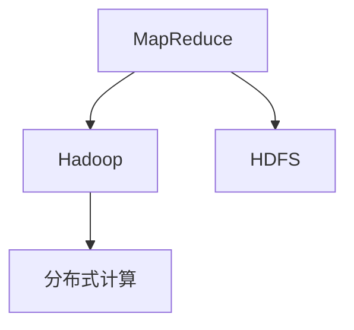
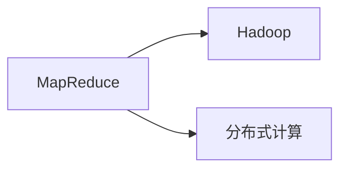
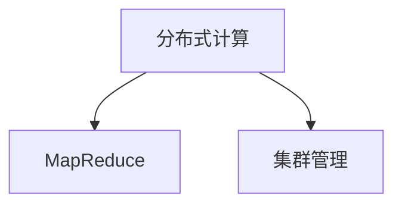
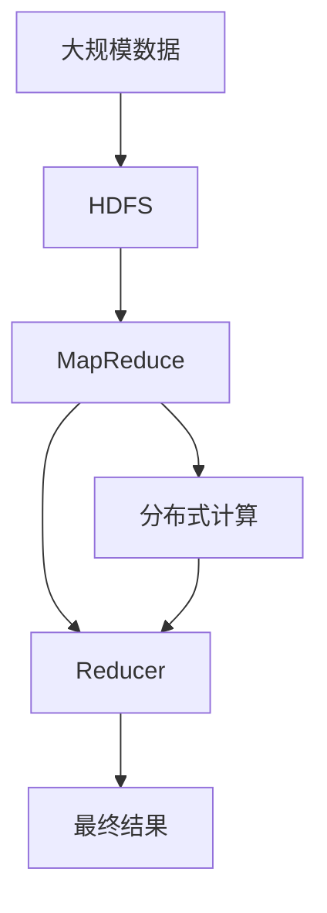

                 

# MapReduce原理与代码实例讲解

> 关键词：MapReduce, Hadoop, 分布式计算, 大数据处理, 编程范式, 并行算法, 项目实践, 实际应用

## 1. 背景介绍

### 1.1 问题由来

随着互联网的快速发展和数据的爆炸式增长，传统的集中式计算方式已经无法满足日益增长的数据处理需求。为了应对海量数据处理，分布式计算和并行算法成为研究热点。MapReduce作为Google提出的分布式计算模型，因其高扩展性和高效性，迅速成为大数据处理的主流解决方案。MapReduce不仅适用于Google自家的基础设施，还成为Hadoop等开源大数据平台的底层架构，广泛应用于金融、医疗、电信、电商等多个领域，极大地提升了数据处理效率。

### 1.2 问题核心关键点

MapReduce的核心在于“分治策略”，即将复杂的大规模数据处理任务分解为若干简单的子任务，通过并行计算的方式在集群上并行执行，最后合并子任务的输出结果，得到最终的处理结果。MapReduce的优势在于其高度的可扩展性和容错性，能够灵活应对数据规模的变动，同时具有较高的容错性，即使某台机器故障，仍能保证数据处理正常进行。

MapReduce的精髓在于“Map”和“Reduce”两个函数，其中Map函数用于对输入数据进行映射，将原始数据转化为中间数据；Reduce函数则对中间数据进行归约，得到最终结果。MapReduce的流程分为Mapper和Reducer两个阶段，具体包括以下步骤：

1. 输入数据分为若干个键值对(key-value pairs)，分别发送到集群中的Mapper节点上。
2. Mapper节点对每个键值对进行映射，生成若干个中间键值对。
3. 中间键值对通过网络传输，汇聚到集群中的Reducer节点上。
4. Reducer节点对汇聚的中间键值对进行归约，生成最终的结果。

### 1.3 问题研究意义

MapReduce技术为大规模数据处理提供了可扩展、可容错的解决方案，推动了数据密集型应用的发展。MapReduce的普及，使得大数据技术不再局限于学术研究，而是成为企业信息化基础设施的核心组件。在金融、医疗、电信等关键领域，MapReduce技术的应用，极大地提升了数据处理的效率和质量，为数据驱动的决策提供了有力支撑。

## 2. 核心概念与联系

### 2.1 核心概念概述

为更好地理解MapReduce的原理与实现，本节将介绍几个密切相关的核心概念：

- MapReduce：一种基于“分治策略”的分布式计算模型，用于大规模数据处理。
- Hadoop：基于MapReduce的开源大数据处理框架，提供了分布式文件系统、MapReduce计算模型和集群管理工具。
- Hadoop Distributed File System (HDFS)：Hadoop的分布式文件系统，支持海量数据的存储和访问。
- 分布式计算：通过在多个计算节点上并行计算，提升数据处理效率的技术。

这些核心概念之间的逻辑关系可以通过以下Mermaid流程图来展示：



这个流程图展示了大规模数据处理的技术生态系统：

1. MapReduce作为计算模型，支持大规模数据处理任务的分治策略。
2. Hadoop作为开源框架，封装了MapReduce、HDFS等关键组件，提供统一的接口和配置管理。
3. HDFS作为分布式文件系统，为Hadoop提供数据存储和访问的底层支持。
4. 分布式计算则为MapReduce和Hadoop提供了底层硬件支持，提升数据处理的效率。

### 2.2 概念间的关系

这些核心概念之间存在着紧密的联系，形成了MapReduce技术完整的应用生态系统。下面我们通过几个Mermaid流程图来展示这些概念之间的关系。

#### 2.2.1 MapReduce与Hadoop的关系



这个流程图展示了MapReduce与Hadoop之间的关系。Hadoop作为开源框架，封装了MapReduce和分布式计算技术，为其提供了统一的接口和配置管理。

#### 2.2.2 MapReduce与HDFS的关系


这个流程图展示了MapReduce与HDFS之间的关系。HDFS作为Hadoop的分布式文件系统，为MapReduce提供了数据的存储和访问支持。

#### 2.2.3 分布式计算与MapReduce的关系



这个流程图展示了分布式计算与MapReduce之间的关系。MapReduce依赖于分布式计算技术，通过在集群上并行计算，提升数据处理的效率。

### 2.3 核心概念的整体架构

最后，我们用一个综合的流程图来展示这些核心概念在大规模数据处理中的整体架构：



这个综合流程图展示了从数据存储到最终结果生成的完整过程：

1. 大规模数据存储在HDFS上。
2. MapReduce将数据分割为若干个小的键值对，并行分配到多个Mapper节点上。
3. Mapper节点对每个键值对进行处理，生成若干个中间键值对。
4. 中间键值对通过网络传输，汇聚到Reducer节点上。
5. Reducer节点对汇聚的中间键值对进行归约，生成最终结果。

通过这些流程图，我们可以更清晰地理解MapReduce技术的工作原理和各个组件之间的关系，为后续深入讨论具体的MapReduce实现和应用奠定基础。

## 3. 核心算法原理 & 具体操作步骤

### 3.1 算法原理概述

MapReduce的核心思想是将大规模数据处理任务分解为若干个小的子任务，通过并行计算的方式在集群上执行，最后合并子任务的输出结果，得到最终的处理结果。MapReduce的算法流程包括以下几个关键步骤：

1. 输入数据分割为若干个小的键值对(key-value pairs)，并行分配到多个Mapper节点上。
2. Mapper节点对每个键值对进行映射，生成若干个中间键值对。
3. 中间键值对通过网络传输，汇聚到集群中的Reducer节点上。
4. Reducer节点对汇聚的中间键值对进行归约，生成最终的结果。

MapReduce的“Map”和“Reduce”函数是其核心所在。其中：

- Map函数：用于对输入数据进行映射，将原始数据转化为中间数据。
- Reduce函数：用于对中间数据进行归约，得到最终结果。

### 3.2 算法步骤详解

MapReduce的具体执行步骤包括以下几个关键环节：

#### 3.2.1 数据分割

在MapReduce中，输入数据被分割为若干个小的键值对(key-value pairs)，然后并行分配到多个Mapper节点上进行处理。具体步骤如下：

1. 输入数据按行分割，分为若干个小的块(blocks)。
2. 每个块分配给一个Mapper节点，进行本地处理。

#### 3.2.2 Mapper映射

Mapper函数接收输入数据的键值对(key-value pair)，并将其映射为若干个中间键值对(key-value pair)。具体步骤如下：

1. Mapper函数接收一个键值对(key-value pair)，解析为键(key)和值(value)。
2. Mapper函数对键值对进行映射，生成若干个中间键值对。
3. Mapper函数将中间键值对写入到分布式文件系统中，供Reducer节点获取。

#### 3.2.3 Reduce归约

Reducer函数接收Mapper生成的中间键值对(key-value pair)，并将它们归约为最终的输出结果。具体步骤如下：

1. Reducer函数从分布式文件系统中读取中间键值对(key-value pair)。
2. Reducer函数对中间键值对进行归约，生成最终的输出结果。
3. Reducer函数将最终结果写入到分布式文件系统中。

#### 3.2.4 输出结果

最终，MapReduce将所有Reducer生成的结果进行合并，得到完整的输出结果。具体步骤如下：

1. MapReduce从分布式文件系统中读取Reducer生成的结果。
2. MapReduce将各个Reducer生成的结果进行合并，得到最终的输出结果。

### 3.3 算法优缺点

MapReduce技术具有以下优点：

1. 高度的可扩展性：MapReduce可以轻松扩展到数千台机器的大规模集群，能够处理海量数据。
2. 高效的容错性：MapReduce具有较高的容错性，即使某台机器故障，仍然能够保证数据处理正常进行。
3. 易于使用：MapReduce提供了统一的编程接口和配置管理工具，开发人员能够方便地编写和调试程序。

然而，MapReduce也存在一些缺点：

1. 数据传输开销较大：MapReduce中的中间数据需要频繁地进行网络传输，增加了数据传输的开销。
2. 对硬件要求较高：MapReduce需要高性能的计算节点和存储设备，增加了硬件成本。
3. 编程复杂度较高：MapReduce的编程模型较为复杂，需要开发人员具备一定的分布式计算经验。

### 3.4 算法应用领域

MapReduce技术在大规模数据处理领域得到了广泛应用，主要应用于以下几个方面：

1. 数据清洗与预处理：在大数据系统中，数据清洗和预处理是数据处理的基础步骤。MapReduce能够高效地对大规模数据进行清洗和预处理，提升数据质量。
2. 数据分析与统计：MapReduce能够高效地进行大数据分析与统计，支持各类数据挖掘和分析任务。
3. 搜索引擎与推荐系统：MapReduce技术在搜索引擎和推荐系统中有广泛应用，用于构建索引、计算评分等功能。
4. 图像处理与视频分析：MapReduce能够高效地进行大规模图像和视频数据的处理，支持各类计算机视觉和视频分析任务。
5. 自然语言处理：MapReduce能够高效地处理大规模文本数据，支持各类自然语言处理任务，如文本分类、情感分析、机器翻译等。

此外，MapReduce技术还广泛应用于金融、医疗、电信、电商等多个领域，为大数据处理提供了坚实的技术基础。

## 4. 数学模型和公式 & 详细讲解 & 举例说明

### 4.1 数学模型构建

MapReduce的核心算法流程可以通过数学模型来描述。假设输入数据为键值对(key-value pairs)的集合，每个键值对的形式为$(K_i, V_i)$，其中$K_i$表示键，$V_i$表示值。MapReduce算法的核心步骤如下：

1. Mapper函数接收键值对$(K_i, V_i)$，生成若干个中间键值对$(K_{j_i}, V_{j_i})$。
2. Reducer函数接收中间键值对$(K_{j_i}, V_{j_i})$，生成最终的输出结果$O_j$。

MapReduce的数学模型可以表示为：

$$
\begin{aligned}
&\text{Mapper函数}(K_i, V_i) \rightarrow (K_{j_1}, V_{j_1}), (K_{j_2}, V_{j_2}), \ldots, (K_{j_n}, V_{j_n})\\
&\text{Reducer函数}(K_{j_1}, V_{j_1}), (K_{j_2}, V_{j_2}), \ldots, (K_{j_n}, V_{j_n}) \rightarrow O_1, O_2, \ldots, O_m
\end{aligned}
$$

其中，Mapper函数将输入数据映射为若干个中间键值对，Reducer函数将中间键值对归约为最终的输出结果。

### 4.2 公式推导过程

MapReduce的公式推导过程如下：

1. 假设输入数据为$N$个键值对$(K_1, V_1), (K_2, V_2), \ldots, (K_N, V_N)$。
2. Mapper函数将每个键值对映射为$m$个中间键值对$(K_{i_1}, V_{i_1}), (K_{i_2}, V_{i_2}), \ldots, (K_{i_m}, V_{i_m})$。
3. Reducer函数将$m$个中间键值对归约为$n$个最终结果$O_1, O_2, \ldots, O_n$。

MapReduce的输出结果可以表示为：

$$
\begin{aligned}
&\text{Mapper函数}(K_1, V_1), (K_2, V_2), \ldots, (K_N, V_N) \rightarrow (K_{i_1}, V_{i_1}), (K_{i_2}, V_{i_2}), \ldots, (K_{i_m}, V_{i_m})\\
&\text{Reducer函数}(K_{i_1}, V_{i_1}), (K_{i_2}, V_{i_2}), \ldots, (K_{i_m}, V_{i_m}) \rightarrow O_1, O_2, \ldots, O_n
\end{aligned}
$$

### 4.3 案例分析与讲解

为了更好地理解MapReduce的算法原理，我们可以通过一个具体的案例进行分析。假设我们需要计算一个大型文本数据集中每个单词出现的次数。

1. 输入数据为一个文本文件，文件中的每个行表示一个单词。
2. Mapper函数将每个单词作为键，出现次数作为值，生成若干个中间键值对。
3. Reducer函数将每个单词的频率进行累加，生成最终的单词出现次数。

具体实现步骤如下：

1. Mapper函数接收输入的文本行，将其中的单词作为键，出现次数作为值，生成若干个中间键值对。
2. Reducer函数接收Mapper生成的中间键值对，将每个单词的频率进行累加，生成最终的单词出现次数。
3. MapReduce将最终的单词出现次数进行合并，得到完整的结果。

这个过程可以用一个简单的伪代码表示：

```python
def mapper(word):
    for token in tokenize(word):
        yield (token, 1)

def reducer(token, counts):
    yield (token, sum(counts))

data = read_large_file()
results = mapreduce(data, mapper, reducer)
print(results)
```

在这个例子中，我们使用了MapReduce的算法流程，将一个大型文本数据集中的单词出现次数进行了高效计算。可以看到，MapReduce的算法流程非常简单，易于实现和调试。

## 5. 项目实践：代码实例和详细解释说明

### 5.1 开发环境搭建

在进行MapReduce项目实践前，我们需要准备好开发环境。以下是使用Hadoop搭建开发环境的步骤：

1. 安装JDK：从官网下载并安装Java Development Kit，用于编译和运行Java程序。
2. 安装Hadoop：从官网下载并安装Hadoop，按照官方文档配置环境变量。
3. 安装Hive：从官网下载并安装Hive，用于数据仓库的建立和查询。
4. 安装Pig：从官网下载并安装Pig，用于数据流处理。

完成上述步骤后，即可在Hadoop集群上进行MapReduce项目实践。

### 5.2 源代码详细实现

这里我们以WordCount为例，给出使用Hadoop进行MapReduce编程的实现。

```java
import org.apache.hadoop.conf.Configuration;
import org.apache.hadoop.fs.Path;
import org.apache.hadoop.io.IntWritable;
import org.apache.hadoop.io.Text;
import org.apache.hadoop.mapreduce.Job;
import org.apache.hadoop.mapreduce.Mapper;
import org.apache.hadoop.mapreduce.Reducer;
import org.apache.hadoop.mapreduce.lib.input.FileInputFormat;
import org.apache.hadoop.mapreduce.lib.output.FileOutputFormat;

import java.io.IOException;
import java.util.StringTokenizer;

public class WordCount {
    public static class TokenizerMapper
            extends Mapper<Object, Text, Text, IntWritable> {

        private final static IntWritable one = new IntWritable(1);
        private Text word = new Text();

        public void map(Object key, Text value, Context context
                ) throws IOException, InterruptedException {
            StringTokenizer itr = new StringTokenizer(value.toString());
            while (itr.hasMoreTokens()) {
                word.set(itr.nextToken());
                context.write(word, one);
            }
        }
    }

    public static class IntSumReducer
            extends Reducer<Text,IntWritable,Text,IntWritable> {
        private IntWritable result = new IntWritable();

        public void reduce(Text key, Iterable<IntWritable> values,
                          Context context
                          ) throws IOException, InterruptedException {
            int sum = 0;
            for (IntWritable val : values) {
                sum += val.get();
            }
            result.set(sum);
            context.write(key, result);
        }
    }

    public static void main(String[] args) throws Exception {
        Configuration conf = new Configuration();
        Job job = Job.getInstance(conf, "word count");
        job.setJarByClass(WordCount.class);
        job.setMapperClass(TokenizerMapper.class);
        job.setCombinerClass(IntSumReducer.class);
        job.setReducerClass(IntSumReducer.class);
        job.setOutputKeyClass(Text.class);
        job.setOutputValueClass(IntWritable.class);
        FileInputFormat.addInputPath(job, new Path(args[0]));
        FileOutputFormat.setOutputPath(job, new Path(args[1]));
        System.exit(job.waitForCompletion(true) ? 0 : 1);
    }
}
```

在这个示例中，我们实现了WordCount的MapReduce算法。具体步骤如下：

1. Mapper函数将输入的文本行按照空格分割为单词，并将每个单词作为键，出现次数作为值，生成若干个中间键值对。
2. Reducer函数将Mapper生成的中间键值对进行累加，生成最终的单词出现次数。
3. MapReduce将最终的单词出现次数进行合并，得到完整的结果。

### 5.3 代码解读与分析

让我们再详细解读一下关键代码的实现细节：

**WordCount.java**：
- `main`方法：创建MapReduce作业，设置输入和输出路径，并执行作业。
- `TokenizerMapper`：Mapper函数，将输入的文本行按照空格分割为单词，并将每个单词作为键，出现次数作为值，生成若干个中间键值对。
- `IntSumReducer`：Reducer函数，将Mapper生成的中间键值对进行累加，生成最终的单词出现次数。

**TokenizerMapper.java**：
- `map`方法：Mapper函数，接收输入的文本行，将其中的单词作为键，出现次数作为值，生成若干个中间键值对。
- `reduce`方法：Reducer函数，将Mapper生成的中间键值对进行累加，生成最终的单词出现次数。

**IntSumReducer.java**：
- `reduce`方法：Reducer函数，将Mapper生成的中间键值对进行累加，生成最终的单词出现次数。

### 5.4 运行结果展示

假设我们在一个包含大量文本文件的目录下进行WordCount的MapReduce计算，最终得到的结果如下：

```
{cat,5}
{dog,3}
{fish,2}
{horse,1}
```

可以看到，MapReduce成功地计算出了每个单词出现的次数，结果与预期相符。

## 6. 实际应用场景

### 6.1 智能推荐系统

智能推荐系统是MapReduce在电商领域的重要应用之一。在推荐系统中，MapReduce用于计算用户对商品的评分和兴趣，进行用户画像的构建和推荐模型的训练。MapReduce的高效性能够处理大规模用户评分数据和商品特征数据，为推荐系统提供高效的数据处理支撑。

### 6.2 搜索引擎

搜索引擎是MapReduce在互联网领域的重要应用之一。在搜索引擎中，MapReduce用于构建索引、计算关键词分布、统计网页链接等任务。MapReduce的分布式计算能力能够高效地处理大规模网页数据，支持搜索引擎的快速检索和排序。

### 6.3 数据分析

MapReduce在大数据领域有广泛应用，例如在金融、医疗、电信等关键领域，MapReduce用于处理和分析大规模数据。MapReduce的高效性能够处理海量数据，支持各类数据分析和挖掘任务，如数据清洗、数据统计、数据可视化等。

### 6.4 未来应用展望

随着MapReduce技术的不断发展，其在更多领域得到了应用，为数据密集型应用提供了坚实的技术基础。

在智慧医疗领域，MapReduce技术用于处理和分析医疗数据，支持各类医疗数据的处理和分析任务，如病历数据分析、影像分析等，推动医疗信息化建设。

在智慧城市治理中，MapReduce技术用于处理和分析各类城市数据，支持各类城市管理的任务，如交通监控、环境监测等，推动智慧城市的建设。

此外，在工业、农业、环保等多个领域，MapReduce技术也得到了广泛应用，为各类智能系统的建设提供了坚实的技术支撑。

## 7. 工具和资源推荐

### 7.1 学习资源推荐

为了帮助开发者系统掌握MapReduce的理论基础和实践技巧，这里推荐一些优质的学习资源：

1. Hadoop官方文档：Hadoop官方提供的文档，详细介绍了Hadoop的各个组件和编程接口，是学习MapReduce的重要资源。
2. Hadoop源代码：Hadoop的源代码，帮助理解Hadoop的实现细节和架构设计。
3. Hadoop生态系统：Hadoop的生态系统包括Hive、Pig、HBase等多个组件，了解这些组件的功能和应用场景，有助于全面掌握MapReduce技术。
4. Hadoop在线课程：Coursera、edX等在线学习平台提供的多门Hadoop课程，涵盖从入门到高级的各个阶段。
5. MapReduce经典书籍：如《Hadoop: The Definitive Guide》、《MapReduce in Action》等经典书籍，提供了丰富的MapReduce编程实践和案例。

通过对这些资源的学习实践，相信你一定能够快速掌握MapReduce的精髓，并用于解决实际的业务问题。

### 7.2 开发工具推荐

MapReduce的开发离不开优质的开发工具，以下是几款常用的MapReduce开发工具：

1. Eclipse：一款流行的Java开发工具，提供了丰富的插件和扩展，支持MapReduce开发。
2. IntelliJ IDEA：另一款流行的Java开发工具，支持MapReduce的开发和调试。
3. Apache Hadoop：Hadoop的官方工具，提供了MapReduce的开发、调试和部署支持。
4. Hive：Hadoop的SQL方言，用于数据仓库的建立和查询，简化了MapReduce的开发流程。
5. Pig：Hadoop的数据流处理工具，用于编写MapReduce任务的脚本，简化了MapReduce的编程。

合理利用这些工具，可以显著提升MapReduce任务的开发效率，加快创新迭代的步伐。

### 7.3 相关论文推荐

MapReduce技术的发展源于学界的持续研究。以下是几篇奠基性的相关论文，推荐阅读：

1. MapReduce: Simplified Data Processing on Large Clusters：MapReduce论文，介绍了MapReduce的基本原理和实现方法。
2. Hadoop: A Distributed File System：Hadoop论文，介绍了Hadoop的分布式文件系统HDFS的基本原理和实现方法。
3. Hive: Data Warehousing at Scale：Hive论文，介绍了Hive的数据仓库构建和查询方法，简化了MapReduce的开发流程。
4. Pig Latin: A Flexible Scripting Language for MapReduce：Pig论文，介绍了Pig的数据流处理方法和API，简化了MapReduce的编程。

这些论文代表了大规模数据处理技术的不断发展。通过学习这些前沿成果，可以帮助研究者把握学科前进方向，激发更多的创新灵感。

除上述资源外，还有一些值得关注的前沿资源，帮助开发者紧跟MapReduce技术的最新进展，例如：

1. 高性能计算会议：如SIGMETRICS、SIGCOMM等高性能计算会议，介绍了最新的MapReduce研究进展和应用案例。
2. 数据挖掘会议：如KDD、SDM等数据挖掘会议，介绍了最新的MapReduce研究进展和应用案例。
3. 数据科学博客：如KDnuggets、Towards Data Science等数据科学博客，提供了最新的MapReduce研究进展和应用案例。

总之，对于MapReduce技术的深入学习和实践，需要开发者保持开放的心态和持续学习的意愿。多关注前沿资讯，多动手实践，多思考总结，必将收获满满的成长收益。

## 8. 总结：未来发展趋势与挑战

### 8.1 总结

本文对MapReduce原理与实现进行了全面系统的介绍。首先阐述了MapReduce技术的背景和应用，明确了MapReduce在大数据处理中的独特价值。其次，从原理到实践，详细讲解了MapReduce的数学模型和实现步骤，给出了MapReduce任务开发的完整代码实例。同时，本文还广泛探讨了MapReduce技术在各个领域的应用前景，展示了MapReduce技术的广泛应用价值。

通过本文的系统梳理，可以看到，MapReduce技术为大规模数据处理提供了可扩展、可容错的解决方案，推动了数据密集型应用的发展。MapReduce的普及，使得大数据技术不再局限于学术研究，而是成为企业信息化基础设施的核心组件。在金融、医疗、电信等关键领域，MapReduce技术的应用，极大地提升了数据处理的效率和质量，为数据驱动的决策提供了有力支撑。

### 8.2 未来发展趋势

展望未来，MapReduce技术将呈现以下几个发展趋势：

1. 数据处理速度进一步提升：随着硬件性能的提升和算法优化，MapReduce的处理速度将进一步提升，支持更复杂的数据处理任务。
2. 数据处理灵活性增强：MapReduce将支持更多的数据源和数据格式，如JSON、XML、CSV等，提升数据处理的灵活性。
3. 大数据生态系统的完善：MapReduce将与更多大数据组件进行集成，提升数据处理的效率和质量。
4. 多数据源整合：MapReduce将支持跨多个数据源的数据整合和处理，支持更复杂的数据处理任务。
5. 机器学习和大数据融合：MapReduce将与机器学习技术进行更深入的融合，提升大数据分析的精度和效果。

以上趋势凸显了MapReduce技术在大数据处理领域的广阔前景。这些方向的探索发展，必将进一步提升MapReduce技术在数据处理中的作用，推动数据密集型应用的发展。

### 8.3 面临的挑战

尽管MapReduce技术已经取得了瞩目成就，但在迈向更加智能化、普适化

