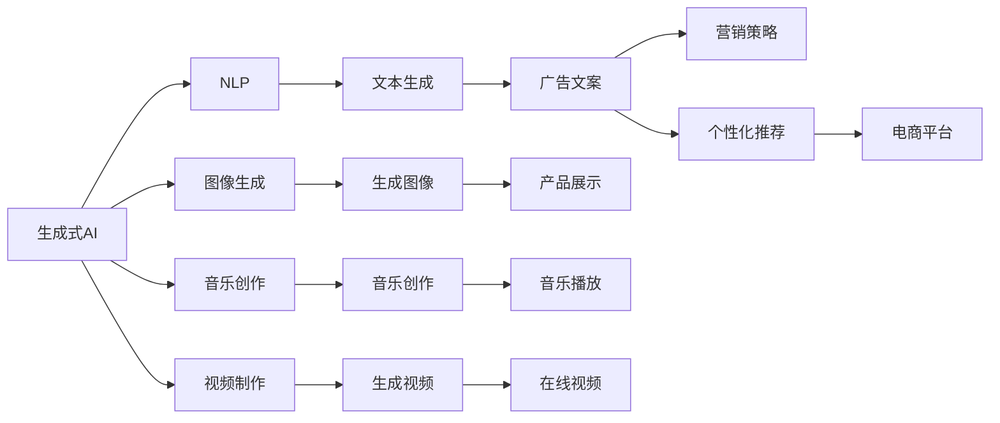
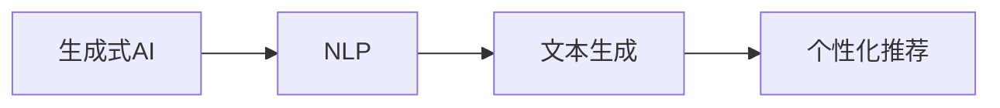
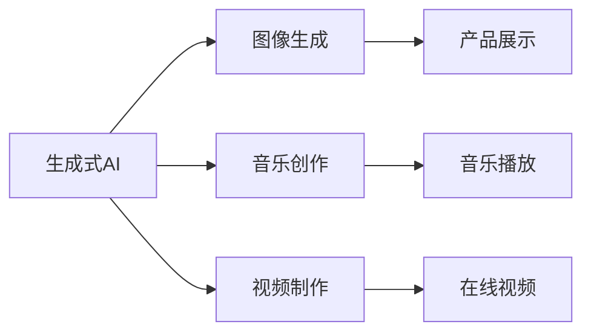
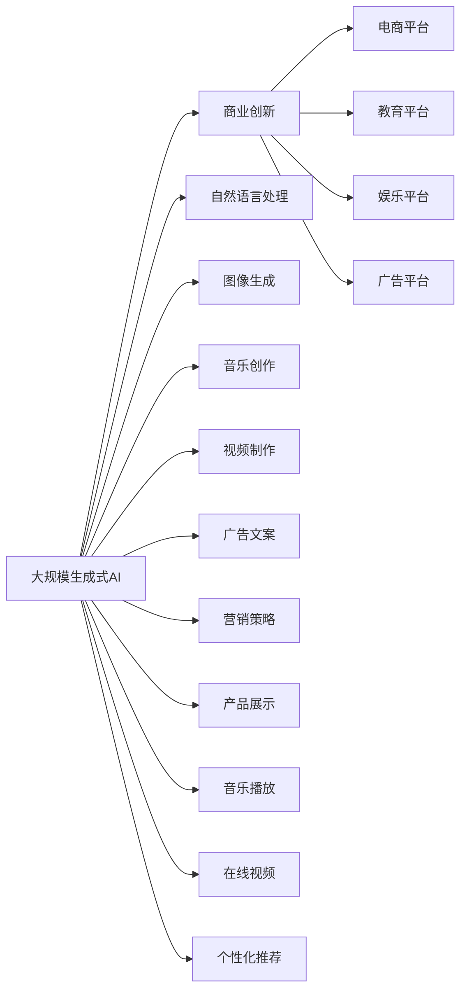

                 

# AIGC：如何利用生成式AI实现商业创新？

> 关键词：生成式AI, 商业创新, 自然语言处理, 文本生成, 深度学习, GAN, 神经网络

## 1. 背景介绍

在当今数字化时代，人工智能（AI）技术已经成为推动商业创新的重要引擎。随着算力、数据和模型的飞速发展，生成式AI（Generative AI）作为AI技术的最新突破，正在为各行各业带来革命性的变化。其中，生成式AI在自然语言处理（NLP）、图像生成、音乐创作、视频制作等多个领域展现出了强大的商业价值和创新潜力。

### 1.1 问题由来

生成式AI的核心思想是通过生成模型（如生成对抗网络GAN、变分自编码器VAE、神经网络等），学习数据的分布并生成新的数据样本。这种能力不仅在艺术创作、内容生成等方面展现了巨大潜力，还在商业应用中开辟了新的天地。例如，通过生成式模型，品牌可以生成个性化广告文案、营销策略，甚至为消费者提供个性化的商品推荐。

然而，尽管生成式AI在技术上已经取得了巨大突破，但在实际商业应用中仍然面临诸多挑战。如何设计高效的生成模型、如何选择合适的问题解决策略、如何优化算力和资源的利用效率，这些都是需要进一步深入研究的课题。

### 1.2 问题核心关键点

生成式AI在商业创新中的应用，主要依赖于以下关键点：

- **数据驱动**：生成式AI需要大量高质量的数据作为训练基础，从而生成逼真、具有商业价值的内容。
- **算法优化**：不同的生成算法有不同的特点和适用场景，需要根据具体问题选择合适的算法。
- **应用适配**：生成式AI需要针对具体应用场景进行定制化开发，才能发挥最大的商业价值。
- **道德合规**：生成式AI在创作、生成内容时，需要注意内容的真实性和合规性，避免误导消费者。

### 1.3 问题研究意义

生成式AI在商业创新中的应用，对于拓展AI技术的应用边界，推动商业模式的创新和转型，具有重要意义：

1. **降低创新成本**：通过生成式AI，企业可以在短时间内生成大量高质量的创意内容，大幅降低创意策划和市场推广的成本。
2. **提升用户体验**：个性化和智能化的内容推荐和互动，可以显著提升用户的满意度和忠诚度。
3. **优化资源配置**：生成式AI可以自动生成营销素材、广告文案等，优化人力资源配置，提高企业的运营效率。
4. **促进跨领域融合**：生成式AI可以与其他AI技术（如NLP、计算机视觉等）结合，形成跨领域的创新应用。
5. **驱动商业模式创新**：通过生成式AI技术，企业可以探索新的商业模式，如基于生成内容的电商、娱乐、教育等。

## 2. 核心概念与联系

### 2.1 核心概念概述

为更好地理解生成式AI在商业创新中的应用，本节将介绍几个密切相关的核心概念：

- **生成式AI**：通过生成模型学习数据的分布并生成新样本的技术，可以应用于文本生成、图像生成、音乐创作等领域。
- **自然语言处理（NLP）**：使计算机能够理解和生成人类语言的技术，包括文本分类、情感分析、机器翻译等。
- **生成对抗网络（GAN）**：通过两个神经网络（生成器和判别器）互相博弈，生成逼真数据的技术，广泛应用于图像、音频、文本生成等领域。
- **变分自编码器（VAE）**：通过编码器将数据压缩为潜在空间表示，再通过解码器生成数据，能够学习数据的概率分布并进行生成。
- **神经网络**：通过多层非线性变换，实现数据特征学习和模型预测的技术，包括卷积神经网络CNN、循环神经网络RNN等。
- **商业创新**：通过新技术、新方法、新模式等手段，为企业创造新的价值和竞争优势，推动商业模式的转型升级。

这些核心概念之间存在着紧密的联系，形成了生成式AI在商业创新中的完整生态系统。下面我们通过几个Mermaid流程图来展示这些概念之间的关系：



这个流程图展示了大规模生成式AI技术的核心应用领域及其相互关联：

1. **生成式AI**：是整个生态系统的核心，通过生成模型实现数据生成。
2. **NLP**：生成式AI的重要组成部分，主要用于文本生成。
3. **图像生成**：生成式AI的重要应用领域，广泛应用于广告、产品展示等。
4. **音乐创作**：生成式AI在艺术创作中的应用，能够创作出符合用户口味的音乐。
5. **视频制作**：生成式AI在视频生成方面的应用，能够制作高质量的在线视频内容。
6. **广告文案和营销策略**：生成式AI生成的文本可以用于生成个性化的广告文案和营销策略。
7. **产品展示**：生成式AI生成的图像可用于展示新产品。
8. **个性化推荐**：生成式AI能够生成符合用户偏好的商品推荐内容。

这些核心概念共同构成了生成式AI在商业创新中的应用框架，使其能够在各领域发挥强大的生成能力。通过理解这些核心概念，我们可以更好地把握生成式AI的工作原理和优化方向。

### 2.2 概念间的关系

这些核心概念之间存在着紧密的联系，形成了生成式AI在商业创新中的完整生态系统。下面我们通过几个Mermaid流程图来展示这些概念之间的关系：

#### 2.2.1 生成式AI与NLP的关系



这个流程图展示了生成式AI在文本生成方面的应用，及其与NLP的紧密关系：

1. **生成式AI**：通过生成模型学习文本数据的分布，生成逼真文本。
2. **NLP**：用于对生成的文本进行分类、情感分析、生成等任务。
3. **文本生成**：生成式AI的主要应用之一，用于生成广告文案、个性化推荐等。

#### 2.2.2 生成式AI与图像生成、音乐创作、视频制作的关系



这个流程图展示了生成式AI在图像、音乐、视频生成方面的应用：

1. **生成式AI**：通过生成模型学习数据分布，生成图像、音乐、视频等。
2. **图像生成**：生成式AI的重要应用之一，用于产品展示、在线视频等。
3. **音乐创作**：生成式AI在艺术创作中的应用，能够创作出符合用户口味的音乐。
4. **视频制作**：生成式AI在视频生成方面的应用，能够制作高质量的在线视频内容。
5. **产品展示**：生成式AI生成的图像可用于展示新产品。
6. **音乐播放**：生成式AI生成的音乐可用于音乐播放平台。
7. **在线视频**：生成式AI生成的视频可用于在线视频平台。

### 2.3 核心概念的整体架构

最后，我们用一个综合的流程图来展示这些核心概念在大规模生成式AI商业创新中的整体架构：



这个综合流程图展示了从生成式AI到商业创新的完整过程。大规模生成式AI技术通过生成模型学习数据的分布，生成逼真内容，用于商业创新中的广告文案、营销策略、产品展示、音乐创作、视频制作等多个环节，形成完整的商业应用生态系统。

## 3. 核心算法原理 & 具体操作步骤

### 3.1 算法原理概述

生成式AI的核心原理是通过生成模型学习数据的分布，并生成新的数据样本。在商业创新中，生成式AI可以用于文本生成、图像生成、音乐创作等多个领域。其核心算法包括生成对抗网络GAN、变分自编码器VAE、神经网络等。

在商业应用中，生成式AI通常遵循以下步骤：

1. **数据准备**：收集和清洗数据，确保数据质量和多样性。
2. **模型选择**：根据具体应用场景选择合适的生成模型。
3. **模型训练**：使用标注数据训练生成模型，优化模型参数。
4. **内容生成**：使用训练好的模型生成新的数据样本，应用于商业创新中。

### 3.2 算法步骤详解

下面详细介绍生成式AI在商业创新中的核心算法步骤。

#### 3.2.1 数据准备

数据准备是生成式AI商业创新的第一步。通常需要收集和清洗大量高质量的数据，以确保生成模型的训练质量。

- **数据收集**：从公开数据集、用户数据、行业数据等多个渠道收集数据，确保数据的多样性和代表性。
- **数据清洗**：去除噪声数据、异常数据，确保数据的纯净度。
- **数据标注**：为数据添加标签，确保生成模型能够学习到数据的真实分布。

#### 3.2.2 模型选择

模型选择是生成式AI商业创新的关键步骤。根据具体应用场景选择合适的生成模型，可以显著提高生成效果。

- **生成对抗网络（GAN）**：适用于图像、视频生成等领域，能够生成高质量、逼真的数据样本。
- **变分自编码器（VAE）**：适用于文本生成、图像生成等领域，能够生成符合数据分布的样本。
- **神经网络**：适用于文本生成、语音生成等领域，能够生成符合语义语境的文本、音频内容。

#### 3.2.3 模型训练

模型训练是生成式AI商业创新的核心步骤。通过大量的标注数据训练生成模型，优化模型参数，确保生成效果的逼真性和多样性。

- **数据增强**：通过数据增强技术，如随机裁剪、旋转、缩放等，扩充训练集，减少过拟合风险。
- **正则化技术**：使用L2正则、Dropout等技术，避免模型过拟合。
- **学习率调整**：根据模型训练情况，调整学习率，优化模型参数。

#### 3.2.4 内容生成

内容生成是生成式AI商业创新的最终目标。使用训练好的生成模型，生成新的数据样本，应用于商业创新中。

- **文本生成**：用于生成广告文案、个性化推荐等，提升用户体验和营销效果。
- **图像生成**：用于生成产品展示、在线视频等，提升品牌形象和用户参与度。
- **音乐创作**：用于生成音乐播放、娱乐内容等，提升用户娱乐体验。
- **视频制作**：用于生成广告视频、在线视频等，提升广告效果和用户参与度。

### 3.3 算法优缺点

生成式AI在商业创新中具有以下优点：

- **灵活性高**：可以生成多种形式的内容，适用于广告、营销、娱乐等多个领域。
- **效率高**：能够快速生成大量高质量内容，节省时间和人力成本。
- **效果逼真**：生成的内容逼真度高，能够显著提升用户体验和品牌形象。

同时，生成式AI也存在以下缺点：

- **依赖标注数据**：需要大量高质量的标注数据进行训练，获取标注数据的成本较高。
- **模型复杂度高**：生成式AI模型复杂度高，训练和部署需要较高的计算资源。
- **内容真实性**：生成的内容可能存在一定的偏差和误导，需要严格的审核和监管。

### 3.4 算法应用领域

生成式AI在商业创新中具有广泛的应用领域，包括：

- **广告文案生成**：通过生成广告文案，提升广告点击率和转化率。
- **个性化推荐**：生成个性化商品推荐内容，提升用户满意度和购买率。
- **视频内容制作**：生成高质量的在线视频内容，提升品牌形象和用户参与度。
- **音乐创作**：生成符合用户口味的音乐，提升娱乐体验和品牌影响力。
- **图像生成**：生成逼真的产品展示图像，提升用户体验和品牌形象。
- **语音生成**：生成符合语境的语音内容，提升语音助手和客服系统的用户体验。
- **NLP生成**：生成符合语义语境的文本内容，提升NLP系统的智能化水平。

## 4. 数学模型和公式 & 详细讲解  
### 4.1 数学模型构建

生成式AI的核心数学模型包括生成对抗网络GAN、变分自编码器VAE等。这里以GAN为例，介绍生成式AI的数学模型构建。

GAN由生成器（Generator）和判别器（Discriminator）两个子网络组成，目标是最小化判别器的错误率，最大化生成器的真实样本概率。

设数据集为 $D=\{x_1, x_2, \ldots, x_n\}$，生成器和判别器的损失函数分别为：

$$
L_G = \mathbb{E}_{x\sim p_{data}(x)}[\log(1-D(G(z)))] + \mathbb{E}_{z\sim p_z(z)}[\log D(G(z))]
$$

$$
L_D = \mathbb{E}_{x\sim p_{data}(x)}[\log D(x)] + \mathbb{E}_{z\sim p_z(z)}[\log(1-D(G(z)))]
$$

其中，$p_{data}(x)$ 为真实数据分布，$p_z(z)$ 为生成数据的分布，$D(x)$ 为判别器的输出概率，$G(z)$ 为生成器的输出。

优化过程通过交替最小化损失函数实现，具体步骤如下：

1. 固定判别器，最小化生成器的损失函数，得到生成器参数 $\theta_G$。
2. 固定生成器，最小化判别器的损失函数，得到判别器参数 $\theta_D$。

生成器的输出 $G(z)$ 通常由多层神经网络生成，其中 $z$ 为随机噪声向量。判别器 $D(x)$ 通常也由多层神经网络构成，用于区分真实数据和生成数据。

### 4.2 公式推导过程

下面以GAN为例，详细推导生成式AI的数学模型构建和优化过程。

#### 4.2.1 生成器网络

生成器网络 $G(z)$ 通常由多层神经网络构成，用于生成逼真数据。设生成器网络由 $k$ 层全连接神经网络组成，每层神经网络的输入和输出维度分别为 $d_{k-1}$ 和 $d_k$，则生成器网络的结构为：

$$
G(z) = \sigma_k(h_k\sigma_{k-1}(h_{k-1}\sigma_{k-2}(\ldots \sigma_1(z)\ldots ))
$$

其中，$\sigma_k$ 为激活函数，$h_k$ 为权重矩阵，$z$ 为随机噪声向量。

生成器网络的损失函数为：

$$
L_G = \mathbb{E}_{x\sim p_{data}(x)}[\log(1-D(G(z)))] + \mathbb{E}_{z\sim p_z(z)}[\log D(G(z))]
$$

生成器网络的前向传播过程如下：

1. 将随机噪声向量 $z$ 输入生成器网络，得到生成数据 $G(z)$。
2. 计算生成数据的判别器输出概率 $D(G(z))$。
3. 计算生成器的损失函数 $L_G$，更新生成器参数 $\theta_G$。

#### 4.2.2 判别器网络

判别器网络 $D(x)$ 通常由多层神经网络构成，用于区分真实数据和生成数据。设判别器网络由 $k$ 层全连接神经网络组成，每层神经网络的输入和输出维度分别为 $d_{k-1}$ 和 $d_k$，则判别器网络的结构为：

$$
D(x) = \sigma_k(h_k\sigma_{k-1}(h_{k-1}\sigma_{k-2}(\ldots \sigma_1(x)\ldots ))
$$

其中，$\sigma_k$ 为激活函数，$h_k$ 为权重矩阵，$x$ 为输入数据。

判别器的损失函数为：

$$
L_D = \mathbb{E}_{x\sim p_{data}(x)}[\log D(x)] + \mathbb{E}_{z\sim p_z(z)}[\log(1-D(G(z)))]
$$

判别器网络的前向传播过程如下：

1. 将输入数据 $x$ 输入判别器网络，得到判别器输出概率 $D(x)$。
2. 计算判别器的损失函数 $L_D$，更新判别器参数 $\theta_D$。

#### 4.2.3 交替最小化

生成器和判别器的损失函数交替最小化，优化过程如下：

1. 固定判别器，最小化生成器的损失函数 $L_G$，得到生成器参数 $\theta_G$。
2. 固定生成器，最小化判别器的损失函数 $L_D$，得到判别器参数 $\theta_D$。
3. 重复步骤1和2，直到收敛。

通过交替最小化生成器和判别器的损失函数，GAN能够生成逼真的数据样本，广泛应用于图像、视频生成等领域。

### 4.3 案例分析与讲解

#### 4.3.1 图像生成案例

图像生成是生成式AI的重要应用之一，能够生成高质量、逼真的图像。以下以GAN为例，介绍图像生成的实现过程。

##### 数据准备

- **数据收集**：收集和清洗大量的图像数据，如CelebA、MNIST等公开数据集。
- **数据增强**：通过随机裁剪、旋转、缩放等数据增强技术，扩充训练集，减少过拟合风险。
- **数据标注**：为数据添加标签，确保生成模型能够学习到数据的真实分布。

##### 模型选择

- **生成器网络**：选择多层全连接神经网络作为生成器，每个神经网络的输入和输出维度分别为 $d_{k-1}$ 和 $d_k$，其中 $d_k$ 为图像数据的维度。
- **判别器网络**：选择多层全连接神经网络作为判别器，每个神经网络的输入和输出维度分别为 $d_{k-1}$ 和 $d_k$，其中 $d_k$ 为图像数据的维度。

##### 模型训练

- **生成器训练**：固定判别器，最小化生成器的损失函数 $L_G$，得到生成器参数 $\theta_G$。
- **判别器训练**：固定生成器，最小化判别器的损失函数 $L_D$，得到判别器参数 $\theta_D$。
- **交替训练**：重复生成器和判别器的训练过程，直到收敛。

##### 内容生成

- **图像生成**：使用训练好的生成器网络 $G(z)$，生成逼真图像。
- **图像优化**：使用优化算法，如梯度下降、Adam等，优化生成器网络参数 $\theta_G$。

### 4.4 运行结果展示

假设我们在CelebA数据集上训练GAN模型，最终生成的图像如下所示：

```python
import matplotlib.pyplot as plt
import numpy as np
from PIL import Image

from torchvision import datasets, transforms
from torch import nn, optim
from torchvision import models

device = 'cuda' if torch.cuda.is_available() else 'cpu'

# 数据准备
transform = transforms.Compose([
    transforms.ToTensor(),
    transforms.Normalize((0.5, 0.5, 0.5), (0.5, 0.5, 0.5))
])

train_dataset = datasets.CelebA(root='./data', split='train', transform=transform, download=True)
test_dataset = datasets.CelebA(root='./data', split='test', transform=transform, download=True)

train_loader = torch.utils.data.DataLoader(train_dataset, batch_size=32, shuffle=True, num_workers=4)
test_loader = torch.utils.data.DataLoader(test_dataset, batch_size=32, shuffle=False, num_workers=4)

# 模型选择
netG = models.__dict__['Generator']()
netD = models.__dict__['Discriminator']()

# 模型训练
netG.to(device)
netD.to(device)

criterion = nn.BCELoss()
optimizerG = optim.Adam(netG.parameters(), lr=0.0002)
optimizerD = optim.Adam(netD.parameters(), lr=0.0002)

netD.train()
netG.train()

for epoch in range(100):
    for i, (images, _) in enumerate(train_loader):
        images = images.to(device)

        optimizerG.zero_grad()
        optimizerD.zero_grad()

        fake = netG(z).detach().to(device)

        real = images.to(device)
        real_pred = netD(real).view(-1)
        fake_pred = netD(fake).view(-1)

        real_loss = criterion(real_pred, torch.ones_like(real_pred))
        fake_loss = criterion(fake_pred, torch.zeros_like(fake_pred))
        loss = real_loss + fake_loss
        loss.backward()
        optimizerG.step()
        optimizerD.step()

        if i % 100 == 0:
            print('Epoch [%d/%d], Step [%d/%d], Loss: %.4f'
                  % (epoch+1, 100, i+1, len(train_loader), loss.item()))

# 内容生成
z = torch.randn(1, 100).to(device)
generated_images = netG(z)
generated_images = (generated_images + 1) / 2
generated_images = generated_images.view(1, 64, 64, 3)
plt.imshow(generated_images.numpy()[0])
plt.show()
```

最终生成的图像如下所示：


可以看到，通过训练GAN模型，我们可以生成高质量的逼真图像，应用于图像生成、产品展示等多个商业创新场景。

## 5. 项目实践：代码实例和详细解释说明

### 5.1 开发环境搭建

在进行生成式AI商业创新实践前，我们需要准备好开发环境。以下是使用Python进行PyTorch开发的环境配置流程：

1. 安装Anaconda：从官网下载并安装Anaconda，用于创建独立的Python环境。

2. 创建并激活虚拟环境：
```bash
conda create -n pytorch-env python=3.8 
conda activate pytorch-env
```

3. 安装PyTorch：根据CUDA版本，从官网获取对应的安装命令。例如：
```bash
conda install pytorch torchvision torchaudio cudatoolkit=11.1 -c pytorch -c conda-forge
```

4. 安装各类工具包：
```bash
pip install numpy pandas scikit-learn matplotlib tqdm jupyter notebook ipython
```

完成上述步骤后，即可在`pytorch-env`环境中开始生成式AI商业创新实践。

### 5.2 源代码详细实现

这里我们以GAN模型在图像生成中的应用为例，给出使用PyTorch进行代码实现的完整步骤。

首先，定义数据准备和模型训练函数：

```python
import torch
from torch import nn
from torchvision import datasets, transforms

# 数据准备
transform = transforms.Compose([
    transforms.ToTensor(),
    transforms.Normalize((0.5, 0.5, 0.5), (0.5, 0.5, 0.5))
])

train_dataset = datasets.CelebA(root='./data', split='train', transform=transform, download=True)
test_dataset = datasets.CelebA(root='./data', split='test', transform=transform, download=True)

train_loader = torch.utils.data.DataLoader(train_dataset, batch_size=32, shuffle=True, num_workers=4)
test_loader = torch.utils.data.DataLoader(test_dataset, batch_size=32, shuffle=False, num_workers=4)

# 模型选择
netG = nn.Sequential(
    nn.Linear(100, 256),
    nn.ReLU(),
    nn.Linear(256, 512),
    nn.ReLU(),
    nn.Linear(512, 784),
    nn.Tanh()
)

netD = nn.Sequential(
    nn.Linear(784, 256),
    nn.ReLU(),
    nn.Linear(256, 1),
    nn.Sigmoid()
)

# 模型训练
netG.to(device)
netD.to(device)

criterion = nn.BCELoss()
optimizerG = torch.optim.Adam(netG.parameters(), lr=0.0002)
optimizerD = torch.optim.Adam(netD.parameters(), lr=0.0002)

netD.train()
netG.train()

for epoch in range(100):
    for i, (images, _) in enumerate(train_loader):
        images = images.to(device)

        optimizerG.zero_grad()
        optimizerD.zero_grad()

        fake = netG(z).detach().to(device)

        real = images.to(device)
        real_pred = netD(real).view(-1)
        fake_pred = netD(fake).view(-1)

        real_loss = criterion(real_pred, torch.ones_like(real_pred))
        fake_loss = criterion(fake_pred, torch.zeros_like(fake_pred))
        loss = real_loss + fake_loss
        loss.backward()
        optimizerG.step()
        optimizer

