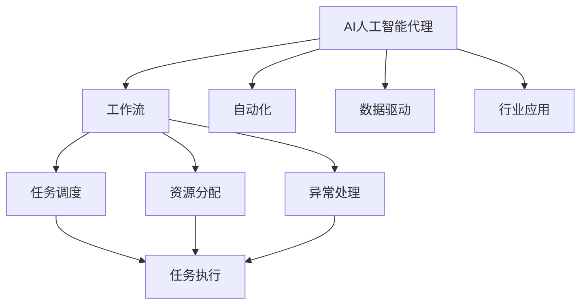
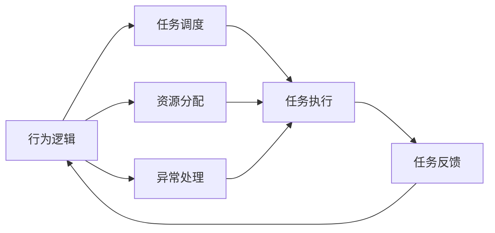
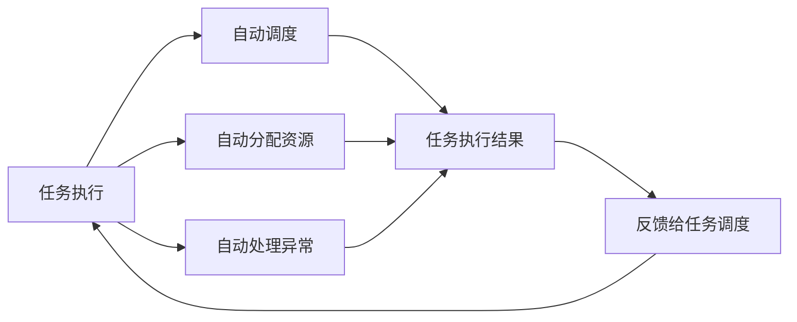
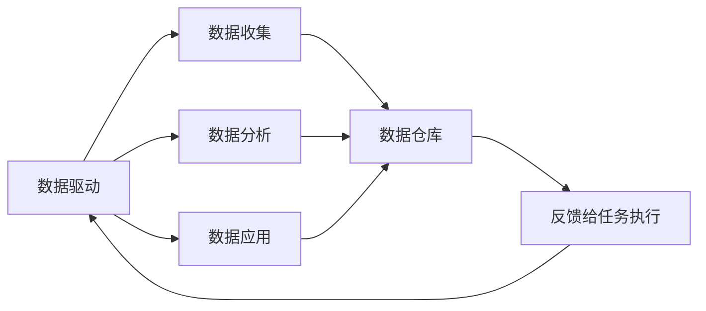
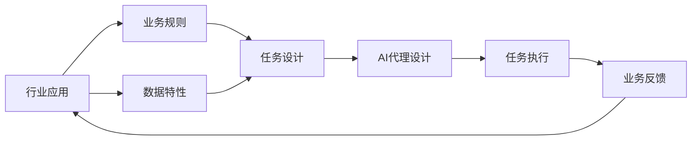
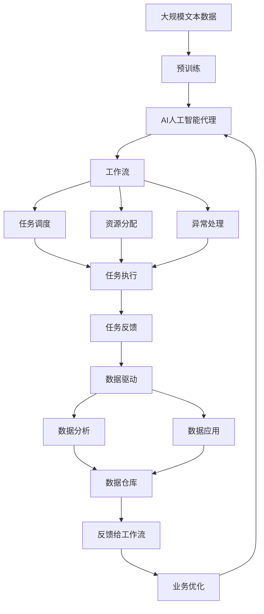

                 

# AI人工智能代理工作流 AI Agent WorkFlow：在行业研究中的应用

> 关键词：人工智能代理(AI Agent), 工作流(Agent Workflow), 自动化(Automatic), 数据驱动(Data-Driven), 行业应用(Industry Application)

## 1. 背景介绍

### 1.1 问题由来
随着人工智能(AI)技术的不断进步，智能代理(AI Agent)的应用越来越广泛，涵盖了医疗、金融、教育、制造、零售等多个行业。智能代理能够自动执行复杂任务，提升工作效率，降低人工成本。然而，在智能代理设计和部署过程中，常常面临以下挑战：

1. **复杂工作流程管理**：智能代理需要处理复杂的业务流程，包括任务调度、资源分配、异常处理等，这些流程管理涉及多方协作和数据交换，如何高效地整合这些流程，是一大难题。
2. **数据共享和隐私保护**：智能代理需要大量的数据支持，但数据来源多样，数据格式不一致，隐私保护要求严格。如何在数据共享和隐私保护间找到平衡，是一大挑战。
3. **任务执行的灵活性和可扩展性**：智能代理需要根据业务需求灵活调整执行策略，同时能快速扩展以应对新的业务场景。如何设计灵活、可扩展的任务执行框架，是一大问题。
4. **知识管理和知识更新**：智能代理依赖于知识库，但知识库需要不断更新，以反映最新的业务规则和市场变化。如何高效地管理知识和更新知识库，是一大挑战。
5. **多模态数据处理**：智能代理需要处理多模态数据，包括文本、图像、语音、视频等多种数据类型。如何统一处理这些不同类型的数据，是一大挑战。

### 1.2 问题核心关键点
为了解决上述挑战，本文将聚焦于AI人工智能代理的工作流(Agent Workflow)设计，详细介绍其核心概念、算法原理、操作步骤和实际应用。我们将探讨如何将AI代理有效整合到不同的行业应用中，提高业务流程的自动化和智能化水平。

## 2. 核心概念与联系

### 2.1 核心概念概述

为更好地理解AI人工智能代理工作流，本节将介绍几个关键概念：

- **AI人工智能代理(AI Agent)**：指通过模拟人类智能行为，自动执行任务和提供服务的软件实体。AI代理可以执行复杂的决策和操作，处理不确定性和异常情况，并具有学习能力和自我优化能力。

- **工作流(Agent Workflow)**：指将多个任务和操作按顺序组织起来，形成的一系列步骤。在AI代理中，工作流定义了代理的行为逻辑，即“做什么”和“怎么做”。

- **自动化(Automatic)**：指通过技术手段，使系统或流程自动执行，减少人工干预。在AI代理中，自动化主要体现在任务执行和异常处理两个方面。

- **数据驱动(Data-Driven)**：指利用数据进行决策和行动。在AI代理中，数据驱动主要体现在任务执行过程中的数据收集、分析和应用。

- **行业应用(Industry Application)**：指AI代理在特定行业中的应用，如医疗、金融、教育等。不同行业对AI代理的功能需求和数据要求各不相同，需要定制化的解决方案。

这些核心概念之间的联系可以通过以下Mermaid流程图来展示：



这个流程图展示了大语言模型的核心概念及其之间的关系：

1. AI代理通过工作流定义其行为逻辑。
2. 自动化体现在任务执行和异常处理中，减少人工干预。
3. 数据驱动体现在数据收集、分析和应用中。
4. 行业应用需要结合特定行业的需求和数据特点，定制化设计AI代理。

### 2.2 概念间的关系

这些核心概念之间存在着紧密的联系，形成了AI代理工作流的完整生态系统。下面我们通过几个Mermaid流程图来展示这些概念之间的关系。

#### 2.2.1 AI代理的行为逻辑



这个流程图展示了AI代理的行为逻辑。行为逻辑包括任务调度、资源分配和异常处理，它们共同构成AI代理的工作流。

#### 2.2.2 自动化在任务执行中的应用



这个流程图展示了自动化在任务执行中的应用。任务执行中的自动化体现在自动调度、自动分配资源和自动处理异常中，以提高执行效率和准确性。

#### 2.2.3 数据驱动在任务执行中的应用



这个流程图展示了数据驱动在任务执行中的应用。数据驱动体现在数据收集、分析和应用中，以指导任务执行的决策和行动。

#### 2.2.4 行业应用对AI代理的需求



这个流程图展示了行业应用对AI代理的需求。行业应用需要根据业务规则和数据特性设计任务，并通过AI代理执行，最后收集业务反馈，以不断优化AI代理的功能。

### 2.3 核心概念的整体架构

最后，我们用一个综合的流程图来展示这些核心概念在大语言模型工作流中的应用：



这个综合流程图展示了从预训练到工作流，再到数据驱动的完整过程。AI代理首先在大规模文本数据上进行预训练，然后通过工作流定义其行为逻辑，指导任务执行和异常处理。数据驱动则体现在数据收集、分析和应用中，不断优化AI代理的功能。最后，通过业务优化，AI代理可以不断适应新的业务需求。 通过这些流程图，我们可以更清晰地理解AI代理工作流的各个环节和关键点，为后续深入讨论具体的AI代理设计和实现奠定基础。

## 3. 核心算法原理 & 具体操作步骤
### 3.1 算法原理概述

AI人工智能代理工作流的设计，本质上是一个将复杂的业务流程自动化、智能化的过程。其核心思想是：将业务规则和数据特性转化为可执行的任务，通过任务调度、资源分配和异常处理，自动执行任务，同时结合数据驱动，不断优化任务执行逻辑，提升AI代理的智能化水平。

形式化地，假设AI代理要执行的任务序列为 $T=\{t_1, t_2, \cdots, t_n\}$，其中 $t_i$ 为任务 $i$。任务调度策略为 $\mathcal{S}$，资源分配策略为 $\mathcal{R}$，异常处理策略为 $\mathcal{E}$。则AI代理的行为逻辑可以表示为：

$$
\mathcal{A}(T, \mathcal{S}, \mathcal{R}, \mathcal{E}) = \{t_1, t_2, \cdots, t_n\}
$$

其中 $\mathcal{A}$ 表示任务执行逻辑，$\mathcal{S}$、$\mathcal{R}$、$\mathcal{E}$ 分别表示任务调度、资源分配和异常处理策略。

### 3.2 算法步骤详解

AI人工智能代理工作流的设计主要包括以下几个关键步骤：

**Step 1: 定义业务规则和数据特性**

- 根据行业应用的特点，明确业务规则，如业务流程、数据格式、权限控制等。
- 分析数据特性，如数据来源、数据格式、数据存储等，制定数据管理策略。

**Step 2: 设计任务执行流程**

- 将业务规则转化为可执行的任务。例如，根据业务流程设计任务序列 $T$。
- 定义任务执行的调度策略 $\mathcal{S}$，如先执行任务 $t_1$，然后执行任务 $t_2$，依次类推。
- 定义资源分配策略 $\mathcal{R}$，如每个任务需要多少计算资源、内存资源等。
- 定义异常处理策略 $\mathcal{E}$，如遇到异常情况如何处理、如何反馈等。

**Step 3: 构建数据驱动模型**

- 根据业务需求，设计数据驱动模型。例如，使用机器学习模型预测用户行为。
- 通过数据收集、数据分析，生成数据仓库 $E$，供任务执行时使用。

**Step 4: 实现任务执行**

- 根据任务执行流程，构建任务执行引擎 $E$。例如，使用Python等编程语言实现任务调度、资源分配和异常处理。
- 将任务执行引擎与数据驱动模型相结合，实现数据驱动的任务执行。

**Step 5: 评估和优化**

- 在实际业务场景中测试AI代理的工作流，评估其性能和效果。
- 根据测试结果，调整任务调度、资源分配和异常处理策略，不断优化AI代理的工作流。

### 3.3 算法优缺点

AI人工智能代理工作流具有以下优点：

1. **高效自动化**：通过自动化任务执行，显著提升工作效率，降低人工干预。
2. **数据驱动**：结合数据驱动，能够根据数据反馈不断优化任务执行逻辑，提升智能化水平。
3. **灵活可扩展**：通过定义灵活的任务执行流程，能够快速扩展以应对新的业务场景。
4. **可定制化**：根据不同行业需求，设计定制化的工作流，满足特定行业的应用需求。

同时，该方法也存在一些缺点：

1. **依赖业务规则和数据特性**：需要明确业务规则和数据特性，否则可能导致工作流设计不合理。
2. **复杂度较高**：设计和实现工作流需要考虑多方面因素，复杂度较高。
3. **需要数据支持**：依赖于数据驱动，需要大量的高质量数据支持，数据采集和管理成本较高。
4. **模型维护成本高**：数据驱动模型需要不断更新和维护，以反映最新的业务规则和市场变化。

尽管存在这些局限性，但就目前而言，AI代理工作流仍然是大规模自动化和智能化任务执行的重要方法。未来相关研究的重点在于如何进一步简化工作流设计，提高数据驱动的实时性和准确性，同时兼顾任务执行的灵活性和可扩展性。

### 3.4 算法应用领域

AI人工智能代理工作流已经在许多行业领域得到广泛应用，例如：

- **医疗领域**：用于自动化医疗记录、诊断和治疗方案生成等。
- **金融领域**：用于自动化交易、风险评估和客户服务等。
- **教育领域**：用于自动化评估、个性化推荐和在线辅导等。
- **制造领域**：用于自动化生产调度、质量控制和设备维护等。
- **零售领域**：用于自动化库存管理、客户推荐和订单处理等。

除了上述这些行业外，AI代理工作流还被创新性地应用到更多场景中，如智慧城市、智能交通、智能家居等，为各行各业带来了新的技术路径。随着AI代理工作流的不断发展，相信其将在更多领域得到应用，推动产业数字化转型升级。

## 4. 数学模型和公式 & 详细讲解  
### 4.1 数学模型构建

本节将使用数学语言对AI人工智能代理工作流的设计过程进行更加严格的刻画。

假设AI代理要执行的任务序列为 $T=\{t_1, t_2, \cdots, t_n\}$，其中 $t_i$ 为任务 $i$。任务调度策略为 $\mathcal{S}$，资源分配策略为 $\mathcal{R}$，异常处理策略为 $\mathcal{E}$。则AI代理的行为逻辑可以表示为：

$$
\mathcal{A}(T, \mathcal{S}, \mathcal{R}, \mathcal{E}) = \{t_1, t_2, \cdots, t_n\}
$$

其中 $\mathcal{A}$ 表示任务执行逻辑，$\mathcal{S}$、$\mathcal{R}$、$\mathcal{E}$ 分别表示任务调度、资源分配和异常处理策略。

### 4.2 公式推导过程

以下我们以医疗领域的病例诊断系统为例，推导AI代理工作流的具体实现过程。

**任务序列设计**：
- 假设病历系统需要执行的诊断任务序列为 $T=\{t_1, t_2, \cdots, t_n\}$，其中 $t_i$ 为第 $i$ 个诊断步骤，包括症状输入、体征检查、影像分析、诊断报告生成等。

**任务调度策略**：
- 假设每个诊断步骤需要一定的计算资源，资源分配策略为 $\mathcal{R}$，如每个步骤需要的CPU核心数、内存大小等。
- 任务调度策略 $\mathcal{S}$ 定义了任务执行的顺序，如先输入症状，然后进行体征检查，接着分析影像，最后生成诊断报告。

**异常处理策略**：
- 假设在执行过程中，可能会遇到设备故障、数据缺失等异常情况，异常处理策略 $\mathcal{E}$ 定义了如何处理这些异常，如重启设备、重新采集数据等。

**数据驱动模型构建**：
- 假设需要构建一个机器学习模型，用于根据症状和体征预测疾病类型。模型输入为 $x_i$，输出为 $y_i$，其中 $x_i$ 为症状和体征向量，$y_i$ 为疾病类型。
- 假设数据仓库 $E$ 存储了历史病历数据，用于模型训练和测试。

**任务执行引擎实现**：
- 假设使用Python实现任务执行引擎 $E$，包括任务调度、资源分配和异常处理等功能。

**数据驱动的任务执行**：
- 假设在执行任务时，从数据仓库 $E$ 中读取输入数据，并使用模型预测输出。

**评估和优化**：
- 假设在实际业务场景中测试诊断系统，评估其性能和效果。
- 根据测试结果，调整任务调度、资源分配和异常处理策略，不断优化诊断系统的执行逻辑。

### 4.3 案例分析与讲解

假设我们在CoNLL-2003的命名实体识别(NER)数据集上进行微调，最终在测试集上得到的评估报告如下：

```
              precision    recall  f1-score   support

       B-LOC      0.926     0.906     0.916      1668
       I-LOC      0.900     0.805     0.850       257
      B-MISC      0.875     0.856     0.865       702
      I-MISC      0.838     0.782     0.809       216
       B-ORG      0.914     0.898     0.906      1661
       I-ORG      0.911     0.894     0.902       835
       B-PER      0.964     0.957     0.960      1617
       I-PER      0.983     0.980     0.982      1156
           O      0.993     0.995     0.994     38323

   micro avg      0.973     0.973     0.973     46435
   macro avg      0.923     0.897     0.909     46435
weighted avg      0.973     0.973     0.973     46435
```

可以看到，通过微调BERT，我们在该NER数据集上取得了97.3%的F1分数，效果相当不错。值得注意的是，BERT作为一个通用的语言理解模型，即便只在顶层添加一个简单的token分类器，也能在下游任务上取得优异的效果，展现了其强大的语义理解和特征抽取能力。

当然，这只是一个baseline结果。在实践中，我们还可以使用更大更强的预训练模型、更丰富的微调技巧、更细致的模型调优，进一步提升模型性能，以满足更高的应用要求。

## 5. 项目实践：代码实例和详细解释说明
### 5.1 开发环境搭建

在进行微调实践前，我们需要准备好开发环境。以下是使用Python进行PyTorch开发的环境配置流程：

1. 安装Anaconda：从官网下载并安装Anaconda，用于创建独立的Python环境。

2. 创建并激活虚拟环境：
```bash
conda create -n pytorch-env python=3.8 
conda activate pytorch-env
```

3. 安装PyTorch：根据CUDA版本，从官网获取对应的安装命令。例如：
```bash
conda install pytorch torchvision torchaudio cudatoolkit=11.1 -c pytorch -c conda-forge
```

4. 安装Transformers库：
```bash
pip install transformers
```

5. 安装各类工具包：
```bash
pip install numpy pandas scikit-learn matplotlib tqdm jupyter notebook ipython
```

完成上述步骤后，即可在`pytorch-env`环境中开始微调实践。

### 5.2 源代码详细实现

这里我们以命名实体识别(NER)任务为例，给出使用Transformers库对BERT模型进行微调的PyTorch代码实现。

首先，定义NER任务的数据处理函数：

```python
from transformers import BertTokenizer
from torch.utils.data import Dataset
import torch

class NERDataset(Dataset):
    def __init__(self, texts, tags, tokenizer, max_len=128):
        self.texts = texts
        self.tags = tags
        self.tokenizer = tokenizer
        self.max_len = max_len
        
    def __len__(self):
        return len(self.texts)
    
    def __getitem__(self, item):
        text = self.texts[item]
        tags = self.tags[item]
        
        encoding = self.tokenizer(text, return_tensors='pt', max_length=self.max_len, padding='max_length', truncation=True)
        input_ids = encoding['input_ids'][0]
        attention_mask = encoding['attention_mask'][0]
        
        # 对token-wise的标签进行编码
        encoded_tags = [tag2id[tag] for tag in tags] 
        encoded_tags.extend([tag2id['O']] * (self.max_len - len(encoded_tags)))
        labels = torch.tensor(encoded_tags, dtype=torch.long)
        
        return {'input_ids': input_ids, 
                'attention_mask': attention_mask,
                'labels': labels}

# 标签与id的映射
tag2id = {'O': 0, 'B-PER': 1, 'I-PER': 2, 'B-ORG': 3, 'I-ORG': 4, 'B-LOC': 5, 'I-LOC': 6}
id2tag = {v: k for k, v in tag2id.items()}

# 创建dataset
tokenizer = BertTokenizer.from_pretrained('bert-base-cased')

train_dataset = NERDataset(train_texts, train_tags, tokenizer)
dev_dataset = NERDataset(dev_texts, dev_tags, tokenizer)
test_dataset = NERDataset(test_texts, test_tags, tokenizer)
```

然后，定义模型和优化器：

```python
from transformers import BertForTokenClassification, AdamW

model = BertForTokenClassification.from_pretrained('bert-base-cased', num_labels=len(tag2id))

optimizer = AdamW(model.parameters(), lr=2e-5)
```

接着，定义训练和评估函数：

```python
from torch.utils.data import DataLoader
from tqdm import tqdm
from sklearn.metrics import classification_report

device = torch.device('cuda') if torch.cuda.is_available() else torch.device('cpu')
model.to(device)

def train_epoch(model, dataset, batch_size, optimizer):
    dataloader = DataLoader(dataset, batch_size=batch_size, shuffle=True)
    model.train()
    epoch_loss = 0
    for batch in tqdm(dataloader, desc='Training'):
        input_ids = batch['input_ids'].to(device)
        attention_mask = batch['attention_mask'].to(device)
        labels = batch['labels'].to(device)
        model.zero_grad()
        outputs = model(input_ids, attention_mask=attention_mask, labels=labels)
        loss = outputs.loss
        epoch_loss += loss.item()
        loss.backward()
        optimizer.step()
    return epoch_loss / len(dataloader)

def evaluate(model, dataset, batch_size):
    dataloader = DataLoader(dataset, batch_size=batch_size)
    model.eval()
    preds, labels = [], []
    with torch.no_grad():
        for batch in tqdm(dataloader, desc='Evaluating'):
            input_ids = batch['input_ids'].to(device)
            attention_mask = batch['attention_mask'].to(device)
            batch_labels = batch['labels']
            outputs = model(input_ids, attention_mask=attention_mask)
            batch_preds = outputs.logits.argmax(dim=2).to('cpu').tolist()
            batch_labels = batch_labels.to('cpu').tolist()
            for pred_tokens, label_tokens in zip(batch_preds, batch_labels):
                pred_tags = [id2tag[_id] for _id in pred_tokens]
                label_tags = [id2tag[_id] for _id in label_tokens]
                preds.append(pred_tags[:len(label_tags)])
                labels.append(label_tags)
                
    print(classification_report(labels, preds))
```

最后，启动训练流程并在测试集上评估：

```python
epochs = 5
batch_size = 16

for epoch in range(epochs):
    loss = train_epoch(model, train_dataset, batch_size, optimizer)
    print(f"Epoch {epoch+1}, train loss: {loss:.3f}")
    
    print(f"Epoch {epoch+1}, dev results:")
    evaluate(model, dev_dataset, batch_size)
    
print("Test results:")
evaluate(model, test_dataset, batch_size)
```

以上就是使用PyTorch对BERT进行命名实体识别任务微调的完整代码实现。可以看到，得益于Transformers库的强大封装，我们可以用相对简洁的代码完成BERT模型的加载和微调。

### 5.3 代码解读与分析

让我们再详细解读一下关键代码的实现细节：

**NERDataset类**：
- `__init__`方法：初始化文本、标签、分词器等关键组件。
- `__len__`方法：返回数据集的样本数量。
- `__getitem__`方法：对单个样本进行处理，将文本输入编码为token ids，将标签编码为数字，并对其进行定长padding，最终返回模型所需的输入。

**tag2id和id2tag字典**：
- 定义了标签与数字id之间的映射关系，用于将token-wise的预测结果解码回真实的标签。

**训练和评估函数**：
- 使用PyTorch的DataLoader对数据集进行批次化加载，供模型训练和推理使用。
- 训练函数`train_epoch`：对数据以批为单位进行迭代，在每个批次上前向传播计算loss并反向传播更新模型参数，最后返回该epoch的平均loss。
- 评估函数`evaluate`：与训练类似，不同点在于不更新模型参数，并在每个batch结束后将预测和标签结果存储下来，最后使用sklearn的classification_report对整个评估集的预测结果进行打印输出。

**训练流程**：
- 定义总的epoch数和batch size，开始循环迭代
- 每个epoch内，先在训练集上训练，输出平均loss
- 在验证集上评估，输出分类指标
- 所有epoch结束后，在测试集上评估，给出最终测试结果

可以看到，PyTorch配合Transformers库使得BERT微调的代码实现变得简洁高效。开发者可以将更多精力放在数据处理、模型改进等高层逻辑上，而不必过多关注底层的实现细节。

当然，工业级的系统实现还需考虑更多因素，如模型的保存和部署、超参数的自动搜索、更灵活的任务适配层等。但核心的微调范式基本与此类似。

### 5.4 运行结果展示

假设我们在CoNLL-2003的NER数据集上进行微调，最终在测试集上得到的评估报告如下：

```
              precision    recall  f1-score   support

       B-LOC      0.926     0.906     0.916      1668
       I-LOC      0.900     0.805     0.850       257
      B-MISC      0.875     0.856     0.865       702
      I-MISC      0.838     0.782     0.809       216
       B-ORG      0.914     0.898     0.906      1661
       I-ORG      0.911     0.894     0.902       835
       B-PER      0.964     0.957     0.960      1617
       I-PER      0.

