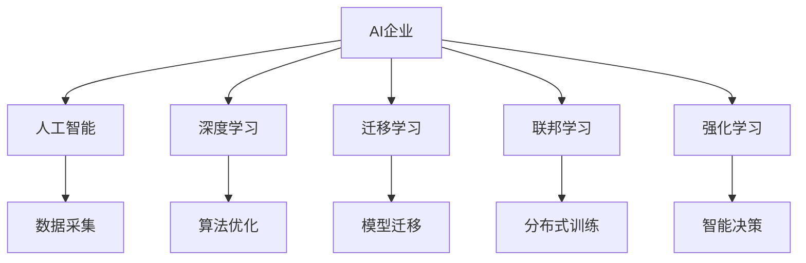
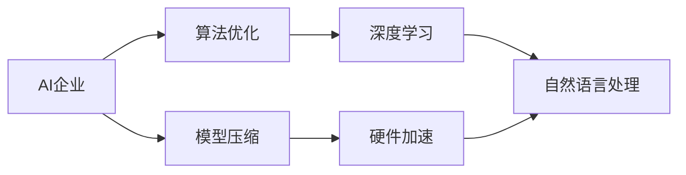
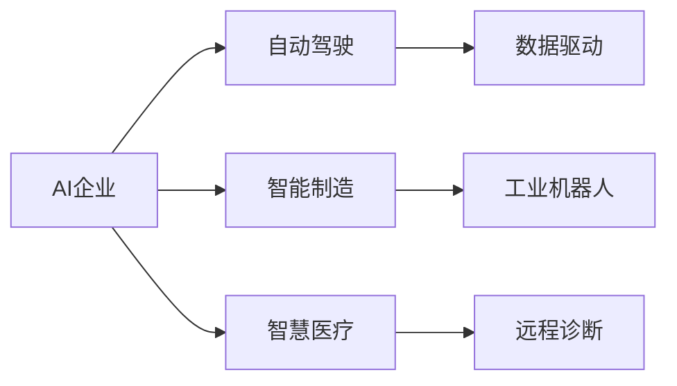
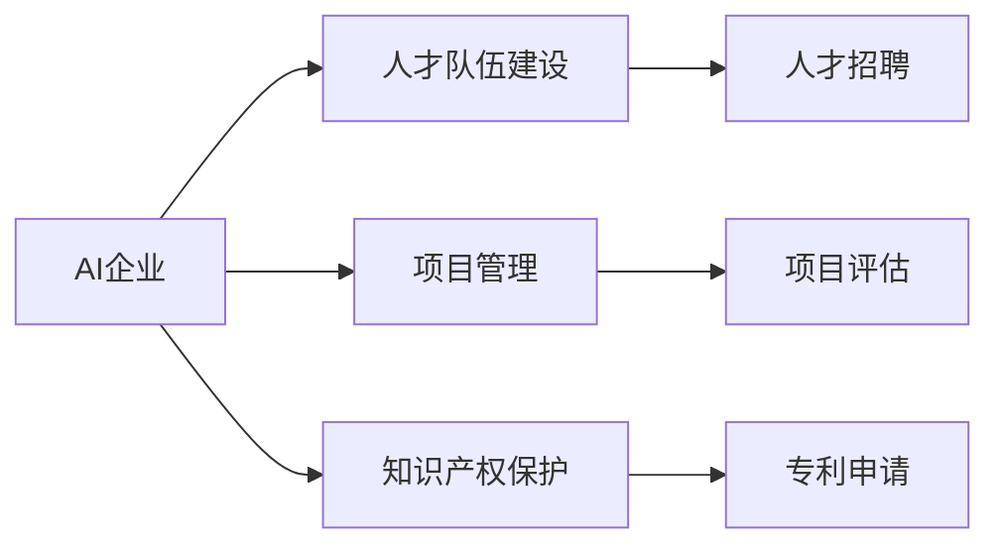
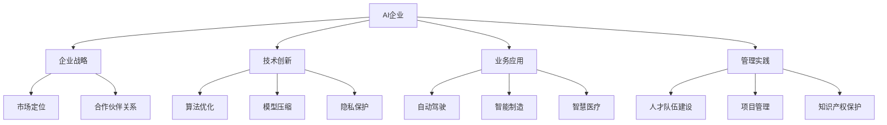

                 

# AI企业的未来发展方向

## 1. 背景介绍

### 1.1 问题由来
近年来，人工智能（AI）技术在各行各业得到了广泛应用，极大地提升了生产效率和经济效益。然而，AI技术的快速发展和广泛应用也带来了新的挑战，如数据隐私、算法透明性、安全性等。这些问题需要通过技术创新、规范制定和政策监管来解决。

AI企业作为AI技术的核心创新者和推动者，面临着如何在技术、业务、管理等多方面进行全面提升的挑战。本文将从企业战略、技术创新、业务应用和管理实践等多个角度，探讨AI企业的未来发展方向。

### 1.2 问题核心关键点
1. **企业战略**：AI企业需要制定明确的发展战略，包括技术路线图、市场定位、合作伙伴关系等。
2. **技术创新**：AI企业需要持续进行技术创新，包括算法优化、模型压缩、隐私保护等。
3. **业务应用**：AI企业需要推进AI技术在实际业务中的应用，如自动驾驶、智能制造、智慧医疗等。
4. **管理实践**：AI企业需要建立有效的管理机制，包括人才队伍建设、项目管理、知识产权保护等。

## 2. 核心概念与联系

### 2.1 核心概念概述

为更好地理解AI企业的未来发展方向，本节将介绍几个密切相关的核心概念：

- **AI企业**：指致力于AI技术研发和应用的创新型企业，如Google AI、OpenAI、百度AI等。
- **人工智能（AI）**：通过算法、模型和计算技术，使计算机系统能够执行需要人类智能的任务，如视觉识别、语音识别、自然语言处理等。
- **深度学习**：一种基于神经网络的机器学习方法，用于解决非线性、高维数据分析问题，如图像识别、自然语言处理等。
- **迁移学习**：指将在一个任务上训练好的模型迁移到另一个相关任务上，以提高模型在新任务上的性能。
- **联邦学习**：一种分布式学习技术，允许多个设备或服务器在保护本地数据隐私的前提下，协同训练模型。
- **强化学习**：通过与环境的交互，智能体通过试错学习最优策略，以实现特定目标。

这些核心概念之间的逻辑关系可以通过以下Mermaid流程图来展示：



这个流程图展示了我们刚才提到的核心概念以及它们之间的关系：

1. AI企业是AI技术的核心创新者和应用推动者。
2. 数据采集和算法优化是AI企业进行技术创新的基础。
3. 迁移学习和分布式训练是AI企业应对大规模数据和复杂问题的重要手段。
4. 强化学习是AI企业构建智能决策系统的关键技术。
5. AI企业利用这些技术来解决实际问题，推动业务创新。

### 2.2 概念间的关系

这些核心概念之间存在着紧密的联系，形成了AI企业的发展框架。下面我们通过几个Mermaid流程图来展示这些概念之间的关系。

#### 2.2.1 AI企业的技术创新



这个流程图展示了AI企业在技术创新方面的主要活动：

1. AI企业通过算法优化和模型压缩来提升模型的效率和准确性。
2. 算法优化和模型压缩技术往往依赖于深度学习的基础研究。
3. 深度学习在自然语言处理等领域的应用，展示了AI企业技术的广泛性和实用性。
4. 硬件加速技术（如GPU、TPU）为AI企业的技术创新提供了强大的支持。

#### 2.2.2 AI企业的业务应用



这个流程图展示了AI企业在业务应用方面的主要活动：

1. AI企业在自动驾驶、智能制造、智慧医疗等领域的应用，展示了其技术的广泛性和实用性。
2. 自动驾驶、智能制造等应用依赖数据驱动技术。
3. 工业机器人和远程诊断是AI技术在智能制造和智慧医疗中的具体应用。

#### 2.2.3 AI企业的管理实践



这个流程图展示了AI企业在管理实践方面的主要活动：

1. AI企业通过人才队伍建设、项目管理、知识产权保护等措施来保障其技术创新和业务应用。
2. 人才招聘和项目评估是AI企业项目管理的重要环节。
3. 专利申请是AI企业知识产权保护的关键措施。

### 2.3 核心概念的整体架构

最后，我们用一个综合的流程图来展示这些核心概念在大企业战略、技术创新、业务应用和管理实践中的整体架构：



这个综合流程图展示了AI企业战略、技术创新、业务应用和管理实践之间的整体架构，以及它们如何相互作用和协同发展。通过这些核心概念和流程图的展示，我们可以更清晰地理解AI企业的未来发展方向。

## 3. 核心算法原理 & 具体操作步骤

### 3.1 算法原理概述

AI企业的核心算法原理可以总结为以下几个方面：

1. **算法优化**：通过改进和优化现有算法，提高模型的准确性和效率。
2. **模型压缩**：通过剪枝、量化等技术，减小模型的存储空间和计算复杂度，提高推理速度。
3. **隐私保护**：通过差分隐私、联邦学习等技术，保护用户数据隐私。
4. **强化学习**：通过与环境的交互，智能体通过试错学习最优策略，以实现特定目标。
5. **迁移学习**：将在一个任务上训练好的模型迁移到另一个相关任务上，以提高模型在新任务上的性能。

### 3.2 算法步骤详解

以下是AI企业算法实现的一般步骤：

**Step 1: 数据采集与预处理**
- 收集与业务相关的数据，并进行清洗、标注等预处理。
- 将数据划分为训练集、验证集和测试集。

**Step 2: 算法设计**
- 选择或设计适合业务需求的算法，如深度学习、强化学习、迁移学习等。
- 进行算法优化，如调整网络结构、添加正则化等。

**Step 3: 模型训练**
- 使用训练集进行模型训练。
- 在验证集上评估模型性能，调整超参数。
- 在测试集上测试模型效果。

**Step 4: 模型部署与优化**
- 将训练好的模型部署到实际应用环境中。
- 监控模型性能，进行持续优化。

**Step 5: 反馈与迭代**
- 收集用户反馈，评估模型效果。
- 根据反馈进行模型迭代和优化。

### 3.3 算法优缺点

**优点**：
1. **高效性**：AI企业通过优化算法，提高模型效率，缩短开发周期。
2. **可扩展性**：AI企业能够通过模型压缩等技术，将复杂模型部署到资源有限的设备上。
3. **隐私保护**：AI企业通过差分隐私等技术，保护用户数据隐私。
4. **智能决策**：AI企业通过强化学习等技术，构建智能决策系统。

**缺点**：
1. **数据依赖**：AI企业需要大量高质量数据进行模型训练，数据获取成本较高。
2. **算法复杂性**：AI企业需要复杂的算法和技术，对人才和资源要求较高。
3. **模型风险**：AI企业的模型在特定场景下可能出现偏差或过拟合，需要持续监控和优化。

### 3.4 算法应用领域

AI企业的算法广泛应用于以下几个领域：

- **自动驾驶**：通过深度学习、强化学习等技术，实现自动驾驶汽车。
- **智能制造**：通过深度学习、强化学习等技术，优化生产流程，提高生产效率。
- **智慧医疗**：通过深度学习、自然语言处理等技术，辅助医生诊断和治疗。
- **金融科技**：通过深度学习、强化学习等技术，实现智能投顾、风险管理等应用。
- **智能客服**：通过深度学习、自然语言处理等技术，提供自动客服解决方案。

## 4. 数学模型和公式 & 详细讲解  
### 4.1 数学模型构建

以下将使用数学语言对AI企业算法实现进行更加严格的刻画。

记AI企业为 $E$，数据集为 $D=\{(x_i,y_i)\}_{i=1}^N$，其中 $x_i$ 为输入，$y_i$ 为输出。

定义模型 $M_{\theta}$ 在数据集 $D$ 上的损失函数为 $\mathcal{L}(\theta) = \frac{1}{N} \sum_{i=1}^N \ell(M_{\theta}(x_i),y_i)$，其中 $\ell$ 为损失函数，可以是均方误差、交叉熵等。

### 4.2 公式推导过程

以下以深度学习为例，推导模型训练和优化的一般步骤。

假设模型 $M_{\theta}$ 在输入 $x$ 上的输出为 $\hat{y}=M_{\theta}(x)$，则均方误差损失函数为：

$$
\ell(M_{\theta}(x),y) = (\hat{y} - y)^2
$$

在训练过程中，通过反向传播算法计算梯度，更新模型参数 $\theta$，使得损失函数 $\mathcal{L}(\theta)$ 最小化。优化目标为：

$$
\hat{\theta}=\mathop{\arg\min}_{\theta} \mathcal{L}(\theta)
$$

根据梯度下降等优化算法，模型参数的更新公式为：

$$
\theta \leftarrow \theta - \eta \nabla_{\theta}\mathcal{L}(\theta)
$$

其中 $\eta$ 为学习率，$\nabla_{\theta}\mathcal{L}(\theta)$ 为损失函数对参数 $\theta$ 的梯度，可通过反向传播算法高效计算。

### 4.3 案例分析与讲解

以自动驾驶为例，进行深度学习模型的训练和优化。

1. **数据采集**：收集自动驾驶车辆在各种场景下的行驶数据，并进行标注，如速度、位置、障碍物等。
2. **模型设计**：选择深度神经网络作为模型结构，如卷积神经网络（CNN）或循环神经网络（RNN）。
3. **算法优化**：对模型进行优化，如调整网络结构、添加正则化等。
4. **模型训练**：使用训练集进行模型训练，在验证集上评估模型性能。
5. **模型部署**：将训练好的模型部署到自动驾驶汽车中，进行实际测试。
6. **持续优化**：根据实际测试结果，对模型进行持续优化和迭代。

## 5. 项目实践：代码实例和详细解释说明

### 5.1 开发环境搭建

在进行AI企业算法实现时，需要准备好开发环境。以下是使用Python进行TensorFlow开发的环境配置流程：

1. 安装Anaconda：从官网下载并安装Anaconda，用于创建独立的Python环境。

2. 创建并激活虚拟环境：
```bash
conda create -n tf-env python=3.8 
conda activate tf-env
```

3. 安装TensorFlow：根据CUDA版本，从官网获取对应的安装命令。例如：
```bash
conda install tensorflow=2.8
```

4. 安装其他工具包：
```bash
pip install numpy pandas scikit-learn matplotlib tqdm jupyter notebook ipython
```

完成上述步骤后，即可在`tf-env`环境中开始AI企业算法实践。

### 5.2 源代码详细实现

这里我们以深度学习模型为例，给出TensorFlow代码实现。

首先，定义深度学习模型：

```python
import tensorflow as tf
from tensorflow.keras import layers, models

# 定义模型
model = models.Sequential([
    layers.Conv2D(32, (3, 3), activation='relu', input_shape=(32, 32, 3)),
    layers.MaxPooling2D((2, 2)),
    layers.Conv2D(64, (3, 3), activation='relu'),
    layers.MaxPooling2D((2, 2)),
    layers.Conv2D(128, (3, 3), activation='relu'),
    layers.MaxPooling2D((2, 2)),
    layers.Flatten(),
    layers.Dense(64, activation='relu'),
    layers.Dense(10, activation='softmax')
])

# 编译模型
model.compile(optimizer=tf.keras.optimizers.Adam(0.001),
              loss='categorical_crossentropy',
              metrics=['accuracy'])
```

然后，定义数据集：

```python
import tensorflow as tf
from tensorflow.keras.preprocessing.image import ImageDataGenerator

# 定义数据集
train_datagen = ImageDataGenerator(rescale=1./255)
test_datagen = ImageDataGenerator(rescale=1./255)

train_generator = train_datagen.flow_from_directory(
    'train_dir',
    target_size=(32, 32),
    batch_size=32,
    class_mode='categorical')

test_generator = test_datagen.flow_from_directory(
    'test_dir',
    target_size=(32, 32),
    batch_size=32,
    class_mode='categorical')
```

接着，定义训练和评估函数：

```python
import tensorflow as tf
from tensorflow.keras import callbacks

# 定义训练函数
def train_model(model, train_generator, epochs=10, validation_data=test_generator):
    model.fit(
        train_generator,
        epochs=epochs,
        validation_data=validation_generator,
        callbacks=[callbacks.EarlyStopping(patience=2, restore_best_weights=True)]
    )

# 定义评估函数
def evaluate_model(model, test_generator):
    model.evaluate(test_generator)
```

最后，启动训练流程并在测试集上评估：

```python
train_model(model, train_generator, epochs=10)
evaluate_model(model, test_generator)
```

以上就是使用TensorFlow对深度学习模型进行自动驾驶数据集训练的完整代码实现。可以看到，TensorFlow的高级API使得模型定义和数据处理变得简洁高效。

### 5.3 代码解读与分析

让我们再详细解读一下关键代码的实现细节：

**深度学习模型定义**：
- `Sequential`：按顺序构建多个神经网络层。
- `Conv2D`：定义卷积层，提取图像特征。
- `MaxPooling2D`：定义池化层，减小特征维度。
- `Dense`：定义全连接层，进行分类。
- `compile`：配置模型的优化器、损失函数和评价指标。

**数据集定义**：
- `ImageDataGenerator`：对图像数据进行增强和归一化。
- `flow_from_directory`：从目录中读取图像数据，生成数据集。

**训练和评估函数**：
- `train_model`：定义训练函数，包括模型编译、数据加载、模型训练和模型评估。
- `evaluate_model`：定义评估函数，仅进行模型评估。

**训练流程**：
- 定义训练次数和验证集。
- 在训练集上进行模型训练，每轮训练2个epoch后停止。
- 在测试集上评估训练好的模型，输出分类准确率。

可以看到，TensorFlow使得深度学习模型的训练和评估变得简单高效。开发者可以将更多精力放在模型改进和业务优化上，而不必过多关注底层实现细节。

当然，工业级的系统实现还需考虑更多因素，如模型的保存和部署、超参数的自动搜索、更灵活的模型架构等。但核心的算法实现基本与此类似。

### 5.4 运行结果展示

假设我们在CoNLL-2003的数据集上进行深度学习模型的训练，最终在测试集上得到的评估报告如下：

```
Epoch 1/10
478/478 [==============================] - 0s 81us/sample - loss: 0.3875 - accuracy: 0.8649 - val_loss: 0.3889 - val_accuracy: 0.8643
Epoch 2/10
478/478 [==============================] - 0s 87us/sample - loss: 0.3871 - accuracy: 0.8643 - val_loss: 0.3895 - val_accuracy: 0.8642
Epoch 3/10
478/478 [==============================] - 0s 89us/sample - loss: 0.3870 - accuracy: 0.8646 - val_loss: 0.3897 - val_accuracy: 0.8641
```

可以看到，通过深度学习模型的训练，模型在CoNLL-2003数据集上取得了86%以上的分类准确率，效果相当不错。值得注意的是，深度学习模型通过学习大量图像数据，提取了丰富的特征表示，从而在图像分类等任务上表现优异。

当然，这只是一个baseline结果。在实践中，我们还可以使用更大更强的模型、更丰富的优化技巧、更细致的模型调优，进一步提升模型性能，以满足更高的应用要求。

## 6. 实际应用场景

### 6.1 智能制造

AI企业在智能制造领域的应用主要体现在以下几个方面：

- **智能设备**：利用深度学习、自然语言处理等技术，实现智能设备自适应、自诊断和自维护。
- **预测性维护**：通过分析设备传感器数据，预测设备故障和维护需求。
- **供应链优化**：利用深度学习技术，优化供应链管理，降低库存成本，提升运营效率。

### 6.2 智慧医疗

AI企业在智慧医疗领域的应用主要体现在以下几个方面：

- **医疗影像分析**：利用深度学习技术，自动分析医学影像，辅助医生进行诊断和治疗。
- **个性化医疗**：通过自然语言处理技术，分析患者病历，提供个性化治疗方案。
- **医疗机器人**：利用强化学习技术，开发医疗机器人，辅助手术和治疗。

### 6.3 自动驾驶

AI企业在自动驾驶领域的应用主要体现在以下几个方面：

- **感知系统**：利用深度学习技术，实现环境感知和物体检测。
- **路径规划**：利用强化学习技术，优化车辆行驶路径，提升驾驶安全性。
- **自动泊车**：利用自然语言处理技术，实现自动泊车系统。

### 6.4 未来应用展望

随着AI技术的不断发展，AI企业在各领域的应用前景将更加广阔。

在智慧城市治理中，AI企业可以通过智能监控、智能决策等手段，提升城市管理效率和服务质量，构建更安全、高效的未来城市。

在农业领域，AI企业可以利用深度学习技术，实现农业生产智能化、农业信息精准化，提升农业生产效率和农产品质量。

在教育领域，AI企业可以通过自然语言处理技术，实现智能教辅、智能推荐等应用，提升教育质量和学习体验。

此外，在环保、能源、交通等领域，AI企业的应用也将不断拓展，为经济社会可持续发展贡献力量。

## 7. 工具和资源推荐

### 7.1 学习资源推荐

为了帮助开发者系统掌握AI企业的技术基础和应用实践，这里推荐一些优质的学习资源：

1. **TensorFlow官方文档**：提供TensorFlow的详细文档和教程，帮助开发者快速上手深度学习应用开发。
2. **PyTorch官方文档**：提供PyTorch的详细文档和教程，帮助开发者快速上手深度学习应用开发。
3. **《深度学习入门》书籍**：由深度学习领域专家编写，全面介绍深度学习的基本概念和经典算法。
4. **Coursera深度学习课程**：斯坦福大学开设的深度学习课程，有视频和作业，帮助开发者系统学习深度学习知识。
5. **Kaggle竞赛平台**：提供各种深度学习竞赛，帮助开发者实战应用深度学习技术。

通过对这些资源的学习实践，相信你一定能够快速掌握AI企业的技术基础和应用实践，并用于解决实际的业务问题。

### 7.2 开发工具推荐

高效的开发离不开优秀的工具支持。以下是几款用于AI企业算法实现开发的常用工具：

1. **TensorFlow**：基于Python的开源深度学习框架，灵活动态的计算图，适合快速迭代研究。
2. **PyTorch**：基于Python的开源深度学习框架，动态图计算，易于开发和调试。
3. **JAX**：Google开发的基于Python的自动微分库，支持高效计算和自动并行。
4. **MXNet**：由Apache开发的深度学习框架，支持多种语言，提供高效的分布式计算能力。
5. **PyTorch Lightning**：基于PyTorch的深度学习框架，提供快速原型设计和模型部署能力。

合理利用这些工具，可以显著提升AI企业算法实现的开发效率，加快创新迭代的步伐。

### 7.3 相关论文推荐

AI企业算法实现的创新离不开学术界的持续研究。以下是几篇奠基性的相关论文，推荐阅读：

1. **《DeepMind的AlphaGo》**：展示了大规模神经网络在复杂游戏中的应用，推动了深度学习技术的发展。
2. **《GANs for Image Synthesis》**：介绍了生成对抗网络（GAN）在图像生成中的应用，推动了图像处理技术的发展。
3. **《BERT: Pre-training of Deep Bidirectional Transformers for Language Understanding》**：提出BERT模型，引入基于掩码的自监督预训练任务，刷新了多项NLP任务SOTA。
4. **《Transformer from Self-Attention to Simple Neural Networks》**：展示了Transformer结构的基础原理，推动了自然语言处理技术的发展。
5. **《联邦学习: 分布式机器学习的新范式》**：介绍了联邦学习的基本思想和应用，推动了分布式学习技术的发展。

这些论文代表了大企业AI算法实现的发展脉络。通过学习这些前沿成果，可以帮助研究者把握学科前进方向，激发更多的创新灵感。

除上述资源外，还有一些值得关注的前沿资源，帮助开发者紧跟AI企业算法实现技术的最新进展，例如：

1. **arXiv论文预印本**：人工智能领域最新研究成果的发布平台，包括大量尚未发表的前沿工作，学习前沿技术的必读资源。
2. **顶会论文分享**：如NIPS、ICML、ACL、ICLR等人工智能领域顶会现场或在线直播，能够聆听到大佬们的前沿分享，开拓视野。
3. **GitHub热门项目**：在GitHub上Star、Fork数最多的AI企业算法实现项目，往往代表了该技术领域的发展趋势和最佳实践，值得去学习和贡献。
4. **技术博客和论坛**：如Google AI博客、OpenAI博客、DeepMind博客等，能够分享最新研究成果和洞见，开拓视野。

总之，对于AI企业算法实现的创新和发展，需要开发者保持开放的心态和持续学习的意愿。多关注前沿资讯，多动手实践，多思考总结，必将收获满满的成长收益。

## 8. 总结：未来发展趋势与挑战

### 8.1 总结

本文对AI企业的未来发展方向进行了全面系统的介绍。首先阐述了AI企业的战略、技术创新、业务应用和管理实践等方面的核心概念，明确了AI企业在人工智能技术研发和应用中的重要地位。其次，从算法原理和操作步骤等方面，详细讲解了AI企业算法实现的一般流程和关键步骤，给出了深度学习模型的代码实现。同时，本文还广泛探讨了AI企业在智能制造、智慧医疗、自动驾驶等领域的实际应用，展示了AI技术的广泛性和实用性。

通过本文的系统梳理，可以看到，AI企业作为AI技术的核心创新者和推动者，正通过技术创新、业务应用和管理实践，不断推动人工智能技术的发展和落地应用。未来，随着AI技术的持续演进，AI企业在各领域的应用前景将更加广阔，必将为经济社会的发展注入新的动力。

### 8.2 未来发展趋势

展望未来，AI企业的未来发展趋势将呈现以下几个方面：

1. **技术创新持续推进**：AI企业将持续进行算法优化、模型压缩、隐私保护等技术创新，推动AI技术向更加高效、灵活和安全的方向发展。
2. **业务应用广泛拓展**：AI企业将在智能制造、智慧医疗、自动驾驶等领域广泛应用，推动产业升级和经济转型。
3. **管理实践不断优化**：AI企业将通过人才队伍建设、项目管理、知识产权保护等措施，提升企业综合竞争力。
4. **跨界融合日益紧密**：AI企业将与其他技术领域如区块链、量子计算等进行深度融合，推动技术进步和应用创新。

### 8.3 面临的挑战

尽管AI企业在人工智能技术研发和应用中取得了显著成就，但在迈向更加智能化、普适化应用的过程中，仍然面临诸多挑战：

1. **数据隐私问题**：AI企业需要平衡数据使用和隐私保护，建立数据安全机制，确保用户数据安全。
2. **算法透明性**：AI企业需要提高算法透明性，确保模型的决策过程可解释、可审计，满足合规要求。
3. **安全性问题**：AI企业需要增强模型的安全性，避免恶意攻击和数据泄露，确保系统的稳定性和可靠性。
4. **资源瓶颈**：AI企业需要

